# API Reference

<cite>
**Referenced Files in This Document**
- [urls.py](file://backend/config/urls.py)
- [base.py](file://backend/config/settings/base.py)
- [tenants/models.py](file://backend/apps/tenants/models.py)
- [tenants/services.py](file://backend/apps/tenants/services.py)
- [devices/models.py](file://backend/apps/devices/models.py)
- [measurements/models.py](file://backend/apps/measurements/models.py)
- [alerts/models.py](file://backend/apps/alerts/models.py)
- [tasks/models.py](file://backend/apps/tasks/models.py)
- [locations/models.py](file://backend/apps/locations/models.py)
- [plants/models.py](file://backend/apps/plants/models.py)
- [planters/models.py](file://backend/apps/planters/models.py)
</cite>

## Table of Contents
1. [Introduction](#introduction)
2. [Project Structure](#project-structure)
3. [Core Components](#core-components)
4. [Architecture Overview](#architecture-overview)
5. [Detailed Component Analysis](#detailed-component-analysis)
6. [Dependency Analysis](#dependency-analysis)
7. [Performance Considerations](#performance-considerations)
8. [Troubleshooting Guide](#troubleshooting-guide)
9. [Conclusion](#conclusion)
10. [Appendices](#appendices)

## Introduction
This document provides a comprehensive API reference for the PlantOps multi-tenant SaaS platform. It covers RESTful endpoint categories, authentication and authorization, pagination, filtering/search, rate limiting, versioning, and OpenAPI/Swagger integration. The API follows a Domain-Driven Design (DDD) approach with bounded contexts for tenants, devices, measurements, alerts, tasks, locations, planters, and plants. The system uses Django REST Framework with drf-spectacular for schema generation and Swagger UI.

## Project Structure
The API surface is currently declared in the central URL router and schema endpoints. Individual bounded-context APIs are stubbed and awaiting wiring as development progresses. The schema endpoints expose OpenAPI documents for interactive documentation.

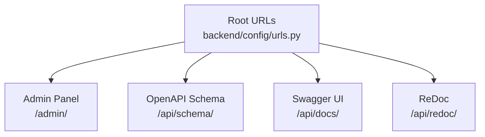

**Diagram sources**
- [urls.py:12-23](file://backend/config/urls.py#L12-L23)

**Section sources**
- [urls.py:12-38](file://backend/config/urls.py#L12-L38)

## Core Components
- Authentication and Authorization
  - Session-based authentication is enabled by default.
  - All endpoints require authentication by default.
- Pagination
  - PageNumberPagination with PAGE_SIZE set to 50.
- OpenAPI/Swagger
  - Schema endpoint: /api/schema/
  - Swagger UI: /api/docs/
  - ReDoc: /api/redoc/
- Multi-Tenancy
  - Tenant isolation via django-tenants with separate PostgreSQL schemas per tenant.
  - Tenant model and primary domain mapping are defined.

**Section sources**
- [base.py:234-250](file://backend/config/settings/base.py#L234-L250)
- [tenants/models.py:6-53](file://backend/apps/tenants/models.py#L6-L53)
- [tenants/models.py:56-76](file://backend/apps/tenants/models.py#L56-L76)

## Architecture Overview
The API architecture is organized around bounded contexts. The current URL configuration declares schema endpoints and includes placeholders for each domain’s API routes. The tenant model and domain model define multi-tenancy behavior.

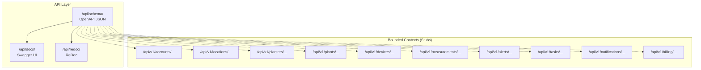

**Diagram sources**
- [urls.py:21-37](file://backend/config/urls.py#L21-L37)

**Section sources**
- [urls.py:21-37](file://backend/config/urls.py#L21-L37)

## Detailed Component Analysis

### Tenant Management
Purpose: Provision and manage tenants and their domains. All tenant mutations must go through the services layer.

Endpoints (provisional, subject to wiring):
- POST /api/v1/tenants/
- GET /api/v1/tenants/{id}/
- PUT /api/v1/tenants/{id}/
- DELETE /api/v1/tenants/{id}/

Tenant Creation Flow
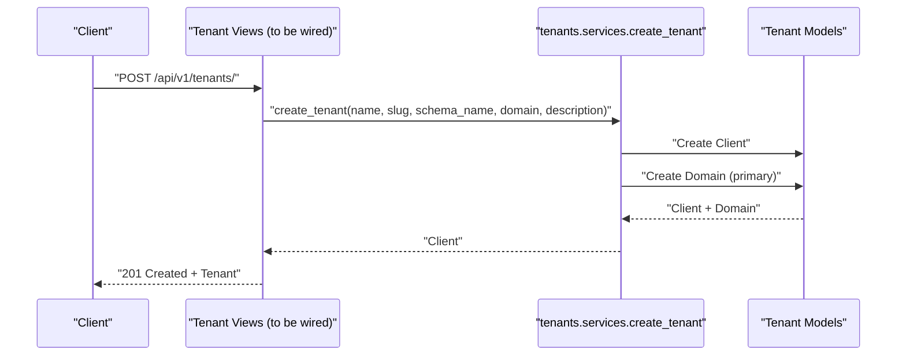

**Diagram sources**
- [tenants/services.py:11-35](file://backend/apps/tenants/services.py#L11-L35)
- [tenants/models.py:6-53](file://backend/apps/tenants/models.py#L6-L53)
- [tenants/models.py:56-76](file://backend/apps/tenants/models.py#L56-L76)

Tenant Deactivation Flow
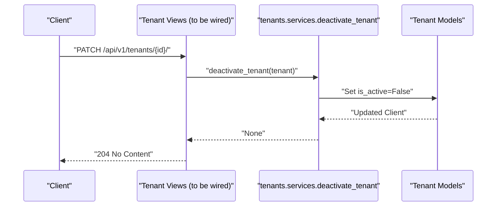

**Diagram sources**
- [tenants/services.py:38-42](file://backend/apps/tenants/services.py#L38-L42)
- [tenants/models.py:6-53](file://backend/apps/tenants/models.py#L6-L53)

Tenant Data Model
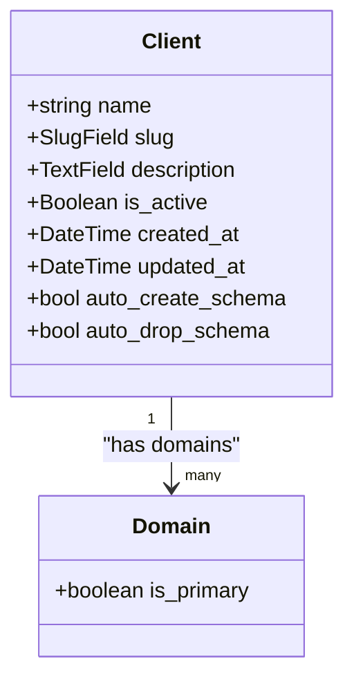

**Diagram sources**
- [tenants/models.py:6-53](file://backend/apps/tenants/models.py#L6-L53)
- [tenants/models.py:56-76](file://backend/apps/tenants/models.py#L56-L76)

**Section sources**
- [tenants/services.py:11-42](file://backend/apps/tenants/services.py#L11-L42)
- [tenants/models.py:6-76](file://backend/apps/tenants/models.py#L6-L76)

### Device Registration
Purpose: Manage IoT device definitions and metadata. Devices are placeholders for future fields such as hardware identifiers, firmware, and assignments.

Endpoints (provisional):
- POST /api/v1/devices/
- GET /api/v1/devices/{id}/
- PUT /api/v1/devices/{id}/
- DELETE /api/v1/devices/{id}/

Device Data Model
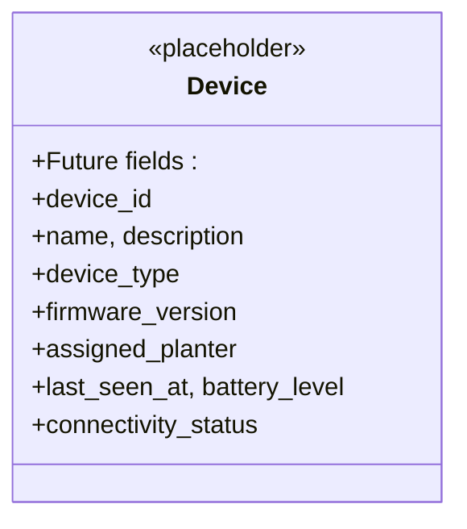

**Diagram sources**
- [devices/models.py:12-29](file://backend/apps/devices/models.py#L12-L29)

**Section sources**
- [devices/models.py:12-29](file://backend/apps/devices/models.py#L12-L29)

### Sensor Data Ingestion
Purpose: Ingest raw sensor readings from devices. Readings are append-only and must not be updated or deleted.

Endpoints (provisional):
- POST /api/v1/measurements/raw/
- GET /api/v1/measurements/raw/{id}/

Raw Reading Data Model
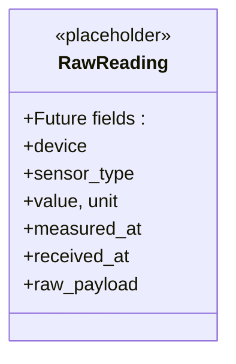

**Diagram sources**
- [measurements/models.py:14-30](file://backend/apps/measurements/models.py#L14-L30)

**Section sources**
- [measurements/models.py:14-30](file://backend/apps/measurements/models.py#L14-L30)

### Alert Management
Purpose: Manage alert definitions and alert instances. Alert events are append-only.

Endpoints (provisional):
- POST /api/v1/alerts/
- GET /api/v1/alerts/{id}/
- PATCH /api/v1/alerts/{id}/acknowledge
- PATCH /api/v1/alerts/{id}/resolve

Alert Data Model
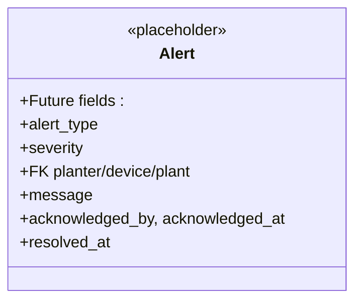

**Diagram sources**
- [alerts/models.py:13-29](file://backend/apps/alerts/models.py#L13-L29)

**Section sources**
- [alerts/models.py:13-29](file://backend/apps/alerts/models.py#L13-L29)

### Task Assignment
Purpose: Manage tasks generated by the system or created manually. Tasks can be assigned to users and tracked by status and priority.

Endpoints (provisional):
- POST /api/v1/tasks/
- GET /api/v1/tasks/{id}/
- PATCH /api/v1/tasks/{id}/assign
- PATCH /api/v1/tasks/{id}/complete

Task Data Model
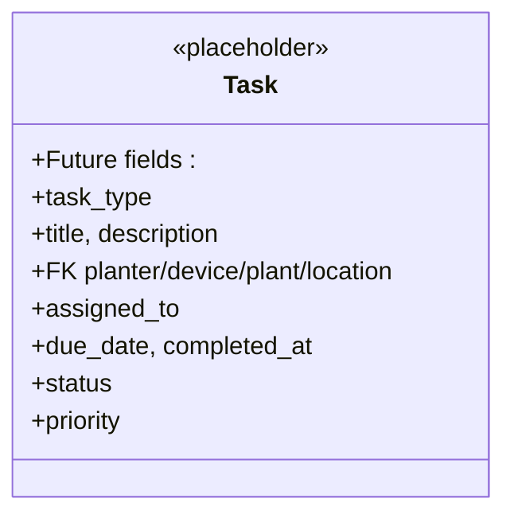

**Diagram sources**
- [tasks/models.py:12-29](file://backend/apps/tasks/models.py#L12-L29)

**Section sources**
- [tasks/models.py:12-29](file://backend/apps/tasks/models.py#L12-L29)

### Locations
Purpose: Define physical locations (sites, greenhouses, indoor areas) where planters and devices are installed.

Endpoints (provisional):
- POST /api/v1/locations/
- GET /api/v1/locations/{id}/
- PUT /api/v1/locations/{id}/
- DELETE /api/v1/locations/{id}/

Location Data Model
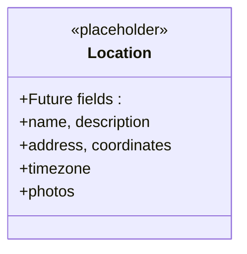

**Diagram sources**
- [locations/models.py:12-26](file://backend/apps/locations/models.py#L12-L26)

**Section sources**
- [locations/models.py:12-26](file://backend/apps/locations/models.py#L12-L26)

### Planters
Purpose: Manage planter/container definitions, inventory, and status.

Endpoints (provisional):
- POST /api/v1/planters/
- GET /api/v1/planters/{id}/
- PUT /api/v1/planters/{id}/
- DELETE /api/v1/planters/{id}/

Planter Data Model
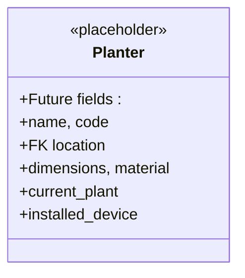

**Diagram sources**
- [planters/models.py:12-27](file://backend/apps/planters/models.py#L12-L27)

**Section sources**
- [planters/models.py:12-27](file://backend/apps/planters/models.py#L12-L27)

### Plants
Purpose: Manage plant species, varieties, care profiles, and plant instances.

Endpoints (provisional):
- POST /api/v1/plants/
- GET /api/v1/plants/{id}/
- PUT /api/v1/plants/{id}/
- DELETE /api/v1/plants/{id}/

Plant Species Data Model
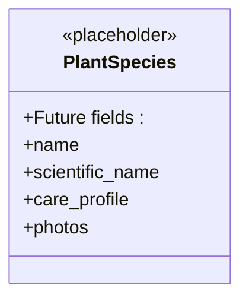

**Diagram sources**
- [plants/models.py:12-26](file://backend/apps/plants/models.py#L12-L26)

**Section sources**
- [plants/models.py:12-26](file://backend/apps/plants/models.py#L12-L26)

## Dependency Analysis
- Tenant isolation is enforced by django-tenants middleware and database routers.
- All tenant-related models and services are defined under the tenants app.
- Bounded context APIs are declared as stubs in the URL configuration and will be wired as development progresses.

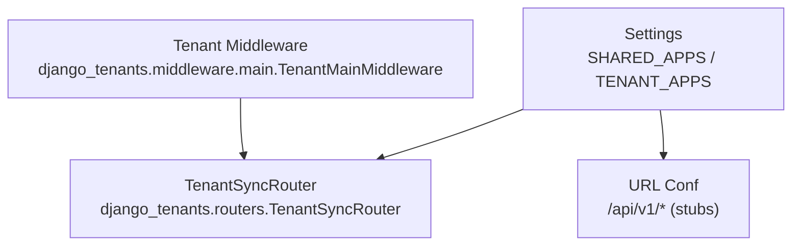

**Diagram sources**
- [base.py:107-119](file://backend/config/settings/base.py#L107-L119)
- [base.py:92-94](file://backend/config/settings/base.py#L92-L94)
- [urls.py:27-37](file://backend/config/urls.py#L27-L37)

**Section sources**
- [base.py:92-119](file://backend/config/settings/base.py#L92-L119)
- [urls.py:27-37](file://backend/config/urls.py#L27-L37)

## Performance Considerations
- Pagination: PageNumberPagination with PAGE_SIZE 50 is configured globally.
- Filtering/Search: Not yet implemented; consider adding filters at the serializer/view level as APIs mature.
- Rate Limiting: Not configured; introduce throttling policies per domain or endpoint as load increases.
- Caching: Consider caching read-heavy lists (e.g., locations, planters) to reduce DB load.

## Troubleshooting Guide
- Authentication failures: Ensure session cookies are sent and SameSite/CORS settings are aligned with your client origin.
- Schema generation: Access /api/schema/ to validate OpenAPI JSON; /api/docs/ and /api/redoc/ for interactive docs.
- Multi-tenancy routing: Confirm the tenant domain mapping and schema creation are functioning as expected.

**Section sources**
- [base.py:234-250](file://backend/config/settings/base.py#L234-L250)
- [urls.py:21-23](file://backend/config/urls.py#L21-L23)

## Conclusion
The PlantOps API is structured around bounded contexts with strong multi-tenancy support and a clear path to schema-driven documentation via drf-spectacular. While most domain APIs are currently stubbed, the foundational pieces (authentication, pagination, schema endpoints, and tenant models) are in place. As development progresses, wire the /api/v1/* endpoints and implement domain-specific serializers, views, and permissions.

## Appendices

### Authentication and Authorization
- Mechanism: SessionAuthentication
- Requirement: IsAuthenticated for all endpoints
- Notes: Role-based access control is not defined in the current settings; implement custom permissions or scopes as needed.

**Section sources**
- [base.py:236-241](file://backend/config/settings/base.py#L236-L241)

### Pagination
- Mechanism: PageNumberPagination
- Default page size: 50
- Behavior: Clients should use page and page_size query params.

**Section sources**
- [base.py:242-243](file://backend/config/settings/base.py#L242-L243)

### OpenAPI/Swagger Integration
- Schema: /api/schema/
- Swagger UI: /api/docs/
- ReDoc: /api/redoc/
- Version: 0.1.0

**Section sources**
- [urls.py:21-23](file://backend/config/urls.py#L21-L23)
- [base.py:255-262](file://backend/config/settings/base.py#L255-L262)

### API Versioning and Deprecation
- Current version: v1 (URL prefix /api/v1/)
- Policy: Not defined; adopt semantic versioning and maintain backward compatibility for at least one minor release after deprecating endpoints.

**Section sources**
- [urls.py:28-37](file://backend/config/urls.py#L28-L37)

### Request/Response Examples

Note: The following examples describe typical payloads and outcomes. Replace with actual serialized schemas once endpoints are implemented.

- Tenant Creation
  - Method: POST
  - URL: /api/v1/tenants/
  - Request body: { "name": "...", "slug": "...", "schema_name": "...", "domain": "...", "description": "..." }
  - Response: 201 Created with tenant resource

- Device Registration
  - Method: POST
  - URL: /api/v1/devices/
  - Request body: { "device_id": "...", "name": "...", "device_type": "...", "firmware_version": "...", "assigned_planter": 1 }
  - Response: 201 Created with device resource

- Sensor Data Ingestion
  - Method: POST
  - URL: /api/v1/measurements/raw/
  - Request body: { "device": 1, "sensor_type": "...", "value": 42.0, "unit": "...", "measured_at": "...", "raw_payload": "{}" }
  - Response: 201 Created with raw reading resource

- Alert Management
  - Method: POST
  - URL: /api/v1/alerts/
  - Request body: { "alert_type": "...", "severity": "...", "planter": 1, "message": "..." }
  - Response: 201 Created with alert resource

- Task Assignment
  - Method: POST
  - URL: /api/v1/tasks/
  - Request body: { "task_type": "...", "title": "...", "description": "...", "planter": 1, "due_date": "...", "priority": "..." }
  - Response: 201 Created with task resource

- Location Creation
  - Method: POST
  - URL: /api/v1/locations/
  - Request body: { "name": "...", "description": "...", "address": "...", "coordinates": "...", "timezone": "..." }
  - Response: 201 Created with location resource

- Planter Creation
  - Method: POST
  - URL: /api/v1/planters/
  - Request body: { "name": "...", "code": "...", "location": 1, "dimensions": "...", "material": "..." }
  - Response: 201 Created with planter resource

- Plant Species Creation
  - Method: POST
  - URL: /api/v1/plants/
  - Request body: { "name": "...", "scientific_name": "...", "care_profile": "{}", "photos": [] }
  - Response: 201 Created with plant species resource