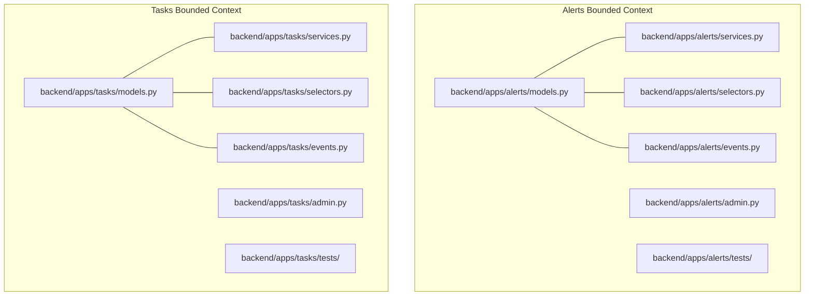
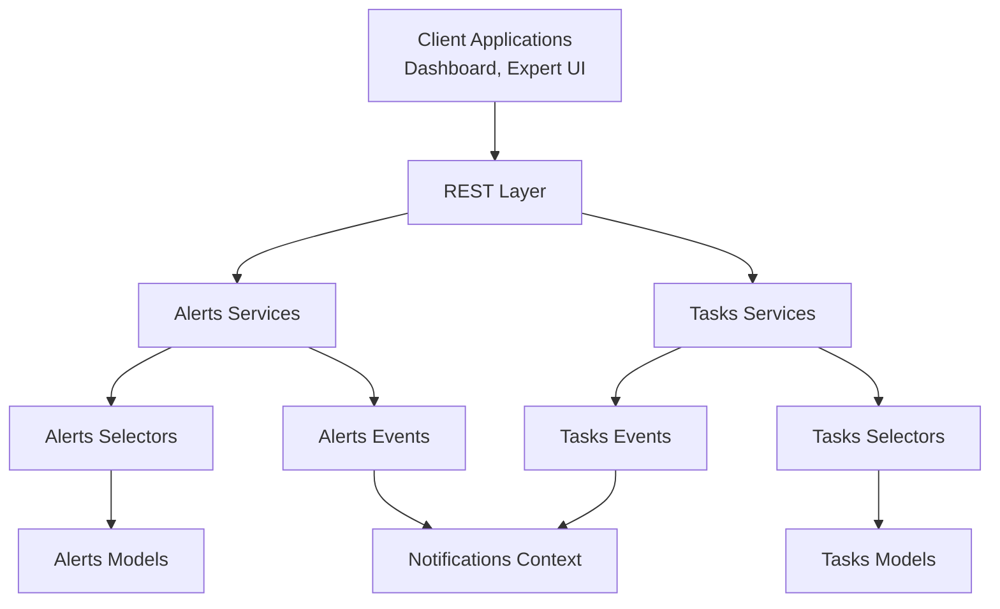
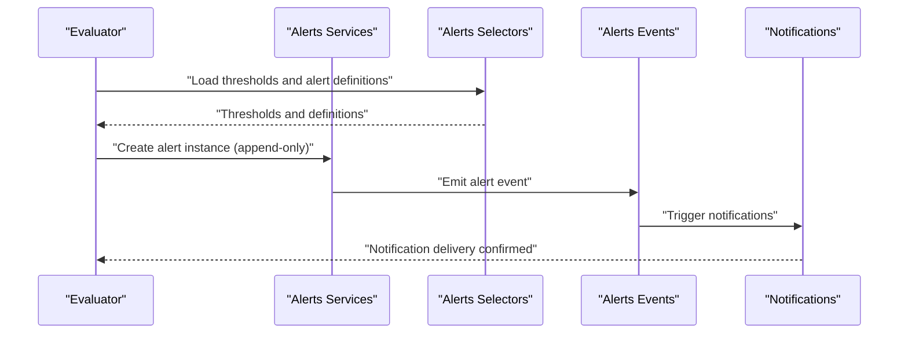
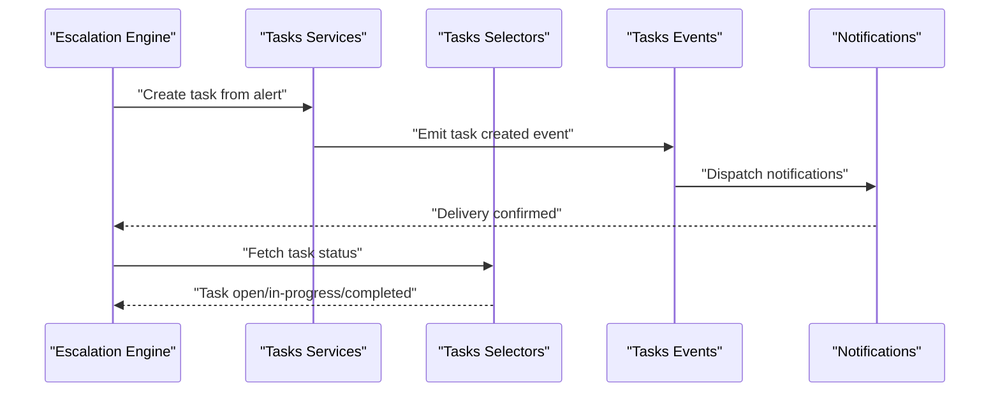
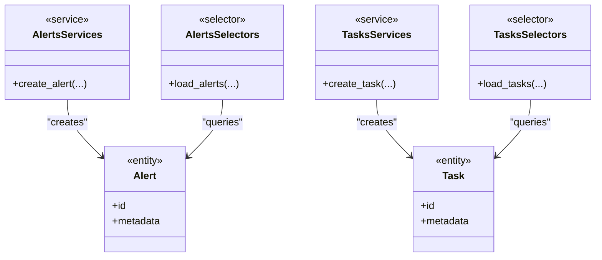
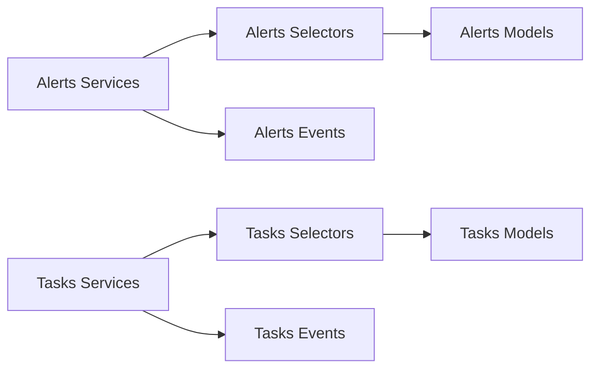

# Alert & Task Management API

<cite>
**Referenced Files in This Document**
- [models.py](file://backend/apps/alerts/models.py)
- [services.py](file://backend/apps/alerts/services.py)
- [selectors.py](file://backend/apps/alerts/selectors.py)
- [models.py](file://backend/apps/tasks/models.py)
- [services.py](file://backend/apps/tasks/services.py)
- [selectors.py](file://backend/apps/tasks/selectors.py)
</cite>

## Table of Contents
1. [Introduction](#introduction)
2. [Project Structure](#project-structure)
3. [Core Components](#core-components)
4. [Architecture Overview](#architecture-overview)
5. [Detailed Component Analysis](#detailed-component-analysis)
6. [Dependency Analysis](#dependency-analysis)
7. [Performance Considerations](#performance-considerations)
8. [Troubleshooting Guide](#troubleshooting-guide)
9. [Conclusion](#conclusion)

## Introduction
This document describes the Alert and Task Management APIs within the backend bounded contexts. It focuses on alert definition and evaluation, threshold configuration, alert instance lifecycle, and the task creation, assignment, and resolution workflows. It also outlines escalation procedures, routing algorithms, and notification triggers, along with examples and automation patterns. The system follows a clean architecture with separate write (services) and read (selectors) layers for both alerts and tasks.

## Project Structure
The Alert and Task Management capabilities are implemented as Django applications under backend/apps/. Each bounded context provides:
- models.py: Domain entity definitions and metadata
- services.py: Write operations (mutations) governed by strict rules
- selectors.py: Read operations (queries) centralized for testability
- admin.py: Administrative interface registration (placeholder in current state)
- events.py: Event definitions for cross-context integrations
- tests/: Unit and integration tests
- apps.py: Application configuration
- translation.py: Optional localization support

**Diagram sources**
- [models.py:1-29](file://backend/apps/alerts/models.py#L1-L29)
- [services.py:1-9](file://backend/apps/alerts/services.py#L1-L9)
- [selectors.py:1-7](file://backend/apps/alerts/selectors.py#L1-L7)
- [admin.py:1-3](file://backend/apps/alerts/admin.py#L1-L3)
- [events.py](file://backend/apps/alerts/events.py)
- [models.py:1-29](file://backend/apps/tasks/models.py#L1-L29)
- [services.py:1-7](file://backend/apps/tasks/services.py#L1-L7)
- [selectors.py:1-7](file://backend/apps/tasks/selectors.py#L1-L7)
- [admin.py:1-3](file://backend/apps/tasks/admin.py#L1-L3)
- [events.py](file://backend/apps/tasks/events.py)

**Section sources**
- [models.py:1-29](file://backend/apps/alerts/models.py#L1-L29)
- [services.py:1-9](file://backend/apps/alerts/services.py#L1-L9)
- [selectors.py:1-7](file://backend/apps/alerts/selectors.py#L1-L7)
- [models.py:1-29](file://backend/apps/tasks/models.py#L1-L29)
- [services.py:1-7](file://backend/apps/tasks/services.py#L1-L7)
- [selectors.py:1-7](file://backend/apps/tasks/selectors.py#L1-L7)

## Core Components
This section defines the domain entities and their roles in alert and task management.

- Alert entity
  - Purpose: Represents an alert definition and instance placeholder.
  - Lifecycle: Append-only; no updates or deletions.
  - Future fields: alert_type, severity, related resource FKs (planter/device/plant), message, acknowledgment fields, resolved timestamp.
  - Metadata: Translated verbose names for admin and UI.

- Task entity
  - Purpose: Represents a work item generated by the system or manually created.
  - Examples: water plant, check device, replace battery.
  - Future fields: task_type, title, description, related resource FKs, assigned_to user, due/completion dates, status, priority.

These placeholders indicate planned evolution; current implementations expose only the base entity scaffolding.

**Section sources**
- [models.py:1-29](file://backend/apps/alerts/models.py#L1-L29)
- [models.py:1-29](file://backend/apps/tasks/models.py#L1-L29)

## Architecture Overview
The system employs a layered architecture:
- Services layer: Enforces write-only mutations and business rules.
- Selectors layer: Centralizes read queries for testability and consistency.
- Events layer: Defines cross-context signals for escalation and notifications.
- Admin layer: Provides administrative registration for domain entities.

**Diagram sources**
- [services.py:1-9](file://backend/apps/alerts/services.py#L1-L9)
- [selectors.py:1-7](file://backend/apps/alerts/selectors.py#L1-L7)
- [models.py:1-29](file://backend/apps/alerts/models.py#L1-L29)
- [services.py:1-7](file://backend/apps/tasks/services.py#L1-L7)
- [selectors.py:1-7](file://backend/apps/tasks/selectors.py#L1-L7)
- [models.py:1-29](file://backend/apps/tasks/models.py#L1-L29)
- [events.py](file://backend/apps/alerts/events.py)
- [events.py](file://backend/apps/tasks/events.py)

## Detailed Component Analysis

### Alerts API
This section documents alert definition, threshold configuration, evaluation, and instance lifecycle.

- Alert entity
  - Fields and semantics are placeholders indicating future expansion (types, severity, resources, messages, acknowledgments, resolution timestamps).
  - Append-only policy ensures immutable audit trails for alert events.

- Threshold configuration
  - Not implemented in the current codebase snapshot; expect threshold definitions to be modeled alongside alert definitions and persisted via Alerts Services.

- Evaluation workflow
  - Trigger: Measurement ingestion or periodic evaluation.
  - Steps:
    1. Collect relevant measurements and context.
    2. Apply thresholds and rules to determine alert conditions.
    3. Emit alert events via Alerts Events.
    4. Persist alert instances via Alerts Services (append-only).
    5. Notify via Notifications context based on alert type and severity.

**Diagram sources**
- [services.py:1-9](file://backend/apps/alerts/services.py#L1-L9)
- [selectors.py:1-7](file://backend/apps/alerts/selectors.py#L1-L7)
- [events.py](file://backend/apps/alerts/events.py)

- Acknowledgment and resolution
  - Future fields include acknowledgment and resolution timestamps; these will be managed via Alerts Services and reflected in alert instances.

- Escalation procedures
  - Intended use of Alerts Events to propagate alert state changes to downstream systems (e.g., task generation, notifications).
  - Routing algorithms: To be defined in future implementations; likely based on alert type, severity, and resource hierarchy.

- Notification triggers
  - Emitted via Alerts Events and handled by Notifications context; severity-driven dispatch is anticipated.

- Alert suppression
  - Not present in current code; design intent is to suppress alerts during maintenance windows or when overrides are configured.

- Workflow automation patterns
  - Example: On critical alert, automatically create a high-priority task and assign to nearest available technician.

**Section sources**
- [models.py:1-29](file://backend/apps/alerts/models.py#L1-L29)
- [services.py:1-9](file://backend/apps/alerts/services.py#L1-L9)
- [selectors.py:1-7](file://backend/apps/alerts/selectors.py#L1-L7)

### Tasks API
This section documents task creation, assignment, and resolution.

- Task entity
  - Fields and semantics are placeholders indicating future expansion (type, title, description, related resources, assignee, due/completion dates, status, priority).

- Creation workflow
  - Trigger: Alert escalation or manual creation.
  - Steps:
    1. Define task metadata and related resources.
    2. Assign priority and due date.
    3. Persist task via Tasks Services.
    4. Emit task events via Tasks Events.
    5. Notify via Notifications context.

**Diagram sources**
- [services.py:1-7](file://backend/apps/tasks/services.py#L1-L7)
- [selectors.py:1-7](file://backend/apps/tasks/selectors.py#L1-L7)
- [events.py](file://backend/apps/tasks/events.py)

- Assignment and routing
  - Routing algorithms: To be defined; likely based on assignee availability, proximity to the affected resource, and skill sets.
  - Delegation: To be implemented; intended to allow supervisors to reassign tasks while preserving audit trail.

- Resolution workflow
  - Completion: Mark task as completed via Tasks Services.
  - Closure: Emit task closed event; notify stakeholders.

- Team collaboration
  - Intended to leverage assignee field and status transitions to enable team coordination and visibility.

- Task delegation and suppression
  - Delegation: To be implemented; preserves original creator and timestamps.
  - Suppression: To be implemented; supports temporary suspension of recurring tasks.

**Section sources**
- [models.py:1-29](file://backend/apps/tasks/models.py#L1-L29)
- [services.py:1-7](file://backend/apps/tasks/services.py#L1-L7)
- [selectors.py:1-7](file://backend/apps/tasks/selectors.py#L1-L7)

### Class Model Overview
The following class diagram summarizes the current domain models and their relationships.

**Diagram sources**
- [models.py:1-29](file://backend/apps/alerts/models.py#L1-L29)
- [models.py:1-29](file://backend/apps/tasks/models.py#L1-L29)
- [services.py:1-9](file://backend/apps/alerts/services.py#L1-L9)
- [selectors.py:1-7](file://backend/apps/alerts/selectors.py#L1-L7)
- [services.py:1-7](file://backend/apps/tasks/services.py#L1-L7)
- [selectors.py:1-7](file://backend/apps/tasks/selectors.py#L1-L7)

## Dependency Analysis
- Cohesion
  - Alerts and Tasks contexts maintain strong cohesion around their respective domains.
- Coupling
  - Services depend on selectors for reads and on events for cross-context signaling.
  - Entities are decoupled from persistence concerns via Django ORM.
- Read/write separation
  - Clear separation between write (services) and read (selectors) layers improves testability and maintainability.
- Audit trail
  - Alerts are append-only, ensuring immutable records for compliance and analysis.

**Diagram sources**
- [services.py:1-9](file://backend/apps/alerts/services.py#L1-L9)
- [selectors.py:1-7](file://backend/apps/alerts/selectors.py#L1-L7)
- [models.py:1-29](file://backend/apps/alerts/models.py#L1-L29)
- [services.py:1-7](file://backend/apps/tasks/services.py#L1-L7)
- [selectors.py:1-7](file://backend/apps/tasks/selectors.py#L1-L7)
- [models.py:1-29](file://backend/apps/tasks/models.py#L1-L29)

**Section sources**
- [services.py:1-9](file://backend/apps/alerts/services.py#L1-L9)
- [selectors.py:1-7](file://backend/apps/alerts/selectors.py#L1-L7)
- [services.py:1-7](file://backend/apps/tasks/services.py#L1-L7)
- [selectors.py:1-7](file://backend/apps/tasks/selectors.py#L1-L7)

## Performance Considerations
- Append-only writes: Alerts append-only policy reduces contention and simplifies concurrent writes.
- Centralized reads: Selectors layer enables caching and query optimization.
- Event-driven escalations: Offloads heavy processing to event handlers, improving API response times.
- Indexing: Add database indexes on frequently queried fields (e.g., alert_type, severity, status, due_date) as the schema evolves.

## Troubleshooting Guide
- Alert instance not appearing
  - Verify append-only creation via Alerts Services.
  - Confirm Alerts Events emission and Notifications delivery.
- Task not assigned
  - Ensure Tasks Services created the task and Tasks Events emitted.
  - Check assignee availability and routing rules.
- Read queries slow
  - Use Alerts Selectors/Tasks Selectors for optimized queries.
  - Add appropriate database indexes on filter fields.

## Conclusion
The Alert and Task Management APIs are structured around a clean, layered architecture with explicit write/read separation and event-driven escalations. While the current code exposes entity placeholders, the documented workflows and patterns provide a clear blueprint for implementing threshold configuration, alert evaluation, task routing, and notification triggers. Future enhancements will focus on concrete field definitions, routing algorithms, delegation, and suppression features.