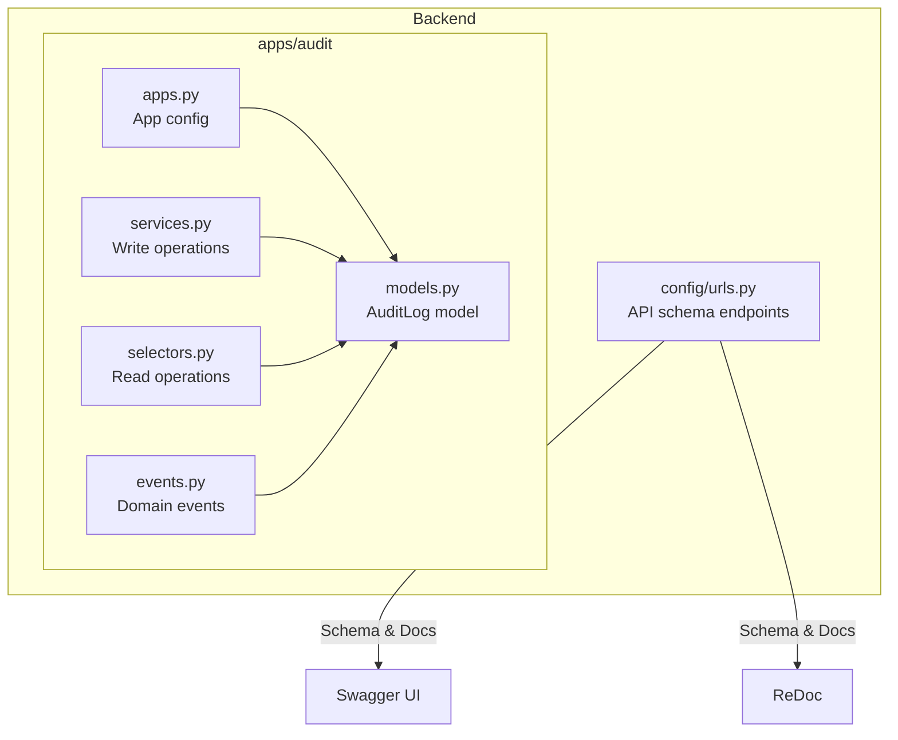
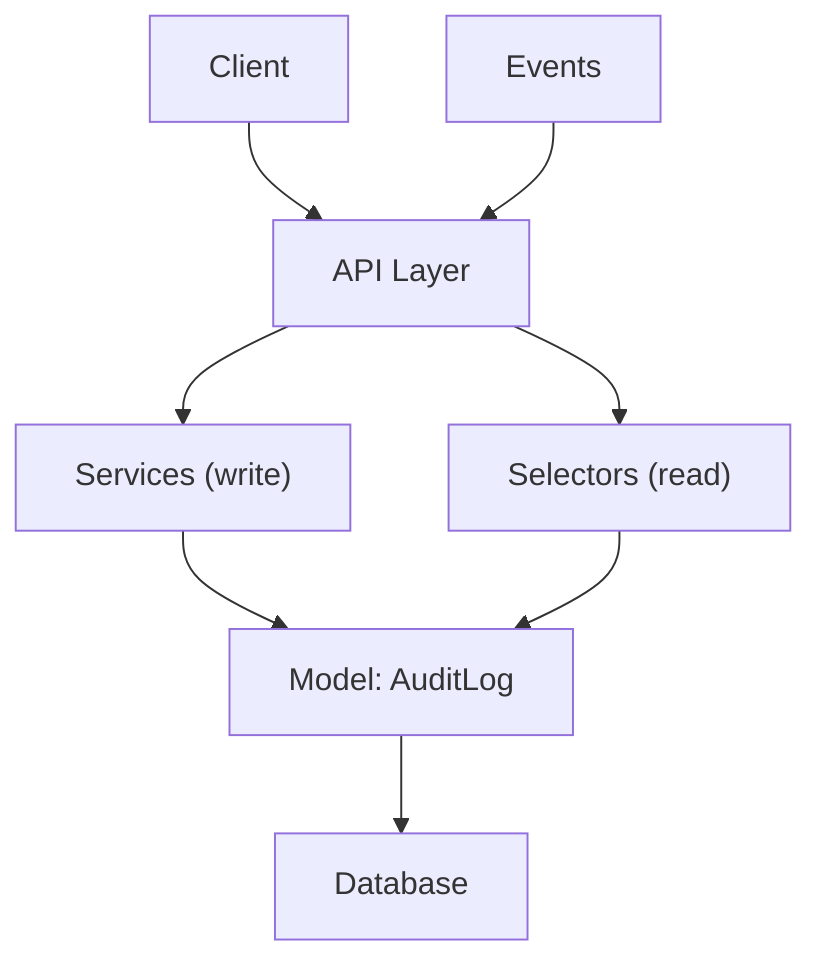
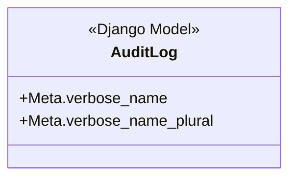
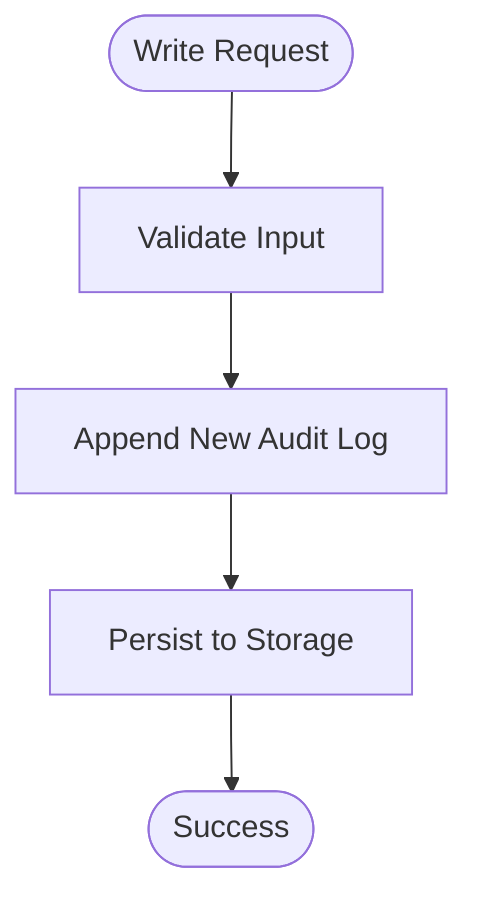
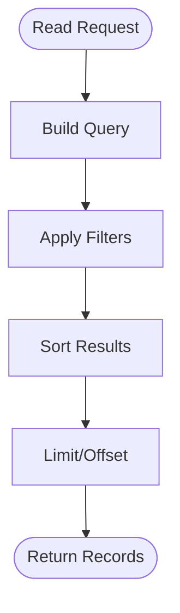
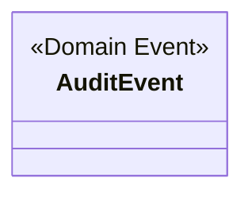
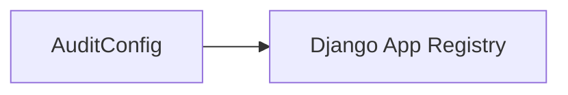
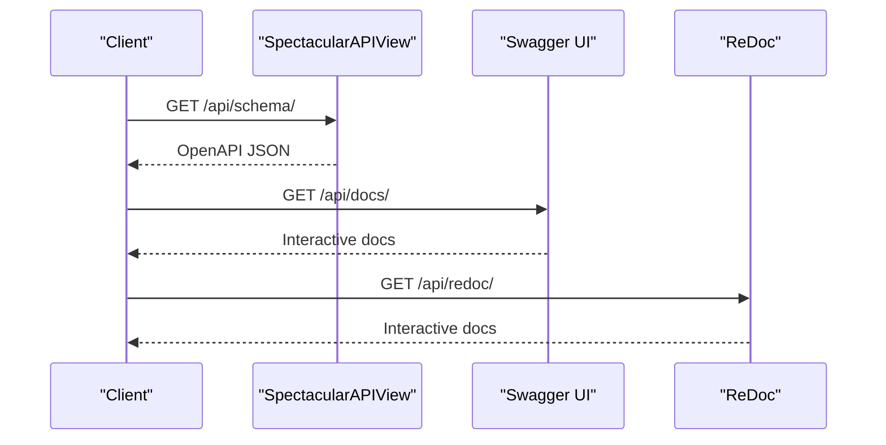
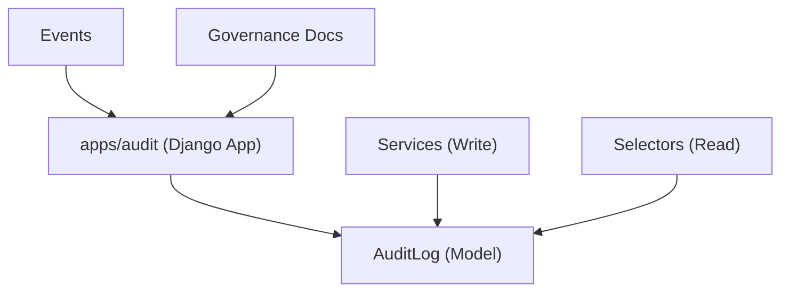

# Audit & Compliance API

<cite>
**Referenced Files in This Document**
- [models.py](file://backend/apps/audit/models.py)
- [services.py](file://backend/apps/audit/services.py)
- [selectors.py](file://backend/apps/audit/selectors.py)
- [events.py](file://backend/apps/audit/events.py)
- [apps.py](file://backend/apps/audit/apps.py)
- [urls.py](file://backend/config/urls.py)
- [AUDIT_CHECKLIST.md](file://backend/docs/governance/AUDIT_CHECKLIST.md)
- [RULES.md](file://backend/docs/governance/RULES.md)
</cite>

## Table of Contents
1. [Introduction](#introduction)
2. [Project Structure](#project-structure)
3. [Core Components](#core-components)
4. [Architecture Overview](#architecture-overview)
5. [Detailed Component Analysis](#detailed-component-analysis)
6. [Dependency Analysis](#dependency-analysis)
7. [Performance Considerations](#performance-considerations)
8. [Troubleshooting Guide](#troubleshooting-guide)
9. [Conclusion](#conclusion)
10. [Appendices](#appendices)

## Introduction
This document describes the Audit & Compliance API capabilities and extension points for activity logging, compliance tracking, and regulatory reporting. The backend implements a dedicated Audit bounded context with a strict append-only policy for audit logs. The current implementation defines foundational models, services, selectors, and events for audit data handling, while governance documents outline compliance expectations and audit procedures.

## Project Structure
The Audit bounded context resides under backend/apps/audit and exposes:
- A central model for audit log entries
- Services and selectors for write/read operations
- Events for domain events
- An app configuration
- Governance documentation for audit and compliance rules

**Diagram sources**
- [models.py:14-30](file://backend/apps/audit/models.py#L14-L30)
- [services.py:1-8](file://backend/apps/audit/services.py#L1-L8)
- [selectors.py:1-6](file://backend/apps/audit/selectors.py#L1-L6)
- [events.py:1-6](file://backend/apps/audit/events.py#L1-L6)
- [apps.py:5-11](file://backend/apps/audit/apps.py#L5-L11)
- [urls.py:21-23](file://backend/config/urls.py#L21-L23)

**Section sources**
- [models.py:1-31](file://backend/apps/audit/models.py#L1-L31)
- [services.py:1-8](file://backend/apps/audit/services.py#L1-L8)
- [selectors.py:1-6](file://backend/apps/audit/selectors.py#L1-L6)
- [events.py:1-6](file://backend/apps/audit/events.py#L1-L6)
- [apps.py:1-12](file://backend/apps/audit/apps.py#L1-L12)
- [urls.py:1-49](file://backend/config/urls.py#L1-L49)

## Core Components
- AuditLog model: Defines the audit log entry structure and metadata. The model comment outlines planned fields for actor, action, target, description, IP address, user agent, and timestamp.
- Services layer: Enforces write-only operations for audit data and enforces append-only semantics.
- Selectors layer: Centralizes read logic for audit data to keep queries testable and consistent.
- Events: Lightweight domain events representing significant occurrences in the audit domain.
- App configuration: Registers the Audit app with Django.

Key operational constraints:
- Append-only policy: No updates or deletions are permitted for audit records.
- Centralized access: All writes must go through services; all reads must go through selectors.

**Section sources**
- [models.py:14-30](file://backend/apps/audit/models.py#L14-L30)
- [services.py:1-8](file://backend/apps/audit/services.py#L1-L8)
- [selectors.py:1-6](file://backend/apps/audit/selectors.py#L1-L6)
- [events.py:1-6](file://backend/apps/audit/events.py#L1-L6)
- [apps.py:5-11](file://backend/apps/audit/apps.py#L5-L11)

## Architecture Overview
The Audit bounded context follows a clean architecture pattern with separation of concerns:
- Model: Immutable audit record definition
- Services: Write operations enforcing append-only policy
- Selectors: Read operations for querying audit data
- Events: Domain event carriers
- App config: Django app registration

[No sources needed since this diagram shows conceptual architecture, not a direct code mapping]

## Detailed Component Analysis

### AuditLog Model
The AuditLog model serves as the canonical record of audit events. The model comment enumerates future fields that will capture actor identity, action type, target entity, description, client metadata, and timestamps. These fields enable categorization, filtering, and compliance reporting.

**Diagram sources**
- [models.py:14-30](file://backend/apps/audit/models.py#L14-L30)

**Section sources**
- [models.py:14-30](file://backend/apps/audit/models.py#L14-L30)

### Services Layer
The services module enforces write-only operations and append-only semantics for audit data. All mutations must traverse this layer, ensuring integrity and traceability.

**Diagram sources**
- [services.py:1-8](file://backend/apps/audit/services.py#L1-L8)

**Section sources**
- [services.py:1-8](file://backend/apps/audit/services.py#L1-L8)

### Selectors Layer
The selectors module centralizes read logic for audit data, enabling consistent querying and testing.

**Diagram sources**
- [selectors.py:1-6](file://backend/apps/audit/selectors.py#L1-L6)

**Section sources**
- [selectors.py:1-6](file://backend/apps/audit/selectors.py#L1-L6)

### Events
The events module defines lightweight domain events for audit-relevant occurrences. These events are not Django signals and represent domain facts to be handled by the broader system.

**Diagram sources**
- [events.py:1-6](file://backend/apps/audit/events.py#L1-L6)

**Section sources**
- [events.py:1-6](file://backend/apps/audit/events.py#L1-L6)

### App Configuration
The Audit app registers with Django and integrates with the broader system via the application registry.

**Diagram sources**
- [apps.py:5-11](file://backend/apps/audit/apps.py#L5-L11)

**Section sources**
- [apps.py:1-12](file://backend/apps/audit/apps.py#L1-L12)

### API Schema and Documentation
The project exposes OpenAPI schema and interactive documentation endpoints. These endpoints provide a foundation for documenting audit and compliance endpoints when integrated into the API.

**Diagram sources**
- [urls.py:21-23](file://backend/config/urls.py#L21-L23)

**Section sources**
- [urls.py:1-49](file://backend/config/urls.py#L1-L49)

## Dependency Analysis
The Audit bounded context depends on Django ORM for persistence and is configured as a Django app. The services and selectors layers depend on the AuditLog model. The governance documents define compliance expectations that inform how audit data is captured and retained.

**Diagram sources**
- [models.py:14-30](file://backend/apps/audit/models.py#L14-L30)
- [services.py:1-8](file://backend/apps/audit/services.py#L1-L8)
- [selectors.py:1-6](file://backend/apps/audit/selectors.py#L1-L6)
- [events.py:1-6](file://backend/apps/audit/events.py#L1-L6)
- [apps.py:5-11](file://backend/apps/audit/apps.py#L5-L11)
- [AUDIT_CHECKLIST.md](file://backend/docs/governance/AUDIT_CHECKLIST.md)
- [RULES.md](file://backend/docs/governance/RULES.md)

**Section sources**
- [models.py:14-30](file://backend/apps/audit/models.py#L14-L30)
- [services.py:1-8](file://backend/apps/audit/services.py#L1-L8)
- [selectors.py:1-6](file://backend/apps/audit/selectors.py#L1-L6)
- [events.py:1-6](file://backend/apps/audit/events.py#L1-L6)
- [apps.py:5-11](file://backend/apps/audit/apps.py#L5-L11)
- [AUDIT_CHECKLIST.md](file://backend/docs/governance/AUDIT_CHECKLIST.md)
- [RULES.md](file://backend/docs/governance/RULES.md)

## Performance Considerations
- Append-only writes: Minimizes write contention and simplifies indexing strategies.
- Centralized reads: Encourages efficient query construction and caching at the selector layer.
- Governance-driven retention: Retention policies should be enforced at the application level to avoid unnecessary storage growth.

[No sources needed since this section provides general guidance]

## Troubleshooting Guide
- Integrity violations: If updates or deletions occur, revert to append-only behavior immediately and review service/selector usage.
- Query performance: Use selectors to centralize filters and sorting; avoid direct model queries outside the selector layer.
- Compliance checks: Review governance documents to align audit capture and retention with organizational policies.

**Section sources**
- [services.py:1-8](file://backend/apps/audit/services.py#L1-L8)
- [selectors.py:1-6](file://backend/apps/audit/selectors.py#L1-L6)
- [AUDIT_CHECKLIST.md](file://backend/docs/governance/AUDIT_CHECKLIST.md)
- [RULES.md](file://backend/docs/governance/RULES.md)

## Conclusion
The Audit bounded context establishes a robust foundation for audit logging with append-only semantics, centralized write/read operations, and domain events. Governance documents provide compliance context. When extended with API endpoints, schema generation, and retention policies, this system supports activity log capture, compliance tracking, and regulatory reporting.

[No sources needed since this section summarizes without analyzing specific files]

## Appendices

### Audit Event Categorization
Proposed categories for audit actions:
- Manual actions by users (create, update, delete)
- Authentication events (login/logout)
- Export operations
- Administrative actions

These categories can be represented by the action field in the AuditLog model.

**Section sources**
- [models.py:18-20](file://backend/apps/audit/models.py#L18-L20)

### Retention Policies
Retention policies should be defined and enforced by the application layer. Typical considerations include:
- Legal and regulatory requirements
- Operational needs for investigations
- Storage cost optimization

Reference governance documents for organizational policy alignment.

**Section sources**
- [AUDIT_CHECKLIST.md](file://backend/docs/governance/AUDIT_CHECKLIST.md)
- [RULES.md](file://backend/docs/governance/RULES.md)

### Compliance Monitoring Workflows
- Define audit capture rules aligned with governance
- Enforce append-only logging
- Periodically review retention and access controls
- Integrate with dashboards for visibility

**Section sources**
- [AUDIT_CHECKLIST.md](file://backend/docs/governance/AUDIT_CHECKLIST.md)
- [RULES.md](file://backend/docs/governance/RULES.md)

### Regulatory Data Export Procedures
- Use selectors to build export queries
- Ensure data minimization and anonymization per policy
- Maintain audit trail of export requests and recipients
- Validate exports against schema and retention requirements

**Section sources**
- [selectors.py:1-6](file://backend/apps/audit/selectors.py#L1-L6)
- [AUDIT_CHECKLIST.md](file://backend/docs/governance/AUDIT_CHECKLIST.md)
- [RULES.md](file://backend/docs/governance/RULES.md)

### Data Privacy Compliance
- Apply data minimization and pseudonymization
- Enforce access controls and audit export usage
- Align retention with legal obligations
- Document privacy impact assessments

**Section sources**
- [AUDIT_CHECKLIST.md](file://backend/docs/governance/AUDIT_CHECKLIST.md)
- [RULES.md](file://backend/docs/governance/RULES.md)

### Audit Trail Integrity
- Enforce append-only writes via services
- Centralize reads via selectors
- Track all modifications to audit configuration
- Maintain immutable logs with complete metadata

**Section sources**
- [services.py:1-8](file://backend/apps/audit/services.py#L1-L8)
- [selectors.py:1-6](file://backend/apps/audit/selectors.py#L1-L6)

### Compliance Dashboard Integration
- Expose audit metrics via API endpoints
- Integrate schema documentation for consumers
- Provide filtered views for dashboards
- Secure access with appropriate permissions

**Section sources**
- [urls.py:21-23](file://backend/config/urls.py#L21-L23)