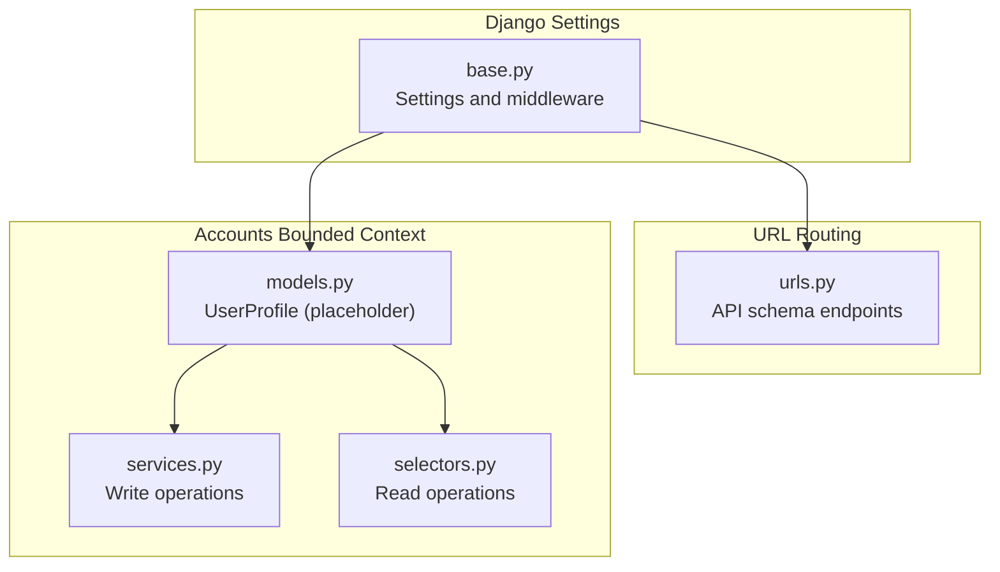
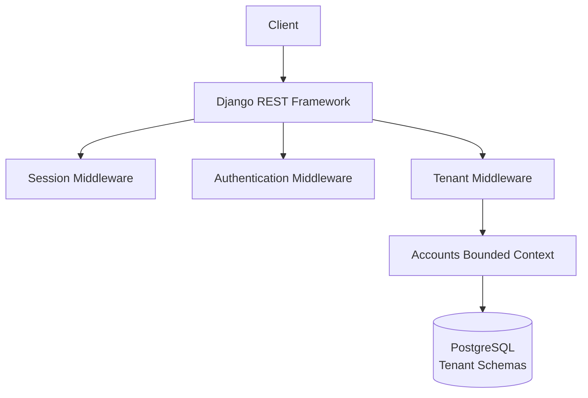
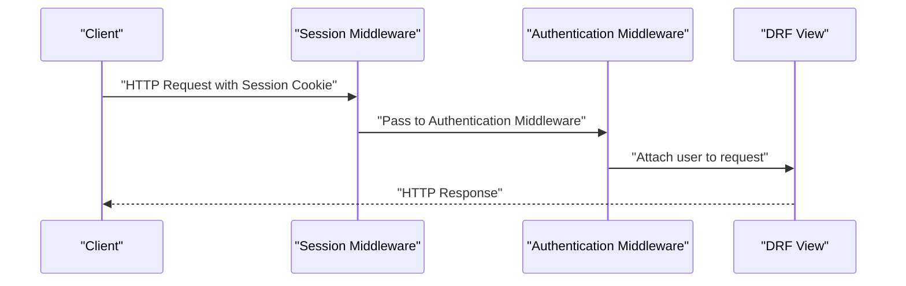
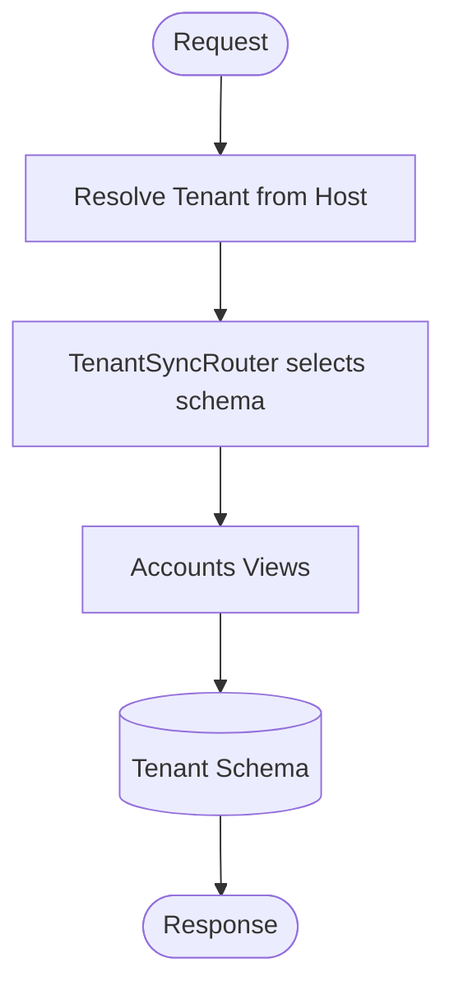
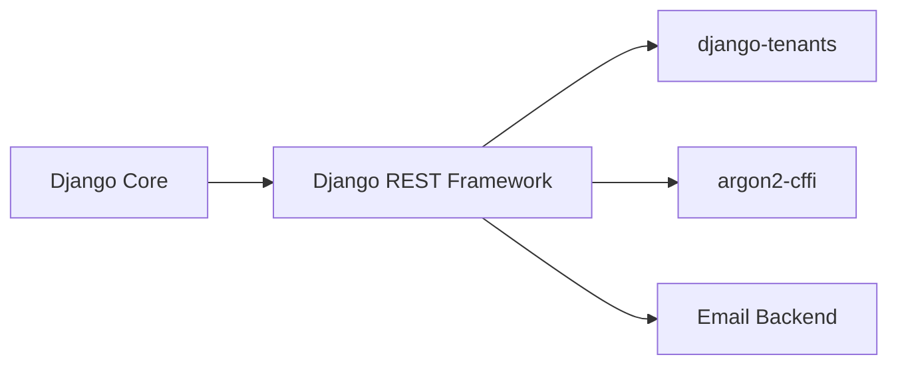

# Authentication & Authorization

<cite>
**Referenced Files in This Document**
- [base.py](file://backend/config/settings/base.py)
- [urls.py](file://backend/config/urls.py)
- [models.py](file://backend/apps/accounts/models.py)
- [services.py](file://backend/apps/accounts/services.py)
- [selectors.py](file://backend/apps/accounts/selectors.py)
- [pyproject.toml](file://backend/pyproject.toml)
</cite>

## Table of Contents
1. [Introduction](#introduction)
2. [Project Structure](#project-structure)
3. [Core Components](#core-components)
4. [Architecture Overview](#architecture-overview)
5. [Detailed Component Analysis](#detailed-component-analysis)
6. [Dependency Analysis](#dependency-analysis)
7. [Performance Considerations](#performance-considerations)
8. [Troubleshooting Guide](#troubleshooting-guide)
9. [Conclusion](#conclusion)

## Introduction
This document explains the authentication and authorization model for the PlantOps platform. It covers how users are authenticated, how sessions are handled, and how role-based access control (RBAC) is structured across tenant-scoped resources. It also documents the current state of JWT token management, session handling, and RBAC, along with guidance for extending the system to support token-based authentication and OAuth2/OpenID Connect in the future.

## Project Structure
The authentication and authorization system is primarily configured at the Django and Django REST Framework (DRF) level, with tenant scoping managed by django-tenants. The accounts bounded context currently defines the user profile abstraction and will host user-role-permission logic as the system evolves.



**Diagram sources**
- [base.py:107-119](file://backend/config/settings/base.py#L107-L119)
- [urls.py:12-38](file://backend/config/urls.py#L12-L38)
- [models.py:15-29](file://backend/apps/accounts/models.py#L15-L29)
- [services.py:1-7](file://backend/apps/accounts/services.py#L1-L7)
- [selectors.py:1-7](file://backend/apps/accounts/selectors.py#L1-L7)

**Section sources**
- [base.py:107-119](file://backend/config/settings/base.py#L107-L119)
- [urls.py:12-38](file://backend/config/urls.py#L12-L38)
- [models.py:15-29](file://backend/apps/accounts/models.py#L15-L29)
- [services.py:1-7](file://backend/apps/accounts/services.py#L1-L7)
- [selectors.py:1-7](file://backend/apps/accounts/selectors.py#L1-L7)

## Core Components
- Session-based authentication is enabled by default via DRF’s SessionAuthentication and Django’s session middleware.
- Tenant scoping is enforced by django-tenants, ensuring multi-tenancy boundaries.
- The accounts bounded context provides a placeholder for user profiles and will host RBAC logic as the system evolves.
- Password hashing uses argon2-cffi, aligning with modern cryptographic standards.

Key configuration highlights:
- Default DRF authentication uses session-based authentication.
- Default permission requires authentication for all views.
- Middleware stack includes session and authentication middleware.
- Tenant model and domain model are defined for multi-tenancy.
- Password validators and secure defaults are configured.
- Email backend and logging are configurable via environment variables.

**Section sources**
- [base.py:234-250](file://backend/config/settings/base.py#L234-L250)
- [base.py:107-119](file://backend/config/settings/base.py#L107-L119)
- [base.py:99-101](file://backend/config/settings/base.py#L99-L101)
- [base.py:169-182](file://backend/config/settings/base.py#L169-L182)
- [base.py:284-285](file://backend/config/settings/base.py#L284-L285)
- [pyproject.toml:55-55](file://backend/pyproject.toml#L55-L55)

## Architecture Overview
The current architecture relies on session-based authentication with tenant scoping. Future enhancements can integrate token-based authentication and OAuth2/OpenID Connect while maintaining tenant isolation.



**Diagram sources**
- [base.py:107-119](file://backend/config/settings/base.py#L107-L119)
- [base.py:99-101](file://backend/config/settings/base.py#L99-L101)
- [models.py:15-29](file://backend/apps/accounts/models.py#L15-L29)

## Detailed Component Analysis

### Session-Based Authentication and Middleware
- SessionAuthentication is the default DRF authentication class, enabling cookie-based sessions.
- AuthenticationMiddleware integrates Django’s authentication into the request pipeline.
- TenantMainMiddleware ensures tenant resolution per request.
- Session cookies are used for stateful authentication.



**Diagram sources**
- [base.py:107-119](file://backend/config/settings/base.py#L107-L119)
- [base.py:234-250](file://backend/config/settings/base.py#L234-L250)

**Section sources**
- [base.py:234-250](file://backend/config/settings/base.py#L234-L250)
- [base.py:107-119](file://backend/config/settings/base.py#L107-L119)

### Accounts Bounded Context and User Profiles
- UserProfile is a placeholder for tenant-scoped user data and roles.
- Services and selectors modules define the write/read boundaries for user data.
- As the system evolves, roles and permissions will be modeled here.

```mermaid
classDiagram
class UserProfile {
"+... fields (to be defined)"
}
class Services {
"+write operations"
}
class Selectors {
"+read operations"
}
Services --> UserProfile : "mutates"
Selectors --> UserProfile : "queries"
```

**Diagram sources**
- [models.py:15-29](file://backend/apps/accounts/models.py#L15-L29)
- [services.py:1-7](file://backend/apps/accounts/services.py#L1-L7)
- [selectors.py:1-7](file://backend/apps/accounts/selectors.py#L1-L7)

**Section sources**
- [models.py:15-29](file://backend/apps/accounts/models.py#L15-L29)
- [services.py:1-7](file://backend/apps/accounts/services.py#L1-L7)
- [selectors.py:1-7](file://backend/apps/accounts/selectors.py#L1-L7)

### Multi-Tenancy and Tenant Scoping
- django-tenants manages tenant isolation via separate schemas.
- TENANT_MODEL and TENANT_DOMAIN_MODEL define the tenant identity and domains.
- TenantSyncRouter ensures database routing per tenant.



**Diagram sources**
- [base.py:99-101](file://backend/config/settings/base.py#L99-L101)
- [base.py:102-102](file://backend/config/settings/base.py#L102-L102)

**Section sources**
- [base.py:99-101](file://backend/config/settings/base.py#L99-L101)
- [base.py:102-102](file://backend/config/settings/base.py#L102-L102)

### Role-Based Access Control (RBAC) Design
- Current state: RBAC logic is not yet implemented in the codebase.
- Future implementation plan:
  - Define roles (e.g., tenant admin, staff, planter) in the accounts bounded context.
  - Map roles to permissions and endpoint-level access controls.
  - Enforce permissions at the view or serializer level using DRF permissions.
  - Maintain tenant-aware permission checks to prevent cross-tenant access.

[No sources needed since this section outlines a future implementation plan]

### Token Management and OAuth2/OpenID Connect
- Current state: No JWT or token-based authentication is implemented.
- Recommended future steps:
  - Integrate a token library (e.g., djangorestframework-simplejwt) for JWT issuance and refresh.
  - Add OAuth2/OpenID Connect provider integration for external identity providers.
  - Implement logout by invalidating tokens and clearing session cookies.
  - Secure token endpoints behind HTTPS and rate limiting.

[No sources needed since this section outlines a future integration plan]

### Password Reset and Account Verification
- Password hashing uses argon2-cffi for secure storage.
- Password validators are configured via AUTH_PASSWORD_VALIDATORS.
- Email backend is configurable for sending password reset and verification emails.

**Section sources**
- [pyproject.toml:55-55](file://backend/pyproject.toml#L55-L55)
- [base.py:169-182](file://backend/config/settings/base.py#L169-L182)
- [base.py:284-285](file://backend/config/settings/base.py#L284-L285)

## Dependency Analysis
- DRF depends on Django’s authentication and session middleware.
- django-tenants middleware must precede authentication to resolve the tenant before user resolution.
- Accounts bounded context depends on tenant schemas for data isolation.
- Security libraries (argon2) and email/backends are optional but recommended for production.



**Diagram sources**
- [base.py:107-119](file://backend/config/settings/base.py#L107-L119)
- [base.py:234-250](file://backend/config/settings/base.py#L234-L250)
- [pyproject.toml:55-55](file://backend/pyproject.toml#L55-L55)
- [base.py:284-285](file://backend/config/settings/base.py#L284-L285)

**Section sources**
- [base.py:107-119](file://backend/config/settings/base.py#L107-L119)
- [base.py:234-250](file://backend/config/settings/base.py#L234-L250)
- [pyproject.toml:55-55](file://backend/pyproject.toml#L55-L55)
- [base.py:284-285](file://backend/config/settings/base.py#L284-L285)

## Performance Considerations
- Prefer session-based authentication for simplicity in the current state.
- When introducing token-based auth, implement efficient token storage and revocation strategies.
- Use pagination and selective field serialization to reduce payload sizes.
- Apply caching for frequently accessed user metadata within a tenant.

[No sources needed since this section provides general guidance]

## Troubleshooting Guide
Common issues and resolutions:
- Authentication fails with session cookies:
  - Verify CSRF trusted origins and CORS settings.
  - Confirm session middleware order and credentials configuration.
- Tenant isolation problems:
  - Ensure TenantMainMiddleware is placed before AuthenticationMiddleware.
  - Validate domain-to-tenant mapping and schema routing.
- Password reset or verification emails not sent:
  - Check EMAIL_BACKEND configuration and sender address.
  - Confirm environment variables for email settings are set.

**Section sources**
- [base.py:267-268](file://backend/config/settings/base.py#L267-L268)
- [base.py:107-119](file://backend/config/settings/base.py#L107-L119)
- [base.py:284-285](file://backend/config/settings/base.py#L284-L285)

## Conclusion
The PlantOps platform currently uses session-based authentication with strong tenant isolation via django-tenants. The accounts bounded context provides a foundation for implementing RBAC and user profile management. Future work should focus on integrating token-based authentication (JWT) and OAuth2/OpenID Connect, while maintaining tenant-aware permissions and robust security practices.