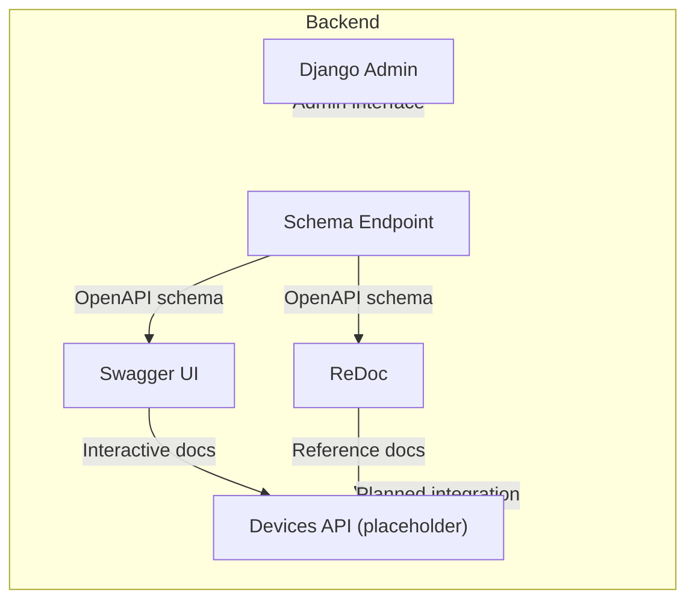
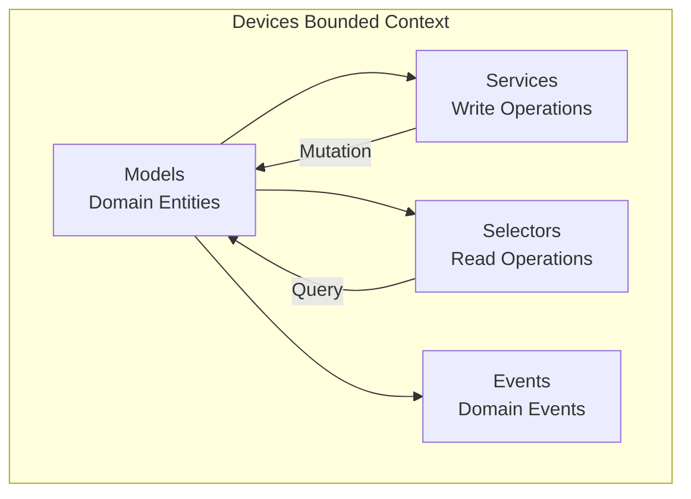
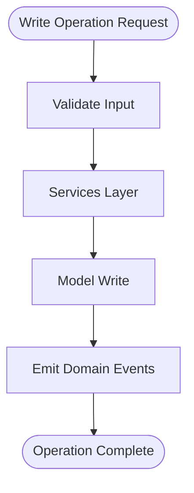
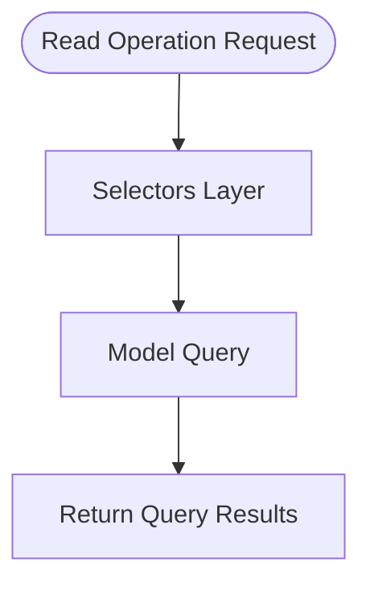
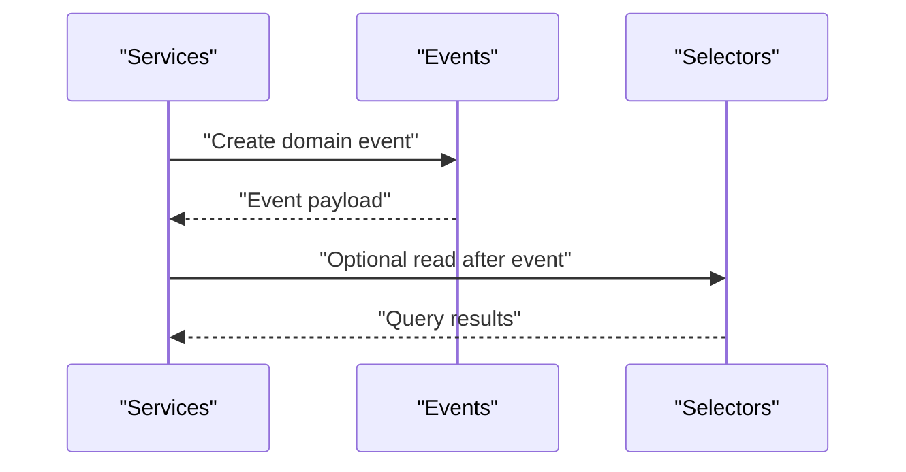
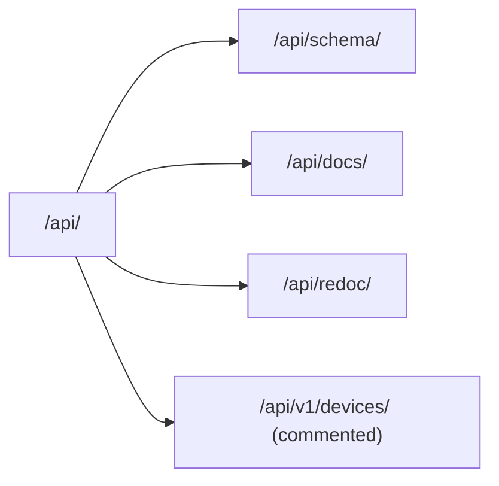
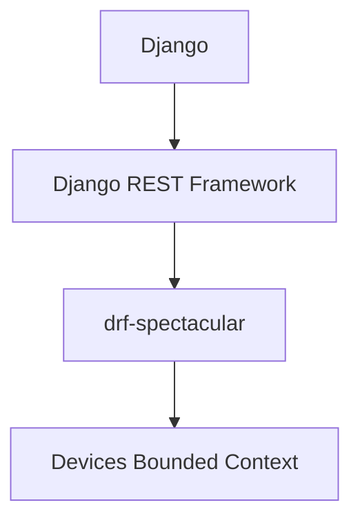
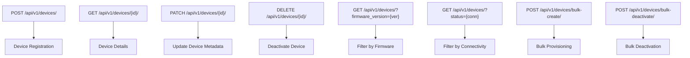

# Device Registry API

<cite>
**Referenced Files in This Document**
- [README.md](file://README.md)
- [backend/config/urls.py](file://backend/config/urls.py)
- [backend/pyproject.toml](file://backend/pyproject.toml)
- [backend/apps/devices/models.py](file://backend/apps/devices/models.py)
- [backend/apps/devices/services.py](file://backend/apps/devices/services.py)
- [backend/apps/devices/selectors.py](file://backend/apps/devices/selectors.py)
- [backend/apps/devices/events.py](file://backend/apps/devices/events.py)
</cite>

## Table of Contents
1. [Introduction](#introduction)
2. [Project Structure](#project-structure)
3. [Core Components](#core-components)
4. [Architecture Overview](#architecture-overview)
5. [Detailed Component Analysis](#detailed-component-analysis)
6. [Dependency Analysis](#dependency-analysis)
7. [Performance Considerations](#performance-considerations)
8. [Troubleshooting Guide](#troubleshooting-guide)
9. [Conclusion](#conclusion)
10. [Appendices](#appendices)

## Introduction
This document describes the Device Registry API surface for IoT device management in the PlantOps platform. It covers device registration, firmware versioning, and connectivity monitoring, along with device enrollment endpoints, configuration APIs, status tracking, authentication mechanisms, connection validation, lifecycle events, provisioning, deactivation, and bulk operations. The backend is a Django-based multi-tenant SaaS with Django REST Framework and drf-spectacular for API documentation generation. The devices bounded context currently defines foundational models and service boundaries for future device capabilities.

## Project Structure
The backend exposes API schema and interactive documentation endpoints via drf-spectacular. The devices bounded context is defined under backend/apps/devices with layered DDD structure (models, services, selectors, events). URL routing includes placeholder entries for devices and other bounded contexts, indicating planned integration.



**Diagram sources**
- [backend/config/urls.py:12-38](file://backend/config/urls.py#L12-L38)
- [backend/pyproject.toml:30-34](file://backend/pyproject.toml#L30-L34)

**Section sources**
- [README.md:131-168](file://README.md#L131-L168)
- [backend/config/urls.py:12-38](file://backend/config/urls.py#L12-L38)
- [backend/pyproject.toml:30-34](file://backend/pyproject.toml#L30-L34)

## Core Components
- Device model: Defines the foundational entity for IoT devices with placeholders for identifiers, metadata, type, firmware version, assigned planter, timestamps, battery metrics, and connectivity status.
- Services layer: Enforces write operations for device data mutation and ensures direct model writes are prohibited.
- Selectors layer: Centralizes read operations for device queries, keeping retrieval logic testable and consistent.
- Events layer: Provides a place for domain events representing significant occurrences in the devices bounded context.

These components collectively establish the DDD boundaries for device-related operations.

**Section sources**
- [backend/apps/devices/models.py:12-29](file://backend/apps/devices/models.py#L12-L29)
- [backend/apps/devices/services.py:1-7](file://backend/apps/devices/services.py#L1-L7)
- [backend/apps/devices/selectors.py:1-7](file://backend/apps/devices/selectors.py#L1-L7)
- [backend/apps/devices/events.py:1-7](file://backend/apps/devices/events.py#L1-L7)

## Architecture Overview
The devices bounded context follows a layered DDD pattern:
- Model layer encapsulates domain entities and metadata.
- Services layer handles all write operations and enforces business rules.
- Selectors layer centralizes read queries.
- Events layer captures domain events.



**Diagram sources**
- [backend/apps/devices/models.py:12-29](file://backend/apps/devices/models.py#L12-L29)
- [backend/apps/devices/services.py:1-7](file://backend/apps/devices/services.py#L1-L7)
- [backend/apps/devices/selectors.py:1-7](file://backend/apps/devices/selectors.py#L1-L7)
- [backend/apps/devices/events.py:1-7](file://backend/apps/devices/events.py#L1-L7)

## Detailed Component Analysis

### Device Model
The Device model is the core entity for IoT device registration and metadata management. It includes placeholders for:
- Unique device identifier (hardware serial)
- Name and description
- Device type (e.g., ESP32, ESP8266)
- Firmware version
- Assigned planter foreign key
- Timestamps for last seen and battery level
- Connectivity status

This model establishes the foundation for device enrollment, configuration, and status tracking.

```mermaid
classDiagram
class Device {
"+uuid id"
"+string device_id"
"+string name"
"+text description"
"+string device_type"
"+string firmware_version"
"+uuid assigned_planter_id"
"+datetime last_seen_at"
"+integer battery_level"
"+string connectivity_status"
}
```

**Diagram sources**
- [backend/apps/devices/models.py:12-29](file://backend/apps/devices/models.py#L12-L29)

**Section sources**
- [backend/apps/devices/models.py:12-29](file://backend/apps/devices/models.py#L12-L29)

### Services Layer
The services layer enforces write operations for device data. All mutations to device records must pass through this module, ensuring centralized control and consistency.



**Diagram sources**
- [backend/apps/devices/services.py:1-7](file://backend/apps/devices/services.py#L1-L7)

**Section sources**
- [backend/apps/devices/services.py:1-7](file://backend/apps/devices/services.py#L1-L7)

### Selectors Layer
The selectors layer centralizes read operations for device queries. This ensures consistent, testable retrieval logic across the application.



**Diagram sources**
- [backend/apps/devices/selectors.py:1-7](file://backend/apps/devices/selectors.py#L1-L7)

**Section sources**
- [backend/apps/devices/selectors.py:1-7](file://backend/apps/devices/selectors.py#L1-L7)

### Events Layer
The events layer provides a place for domain events representing significant occurrences in the devices bounded context. These lightweight data structures capture meaningful changes without relying on Django signals.



**Diagram sources**
- [backend/apps/devices/events.py:1-7](file://backend/apps/devices/events.py#L1-L7)

**Section sources**
- [backend/apps/devices/events.py:1-7](file://backend/apps/devices/events.py#L1-L7)

### API Surface and Routing
The URL configuration includes placeholder routes for devices and other bounded contexts. These routes are currently commented out and indicate planned integration. The schema and documentation endpoints are active and expose OpenAPI schemas and interactive docs.



**Diagram sources**
- [backend/config/urls.py:21-38](file://backend/config/urls.py#L21-L38)

**Section sources**
- [backend/config/urls.py:21-38](file://backend/config/urls.py#L21-L38)

## Dependency Analysis
The backend leverages Django, Django REST Framework, and drf-spectacular for API documentation. The devices bounded context aligns with the broader DDD pattern used across the application.



**Diagram sources**
- [backend/pyproject.toml:18-67](file://backend/pyproject.toml#L18-L67)

**Section sources**
- [backend/pyproject.toml:18-67](file://backend/pyproject.toml#L18-L67)

## Performance Considerations
- Centralized read/write layers improve maintainability and enable targeted caching strategies at the selectors/services boundary.
- Keep device queries selective and indexed on frequently filtered fields (e.g., device_id, firmware_version, connectivity_status).
- Batch operations for bulk provisioning/deactivation to reduce round trips and transaction overhead.
- Monitor API response sizes; avoid returning unnecessary fields for device listings.

## Troubleshooting Guide
- Device model fields: Confirm that device_id is unique and properly indexed for fast lookups during enrollment and status checks.
- Services vs. direct model writes: Ensure all mutations route through services to prevent inconsistent state.
- Selectors isolation: Use selectors for all reads to keep query logic centralized and testable.
- Events emission: Verify domain events are emitted after significant device lifecycle changes to support audit and downstream processing.

## Conclusion
The Device Registry API foundation is established through the devices bounded context’s DDD layers and the Device model. While the devices API routes are currently placeholders, the underlying structure supports robust device enrollment, configuration, firmware versioning, and connectivity monitoring. Integrating the devices API endpoints and implementing the planned routes will complete the API surface for comprehensive IoT device lifecycle management.

## Appendices

### API Endpoints (Planned Integration)
- Base path: /api/v1/devices/
- Authentication: JWT via DRF (as configured in the stack)
- Content-Type: application/json
- Notes: The following endpoints are placeholders pending integration; adjust paths and schemas as per implementation.



[No sources needed since this diagram shows conceptual workflow, not actual code structure]

### Request/Response Schemas (Planned Integration)
- Device Creation
  - Request: device_id, name, description, device_type, firmware_version, assigned_planter_id
  - Response: device_id, name, description, device_type, firmware_version, assigned_planter_id, last_seen_at, battery_level, connectivity_status
- Firmware Versioning
  - Request: device_id, firmware_version
  - Response: device_id, firmware_version, last_seen_at
- Device Metadata Management
  - Request: device_id, name, description, battery_level
  - Response: device_id, name, description, battery_level, last_seen_at
- Device Status Tracking
  - Response: device_id, connectivity_status, last_seen_at, battery_level

[No sources needed since this section provides conceptual schemas]

### Device Authentication and Connection Validation
- Authentication: JWT tokens via DRF; ensure Authorization header is present for protected endpoints.
- Connection Validation: Implement heartbeat or last_seen_at updates to validate ongoing connectivity; mark offline when thresholds are exceeded.

[No sources needed since this section provides general guidance]

### Device Lifecycle Events
- Enrollment: Emit event upon successful creation.
- Firmware Update: Emit event upon firmware_version change.
- Deactivation: Emit event upon deletion or status change to inactive.
- Bulk Operations: Emit batch events for provisioning and deactivation.

[No sources needed since this section provides general guidance]

### Examples

- Device Onboarding Workflow
  - Step 1: Register device via POST /api/v1/devices/ with device_id and metadata.
  - Step 2: Assign planter via PATCH /api/v1/devices/{id}/.
  - Step 3: Monitor connectivity via GET /api/v1/devices/{id}/ and filter by status.

- Firmware Update Procedure
  - Step 1: Send PATCH /api/v1/devices/{id}/ with firmware_version.
  - Step 2: Verify update via GET /api/v1/devices/?firmware_version={ver}.
  - Step 3: Emit firmware update event for audit.

- Device Health Monitoring
  - Step 1: Poll GET /api/v1/devices/?status={conn} to list offline devices.
  - Step 2: Use last_seen_at to compute staleness thresholds.
  - Step 3: Trigger alerts or maintenance tasks accordingly.

[No sources needed since this section provides conceptual workflows]