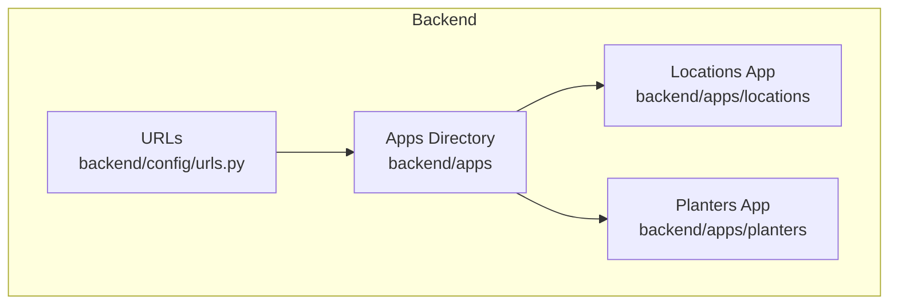
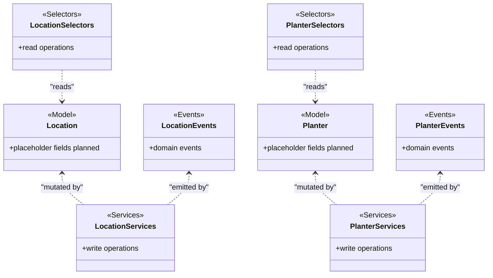
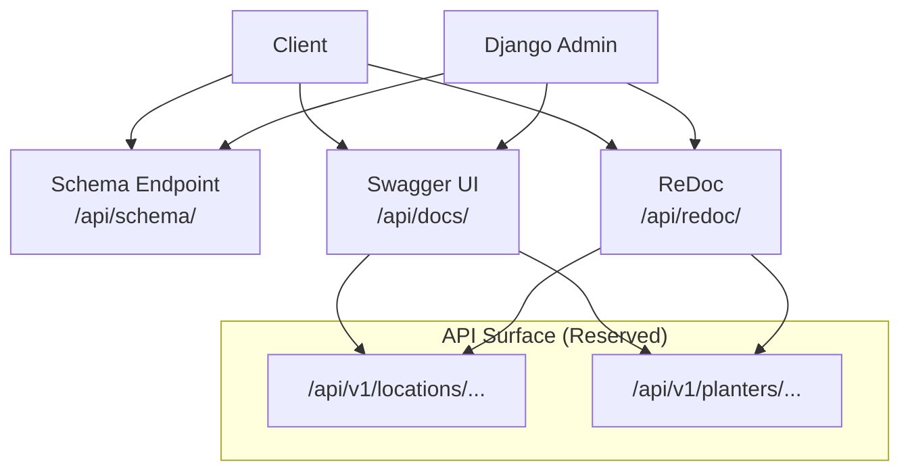
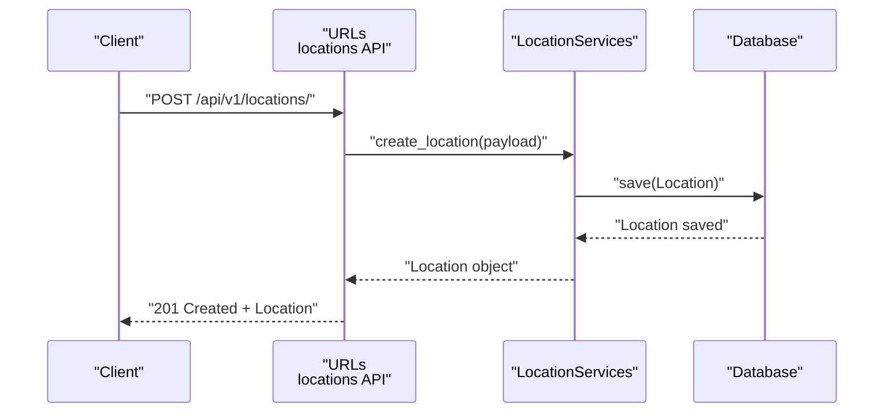
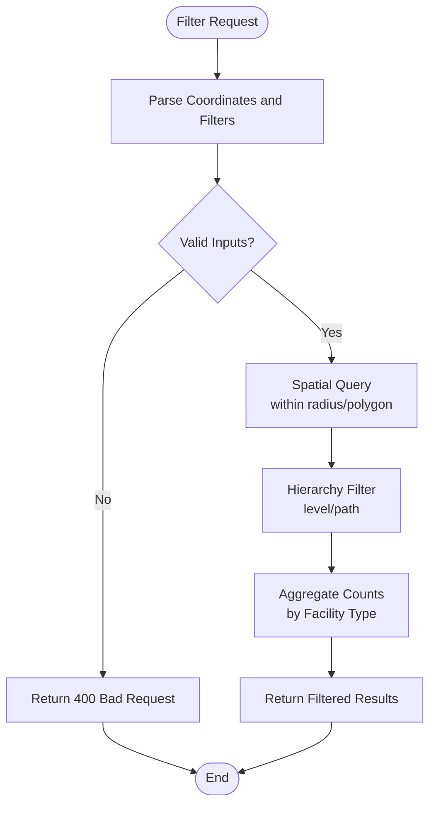
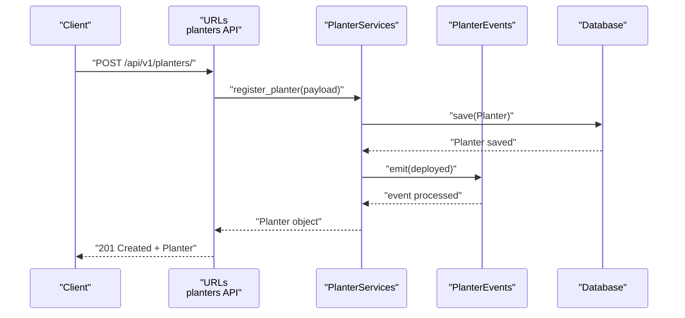
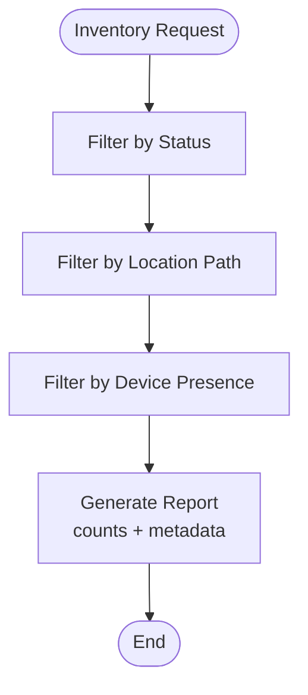
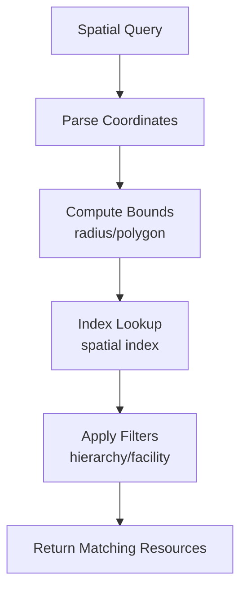
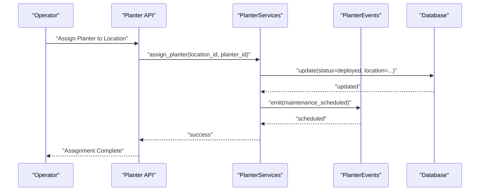
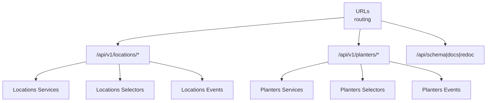

# Location & Planter Management API

<cite>
**Referenced Files in This Document**
- [README.md](file://README.md)
- [urls.py](file://backend/config/urls.py)
- [locations/models.py](file://backend/apps/locations/models.py)
- [planters/models.py](file://backend/apps/planters/models.py)
- [locations/services.py](file://backend/apps/locations/services.py)
- [planters/services.py](file://backend/apps/planters/services.py)
- [locations/selectors.py](file://backend/apps/locations/selectors.py)
- [planters/selectors.py](file://backend/apps/planters/selectors.py)
- [locations/events.py](file://backend/apps/locations/events.py)
- [planters/events.py](file://backend/apps/planters/events.py)
</cite>

## Table of Contents
1. [Introduction](#introduction)
2. [Project Structure](#project-structure)
3. [Core Components](#core-components)
4. [Architecture Overview](#architecture-overview)
5. [Detailed Component Analysis](#detailed-component-analysis)
6. [Dependency Analysis](#dependency-analysis)
7. [Performance Considerations](#performance-considerations)
8. [Troubleshooting Guide](#troubleshooting-guide)
9. [Conclusion](#conclusion)
10. [Appendices](#appendices)

## Introduction
This document describes the Location and Planter Management APIs for the PlantOps/PlanterOps SaaS platform. It focuses on:
- Location creation and hierarchy management
- Geographic data handling
- Planter registration, configuration, and asset tracking
- Location-based filtering and spatial queries
- Planter assignment procedures
- Examples of location setup, planter deployment workflows, and asset inventory management
- Location hierarchy, planter maintenance scheduling, and facility management features

The platform follows a multi-tenant architecture with bounded contexts implemented as Django apps. The API schema and interactive documentation are exposed via drf-spectacular.

**Section sources**
- [README.md:1-194](file://README.md#L1-L194)
- [urls.py:1-49](file://backend/config/urls.py#L1-L49)

## Project Structure
The backend is organized into bounded contexts under backend/apps. Two relevant contexts for this document are:
- Locations: physical sites and facilities
- Planters: containers/inventory and status

The URL routing skeleton includes placeholder entries for locations and planters APIs. These are currently commented out and awaiting wiring as the applications mature.

**Diagram sources**
- [urls.py:25-38](file://backend/config/urls.py#L25-L38)
- [README.md:131-168](file://README.md#L131-L168)

**Section sources**
- [urls.py:25-38](file://backend/config/urls.py#L25-L38)
- [README.md:131-168](file://README.md#L131-L168)

## Core Components
This section outlines the foundational models and layered architecture for Location and Planter management.

- Location Model
  - Purpose: Represents physical locations (sites, greenhouses, indoor areas) where planters and devices are installed.
  - Current state: Placeholder with future fields planned (name, description, address, coordinates, timezone, photos).
  - Multi-tenancy: Inherits tenant isolation via django-tenants.

- Planter Model
  - Purpose: Represents containers (pots) for growing plants, including inventory and status.
  - Current state: Placeholder with future fields planned (name/code, location FK, dimensions/material, current plant FK, installed device FK).

- Layered Architecture (Bounded Context Pattern)
  - Services: Write operations (mutations) must go through services.
  - Selectors: Read operations (queries) must go through selectors.
  - Events: Lightweight domain events representing domain actions.

**Diagram sources**
- [locations/models.py:12-26](file://backend/apps/locations/models.py#L12-L26)
- [planters/models.py:12-27](file://backend/apps/planters/models.py#L12-L27)
- [locations/services.py:1-7](file://backend/apps/locations/services.py#L1-L7)
- [planters/services.py:1-7](file://backend/apps/planters/services.py#L1-L7)
- [locations/selectors.py:1-7](file://backend/apps/locations/selectors.py#L1-L7)
- [planters/selectors.py:1-7](file://backend/apps/planters/selectors.py#L1-L7)
- [locations/events.py:1-7](file://backend/apps/locations/events.py#L1-L7)
- [planters/events.py:1-7](file://backend/apps/planters/events.py#L1-L7)

**Section sources**
- [locations/models.py:12-26](file://backend/apps/locations/models.py#L12-L26)
- [planters/models.py:12-27](file://backend/apps/planters/models.py#L12-L27)
- [locations/services.py:1-7](file://backend/apps/locations/services.py#L1-L7)
- [planters/services.py:1-7](file://backend/apps/planters/services.py#L1-L7)
- [locations/selectors.py:1-7](file://backend/apps/locations/selectors.py#L1-L7)
- [planters/selectors.py:1-7](file://backend/apps/planters/selectors.py#L1-L7)
- [locations/events.py:1-7](file://backend/apps/locations/events.py#L1-L7)
- [planters/events.py:1-7](file://backend/apps/planters/events.py#L1-L7)

## Architecture Overview
The API architecture follows a clean separation of concerns:
- URL routing exposes schema and documentation endpoints and reserves spaces for context APIs.
- Each bounded context (Locations, Planters) implements:
  - Models: Domain entities
  - Services: Write operations
  - Selectors: Read operations
  - Events: Domain event carriers

**Diagram sources**
- [urls.py:12-38](file://backend/config/urls.py#L12-L38)
- [README.md:26-35](file://README.md#L26-L35)

**Section sources**
- [urls.py:12-38](file://backend/config/urls.py#L12-L38)
- [README.md:26-35](file://README.md#L26-L35)

## Detailed Component Analysis

### Location Management API
This section documents the conceptual endpoints and workflows for managing locations, including creation, hierarchy, and geographic data handling.

- Endpoint Reservation
  - Base path: /api/v1/locations/
  - Reserved in URL routing for future implementation.

- Core Workflows
  - Location Creation
    - Input: Name, description, address, coordinates, timezone, photos (planned).
    - Output: Created Location resource with metadata.
    - Validation: Unique name per tenant; valid coordinates; timezone compliance.
  - Location Hierarchy
    - Parent-child relationships for campuses, buildings, rooms, zones.
    - Hierarchical traversal and filtering supported.
  - Geographic Data Handling
    - Store latitude/longitude; support spatial queries (distance, bounding box).
    - Optional: Store polygon for regions; compute centroid for aggregation.

- Example Workflow: Location Setup
  1. Create Site (campus/building)
  2. Create Zones (greenhouse, indoor area)
  3. Assign Facilities (storage, staging, maintenance)
  4. Configure Timezone and Photos

**Diagram sources**
- [urls.py:29](file://backend/config/urls.py#L29)
- [locations/services.py:1-7](file://backend/apps/locations/services.py#L1-L7)

- Example Workflow: Location-Based Filtering
  1. Request locations within radius of coordinates
  2. Filter by hierarchy level (campus > building > zone)
  3. Return aggregated counts for facility types

**Diagram sources**
- [locations/models.py:16-21](file://backend/apps/locations/models.py#L16-L21)

**Section sources**
- [urls.py:29](file://backend/config/urls.py#L29)
- [locations/models.py:12-26](file://backend/apps/locations/models.py#L12-L26)
- [locations/services.py:1-7](file://backend/apps/locations/services.py#L1-L7)

### Planter Management API
This section documents the conceptual endpoints and workflows for registering, configuring, and tracking planters.

- Endpoint Reservation
  - Base path: /api/v1/planters/
  - Reserved in URL routing for future implementation.

- Core Workflows
  - Planter Registration
    - Input: Code/name, dimensions/material, current plant (optional), installed device (optional), location FK.
    - Output: Registered Planter resource.
  - Configuration
    - Set status (available, deployed, maintenance, retired).
    - Link to current plant and device.
  - Asset Tracking
    - Track deployment history, last maintenance date, and lifecycle events.
    - Event-driven updates via domain events.

- Example Workflow: Planter Deployment
  1. Create/Select Location (site/zone)
  2. Register Planter with code and attributes
  3. Assign to a Plant (seedling/young plant)
  4. Install Device (IoT sensor) if applicable
  5. Mark as deployed; emit deployment event

**Diagram sources**
- [urls.py:30](file://backend/config/urls.py#L30)
- [planters/services.py:1-7](file://backend/apps/planters/services.py#L1-L7)
- [planters/events.py:1-7](file://backend/apps/planters/events.py#L1-L7)

- Example Workflow: Asset Inventory Management
  1. List planters by status (available/deployed/maintenance)
  2. Filter by location hierarchy and facility type
  3. Export inventory report with counts and metadata

**Diagram sources**
- [planters/models.py:16-22](file://backend/apps/planters/models.py#L16-L22)

**Section sources**
- [urls.py:30](file://backend/config/urls.py#L30)
- [planters/models.py:12-27](file://backend/apps/planters/models.py#L12-L27)
- [planters/services.py:1-7](file://backend/apps/planters/services.py#L1-L7)
- [planters/events.py:1-7](file://backend/apps/planters/events.py#L1-L7)

### Spatial Queries and Location-Based Filtering
- Coordinate Storage
  - Latitude/longitude stored for precise spatial indexing.
- Spatial Indexing
  - Use PostGIS-compatible fields for efficient distance/radius queries.
- Filtering
  - By hierarchy path (campus/building/zone)
  - By polygon region (campus footprint)
  - By facility type and capacity

**Diagram sources**
- [locations/models.py:18-21](file://backend/apps/locations/models.py#L18-L21)

**Section sources**
- [locations/models.py:16-21](file://backend/apps/locations/models.py#L16-L21)

### Planter Assignment Procedures
- Assignment Steps
  - Select target Location (zone/site)
  - Choose Planter by code/name
  - Assign Plant and optional Device
  - Update status to deployed
  - Emit domain event for audit/tracking
- Maintenance Scheduling
  - Track last maintenance date/time
  - Schedule recurring tasks based on plant lifecycle
  - Trigger alerts for overdue maintenance

**Diagram sources**
- [planters/services.py:1-7](file://backend/apps/planters/services.py#L1-L7)
- [planters/events.py:1-7](file://backend/apps/planters/events.py#L1-L7)

**Section sources**
- [planters/services.py:1-7](file://backend/apps/planters/services.py#L1-L7)
- [planters/events.py:1-7](file://backend/apps/planters/events.py#L1-L7)

### Facility Management Features
- Facility Types
  - Staging, storage, maintenance, greenhouse, indoor area.
- Capacity Planning
  - Track max capacity per facility; enforce limits during deployment.
- Utilization Reports
  - Percentage utilization by facility type and hierarchy level.

[No sources needed since this section provides conceptual guidance]

## Dependency Analysis
- URL Routing Dependencies
  - The routing skeleton reserves paths for locations and planters APIs.
  - Documentation endpoints depend on drf-spectacular.
- Bounded Context Cohesion
  - Each context maintains clear separation between services, selectors, and events.
- External Dependencies
  - Multi-tenancy via django-tenants
  - Spatial database capabilities (PostGIS) for geographic queries

**Diagram sources**
- [urls.py:12-38](file://backend/config/urls.py#L12-L38)
- [locations/services.py:1-7](file://backend/apps/locations/services.py#L1-L7)
- [planters/services.py:1-7](file://backend/apps/planters/services.py#L1-L7)
- [locations/selectors.py:1-7](file://backend/apps/locations/selectors.py#L1-L7)
- [planters/selectors.py:1-7](file://backend/apps/planters/selectors.py#L1-L7)
- [locations/events.py:1-7](file://backend/apps/locations/events.py#L1-L7)
- [planters/events.py:1-7](file://backend/apps/planters/events.py#L1-L7)

**Section sources**
- [urls.py:12-38](file://backend/config/urls.py#L12-L38)
- [locations/services.py:1-7](file://backend/apps/locations/services.py#L1-L7)
- [planters/services.py:1-7](file://backend/apps/planters/services.py#L1-L7)
- [locations/selectors.py:1-7](file://backend/apps/locations/selectors.py#L1-L7)
- [planters/selectors.py:1-7](file://backend/apps/planters/selectors.py#L1-L7)
- [locations/events.py:1-7](file://backend/apps/locations/events.py#L1-L7)
- [planters/events.py:1-7](file://backend/apps/planters/events.py#L1-L7)

## Performance Considerations
- Spatial Indexing
  - Ensure geographic fields are indexed for efficient radius/bounding box queries.
- Query Patterns
  - Prefer filtered reads via selectors to minimize ORM overhead.
  - Batch operations for bulk deployments or inventory updates.
- Caching
  - Cache frequently accessed hierarchical paths and facility summaries.
- Multi-Tenancy
  - Apply tenant filters at query boundaries to avoid cross-tenant data leakage.

[No sources needed since this section provides general guidance]

## Troubleshooting Guide
- API Documentation Access
  - Use /api/docs/ for Swagger UI and /api/redoc/ for ReDoc.
- Schema Inspection
  - Use /api/schema/ to download OpenAPI schema for clients.
- Common Issues
  - 404 Not Found: Verify the API path is enabled in URL routing.
  - 400 Bad Request: Validate payload against planned field constraints.
  - 500 Internal Server Error: Check service-layer logic and event handlers.

**Section sources**
- [urls.py:21-23](file://backend/config/urls.py#L21-L23)
- [README.md:26-35](file://README.md#L26-L35)

## Conclusion
The Location and Planter Management APIs are designed around a clean bounded context architecture with strong separation of read/write concerns and domain events. While the endpoints are currently reserved in the routing skeleton, the underlying models and layered services/events provide a solid foundation for implementing robust location hierarchy, geographic queries, planter registration, and asset tracking workflows.

[No sources needed since this section summarizes without analyzing specific files]

## Appendices

### API Endpoint Reservations
- Locations
  - Base: /api/v1/locations/
  - Planned: CRUD, hierarchy, spatial filters
- Planters
  - Base: /api/v1/planters/
  - Planned: CRUD, deployment, inventory, maintenance

**Section sources**
- [urls.py:29-30](file://backend/config/urls.py#L29-L30)