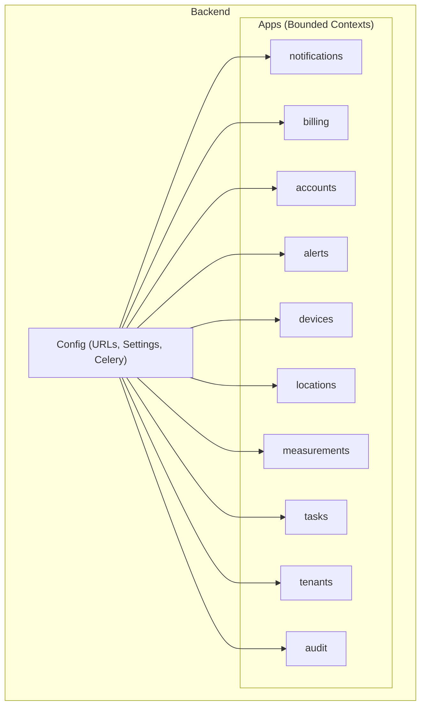
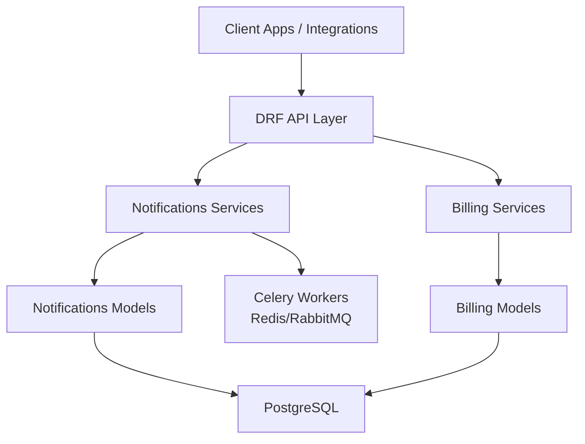
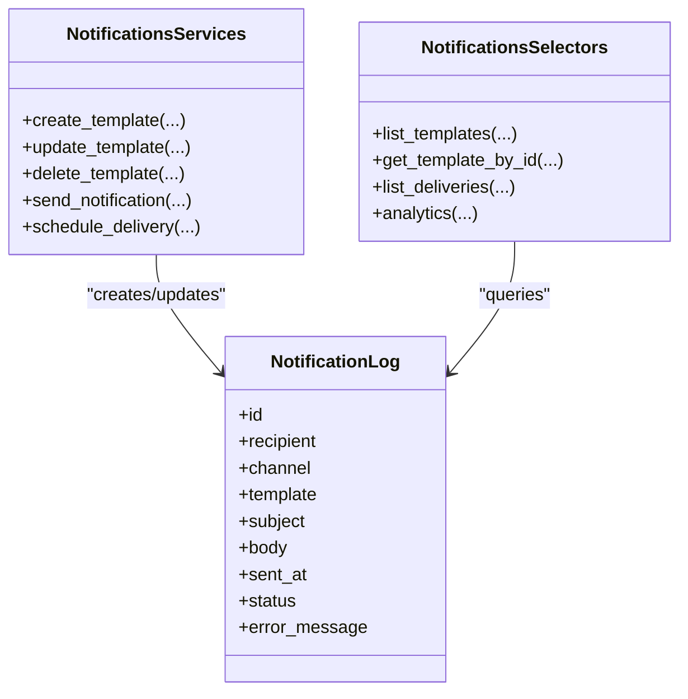
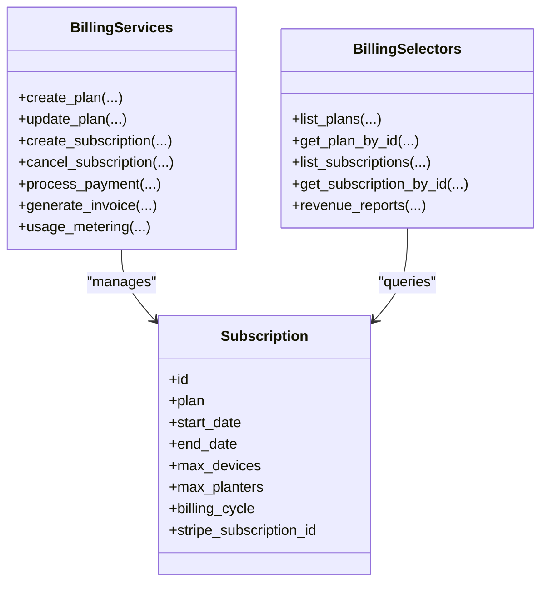
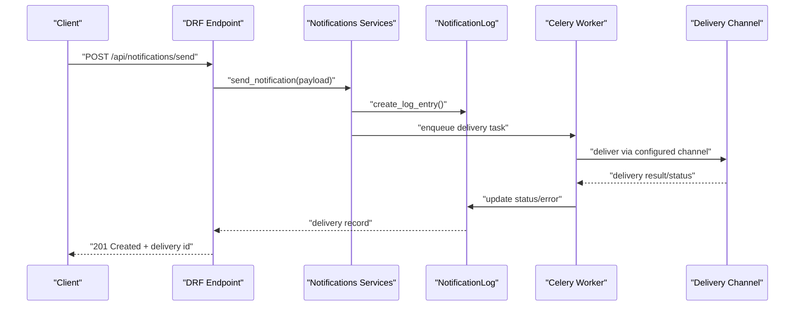
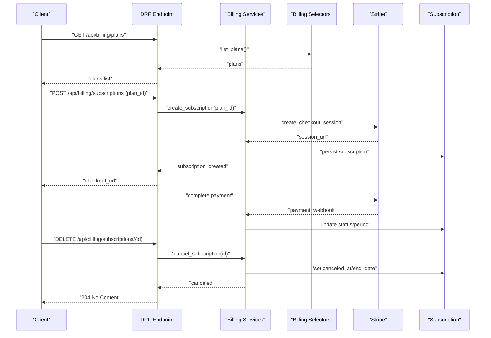
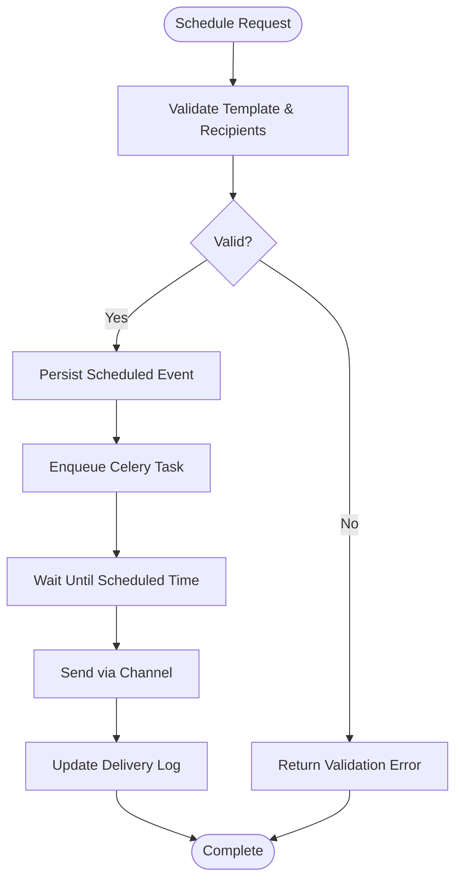
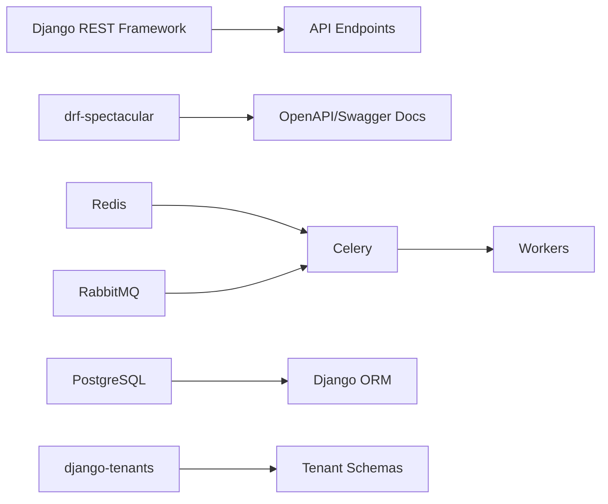

# Notification & Billing API

<cite>
**Referenced Files in This Document**
- [README.md](file://README.md)
- [pyproject.toml](file://pyproject.toml)
- [apps/notifications/models.py](file://backend/apps/notifications/models.py)
- [apps/notifications/services.py](file://backend/apps/notifications/services.py)
- [apps/notifications/selectors.py](file://backend/apps/notifications/selectors.py)
- [apps/billing/models.py](file://backend/apps/billing/models.py)
- [apps/billing/services.py](file://backend/apps/billing/services.py)
- [apps/billing/selectors.py](file://backend/apps/billing/selectors.py)
</cite>

## Table of Contents
1. [Introduction](#introduction)
2. [Project Structure](#project-structure)
3. [Core Components](#core-components)
4. [Architecture Overview](#architecture-overview)
5. [Detailed Component Analysis](#detailed-component-analysis)
6. [Dependency Analysis](#dependency-analysis)
7. [Performance Considerations](#performance-considerations)
8. [Troubleshooting Guide](#troubleshooting-guide)
9. [Conclusion](#conclusion)
10. [Appendices](#appendices)

## Introduction
This document provides comprehensive API documentation for the Notification Delivery and Billing Management systems within the PlantOps SaaS platform. It focuses on:
- Notification template management, delivery channel configuration, and multi-channel notification endpoints
- Billing plan management, subscription handling, and payment processing APIs with their schemas and workflows
- Notification scheduling, template customization, and delivery analytics
- Examples of notification setup, billing configuration, and automated payment workflows
- Subscription lifecycle, usage-based billing, and revenue tracking features

The platform is a multi-tenant Django application with Django REST Framework (DRF) and OpenAPI/Swagger documentation via drf-spectacular. The backend exposes API endpoints under /api/, with interactive docs available at /api/docs/.

**Section sources**
- [README.md:1-194](file://README.md#L1-L194)

## Project Structure
The backend is organized into bounded contexts (Django apps), each encapsulating domain capabilities:
- Notifications: Channel management, templates, and delivery logs
- Billing: Subscriptions, invoices, payments, and usage metering
- Accounts, Alerts, Devices, Locations, Measurements, Tasks, Tenants, Audit: Supporting domains

Key runtime and tooling dependencies include DRF, drf-spectacular, Celery, Redis, RabbitMQ, PostgreSQL, and django-tenants for multi-tenancy.

**Section sources**
- [README.md:131-186](file://README.md#L131-L186)
- [pyproject.toml:18-67](file://pyproject.toml#L18-L67)

## Core Components
This section outlines the primary components and their responsibilities for notifications and billing.

- Notifications
  - Purpose: Manage channels (email, SMS, push, in-app), templates, and delivery logs
  - Current state: Models and service layers exist as placeholders; future fields include recipient, channel, template, subject/body, timestamps, status, and error messages

- Billing
  - Purpose: Manage subscriptions, invoices, payments, and usage metering
  - Current state: Models and service layers exist as placeholders; future fields include plan tiers, dates, limits, billing cycle, and external identifiers

**Section sources**
- [apps/notifications/models.py:1-28](file://backend/apps/notifications/models.py#L1-L28)
- [apps/billing/models.py:1-26](file://backend/apps/billing/models.py#L1-L26)

## Architecture Overview
The system follows a layered architecture:
- Presentation: DRF views and routers expose REST endpoints
- Application: Services orchestrate business operations
- Persistence: Django ORM models define domain entities
- Messaging: Celery with Redis/RabbitMQ supports asynchronous tasks (e.g., sending notifications)
- Multi-tenancy: django-tenants isolates tenant data

**Section sources**
- [pyproject.toml:32-39](file://pyproject.toml#L32-L39)
- [README.md:26-35](file://README.md#L26-L35)

## Detailed Component Analysis

### Notifications API Surface
The Notifications context is structured around:
- Models: NotificationLog placeholder for delivery records
- Services: Write operations boundary
- Selectors: Read operations boundary

**Diagram sources**
- [apps/notifications/models.py:12-23](file://backend/apps/notifications/models.py#L12-L23)
- [apps/notifications/services.py:1-7](file://backend/apps/notifications/services.py#L1-L7)
- [apps/notifications/selectors.py:1-7](file://backend/apps/notifications/selectors.py#L1-L7)

**Section sources**
- [apps/notifications/models.py:1-28](file://backend/apps/notifications/models.py#L1-L28)
- [apps/notifications/services.py:1-7](file://backend/apps/notifications/services.py#L1-L7)
- [apps/notifications/selectors.py:1-7](file://backend/apps/notifications/selectors.py#L1-L7)

### Billing API Surface
The Billing context is structured around:
- Models: Subscription placeholder for tenant plans and billing metadata
- Services: Write operations boundary
- Selectors: Read operations boundary

**Diagram sources**
- [apps/billing/models.py:11-21](file://backend/apps/billing/models.py#L11-L21)
- [apps/billing/services.py:1-7](file://backend/apps/billing/services.py#L1-L7)
- [apps/billing/selectors.py:1-7](file://backend/apps/billing/selectors.py#L1-L7)

**Section sources**
- [apps/billing/models.py:1-26](file://backend/apps/billing/models.py#L1-L26)
- [apps/billing/services.py:1-7](file://backend/apps/billing/services.py#L1-L7)
- [apps/billing/selectors.py:1-7](file://backend/apps/billing/selectors.py#L1-L7)

### Notification Delivery Workflow
This sequence illustrates a typical send operation using the Notifications services layer and asynchronous delivery via Celery.

**Diagram sources**
- [apps/notifications/services.py:1-7](file://backend/apps/notifications/services.py#L1-L7)
- [apps/notifications/models.py:12-23](file://backend/apps/notifications/models.py#L12-L23)

### Billing Subscription Lifecycle
This sequence covers plan selection, subscription creation, payment processing, and cancellation.

**Diagram sources**
- [apps/billing/services.py:1-7](file://backend/apps/billing/services.py#L1-L7)
- [apps/billing/selectors.py:1-7](file://backend/apps/billing/selectors.py#L1-L7)
- [apps/billing/models.py:11-21](file://backend/apps/billing/models.py#L11-L21)

### Notification Scheduling Flow
This flow shows how scheduled notifications are persisted and dispatched asynchronously.

**Diagram sources**
- [apps/notifications/models.py:12-23](file://backend/apps/notifications/models.py#L12-L23)
- [apps/notifications/services.py:1-7](file://backend/apps/notifications/services.py#L1-L7)

## Dependency Analysis
The backend leverages several key technologies:
- DRF and drf-spectacular for REST APIs and OpenAPI documentation
- Celery with Redis/RabbitMQ for asynchronous task execution
- PostgreSQL for persistence
- django-tenants for multi-tenant isolation

**Diagram sources**
- [pyproject.toml:32-39](file://pyproject.toml#L32-L39)

**Section sources**
- [pyproject.toml:18-67](file://pyproject.toml#L18-L67)

## Performance Considerations
- Asynchronous processing: Offload heavy operations (e.g., sending notifications) to Celery workers to keep API response times low.
- Caching: Use Redis for caching frequently accessed plan and template metadata.
- Database indexing: Add indexes on commonly filtered fields (e.g., tenant schema, subscription status, delivery timestamps).
- Pagination: Implement pagination for listing deliveries and subscriptions.
- Idempotency: Ensure idempotent operations for webhooks (e.g., payment confirmations) to avoid duplicate processing.

## Troubleshooting Guide
- API documentation: Access interactive docs at /api/docs/ and schema at /api/schema/.
- Health checks: Use /api/health/ to verify service availability.
- Logs: Review application logs and Celery worker logs for delivery failures.
- Webhooks: Confirm webhook endpoints are reachable and return appropriate HTTP status codes.
- Multi-tenancy: Ensure tenant schema is correctly set for requests requiring tenant isolation.

**Section sources**
- [README.md:26-35](file://README.md#L26-L35)

## Conclusion
The Notification and Billing subsystems are designed as bounded contexts with clear separation of concerns:
- Notifications focus on multi-channel delivery, scheduling, and analytics
- Billing manages plans, subscriptions, and payment workflows

While current models serve as placeholders, the layered architecture (services/selectors/models) and tooling (DRF, Celery, Redis/RabbitMQ, PostgreSQL, django-tenants) provide a solid foundation for implementing robust APIs and workflows.

## Appendices

### API Endpoints (Planned)
- Notifications
  - GET /api/notifications/templates
  - POST /api/notifications/templates
  - PUT /api/notifications/templates/{id}
  - DELETE /api/notifications/templates/{id}
  - POST /api/notifications/send
  - POST /api/notifications/schedule
  - GET /api/notifications/deliveries
  - GET /api/notifications/analytics

- Billing
  - GET /api/billing/plans
  - POST /api/billing/subscriptions
  - GET /api/billing/subscriptions
  - GET /api/billing/subscriptions/{id}
  - DELETE /api/billing/subscriptions/{id}
  - POST /api/billing/invoices
  - GET /api/billing/revenue-reports

[No sources needed since this section lists planned endpoints conceptually]