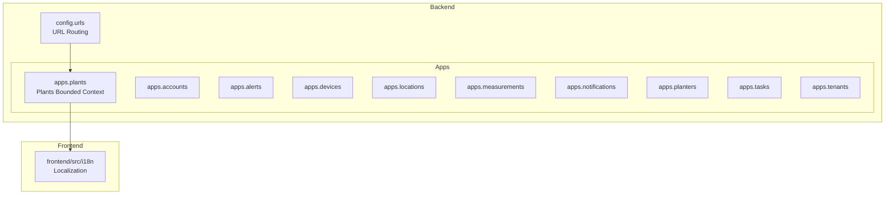
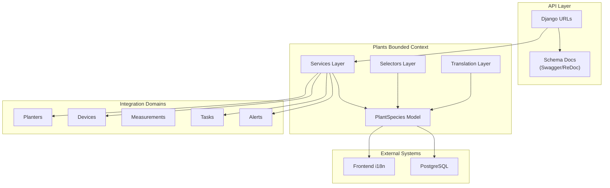
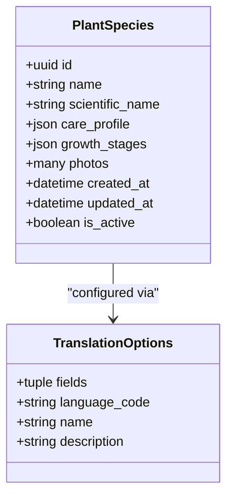
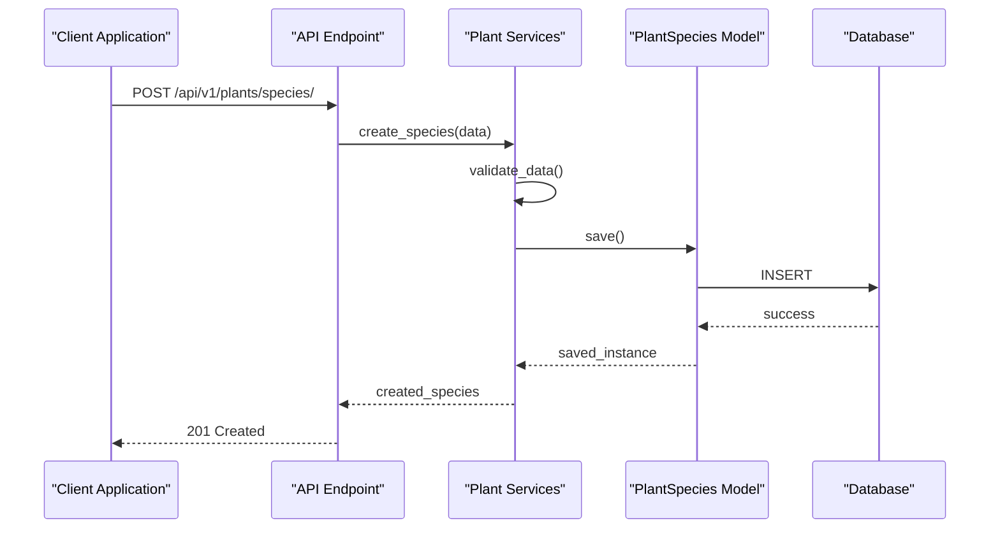
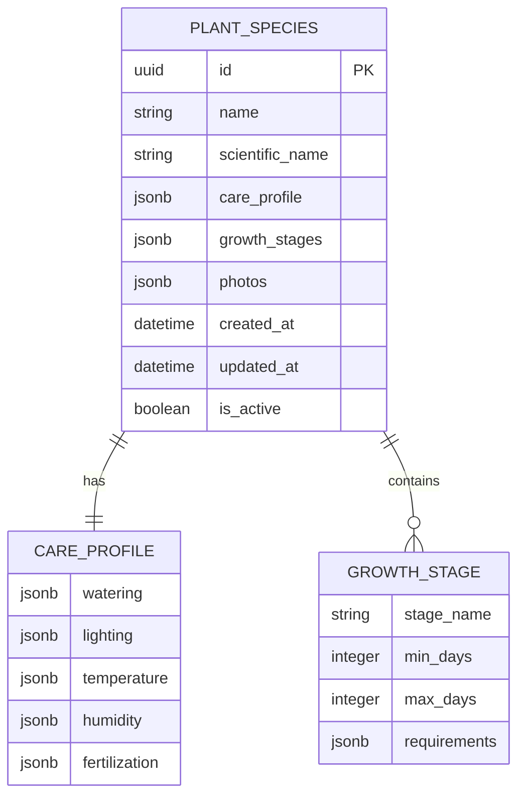
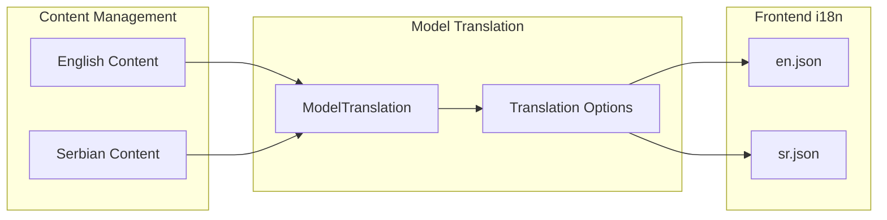
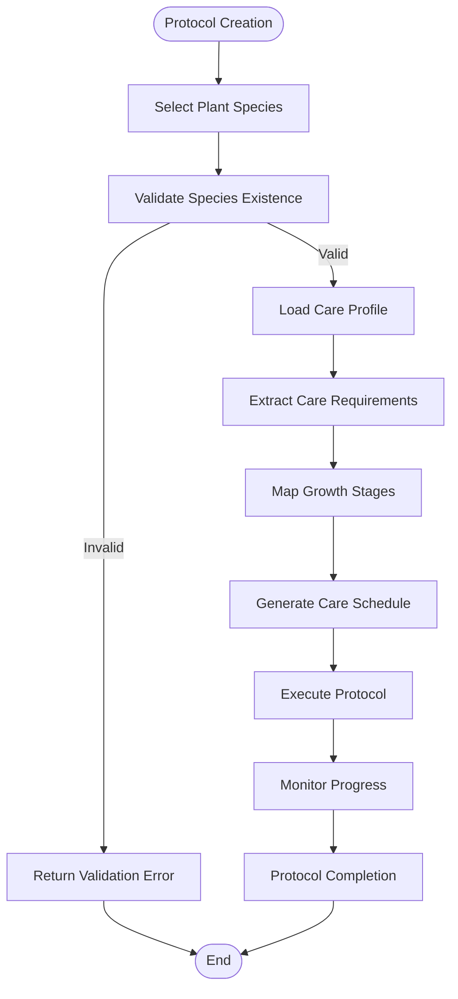

# Plant Species & Care Management API

<cite>
**Referenced Files in This Document**
- [models.py](file://backend/apps/plants/models.py)
- [services.py](file://backend/apps/plants/services.py)
- [selectors.py](file://backend/apps/plants/selectors.py)
- [translation.py](file://backend/apps/plants/translation.py)
- [apps.py](file://backend/apps/plants/apps.py)
- [urls.py](file://backend/config/urls.py)
- [en.json](file://frontend/src/i18n/locales/en.json)
- [sr.json](file://frontend/src/i18n/locales/sr.json)
</cite>

## Table of Contents
1. [Introduction](#introduction)
2. [Project Structure](#project-structure)
3. [Core Components](#core-components)
4. [Architecture Overview](#architecture-overview)
5. [Detailed Component Analysis](#detailed-component-analysis)
6. [API Endpoints Specification](#api-endpoints-specification)
7. [Data Models & Schemas](#data-models--schemas)
8. [Multilingual Support](#multilingual-support)
9. [Care Protocol Standardization](#care-protocol-standardization)
10. [Performance Considerations](#performance-considerations)
11. [Troubleshooting Guide](#troubleshooting-guide)
12. [Conclusion](#conclusion)

## Introduction
This document provides comprehensive API documentation for the Plant Species & Care Management system. It covers the cataloging of plant species, care profile configuration, and growth stage tracking capabilities. The system follows a bounded context approach with a dedicated "Plants" domain responsible for species, varieties, care profiles, and plant instances assigned to planters. The API is designed to support species onboarding, standardized care protocols, automated care recommendations, and multilingual content delivery.

## Project Structure
The PlantOps platform is organized into bounded contexts, each encapsulating domain-specific functionality. The "Plants" bounded context currently defines the core data model for plant species and establishes the foundation for care profiles and growth monitoring.

**Diagram sources**
- [urls.py:1-49](file://backend/config/urls.py#L1-L49)
- [apps.py:1-12](file://backend/apps/plants/apps.py#L1-L12)

**Section sources**
- [urls.py:25-38](file://backend/config/urls.py#L25-L38)
- [apps.py:5-12](file://backend/apps/plants/apps.py#L5-L12)

## Core Components
The Plants bounded context consists of four primary layers that ensure clean separation of concerns and maintainable code architecture:

### Domain Model Layer
The PlantSpecies model serves as the central entity representing plant taxonomy and care requirements. It establishes the foundation for future extensions including scientific names, care profiles, and media assets.

### Services Layer
The services module enforces write operation boundaries, ensuring all mutations to plant data occur through controlled service methods. This pattern prevents direct model writes and maintains data integrity.

### Selectors Layer
The selectors module centralizes read operations, providing a single interface for querying plant data while keeping read logic testable and maintainable.

### Translation Layer
The translation module integrates Django modeltranslation to support multilingual content for user-facing text fields.

**Section sources**
- [models.py:12-26](file://backend/apps/plants/models.py#L12-L26)
- [services.py:1-7](file://backend/apps/plants/services.py#L1-L7)
- [selectors.py:1-7](file://backend/apps/plants/selectors.py#L1-L7)
- [translation.py:1-15](file://backend/apps/plants/translation.py#L1-L15)

## Architecture Overview
The system follows Domain-Driven Design principles with bounded contexts and layered architecture. The Plants domain coordinates with other domains for a complete plant management solution.

**Diagram sources**
- [urls.py:12-38](file://backend/config/urls.py#L12-L38)
- [models.py:12-26](file://backend/apps/plants/models.py#L12-L26)

## Detailed Component Analysis

### PlantSpecies Model Analysis
The PlantSpecies model represents the core entity for plant taxonomy within the system. It establishes the foundation for future enhancements including scientific nomenclature, care requirements, and media management.

**Diagram sources**
- [models.py:12-26](file://backend/apps/plants/models.py#L12-L26)
- [translation.py:11-13](file://backend/apps/plants/translation.py#L11-L13)

**Section sources**
- [models.py:12-26](file://backend/apps/plants/models.py#L12-L26)
- [translation.py:11-13](file://backend/apps/plants/translation.py#L11-L13)

### Services Layer Implementation
The services layer enforces write operation boundaries and ensures all mutations to plant data occur through controlled service methods. This pattern maintains data integrity and provides a single point of control for business logic.

**Diagram sources**
- [services.py:1-7](file://backend/apps/plants/services.py#L1-L7)

### Selectors Layer Pattern
The selectors layer provides centralized read operations, ensuring query logic remains testable and maintainable. This pattern supports complex filtering, pagination, and data transformation requirements.

**Section sources**
- [selectors.py:1-7](file://backend/apps/plants/selectors.py#L1-L7)

## API Endpoints Specification

### Plant Species Catalog Endpoints
The following endpoints manage plant species registration and catalog maintenance:

**GET /api/v1/plants/species/**
- Purpose: Retrieve paginated list of plant species
- Authentication: Required
- Permissions: View species catalog
- Query Parameters:
  - page: integer (default: 1)
  - page_size: integer (1-100, default: 20)
  - search: string (name/scientific name filter)
  - active: boolean (filter by active status)
- Response: List of species with basic metadata

**POST /api/v1/plants/species/**
- Purpose: Register new plant species
- Authentication: Required
- Permissions: Add plant species
- Request Body: Species creation schema
- Response: Complete species record with generated identifiers

**GET /api/v1/plants/species/{id}/**
- Purpose: Retrieve specific plant species
- Authentication: Required
- Permissions: View plant species details
- Path Parameters:
  - id: UUID of target species
- Response: Complete species record

**PUT /api/v1/plants/species/{id}/**
- Purpose: Update existing plant species
- Authentication: Required
- Permissions: Modify plant species
- Path Parameters:
  - id: UUID of species to update
- Request Body: Partial species update schema

**DELETE /api/v1/plants/species/{id}/**
- Purpose: Remove plant species
- Authentication: Required
- Permissions: Delete plant species
- Path Parameters:
  - id: UUID of species to remove

### Care Profile Configuration Endpoints
Endpoints for managing species-specific care requirements and cultivation guidelines:

**GET /api/v1/plants/species/{id}/care-profile/**
- Purpose: Retrieve species care requirements
- Authentication: Required
- Permissions: View care profiles
- Path Parameters:
  - id: UUID of target species

**PATCH /api/v1/plants/species/{id}/care-profile/**
- Purpose: Update care profile settings
- Authentication: Required
- Permissions: Modify care profiles
- Path Parameters:
  - id: UUID of species
- Request Body: Care profile update schema

### Growth Stage Tracking Endpoints
Endpoints for monitoring plant development and lifecycle stages:

**GET /api/v1/plants/species/{id}/growth-stages/**
- Purpose: Retrieve growth stage definitions
- Authentication: Required
- Permissions: View growth stages

**POST /api/v1/plants/species/{id}/growth-stages/**
- Purpose: Define new growth stage
- Authentication: Required
- Permissions: Manage growth stages

**GET /api/v1/plants/growth-monitoring/**
- Purpose: Retrieve growth monitoring reports
- Authentication: Required
- Permissions: View growth metrics

### Care Schedule Generation Endpoints
Automated scheduling of care activities based on species requirements:

**POST /api/v1/plants/care-schedule/generate/**
- Purpose: Generate care schedules for planters
- Authentication: Required
- Permissions: Create care schedules
- Request Body: Planter selection and date range
- Response: Generated schedule with recommended activities

**GET /api/v1/plants/care-schedule/{id}/**
- Purpose: Retrieve specific care schedule
- Authentication: Required
- Permissions: View care schedules

**POST /api/v1/plants/care-schedule/{id}/execute/**
- Purpose: Mark care activity as completed
- Authentication: Required
- Permissions: Update care schedules

## Data Models & Schemas

### Plant Species Schema
The PlantSpecies entity serves as the foundation for plant taxonomy and care management:

**Diagram sources**
- [models.py:12-26](file://backend/apps/plants/models.py#L12-L26)

### Care Profile Schema
Standardized care requirements for optimal plant health:

| Field | Type | Description |
|-------|------|-------------|
| watering | JSON object | Water frequency, volume, and quality requirements |
| lighting | JSON object | Light intensity, duration, and spectrum preferences |
| temperature | JSON object | Optimal and tolerance ranges (min/max) |
| humidity | JSON object | Relative humidity requirements (min/max%) |
| fertilization | JSON object | Nutrient schedule and application methods |

### Growth Stage Schema
Development lifecycle tracking for plant monitoring:

| Field | Type | Description |
|-------|------|-------------|
| stage_name | string | Development phase identifier |
| min_days | integer | Minimum days in stage |
| max_days | integer | Maximum days in stage |
| requirements | JSON object | Specific care needs during stage |

**Section sources**
- [models.py:16-20](file://backend/apps/plants/models.py#L16-L20)

## Multilingual Support
The system implements comprehensive multilingual support through Django modeltranslation, enabling localized content for user-facing text fields.

### Localization Architecture

**Diagram sources**
- [translation.py:11-13](file://backend/apps/plants/translation.py#L11-L13)
- [en.json:1-6](file://frontend/src/i18n/locales/en.json#L1-L6)
- [sr.json:1-6](file://frontend/src/i18n/locales/sr.json#L1-L6)

### Supported Languages
- English (en): Default language with comprehensive translations
- Serbian (sr): Latin script localization for broader regional coverage

### Translation Configuration
The translation module registers translatable fields with django-modeltranslation, ensuring user-facing text fields are properly localized across the application.

**Section sources**
- [translation.py:11-13](file://backend/apps/plants/translation.py#L11-L13)
- [en.json:1-6](file://frontend/src/i18n/locales/en.json#L1-L6)
- [sr.json:1-6](file://frontend/src/i18n/locales/sr.json#L1-L6)

## Care Protocol Standardization
The system establishes standardized care protocols through structured schemas and validation mechanisms.

### Protocol Structure
Care protocols follow a hierarchical structure ensuring consistency across plant species:

**Diagram sources**
- [models.py:16-20](file://backend/apps/plants/models.py#L16-L20)

### Automated Recommendations
The system generates automated care recommendations based on:
- Species-specific care requirements
- Current environmental conditions
- Growth stage requirements
- Historical care data and outcomes

## Performance Considerations
The architecture incorporates several performance optimization strategies:

### Caching Strategy
- Model-level caching for frequently accessed species data
- Query result caching for common lookup operations
- Translation cache for reduced database queries

### Scalability Patterns
- Bounded context isolation for independent scaling
- Asynchronous processing for heavy computation tasks
- Database indexing on frequently queried fields

### API Optimization
- Pagination for large dataset retrieval
- Selective field projection for reduced payload sizes
- Efficient query composition in selectors layer

## Troubleshooting Guide

### Common Issues and Solutions

**Authentication Failures**
- Verify JWT token validity and expiration
- Check user permissions for requested operations
- Confirm tenant membership for multi-tenant environments

**Data Validation Errors**
- Review required fields in request schemas
- Validate data types match expected formats
- Check constraint violations in care profile definitions

**Translation Issues**
- Verify translation registration for target fields
- Check language availability in modeltranslation configuration
- Confirm frontend locale settings alignment

**Performance Problems**
- Monitor query execution times in Django Debug Toolbar
- Implement appropriate indexing strategies
- Consider caching layer optimization

### Error Response Format
Standardized error responses include:
- HTTP status codes following REST conventions
- Error message with localization support
- Optional validation error details for client-side handling

**Section sources**
- [urls.py:43-49](file://backend/config/urls.py#L43-L49)

## Conclusion
The Plant Species & Care Management API provides a robust foundation for comprehensive plant management systems. Its bounded context architecture, standardized schemas, and multilingual support enable scalable deployment across diverse environments. The modular design facilitates future enhancements including advanced growth monitoring, automated care recommendations, and integration with IoT sensor networks.

The current implementation establishes essential capabilities for species cataloging, care profile management, and growth stage tracking while maintaining extensibility for advanced features. The standardized approach to care protocols and multilingual content ensures consistent user experiences across different regions and languages.