# Sensor Data API

<cite>
**Referenced Files in This Document**
- [IOT_INGEST.md](file://backend/docs/architecture/IOT_INGEST.md)
- [urls.py](file://backend/config/urls.py)
- [models.py](file://backend/apps/measurements/models.py)
- [services.py](file://backend/apps/measurements/services.py)
- [selectors.py](file://backend/apps/measurements/selectors.py)
- [celery.py](file://backend/config/celery.py)
</cite>

## Table of Contents
1. [Introduction](#introduction)
2. [Project Structure](#project-structure)
3. [Core Components](#core-components)
4. [Architecture Overview](#architecture-overview)
5. [Detailed Component Analysis](#detailed-component-analysis)
6. [Dependency Analysis](#dependency-analysis)
7. [Performance Considerations](#performance-considerations)
8. [Troubleshooting Guide](#troubleshooting-guide)
9. [Conclusion](#conclusion)
10. [Appendices](#appendices)

## Introduction
This document provides comprehensive API documentation for sensor data ingestion, processing, and retrieval. It covers raw data ingestion endpoints, validation rules, transformation workflows, real-time streaming capabilities, batch upload procedures, historical data access patterns, quality assurance processes, and data export operations. It also outlines data retention, compression, and archiving mechanisms grounded in the documented pipeline.

## Project Structure
The sensor data domain is implemented as part of the measurements bounded context. The ingestion pipeline is defined in the IoT ingest documentation and is integrated into the Django URL routing. Background processing is configured via Celery.

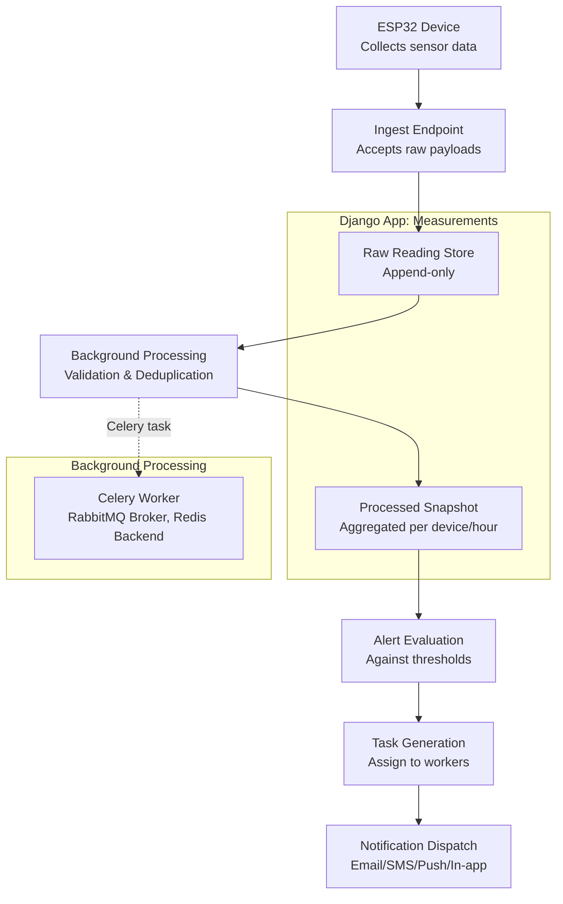

**Diagram sources**
- [IOT_INGEST.md:1-88](file://backend/docs/architecture/IOT_INGEST.md#L1-L88)
- [urls.py:25-38](file://backend/config/urls.py#L25-L38)

**Section sources**
- [urls.py:12-38](file://backend/config/urls.py#L12-L38)
- [IOT_INGEST.md:5-30](file://backend/docs/architecture/IOT_INGEST.md#L5-L30)

## Core Components
- Ingestion endpoint: Accepts raw sensor payloads from devices, validates device identity, persists raw data, and returns an immediate acknowledgment for asynchronous processing.
- Raw reading storage: Append-only persistence of incoming sensor payloads with metadata such as device identifier, sensor type, measured timestamp, server-received timestamp, and raw payload container.
- Background processing: Idempotent Celery tasks that validate ranges, deduplicate entries, handle time drift, and produce processed snapshots.
- Snapshot store: Aggregated per-device-per-hour views used for dashboards and analytics.
- Alert evaluation and task generation: Threshold-based evaluation leading to alert events and task creation.
- Notification dispatch: Multi-channel notifications for alerts and tasks.

**Section sources**
- [IOT_INGEST.md:34-70](file://backend/docs/architecture/IOT_INGEST.md#L34-L70)
- [models.py:14-29](file://backend/apps/measurements/models.py#L14-L29)
- [services.py:1-8](file://backend/apps/measurements/services.py#L1-L8)
- [selectors.py:1-7](file://backend/apps/measurements/selectors.py#L1-L7)
- [celery.py:1-27](file://backend/config/celery.py#L1-L27)

## Architecture Overview
The system follows a decoupled ingestion-to-actionable-workflow pattern:
- Devices send raw payloads via HTTP or MQTT to the ingest endpoint.
- The ingest endpoint stores raw readings append-only and returns an immediate acknowledgment.
- Background Celery workers process raw readings, validate and transform them, and emit snapshots.
- Downstream services evaluate snapshots to generate alerts, tasks, and notifications.

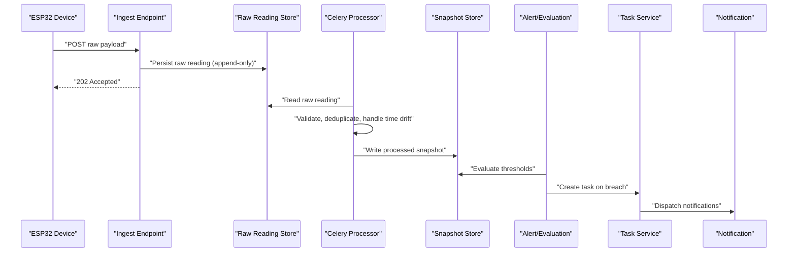

**Diagram sources**
- [IOT_INGEST.md:39-70](file://backend/docs/architecture/IOT_INGEST.md#L39-L70)
- [models.py:14-29](file://backend/apps/measurements/models.py#L14-L29)
- [celery.py:14-21](file://backend/config/celery.py#L14-L21)

## Detailed Component Analysis

### Ingestion Endpoint
- Purpose: Receive raw sensor data from devices, validate device identity, persist raw payload, and return an immediate acknowledgment for asynchronous processing.
- Authentication: Validates API key/device token before accepting the payload.
- Persistence: Immediately stores the raw payload in the append-only raw reading store.
- Response: Returns 202 Accepted to indicate asynchronous processing.

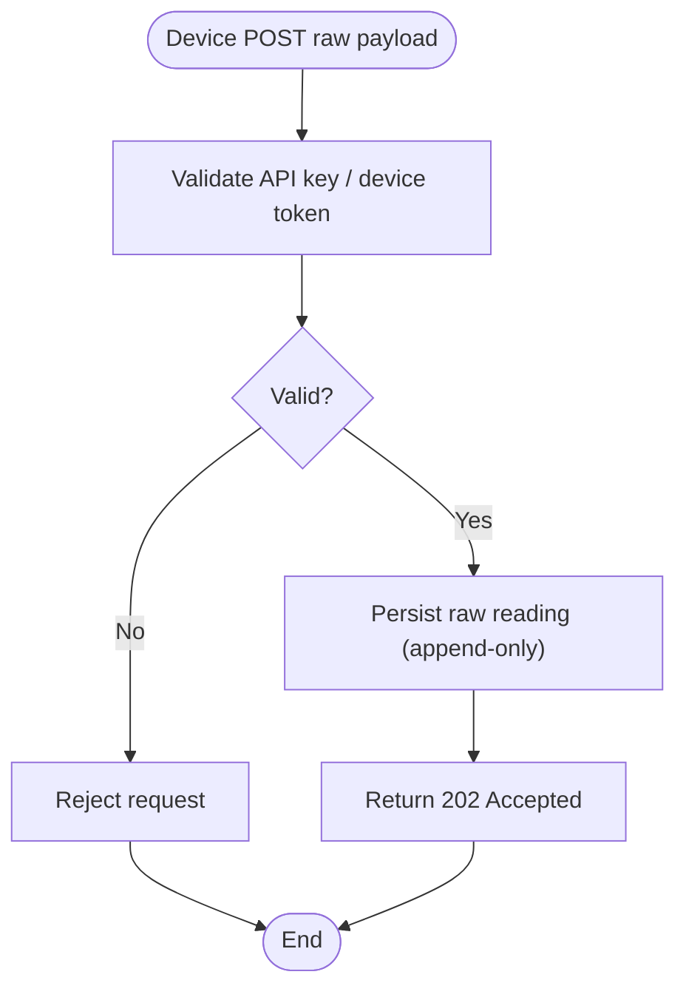

**Diagram sources**
- [IOT_INGEST.md:39-43](file://backend/docs/architecture/IOT_INGEST.md#L39-L43)

**Section sources**
- [IOT_INGEST.md:39-43](file://backend/docs/architecture/IOT_INGEST.md#L39-L43)

### Raw Reading Model
- Purpose: Encapsulate raw sensor readings with metadata and raw payload container.
- Append-only constraint: Critical rule that raw readings are never updated or deleted.
- Metadata fields: Device identifier, sensor type, value, unit, measured timestamp, server-received timestamp, and raw payload JSON.

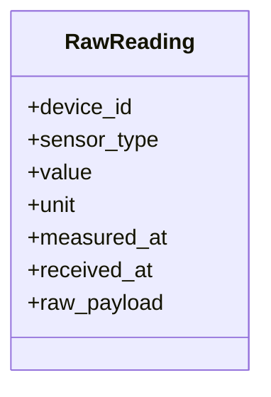

**Diagram sources**
- [models.py:14-29](file://backend/apps/measurements/models.py#L14-L29)

**Section sources**
- [models.py:14-29](file://backend/apps/measurements/models.py#L14-L29)

### Background Processing and Transformation
- Purpose: Validate ranges, deduplicate, handle time drift, and produce processed snapshots.
- Idempotency: Processing is designed to be idempotent; reprocessing does not create duplicates.
- Trigger: Celery tasks consume raw readings and emit snapshots.

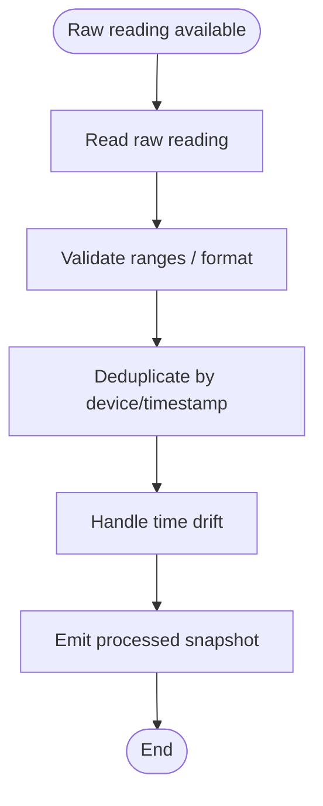

**Diagram sources**
- [IOT_INGEST.md:50-57](file://backend/docs/architecture/IOT_INGEST.md#L50-L57)
- [celery.py:14-21](file://backend/config/celery.py#L14-L21)

**Section sources**
- [IOT_INGEST.md:50-57](file://backend/docs/architecture/IOT_INGEST.md#L50-L57)
- [celery.py:14-21](file://backend/config/celery.py#L14-L21)

### Snapshot Store and Retrieval
- Purpose: Provide aggregated per-device-per-hour views for dashboards and analytics.
- Access: Centralized read logic through selectors ensures consistent querying and testability.

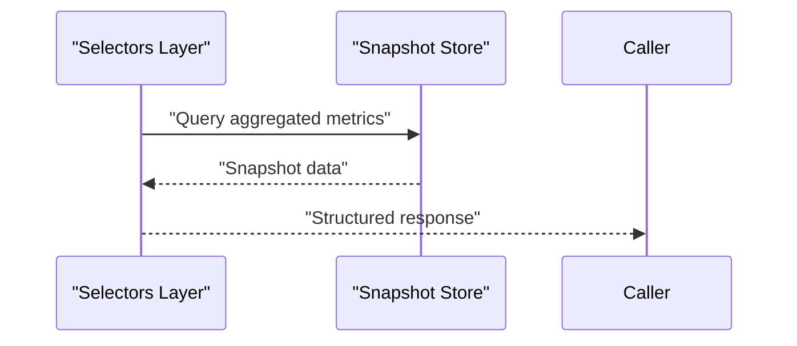

**Diagram sources**
- [selectors.py:1-7](file://backend/apps/measurements/selectors.py#L1-L7)

**Section sources**
- [selectors.py:1-7](file://backend/apps/measurements/selectors.py#L1-L7)

### Alert Evaluation, Task Generation, and Notifications
- Purpose: Evaluate snapshots against thresholds, generate alerts and tasks, and dispatch notifications.
- Append-only alerts: Alert events are append-only; resolution is modeled as a new event.

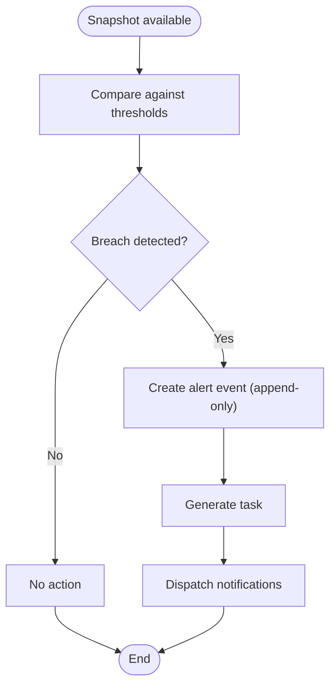

**Diagram sources**
- [IOT_INGEST.md:59-70](file://backend/docs/architecture/IOT_INGEST.md#L59-L70)

**Section sources**
- [IOT_INGEST.md:59-70](file://backend/docs/architecture/IOT_INGEST.md#L59-L70)

### Real-Time Streaming and Batch Upload
- Real-time streaming: Devices can stream via MQTT or HTTP; ingestion accepts continuous streams.
- Batch upload: HTTP POST endpoints support batch payloads; each payload is treated independently and stored append-only.

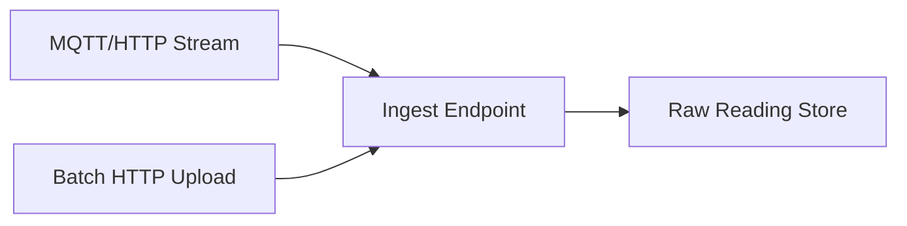

**Diagram sources**
- [IOT_INGEST.md:34-43](file://backend/docs/architecture/IOT_INGEST.md#L34-L43)

**Section sources**
- [IOT_INGEST.md:34-43](file://backend/docs/architecture/IOT_INGEST.md#L34-L43)

### Historical Data Access Patterns
- Aggregation windows: Snapshots are produced per device per hour for historical analysis.
- Retrieval: Use selectors to query aggregated metrics over desired time ranges.

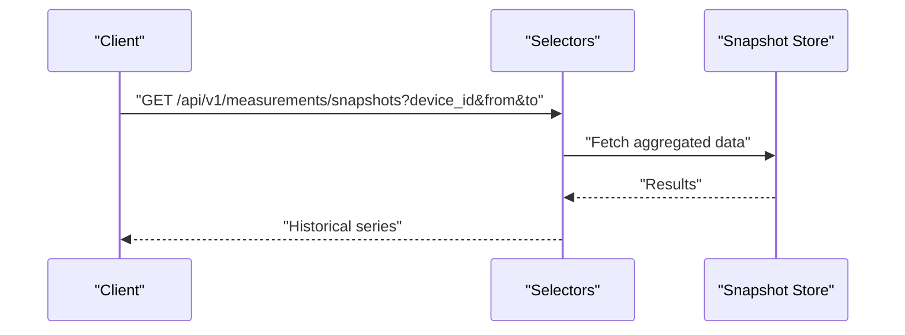

**Diagram sources**
- [selectors.py:1-7](file://backend/apps/measurements/selectors.py#L1-L7)

**Section sources**
- [selectors.py:1-7](file://backend/apps/measurements/selectors.py#L1-L7)

### Data Export Operations
- Purpose: Provide structured exports of processed snapshots for external systems.
- Mechanism: Use selectors to retrieve aggregated data and format for export.

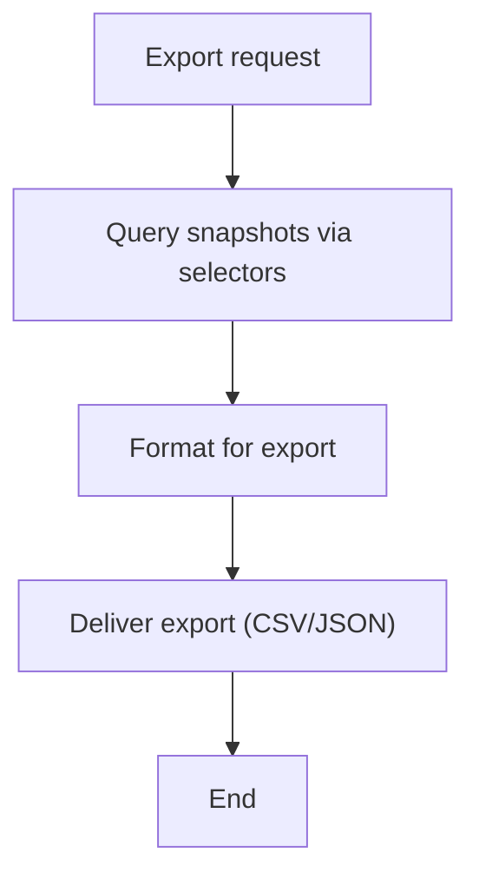

**Diagram sources**
- [selectors.py:1-7](file://backend/apps/measurements/selectors.py#L1-L7)

**Section sources**
- [selectors.py:1-7](file://backend/apps/measurements/selectors.py#L1-L7)

## Dependency Analysis
- URL wiring: The measurements API is gated behind a placeholder route that can be enabled as the API develops.
- Background processing: Celery is configured with RabbitMQ as the broker and Redis as the result backend; tasks are auto-discovered from Django apps.

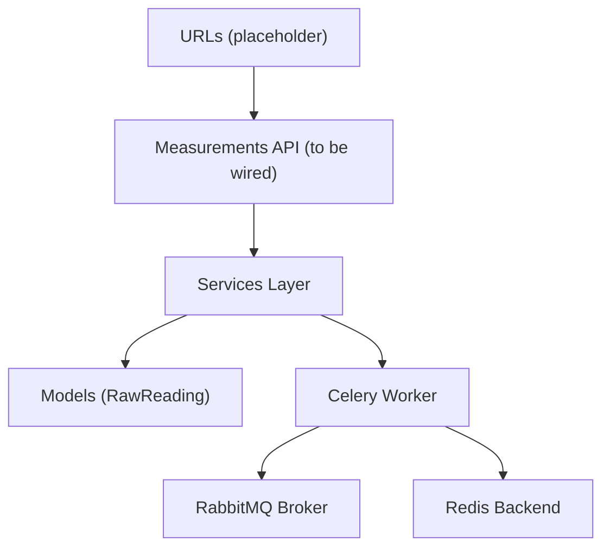

**Diagram sources**
- [urls.py:25-38](file://backend/config/urls.py#L25-L38)
- [celery.py:14-21](file://backend/config/celery.py#L14-L21)

**Section sources**
- [urls.py:25-38](file://backend/config/urls.py#L25-L38)
- [celery.py:14-21](file://backend/config/celery.py#L14-L21)

## Performance Considerations
- Asynchronous processing: Immediate acknowledgment reduces latency for devices; heavy processing happens off the request thread.
- Idempotent processing: Reduces cost and risk of duplicate work during retries.
- Aggregation windows: Hourly snapshots balance fidelity and performance for analytics.
- Background queue: Celery distributes load across workers; ensure adequate worker scaling for peak ingestion rates.

[No sources needed since this section provides general guidance]

## Troubleshooting Guide
- Ingestion failures: Verify device authentication and payload format; confirm raw reading persistence and 202 acknowledgment.
- Processing errors: Inspect Celery logs and task queues; ensure RabbitMQ and Redis are reachable.
- Data gaps: Confirm idempotency and deduplication logic; check for time drift handling.
- Snapshot discrepancies: Validate selector queries and aggregation logic; ensure hourly window alignment.

**Section sources**
- [IOT_INGEST.md:72-88](file://backend/docs/architecture/IOT_INGEST.md#L72-L88)
- [celery.py:14-21](file://backend/config/celery.py#L14-L21)

## Conclusion
The sensor data API is built around an append-only ingestion model, robust background processing, and idempotent transformations. This design ensures data integrity, scalability, and maintainability while enabling real-time streaming, batch uploads, historical access, and actionable alerts.

[No sources needed since this section summarizes without analyzing specific files]

## Appendices

### Data Retention, Compression, and Archiving
- Retention: Define retention periods for raw readings and snapshots aligned with compliance and operational needs.
- Compression: Compress raw payloads at ingestion if bandwidth is constrained; decompress during processing.
- Archiving: Archive older snapshots to cold storage for long-term analytics while maintaining fast access to recent data.

[No sources needed since this section provides general guidance]