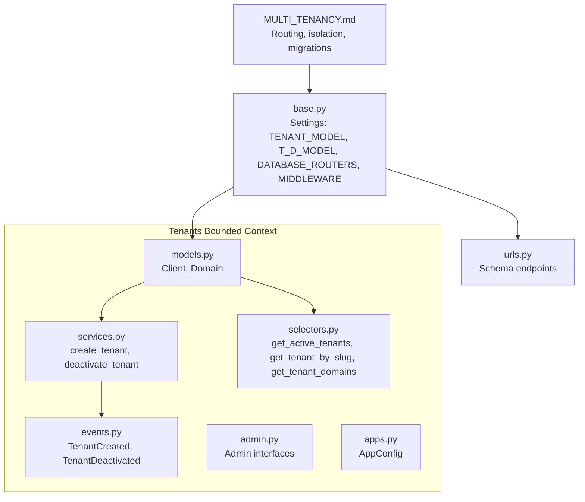
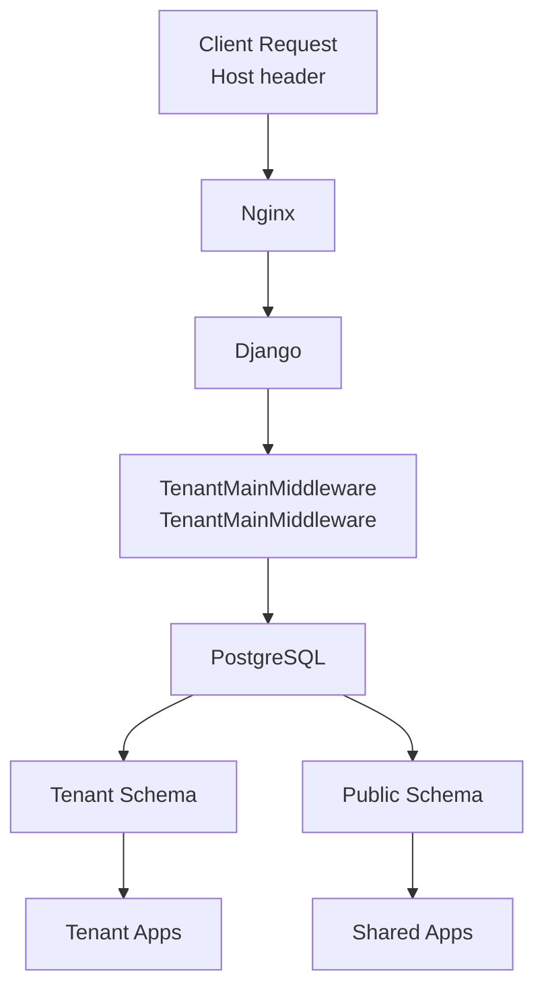
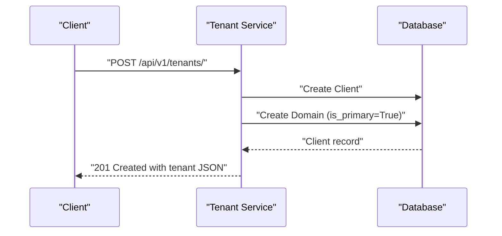
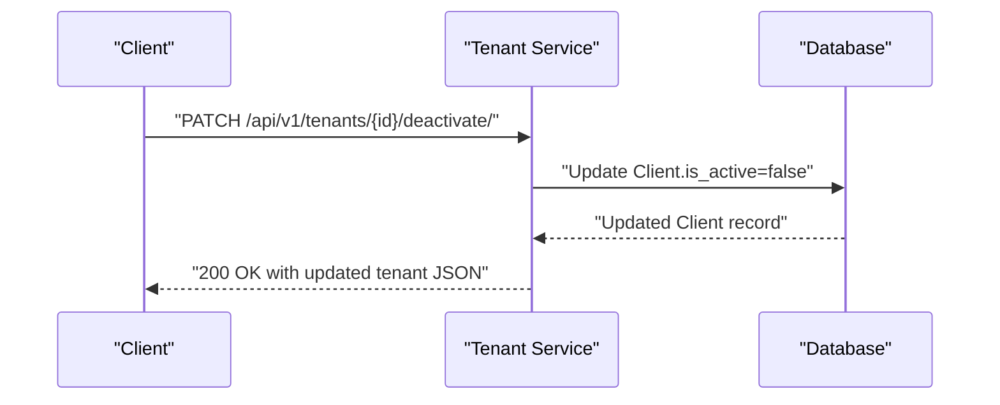
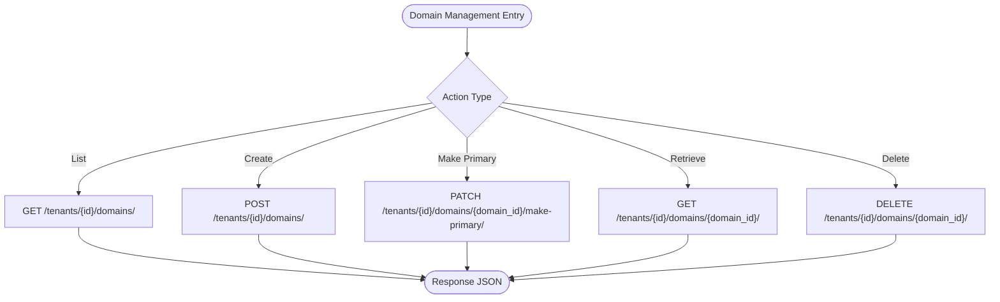
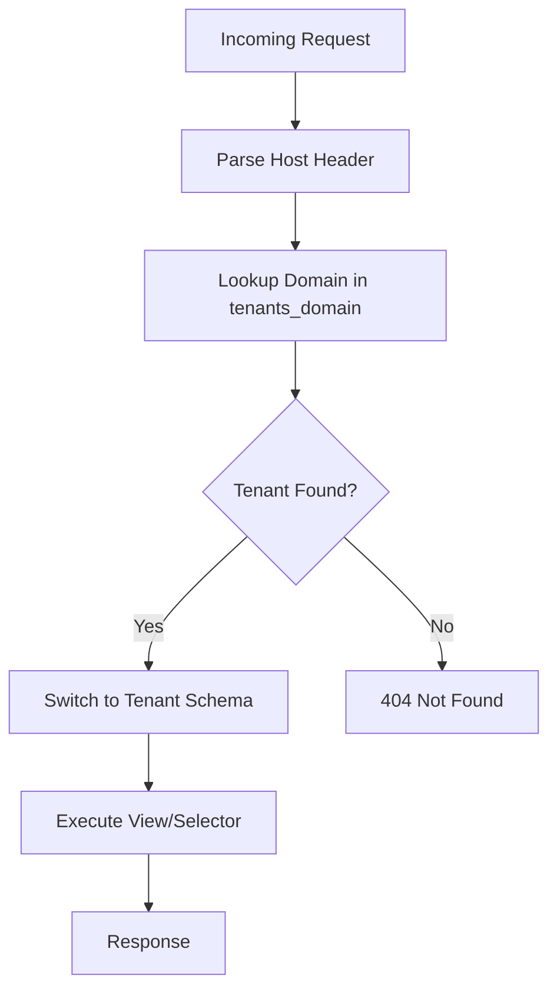
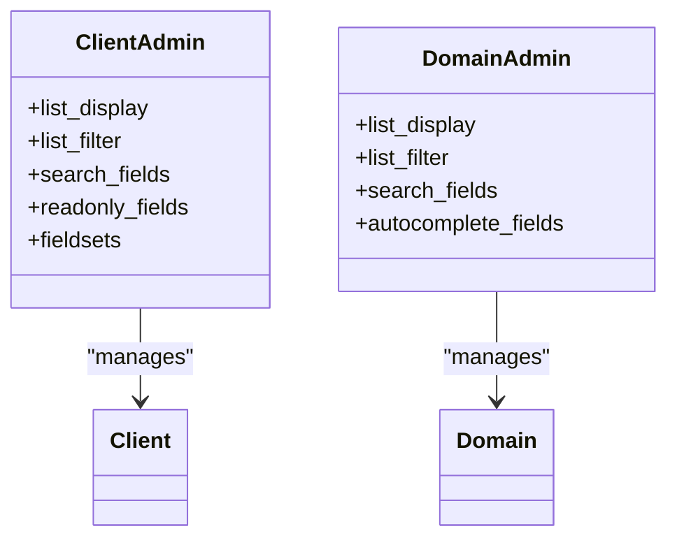
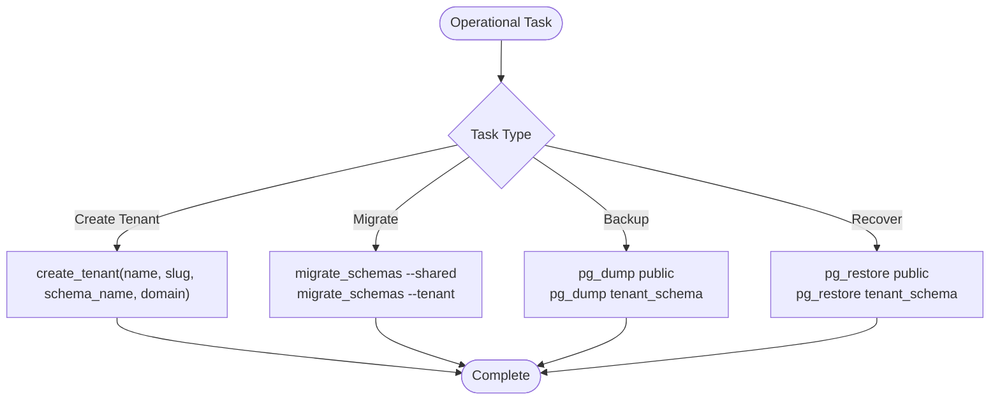
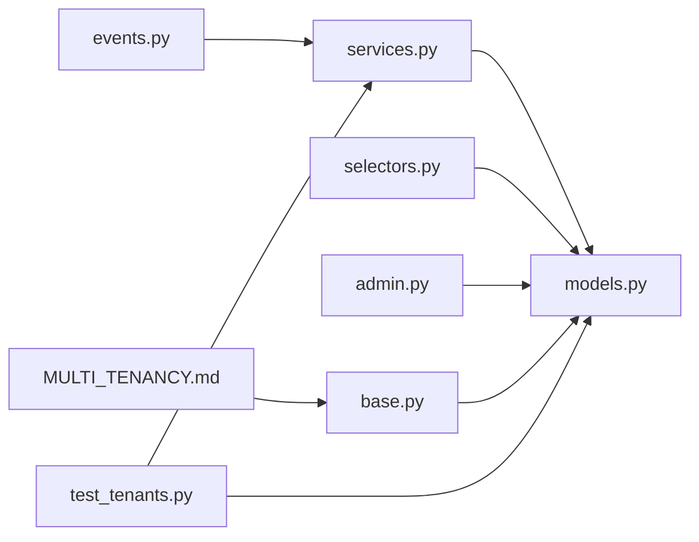

# Tenant Management API

<cite>
**Referenced Files in This Document**
- [models.py](file://backend/apps/tenants/models.py)
- [services.py](file://backend/apps/tenants/services.py)
- [selectors.py](file://backend/apps/tenants/selectors.py)
- [events.py](file://backend/apps/tenants/events.py)
- [admin.py](file://backend/apps/tenants/admin.py)
- [apps.py](file://backend/apps/tenants/apps.py)
- [MULTI_TENANCY.md](file://backend/docs/architecture/MULTI_TENANCY.md)
- [base.py](file://backend/config/settings/base.py)
- [urls.py](file://backend/config/urls.py)
- [test_tenants.py](file://backend/tests/test_tenants.py)
</cite>

## Table of Contents
1. [Introduction](#introduction)
2. [Project Structure](#project-structure)
3. [Core Components](#core-components)
4. [Architecture Overview](#architecture-overview)
5. [Detailed Component Analysis](#detailed-component-analysis)
6. [Dependency Analysis](#dependency-analysis)
7. [Performance Considerations](#performance-considerations)
8. [Troubleshooting Guide](#troubleshooting-guide)
9. [Conclusion](#conclusion)
10. [Appendices](#appendices)

## Introduction
This document provides comprehensive API documentation for tenant management operations in a multi-tenant SaaS platform built with Django and django-tenants. It covers tenant provisioning, domain configuration, and tenant lifecycle management. It also documents tenant-specific data access patterns, isolation mechanisms, and operational procedures such as tenant migration, backup, and recovery.

The system uses PostgreSQL schemas for physical tenant isolation, with a dedicated public schema containing shared tables and per-tenant schemas for isolated data. Requests are routed to the appropriate tenant schema based on the Host header using middleware.

## Project Structure
The tenant management functionality resides in the tenants bounded context and integrates with the broader application architecture:

- Models define the tenant and domain entities with isolation attributes.
- Services encapsulate all write operations for tenant provisioning and lifecycle changes.
- Selectors centralize read operations for tenant and domain queries.
- Events represent domain actions for eventual consistency and auditability.
- Settings configure multi-tenancy, middleware, and database routing.
- Documentation outlines routing, isolation policies, and operational procedures.

**Diagram sources**
- [models.py:1-77](file://backend/apps/tenants/models.py#L1-L77)
- [services.py:1-42](file://backend/apps/tenants/services.py#L1-L42)
- [selectors.py:1-26](file://backend/apps/tenants/selectors.py#L1-L26)
- [events.py:1-36](file://backend/apps/tenants/events.py#L1-L36)
- [admin.py:1-25](file://backend/apps/tenants/admin.py#L1-L25)
- [apps.py:1-11](file://backend/apps/tenants/apps.py#L1-L11)
- [base.py:99-119](file://backend/config/settings/base.py#L99-L119)
- [MULTI_TENANCY.md:12-26](file://backend/docs/architecture/MULTI_TENANCY.md#L12-L26)
- [urls.py:21-23](file://backend/config/urls.py#L21-L23)

**Section sources**
- [models.py:1-77](file://backend/apps/tenants/models.py#L1-L77)
- [services.py:1-42](file://backend/apps/tenants/services.py#L1-L42)
- [selectors.py:1-26](file://backend/apps/tenants/selectors.py#L1-L26)
- [events.py:1-36](file://backend/apps/tenants/events.py#L1-L36)
- [admin.py:1-25](file://backend/apps/tenants/admin.py#L1-L25)
- [apps.py:1-11](file://backend/apps/tenants/apps.py#L1-L11)
- [base.py:99-119](file://backend/config/settings/base.py#L99-L119)
- [MULTI_TENANCY.md:12-26](file://backend/docs/architecture/MULTI_TENANCY.md#L12-L26)
- [urls.py:21-23](file://backend/config/urls.py#L21-L23)

## Core Components
This section documents the core tenant management components and their responsibilities.

- Client (Tenant): Represents a tenant organization with metadata and lifecycle status. It inherits tenant isolation capabilities from the framework.
- Domain: Maps hostnames to tenants and tracks primary domains for URL generation.
- Services: Encapsulates all write operations for tenant provisioning and deactivation.
- Selectors: Centralizes read operations for tenant and domain queries.
- Events: Lightweight dataclasses representing domain actions for eventual consistency.
- Admin: Provides administrative interfaces for managing tenants and domains.
- Settings: Configure multi-tenancy, middleware, and database routing.

Key implementation references:
- Tenant model fields and isolation behavior: [models.py:6-53](file://backend/apps/tenants/models.py#L6-L53)
- Domain model fields and primary flag: [models.py:56-76](file://backend/apps/tenants/models.py#L56-L76)
- Tenant creation service: [services.py:11-35](file://backend/apps/tenants/services.py#L11-L35)
- Tenant deactivation service: [services.py:38-41](file://backend/apps/tenants/services.py#L38-L41)
- Read operations: [selectors.py:13-25](file://backend/apps/tenants/selectors.py#L13-L25)
- Domain events: [events.py:19-35](file://backend/apps/tenants/events.py#L19-L35)
- Admin interfaces: [admin.py:7-24](file://backend/apps/tenants/admin.py#L7-L24)
- Settings configuration: [base.py:99-119](file://backend/config/settings/base.py#L99-L119)

**Section sources**
- [models.py:6-53](file://backend/apps/tenants/models.py#L6-L53)
- [models.py:56-76](file://backend/apps/tenants/models.py#L56-L76)
- [services.py:11-35](file://backend/apps/tenants/services.py#L11-L35)
- [services.py:38-41](file://backend/apps/tenants/services.py#L38-L41)
- [selectors.py:13-25](file://backend/apps/tenants/selectors.py#L13-L25)
- [events.py:19-35](file://backend/apps/tenants/events.py#L19-L35)
- [admin.py:7-24](file://backend/apps/tenants/admin.py#L7-L24)
- [base.py:99-119](file://backend/config/settings/base.py#L99-L119)

## Architecture Overview
The system employs a fail-closed multi-tenancy model using PostgreSQL schemas. Requests are routed to the tenant schema based on the Host header, ensuring strict isolation between tenants.

**Diagram sources**
- [MULTI_TENANCY.md:12-19](file://backend/docs/architecture/MULTI_TENANCY.md#L12-L19)
- [base.py:107-119](file://backend/config/settings/base.py#L107-L119)

Tenant routing and isolation policies:
- Tenant resolution uses the Host header to switch schemas.
- Default behavior rejects requests when no tenant is resolved.
- Cross-tenant queries are prohibited; background jobs must use tenant context.
- Public schema is restricted to specific applications and admin access.

**Section sources**
- [MULTI_TENANCY.md:12-26](file://backend/docs/architecture/MULTI_TENANCY.md#L12-L26)
- [base.py:107-119](file://backend/config/settings/base.py#L107-L119)

## Detailed Component Analysis

### Tenant Provisioning API
This section documents the tenant creation workflow and the associated data structures.

- Endpoint: POST /api/v1/tenants/
- Authentication: Requires authenticated session.
- Request body fields:
  - name: string (required)
  - slug: string (required)
  - schema_name: string (required)
  - domain: string (required)
  - description: string (optional)
- Response body fields:
  - id: integer
  - name: string
  - slug: string
  - schema_name: string
  - description: string
  - is_active: boolean
  - created_at: datetime
  - updated_at: datetime
- Notes:
  - The service creates both the tenant and its primary domain atomically.
  - The tenant is activated by default.

**Diagram sources**
- [services.py:11-35](file://backend/apps/tenants/services.py#L11-L35)
- [models.py:6-53](file://backend/apps/tenants/models.py#L6-L53)
- [models.py:56-76](file://backend/apps/tenants/models.py#L56-L76)

**Section sources**
- [services.py:11-35](file://backend/apps/tenants/services.py#L11-L35)
- [models.py:6-53](file://backend/apps/tenants/models.py#L6-L53)
- [models.py:56-76](file://backend/apps/tenants/models.py#L56-L76)

### Tenant Deactivation API
This section documents the tenant deactivation workflow.

- Endpoint: PATCH /api/v1/tenants/{id}/deactivate/
- Authentication: Requires authenticated session.
- Path parameters:
  - id: integer (tenant ID)
- Response body fields:
  - id: integer
  - name: string
  - slug: string
  - schema_name: string
  - description: string
  - is_active: boolean
  - updated_at: datetime
- Notes:
  - Soft-deactivation sets is_active to false while retaining data.
  - Inactive tenants are excluded from routing and background jobs.

**Diagram sources**
- [services.py:38-41](file://backend/apps/tenants/services.py#L38-L41)
- [models.py:29-33](file://backend/apps/tenants/models.py#L29-L33)

**Section sources**
- [services.py:38-41](file://backend/apps/tenants/services.py#L38-L41)
- [models.py:29-33](file://backend/apps/tenants/models.py#L29-L33)

### Domain Management API
This section documents domain mapping and retrieval operations.

- List domains for a tenant: GET /api/v1/tenants/{id}/domains/
- Create domain for a tenant: POST /api/v1/tenants/{id}/domains/
- Toggle primary domain: PATCH /api/v1/tenants/{id}/domains/{domain_id}/make-primary/
- Retrieve domain by ID: GET /api/v1/tenants/{id}/domains/{domain_id}/
- Delete domain: DELETE /api/v1/tenants/{id}/domains/{domain_id}/
- Request body fields (create domain):
  - domain: string (required)
  - is_primary: boolean (optional)
- Response body fields:
  - id: integer
  - domain: string
  - is_primary: boolean
  - tenant_id: integer

**Diagram sources**
- [selectors.py:23-25](file://backend/apps/tenants/selectors.py#L23-L25)
- [models.py:56-76](file://backend/apps/tenants/models.py#L56-L76)

**Section sources**
- [selectors.py:23-25](file://backend/apps/tenants/selectors.py#L23-L25)
- [models.py:56-76](file://backend/apps/tenants/models.py#L56-L76)

### Tenant Data Access Patterns and Isolation
Tenant data access follows strict isolation rules enforced by middleware and settings:

- Tenant resolution: Middleware inspects the Host header and switches to the tenant schema.
- Fail-closed policy: Requests without a resolved tenant receive a 404.
- Cross-tenant queries: Prohibited in views; use tenant_context() in background jobs.
- Read/write boundaries: All reads go through selectors; all writes go through services.

**Diagram sources**
- [MULTI_TENANCY.md:12-19](file://backend/docs/architecture/MULTI_TENANCY.md#L12-L19)
- [base.py:107-119](file://backend/config/settings/base.py#L107-L119)

**Section sources**
- [MULTI_TENANCY.md:12-26](file://backend/docs/architecture/MULTI_TENANCY.md#L12-L26)
- [base.py:107-119](file://backend/config/settings/base.py#L107-L119)

### Administrative Operations
Administrators can manage tenants and domains via the Django admin interface:

- Tenant admin: Filter by status, search by name/slug/schema, and toggle activation.
- Domain admin: Filter by primary/active flags, search by domain/tenant, and autocomplete tenant selection.

**Diagram sources**
- [admin.py:7-24](file://backend/apps/tenants/admin.py#L7-L24)
- [models.py:6-53](file://backend/apps/tenants/models.py#L6-L53)
- [models.py:56-76](file://backend/apps/tenants/models.py#L56-L76)

**Section sources**
- [admin.py:7-24](file://backend/apps/tenants/admin.py#L7-L24)
- [models.py:6-53](file://backend/apps/tenants/models.py#L6-L53)
- [models.py:56-76](file://backend/apps/tenants/models.py#L56-L76)

### Tenant Migration, Backup, and Recovery
Operational procedures for maintaining multi-tenant environments:

- Tenant creation procedure: Use the create_tenant service to provision schema and primary domain.
- Migrations: Run migrations for shared and tenant schemas separately.
- Backup/recovery: Back up the public schema and individual tenant schemas; restore in the correct order.

**Diagram sources**
- [MULTI_TENANCY.md:41-61](file://backend/docs/architecture/MULTI_TENANCY.md#L41-L61)
- [services.py:11-35](file://backend/apps/tenants/services.py#L11-L35)

**Section sources**
- [MULTI_TENANCY.md:41-61](file://backend/docs/architecture/MULTI_TENANCY.md#L41-L61)
- [services.py:11-35](file://backend/apps/tenants/services.py#L11-L35)

## Dependency Analysis
This section analyzes dependencies between components and highlights coupling and cohesion.

**Diagram sources**
- [services.py:1-42](file://backend/apps/tenants/services.py#L1-L42)
- [models.py:1-77](file://backend/apps/tenants/models.py#L1-L77)
- [events.py:1-36](file://backend/apps/tenants/events.py#L1-L36)
- [admin.py:1-25](file://backend/apps/tenants/admin.py#L1-L25)
- [base.py:99-119](file://backend/config/settings/base.py#L99-L119)
- [MULTI_TENANCY.md:1-76](file://backend/docs/architecture/MULTI_TENANCY.md#L1-L76)
- [test_tenants.py:1-50](file://backend/tests/test_tenants.py#L1-L50)

Observations:
- Services and Selectors depend on Models, ensuring centralized data access.
- Events are emitted by Services to support eventual consistency.
- Admin depends on Models for UI representation.
- Settings define the multi-tenancy configuration used by Models and routing.

**Section sources**
- [services.py:1-42](file://backend/apps/tenants/services.py#L1-L42)
- [models.py:1-77](file://backend/apps/tenants/models.py#L1-L77)
- [events.py:1-36](file://backend/apps/tenants/events.py#L1-L36)
- [admin.py:1-25](file://backend/apps/tenants/admin.py#L1-L25)
- [base.py:99-119](file://backend/config/settings/base.py#L99-L119)
- [MULTI_TENANCY.md:1-76](file://backend/docs/architecture/MULTI_TENANCY.md#L1-L76)
- [test_tenants.py:1-50](file://backend/tests/test_tenants.py#L1-L50)

## Performance Considerations
- Use selectors for all read operations to centralize filtering and improve testability.
- Keep tenant creation atomic to avoid inconsistent state.
- Avoid cross-tenant queries in views; use tenant_context() in background jobs.
- Monitor database connections and consider connection pooling for tenant schemas.
- Use pagination for listing endpoints to limit response sizes.

## Troubleshooting Guide
Common issues and resolutions:

- Tenant not found (404): Verify domain exists in tenants_domain and Host header matches.
- Cross-tenant data leakage: Ensure middleware is first in MIDDLEWARE and DATABASE_ROUTERS includes TenantSyncRouter.
- Migration failures: Run migrate_schemas for shared and tenant schemas separately.
- Soft-deactivation not taking effect: Confirm tenant is inactive and background jobs respect is_active.

Validation references:
- Tenant creation and deactivation tests: [test_tenants.py:18-50](file://backend/tests/test_tenants.py#L18-L50)
- Audit checklist for isolation and integrity: [AUDIT_CHECKLIST.md](file://backend/docs/governance/AUDIT_CHECKLIST.md)

**Section sources**
- [test_tenants.py:18-50](file://backend/tests/test_tenants.py#L18-L50)
- [AUDIT_CHECKLIST.md](file://backend/docs/governance/AUDIT_CHECKLIST.md)

## Conclusion
The tenant management API provides a robust foundation for provisioning, configuring, and operating tenants in a multi-tenant SaaS environment. By adhering to the documented isolation policies, using services and selectors for data access, and following operational procedures for migrations and backups, administrators can maintain a secure and scalable platform.

## Appendices

### API Endpoints Summary
- POST /api/v1/tenants/ - Create tenant and primary domain
- PATCH /api/v1/tenants/{id}/deactivate/ - Soft-deactivate tenant
- GET /api/v1/tenants/{id}/domains/ - List tenant domains
- POST /api/v1/tenants/{id}/domains/ - Create domain
- PATCH /api/v1/tenants/{id}/domains/{domain_id}/make-primary/ - Set primary domain
- GET /api/v1/tenants/{id}/domains/{domain_id}/ - Retrieve domain
- DELETE /api/v1/tenants/{id}/domains/{domain_id}/ - Delete domain

### Request/Response Schemas
- Tenant creation request: name, slug, schema_name, domain, description
- Tenant creation response: id, name, slug, schema_name, description, is_active, created_at, updated_at
- Tenant deactivation response: id, name, slug, schema_name, description, is_active, updated_at
- Domain creation request: domain, is_primary
- Domain response: id, domain, is_primary, tenant_id

[No sources needed since this section summarizes previously analyzed content]