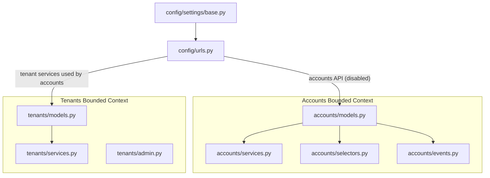
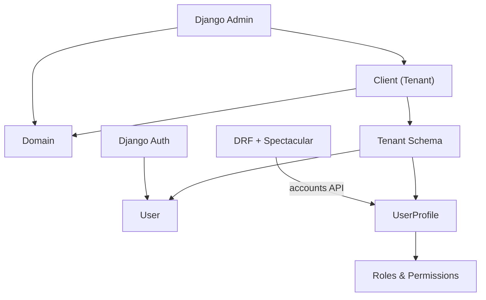
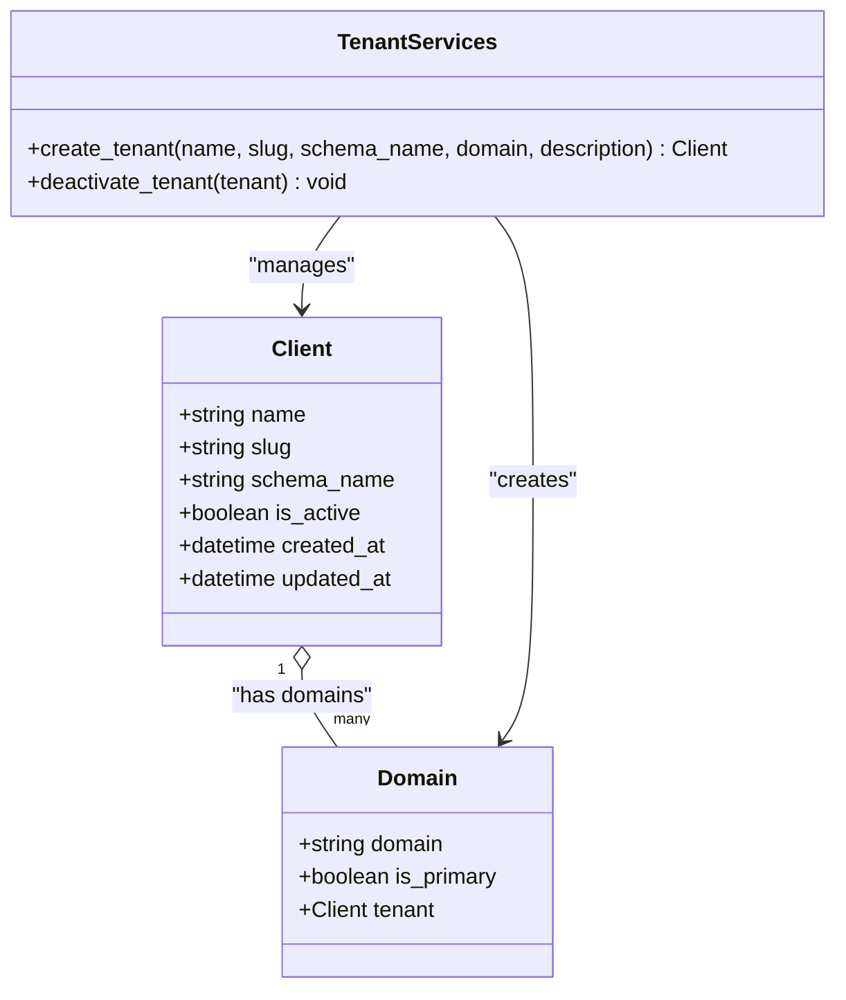
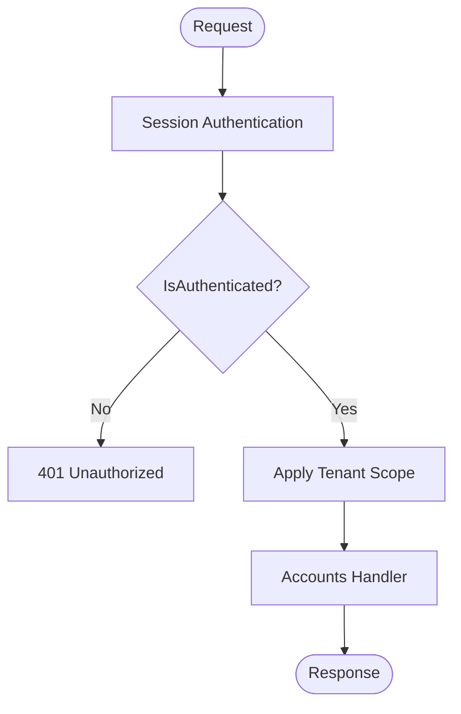
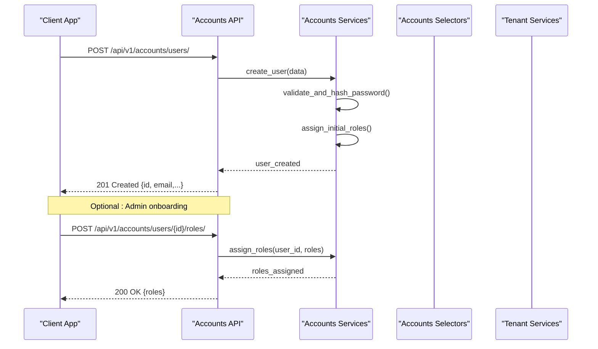
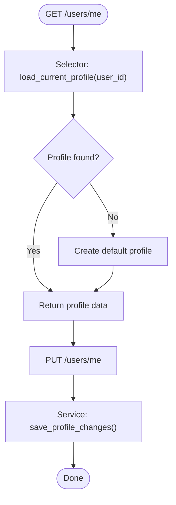
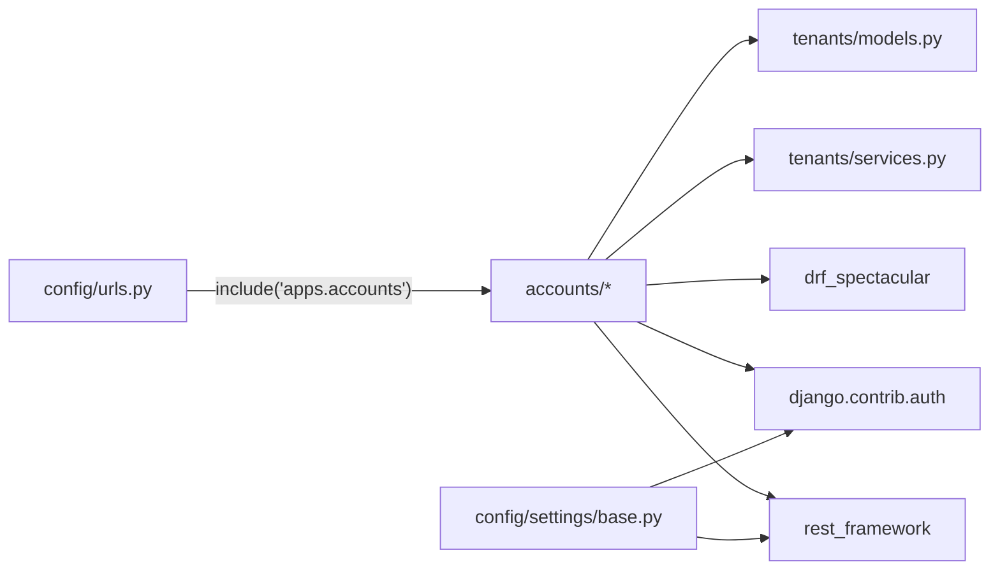

# User & Account Management API

<cite>
**Referenced Files in This Document**
- [models.py](file://backend/apps/accounts/models.py)
- [services.py](file://backend/apps/accounts/services.py)
- [selectors.py](file://backend/apps/accounts/selectors.py)
- [events.py](file://backend/apps/accounts/events.py)
- [urls.py](file://backend/config/urls.py)
- [base.py](file://backend/config/settings/base.py)
- [models.py](file://backend/apps/tenants/models.py)
- [services.py](file://backend/apps/tenants/services.py)
- [admin.py](file://backend/apps/tenants/admin.py)
</cite>

## Table of Contents
1. [Introduction](#introduction)
2. [Project Structure](#project-structure)
3. [Core Components](#core-components)
4. [Architecture Overview](#architecture-overview)
5. [Detailed Component Analysis](#detailed-component-analysis)
6. [Dependency Analysis](#dependency-analysis)
7. [Performance Considerations](#performance-considerations)
8. [Troubleshooting Guide](#troubleshooting-guide)
9. [Conclusion](#conclusion)

## Introduction
This document describes the User & Account Management API for the PlantOps platform. It focuses on user account lifecycle operations including user creation, profile management, and administrative controls. The system is built with a multi-tenant architecture using Django and django-tenants, and exposes REST endpoints via Django REST Framework with OpenAPI documentation support.

Current implementation status:
- The accounts bounded context is a skeleton with placeholder models and service/selector/event modules.
- Tenant provisioning and management is implemented and can be used to bootstrap user management per tenant.
- API URL wiring for accounts is present but disabled pending implementation of the accounts API app.

## Project Structure
The user and account management functionality spans the following areas:
- Accounts bounded context: models, services, selectors, events, and a placeholder app configuration.
- Tenant management: models, services, and admin for multi-tenant isolation.
- Global configuration: URL routing and REST framework settings.

**Diagram sources**
- [urls.py:28-37](file://backend/config/urls.py#L28-L37)
- [base.py:78-90](file://backend/config/settings/base.py#L78-L90)
- [models.py:15-30](file://backend/apps/accounts/models.py#L15-L30)
- [services.py:1-7](file://backend/apps/accounts/services.py#L1-L7)
- [selectors.py:1-7](file://backend/apps/accounts/selectors.py#L1-L7)
- [events.py:1-7](file://backend/apps/accounts/events.py#L1-L7)
- [models.py:6-53](file://backend/apps/tenants/models.py#L6-L53)
- [services.py:11-42](file://backend/apps/tenants/services.py#L11-L42)
- [admin.py:7-25](file://backend/apps/tenants/admin.py#L7-L25)

**Section sources**
- [urls.py:28-37](file://backend/config/urls.py#L28-L37)
- [base.py:78-90](file://backend/config/settings/base.py#L78-L90)

## Core Components
- Accounts models: Placeholder for user profile data and future role/permission fields.
- Accounts services: Centralized write operations for user/profile data.
- Accounts selectors: Centralized read/query operations for user/profile data.
- Accounts events: Domain event placeholders for user/account-related activities.
- Tenant models/services: Multi-tenant isolation and provisioning helpers.
- Global settings: REST framework defaults, authentication, and OpenAPI schema configuration.

Key capabilities to implement:
- User registration and onboarding workflows.
- Profile updates and preferences management.
- Role assignment and permission checks.
- Account status management (activate/deactivate).
- Administrative user management and bulk operations.
- Password management and authentication flows.
- Data export and account deletion procedures.

**Section sources**
- [models.py:15-30](file://backend/apps/accounts/models.py#L15-L30)
- [services.py:1-7](file://backend/apps/accounts/services.py#L1-L7)
- [selectors.py:1-7](file://backend/apps/accounts/selectors.py#L1-L7)
- [events.py:1-7](file://backend/apps/accounts/events.py#L1-L7)
- [models.py:6-53](file://backend/apps/tenants/models.py#L6-L53)
- [services.py:11-42](file://backend/apps/tenants/services.py#L11-L42)
- [base.py:234-262](file://backend/config/settings/base.py#L234-L262)

## Architecture Overview
The system follows a bounded context architecture with multi-tenancy:
- Each tenant has its own PostgreSQL schema for data isolation.
- Accounts bounded context manages users, roles, permissions, and authentication within a tenant.
- Tenant services handle provisioning and deactivation of tenants.
- REST endpoints are configured via Django URLs and documented via drf-spectacular.

**Diagram sources**
- [models.py:6-53](file://backend/apps/tenants/models.py#L6-L53)
- [models.py:15-30](file://backend/apps/accounts/models.py#L15-L30)
- [base.py:234-262](file://backend/config/settings/base.py#L234-L262)
- [urls.py:28-37](file://backend/config/urls.py#L28-L37)

## Detailed Component Analysis

### Accounts Models
- UserProfile is a placeholder intended to hold:
  - Role(s) (e.g., gardener, expert, admin)
  - Contact details (phone number)
  - Preferences (language, notifications)
  - Tenant-scoped attributes
- The model is not abstract yet and can be extended as the user model evolves.

Recommended schema evolution:
- Add UUID primary key and tenant foreign key for multi-tenancy.
- Add role enumeration and permission fields.
- Add timestamps and soft-delete capability.

**Section sources**
- [models.py:15-30](file://backend/apps/accounts/models.py#L15-L30)

### Accounts Services
- Purpose: Centralized mutation layer for user and profile data.
- Constraints:
  - All writes must go through services.
  - Direct model writes are prohibited.
- Implementation guidance:
  - Encapsulate user creation, profile updates, role assignment, and status changes.
  - Enforce tenant scoping and validation.
  - Emit domain events for auditable actions.

**Section sources**
- [services.py:1-7](file://backend/apps/accounts/services.py#L1-L7)

### Accounts Selectors
- Purpose: Centralized read/query layer for user and profile data.
- Benefits:
  - Keeps read logic testable and reusable.
  - Enables consistent filtering and pagination.
- Implementation guidance:
  - Provide tenant-aware queries.
  - Support search, filtering, and sorting.
  - Integrate with pagination settings.

**Section sources**
- [selectors.py:1-7](file://backend/apps/accounts/selectors.py#L1-L7)

### Accounts Events
- Purpose: Lightweight domain events representing significant user/account actions.
- Guidance:
  - Define event dataclasses for user creation, profile update, role change, and status change.
  - Keep events decoupled from Django signals.
  - Use events to trigger cross-context actions (e.g., notifications).

**Section sources**
- [events.py:1-7](file://backend/apps/accounts/events.py#L1-L7)

### Tenant Models and Services
- Client model:
  - Represents a tenant organization with schema isolation.
  - Includes activation flag and metadata.
- Domain model:
  - Maps hostnames to tenants and marks primary domains.
- Services:
  - create_tenant: Provisions a tenant with schema and primary domain.
  - deactivate_tenant: Soft-deactivates a tenant.

**Diagram sources**
- [models.py:6-53](file://backend/apps/tenants/models.py#L6-L53)
- [services.py:11-42](file://backend/apps/tenants/services.py#L11-L42)

**Section sources**
- [models.py:6-53](file://backend/apps/tenants/models.py#L6-L53)
- [services.py:11-42](file://backend/apps/tenants/services.py#L11-L42)
- [admin.py:7-25](file://backend/apps/tenants/admin.py#L7-L25)

### Authentication and Authorization
- Authentication:
  - Session-based authentication is enabled by default.
  - IsAuthenticated is the default permission class.
- Password validation:
  - Built-in validators are configured for strong passwords.
- Multi-tenancy:
  - Tenant middleware ensures requests route to the correct schema.
  - User operations must be scoped to the current tenant.

**Diagram sources**
- [base.py:234-262](file://backend/config/settings/base.py#L234-L262)
- [base.py:107-119](file://backend/config/settings/base.py#L107-L119)

**Section sources**
- [base.py:234-262](file://backend/config/settings/base.py#L234-L262)
- [base.py:107-119](file://backend/config/settings/base.py#L107-L119)

### API Endpoints and Workflows
Note: The accounts API app is not wired in URLs yet. The following endpoints are conceptual and must be implemented. When implemented, they will appear under the accounts namespace.

- POST /api/v1/accounts/users/
  - Purpose: Register a new user within the current tenant.
  - Request: { email, first_name, last_name, password, profile_fields... }
  - Response: { id, email, profile, roles, created_at }
  - Permissions: IsAuthenticated or public registration policy (to be defined)
  - Notes: Emit user_created event; set initial roles/permissions

- GET /api/v1/accounts/users/me/
  - Purpose: Retrieve current user’s profile.
  - Response: { id, email, profile, roles, permissions }
  - Permissions: IsAuthenticated

- PUT /api/v1/accounts/users/me/
  - Purpose: Update current user’s profile.
  - Request: { first_name, last_name, phone, language, notification_preferences }
  - Response: { id, email, profile, updated_at }
  - Permissions: IsAuthenticated

- GET /api/v1/accounts/users/{id}/
  - Purpose: Retrieve another user’s profile (admin).
  - Response: { id, email, profile, roles }
  - Permissions: IsAuthenticated + admin rights

- PATCH /api/v1/accounts/users/{id}/status/
  - Purpose: Activate or deactivate a user (admin).
  - Request: { is_active }
  - Response: { id, is_active }
  - Permissions: IsAuthenticated + admin rights

- POST /api/v1/accounts/users/{id}/roles/
  - Purpose: Assign roles to a user (admin).
  - Request: { roles: [string] }
  - Response: { id, roles }
  - Permissions: IsAuthenticated + admin rights

- DELETE /api/v1/accounts/users/{id}/
  - Purpose: Deactivate and delete user data (admin or self-service per policy).
  - Response: { message }
  - Permissions: IsAuthenticated + rights

- POST /api/v1/accounts/users/export/
  - Purpose: Export user data (admin).
  - Response: { download_url }
  - Permissions: IsAuthenticated + admin rights

- POST /api/v1/accounts/password/change/
  - Purpose: Change current user’s password.
  - Request: { old_password, new_password }
  - Response: { message }
  - Permissions: IsAuthenticated

- POST /api/v1/accounts/password/reset-request/
  - Purpose: Initiate password reset.
  - Request: { email }
  - Response: { message }

- POST /api/v1/accounts/password/reset-confirm/
  - Purpose: Confirm password reset.
  - Request: { token, new_password }
  - Response: { message }

Notes:
- All endpoints must enforce tenant scoping.
- Use selectors for reads and services for writes.
- Emit domain events for auditable actions.

[No sources needed since this section defines conceptual endpoints and flows]

### User Onboarding Workflow

[No sources needed since this diagram shows conceptual workflow, not actual code structure]

### Profile Management Flow

[No sources needed since this diagram shows conceptual workflow, not actual code structure]

## Dependency Analysis
- Accounts depends on:
  - Tenant models/services for multi-tenancy.
  - Django auth for session management.
  - DRF for API and schema generation.
- URL routing currently disables accounts API; it must be enabled to expose endpoints.
- Settings define default authentication and permission classes.

**Diagram sources**
- [urls.py:28-37](file://backend/config/urls.py#L28-L37)
- [base.py:234-262](file://backend/config/settings/base.py#L234-L262)
- [services.py:11-42](file://backend/apps/tenants/services.py#L11-L42)
- [models.py:6-53](file://backend/apps/tenants/models.py#L6-L53)

**Section sources**
- [urls.py:28-37](file://backend/config/urls.py#L28-L37)
- [base.py:234-262](file://backend/config/settings/base.py#L234-L262)

## Performance Considerations
- Use selectors to centralize queries and enable caching strategies.
- Apply pagination for listing endpoints.
- Minimize N+1 queries in profile retrieval.
- Leverage tenant middleware efficiently; avoid unnecessary cross-schema joins.
- Use bulk operations for administrative mass updates.

[No sources needed since this section provides general guidance]

## Troubleshooting Guide
Common issues and resolutions:
- 401 Unauthorized:
  - Ensure session authentication is active and user is logged in.
  - Verify IsAuthenticated permission class.
- 403 Forbidden:
  - Admin-only endpoints require elevated privileges.
  - Check role assignment and permission checks.
- Multi-tenancy errors:
  - Confirm tenant middleware is active.
  - Ensure requests target the correct tenant domain/schema.
- Schema migration failures:
  - Run migrations for shared and tenant apps after enabling accounts API.

**Section sources**
- [base.py:234-262](file://backend/config/settings/base.py#L234-L262)
- [base.py:107-119](file://backend/config/settings/base.py#L107-L119)

## Conclusion
The User & Account Management API is currently in skeleton form within the accounts bounded context. The tenant management layer is production-ready and can be leveraged for multi-tenant user isolation. To deliver a complete solution:
- Implement the accounts API app and wire it into URLs.
- Build models, serializers, views, services, selectors, and events.
- Define clear role/permission schemas and integrate with Django auth.
- Enable and secure endpoints for registration, profile management, and administration.
- Document endpoints using the existing OpenAPI configuration.

[No sources needed since this section summarizes without analyzing specific files]