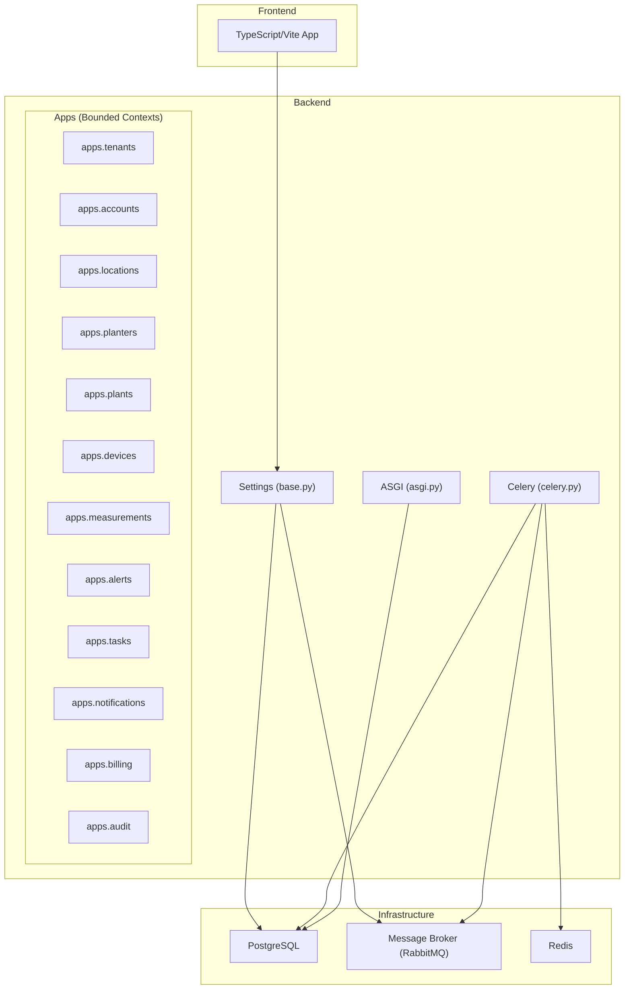
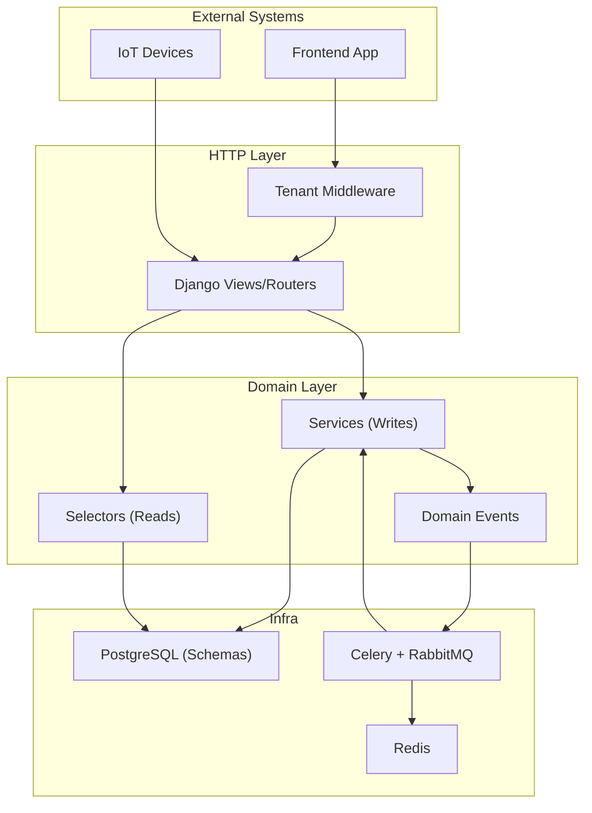
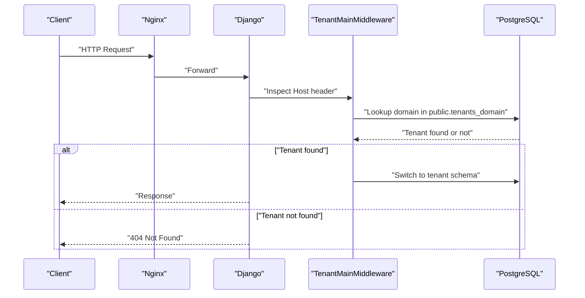
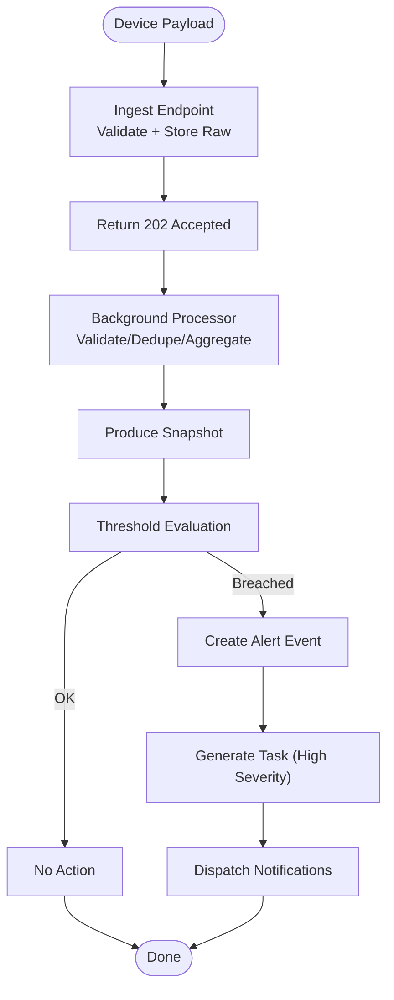
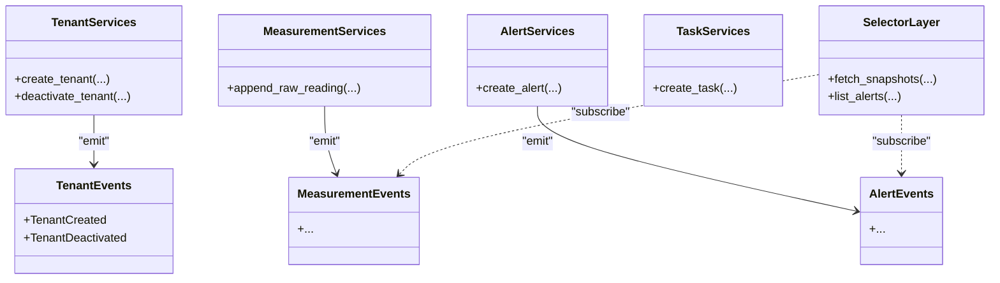
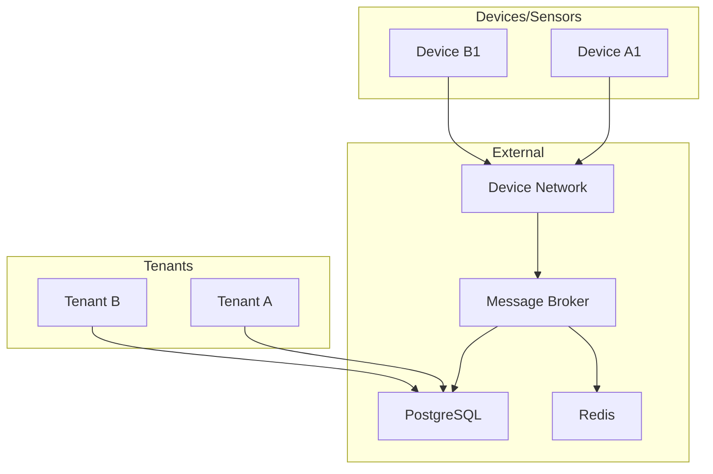
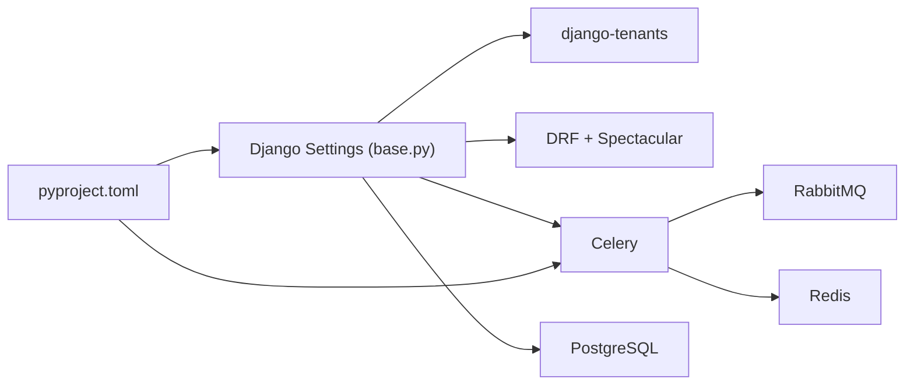
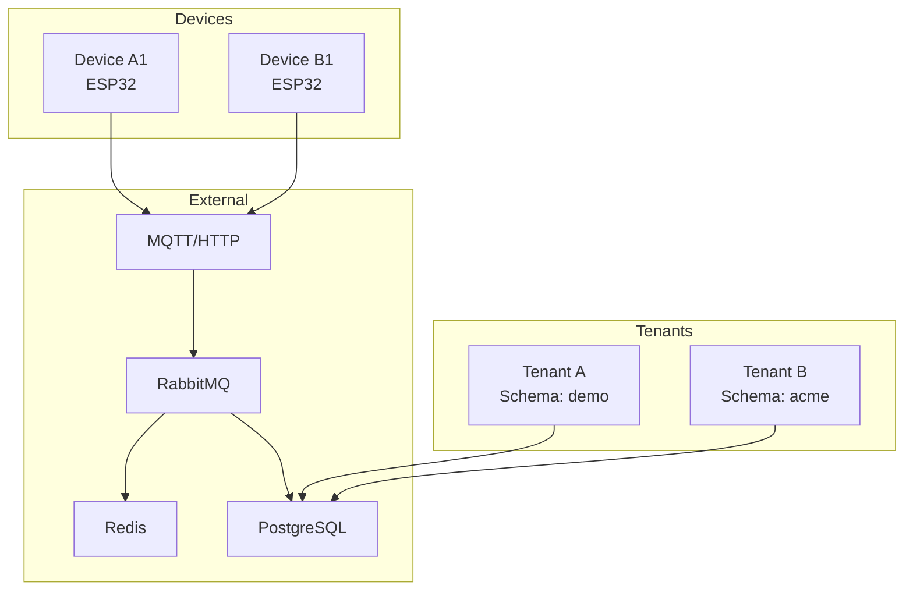

# Architecture & Design

<cite>
**Referenced Files in This Document**
- [DDD_OVERVIEW.md](file://backend/docs/architecture/DDD_OVERVIEW.md)
- [MULTI_TENANCY.md](file://backend/docs/architecture/MULTI_TENANCY.md)
- [IOT_INGEST.md](file://backend/docs/architecture/IOT_INGEST.md)
- [base.py](file://backend/config/settings/base.py)
- [celery.py](file://backend/config/celery.py)
- [asgi.py](file://backend/config/asgi.py)
- [pyproject.toml](file://backend/pyproject.toml)
- [models.py](file://backend/apps/tenants/models.py)
- [services.py](file://backend/apps/tenants/services.py)
- [events.py](file://backend/apps/tenants/events.py)
- [services.py](file://backend/apps/devices/services.py)
- [services.py](file://backend/apps/measurements/services.py)
- [services.py](file://backend/apps/alerts/services.py)
- [services.py](file://backend/apps/tasks/services.py)
- [events.py](file://backend/apps/measurements/events.py)
- [events.py](file://backend/apps/alerts/events.py)
- [selectors.py](file://backend/apps/measurements/selectors.py)
- [selectors.py](file://backend/apps/alerts/selectors.py)
</cite>

## Table of Contents
1. [Introduction](#introduction)
2. [Project Structure](#project-structure)
3. [Core Components](#core-components)
4. [Architecture Overview](#architecture-overview)
5. [Detailed Component Analysis](#detailed-component-analysis)
6. [Dependency Analysis](#dependency-analysis)
7. [Performance Considerations](#performance-considerations)
8. [Troubleshooting Guide](#troubleshooting-guide)
9. [Conclusion](#conclusion)
10. [Appendices](#appendices)

## Introduction
This document presents the architecture and design of the PlantOps platform, a multi-tenant SaaS solution for IoT plant and planter management. The system follows Domain-Driven Design (DDD) with 12 bounded contexts, a hexagonal architecture approach (services and selectors), event-driven design with domain events and CQRS separation of writes and reads, and a robust multi-tenant model using PostgreSQL schemas and django-tenants. It also documents the IoT ingestion pipeline from device registration to real-time monitoring, along with cross-cutting concerns such as security, monitoring, and data consistency.

## Project Structure
The backend is organized around Django apps, each representing a bounded context. The configuration defines shared and tenant apps, middleware for tenant routing, and infrastructure integrations for messaging and storage. The frontend is a separate TypeScript/Vite application.

**Diagram sources**
- [base.py:44-94](file://backend/config/settings/base.py#L44-L94)
- [base.py:107-119](file://backend/config/settings/base.py#L107-L119)
- [base.py:155-164](file://backend/config/settings/base.py#L155-L164)
- [celery.py:14-21](file://backend/config/celery.py#L14-L21)
- [asgi.py:9-13](file://backend/config/asgi.py#L9-L13)

**Section sources**
- [base.py:44-94](file://backend/config/settings/base.py#L44-L94)
- [base.py:107-119](file://backend/config/settings/base.py#L107-L119)
- [base.py:155-164](file://backend/config/settings/base.py#L155-L164)
- [pyproject.toml:18-67](file://backend/pyproject.toml#L18-L67)

## Core Components
- Bounded contexts: Tenants, Accounts, Locations, Planters, Plants, Devices, Measurements, Alerts, Tasks, Notifications, Billing, Audit. Each owns its data and rules, communicates via domain events or explicit service calls.
- Services layer: Write operations only, enforcing immutability and append-only semantics for raw data and events.
- Selectors layer: Read/query operations only, centralizing query logic for testability and performance.
- Domain events: Lightweight dataclasses representing domain facts, enabling eventual consistency and decoupled cross-context coordination.
- Multi-tenancy: django-tenants with PostgreSQL schemas; shared apps in public, tenant apps replicated per schema.
- Messaging: Celery with RabbitMQ broker and Redis result backend; scheduled tasks via django-celery-beat.
- API framework: Django REST Framework with OpenAPI schema generation.

**Section sources**
- [DDD_OVERVIEW.md:5-85](file://backend/docs/architecture/DDD_OVERVIEW.md#L5-L85)
- [base.py:44-94](file://backend/config/settings/base.py#L44-L94)
- [base.py:273-279](file://backend/config/settings/base.py#L273-L279)
- [pyproject.toml:37-40](file://backend/pyproject.toml#L37-L40)

## Architecture Overview
PlantOps employs a layered, hexagonal architecture:
- External clients (frontend, devices) interact with the system via HTTP APIs and IoT ingestion.
- The tenant router resolves requests to the appropriate tenant schema.
- Services encapsulate write-side operations; selectors encapsulate read-side queries.
- Domain events drive cross-context coordination and eventual consistency.
- Background processing handles asynchronous tasks, validations, and notifications.

**Diagram sources**
- [base.py:107-119](file://backend/config/settings/base.py#L107-L119)
- [base.py:273-279](file://backend/config/settings/base.py#L273-L279)
- [celery.py:14-21](file://backend/config/celery.py#L14-L21)
- [base.py:155-164](file://backend/config/settings/base.py#L155-L164)

## Detailed Component Analysis

### Multi-Tenancy Architecture
- Schema layout: public for shared tables (tenants), tenant schemas for isolated data.
- Tenant routing: Nginx → Django → TenantMainMiddleware → resolve domain → switch schema.
- Fail-closed isolation: default rejection if tenant cannot be resolved; strict separation enforced.
- SHARED_APPS vs TENANT_APPS: shared in public; tenant apps replicated per schema.
- Tenant provisioning: dedicated service ensures controlled creation and domain assignment.
- Migrations: run shared and tenant migrations separately.
- Background jobs: explicit tenant context required for cross-schema operations.

**Diagram sources**
- [MULTI_TENANCY.md:12-27](file://backend/docs/architecture/MULTI_TENANCY.md#L12-L27)
- [models.py:56-77](file://backend/apps/tenants/models.py#L56-L77)

**Section sources**
- [MULTI_TENANCY.md:1-76](file://backend/docs/architecture/MULTI_TENANCY.md#L1-L76)
- [models.py:6-53](file://backend/apps/tenants/models.py#L6-L53)
- [services.py:11-42](file://backend/apps/tenants/services.py#L11-L42)

### IoT Data Ingestion Pipeline
- Devices send sensor payloads via MQTT or HTTP POST.
- Ingest endpoint validates credentials and persists raw readings immediately.
- Append-only raw readings are processed asynchronously to produce snapshots.
- Threshold evaluation triggers alerts; high-severity alerts spawn tasks.
- Notifications dispatch across channels (email, SMS, push, in-app).
- Idempotency and fail-closed principles protect data integrity.

**Diagram sources**
- [IOT_INGEST.md:5-88](file://backend/docs/architecture/IOT_INGEST.md#L5-L88)

**Section sources**
- [IOT_INGEST.md:1-88](file://backend/docs/architecture/IOT_INGEST.md#L1-L88)
- [services.py:1-7](file://backend/apps/devices/services.py#L1-L7)
- [services.py:1-9](file://backend/apps/measurements/services.py#L1-L9)
- [events.py:1-7](file://backend/apps/measurements/events.py#L1-L7)
- [events.py:1-7](file://backend/apps/alerts/events.py#L1-L7)

### Domain-Driven Design and Hexagonal Architecture
- Bounded contexts: 12 Django apps, each with models, services, selectors, events, admin, apps, tests.
- Rules:
  - No direct writes outside services.
  - No direct reads outside selectors.
  - No cross-context foreign keys; use IDs and events.
  - Models are placeholders pending domain confirmation.
- CQRS separation:
  - Writes: services.py per context.
  - Reads: selectors.py per context.
- Domain events:
  - Lightweight dataclasses (not Django signals).
  - Intended for outbox pattern or event bus integration.

**Diagram sources**
- [DDD_OVERVIEW.md:67-85](file://backend/docs/architecture/DDD_OVERVIEW.md#L67-L85)
- [services.py:11-42](file://backend/apps/tenants/services.py#L11-L42)
- [events.py:19-36](file://backend/apps/tenants/events.py#L19-L36)
- [services.py:1-9](file://backend/apps/measurements/services.py#L1-L9)
- [events.py:1-7](file://backend/apps/measurements/events.py#L1-L7)
- [services.py:1-9](file://backend/apps/alerts/services.py#L1-L9)
- [events.py:1-7](file://backend/apps/alerts/events.py#L1-L7)
- [services.py:1-7](file://backend/apps/tasks/services.py#L1-L7)
- [selectors.py:1-7](file://backend/apps/measurements/selectors.py#L1-L7)
- [selectors.py:1-7](file://backend/apps/alerts/selectors.py#L1-L7)

**Section sources**
- [DDD_OVERVIEW.md:1-85](file://backend/docs/architecture/DDD_OVERVIEW.md#L1-L85)
- [services.py:11-42](file://backend/apps/tenants/services.py#L11-L42)
- [events.py:1-36](file://backend/apps/tenants/events.py#L1-L36)
- [services.py:1-9](file://backend/apps/measurements/services.py#L1-L9)
- [events.py:1-7](file://backend/apps/measurements/events.py#L1-L7)
- [services.py:1-9](file://backend/apps/alerts/services.py#L1-L9)
- [events.py:1-7](file://backend/apps/alerts/events.py#L1-L7)
- [services.py:1-7](file://backend/apps/tasks/services.py#L1-L7)
- [selectors.py:1-7](file://backend/apps/measurements/selectors.py#L1-L7)
- [selectors.py:1-7](file://backend/apps/alerts/selectors.py#L1-L7)

### System Context and Boundaries
- Tenants: organizations with isolated schemas.
- Devices: IoT sensors sending raw telemetry.
- Sensors: temperature, moisture, light, battery.
- External systems: device networks (MQTT/HTTP), message broker, Redis, PostgreSQL.

[No sources needed since this diagram shows conceptual workflow, not actual code structure]

## Dependency Analysis
- Django settings define SHARED_APPS/TENANT_APPS, middleware stack, database backend, and REST framework defaults.
- Celery configuration loads settings and autodiscovers tasks.
- pyproject.toml lists core dependencies: Django, django-tenants, DRF, Celery, Redis, PostgreSQL driver, and others.

**Diagram sources**
- [base.py:44-94](file://backend/config/settings/base.py#L44-L94)
- [base.py:273-279](file://backend/config/settings/base.py#L273-L279)
- [pyproject.toml:18-67](file://backend/pyproject.toml#L18-L67)

**Section sources**
- [base.py:44-94](file://backend/config/settings/base.py#L44-L94)
- [base.py:273-279](file://backend/config/settings/base.py#L273-L279)
- [pyproject.toml:18-67](file://backend/pyproject.toml#L18-L67)

## Performance Considerations
- Append-only design for raw telemetry and alerts reduces write contention and simplifies auditing.
- CQRS enables optimized read models and caching strategies via selectors.
- Asynchronous processing with Celery offloads heavy computations and I/O.
- Multi-tenant schema isolation prevents cross-tenant hot-path interference.
- Scheduled tasks via django-celery-beat support periodic maintenance and reporting.

[No sources needed since this section provides general guidance]

## Troubleshooting Guide
- Tenant resolution failures: verify domain-to-tenant mapping and middleware order.
- Migration issues: ensure shared and tenant migrations are applied in the correct order.
- Background job errors: confirm broker and result backend connectivity; check tenant context usage in cross-schema tasks.
- Read/write confusion: enforce services/selector boundaries; avoid direct model writes/queries outside designated layers.

**Section sources**
- [MULTI_TENANCY.md:54-61](file://backend/docs/architecture/MULTI_TENANCY.md#L54-L61)
- [base.py:107-119](file://backend/config/settings/base.py#L107-L119)
- [base.py:273-279](file://backend/config/settings/base.py#L273-L279)

## Conclusion
PlantOps applies DDD with 12 bounded contexts, hexagonal architecture with services/selectors, and event-driven design to achieve clean separation of concerns and scalability. Multi-tenancy via django-tenants and PostgreSQL schemas ensures strong isolation. The IoT ingestion pipeline emphasizes reliability with append-only records, idempotent processing, and asynchronous orchestration. Together, these choices balance maintainability, performance, and operational safety.

[No sources needed since this section summarizes without analyzing specific files]

## Appendices

### System Context Diagram (Expanded)
- Tenants: isolated schemas per organization.
- Devices: ingest raw telemetry.
- Sensors: temperature, moisture, light, battery.
- External systems: device network, message broker, Redis, PostgreSQL.

[No sources needed since this diagram shows conceptual workflow, not actual code structure]