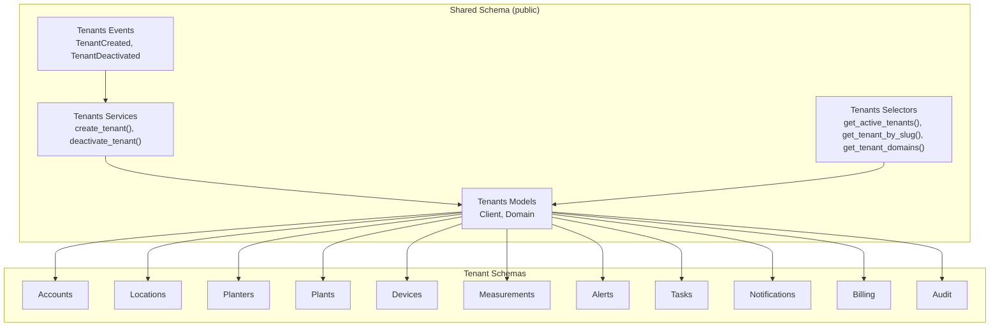
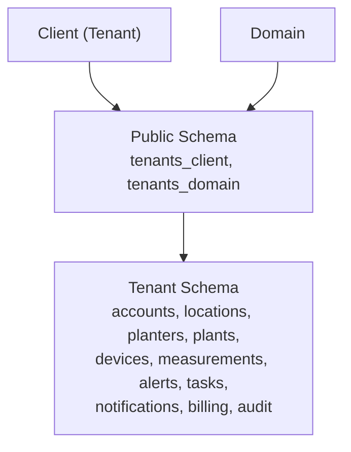
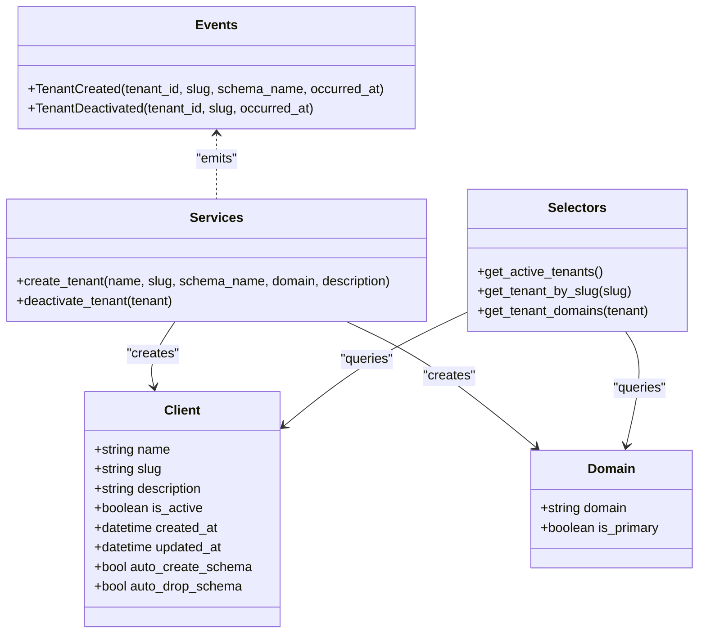
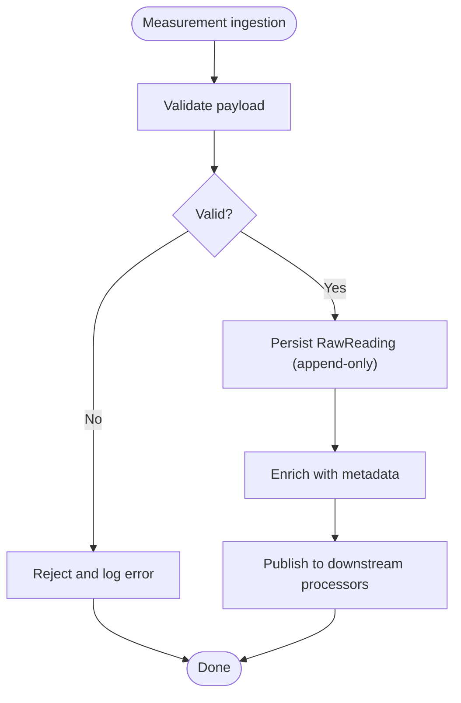
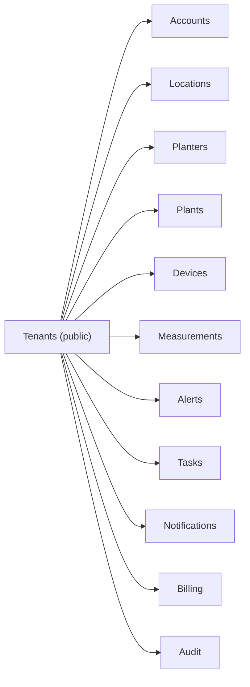

# Bounded Contexts Overview

<cite>
**Referenced Files in This Document**
- [models.py](file://backend/apps/tenants/models.py)
- [services.py](file://backend/apps/tenants/services.py)
- [selectors.py](file://backend/apps/tenants/selectors.py)
- [events.py](file://backend/apps/tenants/events.py)
- [MULTI_TENANCY.md](file://backend/docs/architecture/MULTI_TENANCY.md)
- [base.py](file://backend/config/settings/base.py)
- [models.py](file://backend/apps/accounts/models.py)
- [models.py](file://backend/apps/planters/models.py)
- [models.py](file://backend/apps/plants/models.py)
- [models.py](file://backend/apps/devices/models.py)
- [models.py](file://backend/apps/locations/models.py)
- [models.py](file://backend/apps/measurements/models.py)
- [models.py](file://backend/apps/alerts/models.py)
- [models.py](file://backend/apps/notifications/models.py)
- [models.py](file://backend/apps/tasks/models.py)
</cite>

## Table of Contents
1. [Introduction](#introduction)
2. [Project Structure](#project-structure)
3. [Core Components](#core-components)
4. [Architecture Overview](#architecture-overview)
5. [Detailed Component Analysis](#detailed-component-analysis)
6. [Dependency Analysis](#dependency-analysis)
7. [Performance Considerations](#performance-considerations)
8. [Troubleshooting Guide](#troubleshooting-guide)
9. [Conclusion](#conclusion)

## Introduction
This document explains the PlantOps bounded contexts architecture with a focus on tenant isolation, ownership boundaries, and data integrity. It enumerates the 12 bounded contexts, describes their responsibilities, and documents how the shared tenants context and tenant-specific schemas enforce isolation. It also outlines why certain responsibilities are separated into distinct contexts and how each context maintains its own data integrity without cross-context foreign keys.

## Project Structure
PlantOps organizes business capabilities into bounded contexts under backend/apps, each encapsulating models, services, selectors, and events. The tenants context is special: it resides in the shared public schema and manages tenant provisioning, routing, and isolation. All other contexts live inside tenant-specific schemas and are replicated per tenant.

**Diagram sources**
- [models.py:6-76](file://backend/apps/tenants/models.py#L6-L76)
- [services.py:11-42](file://backend/apps/tenants/services.py#L11-L42)
- [selectors.py:13-26](file://backend/apps/tenants/selectors.py#L13-L26)
- [events.py:19-36](file://backend/apps/tenants/events.py#L19-L36)

**Section sources**
- [MULTI_TENANCY.md:1-76](file://backend/docs/architecture/MULTI_TENANCY.md#L1-L76)
- [base.py:44-94](file://backend/config/settings/base.py#L44-L94)

## Core Components
This section lists the 12 bounded contexts and their responsibilities. Each context’s models are placeholders indicating future fields and relationships. The tenants context is the foundation for multi-tenancy and tenant isolation.

- Tenants (shared in public schema)
  - Responsibilities: Provision tenants, manage domains, route requests, and enforce isolation.
  - Ownership boundary: Shared across all tenants; only accessible to the tenants app and Django admin.
  - Data isolation: Tenant schemas are physically separate; cross-schema queries are prohibited except in background jobs.

- Accounts
  - Responsibilities: Users, roles, permissions, and authentication within a single tenant.
  - Ownership boundary: Tenant-scoped; no cross-tenant access.

- Locations
  - Responsibilities: Physical locations (sites, greenhouses, indoor areas) where planters and devices are installed.
  - Ownership boundary: Tenant-scoped.

- Planters
  - Responsibilities: Planter/container definitions, inventory, and status.
  - Ownership boundary: Tenant-scoped.

- Plants
  - Responsibilities: Species, varieties, care profiles, and plant instances assigned to planters.
  - Ownership boundary: Tenant-scoped.

- Devices
  - Responsibilities: IoT device definitions, firmware versions, and connectivity status.
  - Ownership boundary: Tenant-scoped.

- Measurements
  - Responsibilities: Raw sensor readings and processed snapshots.
  - Ownership boundary: Tenant-scoped; raw readings are append-only.

- Alerts
  - Responsibilities: Alert definitions, alert instances, and thresholds.
  - Ownership boundary: Tenant-scoped; alert events are append-only.

- Tasks
  - Responsibilities: System-generated or manual tasks (e.g., water plant, check device).
  - Ownership boundary: Tenant-scoped.

- Notifications
  - Responsibilities: Channels, templates, and delivery logs (email, SMS, push, in-app).
  - Ownership boundary: Tenant-scoped.

- Billing
  - Responsibilities: Tenant billing and subscription management.
  - Ownership boundary: Tenant-scoped.

- Audit
  - Responsibilities: Tenant audit trails and compliance logs.
  - Ownership boundary: Tenant-scoped.

**Section sources**
- [models.py:6-76](file://backend/apps/tenants/models.py#L6-L76)
- [models.py:1-30](file://backend/apps/accounts/models.py#L1-L30)
- [models.py:1-26](file://backend/apps/locations/models.py#L1-L26)
- [models.py:1-27](file://backend/apps/planters/models.py#L1-L27)
- [models.py:1-26](file://backend/apps/plants/models.py#L1-L26)
- [models.py:1-29](file://backend/apps/devices/models.py#L1-L29)
- [models.py:1-30](file://backend/apps/measurements/models.py#L1-L30)
- [models.py:1-29](file://backend/apps/alerts/models.py#L1-L29)
- [models.py:1-29](file://backend/apps/tasks/models.py#L1-L29)
- [models.py:1-28](file://backend/apps/notifications/models.py#L1-L28)

## Architecture Overview
PlantOps uses django-tenants with PostgreSQL schemas for physical tenant isolation. The tenants context lives in the public schema and controls routing and isolation. All other contexts are replicated in each tenant schema and remain tenant-isolated by design.

**Diagram sources**
- [models.py:6-76](file://backend/apps/tenants/models.py#L6-L76)
- [MULTI_TENANCY.md:7-11](file://backend/docs/architecture/MULTI_TENANCY.md#L7-L11)

Key architectural decisions:
- Shared tenants context: Centralized control of tenant lifecycle, routing, and isolation.
- Tenant-specific schemas: Ensures data integrity and prevents accidental cross-tenant access.
- No cross-context foreign keys: Prevents tight coupling and preserves bounded context autonomy.
- Append-only policies: Enforce immutable audit trails for measurements and alerts.

**Section sources**
- [MULTI_TENANCY.md:1-76](file://backend/docs/architecture/MULTI_TENANCY.md#L1-L76)
- [base.py:44-94](file://backend/config/settings/base.py#L44-L94)

## Detailed Component Analysis

### Tenants Context
The tenants context defines the shared schema and tenant routing. It centralizes creation, deactivation, and lookup of tenants and domains.

**Diagram sources**
- [models.py:6-76](file://backend/apps/tenants/models.py#L6-L76)
- [services.py:11-42](file://backend/apps/tenants/services.py#L11-L42)
- [selectors.py:13-26](file://backend/apps/tenants/selectors.py#L13-L26)
- [events.py:19-36](file://backend/apps/tenants/events.py#L19-L36)

Practical examples:
- Creating a tenant: Use the service method to provision a Client and its primary Domain atomically.
- Deactivating a tenant: Soft-disable a tenant to exclude it from routing and background jobs.
- Querying tenants: Use selectors to fetch active tenants or resolve a tenant by slug.

Why separation matters:
- Single source of truth for tenant identity and routing.
- Enforces fail-closed isolation by preventing cross-tenant access in views.

**Section sources**
- [services.py:11-42](file://backend/apps/tenants/services.py#L11-L42)
- [selectors.py:13-26](file://backend/apps/tenants/selectors.py#L13-L26)
- [events.py:19-36](file://backend/apps/tenants/events.py#L19-L36)
- [models.py:6-76](file://backend/apps/tenants/models.py#L6-L76)

### Accounts Context
Responsibilities: Users, roles, permissions, and authentication within a single tenant.

Ownership boundary: Tenant-scoped; no cross-tenant access.

Data isolation strategy: Stored in tenant-specific schema; no foreign keys to shared tables.

**Section sources**
- [models.py:1-30](file://backend/apps/accounts/models.py#L1-L30)

### Locations Context
Responsibilities: Physical locations (sites, greenhouses, indoor areas) where planters and devices are installed.

Ownership boundary: Tenant-scoped.

Data isolation strategy: Tenant-specific schema; append-only operational logs if applicable.

**Section sources**
- [models.py:1-26](file://backend/apps/locations/models.py#L1-L26)

### Planters Context
Responsibilities: Planter/container definitions, inventory, and status.

Ownership boundary: Tenant-scoped.

Data isolation strategy: Tenant-specific schema; future FKs to locations and devices remain within tenant.

**Section sources**
- [models.py:1-27](file://backend/apps/planters/models.py#L1-L27)

### Plants Context
Responsibilities: Species, varieties, care profiles, and plant instances assigned to planters.

Ownership boundary: Tenant-scoped.

Data isolation strategy: Tenant-specific schema; translations handled via modeltranslation.

**Section sources**
- [models.py:1-26](file://backend/apps/plants/models.py#L1-L26)

### Devices Context
Responsibilities: IoT device definitions, firmware versions, and connectivity status.

Ownership boundary: Tenant-scoped.

Data isolation strategy: Tenant-specific schema; future FK to planters remains within tenant.

**Section sources**
- [models.py:1-29](file://backend/apps/devices/models.py#L1-L29)

### Measurements Context
Responsibilities: Raw sensor readings and processed snapshots.

Ownership boundary: Tenant-scoped.

Data isolation strategy: Tenant-specific schema; append-only policy ensures immutable audit trail.

**Diagram sources**
- [models.py:6-8](file://backend/apps/measurements/models.py#L6-L8)

**Section sources**
- [models.py:1-30](file://backend/apps/measurements/models.py#L1-L30)

### Alerts Context
Responsibilities: Alert definitions, alert instances, and thresholds.

Ownership boundary: Tenant-scoped.

Data isolation strategy: Tenant-specific schema; append-only policy for alert events.

**Section sources**
- [models.py:1-29](file://backend/apps/alerts/models.py#L1-L29)

### Tasks Context
Responsibilities: System-generated or manual tasks (e.g., water plant, check device).

Ownership boundary: Tenant-scoped.

Data isolation strategy: Tenant-specific schema; FKs to users, planters, devices, plants, locations remain within tenant.

**Section sources**
- [models.py:1-29](file://backend/apps/tasks/models.py#L1-L29)

### Notifications Context
Responsibilities: Channels, templates, and delivery logs (email, SMS, push, in-app).

Ownership boundary: Tenant-scoped.

Data isolation strategy: Tenant-specific schema; FK to users remains within tenant.

**Section sources**
- [models.py:1-28](file://backend/apps/notifications/models.py#L1-L28)

### Billing Context
Responsibilities: Tenant billing and subscription management.

Ownership boundary: Tenant-scoped.

Data isolation strategy: Tenant-specific schema; no cross-tenant billing data.

**Section sources**
- [models.py:1-200](file://backend/apps/billing/models.py#L1-L200)  % Placeholder; actual implementation may vary

### Audit Context
Responsibilities: Tenant audit trails and compliance logs.

Ownership boundary: Tenant-scoped.

Data isolation strategy: Tenant-specific schema; immutable records.

**Section sources**
- [models.py:1-200](file://backend/apps/audit/models.py#L1-L200)  % Placeholder; actual implementation may vary

## Dependency Analysis
The tenants context depends on its own models and exposes services/selectors/events for other contexts. Other contexts depend on the tenants context only for routing and tenant resolution, not for data access. There are no cross-context foreign keys; each context maintains its own referential integrity.

**Diagram sources**
- [base.py:78-90](file://backend/config/settings/base.py#L78-L90)
- [MULTI_TENANCY.md:37-40](file://backend/docs/architecture/MULTI_TENANCY.md#L37-L40)

**Section sources**
- [base.py:44-94](file://backend/config/settings/base.py#L44-L94)
- [MULTI_TENANCY.md:28-40](file://backend/docs/architecture/MULTI_TENANCY.md#L28-L40)

## Performance Considerations
- Schema-per-tenant reduces contention and simplifies backup/restore per tenant.
- Keep tenant-specific contexts lean; avoid cross-context joins in hot paths.
- Use selectors/services to centralize reads/writes and enable caching per tenant.
- Append-only designs (measurements, alerts) improve write throughput and simplify concurrency.

## Troubleshooting Guide
Common issues and remedies:
- Cross-tenant access attempts: Enforce tenant isolation at middleware and reject unresolved tenants.
- Incorrect schema routing: Verify domain-to-tenant mapping and middleware order.
- Migration errors: Run shared and tenant migrations separately as documented.
- Background job tenant access: Enter tenant context explicitly using tenant_context.

**Section sources**
- [MULTI_TENANCY.md:12-27](file://backend/docs/architecture/MULTI_TENANCY.md#L12-L27)
- [MULTI_TENANCY.md:54-75](file://backend/docs/architecture/MULTI_TENANCY.md#L54-L75)

## Conclusion
PlantOps applies DDD-aligned bounded contexts with strict tenant isolation via django-tenants and PostgreSQL schemas. The tenants context governs provisioning, routing, and isolation, while all other contexts operate autonomously within tenant schemas. This design enforces ownership boundaries, prevents cross-context coupling, and supports scalable, maintainable growth across tenants.