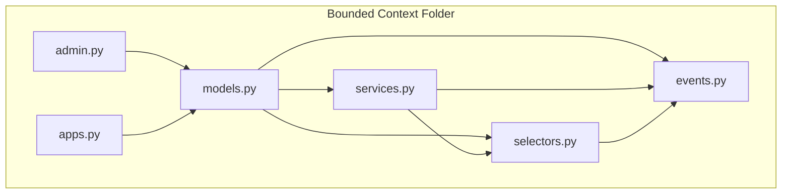
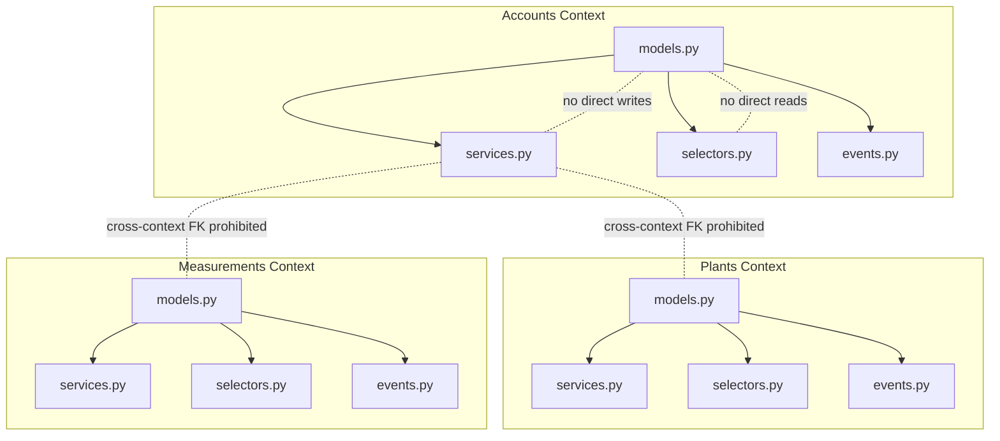
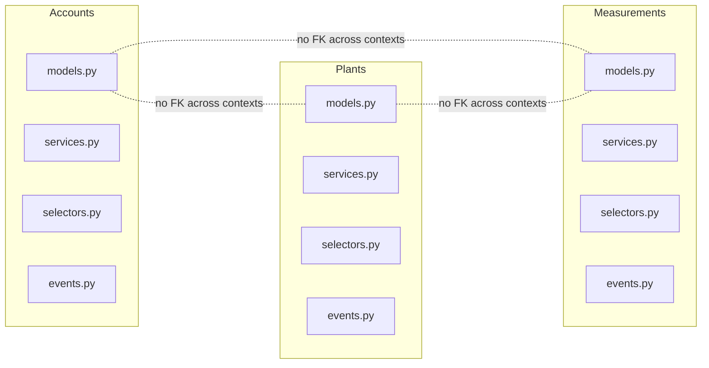

# DDD File Structure & Conventions

<cite>
**Referenced Files in This Document**
- [models.py](file://backend/apps/accounts/models.py)
- [services.py](file://backend/apps/accounts/services.py)
- [selectors.py](file://backend/apps/accounts/selectors.py)
- [events.py](file://backend/apps/accounts/events.py)
- [admin.py](file://backend/apps/accounts/admin.py)
- [apps.py](file://backend/apps/accounts/apps.py)
- [models.py](file://backend/apps/plants/models.py)
- [services.py](file://backend/apps/plants/services.py)
- [selectors.py](file://backend/apps/plants/selectors.py)
- [events.py](file://backend/apps/plants/events.py)
- [translation.py](file://backend/apps/plants/translation.py)
- [models.py](file://backend/apps/measurements/models.py)
- [services.py](file://backend/apps/measurements/services.py)
- [selectors.py](file://backend/apps/measurements/selectors.py)
- [events.py](file://backend/apps/measurements/events.py)
- [models.py](file://backend/apps/alerts/models.py)
- [services.py](file://backend/apps/alerts/services.py)
- [selectors.py](file://backend/apps/alerts/selectors.py)
- [events.py](file://backend/apps/alerts/events.py)
- [models.py](file://backend/apps/devices/models.py)
- [services.py](file://backend/apps/devices/services.py)
- [selectors.py](file://backend/apps/devices/selectors.py)
- [events.py](file://backend/apps/devices/events.py)
- [models.py](file://backend/apps/locations/models.py)
- [services.py](file://backend/apps/locations/services.py)
- [selectors.py](file://backend/apps/locations/selectors.py)
- [events.py](file://backend/apps/locations/events.py)
- [models.py](file://backend/apps/notifications/models.py)
- [services.py](file://backend/apps/notifications/services.py)
- [selectors.py](file://backend/apps/notifications/selectors.py)
- [events.py](file://backend/apps/notifications/events.py)
- [models.py](file://backend/apps/planters/models.py)
- [services.py](file://backend/apps/planters/services.py)
- [selectors.py](file://backend/apps/planters/selectors.py)
- [events.py](file://backend/apps/planters/events.py)
- [models.py](file://backend/apps/tasks/models.py)
- [services.py](file://backend/apps/tasks/services.py)
- [selectors.py](file://backend/apps/tasks/selectors.py)
- [events.py](file://backend/apps/tasks/events.py)
- [models.py](file://backend/apps/tenants/models.py)
- [services.py](file://backend/apps/tenants/services.py)
- [selectors.py](file://backend/apps/tenants/selectors.py)
- [events.py](file://backend/apps/tenants/events.py)
- [models.py](file://backend/apps/audit/models.py)
- [services.py](file://backend/apps/audit/services.py)
- [selectors.py](file://backend/apps/audit/selectors.py)
- [events.py](file://backend/apps/audit/events.py)
- [models.py](file://backend/apps/billing/models.py)
- [services.py](file://backend/apps/billing/services.py)
- [selectors.py](file://backend/apps/billing/selectors.py)
- [events.py](file://backend/apps/billing/events.py)
</cite>

## Table of Contents
1. [Introduction](#introduction)
2. [Project Structure](#project-structure)
3. [Core Components](#core-components)
4. [Architecture Overview](#architecture-overview)
5. [Detailed Component Analysis](#detailed-component-analysis)
6. [Dependency Analysis](#dependency-analysis)
7. [Performance Considerations](#performance-considerations)
8. [Troubleshooting Guide](#troubleshooting-guide)
9. [Conclusion](#conclusion)
10. [Appendices](#appendices)

## Introduction
This document defines the standardized Domain-Driven Design (DDD) file structure used across all bounded contexts in PlantOps. It explains the purpose and responsibilities of each file type, documents architectural rules, and describes how each file contributes to a clean separation of concerns. It also outlines testing strategies, naming conventions, and the placeholder model development approach with domain confirmation.

## Project Structure
Each bounded context follows a consistent folder layout under backend/apps/<context>/ with the following files:
- models.py: Domain entities and value objects
- services.py: Write operations (business mutations)
- selectors.py: Read operations (queries)
- events.py: Domain events (immutable, lightweight records of past events)
- admin.py: Django admin registration (placeholder until models are finalized)
- apps.py: Django AppConfig configuration

Across contexts, the same file names appear consistently, enabling uniform developer onboarding and predictable navigation.

**Diagram sources**
- [models.py:1-30](file://backend/apps/accounts/models.py#L1-L30)
- [services.py:1-7](file://backend/apps/accounts/services.py#L1-L7)
- [selectors.py:1-7](file://backend/apps/accounts/selectors.py#L1-L7)
- [events.py:1-7](file://backend/apps/accounts/events.py#L1-L7)
- [admin.py:1-5](file://backend/apps/accounts/admin.py#L1-L5)
- [apps.py:1-12](file://backend/apps/accounts/apps.py#L1-L12)

**Section sources**
- [models.py:1-30](file://backend/apps/accounts/models.py#L1-L30)
- [services.py:1-7](file://backend/apps/accounts/services.py#L1-L7)
- [selectors.py:1-7](file://backend/apps/accounts/selectors.py#L1-L7)
- [events.py:1-7](file://backend/apps/accounts/events.py#L1-L7)
- [admin.py:1-5](file://backend/apps/accounts/admin.py#L1-L5)
- [apps.py:1-12](file://backend/apps/accounts/apps.py#L1-L12)

## Core Components
- models.py
  - Purpose: Define domain entities and value objects for the bounded context.
  - Responsibilities:
    - Declare models with metadata and placeholders for future fields.
    - Include docstrings explaining the context scope and planned fields.
  - Example patterns:
    - Placeholders indicate future fields (e.g., roles, permissions, translations).
    - Metadata sets human-friendly names for Django admin and ORM introspection.
- services.py
  - Purpose: Enforce write operations and business mutations.
  - Responsibilities:
    - Centralize all model writes for the context.
    - Prevent direct writes outside this module.
    - Document append-only constraints where applicable.
- selectors.py
  - Purpose: Enforce read operations and queries.
  - Responsibilities:
    - Centralize all data reads for the context.
    - Keep read logic testable and reusable.
- events.py
  - Purpose: Capture immutable domain events.
  - Responsibilities:
    - Define lightweight event data structures.
    - Distinguish from Django signals; events represent “something that happened.”
- admin.py
  - Purpose: Django admin registration.
  - Responsibilities:
    - Register models after they are finalized.
    - Placeholder until models are confirmed.
- apps.py
  - Purpose: Django application configuration.
  - Responsibilities:
    - Provide AppConfig with default auto field and verbose name.
    - Ready hook for initialization.

**Section sources**
- [models.py:1-26](file://backend/apps/plants/models.py#L1-L26)
- [services.py:1-7](file://backend/apps/plants/services.py#L1-L7)
- [selectors.py:1-7](file://backend/apps/plants/selectors.py#L1-L7)
- [events.py:1-7](file://backend/apps/plants/events.py#L1-L7)
- [translation.py:1-15](file://backend/apps/plants/translation.py#L1-L15)
- [models.py:1-30](file://backend/apps/measurements/models.py#L1-L30)
- [services.py:1-9](file://backend/apps/measurements/services.py#L1-L9)
- [selectors.py:1-7](file://backend/apps/measurements/selectors.py#L1-L7)
- [events.py:1-7](file://backend/apps/measurements/events.py#L1-L7)
- [models.py:1-30](file://backend/apps/accounts/models.py#L1-L30)
- [services.py:1-7](file://backend/apps/accounts/services.py#L1-L7)
- [selectors.py:1-7](file://backend/apps/accounts/selectors.py#L1-L7)
- [events.py:1-7](file://backend/apps/accounts/events.py#L1-L7)
- [admin.py:1-5](file://backend/apps/accounts/admin.py#L1-L5)
- [apps.py:1-12](file://backend/apps/accounts/apps.py#L1-L12)

## Architecture Overview
The DDD boundaries are enforced by strict separation of concerns:
- No direct writes outside services.py
- No direct reads outside selectors.py
- Prohibition of cross-context foreign keys
- Placeholder models developed iteratively with domain confirmation

**Diagram sources**
- [models.py:1-30](file://backend/apps/accounts/models.py#L1-L30)
- [services.py:1-7](file://backend/apps/accounts/services.py#L1-L7)
- [selectors.py:1-7](file://backend/apps/accounts/selectors.py#L1-L7)
- [events.py:1-7](file://backend/apps/accounts/events.py#L1-L7)
- [models.py:1-26](file://backend/apps/plants/models.py#L1-L26)
- [services.py:1-7](file://backend/apps/plants/services.py#L1-L7)
- [selectors.py:1-7](file://backend/apps/plants/selectors.py#L1-L7)
- [events.py:1-7](file://backend/apps/plants/events.py#L1-L7)
- [models.py:1-30](file://backend/apps/measurements/models.py#L1-L30)
- [services.py:1-9](file://backend/apps/measurements/services.py#L1-L9)
- [selectors.py:1-7](file://backend/apps/measurements/selectors.py#L1-L7)
- [events.py:1-7](file://backend/apps/measurements/events.py#L1-L7)

## Detailed Component Analysis

### models.py: Entities and Value Objects
- Purpose: Define the domain’s building blocks.
- Patterns:
  - Placeholders indicate future fields and capabilities.
  - Metadata sets verbose names for admin and ORM.
  - Examples:
    - Accounts: user profile placeholder with role and preferences.
    - Plants: species placeholder with care profile and media fields.
    - Measurements: raw reading placeholder with device FK and timestamps.
- Guidance:
  - Keep models minimal initially; evolve based on domain confirmation.
  - Avoid cross-context foreign keys; use opaque identifiers or events for coordination.

**Section sources**
- [models.py:1-30](file://backend/apps/accounts/models.py#L1-L30)
- [models.py:1-26](file://backend/apps/plants/models.py#L1-L26)
- [models.py:1-30](file://backend/apps/measurements/models.py#L1-L30)

### services.py: Write Operations
- Purpose: Enforce all mutations for the bounded context.
- Architectural rule: No direct writes outside services.py.
- Patterns:
  - Centralized mutation logic.
  - Append-only constraints documented for contexts like Measurements.
- Guidance:
  - Business rules live here; orchestrate reads via selectors and emit events via events.py.

**Section sources**
- [services.py:1-7](file://backend/apps/plants/services.py#L1-L7)
- [services.py:1-9](file://backend/apps/measurements/services.py#L1-L9)
- [services.py:1-7](file://backend/apps/accounts/services.py#L1-L7)

### selectors.py: Read Operations
- Purpose: Enforce all queries for the bounded context.
- Architectural rule: No direct reads outside selectors.py.
- Patterns:
  - Centralized query logic improves testability and reuse.
- Guidance:
  - Encapsulate filtering, ordering, and joins; return DTOs or serialized data to callers.

**Section sources**
- [selectors.py:1-7](file://backend/apps/plants/selectors.py#L1-L7)
- [selectors.py:1-7](file://backend/apps/measurements/selectors.py#L1-L7)
- [selectors.py:1-7](file://backend/apps/accounts/selectors.py#L1-L7)

### events.py: Domain Events
- Purpose: Immutable records of past events in the domain.
- Patterns:
  - Lightweight data structures; not Django signals.
  - Used for cross-context decoupling and auditability.
- Guidance:
  - Emit after successful service operations; keep fields minimal and focused.

**Section sources**
- [events.py:1-7](file://backend/apps/plants/events.py#L1-L7)
- [events.py:1-7](file://backend/apps/measurements/events.py#L1-L7)
- [events.py:1-7](file://backend/apps/accounts/events.py#L1-L7)

### admin.py: Django Admin Registration
- Purpose: Register models in Django admin.
- Pattern: Placeholder until models are finalized; register when ready.
- Guidance:
  - Keep admin.py minimal; avoid embedding business logic.

**Section sources**
- [admin.py:1-3](file://backend/apps/plants/admin.py#L1-L3)
- [admin.py:1-3](file://backend/apps/measurements/admin.py#L1-L3)
- [admin.py:1-5](file://backend/apps/accounts/admin.py#L1-L5)

### apps.py: Django App Configuration
- Purpose: Configure the Django app.
- Pattern: Standard AppConfig with default auto field and verbose name.
- Guidance:
  - Use ready() for optional initialization hooks.

**Section sources**
- [apps.py:1-12](file://backend/apps/plants/apps.py#L1-L12)
- [apps.py:1-12](file://backend/apps/measurements/apps.py#L1-L12)
- [apps.py:1-12](file://backend/apps/accounts/apps.py#L1-L12)

### translation.py: Model Translations (Context-Specific)
- Purpose: Register translatable fields with django-modeltranslation.
- Pattern: Context-specific translation module.
- Guidance:
  - List user-facing text fields to enable internationalization.

**Section sources**
- [translation.py:1-15](file://backend/apps/plants/translation.py#L1-L15)

## Dependency Analysis
- Cohesion:
  - Each context maintains high internal cohesion around models, services, selectors, and events.
- Coupling:
  - Cross-context coupling is minimized; services and selectors remain within a context.
- External dependencies:
  - Django ORM and admin.
  - Optional: django-modeltranslation for translatable fields.

**Diagram sources**
- [models.py:1-30](file://backend/apps/accounts/models.py#L1-L30)
- [services.py:1-7](file://backend/apps/accounts/services.py#L1-L7)
- [selectors.py:1-7](file://backend/apps/accounts/selectors.py#L1-L7)
- [events.py:1-7](file://backend/apps/accounts/events.py#L1-L7)
- [models.py:1-26](file://backend/apps/plants/models.py#L1-L26)
- [services.py:1-7](file://backend/apps/plants/services.py#L1-L7)
- [selectors.py:1-7](file://backend/apps/plants/selectors.py#L1-L7)
- [events.py:1-7](file://backend/apps/plants/events.py#L1-L7)
- [models.py:1-30](file://backend/apps/measurements/models.py#L1-L30)
- [services.py:1-9](file://backend/apps/measurements/services.py#L1-L9)
- [selectors.py:1-7](file://backend/apps/measurements/selectors.py#L1-L7)
- [events.py:1-7](file://backend/apps/measurements/events.py#L1-L7)

**Section sources**
- [models.py:1-26](file://backend/apps/plants/models.py#L1-L26)
- [services.py:1-7](file://backend/apps/plants/services.py#L1-L7)
- [selectors.py:1-7](file://backend/apps/plants/selectors.py#L1-L7)
- [events.py:1-7](file://backend/apps/plants/events.py#L1-L7)
- [models.py:1-30](file://backend/apps/measurements/models.py#L1-L30)
- [services.py:1-9](file://backend/apps/measurements/services.py#L1-L9)
- [selectors.py:1-7](file://backend/apps/measurements/selectors.py#L1-L7)
- [events.py:1-7](file://backend/apps/measurements/events.py#L1-L7)
- [models.py:1-30](file://backend/apps/accounts/models.py#L1-L30)
- [services.py:1-7](file://backend/apps/accounts/services.py#L1-L7)
- [selectors.py:1-7](file://backend/apps/accounts/selectors.py#L1-L7)
- [events.py:1-7](file://backend/apps/accounts/events.py#L1-L7)

## Performance Considerations
- Centralized reads/writes reduce duplication and improve caching strategies.
- Append-only writes (e.g., Measurements) simplify indexing and avoid write contention.
- Keep events small and immutable to minimize serialization overhead.

## Troubleshooting Guide
- Symptom: Unexpected writes or reads bypassing services/selectors
  - Action: Audit imports and ensure all mutations use services.py and all queries use selectors.py.
- Symptom: Cross-context foreign keys causing tight coupling
  - Action: Replace with opaque identifiers and domain events for coordination.
- Symptom: Admin shows unimplemented models
  - Action: Finalize models and register them in admin.py.

## Conclusion
The standardized DDD file structure enforces clear boundaries, centralizes mutations and queries, and discourages cross-context coupling. By following these conventions—placeholder models, domain confirmation, and strict separation of concerns—PlantOps achieves maintainability, testability, and scalability across bounded contexts.

## Appendices

### Naming Conventions
- File names: models.py, services.py, selectors.py, events.py, admin.py, apps.py
- Context folders: backend/apps/<context>/
- Model names: PascalCase plural nouns for collections (e.g., PlantSpecies), singular for instances
- Event names: Past-tense verbs or noun phrases indicating completed actions

### Testing Strategies
- Unit tests:
  - services.py: Test business rules and preconditions.
  - selectors.py: Test query correctness and projections.
  - events.py: Verify event shape and immutability.
- Integration tests:
  - Orchestrate end-to-end flows using services and selectors.
- Admin tests:
  - Validate admin forms and changelist behavior after models are finalized.

### Placeholder Model Development and Domain Confirmation
- Develop models as placeholders with docstrings indicating intended fields.
- Iterate with domain experts to confirm requirements.
- Finalize models and register in admin.py.
- Add translation registrations in translation.py when applicable.