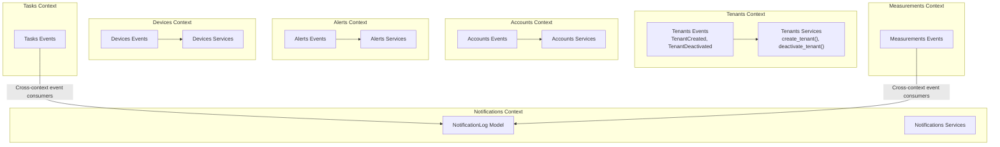
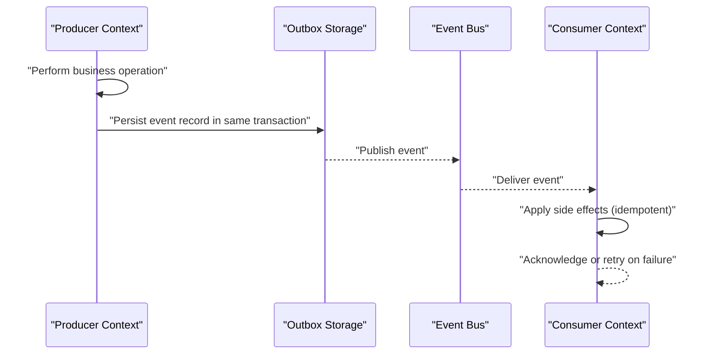
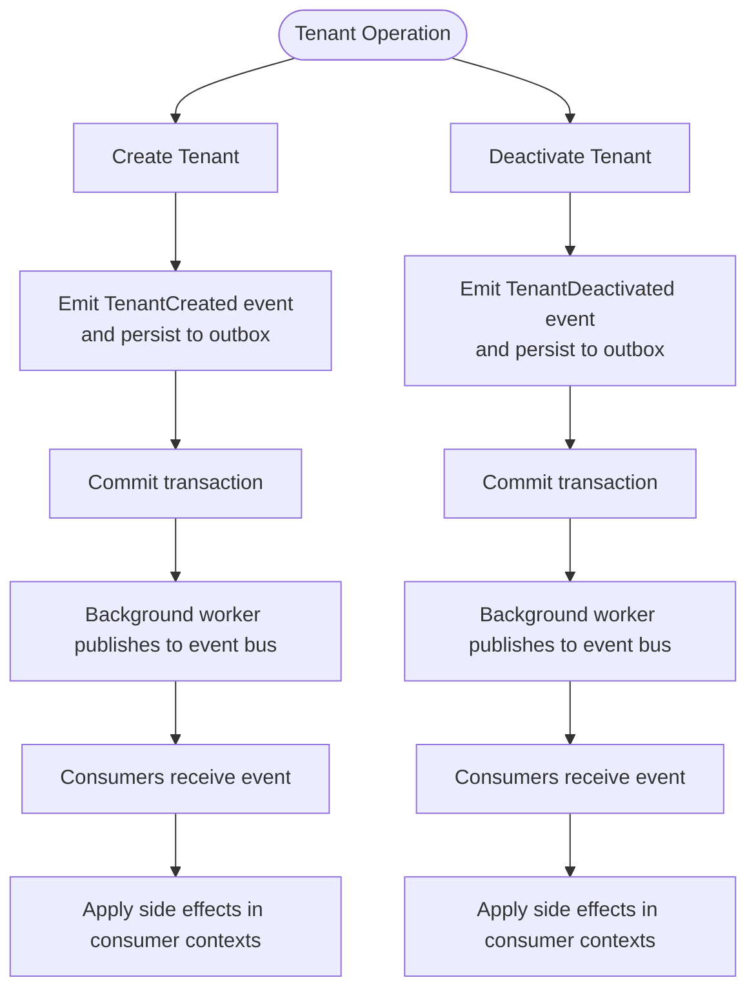
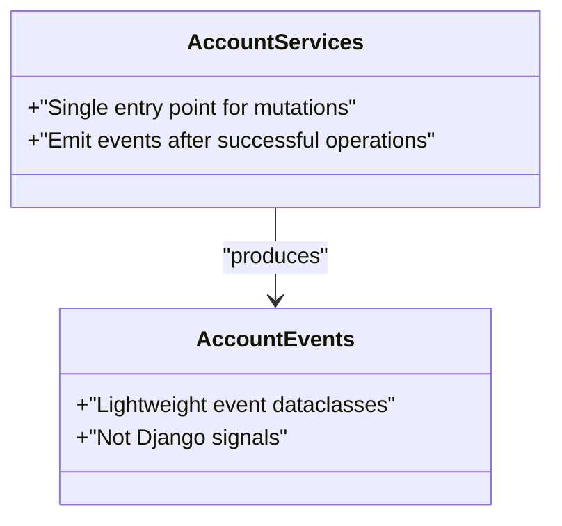
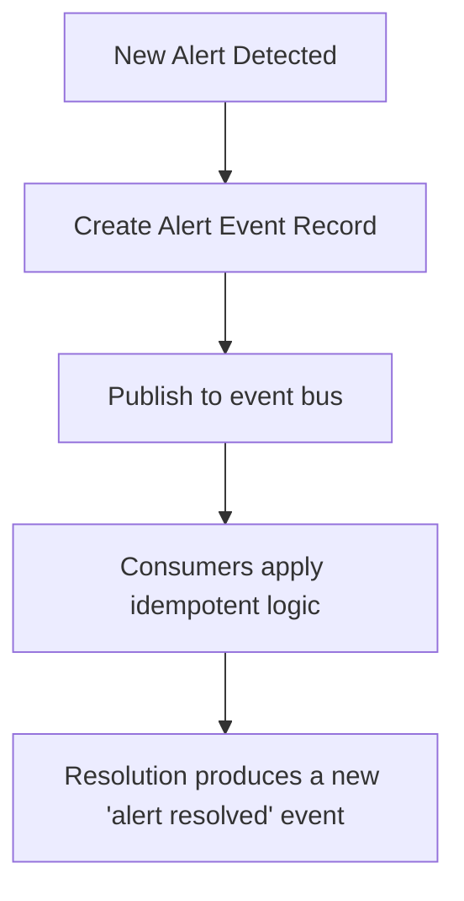
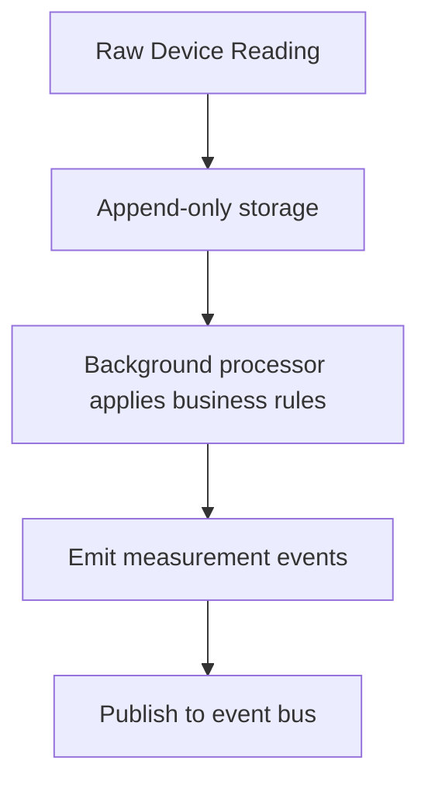
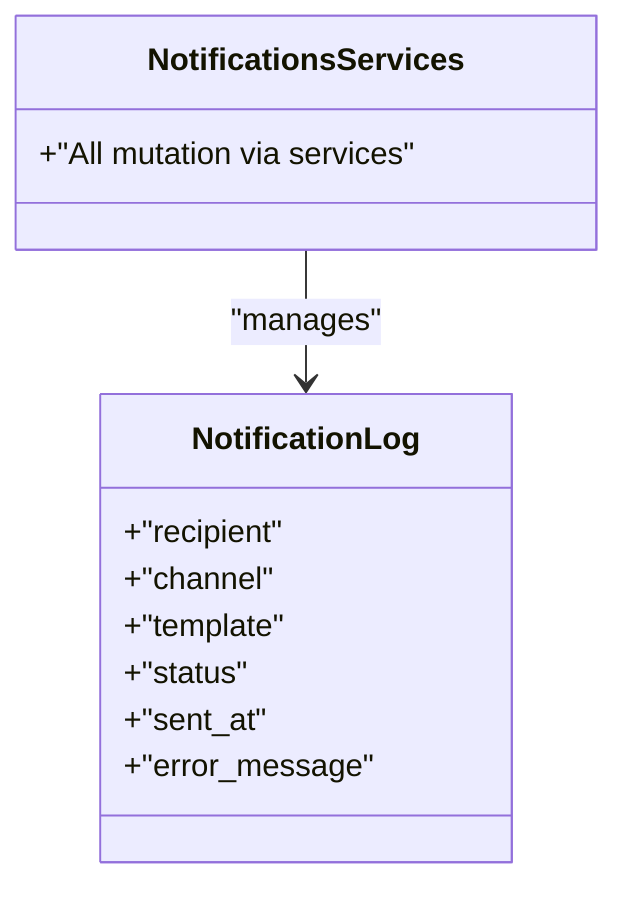
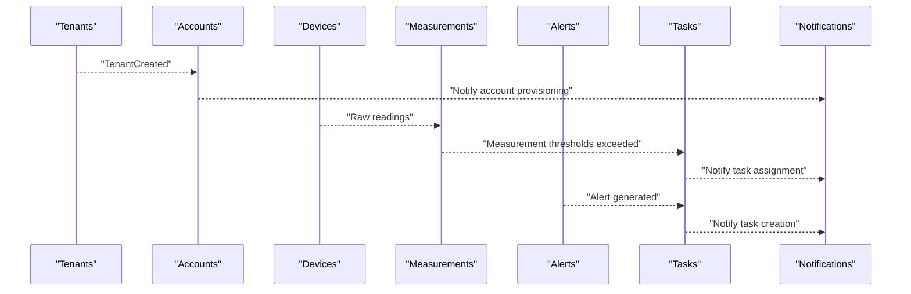
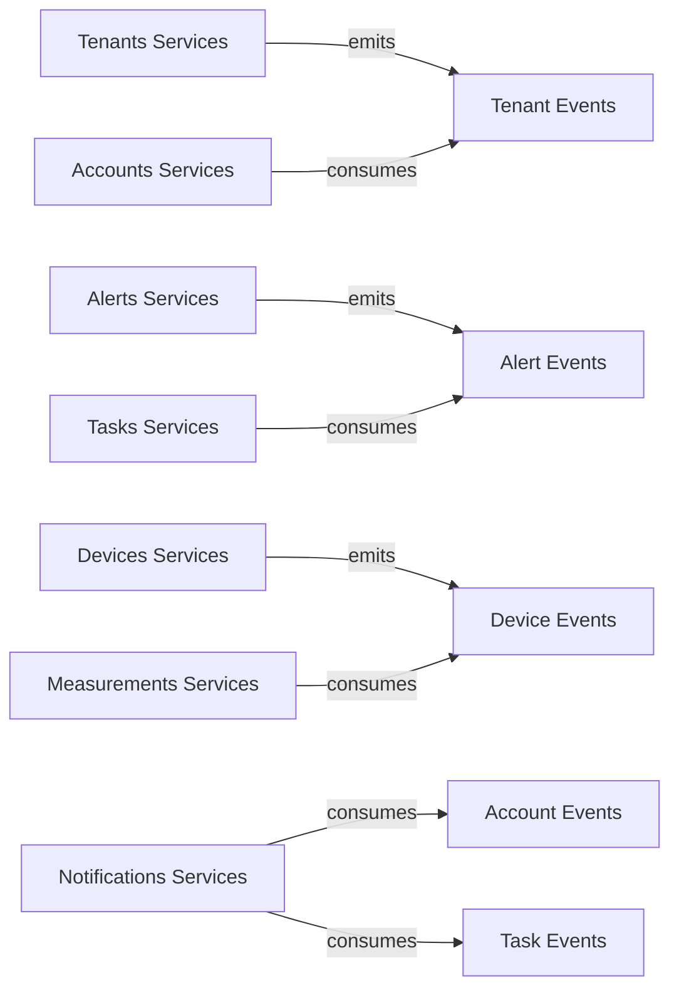

# Domain Events System

<cite>
**Referenced Files in This Document**
- [tenants/events.py](file://backend/apps/tenants/events.py)
- [tenants/services.py](file://backend/apps/tenants/services.py)
- [alerts/events.py](file://backend/apps/alerts/events.py)
- [alerts/services.py](file://backend/apps/alerts/services.py)
- [devices/events.py](file://backend/apps/devices/events.py)
- [devices/services.py](file://backend/apps/devices/services.py)
- [accounts/events.py](file://backend/apps/accounts/events.py)
- [accounts/services.py](file://backend/apps/accounts/services.py)
- [tasks/events.py](file://backend/apps/tasks/events.py)
- [measurements/events.py](file://backend/apps/measurements/events.py)
- [planters/events.py](file://backend/apps/planters/events.py)
- [plants/events.py](file://backend/apps/plants/events.py)
- [locations/events.py](file://backend/apps/locations/events.py)
- [audit/events.py](file://backend/apps/audit/events.py)
- [notifications/models.py](file://backend/apps/notifications/models.py)
- [notifications/services.py](file://backend/apps/notifications/services.py)
- [IOT_INGEST.md](file://backend/docs/architecture/IOT_INGEST.md)
</cite>

## Table of Contents
1. [Introduction](#introduction)
2. [Project Structure](#project-structure)
3. [Core Components](#core-components)
4. [Architecture Overview](#architecture-overview)
5. [Detailed Component Analysis](#detailed-component-analysis)
6. [Dependency Analysis](#dependency-analysis)
7. [Performance Considerations](#performance-considerations)
8. [Troubleshooting Guide](#troubleshooting-guide)
9. [Conclusion](#conclusion)

## Introduction
This document explains the domain events system in PlantOps and how it enables event-driven, loosely coupled bounded contexts while maintaining eventual consistency. The system treats events as immutable facts produced by domain actions and integrates them with an outbox pattern to guarantee reliable delivery. We also cover cross-context workflows, ordering considerations, idempotency, error recovery, and how events replace direct foreign key dependencies between contexts.

## Project Structure
The events system is organized per bounded context. Each context defines domain events as lightweight data structures and exposes a services layer for all write operations. The tenants context documents an explicit outbox flow for emitting events reliably.

**Diagram sources**
- [tenants/events.py:1-36](file://backend/apps/tenants/events.py#L1-L36)
- [tenants/services.py:1-42](file://backend/apps/tenants/services.py#L1-L42)
- [alerts/events.py:1-9](file://backend/apps/alerts/events.py#L1-L9)
- [alerts/services.py:1-9](file://backend/apps/alerts/services.py#L1-L9)
- [devices/events.py:1-7](file://backend/apps/devices/events.py#L1-L7)
- [devices/services.py:1-7](file://backend/apps/devices/services.py#L1-L7)
- [accounts/events.py:1-7](file://backend/apps/accounts/events.py#L1-L7)
- [accounts/services.py:1-7](file://backend/apps/accounts/services.py#L1-L7)
- [tasks/events.py:1-7](file://backend/apps/tasks/events.py#L1-L7)
- [measurements/events.py:1-7](file://backend/apps/measurements/events.py#L1-L7)
- [notifications/models.py:1-27](file://backend/apps/notifications/models.py#L1-L27)
- [notifications/services.py:1-6](file://backend/apps/notifications/services.py#L1-L6)

**Section sources**
- [tenants/events.py:1-36](file://backend/apps/tenants/events.py#L1-L36)
- [tenants/services.py:1-42](file://backend/apps/tenants/services.py#L1-L42)
- [alerts/events.py:1-9](file://backend/apps/alerts/events.py#L1-L9)
- [alerts/services.py:1-9](file://backend/apps/alerts/services.py#L1-L9)
- [devices/events.py:1-7](file://backend/apps/devices/events.py#L1-L7)
- [devices/services.py:1-7](file://backend/apps/devices/services.py#L1-L7)
- [accounts/events.py:1-7](file://backend/apps/accounts/events.py#L1-L7)
- [accounts/services.py:1-7](file://backend/apps/accounts/services.py#L1-L7)
- [tasks/events.py:1-7](file://backend/apps/tasks/events.py#L1-L7)
- [measurements/events.py:1-7](file://backend/apps/measurements/events.py#L1-L7)
- [notifications/models.py:1-27](file://backend/apps/notifications/models.py#L1-L27)
- [notifications/services.py:1-6](file://backend/apps/notifications/services.py#L1-L6)

## Core Components
- Domain events: Lightweight, immutable data structures representing facts that occurred in a bounded context. They are intentionally not Django signals and are designed for outbox or event bus integration.
- Services layer: Single entry point for all write operations within a context. All mutations must go through services to ensure consistent event emission and side effects.
- Outbox pattern: Events are persisted alongside the business transaction so that a background process can publish them reliably to a message bus or event store.

Key characteristics:
- Loose coupling: Consumers subscribe to events rather than calling into producers directly.
- Eventual consistency: Cross-context synchronization happens asynchronously.
- Replace foreign keys: Instead of referencing tenant IDs across contexts, producers emit events and consumers react independently.
- Idempotency: Consumers must handle duplicate deliveries gracefully.

**Section sources**
- [tenants/events.py:1-13](file://backend/apps/tenants/events.py#L1-L13)
- [accounts/events.py:1-7](file://backend/apps/accounts/events.py#L1-L7)
- [alerts/events.py:1-9](file://backend/apps/alerts/events.py#L1-L9)
- [devices/events.py:1-7](file://backend/apps/devices/events.py#L1-L7)
- [tasks/events.py:1-7](file://backend/apps/tasks/events.py#L1-L7)
- [measurements/events.py:1-7](file://backend/apps/measurements/events.py#L1-L7)
- [planters/events.py:1-7](file://backend/apps/planters/events.py#L1-L7)
- [plants/events.py:1-7](file://backend/apps/plants/events.py#L1-L7)
- [locations/events.py:1-7](file://backend/apps/locations/events.py#L1-L7)
- [audit/events.py:1-7](file://backend/apps/audit/events.py#L1-L7)
- [accounts/services.py:1-7](file://backend/apps/accounts/services.py#L1-L7)
- [tenants/services.py:1-42](file://backend/apps/tenants/services.py#L1-L42)
- [alerts/services.py:1-9](file://backend/apps/alerts/services.py#L1-L9)
- [devices/services.py:1-7](file://backend/apps/devices/services.py#L1-L7)
- [notifications/services.py:1-6](file://backend/apps/notifications/services.py#L1-L6)

## Architecture Overview
The event-driven architecture separates concerns across bounded contexts. Producers emit events after successful business operations. The outbox ensures events are durable and published reliably by a background worker. Consumers in other contexts react to events and perform their own business logic.

[No sources needed since this diagram shows conceptual workflow, not actual code structure]

## Detailed Component Analysis

### Tenants Context: Outbox Pattern and Event Emission
The tenants context documents the outbox flow explicitly. After creating or deactivating a tenant, the producer emits a domain event and persists it to an outbox table within the same transaction. A background processor then publishes the event to the message bus for consumers to process.

**Diagram sources**
- [tenants/events.py:8-13](file://backend/apps/tenants/events.py#L8-L13)
- [tenants/events.py:19-35](file://backend/apps/tenants/events.py#L19-L35)
- [tenants/services.py:11-35](file://backend/apps/tenants/services.py#L11-L35)

**Section sources**
- [tenants/events.py:1-36](file://backend/apps/tenants/events.py#L1-L36)
- [tenants/services.py:1-42](file://backend/apps/tenants/services.py#L1-L42)

### Accounts Context: Event-Driven User Provisioning
Accounts events are defined as lightweight data structures. While the current services layer does not yet emit events, the design intent is to produce account-related events (e.g., user created, profile updated) that consumers can react to. This keeps accounts decoupled from downstream systems.

**Diagram sources**
- [accounts/events.py:1-7](file://backend/apps/accounts/events.py#L1-L7)
- [accounts/services.py:1-7](file://backend/apps/accounts/services.py#L1-L7)

**Section sources**
- [accounts/events.py:1-7](file://backend/apps/accounts/events.py#L1-L7)
- [accounts/services.py:1-7](file://backend/apps/accounts/services.py#L1-L7)

### Alerts Context: Append-Only Events and Idempotency
Alerts define events as immutable facts. The services layer emphasizes that alerts are append-only and must be handled idempotently by consumers. This aligns with the principle that alerts represent facts that happened and resolution is modeled as a new event.

**Diagram sources**
- [alerts/events.py:1-9](file://backend/apps/alerts/events.py#L1-L9)
- [alerts/services.py:1-9](file://backend/apps/alerts/services.py#L1-L9)
- [IOT_INGEST.md:85-87](file://backend/docs/architecture/IOT_INGEST.md#L85-L87)

**Section sources**
- [alerts/events.py:1-9](file://backend/apps/alerts/events.py#L1-L9)
- [alerts/services.py:1-9](file://backend/apps/alerts/services.py#L1-L9)
- [IOT_INGEST.md:85-87](file://backend/docs/architecture/IOT_INGEST.md#L85-L87)

### Devices Context: Raw Readings and Measurement Events
Devices produce raw readings that are append-only. Business decisions and derived events (e.g., measurements) are applied in background processing. This prevents devices from writing business state directly and ensures idempotency.

**Diagram sources**
- [devices/events.py:1-7](file://backend/apps/devices/events.py#L1-L7)
- [measurements/events.py:1-7](file://backend/apps/measurements/events.py#L1-L7)
- [IOT_INGEST.md:72-84](file://backend/docs/architecture/IOT_INGEST.md#L72-L84)

**Section sources**
- [devices/events.py:1-7](file://backend/apps/devices/events.py#L1-L7)
- [measurements/events.py:1-7](file://backend/apps/measurements/events.py#L1-L7)
- [IOT_INGEST.md:72-84](file://backend/docs/architecture/IOT_INGEST.md#L72-L84)

### Notifications Context: Delivery Logs and Event Consumers
Notifications maintain a delivery log model and expose a services layer for all mutations. Consumers can listen to events from other contexts (e.g., measurements, tasks) to trigger notifications. The model indicates future fields for recipients, channels, templates, and delivery status.

**Diagram sources**
- [notifications/models.py:12-27](file://backend/apps/notifications/models.py#L12-L27)
- [notifications/services.py:1-6](file://backend/apps/notifications/services.py#L1-L6)

**Section sources**
- [notifications/models.py:1-27](file://backend/apps/notifications/models.py#L1-L27)
- [notifications/services.py:1-6](file://backend/apps/notifications/services.py#L1-L6)

### Cross-Context Workflows and Scenarios
Common event scenarios illustrate how bounded contexts collaborate without tight coupling:

- Tenant creation triggers account setup:
  - Producer: Tenants context emits a tenant-created event.
  - Consumer: Accounts context listens and provisions user accounts or roles.
  - Outcome: Loose coupling via events; no direct foreign key dependencies.

- Device registration generates initial measurements:
  - Producer: Devices context appends raw readings.
  - Consumer: Measurements context derives and emits measurement events.
  - Outcome: Idempotent processing; background transformations.

- Alert generation spawns task creation:
  - Producer: Alerts context emits an alert event.
  - Consumer: Tasks context creates maintenance or response tasks.
  - Outcome: Append-only alerts; resolution as a new event.

[No sources needed since this diagram shows conceptual workflow, not actual code structure]

## Dependency Analysis
Bounded contexts depend on events rather than each other’s models. The services layer centralizes mutations and event emission, reducing cross-context coupling.

[No sources needed since this diagram shows conceptual relationships, not specific code structures]

## Performance Considerations
- Event volume: Batch publishing and consumption to reduce overhead.
- Idempotency: Ensure consumers deduplicate by event ID and key attributes.
- Ordering: Preserve order per entity where required; otherwise rely on eventual consistency.
- Backoff and retries: Implement exponential backoff for transient failures.
- Monitoring: Track lag, dead letter queues, and consumer throughput.

## Troubleshooting Guide
- Duplicate deliveries: Implement idempotent handlers keyed by event ID and correlation attributes.
- Stalled consumers: Monitor lag and adjust concurrency; inspect dead-letter topics.
- Transaction isolation: Verify outbox records are committed with business changes.
- Schema drift: Version events and support backward compatibility in consumers.
- Audit trails: Use audit events to track cross-context activity for debugging.

**Section sources**
- [IOT_INGEST.md:82-87](file://backend/docs/architecture/IOT_INGEST.md#L82-L87)

## Conclusion
The domain events system in PlantOps promotes loose coupling and eventual consistency across bounded contexts. By modeling events as immutable facts and integrating an outbox pattern, the system ensures reliable delivery and simplifies cross-context workflows. Emphasizing idempotency, ordering guarantees where needed, and robust error handling enables scalable, maintainable distributed behavior without direct foreign key dependencies.