# Domain-Driven Design Implementation

<cite>
**Referenced Files in This Document**
- [DDD_OVERVIEW.md](file://backend/docs/architecture/DDD_OVERVIEW.md)
- [RULES.md](file://backend/docs/governance/RULES.md)
- [models.py](file://backend/apps/accounts/models.py)
- [services.py](file://backend/apps/accounts/services.py)
- [selectors.py](file://backend/apps/accounts/selector.py)
- [events.py](file://backend/apps/accounts/events.py)
- [models.py](file://backend/apps/plants/models.py)
- [services.py](file://backend/apps/plants/services.py)
- [selectors.py](file://backend/apps/plants/selectors.py)
- [events.py](file://backend/apps/plants/events.py)
- [models.py](file://backend/apps/measurements/models.py)
- [services.py](file://backend/apps/measurements/services.py)
- [models.py](file://backend/apps/alerts/models.py)
- [models.py](file://backend/apps/tasks/models.py)
- [models.py](file://backend/apps/notifications/models.py)
- [models.py](file://backend/apps/billing/models.py)
- [models.py](file://backend/apps/audit/models.py)
- [models.py](file://backend/apps/devices/models.py)
</cite>

## Table of Contents
1. [Introduction](#introduction)
2. [Project Structure](#project-structure)
3. [Core Components](#core-components)
4. [Architecture Overview](#architecture-overview)
5. [Detailed Component Analysis](#detailed-component-analysis)
6. [Dependency Analysis](#dependency-analysis)
7. [Performance Considerations](#performance-considerations)
8. [Troubleshooting Guide](#troubleshooting-guide)
9. [Conclusion](#conclusion)
10. [Appendices](#appendices)

## Introduction
This document explains the Domain-Driven Design (DDD) implementation for PlantOps, focusing on the twelve bounded contexts, their responsibilities, and the hexagonal architecture pattern. It documents how each context owns its data and business rules, the separation between services (write operations) and selectors (read operations), and the domain events system using the outbox pattern for cross-context communication. It also outlines the DDD file structure per app, architectural rules, and practical examples of context interactions.

## Project Structure
PlantOps organizes business capabilities into bounded contexts implemented as Django apps under backend/apps/. Each context adheres to a consistent DDD file structure:
- models.py: Domain entities and value objects
- services.py: Write operations only
- selectors.py: Read/query operations only
- events.py: Domain events (outbox pattern)
- admin.py: Django admin configuration
- apps.py: AppConfig
- tests/: Unit tests

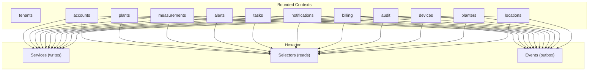

**Diagram sources**
- [DDD_OVERVIEW.md:5-85](file://backend/docs/architecture/DDD_OVERVIEW.md#L5-L85)

**Section sources**
- [DDD_OVERVIEW.md:67-78](file://backend/docs/architecture/DDD_OVERVIEW.md#L67-L78)

## Core Components
Each of the twelve contexts owns its data and enforces its own business rules. The contexts are grouped into two categories:
- Shared Schema (public): tenants
- Tenant Schema: accounts, locations, planters, plants, devices, measurements, alerts, tasks, notifications, billing, audit

Key responsibilities and placeholders:
- tenants: Tenant provisioning, domain management, subscription linking
- accounts: Users, roles, permissions, authentication
- locations: Physical locations (sites, greenhouses, indoor areas)
- planters: Planter definitions and inventory
- plants: Plant species, varieties, care profiles
- devices: IoT device registry, firmware, connectivity
- measurements: Raw sensor readings and processed snapshots (append-only)
- alerts: Alert definitions, alert instances, thresholds (append-only)
- tasks: Tasks for gardeners/workers
- notifications: Notification channels, templates, delivery logs
- billing: Subscriptions, invoices, usage metering
- audit: Audit trails of manual actions (append-only)

Rules summary:
- No direct writes outside services.py
- No direct reads outside selectors.py
- No cross-context foreign keys; use IDs and events
- Models are placeholders until domain is confirmed

**Section sources**
- [DDD_OVERVIEW.md:7-85](file://backend/docs/architecture/DDD_OVERVIEW.md#L7-L85)
- [RULES.md:12-56](file://backend/docs/governance/RULES.md#L12-L56)

## Architecture Overview
The system follows a hexagonal architecture:
- Services encapsulate all write operations and coordinate business workflows
- Selectors encapsulate all read/query operations and return QuerySets or single instances
- Events represent domain facts and are published via an outbox pattern for cross-context communication
- Cross-context collaboration avoids foreign keys; instead, contexts exchange domain events and identifiers

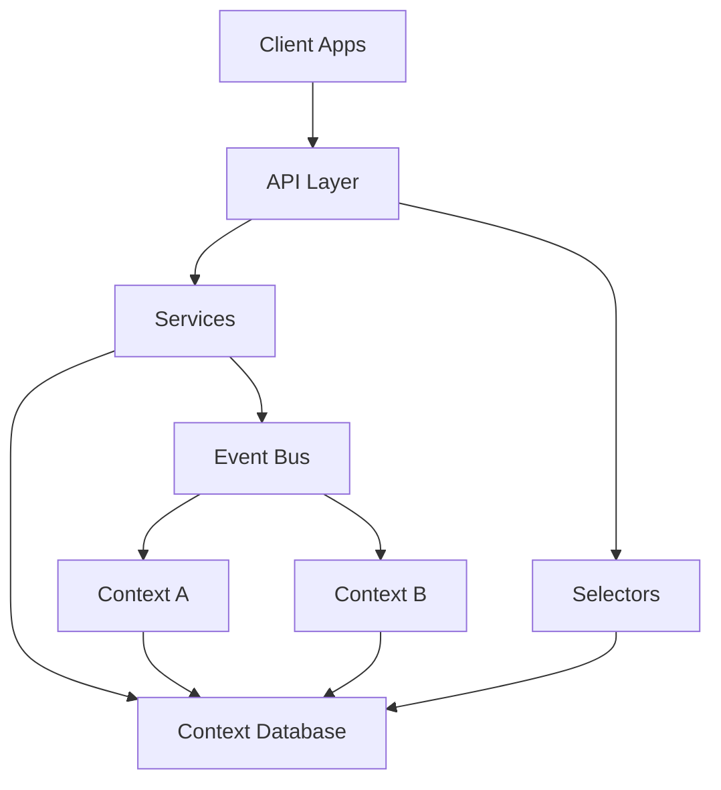

[No sources needed since this diagram shows conceptual workflow, not actual code structure]

## Detailed Component Analysis

### Accounts Context
Responsibilities:
- Users, roles, permissions, authentication within a single tenant
- Placeholder model UserProfile

File roles:
- models.py: Domain entities and value objects
- services.py: Write operations only
- selectors.py: Read/query operations only
- events.py: Domain events (outbox pattern)

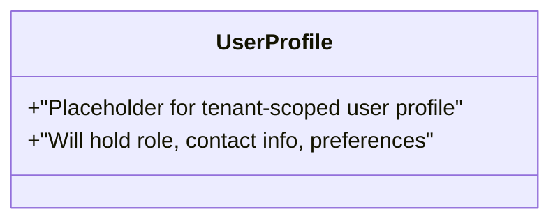

**Diagram sources**
- [models.py:15-30](file://backend/apps/accounts/models.py#L15-L30)

**Section sources**
- [models.py:1-30](file://backend/apps/accounts/models.py#L1-L30)
- [services.py:1-7](file://backend/apps/accounts/services.py#L1-L7)
- [selectors.py:1-7](file://backend/apps/accounts/selectors.py#L1-L7)
- [events.py:1-7](file://backend/apps/accounts/events.py#L1-L7)

### Plants Context
Responsibilities:
- Plant species, varieties, care profiles
- Plant instances assigned to planters

File roles:
- models.py: PlantSpecies and related domain entities
- services.py: Write operations only
- selectors.py: Read/query operations only
- events.py: Domain events (outbox pattern)

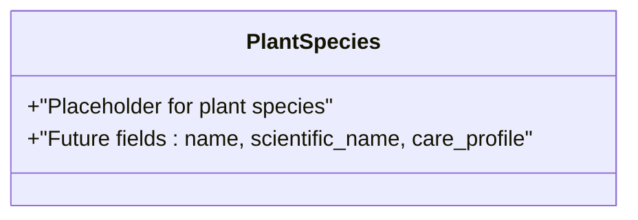

**Diagram sources**
- [models.py:12-26](file://backend/apps/plants/models.py#L12-L26)

**Section sources**
- [models.py:1-26](file://backend/apps/plants/models.py#L1-L26)
- [services.py:1-7](file://backend/apps/plants/services.py#L1-L7)
- [selectors.py:1-7](file://backend/apps/plants/selectors.py#L1-L7)
- [events.py:1-7](file://backend/apps/plants/events.py#L1-L7)

### Measurements Context
Responsibilities:
- Raw sensor readings and processed snapshots
- Append-only policy: never update or delete

File roles:
- models.py: RawReading and related domain entities
- services.py: Write operations only (append-only)
- selectors.py: Read/query operations only
- events.py: Domain events (outbox pattern)

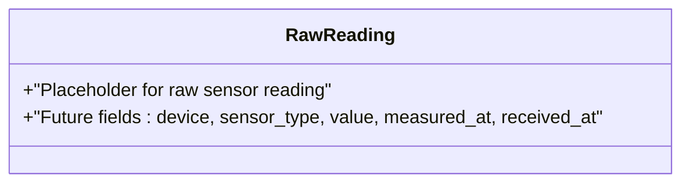

**Diagram sources**
- [models.py:14-30](file://backend/apps/measurements/models.py#L14-L30)

**Section sources**
- [models.py:1-30](file://backend/apps/measurements/models.py#L1-L30)
- [services.py:1-9](file://backend/apps/measurements/services.py#L1-L9)

### Alerts Context
Responsibilities:
- Alert definitions, alert instances, thresholds
- Append-only policy: never update or delete

File roles:
- models.py: Alert and related domain entities
- services.py: Write operations only
- selectors.py: Read/query operations only
- events.py: Domain events (outbox pattern)

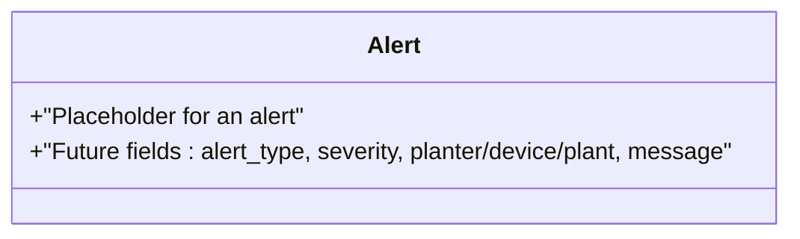

**Diagram sources**
- [models.py:13-29](file://backend/apps/alerts/models.py#L13-L29)

**Section sources**
- [models.py:1-29](file://backend/apps/alerts/models.py#L1-L29)

### Tasks Context
Responsibilities:
- Tasks for gardeners/workers
- System-generated or manually created

File roles:
- models.py: Task and related domain entities
- services.py: Write operations only
- selectors.py: Read/query operations only
- events.py: Domain events (outbox pattern)

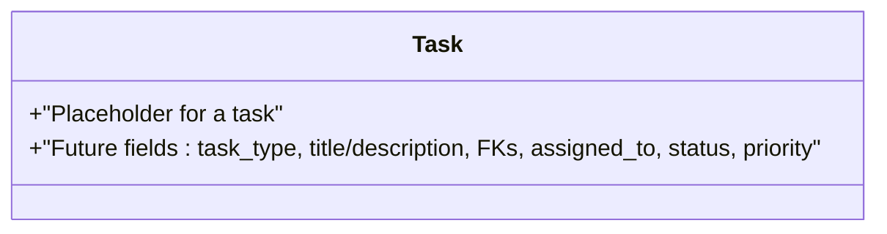

**Diagram sources**
- [models.py:12-29](file://backend/apps/tasks/models.py#L12-L29)

**Section sources**
- [models.py:1-29](file://backend/apps/tasks/models.py#L1-L29)

### Notifications Context
Responsibilities:
- Notification channels, templates, delivery logs
- Supports email, SMS, push, in-app

File roles:
- models.py: NotificationLog and related domain entities
- services.py: Write operations only
- selectors.py: Read/query operations only
- events.py: Domain events (outbox pattern)

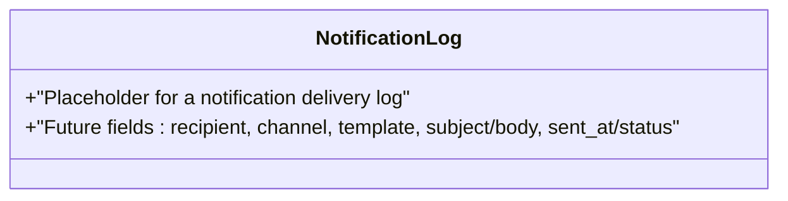

**Diagram sources**
- [models.py:12-28](file://backend/apps/notifications/models.py#L12-L28)

**Section sources**
- [models.py:1-28](file://backend/apps/notifications/models.py#L1-L28)

### Billing Context
Responsibilities:
- Subscriptions, invoices, payments, usage metering

File roles:
- models.py: Subscription and related domain entities
- services.py: Write operations only
- selectors.py: Read/query operations only
- events.py: Domain events (outbox pattern)

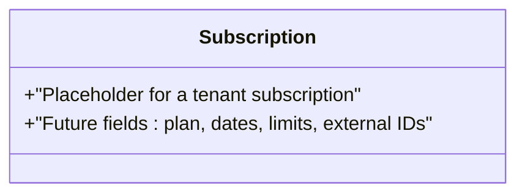

**Diagram sources**
- [models.py:11-26](file://backend/apps/billing/models.py#L11-L26)

**Section sources**
- [models.py:1-26](file://backend/apps/billing/models.py#L1-L26)

### Audit Context
Responsibilities:
- Audit trails of manual actions
- Append-only policy: never update or delete

File roles:
- models.py: AuditLog and related domain entities
- services.py: Write operations only
- selectors.py: Read/query operations only
- events.py: Domain events (outbox pattern)

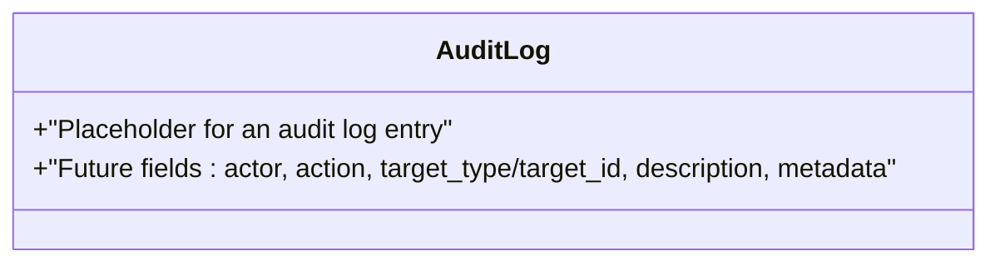

**Diagram sources**
- [models.py:14-31](file://backend/apps/audit/models.py#L14-L31)

**Section sources**
- [models.py:1-31](file://backend/apps/audit/models.py#L1-L31)

### Devices Context
Responsibilities:
- IoT device registry, firmware, connectivity
- Devices never write business state directly

File roles:
- models.py: Device and related domain entities
- services.py: Write operations only
- selectors.py: Read/query operations only
- events.py: Domain events (outbox pattern)

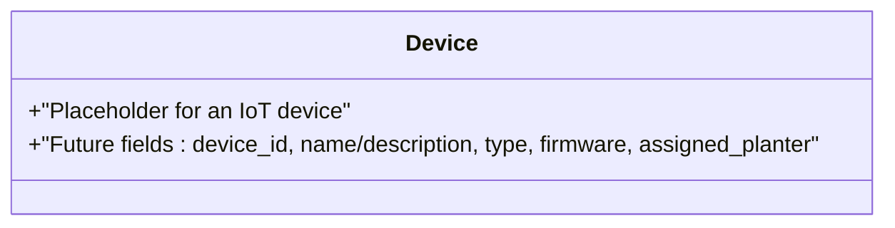

**Diagram sources**
- [models.py:12-29](file://backend/apps/devices/models.py#L12-L29)

**Section sources**
- [models.py:1-29](file://backend/apps/devices/models.py#L1-L29)

### Additional Contexts (Locations, Planters)
Responsibilities:
- locations: Physical locations grouping planters and devices
- planters: Planter definitions and inventory

File roles:
- models.py: Domain entities
- services.py: Write operations only
- selectors.py: Read/query operations only
- events.py: Domain events (outbox pattern)

**Section sources**
- [DDD_OVERVIEW.md:17-25](file://backend/docs/architecture/DDD_OVERVIEW.md#L17-L25)

## Dependency Analysis
Cross-context collaboration is enforced by:
- No direct foreign keys across contexts
- Use of identifiers and domain events
- Outbox pattern for asynchronous propagation of domain facts

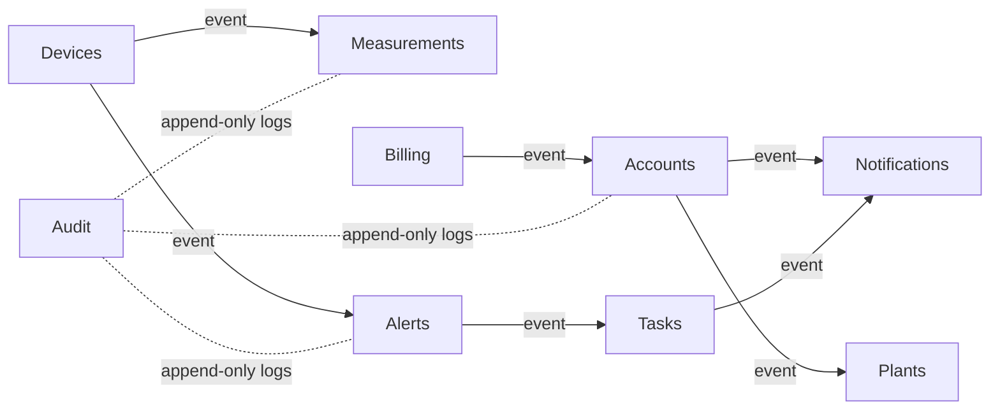

[No sources needed since this diagram shows conceptual relationships, not specific code structure]

## Performance Considerations
- Append-only contexts (measurements, alerts, audit) minimize write contention and support efficient time-series analytics
- Centralized services and selectors enable caching and batching of reads/writes
- Domain events decouple write-heavy and read-heavy workloads, improving scalability

[No sources needed since this section provides general guidance]

## Troubleshooting Guide
Common violations to watch for during code review:
- Direct model writes outside services.py
- Direct queries outside selectors.py
- Cross-context foreign keys
- Attempts to update or delete append-only records

Enforcement references:
- Service-only writes and selector-only reads
- Append-only policies for measurements, alerts, and audit
- Tenant isolation and governance rules

**Section sources**
- [RULES.md:12-56](file://backend/docs/governance/RULES.md#L12-L56)
- [DDD_OVERVIEW.md:80-85](file://backend/docs/architecture/DDD_OVERVIEW.md#L80-L85)

## Conclusion
PlantOps applies DDD rigorously through twelve bounded contexts, each owning its data and business rules. The hexagonal architecture enforces strict separation between services (writes) and selectors (reads), while the outbox pattern enables reliable cross-context communication. Governance rules and append-only policies ensure data integrity, tenant isolation, and maintainability.

## Appendices

### DDD File Structure Per App
- models.py: Domain entities and value objects
- services.py: Write operations only
- selectors.py: Read/query operations only
- events.py: Domain events (outbox pattern)
- admin.py: Django admin configuration
- apps.py: AppConfig
- tests/: Unit tests

**Section sources**
- [DDD_OVERVIEW.md:67-78](file://backend/docs/architecture/DDD_OVERVIEW.md#L67-L78)

### Practical Examples of Context Interactions
- Devices publish measurement events; Measurements persists append-only readings; Alerts evaluates thresholds and publishes alert events; Tasks can be created from alerts; Notifications delivers alerts to users; Audit logs manual actions; Billing integrates with accounts and usage events.

[No sources needed since this section provides general guidance]

### Placeholder Approach and Domain Confirmation
- Models are intentionally minimal placeholders until domain consensus is reached
- Do not add fields until the domain is confirmed
- Use translation.py for translatable fields per app

**Section sources**
- [DDD_OVERVIEW.md:84-85](file://backend/docs/architecture/DDD_OVERVIEW.md#L84-L85)
- [RULES.md:57-62](file://backend/docs/governance/RULES.md#L57-L62)