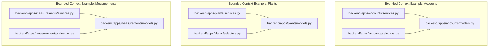
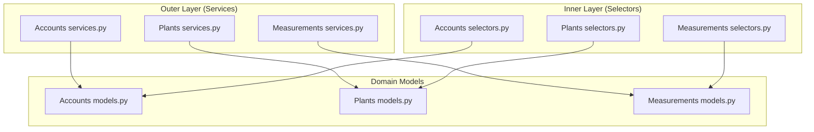
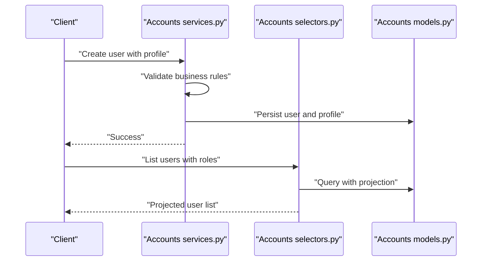
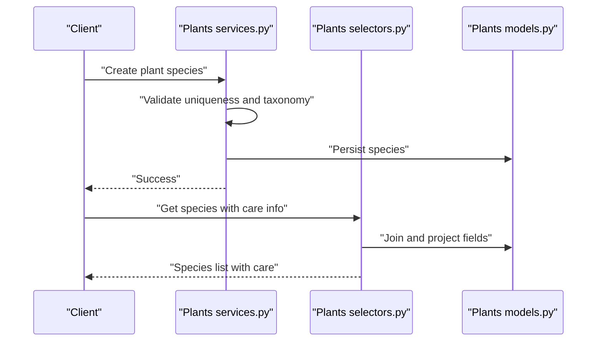
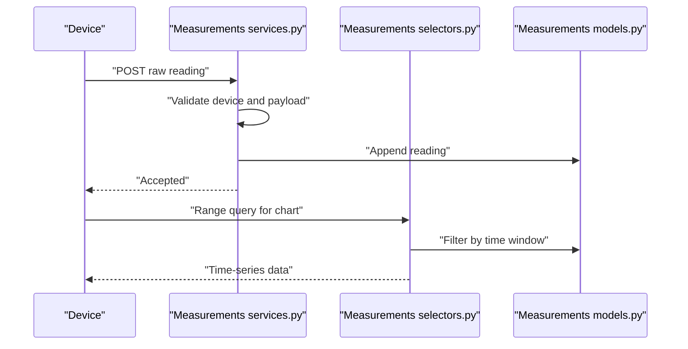
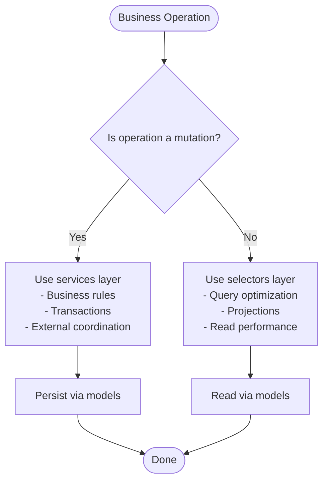
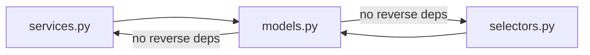

# Hexagonal Architecture Pattern

<cite>
**Referenced Files in This Document**
- [services.py](file://backend/apps/accounts/services.py)
- [selectors.py](file://backend/apps/accounts/selectors.py)
- [models.py](file://backend/apps/accounts/models.py)
- [services.py](file://backend/apps/plants/services.py)
- [selectors.py](file://backend/apps/plants/selectors.py)
- [models.py](file://backend/apps/plants/models.py)
- [services.py](file://backend/apps/measurements/services.py)
- [selectors.py](file://backend/apps/measurements/selectors.py)
- [models.py](file://backend/apps/measurements/models.py)
</cite>

## Table of Contents
1. [Introduction](#introduction)
2. [Project Structure](#project-structure)
3. [Core Components](#core-components)
4. [Architecture Overview](#architecture-overview)
5. [Detailed Component Analysis](#detailed-component-analysis)
6. [Dependency Analysis](#dependency-analysis)
7. [Performance Considerations](#performance-considerations)
8. [Troubleshooting Guide](#troubleshooting-guide)
9. [Conclusion](#conclusion)

## Introduction
This document explains how PlantOps implements a hexagonal architecture pattern to cleanly separate write operations (services layer) from read operations (selectors layer). The pattern enforces dependency inversion so that business logic depends on abstractions rather than concrete storage implementations. It also establishes guardrails: all mutations must go through services, and all queries must go through selectors. This separation improves testability, maintainability, and read/write performance characteristics.

## Project Structure
PlantOps organizes each bounded context into a Django app with three primary files:
- services.py: outer layer for write operations (mutations)
- selectors.py: inner layer for read operations (queries)
- models.py: domain data structures and metadata

**Diagram sources**
- [services.py:1-7](file://backend/apps/accounts/services.py#L1-L7)
- [selectors.py:1-7](file://backend/apps/accounts/selectors.py#L1-L7)
- [models.py:1-30](file://backend/apps/accounts/models.py#L1-L30)
- [services.py:1-7](file://backend/apps/plants/services.py#L1-L7)
- [selectors.py:1-7](file://backend/apps/plants/selectors.py#L1-L7)
- [models.py:1-26](file://backend/apps/plants/models.py#L1-L26)
- [services.py:1-9](file://backend/apps/measurements/services.py#L1-L9)
- [selectors.py:1-7](file://backend/apps/measurements/selectors.py#L1-L7)
- [models.py:1-30](file://backend/apps/measurements/models.py#L1-L30)

**Section sources**
- [services.py:1-7](file://backend/apps/accounts/services.py#L1-L7)
- [selectors.py:1-7](file://backend/apps/accounts/selectors.py#L1-L7)
- [models.py:1-30](file://backend/apps/accounts/models.py#L1-L30)
- [services.py:1-7](file://backend/apps/plants/services.py#L1-L7)
- [selectors.py:1-7](file://backend/apps/plants/selectors.py#L1-L7)
- [models.py:1-26](file://backend/apps/plants/models.py#L1-L26)
- [services.py:1-9](file://backend/apps/measurements/services.py#L1-L9)
- [selectors.py:1-7](file://backend/apps/measurements/selectors.py#L1-L7)
- [models.py:1-30](file://backend/apps/measurements/models.py#L1-L30)

## Core Components
- Services layer (outer hexagon):
  - Enforces business rules and orchestrates external systems
  - Manages transactions and ensures atomicity for multi-step operations
  - Prohibits direct model writes outside of services
- Selectors layer (inner hexagon):
  - Centralizes read logic and query projections
  - Optimizes for read-side performance and avoids N+1 queries
  - Prohibits direct model reads outside of selectors
- Domain models:
  - Define data structures and metadata
  - Remain free of framework-specific persistence logic

These roles are documented in the header comments of each services.py and selectors.py file, and reinforced by the presence of models.py in each bounded context.

**Section sources**
- [services.py:1-7](file://backend/apps/accounts/services.py#L1-L7)
- [selectors.py:1-7](file://backend/apps/accounts/selectors.py#L1-L7)
- [services.py:1-7](file://backend/apps/plants/services.py#L1-L7)
- [selectors.py:1-7](file://backend/apps/plants/selectors.py#L1-L7)
- [services.py:1-9](file://backend/apps/measurements/services.py#L1-L9)
- [selectors.py:1-7](file://backend/apps/measurements/selectors.py#L1-L7)

## Architecture Overview
The hexagonal architecture separates concerns by placing the application’s business logic at the center, surrounded by two layers:
- Outer layer (services): handles mutations, transactions, and cross-system coordination
- Inner layer (selectors): handles queries, projections, and read performance

**Diagram sources**
- [services.py:1-7](file://backend/apps/accounts/services.py#L1-L7)
- [selectors.py:1-7](file://backend/apps/accounts/selectors.py#L1-L7)
- [models.py:1-30](file://backend/apps/accounts/models.py#L1-L30)
- [services.py:1-7](file://backend/apps/plants/services.py#L1-L7)
- [selectors.py:1-7](file://backend/apps/plants/selectors.py#L1-L7)
- [models.py:1-26](file://backend/apps/plants/models.py#L1-L26)
- [services.py:1-9](file://backend/apps/measurements/services.py#L1-L9)
- [selectors.py:1-7](file://backend/apps/measurements/selectors.py#L1-L7)
- [models.py:1-30](file://backend/apps/measurements/models.py#L1-L30)

## Detailed Component Analysis

### Accounts Context
- Services responsibilities:
  - Enforce tenant-scoped user and profile rules
  - Coordinate authentication and permission updates
  - Manage transactions for multi-entity changes
- Selectors responsibilities:
  - Provide optimized queries for user lists, roles, and permissions
  - Support projections that avoid loading unnecessary fields
- Models:
  - UserProfile placeholder defines the tenant-scoped user profile shape

**Diagram sources**
- [services.py:1-7](file://backend/apps/accounts/services.py#L1-L7)
- [selectors.py:1-7](file://backend/apps/accounts/selectors.py#L1-L7)
- [models.py:15-30](file://backend/apps/accounts/models.py#L15-L30)

**Section sources**
- [services.py:1-7](file://backend/apps/accounts/services.py#L1-L7)
- [selectors.py:1-7](file://backend/apps/accounts/selectors.py#L1-L7)
- [models.py:1-30](file://backend/apps/accounts/models.py#L1-L30)

### Plants Context
- Services responsibilities:
  - Manage plant species, varieties, and care profiles
  - Coordinate assignments to planters within tenant boundaries
- Selectors responsibilities:
  - Optimize queries for species lists, care profiles, and assigned plant instances
  - Provide denormalized views for read-heavy dashboards
- Models:
  - PlantSpecies placeholder defines the taxonomy and care profile shape

**Diagram sources**
- [services.py:1-7](file://backend/apps/plants/services.py#L1-L7)
- [selectors.py:1-7](file://backend/apps/plants/selectors.py#L1-L7)
- [models.py:12-26](file://backend/apps/plants/models.py#L12-L26)

**Section sources**
- [services.py:1-7](file://backend/apps/plants/services.py#L1-L7)
- [selectors.py:1-7](file://backend/apps/plants/selectors.py#L1-L7)
- [models.py:1-26](file://backend/apps/plants/models.py#L1-L26)

### Measurements Context
- Services responsibilities:
  - Append-only ingestion of raw sensor readings
  - Validation of device timestamps and payload integrity
  - Coordination with downstream processing (e.g., batch jobs)
- Selectors responsibilities:
  - Efficient range queries for time-series data
  - Aggregation-friendly projections for analytics
- Models:
  - RawReading placeholder defines the immutable reading shape

**Diagram sources**
- [services.py:1-9](file://backend/apps/measurements/services.py#L1-L9)
- [selectors.py:1-7](file://backend/apps/measurements/selectors.py#L1-L7)
- [models.py:14-30](file://backend/apps/measurements/models.py#L14-L30)

**Section sources**
- [services.py:1-9](file://backend/apps/measurements/services.py#L1-L9)
- [selectors.py:1-7](file://backend/apps/measurements/selectors.py#L1-L7)
- [models.py:1-30](file://backend/apps/measurements/models.py#L1-L30)

### Conceptual Overview
The hexagonal pattern enforces:
- Clean dependency inversion: business logic depends on abstractions (services/selector interfaces), not on ORM or databases
- Separation of concerns: mutations vs. queries
- Testability: services and selectors can be unit-tested independently
- Read/write performance: selectors optimize projections and joins; services coordinate transactions

[No sources needed since this diagram shows conceptual workflow, not actual code structure]

## Dependency Analysis
- Cohesion:
  - Each bounded context keeps services, selectors, and models together, increasing locality
- Coupling:
  - Services depend on models for persistence
  - Selectors depend on models for querying
  - No reverse dependency from models to services/selectors
- Guardrails:
  - Header comments in services.py and selectors.py enforce that mutations and queries must go through these modules

**Diagram sources**
- [services.py:1-7](file://backend/apps/accounts/services.py#L1-L7)
- [selectors.py:1-7](file://backend/apps/accounts/selectors.py#L1-L7)
- [models.py:1-30](file://backend/apps/accounts/models.py#L1-L30)

**Section sources**
- [services.py:1-7](file://backend/apps/accounts/services.py#L1-L7)
- [selectors.py:1-7](file://backend/apps/accounts/selectors.py#L1-L7)
- [models.py:1-30](file://backend/apps/accounts/models.py#L1-L30)

## Performance Considerations
- Write path:
  - Services should group related changes into transactions to minimize partial states
  - Batch external system calls (e.g., notifications, analytics) after successful persistence
- Read path:
  - Selectors should use select_related and prefetch_related to avoid N+1 queries
  - Prefer projections that load only required fields for read-heavy UIs
  - Use database indexes on frequently queried fields (e.g., tenant ID, timestamps)
- Immutable writes:
  - For measurements, append-only design simplifies concurrency and enables efficient ingestion

[No sources needed since this section provides general guidance]

## Troubleshooting Guide
Common issues and remedies:
- Direct model writes in business logic:
  - Symptom: unexpected side effects or missing validations
  - Fix: route all mutations through services.py
- Direct model reads in UI/business code:
  - Symptom: N+1 queries or missing projections
  - Fix: route all queries through selectors.py
- Transaction anomalies:
  - Symptom: partial updates during multi-entity changes
  - Fix: wrap multi-step changes in a single transaction inside services.py
- Read performance regressions:
  - Symptom: slow dashboards or charts
  - Fix: add appropriate projections and joins in selectors.py

**Section sources**
- [services.py:1-7](file://backend/apps/accounts/services.py#L1-L7)
- [selectors.py:1-7](file://backend/apps/accounts/selectors.py#L1-L7)
- [services.py:1-9](file://backend/apps/measurements/services.py#L1-L9)
- [selectors.py:1-7](file://backend/apps/measurements/selectors.py#L1-L7)

## Conclusion
PlantOps’ hexagonal architecture cleanly separates write and read concerns across bounded contexts. Services encapsulate business rules and transactions, while selectors centralize query logic and projections. This design improves testability, maintainability, and performance, and enforces dependency inversion to keep business logic framework-agnostic.