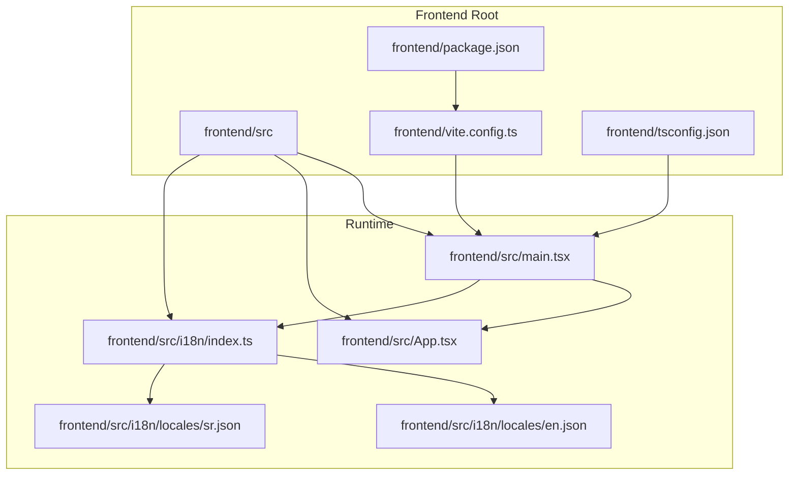
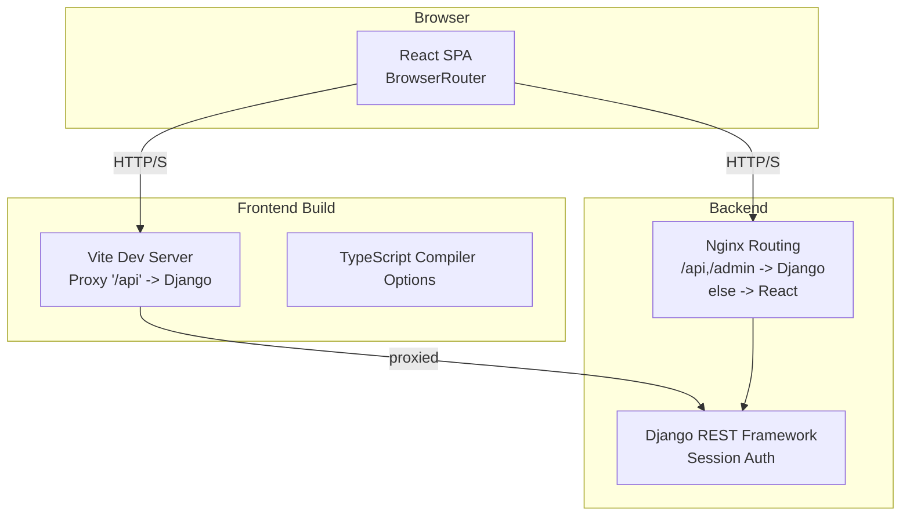
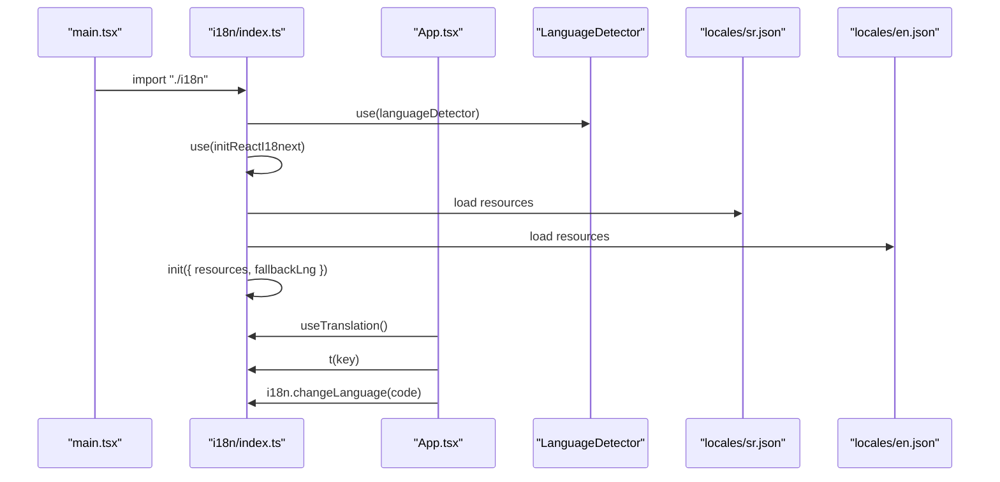
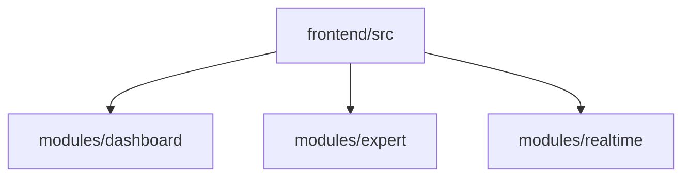
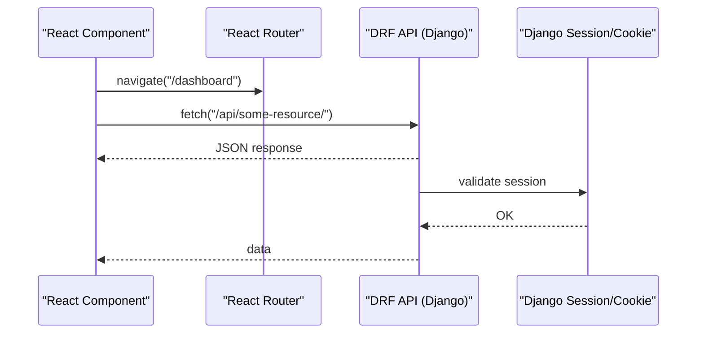
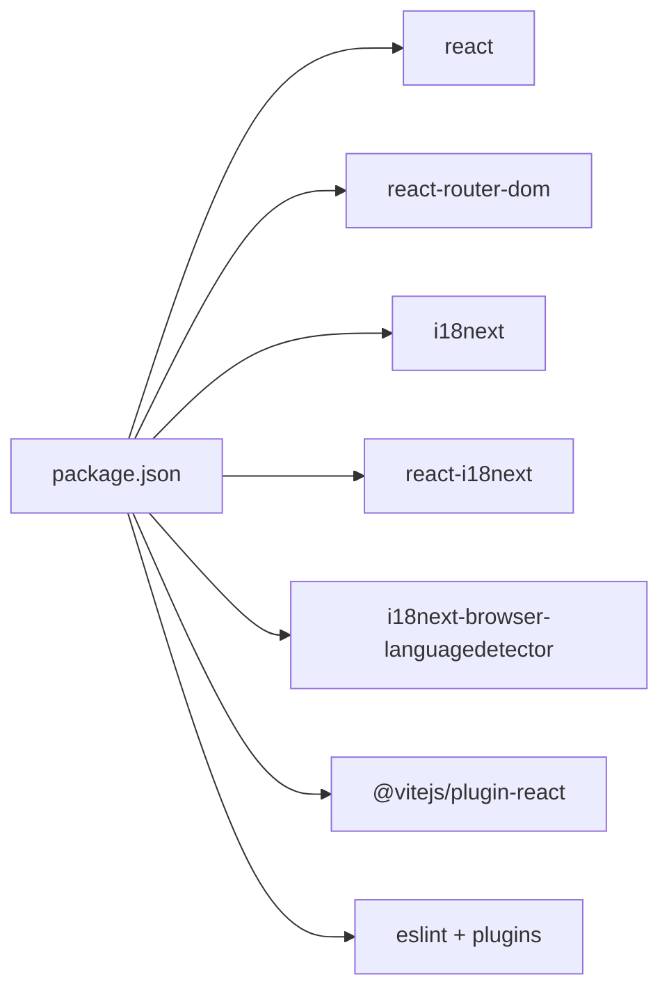

# Frontend Architecture & Boundaries

<cite>
**Referenced Files in This Document**
- [main.tsx](file://frontend/src/main.tsx)
- [App.tsx](file://frontend/src/App.tsx)
- [vite.config.ts](file://frontend/vite.config.ts)
- [tsconfig.json](file://frontend/tsconfig.json)
- [package.json](file://frontend/package.json)
- [i18n/index.ts](file://frontend/src/i18n/index.ts)
- [i18n/locales/en.json](file://frontend/src/i18n/locales/en.json)
- [i18n/locales/sr.json](file://frontend/src/i18n/locales/sr.json)
- [FRONTEND_BOUNDARIES.md](file://backend/docs/architecture/FRONTEND_BOUNDARIES.md)
- [README.md](file://README.md)
</cite>

## Table of Contents
1. [Introduction](#introduction)
2. [Project Structure](#project-structure)
3. [Core Components](#core-components)
4. [Architecture Overview](#architecture-overview)
5. [Detailed Component Analysis](#detailed-component-analysis)
6. [Dependency Analysis](#dependency-analysis)
7. [Performance Considerations](#performance-considerations)
8. [Troubleshooting Guide](#troubleshooting-guide)
9. [Conclusion](#conclusion)
10. [Appendices](#appendices)

## Introduction
This document describes the frontend architecture and system boundaries for the PlantOps project. It focuses on the React application built with TypeScript and Vite, the modular design across dashboard, expert, and realtime modules, internationalization with i18next, and the clear separation between frontend and backend APIs. It also covers the build system, development workflow, and practical patterns for component composition, state management, and API integration. Accessibility, responsive design, and cross-browser compatibility strategies are addressed conceptually.

## Project Structure
The frontend is organized under frontend/src with a clear separation of concerns:
- Application bootstrap and routing entry point
- Internationalization initialization
- Module-based feature areas (dashboard, expert, realtime)
- Build configuration and TypeScript settings

Key files and their roles:
- Entry point initializes React, routing, and i18n before rendering the root component.
- App component demonstrates i18n usage and language switching.
- i18n module sets up detection, resources, and defaults.
- Vite configuration defines aliases, dev server proxy, and build outputs.
- TypeScript configuration enables strictness, JSX transform, and path mapping.

**Diagram sources**
- [main.tsx:1-15](file://frontend/src/main.tsx#L1-L15)
- [App.tsx:1-20](file://frontend/src/App.tsx#L1-L20)
- [i18n/index.ts:1-23](file://frontend/src/i18n/index.ts#L1-L23)
- [i18n/locales/en.json:1-7](file://frontend/src/i18n/locales/en.json#L1-L7)
- [i18n/locales/sr.json:1-7](file://frontend/src/i18n/locales/sr.json#L1-L7)
- [vite.config.ts:1-27](file://frontend/vite.config.ts#L1-L27)
- [tsconfig.json:1-26](file://frontend/tsconfig.json#L1-L26)
- [package.json:1-33](file://frontend/package.json#L1-L33)

**Section sources**
- [README.md:155-168](file://README.md#L155-L168)
- [FRONTEND_BOUNDARIES.md:48-51](file://backend/docs/architecture/FRONTEND_BOUNDARIES.md#L48-L51)
- [main.tsx:1-15](file://frontend/src/main.tsx#L1-L15)
- [vite.config.ts:1-27](file://frontend/vite.config.ts#L1-L27)
- [tsconfig.json:1-26](file://frontend/tsconfig.json#L1-L26)
- [package.json:1-33](file://frontend/package.json#L1-L33)

## Core Components
- Application bootstrap and routing:
  - Initializes React Strict Mode and BrowserRouter.
  - Imports i18n setup and renders the root App component.
- Root App component:
  - Uses react-i18next to translate content and switch languages dynamically.
- Internationalization:
  - i18next configured with language detector, resource bundles, and fallback language.
  - Exports the initialized i18n instance for use across components.
- Build and toolchain:
  - Vite dev server with proxy to backend API.
  - TypeScript strict compiler options and path aliases.

Practical examples (by file path):
- Language switching and translation usage: [App.tsx:1-20](file://frontend/src/App.tsx#L1-L20)
- i18n initialization and resources: [i18n/index.ts:1-23](file://frontend/src/i18n/index.ts#L1-L23)
- Alias resolution and proxy configuration: [vite.config.ts:7-21](file://frontend/vite.config.ts#L7-L21)
- TypeScript strictness and JSX transform: [tsconfig.json:2-18](file://frontend/tsconfig.json#L2-L18)

**Section sources**
- [main.tsx:1-15](file://frontend/src/main.tsx#L1-L15)
- [App.tsx:1-20](file://frontend/src/App.tsx#L1-L20)
- [i18n/index.ts:1-23](file://frontend/src/i18n/index.ts#L1-L23)
- [i18n/locales/en.json:1-7](file://frontend/src/i18n/locales/en.json#L1-L7)
- [i18n/locales/sr.json:1-7](file://frontend/src/i18n/locales/sr.json#L1-L7)
- [vite.config.ts:1-27](file://frontend/vite.config.ts#L1-L27)
- [tsconfig.json:1-26](file://frontend/tsconfig.json#L1-L26)
- [package.json:1-33](file://frontend/package.json#L1-L33)

## Architecture Overview
The frontend is a single-page React application with client-side routing. It communicates with the backend via a shared Django REST Framework API, using Django session authentication. The system distinguishes between:
- HTMX + Django Templates for admin and CRUD-heavy pages.
- React + Vite for interactive dashboards, expert analytics, and real-time features.

**Diagram sources**
- [FRONTEND_BOUNDARIES.md:60-74](file://backend/docs/architecture/FRONTEND_BOUNDARIES.md#L60-L74)
- [vite.config.ts:12-21](file://frontend/vite.config.ts#L12-L21)
- [README.md:26-31](file://README.md#L26-L31)

**Section sources**
- [FRONTEND_BOUNDARIES.md:1-74](file://backend/docs/architecture/FRONTEND_BOUNDARIES.md#L1-L74)
- [README.md:26-31](file://README.md#L26-L31)
- [vite.config.ts:12-21](file://frontend/vite.config.ts#L12-L21)

## Detailed Component Analysis

### Internationalization with i18next
The i18n setup initializes language detection, registers the React integration, and loads translation resources. The App component demonstrates runtime language switching and translation usage.

**Diagram sources**
- [main.tsx:5-5](file://frontend/src/main.tsx#L5-L5)
- [i18n/index.ts:1-23](file://frontend/src/i18n/index.ts#L1-L23)
- [i18n/locales/sr.json:1-7](file://frontend/src/i18n/locales/sr.json#L1-L7)
- [i18n/locales/en.json:1-7](file://frontend/src/i18n/locales/en.json#L1-L7)
- [App.tsx:1-17](file://frontend/src/App.tsx#L1-L17)

Implementation highlights:
- Language detection and fallback configuration.
- Resource loading for Serbian and English.
- Runtime language switching via the App component.

**Section sources**
- [i18n/index.ts:1-23](file://frontend/src/i18n/index.ts#L1-L23)
- [i18n/locales/en.json:1-7](file://frontend/src/i18n/locales/en.json#L1-L7)
- [i18n/locales/sr.json:1-7](file://frontend/src/i18n/locales/sr.json#L1-L7)
- [App.tsx:1-17](file://frontend/src/App.tsx#L1-L17)

### Module-Based Architecture
The frontend documentation outlines three primary modules:
- dashboard: Overview, KPIs, charts
- expert: Advanced analytics, data exploration
- realtime: Live sensor data, WebSocket feeds

These modules are located under frontend/src/modules and represent feature-focused boundaries within the React application.

**Diagram sources**
- [FRONTEND_BOUNDARIES.md:48-51](file://backend/docs/architecture/FRONTEND_BOUNDARIES.md#L48-L51)
- [README.md:157-161](file://README.md#L157-L161)

**Section sources**
- [FRONTEND_BOUNDARIES.md:48-51](file://backend/docs/architecture/FRONTEND_BOUNDARIES.md#L48-L51)
- [README.md:157-161](file://README.md#L157-L161)

### API Integration Patterns
Both HTMX/Django templates and React consume the same DRF API. React uses fetch/axios against API endpoints, while HTMX uses hx-get/hx-post. Authentication relies on Django sessions with CSRF handled automatically.

**Diagram sources**
- [FRONTEND_BOUNDARIES.md:60-67](file://backend/docs/architecture/FRONTEND_BOUNDARIES.md#L60-L67)

**Section sources**
- [FRONTEND_BOUNDARIES.md:60-74](file://backend/docs/architecture/FRONTEND_BOUNDARIES.md#L60-L74)

### State Management Approaches
- Local component state: useState/useReducer for UI state and small domain slices.
- Global state: Context API for theme, i18n, and lightweight cross-component data.
- External state libraries: Not present in current code; libraries like Redux Toolkit or Zustand could be introduced later if needed.

Note: The current App component does not demonstrate explicit global state management; patterns above are recommended approaches for future expansion.

[No sources needed since this section provides general guidance]

### Component Composition Examples
- Translation usage: [App.tsx:8-9](file://frontend/src/App.tsx#L8-L9)
- Language switching: [App.tsx:12-13](file://frontend/src/App.tsx#L12-L13)
- i18n initialization: [i18n/index.ts:8-20](file://frontend/src/i18n/index.ts#L8-L20)

**Section sources**
- [App.tsx:1-20](file://frontend/src/App.tsx#L1-L20)
- [i18n/index.ts:1-23](file://frontend/src/i18n/index.ts#L1-L23)

## Dependency Analysis
Frontend dependencies and toolchain:
- Runtime: React, React DOM, React Router, i18next, react-i18next, i18next-browser-languagedetector.
- Build and linting: Vite, @vitejs/plugin-react, TypeScript, ESLint with React hooks and refresh plugins.

**Diagram sources**
- [package.json:12-31](file://frontend/package.json#L12-L31)

**Section sources**
- [package.json:1-33](file://frontend/package.json#L1-L33)

## Performance Considerations
- Build artifacts: Source maps enabled in development for debugging; adjust build.sourcemap for production needs.
- Dev server proxy: Redirects /api to backend for seamless development.
- Strict TypeScript: Enforces correctness and improves DX; consider incremental builds if scaling.

Recommendations:
- Lazy-load heavy modules (dashboard, expert, realtime) using React.lazy and Suspense.
- Split vendor and app bundles via Vite’s rollup options.
- Enable tree-shaking and minification in production builds.

**Section sources**
- [vite.config.ts:22-26](file://frontend/vite.config.ts#L22-L26)
- [tsconfig.json:11-18](file://frontend/tsconfig.json#L11-L18)

## Troubleshooting Guide
Common issues and resolutions:
- API requests failing during development:
  - Verify VITE_API_BASE_URL environment variable and proxy target.
  - Confirm backend is reachable at the configured host/port.
- Language switching not working:
  - Ensure resources are loaded and keys match the translation files.
  - Check fallbackLng configuration.
- Build errors:
  - Review TypeScript strict mode diagnostics and unused locals/parameters.
  - Validate ESLint configuration and plugin versions.

**Section sources**
- [vite.config.ts:15-21](file://frontend/vite.config.ts#L15-L21)
- [i18n/index.ts:16-20](file://frontend/src/i18n/index.ts#L16-L20)
- [tsconfig.json:14-18](file://frontend/tsconfig.json#L14-L18)
- [package.json:23-30](file://frontend/package.json#L23-L30)

## Conclusion
The frontend employs a clean, modular React architecture with TypeScript and Vite, complemented by robust i18n support. The system clearly separates concerns between HTMX/Django templates and React/Vite, ensuring maintainability and scalability. By following the documented boundaries and patterns—routing, API integration, state management, and build configuration—the team can deliver responsive, accessible, and cross-browser compatible experiences.

## Appendices

### Development Workflow
- Start dev server: npm run dev
- Build for production: npm run build
- Preview production build: npm run preview
- Linting: npm run lint

Environment variables:
- VITE_API_BASE_URL: Base URL for the backend API proxy.

**Section sources**
- [package.json:6-10](file://frontend/package.json#L6-L10)
- [vite.config.ts:15-19](file://frontend/vite.config.ts#L15-L19)
- [README.md:81-93](file://README.md#L81-L93)

### Accessibility and Responsive Design
- Accessibility:
  - Use semantic HTML and ARIA attributes where needed.
  - Ensure keyboard navigation and focus management.
  - Provide meaningful alt text and labels.
- Responsive design:
  - Mobile-first CSS with media queries.
  - Flexible layouts using CSS Grid and Flexbox.
- Cross-browser compatibility:
  - Target modern browsers; polyfill only if legacy support is required.
  - Test across major browsers and devices.

[No sources needed since this section provides general guidance]