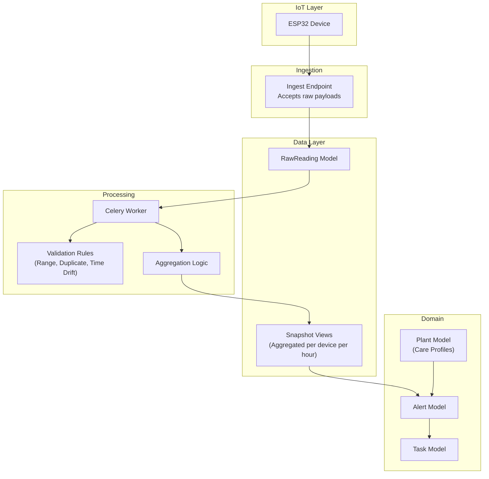
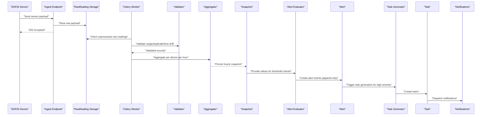
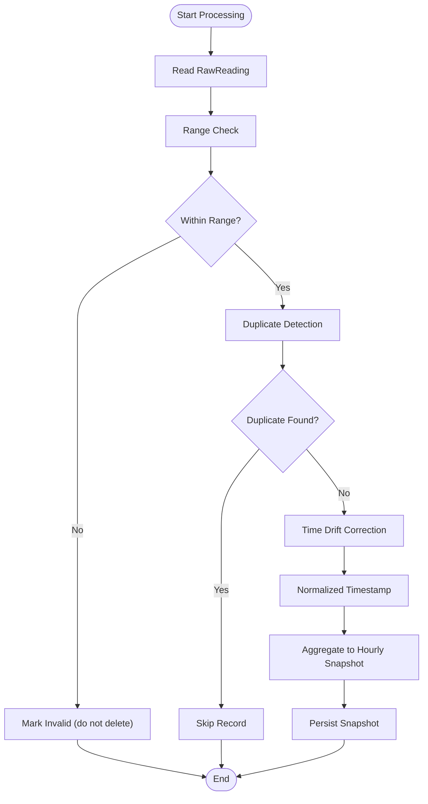
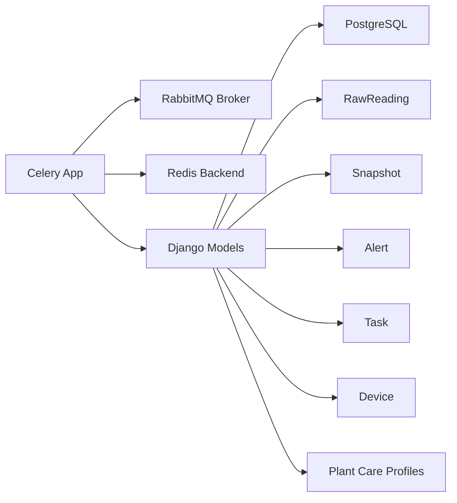

# Data Transformation & Processing

<cite>
**Referenced Files in This Document**
- [IOT_INGEST.md](file://backend/docs/architecture/IOT_INGEST.md)
- [celery.py](file://backend/config/celery.py)
- [models.py](file://backend/apps/measurements/models.py)
- [services.py](file://backend/apps/measurements/services.py)
- [selectors.py](file://backend/apps/measurements/selectors.py)
- [models.py](file://backend/apps/devices/models.py)
- [models.py](file://backend/apps/alerts/models.py)
- [models.py](file://backend/apps/tasks/models.py)
- [models.py](file://backend/apps/plants/models.py)
</cite>

## Table of Contents
1. [Introduction](#introduction)
2. [Project Structure](#project-structure)
3. [Core Components](#core-components)
4. [Architecture Overview](#architecture-overview)
5. [Detailed Component Analysis](#detailed-component-analysis)
6. [Dependency Analysis](#dependency-analysis)
7. [Performance Considerations](#performance-considerations)
8. [Troubleshooting Guide](#troubleshooting-guide)
9. [Conclusion](#conclusion)

## Introduction
This document explains the data transformation and processing pipeline that turns raw sensor readings into validated, hourly aggregated snapshots. The system is built on a Celery-based asynchronous processing architecture, with strict data integrity principles: raw readings are append-only, processing is idempotent, and alerts are append-only events. The pipeline validates incoming data, detects and handles duplicates, corrects time drift, aggregates per device per hour, evaluates thresholds to raise alerts, and generates tasks and notifications accordingly.

## Project Structure
The processing pipeline spans several bounded contexts:
- Measurements: raw readings ingestion and snapshot aggregation
- Devices: device metadata and connectivity
- Alerts: alert definitions and instances
- Tasks: work orders generated from alerts
- Plants: care profiles used for threshold evaluation
- Celery: distributed task execution

**Diagram sources**
- [IOT_INGEST.md:1-88](file://backend/docs/architecture/IOT_INGEST.md#L1-L88)
- [celery.py:1-28](file://backend/config/celery.py#L1-L28)
- [models.py:14-29](file://backend/apps/measurements/models.py#L14-L29)
- [models.py:12-28](file://backend/apps/alerts/models.py#L12-L28)
- [models.py:12-28](file://backend/apps/tasks/models.py#L12-L28)
- [models.py:12-25](file://backend/apps/plants/models.py#L12-L25)

**Section sources**
- [IOT_INGEST.md:1-88](file://backend/docs/architecture/IOT_INGEST.md#L1-L88)
- [celery.py:1-28](file://backend/config/celery.py#L1-L28)
- [models.py:14-29](file://backend/apps/measurements/models.py#L14-L29)

## Core Components
- RawReading: append-only record of each sensor payload with device identity, sensor type, value, units, device timestamp, server reception timestamp, and raw payload storage.
- Celery app: configured broker (RabbitMQ) and result backend (Redis), autodiscovery of tasks across Django apps.
- Services and Selectors: centralized write and read access for measurements to enforce mutation policies and keep queries testable.
- Domain models: Device, Alert, Task, Plant define the entities and relationships used by the pipeline.

Key principles:
- Append-only raw readings
- Idempotent processing
- Append-only alerts

**Section sources**
- [models.py:14-29](file://backend/apps/measurements/models.py#L14-L29)
- [services.py:1-9](file://backend/apps/measurements/services.py#L1-L9)
- [selectors.py:1-7](file://backend/apps/measurements/selectors.py#L1-L7)
- [IOT_INGEST.md:72-87](file://backend/docs/architecture/IOT_INGEST.md#L72-L87)

## Architecture Overview
The pipeline stages are:
1. Device sends sensor readings via MQTT or HTTP.
2. Ingest endpoint accepts and stores raw payloads immediately, returning async acknowledgment.
3. Celery workers process raw readings asynchronously.
4. Validation ensures range correctness, removes duplicates, and normalizes timestamps.
5. Aggregation produces hourly snapshots per device.
6. Threshold evaluation raises alerts; high-severity alerts generate tasks.
7. Notifications dispatch to channels.

**Diagram sources**
- [IOT_INGEST.md:32-71](file://backend/docs/architecture/IOT_INGEST.md#L32-L71)
- [celery.py:14-21](file://backend/config/celery.py#L14-L21)

## Detailed Component Analysis

### Celery-Based Processing Architecture
- Broker: RabbitMQ
- Result Backend: Redis
- Task discovery: Autodiscover tasks from Django apps
- Debug task included for diagnostics

Operational implications:
- Reliable delivery and persistence via RabbitMQ
- Fast retrieval of task states via Redis
- Scalable worker scaling across hosts

**Section sources**
- [celery.py:1-28](file://backend/config/celery.py#L1-L28)

### Raw Reading Model and Append-Only Policy
- Purpose: capture raw sensor data exactly as received
- Constraints: append-only; no updates or deletions
- Fields: device identity, sensor type, value, units, device timestamp, server reception timestamp, raw payload JSON

Idempotency requirement:
- Processing must be resilient to reprocessing the same raw reading without duplicating downstream artifacts.

**Section sources**
- [models.py:14-29](file://backend/apps/measurements/models.py#L14-L29)
- [IOT_INGEST.md:45-48](file://backend/docs/architecture/IOT_INGEST.md#L45-L48)
- [IOT_INGEST.md:78-80](file://backend/docs/architecture/IOT_INGEST.md#L78-L80)

### Data Validation Rules
Validation performed during processing:
- Range checking: compare sensor values against known valid ranges per sensor type
- Duplicate detection: detect and suppress duplicate readings (same device, sensor type, value, and timestamp)
- Time drift correction: normalize device timestamps to server time with tolerance windows

Processing guarantees:
- Idempotent processing: re-running on the same raw reading does not produce duplicates
- Append-only outputs: snapshots, alerts, and tasks are created as new records

**Diagram sources**
- [IOT_INGEST.md:50-53](file://backend/docs/architecture/IOT_INGEST.md#L50-L53)
- [IOT_INGEST.md:82-83](file://backend/docs/architecture/IOT_INGEST.md#L82-L83)

**Section sources**
- [IOT_INGEST.md:50-53](file://backend/docs/architecture/IOT_INGEST.md#L50-L53)
- [IOT_INGEST.md:82-83](file://backend/docs/architecture/IOT_INGEST.md#L82-L83)

### Snapshot Aggregation (Hourly Per Device)
- Aggregation window: per device per hour
- Purpose: provide dashboards and analytics with summarized sensor metrics
- Outputs: append-only snapshot records

Idempotency:
- Re-processing the same raw reading must not alter existing snapshots.

**Section sources**
- [IOT_INGEST.md:55-57](file://backend/docs/architecture/IOT_INGEST.md#L55-L57)
- [IOT_INGEST.md:82-83](file://backend/docs/architecture/IOT_INGEST.md#L82-L83)

### Alert Evaluation and Task Generation
- Threshold evaluation compares snapshot values against plant care profiles
- Alerts are append-only events; resolution is a new event, not an update
- High-severity alerts trigger task creation and assignment
- Notifications dispatch across email, SMS, push, and in-app channels

**Section sources**
- [IOT_INGEST.md:59-71](file://backend/docs/architecture/IOT_INGEST.md#L59-L71)
- [models.py:12-28](file://backend/apps/alerts/models.py#L12-L28)
- [models.py:12-28](file://backend/apps/tasks/models.py#L12-L28)
- [models.py:12-25](file://backend/apps/plants/models.py#L12-L25)

### Idempotent Processing Principle
- Re-running the processor on the same raw reading must not create duplicates
- Enforced by duplicate detection and idempotent write patterns
- Ensures data consistency despite retries or reprocessing

**Section sources**
- [IOT_INGEST.md:82-83](file://backend/docs/architecture/IOT_INGEST.md#L82-L83)

### Practical Examples of Processing Workflows
- Example 1: Temperature reading accepted and validated within range; hourly snapshot created; no alert raised.
- Example 2: Duplicate temperature reading detected; processing skipped; no duplicate snapshot created.
- Example 3: Soil moisture reading exceeds threshold; alert appended; high-severity alert triggers task creation; notification dispatched.

[No sources needed since this section provides conceptual examples]

### Data Quality Assurance Checks
- Range validation per sensor type
- Duplicate suppression using composite keys (device, sensor type, value, timestamp)
- Time drift normalization with tolerance windows
- Append-only policy enforcement across raw readings, snapshots, alerts, and tasks

**Section sources**
- [IOT_INGEST.md:50-53](file://backend/docs/architecture/IOT_INGEST.md#L50-L53)
- [IOT_INGEST.md:78-87](file://backend/docs/architecture/IOT_INGEST.md#L78-L87)

### Error Handling Mechanisms
- Ingest endpoint returns immediate acknowledgment; errors are handled asynchronously
- Celery tasks support retries and failure handling via broker and backend
- Validation failures mark invalid records without deleting raw data
- Idempotent processing prevents cascading errors from reprocessing

**Section sources**
- [IOT_INGEST.md:39-43](file://backend/docs/architecture/IOT_INGEST.md#L39-L43)
- [celery.py:14-21](file://backend/config/celery.py#L14-L21)

## Dependency Analysis
The pipeline depends on:
- Celery for distributed task execution
- RabbitMQ for reliable message transport
- Redis for task state and result storage
- Django ORM models for immutable data storage
- Domain models for alerting and tasking

**Diagram sources**
- [celery.py:14-21](file://backend/config/celery.py#L14-L21)
- [models.py:14-29](file://backend/apps/measurements/models.py#L14-L29)
- [models.py:12-28](file://backend/apps/alerts/models.py#L12-L28)
- [models.py:12-28](file://backend/apps/tasks/models.py#L12-L28)
- [models.py:12-25](file://backend/apps/plants/models.py#L12-L25)

**Section sources**
- [celery.py:1-28](file://backend/config/celery.py#L1-L28)
- [models.py:14-29](file://backend/apps/measurements/models.py#L14-L29)

## Performance Considerations
- Batch processing: process raw readings in batches to reduce I/O overhead and improve throughput
- Memory management: stream reads and process in chunks; avoid loading entire datasets into memory
- Indexing: ensure database indexes on device_id, sensor_type, measured_at, and received_at for fast filtering and aggregation
- Concurrency: scale Celery workers horizontally; tune prefetch and pool sizes per host capacity
- Monitoring: track queue lengths, task durations, and failure rates; alert on anomalies

[No sources needed since this section provides general guidance]

## Troubleshooting Guide
Common issues and resolutions:
- Duplicate processing: verify idempotency logic and duplicate detection keys
- Validation failures: inspect range checks and raw payload structure
- Time drift: confirm tolerance windows and normalization logic
- Task backlog: monitor queue depth and worker autoscaling
- Data integrity: ensure append-only writes and avoid direct model modifications outside services

**Section sources**
- [IOT_INGEST.md:82-83](file://backend/docs/architecture/IOT_INGEST.md#L82-L83)
- [services.py:1-9](file://backend/apps/measurements/services.py#L1-L9)

## Conclusion
The data transformation pipeline enforces strict data integrity through append-only policies and idempotent processing. Celery orchestrates asynchronous validation and aggregation, producing reliable hourly snapshots consumed by alerting and tasking systems. By following the outlined validation rules, aggregation logic, and operational practices, the system maintains accuracy, scalability, and resilience for real-world IoT deployments.