# Device Registration & Management

<cite>
**Referenced Files in This Document**
- [models.py](file://backend/apps/devices/models.py)
- [services.py](file://backend/apps/devices/services.py)
- [selectors.py](file://backend/apps/devices/selectors.py)
- [events.py](file://backend/apps/devices/events.py)
- [admin.py](file://backend/apps/devices/admin.py)
- [models.py](file://backend/apps/tenants/models.py)
- [services.py](file://backend/apps/tenants/services.py)
- [models.py](file://backend/apps/planters/models.py)
- [services.py](file://backend/apps/planters/services.py)
- [models.py](file://backend/apps/accounts/models.py)
- [services.py](file://backend/apps/accounts/services.py)
- [selectors.py](file://backend/apps/accounts/selectors.py)
- [models.py](file://backend/apps/measurements/models.py)
- [services.py](file://backend/apps/measurements/services.py)
- [urls.py](file://backend/config/urls.py)
</cite>

## Table of Contents
1. [Introduction](#introduction)
2. [Project Structure](#project-structure)
3. [Core Components](#core-components)
4. [Architecture Overview](#architecture-overview)
5. [Detailed Component Analysis](#detailed-component-analysis)
6. [Dependency Analysis](#dependency-analysis)
7. [Performance Considerations](#performance-considerations)
8. [Troubleshooting Guide](#troubleshooting-guide)
9. [Conclusion](#conclusion)
10. [Appendices](#appendices)

## Introduction
This document describes the device registration and management functionality in the backend. It covers the device lifecycle from initial registration through ongoing management, including hardware identifiers, firmware versions, and connectivity status tracking. It also documents the registration workflow, tenant association, validation rules, duplicate detection mechanisms, deactivation procedures, and practical examples for onboarding APIs, bulk registration, and status monitoring. Finally, it addresses firmware update mechanisms, connectivity health checks, and troubleshooting common registration issues.

## Project Structure
The device management capability is organized around bounded contexts:
- Devices: device entity, services, selectors, events, and admin hooks
- Tenants: multi-tenant isolation and domain mapping
- Planters: containers associated with devices
- Measurements: ingestion of raw sensor readings
- Accounts: user profiles scoped to tenants
- API wiring: URL routing for API namespaces

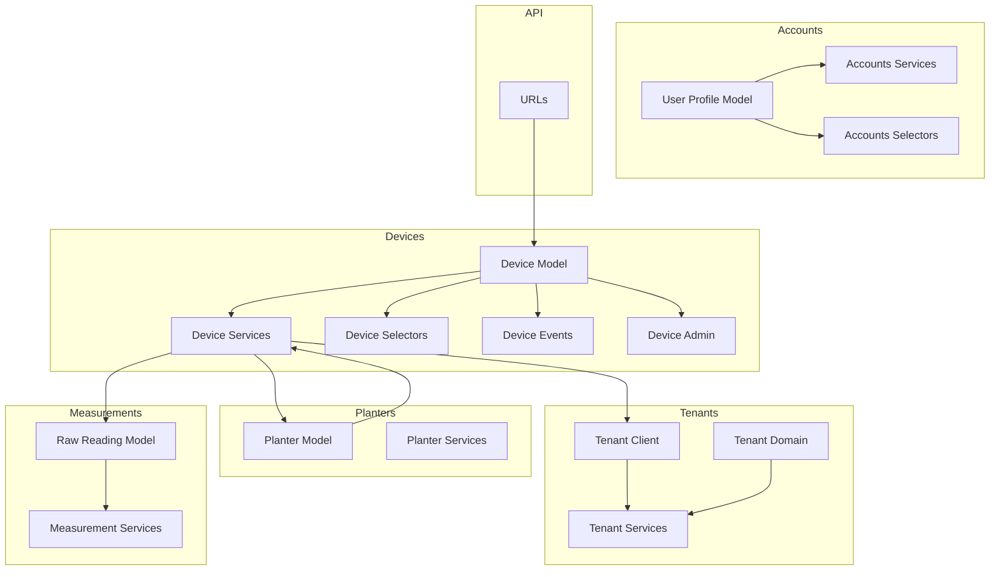

**Diagram sources**
- [urls.py:26-38](file://backend/config/urls.py#L26-L38)
- [models.py:12-29](file://backend/apps/devices/models.py#L12-L29)
- [services.py:1-7](file://backend/apps/devices/services.py#L1-L7)
- [selectors.py:1-7](file://backend/apps/devices/selectors.py#L1-L7)
- [events.py:1-7](file://backend/apps/devices/events.py#L1-L7)
- [admin.py:1-3](file://backend/apps/devices/admin.py#L1-L3)
- [models.py:6-77](file://backend/apps/tenants/models.py#L6-L77)
- [services.py:11-42](file://backend/apps/tenants/services.py#L11-L42)
- [models.py:12-27](file://backend/apps/planters/models.py#L12-L27)
- [services.py:1-7](file://backend/apps/planters/services.py#L1-L7)
- [models.py:15-30](file://backend/apps/accounts/models.py#L15-L30)
- [services.py:1-7](file://backend/apps/accounts/services.py#L1-L7)
- [selectors.py:1-7](file://backend/apps/accounts/selectors.py#L1-L7)
- [models.py:14-30](file://backend/apps/measurements/models.py#L14-L30)
- [services.py:1-9](file://backend/apps/measurements/services.py#L1-L9)

**Section sources**
- [urls.py:26-38](file://backend/config/urls.py#L26-L38)

## Core Components
- Device model: placeholder for IoT device metadata and future fields such as hardware identifiers, firmware version, and connectivity status.
- Device services: write operations for device mutations; all model writes must go through this module.
- Device selectors: read operations for device queries; centralizes read logic for testability.
- Device events: domain events representing significant occurrences in the device domain.
- Tenant models and services: multi-tenant isolation via separate schemas per tenant and domain mapping; tenant creation and deactivation utilities.
- Planter model: placeholder for container definitions and future association with devices.
- Measurement models and services: raw sensor readings are append-only; services encapsulate write operations.
- Account models and services/selectors: user profiles scoped to tenants; services and selectors encapsulate mutations and reads respectively.

**Section sources**
- [models.py:12-29](file://backend/apps/devices/models.py#L12-L29)
- [services.py:1-7](file://backend/apps/devices/services.py#L1-L7)
- [selectors.py:1-7](file://backend/apps/devices/selectors.py#L1-L7)
- [events.py:1-7](file://backend/apps/devices/events.py#L1-L7)
- [models.py:6-77](file://backend/apps/tenants/models.py#L6-L77)
- [services.py:11-42](file://backend/apps/tenants/services.py#L11-L42)
- [models.py:12-27](file://backend/apps/planters/models.py#L12-L27)
- [models.py:14-30](file://backend/apps/measurements/models.py#L14-L30)
- [services.py:1-9](file://backend/apps/measurements/services.py#L1-L9)
- [models.py:15-30](file://backend/apps/accounts/models.py#L15-L30)
- [services.py:1-7](file://backend/apps/accounts/services.py#L1-L7)
- [selectors.py:1-7](file://backend/apps/accounts/selectors.py#L1-L7)

## Architecture Overview
The device lifecycle spans several bounded contexts:
- Provisioning: tenant creation and domain mapping establish the multi-tenant environment.
- Device registration: device creation and association with a planter and tenant.
- Ongoing management: firmware version tracking, connectivity status updates, and raw measurement ingestion.
- Monitoring: status queries via selectors and event-driven notifications.

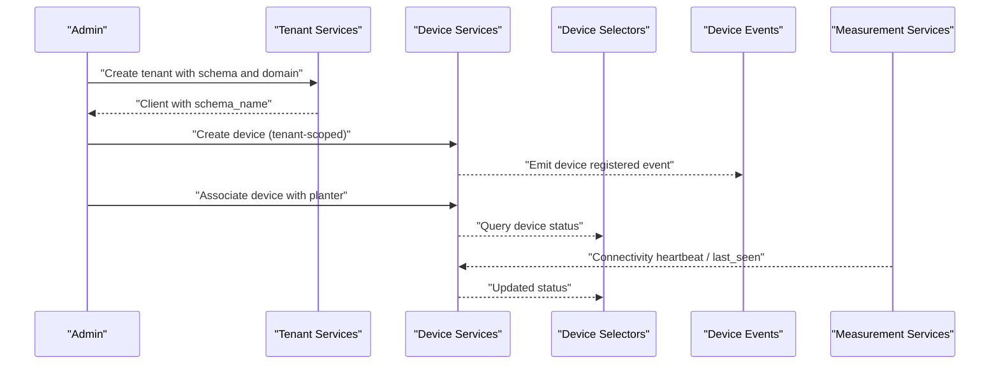

**Diagram sources**
- [services.py:11-42](file://backend/apps/tenants/services.py#L11-L42)
- [services.py:1-7](file://backend/apps/devices/services.py#L1-L7)
- [selectors.py:1-7](file://backend/apps/devices/selectors.py#L1-L7)
- [events.py:1-7](file://backend/apps/devices/events.py#L1-L7)
- [services.py:1-9](file://backend/apps/measurements/services.py#L1-L9)

## Detailed Component Analysis

### Device Model Architecture
The Device model is a placeholder for IoT device metadata and future fields including hardware identifiers, firmware version, and connectivity status. This design enables future extension while maintaining a clean separation of concerns.

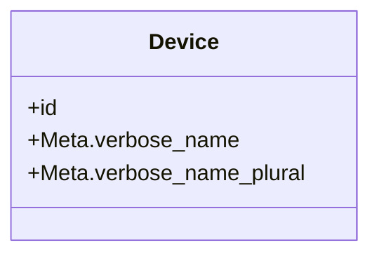

**Diagram sources**
- [models.py:12-29](file://backend/apps/devices/models.py#L12-L29)

**Section sources**
- [models.py:12-29](file://backend/apps/devices/models.py#L12-L29)

### Tenant Association and Multi-Tenancy
Tenant models define client organizations and domain mappings. Tenant services provide creation and deactivation utilities. Device services rely on tenant scoping to isolate device data.

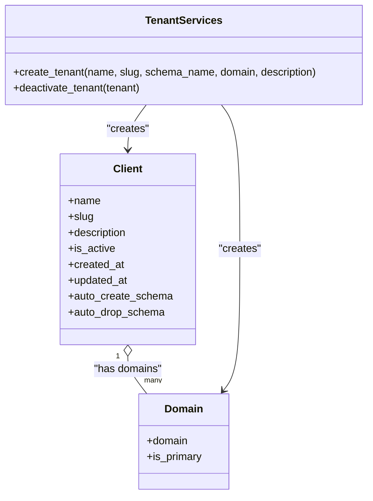

**Diagram sources**
- [models.py:6-77](file://backend/apps/tenants/models.py#L6-L77)
- [services.py:11-42](file://backend/apps/tenants/services.py#L11-L42)

**Section sources**
- [models.py:6-77](file://backend/apps/tenants/models.py#L6-L77)
- [services.py:11-42](file://backend/apps/tenants/services.py#L11-L42)

### Planter Association
The Planter model is a placeholder for container definitions and will include future fields such as location, dimensions, material, current plant, and installed device. Device services will associate devices with planters.

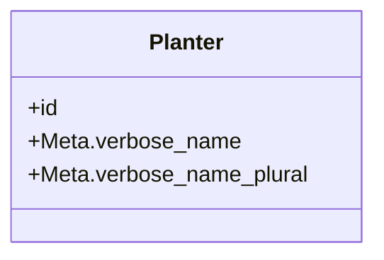

**Diagram sources**
- [models.py:12-27](file://backend/apps/planters/models.py#L12-L27)

**Section sources**
- [models.py:12-27](file://backend/apps/planters/models.py#L12-L27)

### Measurement Ingestion and Append-Only Policy
Raw sensor readings are append-only. Measurement services encapsulate write operations, ensuring no updates or deletions occur after ingestion.

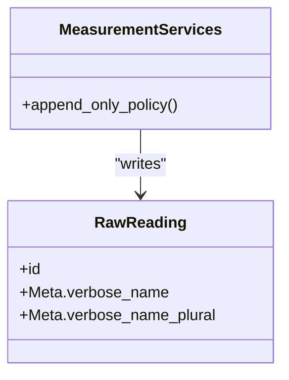

**Diagram sources**
- [models.py:14-30](file://backend/apps/measurements/models.py#L14-L30)
- [services.py:1-9](file://backend/apps/measurements/services.py#L1-L9)

**Section sources**
- [models.py:14-30](file://backend/apps/measurements/models.py#L14-L30)
- [services.py:1-9](file://backend/apps/measurements/services.py#L1-L9)

### Device Lifecycle Workflows

#### Initial Registration Workflow
- Tenant provisioning: create a tenant with a schema and primary domain.
- Device creation: create a device record scoped to the tenant.
- Planter association: associate the device with a planter.
- Event emission: emit a domain event indicating successful registration.

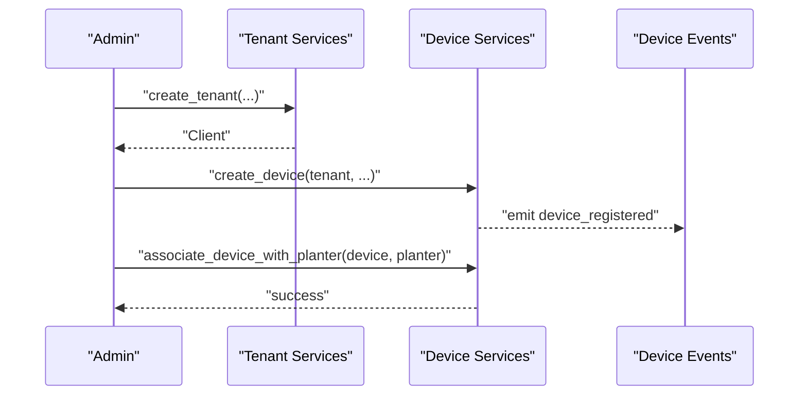

**Diagram sources**
- [services.py:11-42](file://backend/apps/tenants/services.py#L11-L42)
- [services.py:1-7](file://backend/apps/devices/services.py#L1-L7)
- [events.py:1-7](file://backend/apps/devices/events.py#L1-L7)

#### Firmware Update Mechanisms
- Firmware version tracking: device records maintain firmware version for auditing and compliance.
- Update triggers: firmware updates can be initiated via device services and reflected in device status.
- Validation: ensure firmware version adheres to semantic versioning and compatibility rules.

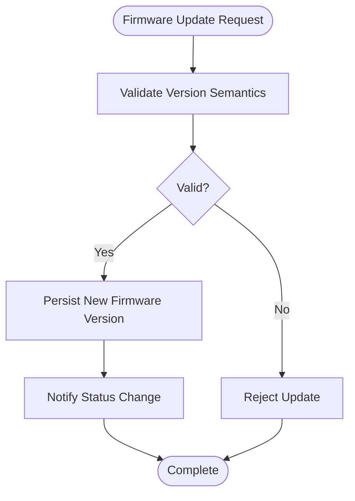

**Diagram sources**
- [models.py:12-29](file://backend/apps/devices/models.py#L12-L29)
- [services.py:1-7](file://backend/apps/devices/services.py#L1-L7)

#### Connectivity Health Checks
- Heartbeat mechanism: raw measurements include timestamps; device services can derive last_seen and connectivity status.
- Status tracking: maintain connectivity_status in device records.
- Alerts: emit domain events for connectivity anomalies.

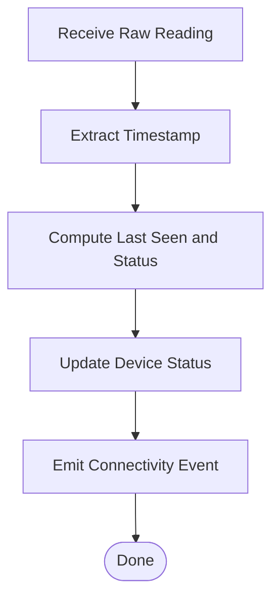

**Diagram sources**
- [models.py:14-30](file://backend/apps/measurements/models.py#L14-L30)
- [services.py:1-9](file://backend/apps/measurements/services.py#L1-L9)
- [models.py:12-29](file://backend/apps/devices/models.py#L12-L29)
- [events.py:1-7](file://backend/apps/devices/events.py#L1-L7)

#### Duplicate Detection and Validation
- Unique constraints: enforce uniqueness on hardware identifiers at the database level.
- Validation rules: validate identifiers, firmware versions, and planter associations.
- Duplicate prevention: pre-check for existing device identifiers before creation.

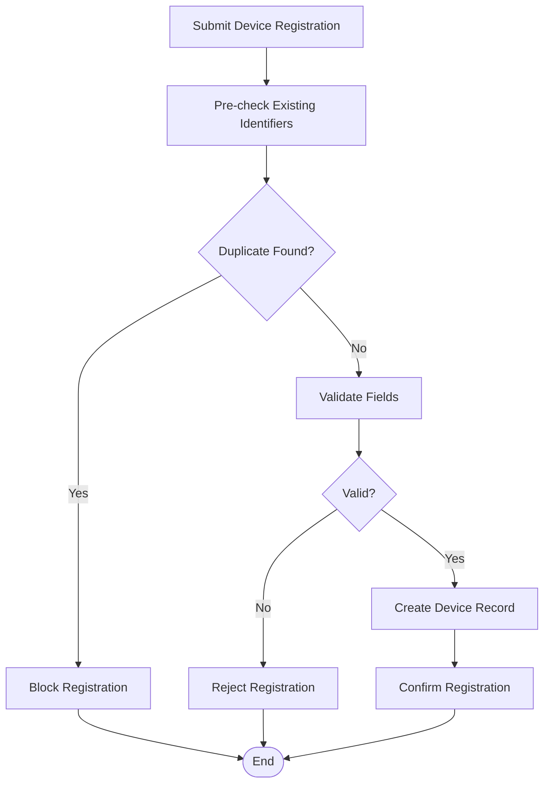

**Diagram sources**
- [models.py:12-29](file://backend/apps/devices/models.py#L12-L29)
- [services.py:1-7](file://backend/apps/devices/services.py#L1-L7)

#### Device Deactivation Procedures
- Soft deactivation: mark tenant inactive via tenant services.
- Device cleanup: device services can flag devices as inactive and stop ingestion.
- Audit trail: keep logs of deactivation actions.

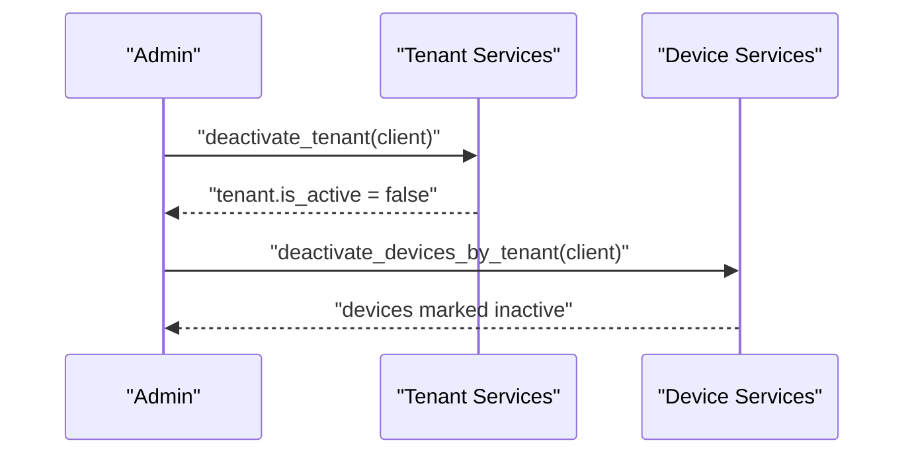

**Diagram sources**
- [services.py:38-42](file://backend/apps/tenants/services.py#L38-L42)
- [services.py:1-7](file://backend/apps/devices/services.py#L1-L7)

### Practical Examples

#### Onboarding APIs
- Tenant onboarding: create a tenant with schema and domain.
- Device onboarding: create a device under the tenant and associate with a planter.
- Status monitoring: query device status via selectors.

Example snippet paths:
- [services.py:11-42](file://backend/apps/tenants/services.py#L11-L42)
- [services.py:1-7](file://backend/apps/devices/services.py#L1-L7)
- [selectors.py:1-7](file://backend/apps/devices/selectors.py#L1-L7)

#### Bulk Device Registration
- Batch creation: submit multiple device registrations with unique identifiers.
- Validation pipeline: pre-validate each device entry.
- Transactional writes: wrap bulk operations in atomic transactions.

Example snippet paths:
- [services.py:1-7](file://backend/apps/devices/services.py#L1-L7)

#### Device Status Monitoring
- Queries: use selectors to fetch device status and last_seen timestamps.
- Filtering: filter by tenant, planter, firmware version, and connectivity status.

Example snippet paths:
- [selectors.py:1-7](file://backend/apps/devices/selectors.py#L1-L7)

## Dependency Analysis
The device management subsystem depends on tenants for multi-tenancy, planters for physical association, and measurements for telemetry ingestion. Services and selectors provide controlled access to models.

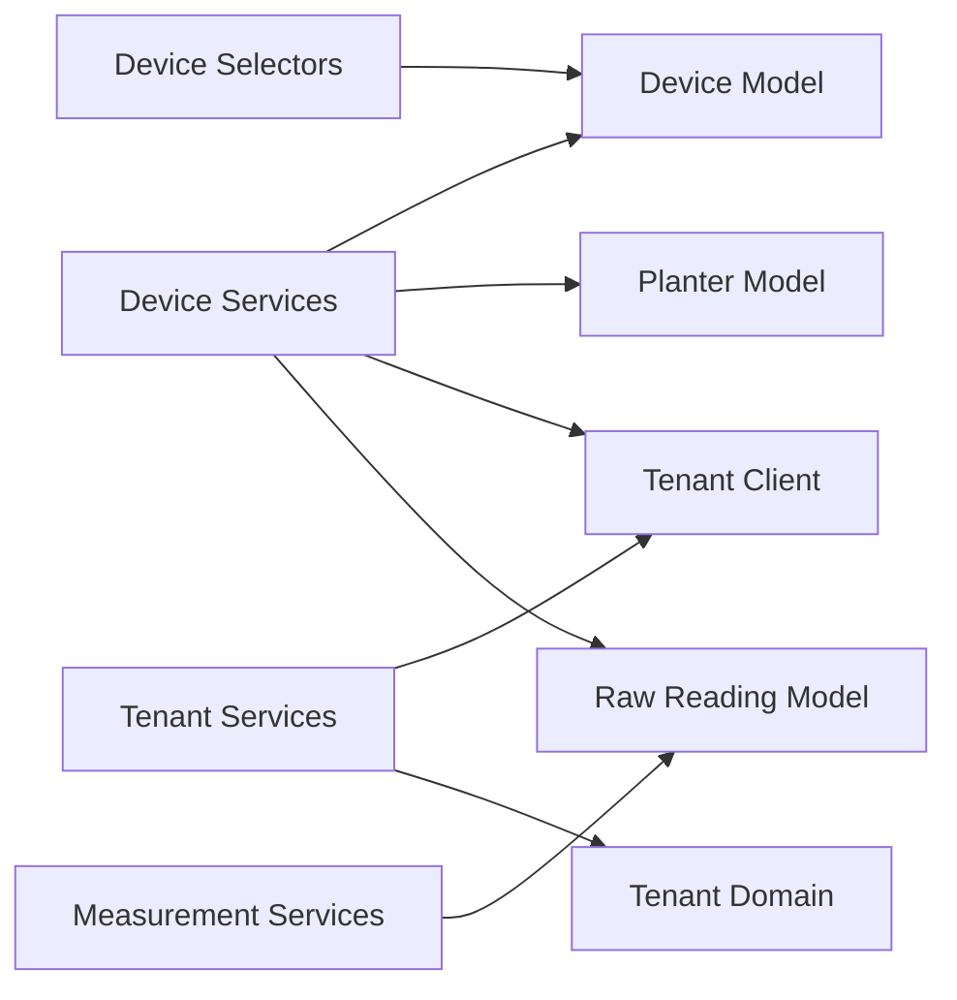

**Diagram sources**
- [services.py:1-7](file://backend/apps/devices/services.py#L1-L7)
- [models.py:12-29](file://backend/apps/devices/models.py#L12-L29)
- [models.py:12-27](file://backend/apps/planters/models.py#L12-L27)
- [models.py:6-77](file://backend/apps/tenants/models.py#L6-L77)
- [services.py:11-42](file://backend/apps/tenants/services.py#L11-L42)
- [models.py:14-30](file://backend/apps/measurements/models.py#L14-L30)
- [services.py:1-9](file://backend/apps/measurements/services.py#L1-L9)

**Section sources**
- [services.py:1-7](file://backend/apps/devices/services.py#L1-L7)
- [models.py:12-29](file://backend/apps/devices/models.py#L12-L29)
- [models.py:12-27](file://backend/apps/planters/models.py#L12-L27)
- [models.py:6-77](file://backend/apps/tenants/models.py#L6-L77)
- [services.py:11-42](file://backend/apps/tenants/services.py#L11-L42)
- [models.py:14-30](file://backend/apps/measurements/models.py#L14-L30)
- [services.py:1-9](file://backend/apps/measurements/services.py#L1-L9)

## Performance Considerations
- Append-only measurements: avoid write amplification by appending raw readings and computing aggregates asynchronously.
- Indexing: add database indexes on frequently queried fields such as device_id, tenant, and last_seen.
- Caching: cache device status for read-heavy workloads.
- Transactions: batch device operations to reduce transaction overhead.

## Troubleshooting Guide
Common issues and resolutions:
- Duplicate device identifiers: ensure uniqueness before creation; use pre-check logic.
- Tenant not found: verify tenant exists and schema is created.
- Firmware version mismatch: validate against supported versions and reject unsupported updates.
- Connectivity gaps: monitor last_seen timestamps and emit connectivity events for anomalies.
- Permission errors: confirm tenant-scoped access and proper user roles.

**Section sources**
- [services.py:1-7](file://backend/apps/devices/services.py#L1-L7)
- [services.py:11-42](file://backend/apps/tenants/services.py#L11-L42)
- [models.py:14-30](file://backend/apps/measurements/models.py#L14-L30)
- [events.py:1-7](file://backend/apps/devices/events.py#L1-L7)

## Conclusion
The device registration and management system is structured around bounded contexts with clear separation of concerns. Multi-tenancy ensures data isolation, while services and selectors provide controlled access to models. The architecture supports device lifecycle management, firmware updates, and connectivity monitoring, with room for future enhancements such as device-specific fields and advanced validation rules.

## Appendices
- API namespace wiring: device APIs are declared in the URL configuration and can be enabled as the apps mature.

**Section sources**
- [urls.py:26-38](file://backend/config/urls.py#L26-L38)