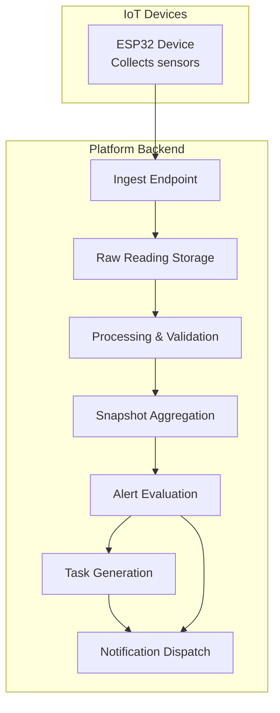
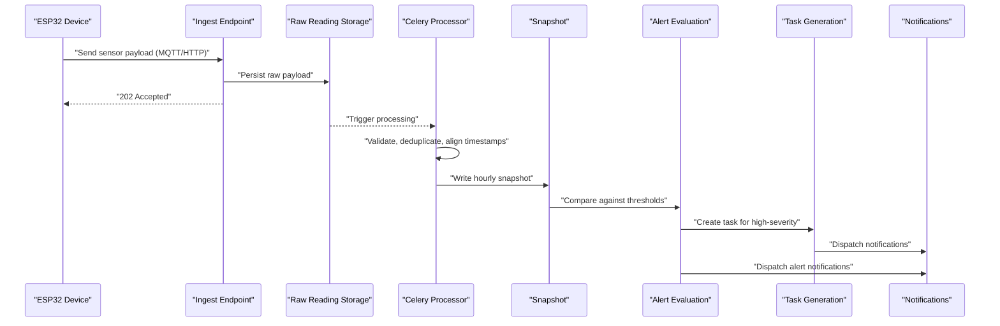
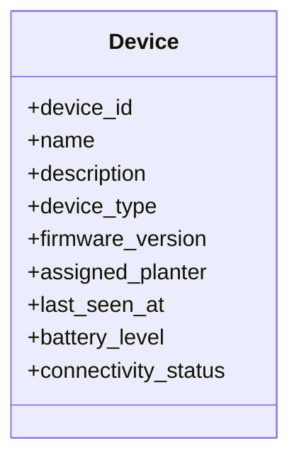
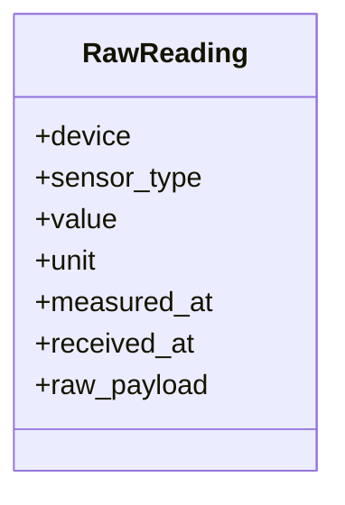
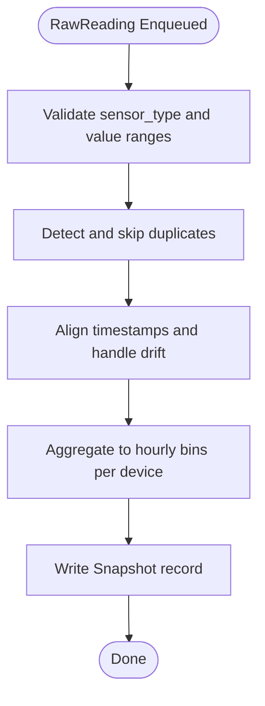
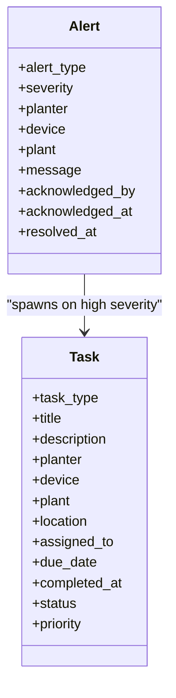
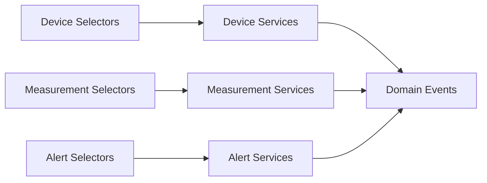
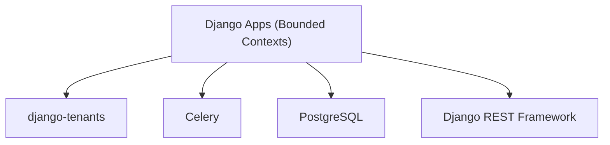

# IoT Data Pipeline

<cite>
**Referenced Files in This Document**
- [IOT_INGEST.md](file://backend/docs/architecture/IOT_INGEST.md)
- [base.py](file://backend/config/settings/base.py)
- [models.py (devices)](file://backend/apps/devices/models.py)
- [services.py (devices)](file://backend/apps/devices/services.py)
- [events.py (devices)](file://backend/apps/devices/events.py)
- [selectors.py (devices)](file://backend/apps/devices/selectors.py)
- [models.py (measurements)](file://backend/apps/measurements/models.py)
- [services.py (measurements)](file://backend/apps/measurements/services.py)
- [events.py (measurements)](file://backend/apps/measurements/events.py)
- [selectors.py (measurements)](file://backend/apps/measurements/selectors.py)
- [models.py (alerts)](file://backend/apps/alerts/models.py)
- [services.py (alerts)](file://backend/apps/alerts/services.py)
- [events.py (alerts)](file://backend/apps/alerts/events.py)
- [selectors.py (alerts)](file://backend/apps/alerts/selectors.py)
- [models.py (tasks)](file://backend/apps/tasks/models.py)
- [models.py (plants)](file://backend/apps/plants/models.py)
</cite>

## Table of Contents
1. [Introduction](#introduction)
2. [Project Structure](#project-structure)
3. [Core Components](#core-components)
4. [Architecture Overview](#architecture-overview)
5. [Detailed Component Analysis](#detailed-component-analysis)
6. [Dependency Analysis](#dependency-analysis)
7. [Performance Considerations](#performance-considerations)
8. [Troubleshooting Guide](#troubleshooting-guide)
9. [Conclusion](#conclusion)
10. [Appendices](#appendices)

## Introduction
This document explains the end-to-end IoT data ingestion and processing pipeline for the PlantOps platform. It covers how raw sensor data from ESP32 devices is accepted, validated, stored, transformed into hourly snapshots, evaluated for alerts, and used to spawn tasks and dispatch notifications. It also documents the device lifecycle, firmware management, connectivity monitoring, and operational principles such as append-only storage, idempotent processing, and event-driven alerting. Practical examples illustrate sensor data ingestion, device provisioning, and real-time monitoring dashboards.

## Project Structure
The backend follows a Domain-Driven Design (DDD) layout with bounded contexts as Django apps. The IoT ingestion pipeline spans several apps:
- devices: device metadata, firmware, connectivity
- measurements: raw sensor readings and processed snapshots
- alerts: alert definitions and instances
- tasks: work items spawned from alerts
- notifications: channels for alert/task notifications
- tenants: multi-tenancy via PostgreSQL schemas
- config: Django settings, Celery, and infrastructure configuration

**Section sources**
- [IOT_INGEST.md:1-88](file://backend/docs/architecture/IOT_INGEST.md#L1-L88)
- [base.py:44-94](file://backend/config/settings/base.py#L44-L94)

## Core Components
- Devices: device identity, type, firmware, connectivity, and assignment to planters.
- Measurements: raw sensor readings and processed snapshots.
- Alerts: alert definitions, severity, and resolution lifecycle.
- Tasks: work items assigned to users based on high-severity alerts.
- Notifications: channels for alert/task communications.
- Tenants: multi-tenant isolation via schemas.

Key principles:
- Devices never write business state; they only append raw readings.
- Raw readings are append-only; processing must be idempotent.
- Alerts are append-only events; resolution is a new event.

**Section sources**
- [IOT_INGEST.md:72-88](file://backend/docs/architecture/IOT_INGEST.md#L72-L88)
- [models.py (devices):12-29](file://backend/apps/devices/models.py#L12-L29)
- [models.py (measurements):14-30](file://backend/apps/measurements/models.py#L14-L30)
- [models.py (alerts):13-29](file://backend/apps/alerts/models.py#L13-L29)
- [models.py (tasks):12-29](file://backend/apps/tasks/models.py#L12-L29)
- [models.py (plants):12-26](file://backend/apps/plants/models.py#L12-L26)

## Architecture Overview
The pipeline stages are:
1. Device collects sensor data and sends payloads via MQTT or HTTP.
2. Ingest endpoint validates credentials and persists raw payload asynchronously.
3. Background processing validates, deduplicates, and handles time drift.
4. Hourly snapshots are produced for dashboards and analytics.
5. Threshold evaluation triggers alerts.
6. High-severity alerts spawn tasks and dispatch notifications.

**Diagram sources**
- [IOT_INGEST.md:5-30](file://backend/docs/architecture/IOT_INGEST.md#L5-L30)

**Section sources**
- [IOT_INGEST.md:32-71](file://backend/docs/architecture/IOT_INGEST.md#L32-L71)

## Detailed Component Analysis

### Device Registration and Firmware Management
- Device identity and metadata are modeled under the devices bounded context.
- Firmware versions and device types are planned fields to support firmware management.
- Connectivity status and last-seen timestamps enable monitoring device health.

**Diagram sources**
- [models.py (devices):12-29](file://backend/apps/devices/models.py#L12-L29)

**Section sources**
- [models.py (devices):12-29](file://backend/apps/devices/models.py#L12-L29)
- [services.py (devices):1-7](file://backend/apps/devices/services.py#L1-L7)
- [events.py (devices):1-7](file://backend/apps/devices/events.py#L1-L7)
- [selectors.py (devices):1-7](file://backend/apps/devices/selectors.py#L1-L7)

### Raw Sensor Data Ingestion and Append-Only Storage
- Raw readings are persisted immediately upon arrival.
- The raw payload is stored for auditability; processing occurs later.
- Append-only principle ensures immutable provenance of sensor events.

**Diagram sources**
- [models.py (measurements):14-30](file://backend/apps/measurements/models.py#L14-L30)

**Section sources**
- [IOT_INGEST.md:39-53](file://backend/docs/architecture/IOT_INGEST.md#L39-L53)
- [models.py (measurements):14-30](file://backend/apps/measurements/models.py#L14-L30)
- [services.py (measurements):1-9](file://backend/apps/measurements/services.py#L1-L9)
- [events.py (measurements):1-7](file://backend/apps/measurements/events.py#L1-L7)
- [selectors.py (measurements):1-7](file://backend/apps/measurements/selectors.py#L1-L7)

### Data Transformation: RawReading to Snapshot
- Background processing validates ranges, deduplicates, and compensates for time drift.
- Hourly snapshots aggregate per device for dashboards and analytics.
- Idempotency guarantees reprocessing does not introduce duplicates.

**Diagram sources**
- [IOT_INGEST.md:50-57](file://backend/docs/architecture/IOT_INGEST.md#L50-L57)

**Section sources**
- [IOT_INGEST.md:50-57](file://backend/docs/architecture/IOT_INGEST.md#L50-L57)

### Alert Generation and Task Spawning
- Threshold evaluation compares snapshot values against plant care profiles.
- Low-probability state changes produce append-only alert events.
- High-severity alerts trigger task creation and notification dispatch.

**Diagram sources**
- [models.py (alerts):13-29](file://backend/apps/alerts/models.py#L13-L29)
- [models.py (tasks):12-29](file://backend/apps/tasks/models.py#L12-L29)

**Section sources**
- [IOT_INGEST.md:59-70](file://backend/docs/architecture/IOT_INGEST.md#L59-L70)
- [models.py (alerts):13-29](file://backend/apps/alerts/models.py#L13-L29)
- [models.py (tasks):12-29](file://backend/apps/tasks/models.py#L12-L29)
- [services.py (alerts):1-9](file://backend/apps/alerts/services.py#L1-L9)
- [events.py (alerts):1-7](file://backend/apps/alerts/events.py#L1-L7)
- [selectors.py (alerts):1-7](file://backend/apps/alerts/selectors.py#L1-L7)

### Event-Driven Architecture and Quality Assurance
- Domain events are lightweight dataclasses representing domain occurrences.
- Services encapsulate all write operations; selectors encapsulate reads.
- Append-only policies and idempotent processing form the backbone of quality assurance.

**Diagram sources**
- [events.py (devices):1-7](file://backend/apps/devices/events.py#L1-L7)
- [events.py (measurements):1-7](file://backend/apps/measurements/events.py#L1-L7)
- [events.py (alerts):1-7](file://backend/apps/alerts/events.py#L1-L7)
- [selectors.py (devices):1-7](file://backend/apps/devices/selectors.py#L1-L7)
- [selectors.py (measurements):1-7](file://backend/apps/measurements/selectors.py#L1-L7)
- [selectors.py (alerts):1-7](file://backend/apps/alerts/selectors.py#L1-L7)
- [services.py (devices):1-7](file://backend/apps/devices/services.py#L1-L7)
- [services.py (measurements):1-9](file://backend/apps/measurements/services.py#L1-L9)
- [services.py (alerts):1-9](file://backend/apps/alerts/services.py#L1-L9)

**Section sources**
- [IOT_INGEST.md:72-88](file://backend/docs/architecture/IOT_INGEST.md#L72-L88)

## Dependency Analysis
The system relies on:
- Multi-tenancy via django-tenants with tenant-aware routing.
- Celery for asynchronous processing and background task scheduling.
- PostgreSQL for durable append-only storage and snapshots.
- REST framework for API exposure and OpenAPI schema generation.

**Diagram sources**
- [base.py:44-94](file://backend/config/settings/base.py#L44-L94)
- [base.py:271-280](file://backend/config/settings/base.py#L271-L280)
- [base.py:155-164](file://backend/config/settings/base.py#L155-L164)
- [base.py:234-250](file://backend/config/settings/base.py#L234-L250)

**Section sources**
- [base.py:44-94](file://backend/config/settings/base.py#L44-L94)
- [base.py:271-280](file://backend/config/settings/base.py#L271-L280)
- [base.py:155-164](file://backend/config/settings/base.py#L155-L164)
- [base.py:234-250](file://backend/config/settings/base.py#L234-L250)

## Performance Considerations
- Use batched ingestion and idempotent processing to handle high-volume streams efficiently.
- Partition snapshots by hour and device to optimize analytics queries.
- Tune Celery concurrency and queues for CPU-bound and I/O-bound tasks.
- Enable database indexing on frequently queried fields (device, measured_at, received_at).
- Employ connection pooling and async workers for the broker and result backend.

[No sources needed since this section provides general guidance]

## Troubleshooting Guide
Common issues and resolutions:
- Duplicate or out-of-range readings: rely on idempotent processing and validation to skip duplicates and reject invalid ranges.
- Missing or delayed snapshots: verify Celery worker availability and task queue throughput.
- Connectivity gaps: monitor device last-seen timestamps and derive offline alerts.
- Audit trail discrepancies: remember raw readings are append-only; inspect raw_payload for provenance.

**Section sources**
- [IOT_INGEST.md:78-88](file://backend/docs/architecture/IOT_INGEST.md#L78-L88)

## Conclusion
The PlantOps IoT pipeline is designed around immutability, idempotence, and event-driven orchestration. By keeping raw data append-only, validating and deduplicating in the background, aggregating to hourly snapshots, and triggering alerts and tasks only on threshold breaches, the system scales reliably for high-volume sensor streams while maintaining data integrity and enabling real-time monitoring.

[No sources needed since this section summarizes without analyzing specific files]

## Appendices

### Practical Examples

- Sensor data ingestion
  - Device sends a JSON payload containing sensor_type, value, unit, and measured_at.
  - Ingest endpoint accepts the payload, validates API key/device token, persists raw reading, and returns 202 Accepted.
  - Example path: [IOT_INGEST.md:39-43](file://backend/docs/architecture/IOT_INGEST.md#L39-L43)

- Device provisioning
  - Register a new device with device_id, firmware_version, and device_type.
  - Assign to a planter and set initial connectivity status.
  - Example path: [models.py (devices):12-29](file://backend/apps/devices/models.py#L12-L29)

- Real-time monitoring dashboards
  - Build hourly snapshots per device for charts and KPIs.
  - Example path: [IOT_INGEST.md:55-57](file://backend/docs/architecture/IOT_INGEST.md#L55-L57)

- Data retention and backups
  - Retain raw readings and snapshots for compliance and diagnostics.
  - Back up tenant schemas regularly; leverage PostgreSQL logical replication for point-in-time recovery.
  - Example path: [IOT_INGEST.md:78-80](file://backend/docs/architecture/IOT_INGEST.md#L78-L80)

- Communication protocols
  - Devices send payloads via MQTT or HTTP POST to the ingest endpoint.
  - Example path: [IOT_INGEST.md:34-37](file://backend/docs/architecture/IOT_INGEST.md#L34-L37)

- Validation and QA
  - Validate sensor_type and value ranges during processing; deduplicate entries; handle time drift.
  - Example path: [IOT_INGEST.md:50-53](file://backend/docs/architecture/IOT_INGEST.md#L50-L53)