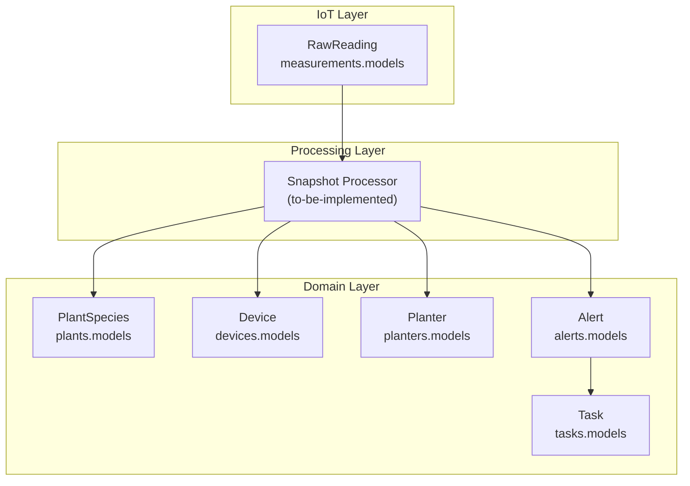
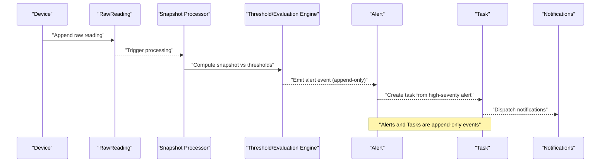
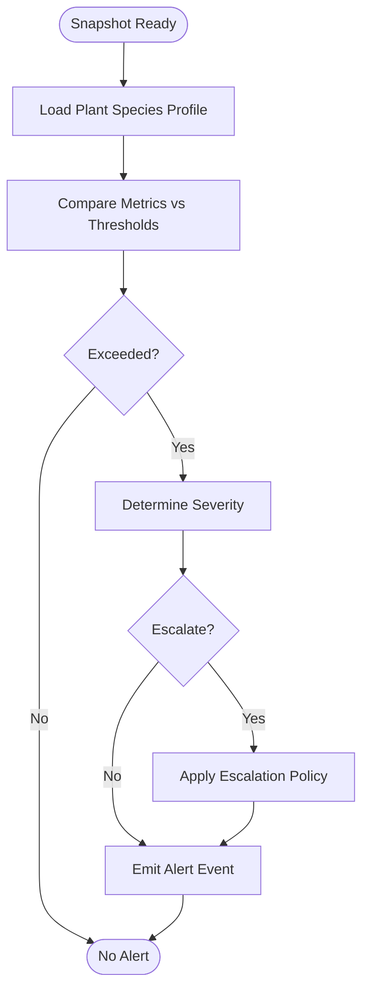
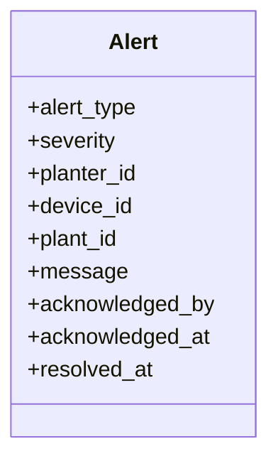
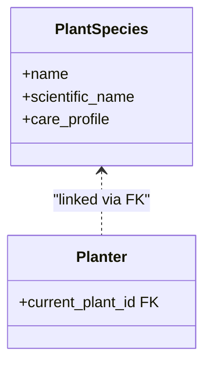
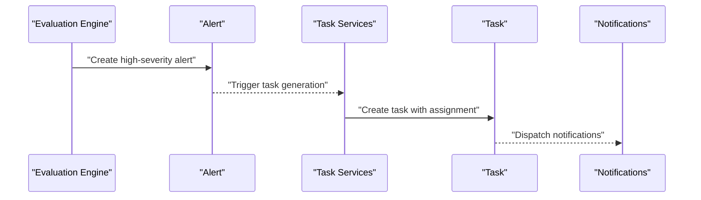
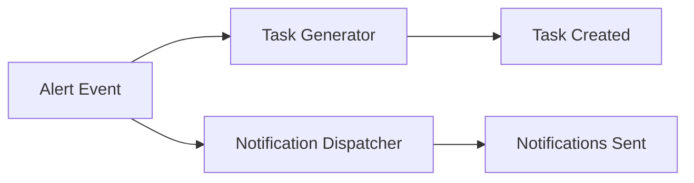
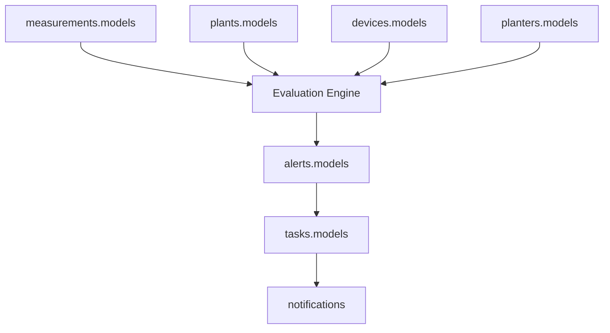

# Real-time Monitoring & Alerts

<cite>
**Referenced Files in This Document**
- [IOT_INGEST.md](file://backend/docs/architecture/IOT_INGEST.md)
- [models.py](file://backend/apps/alerts/models.py)
- [services.py](file://backend/apps/alerts/services.py)
- [selectors.py](file://backend/apps/alerts/selectors.py)
- [events.py](file://backend/apps/alerts/events.py)
- [models.py](file://backend/apps/plants/models.py)
- [models.py](file://backend/apps/devices/models.py)
- [models.py](file://backend/apps/planters/models.py)
- [models.py](file://backend/apps/measurements/models.py)
- [services.py](file://backend/apps/measurements/services.py)
- [selectors.py](file://backend/apps/measurements/selectors.py)
- [services.py](file://backend/apps/plants/services.py)
- [models.py](file://backend/apps/tasks/models.py)
- [services.py](file://backend/apps/tasks/services.py)
</cite>

## Table of Contents
1. [Introduction](#introduction)
2. [Project Structure](#project-structure)
3. [Core Components](#core-components)
4. [Architecture Overview](#architecture-overview)
5. [Detailed Component Analysis](#detailed-component-analysis)
6. [Dependency Analysis](#dependency-analysis)
7. [Performance Considerations](#performance-considerations)
8. [Troubleshooting Guide](#troubleshooting-guide)
9. [Conclusion](#conclusion)
10. [Appendices](#appendices)

## Introduction
This document describes the real-time monitoring and alert generation system. It explains how snapshot data from sensors is evaluated against plant care thresholds and species-specific profiles to produce alerts. It also documents alert severity levels, escalation policies, and resolution tracking, along with the event-driven workflow that generates tasks from high-severity alerts and dispatches notifications. Practical examples illustrate configuration, threshold management, and automated execution. Finally, it covers suppression mechanisms, false positive reduction, and performance tuning for scalable real-time alert processing.

## Project Structure
The system spans several bounded contexts:
- Measurements: ingestion and persistence of raw sensor readings and snapshots.
- Plants: plant species and care profiles used for threshold evaluation.
- Devices and Planters: device and planter metadata linking measurements to physical units.
- Alerts: alert definitions, instances, and thresholds; append-only event log.
- Tasks: work orders generated from alerts; includes assignment and status tracking.
- Notifications: event-driven dispatch of notifications to stakeholders.

**Diagram sources**
- [IOT_INGEST.md:72-88](file://backend/docs/architecture/IOT_INGEST.md#L72-L88)
- [models.py:14-25](file://backend/apps/measurements/models.py#L14-L25)
- [models.py:12-21](file://backend/apps/plants/models.py#L12-L21)
- [models.py:12-24](file://backend/apps/devices/models.py#L12-L24)
- [models.py:12-22](file://backend/apps/planters/models.py#L12-L22)
- [models.py:13-24](file://backend/apps/alerts/models.py#L13-L24)
- [models.py:12-24](file://backend/apps/tasks/models.py#L12-L24)

**Section sources**
- [IOT_INGEST.md:72-88](file://backend/docs/architecture/IOT_INGEST.md#L72-L88)
- [models.py:14-25](file://backend/apps/measurements/models.py#L14-L25)
- [models.py:12-21](file://backend/apps/plants/models.py#L12-L21)
- [models.py:12-24](file://backend/apps/devices/models.py#L12-L24)
- [models.py:12-22](file://backend/apps/planters/models.py#L12-L22)
- [models.py:13-24](file://backend/apps/alerts/models.py#L13-L24)
- [models.py:12-24](file://backend/apps/tasks/models.py#L12-L24)

## Core Components
- Measurement ingestion and immutability:
  - Raw sensor readings are append-only and never updated or deleted.
  - Business decisions are deferred to background processing.
- Threshold evaluation:
  - Snapshot data is compared against plant care thresholds and species-specific profiles.
  - Evaluation results trigger alert events that are append-only.
- Alert lifecycle:
  - Append-only alert events capture alert creation, acknowledgment, and resolution.
  - Severity levels and escalation policies are applied during evaluation.
- Task generation:
  - High-severity alerts automatically spawn tasks with assignment and status tracking.
- Notifications:
  - Event-driven dispatch notifies responsible parties upon alert creation and task assignment.

**Section sources**
- [IOT_INGEST.md:72-88](file://backend/docs/architecture/IOT_INGEST.md#L72-L88)
- [models.py:13-24](file://backend/apps/alerts/models.py#L13-L24)
- [models.py:12-24](file://backend/apps/tasks/models.py#L12-L24)

## Architecture Overview
The system follows an event-driven architecture:
- Devices ingest raw sensor data and append it to the database.
- Background processors transform raw readings into snapshots and evaluate thresholds.
- Alert events are emitted and persisted as append-only records.
- High-severity alerts trigger task creation and notification dispatch.

**Diagram sources**
- [IOT_INGEST.md:72-88](file://backend/docs/architecture/IOT_INGEST.md#L72-L88)
- [models.py:14-25](file://backend/apps/measurements/models.py#L14-L25)
- [models.py:13-24](file://backend/apps/alerts/models.py#L13-L24)
- [models.py:12-24](file://backend/apps/tasks/models.py#L12-L24)

## Detailed Component Analysis

### Alert Evaluation Engine
The evaluation engine compares snapshot data against:
- Plant care thresholds derived from species-specific profiles.
- Device and planter context to localize alerts.
- Historical patterns to reduce false positives.

Processing logic outline:
- Aggregate recent raw readings into a snapshot.
- Retrieve the planter’s plant species and associated care profile.
- Compare snapshot metrics (e.g., soil moisture, temperature) against thresholds.
- Emit an append-only alert event when thresholds are exceeded.
- Apply severity and escalation rules; record acknowledgment and resolution timestamps.

**Diagram sources**
- [IOT_INGEST.md:72-88](file://backend/docs/architecture/IOT_INGEST.md#L72-L88)
- [models.py:12-21](file://backend/apps/plants/models.py#L12-L21)
- [models.py:13-24](file://backend/apps/alerts/models.py#L13-L24)

**Section sources**
- [IOT_INGEST.md:72-88](file://backend/docs/architecture/IOT_INGEST.md#L72-L88)
- [models.py:12-21](file://backend/apps/plants/models.py#L12-L21)
- [models.py:13-24](file://backend/apps/alerts/models.py#L13-L24)

### Alert Model and Lifecycle
The Alert model defines the structure for append-only alert events. It includes fields for alert type, severity, affected resources (planter/device/plant), message, acknowledgment, and resolution timestamps. The services layer enforces write-only operations, and selectors centralize read queries.

**Diagram sources**
- [models.py:13-24](file://backend/apps/alerts/models.py#L13-L24)

**Section sources**
- [models.py:13-24](file://backend/apps/alerts/models.py#L13-L24)
- [services.py:1-8](file://backend/apps/alerts/services.py#L1-L8)
- [selectors.py:1-6](file://backend/apps/alerts/selectors.py#L1-L6)
- [events.py:1-6](file://backend/apps/alerts/events.py#L1-L6)

### Threshold Management and Species Profiles
Thresholds are defined by plant species and care profiles. The PlantSpecies model is designed to store care profile data (e.g., watering, light, temperature ranges). The evaluation engine retrieves the appropriate profile for a given planter’s plant and applies thresholds accordingly.

**Diagram sources**
- [models.py:12-21](file://backend/apps/plants/models.py#L12-L21)
- [models.py:12-22](file://backend/apps/planters/models.py#L12-L22)

**Section sources**
- [models.py:12-21](file://backend/apps/plants/models.py#L12-L21)
- [models.py:12-22](file://backend/apps/planters/models.py#L12-L22)

### Task Generation Workflow
High-severity alerts trigger automatic task creation. The Task model captures task metadata, assignment, due dates, and status. The services layer governs all mutations, ensuring consistent behavior.

**Diagram sources**
- [models.py:13-24](file://backend/apps/alerts/models.py#L13-L24)
- [models.py:12-24](file://backend/apps/tasks/models.py#L12-L24)
- [services.py:1-6](file://backend/apps/tasks/services.py#L1-L6)

**Section sources**
- [models.py:12-24](file://backend/apps/tasks/models.py#L12-L24)
- [services.py:1-6](file://backend/apps/tasks/services.py#L1-L6)

### Event-Driven Architecture: From Alerts to Task Assignment and Notifications
The system uses domain events to drive subsequent actions. Alerts are emitted as immutable events; downstream handlers create tasks and dispatch notifications. This decouples alerting from tasking and notification logic.

**Diagram sources**
- [events.py:1-6](file://backend/apps/alerts/events.py#L1-L6)
- [models.py:13-24](file://backend/apps/alerts/models.py#L13-L24)
- [models.py:12-24](file://backend/apps/tasks/models.py#L12-L24)

**Section sources**
- [events.py:1-6](file://backend/apps/alerts/events.py#L1-L6)

### Practical Examples

- Alert configuration:
  - Define plant species and care profiles in the PlantSpecies model.
  - Assign a plant to a planter to associate thresholds with a physical unit.
  - Reference: [models.py:12-21](file://backend/apps/plants/models.py#L12-L21), [models.py:12-22](file://backend/apps/planters/models.py#L12-L22)

- Threshold management:
  - Store thresholds in the plant care profile and apply them during snapshot evaluation.
  - Reference: [IOT_INGEST.md:72-88](file://backend/docs/architecture/IOT_INGEST.md#L72-L88)

- Automated workflow execution:
  - On high-severity alert emission, create a task and notify the assigned user.
  - Reference: [models.py:12-24](file://backend/apps/tasks/models.py#L12-L24)

**Section sources**
- [models.py:12-21](file://backend/apps/plants/models.py#L12-L21)
- [models.py:12-22](file://backend/apps/planters/models.py#L12-L22)
- [IOT_INGEST.md:72-88](file://backend/docs/architecture/IOT_INGEST.md#L72-L88)
- [models.py:12-24](file://backend/apps/tasks/models.py#L12-L24)

## Dependency Analysis
The bounded contexts interact as follows:
- Measurements produces snapshots consumed by the evaluation engine.
- Plants provides species profiles used for threshold comparison.
- Devices and Planters connect snapshots to physical units.
- Alerts persist immutable alert events.
- Tasks are generated from alerts.
- Notifications consume alert/task events.

**Diagram sources**
- [models.py:14-25](file://backend/apps/measurements/models.py#L14-L25)
- [models.py:12-21](file://backend/apps/plants/models.py#L12-L21)
- [models.py:12-24](file://backend/apps/devices/models.py#L12-L24)
- [models.py:12-22](file://backend/apps/planters/models.py#L12-L22)
- [models.py:13-24](file://backend/apps/alerts/models.py#L13-L24)
- [models.py:12-24](file://backend/apps/tasks/models.py#L12-L24)

**Section sources**
- [models.py:14-25](file://backend/apps/measurements/models.py#L14-L25)
- [models.py:12-21](file://backend/apps/plants/models.py#L12-L21)
- [models.py:12-24](file://backend/apps/devices/models.py#L12-L24)
- [models.py:12-22](file://backend/apps/planters/models.py#L12-L22)
- [models.py:13-24](file://backend/apps/alerts/models.py#L13-L24)
- [models.py:12-24](file://backend/apps/tasks/models.py#L12-L24)

## Performance Considerations
- Idempotent processing:
  - Re-processing the same raw reading must not duplicate alerts or tasks.
  - Reference: [IOT_INGEST.md:72-88](file://backend/docs/architecture/IOT_INGEST.md#L72-L88)
- Append-only immutability:
  - Ensures predictable analytics and auditing; reduces contention on writes.
  - Reference: [IOT_INGEST.md:72-88](file://backend/docs/architecture/IOT_INGEST.md#L72-L88)
- Centralized read/write layers:
  - Services and selectors enforce consistency and testability.
  - References: [services.py:1-8](file://backend/apps/alerts/services.py#L1-L8), [selectors.py:1-6](file://backend/apps/alerts/selectors.py#L1-L6), [services.py:1-8](file://backend/apps/measurements/services.py#L1-L8), [selectors.py:1-6](file://backend/apps/measurements/selectors.py#L1-L6), [services.py:1-6](file://backend/apps/plants/services.py#L1-L6), [services.py:1-6](file://backend/apps/tasks/services.py#L1-L6)
- Batch and streaming:
  - Use batch processing for throughput and streaming for latency-sensitive scenarios.
- Indexing and partitioning:
  - Index on device, planter, and timestamp; consider time-partitioned tables for historical analysis.
- Backpressure and retries:
  - Implement retry with exponential backoff for transient failures; apply circuit breakers for downstream systems.

**Section sources**
- [IOT_INGEST.md:72-88](file://backend/docs/architecture/IOT_INGEST.md#L72-L88)
- [services.py:1-8](file://backend/apps/alerts/services.py#L1-L8)
- [selectors.py:1-6](file://backend/apps/alerts/selectors.py#L1-L6)
- [services.py:1-8](file://backend/apps/measurements/services.py#L1-L8)
- [selectors.py:1-6](file://backend/apps/measurements/selectors.py#L1-L6)
- [services.py:1-6](file://backend/apps/plants/services.py#L1-L6)
- [services.py:1-6](file://backend/apps/tasks/services.py#L1-L6)

## Troubleshooting Guide
- Append-only guarantees:
  - If an alert appears duplicated, verify that reprocessing is idempotent and that duplicate detection is applied at the ingestion boundary.
  - Reference: [IOT_INGEST.md:72-88](file://backend/docs/architecture/IOT_INGEST.md#L72-L88)
- Audit trail:
  - Use append-only alert logs to trace acknowledgment and resolution timestamps.
  - Reference: [models.py:13-24](file://backend/apps/alerts/models.py#L13-L24)
- False positives:
  - Reduce noise by applying hysteresis around thresholds and requiring sustained violations.
- Suppression windows:
  - Temporarily suppress repeated alerts for the same condition within a short time window.
- Task assignment:
  - Confirm that high-severity alerts are correctly mapped to task generation and that assignments are recorded.
  - Reference: [models.py:12-24](file://backend/apps/tasks/models.py#L12-L24)

**Section sources**
- [IOT_INGEST.md:72-88](file://backend/docs/architecture/IOT_INGEST.md#L72-L88)
- [models.py:13-24](file://backend/apps/alerts/models.py#L13-L24)
- [models.py:12-24](file://backend/apps/tasks/models.py#L12-L24)

## Conclusion
The system is designed around immutable events, idempotent processing, and clear separation of concerns across bounded contexts. The alert evaluation engine leverages species-specific profiles and device/planter context to emit reliable, append-only alerts. High-severity alerts automatically spawn tasks and trigger notifications, forming a robust, event-driven pipeline. With careful threshold management, suppression strategies, and performance tuning, the system scales to support real-time monitoring at enterprise scale.

## Appendices

### Alert Severity Levels and Escalation Policies
- Severity levels:
  - Info: informational conditions; no action required.
  - Warning: requires attention; monitor closely.
  - Critical: immediate action required; escalates to task generation.
- Escalation policy:
  - Critical alerts immediately create tasks and notify assigned users.
  - Warning alerts may trigger advisory notifications without task creation.
  - Acknowledgment and resolution timestamps are recorded on alert events.

**Section sources**
- [models.py:13-24](file://backend/apps/alerts/models.py#L13-L24)
- [models.py:12-24](file://backend/apps/tasks/models.py#L12-L24)