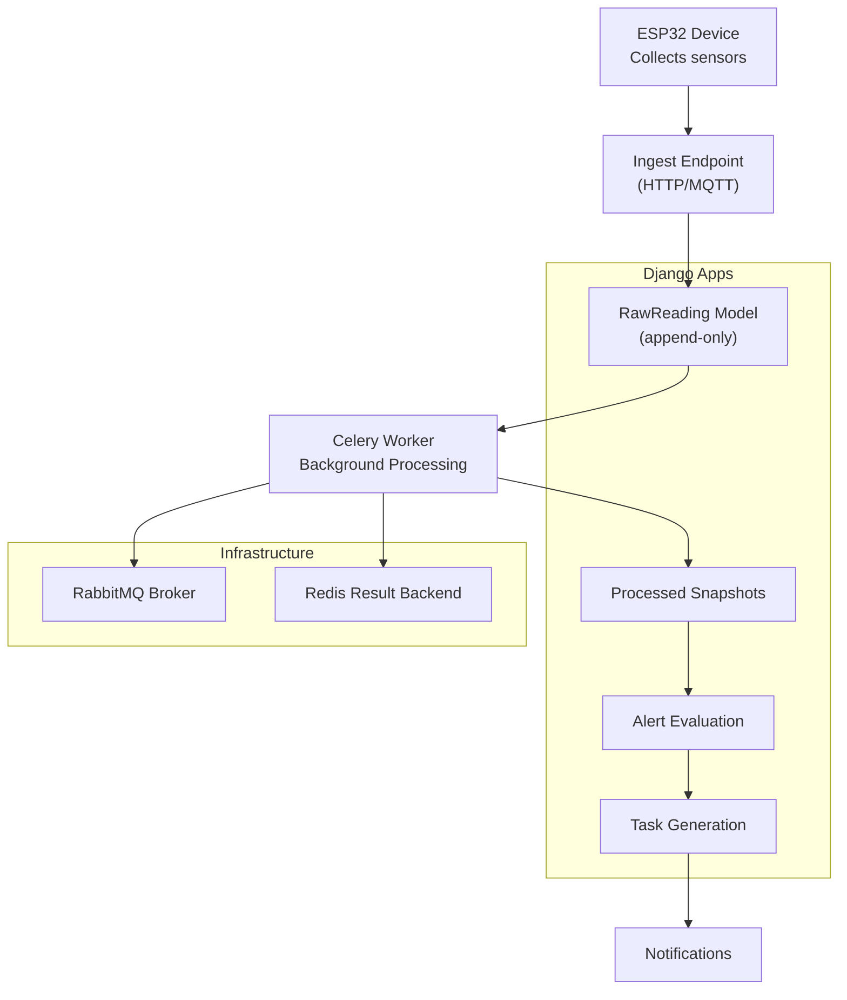
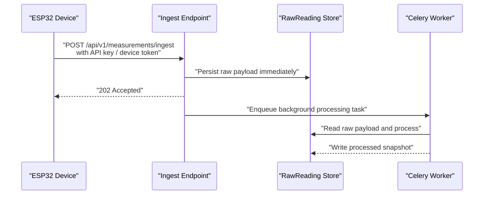
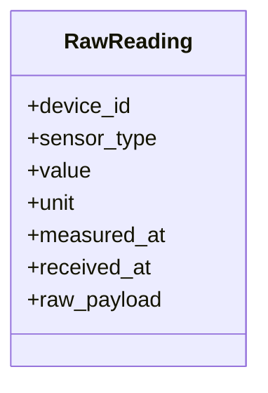
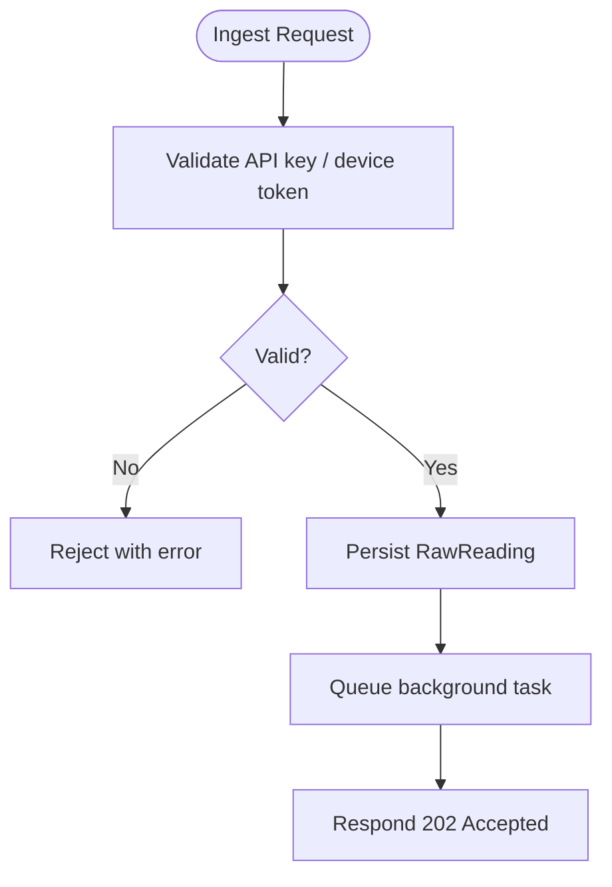
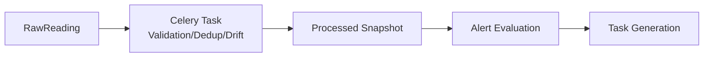
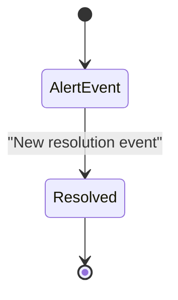
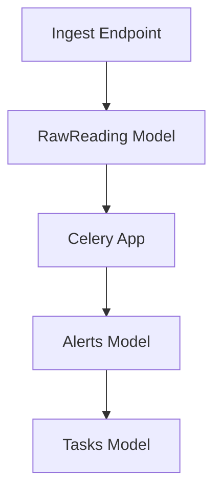

# Sensor Data Ingestion

<cite>
**Referenced Files in This Document**
- [IOT_INGEST.md](file://backend/docs/architecture/IOT_INGEST.md)
- [models.py](file://backend/apps/measurements/models.py)
- [services.py](file://backend/apps/measurements/services.py)
- [urls.py](file://backend/config/urls.py)
- [celery.py](file://backend/config/celery.py)
- [models.py](file://backend/apps/devices/models.py)
- [models.py](file://backend/apps/alerts/models.py)
- [models.py](file://backend/apps/tasks/models.py)
</cite>

## Table of Contents
1. [Introduction](#introduction)
2. [Project Structure](#project-structure)
3. [Core Components](#core-components)
4. [Architecture Overview](#architecture-overview)
5. [Detailed Component Analysis](#detailed-component-analysis)
6. [Dependency Analysis](#dependency-analysis)
7. [Performance Considerations](#performance-considerations)
8. [Troubleshooting Guide](#troubleshooting-guide)
9. [Conclusion](#conclusion)

## Introduction
This document explains the end-to-end sensor data ingestion pipeline for ESP32 devices. It covers how raw telemetry is collected over MQTT or HTTP, validated and persisted immediately, and then asynchronously processed into normalized snapshots. It also documents the append-only data principle for raw readings, the asynchronous response model, and operational guidance for high-volume, low-reliability IoT environments.

## Project Structure
The ingestion pipeline spans documentation, models, services, routing, and background task configuration. The following diagram maps the primary components involved in ingestion and processing.

**Diagram sources**
- [IOT_INGEST.md:5-30](file://backend/docs/architecture/IOT_INGEST.md#L5-L30)
- [models.py:14-29](file://backend/apps/measurements/models.py#L14-L29)
- [celery.py:14-21](file://backend/config/celery.py#L14-L21)

**Section sources**
- [IOT_INGEST.md:1-88](file://backend/docs/architecture/IOT_INGEST.md#L1-L88)
- [urls.py:25-38](file://backend/config/urls.py#L25-L38)

## Core Components
- ESP32 device: collects sensor data and sends payloads via MQTT or HTTP POST. Each device has a unique identifier.
- Ingest endpoint: validates API key/device token, persists raw payload immediately, and returns 202 Accepted to indicate asynchronous processing.
- RawReading model: append-only record of incoming telemetry with fields for device identity, sensor type, value, units, timestamps, and raw payload.
- Celery: background task processing for validation, deduplication, and snapshot generation.
- Downstream stages: alert evaluation, task generation, and notification dispatch.

**Section sources**
- [IOT_INGEST.md:34-48](file://backend/docs/architecture/IOT_INGEST.md#L34-L48)
- [models.py:14-29](file://backend/apps/measurements/models.py#L14-L29)
- [celery.py:14-21](file://backend/config/celery.py#L14-L21)

## Architecture Overview
The ingestion pipeline is designed for reliability and scalability:
- Immediate persistence of raw data prevents data loss during transient failures.
- Asynchronous processing decouples ingestion latency from business logic.
- Append-only semantics ensure auditability and idempotent reprocessing.

**Diagram sources**
- [IOT_INGEST.md:39-53](file://backend/docs/architecture/IOT_INGEST.md#L39-L53)
- [models.py:14-29](file://backend/apps/measurements/models.py#L14-L29)
- [celery.py:14-21](file://backend/config/celery.py#L14-L21)

## Detailed Component Analysis

### RawReading Model and Append-Only Principle
- Purpose: Persist incoming sensor telemetry exactly as sent by devices.
- Append-only rule: No updates or deletions. If invalid, mark it invalid; do not remove.
- Field outline (future): device (foreign key), sensor_type, value, unit, measured_at, received_at, raw_payload.
- Data types: numeric values, ISO timestamps, JSON payload.
- Timestamp handling: measured_at reflects device time; received_at reflects server receipt time.

**Diagram sources**
- [models.py:14-29](file://backend/apps/measurements/models.py#L14-L29)

**Section sources**
- [models.py:14-29](file://backend/apps/measurements/models.py#L14-L29)
- [IOT_INGEST.md:45-48](file://backend/docs/architecture/IOT_INGEST.md#L45-L48)

### Ingest Endpoint and Authentication
- Accepts raw payloads from ESP32 devices over HTTP or MQTT.
- Validates API key and device token before persisting.
- Immediately stores the raw payload and responds with 202 Accepted.
- Routing is configured under the API v1 namespace; device and measurements endpoints are reserved for future wiring.

**Diagram sources**
- [IOT_INGEST.md:39-43](file://backend/docs/architecture/IOT_INGEST.md#L39-L43)
- [urls.py:25-38](file://backend/config/urls.py#L25-L38)

**Section sources**
- [IOT_INGEST.md:39-43](file://backend/docs/architecture/IOT_INGEST.md#L39-L43)
- [urls.py:25-38](file://backend/config/urls.py#L25-L38)

### Background Processing with Celery
- Broker: RabbitMQ; Result Backend: Redis.
- Celery app is configured and autodiscovers tasks from Django apps.
- Background tasks validate, deduplicate, handle time drift, and produce processed snapshots.

**Diagram sources**
- [IOT_INGEST.md:50-69](file://backend/docs/architecture/IOT_INGEST.md#L50-L69)
- [celery.py:14-21](file://backend/config/celery.py#L14-L21)

**Section sources**
- [IOT_INGEST.md:50-69](file://backend/docs/architecture/IOT_INGEST.md#L50-L69)
- [celery.py:14-21](file://backend/config/celery.py#L14-L21)

### Downstream Systems
- Alerts: Append-only events; new resolution is a new event, not an update.
- Tasks: Generated from high-severity alerts; assigned to users.
- Notifications: Dispatched across channels (email, SMS, push, in-app).

**Diagram sources**
- [IOT_INGEST.md:62-66](file://backend/docs/architecture/IOT_INGEST.md#L62-L66)

**Section sources**
- [IOT_INGEST.md:62-66](file://backend/docs/architecture/IOT_INGEST.md#L62-L66)

## Dependency Analysis
- The ingest endpoint depends on the RawReading model for immediate persistence.
- Background processing depends on Celery configuration and infrastructure (RabbitMQ/Redis).
- Downstream systems (alerts, tasks) depend on processed snapshots produced by background tasks.

**Diagram sources**
- [models.py:14-29](file://backend/apps/measurements/models.py#L14-L29)
- [celery.py:14-21](file://backend/config/celery.py#L14-L21)
- [models.py:12-28](file://backend/apps/alerts/models.py#L12-L28)
- [models.py:12-28](file://backend/apps/tasks/models.py#L12-L28)

**Section sources**
- [models.py:14-29](file://backend/apps/measurements/models.py#L14-L29)
- [celery.py:14-21](file://backend/config/celery.py#L14-L21)
- [models.py:12-28](file://backend/apps/alerts/models.py#L12-L28)
- [models.py:12-28](file://backend/apps/tasks/models.py#L12-L28)

## Performance Considerations
- High-volume ingestion: Use batch-friendly payloads and reliable transport (MQTT for streaming, HTTP for request-response). Ensure the broker and result backend can scale.
- Network resilience: Implement exponential backoff and retry on the device side; the server’s 202 Accepted acknowledges receipt and defers heavy work to background tasks.
- Idempotency: Design processors to tolerate duplicate raw readings and deduplicate outputs.
- Monitoring: Track queue depth, task duration, and failure rates; alert on anomalies.

## Troubleshooting Guide
- Device cannot connect or authenticate:
  - Verify API key and device token are present and valid.
  - Confirm ingest endpoint path and namespace are enabled.
- Immediate persistence fails:
  - Check database availability and migrations.
  - Ensure RawReading creation is handled in the services layer.
- Background processing stalls:
  - Inspect Celery worker logs and broker connectivity.
  - Confirm autodiscovery of tasks and correct broker/result backend configuration.
- Data appears inconsistent:
  - Confirm append-only semantics and idempotent processing.
  - Review deduplication and time drift handling logic.

**Section sources**
- [IOT_INGEST.md:72-87](file://backend/docs/architecture/IOT_INGEST.md#L72-L87)
- [services.py:1-9](file://backend/apps/measurements/services.py#L1-L9)
- [celery.py:14-21](file://backend/config/celery.py#L14-L21)

## Conclusion
The ingestion pipeline is built for reliability and scalability: raw telemetry is persisted immediately, processed asynchronously, and transformed into actionable insights. Adhering to append-only principles and idempotent processing ensures correctness under high volume and unreliable networks.