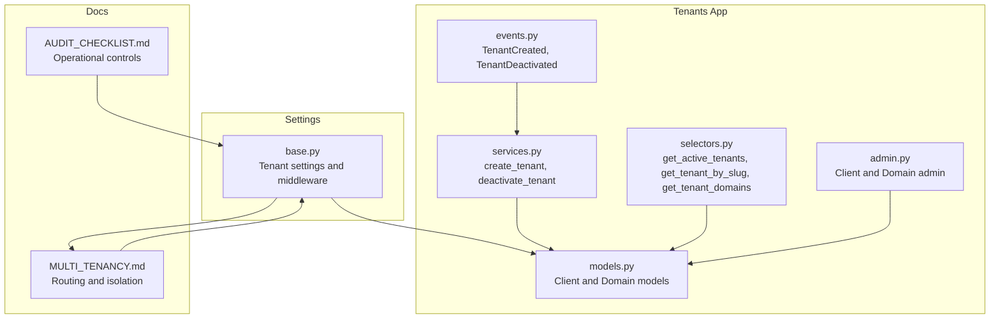
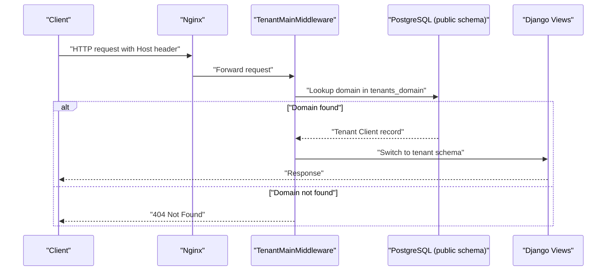
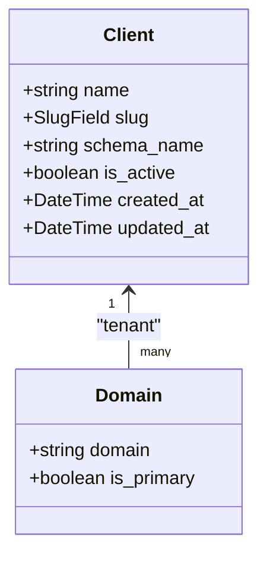
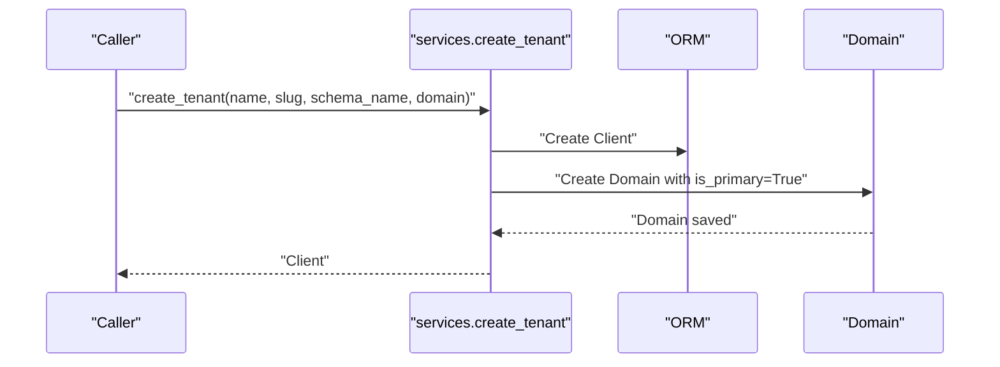
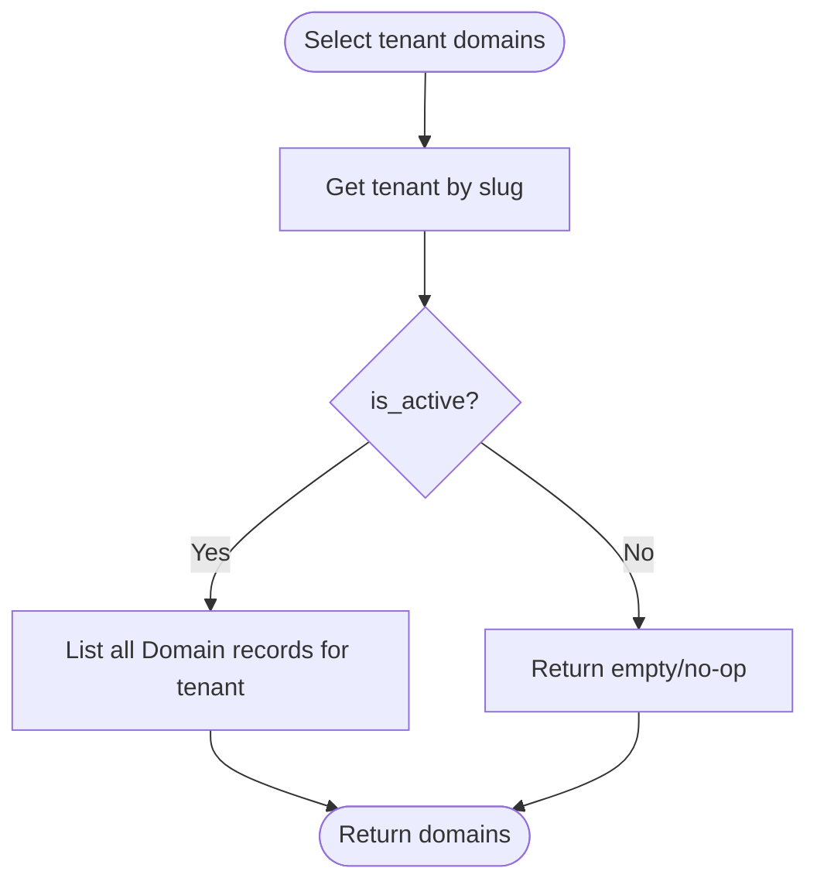
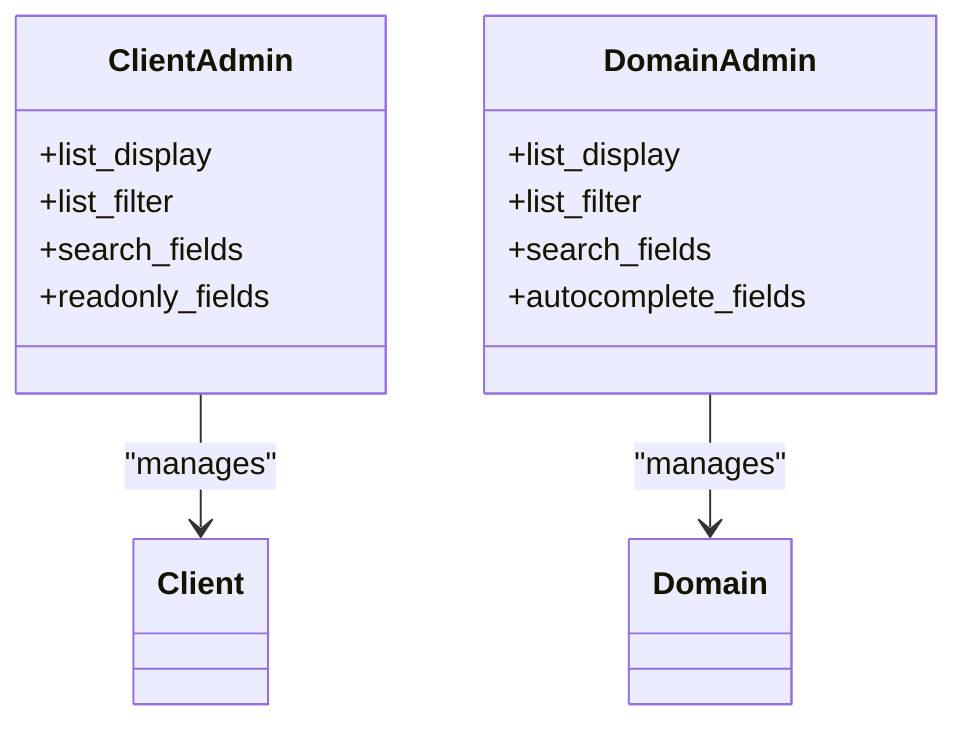
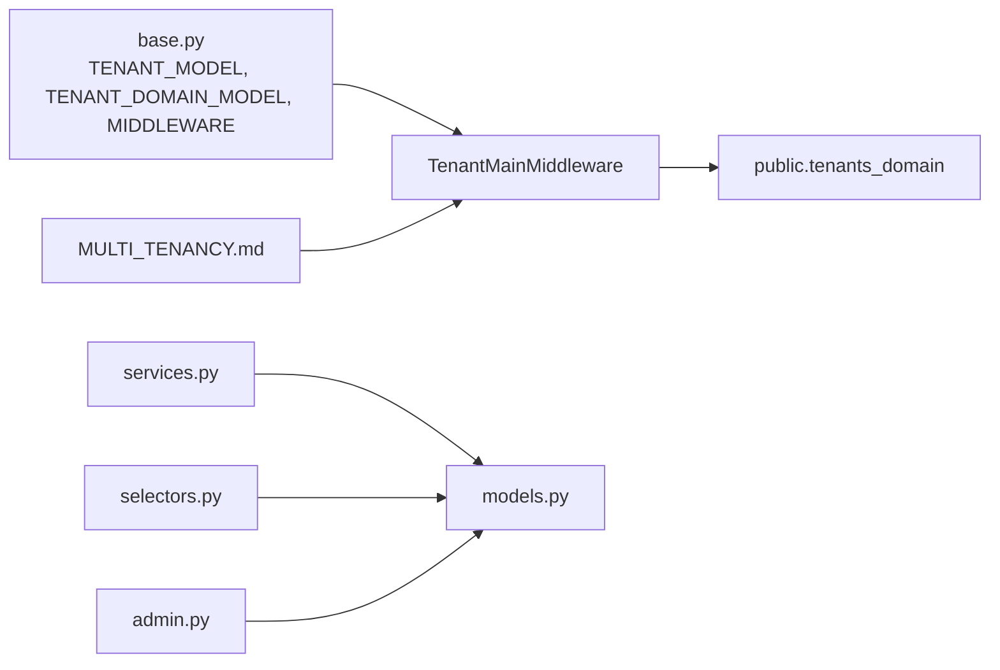

# Domain Management

<cite>
**Referenced Files in This Document**
- [MULTI_TENANCY.md](file://backend/docs/architecture/MULTI_TENANCY.md)
- [base.py](file://backend/config/settings/base.py)
- [models.py](file://backend/apps/tenants/models.py)
- [services.py](file://backend/apps/tenants/services.py)
- [selectors.py](file://backend/apps/tenants/selectors.py)
- [admin.py](file://backend/apps/tenants/admin.py)
- [events.py](file://backend/apps/tenants/events.py)
- [test_tenants.py](file://backend/tests/test_tenants.py)
- [AUDIT_CHECKLIST.md](file://backend/docs/governance/AUDIT_CHECKLIST.md)
</cite>

## Table of Contents
1. [Introduction](#introduction)
2. [Project Structure](#project-structure)
3. [Core Components](#core-components)
4. [Architecture Overview](#architecture-overview)
5. [Detailed Component Analysis](#detailed-component-analysis)
6. [Dependency Analysis](#dependency-analysis)
7. [Performance Considerations](#performance-considerations)
8. [Troubleshooting Guide](#troubleshooting-guide)
9. [Conclusion](#conclusion)
10. [Appendices](#appendices)

## Introduction
This document explains domain management in the multi-tenant architecture. It covers the Domain model and its relationship with the tenant Client record, how domains are registered and validated, how they map to tenants, and how domains are used for request routing. It also provides practical examples for adding/removing domains, domain validation rules, conflict handling, best practices, DNS configuration requirements, troubleshooting resolution issues, and the relationship between domains and tenant activation status.

## Project Structure
Domain management spans a small set of focused modules:
- Models define the Client (tenant) and Domain entities and their fields.
- Services encapsulate tenant provisioning and lifecycle operations.
- Selectors provide read-only access patterns for tenant/domain queries.
- Admin exposes CRUD interfaces for managing tenants and domains.
- Settings configure django-tenants and middleware for domain-based routing.
- Architecture and governance documents describe routing behavior and operational controls.

**Diagram sources**
- [base.py:99-119](file://backend/config/settings/base.py#L99-L119)
- [models.py:6-76](file://backend/apps/tenants/models.py#L6-L76)
- [services.py:11-41](file://backend/apps/tenants/services.py#L11-L41)
- [selectors.py:13-25](file://backend/apps/tenants/selectors.py#L13-L25)
- [admin.py:7-24](file://backend/apps/tenants/admin.py#L7-L24)
- [events.py:19-35](file://backend/apps/tenants/events.py#L19-L35)
- [MULTI_TENANCY.md:12-26](file://backend/docs/architecture/MULTI_TENANCY.md#L12-L26)
- [AUDIT_CHECKLIST.md:7-11](file://backend/docs/governance/AUDIT_CHECKLIST.md#L7-L11)

**Section sources**
- [MULTI_TENANCY.md:12-26](file://backend/docs/architecture/MULTI_TENANCY.md#L12-L26)
- [base.py:99-119](file://backend/config/settings/base.py#L99-L119)

## Core Components
- Client (tenant): Represents a single customer with attributes such as name, slug, schema_name, and activation flag. It inherits tenant capabilities from the framework’s tenant mixin.
- Domain: Maps a fully-qualified hostname to a tenant and tracks whether it is the primary domain for URL generation.

Key behaviors:
- Domain is_primary indicates the preferred domain for generating absolute URLs.
- Tenant is_active controls inclusion in routing and background job processing.
- Creation of a tenant automatically creates a primary domain.

**Section sources**
- [models.py:6-53](file://backend/apps/tenants/models.py#L6-L53)
- [models.py:56-76](file://backend/apps/tenants/models.py#L56-L76)
- [services.py:11-35](file://backend/apps/tenants/services.py#L11-L35)

## Architecture Overview
Domain-based routing is enforced by middleware that inspects the incoming request’s Host header and switches the database schema accordingly.

**Diagram sources**
- [MULTI_TENANCY.md:14-19](file://backend/docs/architecture/MULTI_TENANCY.md#L14-L19)
- [base.py:107-108](file://backend/config/settings/base.py#L107-L108)

**Section sources**
- [MULTI_TENANCY.md:12-26](file://backend/docs/architecture/MULTI_TENANCY.md#L12-L26)
- [base.py:99-119](file://backend/config/settings/base.py#L99-L119)

## Detailed Component Analysis

### Domain Model and Relationships
The Domain model extends the framework’s domain mixin and links to the Client tenant. It stores the fully-qualified hostname and a flag indicating whether it is the primary domain.

**Diagram sources**
- [models.py:6-53](file://backend/apps/tenants/models.py#L6-L53)
- [models.py:56-76](file://backend/apps/tenants/models.py#L56-L76)

**Section sources**
- [models.py:6-76](file://backend/apps/tenants/models.py#L6-L76)

### Tenant Provisioning and Domain Association
Creating a tenant through the services layer ensures a primary domain is established immediately.

**Diagram sources**
- [services.py:11-35](file://backend/apps/tenants/services.py#L11-L35)
- [models.py:56-76](file://backend/apps/tenants/models.py#L56-L76)

**Section sources**
- [services.py:11-35](file://backend/apps/tenants/services.py#L11-L35)
- [test_tenants.py:19-36](file://backend/tests/test_tenants.py#L19-L36)

### Domain Retrieval and Tenant Activation
Selectors provide read-only access to tenants and their domains, filtering inactive tenants out of routing-relevant queries.

**Diagram sources**
- [selectors.py:13-25](file://backend/apps/tenants/selectors.py#L13-L25)
- [models.py:56-76](file://backend/apps/tenants/models.py#L56-L76)

**Section sources**
- [selectors.py:13-25](file://backend/apps/tenants/selectors.py#L13-L25)

### Administrative Management
The admin interface supports listing, filtering, and associating domains with tenants.

**Diagram sources**
- [admin.py:7-24](file://backend/apps/tenants/admin.py#L7-L24)
- [models.py:6-53](file://backend/apps/tenants/models.py#L6-L53)
- [models.py:56-76](file://backend/apps/tenants/models.py#L56-L76)

**Section sources**
- [admin.py:7-24](file://backend/apps/tenants/admin.py#L7-L24)

### Domain Validation Rules and Conflict Handling
- Fully-qualified hostname: Domains are stored as complete hostnames (for example, a subdomain under a private or public suffix).
- Primary domain semantics: There is a single primary domain per tenant used for absolute URL generation.
- Activation gating: Only active tenants are considered for routing; inactive tenants are excluded from routing and background processing.
- Conflict handling: The current implementation does not define explicit validation or uniqueness constraints for the domain field in the models. Conflicts (duplicate domains) are not prevented at the model level. If duplicates are introduced, routing behavior depends on the order of lookup and database constraints. To prevent conflicts, introduce a unique constraint at the database level for the domain field and handle duplicate errors gracefully in services.

Practical steps:
- Add a unique constraint on the domain field in the Domain model.
- In services, catch integrity errors when creating domains and return appropriate validation messages.
- Enforce domain format validation (fully-qualified hostname) before saving.

**Section sources**
- [models.py:56-76](file://backend/apps/tenants/models.py#L56-L76)
- [services.py:11-35](file://backend/apps/tenants/services.py#L11-L35)

### Practical Examples

- Adding a domain to an existing tenant:
  - Use the services layer to create a Domain linked to the tenant.
  - Ensure is_primary is set appropriately (only one primary per tenant).
  - Example path: [services.py:11-35](file://backend/apps/tenants/services.py#L11-L35)

- Removing a domain:
  - Delete the Domain record via admin or a dedicated service.
  - Ensure a primary domain remains for the tenant to avoid routing ambiguity.
  - Example path: [models.py:56-76](file://backend/apps/tenants/models.py#L56-L76)

- Soft-deactivating a tenant:
  - Set is_active=False on the Client; inactive tenants are excluded from routing.
  - Example path: [services.py:38-41](file://backend/apps/tenants/services.py#L38-L41)

- Verifying tenant activation and domain retrieval:
  - Use selectors to filter active tenants and list their domains.
  - Example path: [selectors.py:13-25](file://backend/apps/tenants/selectors.py#L13-L25)

**Section sources**
- [services.py:11-41](file://backend/apps/tenants/services.py#L11-L41)
- [selectors.py:13-25](file://backend/apps/tenants/selectors.py#L13-L25)
- [models.py:56-76](file://backend/apps/tenants/models.py#L56-L76)

### Relationship Between Domains and Tenant Activation Status
- Routing: Only active tenants are eligible for domain-based routing. Inactive tenants are excluded from middleware resolution.
- Background jobs: Cross-tenant queries are prohibited; background tasks must explicitly enter the tenant context using the tenant’s Client record.
- Fail-closed isolation: Requests for unknown domains receive a 404 response.

**Section sources**
- [MULTI_TENANCY.md:21-26](file://backend/docs/architecture/MULTI_TENANCY.md#L21-L26)
- [selectors.py:13-20](file://backend/apps/tenants/selectors.py#L13-L20)
- [services.py:38-41](file://backend/apps/tenants/services.py#L38-L41)

## Dependency Analysis
Domain management depends on:
- Settings for tenant model configuration and middleware ordering.
- Models for persistence and relationships.
- Services for controlled creation and lifecycle changes.
- Selectors for read-only queries.
- Admin for manual management.
- Architecture docs for routing behavior.

**Diagram sources**
- [base.py:99-119](file://backend/config/settings/base.py#L99-L119)
- [models.py:6-76](file://backend/apps/tenants/models.py#L6-L76)
- [services.py:11-41](file://backend/apps/tenants/services.py#L11-L41)
- [selectors.py:13-25](file://backend/apps/tenants/selectors.py#L13-L25)
- [admin.py:7-24](file://backend/apps/tenants/admin.py#L7-L24)
- [MULTI_TENANCY.md:12-26](file://backend/docs/architecture/MULTI_TENANCY.md#L12-L26)

**Section sources**
- [base.py:99-119](file://backend/config/settings/base.py#L99-L119)
- [models.py:6-76](file://backend/apps/tenants/models.py#L6-L76)
- [services.py:11-41](file://backend/apps/tenants/services.py#L11-L41)
- [selectors.py:13-25](file://backend/apps/tenants/selectors.py#L13-L25)
- [admin.py:7-24](file://backend/apps/tenants/admin.py#L7-L24)
- [MULTI_TENANCY.md:12-26](file://backend/docs/architecture/MULTI_TENANCY.md#L12-L26)

## Performance Considerations
- Keep domain lookups efficient by indexing the domain field in the tenants_domain table.
- Limit the number of domains per tenant to reduce routing ambiguity and query overhead.
- Use selectors for read-heavy operations to centralize filtering and caching strategies.
- Avoid frequent schema switching in views; rely on middleware for tenant resolution.

## Troubleshooting Guide
Common issues and resolutions:
- Request returns 404:
  - Verify the requested Host header matches a domain in tenants_domain.
  - Confirm the tenant is active; inactive tenants are not routed.
  - Check middleware ordering and tenant router configuration.
  - Reference: [MULTI_TENANCY.md:14-19](file://backend/docs/architecture/MULTI_TENANCY.md#L14-L19), [base.py:107-108](file://backend/config/settings/base.py#L107-L108)

- Duplicate domains cause unexpected routing:
  - Add a unique constraint on the domain field and handle integrity errors in services.
  - Ensure only one primary domain exists per tenant.
  - Reference: [models.py:56-76](file://backend/apps/tenants/models.py#L56-L76), [services.py:11-35](file://backend/apps/tenants/services.py#L11-L35)

- Tenant not appearing in routing:
  - Confirm is_active=True on the Client.
  - Verify the tenant schema exists and migrations are applied.
  - Reference: [selectors.py:13-20](file://backend/apps/tenants/selectors.py#L13-L20)

- Operational compliance:
  - Ensure TenantMainMiddleware is first in MIDDLEWARE and TenantSyncRouter is configured.
  - Reference: [AUDIT_CHECKLIST.md:7-11](file://backend/docs/governance/AUDIT_CHECKLIST.md#L7-L11), [base.py:102](file://backend/config/settings/base.py#L102)

**Section sources**
- [MULTI_TENANCY.md:14-19](file://backend/docs/architecture/MULTI_TENANCY.md#L14-L19)
- [base.py:102-108](file://backend/config/settings/base.py#L102-L108)
- [models.py:56-76](file://backend/apps/tenants/models.py#L56-L76)
- [services.py:11-35](file://backend/apps/tenants/services.py#L11-L35)
- [selectors.py:13-20](file://backend/apps/tenants/selectors.py#L13-L20)
- [AUDIT_CHECKLIST.md:7-11](file://backend/docs/governance/AUDIT_CHECKLIST.md#L7-L11)

## Conclusion
Domain management in this multi-tenant system centers on the Client and Domain models, with strict routing enforced by middleware and fail-closed isolation. Provisioning and lifecycle operations are centralized in services, while read access is standardized via selectors. Operational controls and architecture guidelines ensure secure, predictable tenant isolation. To maintain reliability, add domain uniqueness constraints, validate domain formats, and keep tenant activation status accurate.

## Appendices

### Best Practices
- Always provision tenants through services to ensure a primary domain is created.
- Keep only one primary domain per tenant; update is_primary carefully.
- Validate domain format before saving to prevent malformed hostnames.
- Add unique constraints on domain to prevent conflicts.
- Use selectors for all tenant/domain queries to enforce active-tenant filtering.
- Monitor middleware ordering and tenant router configuration.

### DNS Configuration Requirements
- Point the target domain to the load balancer or reverse proxy (Nginx) that forwards requests to the Django application.
- Ensure the Host header sent by clients matches the domain stored in tenants_domain.
- For development, configure local DNS or hosts entries to resolve the domain to the application endpoint.

### Governance and Security Notes
- Middleware must be first in the chain and TenantSyncRouter must be enabled.
- Background jobs must explicitly enter tenant context using the tenant’s Client record.
- No cross-tenant queries in views; all writes must go through services, all reads through selectors.

**Section sources**
- [AUDIT_CHECKLIST.md:7-11](file://backend/docs/governance/AUDIT_CHECKLIST.md#L7-L11)
- [base.py:102-108](file://backend/config/settings/base.py#L102-L108)
- [services.py:11-41](file://backend/apps/tenants/services.py#L11-L41)
- [selectors.py:13-25](file://backend/apps/tenants/selectors.py#L13-L25)