# Multi-Tenant Architecture

<cite>
**Referenced Files in This Document**
- [MULTI_TENANCY.md](file://backend/docs/architecture/MULTI_TENANCY.md)
- [base.py](file://backend/config/settings/base.py)
- [models.py](file://backend/apps/tenants/models.py)
- [services.py](file://backend/apps/tenants/services.py)
- [selectors.py](file://backend/apps/tenants/selectors.py)
- [events.py](file://backend/apps/tenants/events.py)
- [admin.py](file://backend/apps/tenants/admin.py)
- [urls.py](file://backend/config/urls.py)
- [celery.py](file://backend/config/celery.py)
- [test_tenants.py](file://backend/tests/test_tenants.py)
- [accounts/models.py](file://backend/apps/accounts/models.py)
- [plants/models.py](file://backend/apps/plants/models.py)
</cite>

## Table of Contents
1. [Introduction](#introduction)
2. [Project Structure](#project-structure)
3. [Core Components](#core-components)
4. [Architecture Overview](#architecture-overview)
5. [Detailed Component Analysis](#detailed-component-analysis)
6. [Dependency Analysis](#dependency-analysis)
7. [Performance Considerations](#performance-considerations)
8. [Troubleshooting Guide](#troubleshooting-guide)
9. [Conclusion](#conclusion)
10. [Appendices](#appendices)

## Introduction
This document explains PlantOps’ multi-tenant architecture built on PostgreSQL schemas and the django-tenants library. It covers tenant isolation, routing, schema management, provisioning workflows, domain handling, and operational guidelines for migrations, background jobs, and tenant lifecycle management. It also outlines data segregation, cross-tenant communication restrictions, and security considerations.

## Project Structure
The multi-tenancy implementation centers around:
- Shared schema (public): tenant registry and routing metadata
- Tenant-specific schemas: per-tenant data isolated by schema
- django-tenants configuration and middleware for automatic tenant resolution
- Dedicated tenant services and selectors for safe read/write operations
- Celery integration for background jobs operating within tenant context

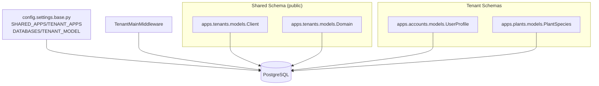

**Diagram sources**
- [base.py:44-102](file://backend/config/settings/base.py#L44-L102)
- [models.py:6-76](file://backend/apps/tenants/models.py#L6-L76)
- [accounts/models.py:15-30](file://backend/apps/accounts/models.py#L15-L30)
- [plants/models.py:12-26](file://backend/apps/plants/models.py#L12-L26)

**Section sources**
- [base.py:44-102](file://backend/config/settings/base.py#L44-L102)
- [MULTI_TENANCY.md:1-76](file://backend/docs/architecture/MULTI_TENANCY.md#L1-L76)

## Core Components
- Tenant registry and routing:
  - Client model defines tenant identity and schema name
  - Domain model maps hostnames to tenants
  - TenantMainMiddleware resolves tenant from Host header and switches schema
- Provisioning and lifecycle:
  - Services encapsulate tenant creation and deactivation
  - Selectors centralize tenant queries
  - Events represent domain actions for eventual consistency
- Shared vs tenant apps:
  - SHARED_APPS live in public schema (includes tenants app)
  - TENANT_APPS replicate into each tenant schema
- Database configuration:
  - django_tenants backend and TenantSyncRouter
  - Single logical database with per-schema isolation

**Section sources**
- [models.py:6-76](file://backend/apps/tenants/models.py#L6-L76)
- [services.py:11-41](file://backend/apps/tenants/services.py#L11-L41)
- [selectors.py:13-25](file://backend/apps/tenants/selectors.py#L13-L25)
- [events.py:19-35](file://backend/apps/tenants/events.py#L19-L35)
- [base.py:44-102](file://backend/config/settings/base.py#L44-L102)
- [MULTI_TENANCY.md:12-27](file://backend/docs/architecture/MULTI_TENANCY.md#L12-L27)

## Architecture Overview
The system routes incoming requests by hostname, resolves the tenant, and ensures all database operations occur within the tenant’s schema. Access to the public schema is restricted to designated shared apps and admin.

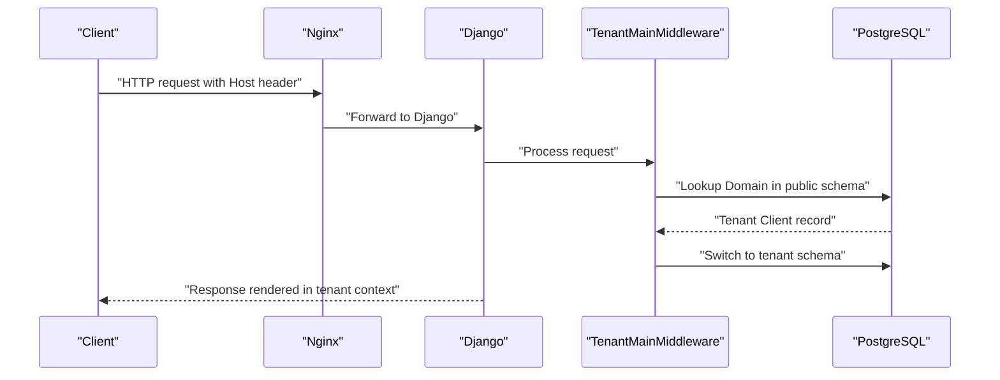

**Diagram sources**
- [MULTI_TENANCY.md:12-19](file://backend/docs/architecture/MULTI_TENANCY.md#L12-L19)
- [base.py:107-119](file://backend/config/settings/base.py#L107-L119)
- [models.py:56-76](file://backend/apps/tenants/models.py#L56-L76)

## Detailed Component Analysis

### Tenant Registry and Routing
- Client (tenant) model:
  - Holds tenant identity, slug, schema_name, and active flag
  - Enables automatic schema creation and drop via django-tenants flags
- Domain model:
  - Maps fully qualified hostnames to a tenant
  - Tracks primary domain for URL generation
- Middleware and router:
  - TenantMainMiddleware inspects Host header and switches schema
  - TenantSyncRouter ensures shared and tenant apps are routed appropriately

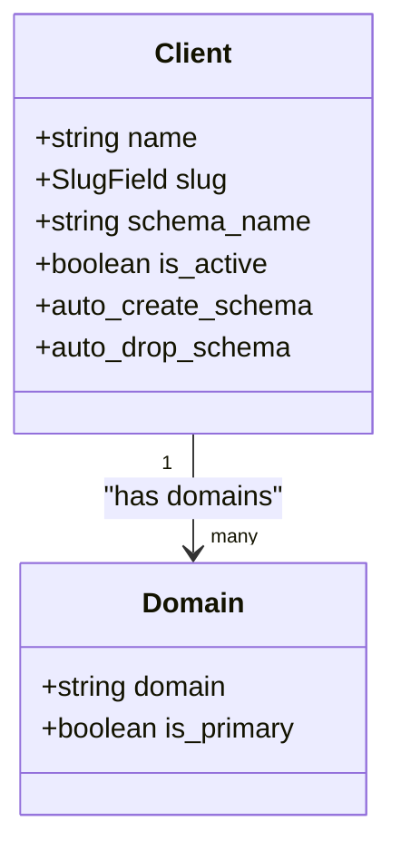

**Diagram sources**
- [models.py:6-76](file://backend/apps/tenants/models.py#L6-L76)

**Section sources**
- [models.py:6-76](file://backend/apps/tenants/models.py#L6-L76)
- [base.py:99-102](file://backend/config/settings/base.py#L99-L102)
- [MULTI_TENANCY.md:12-19](file://backend/docs/architecture/MULTI_TENANCY.md#L12-L19)

### Provisioning Workflow
- Create tenant:
  - Use the services layer to create a Client and its primary Domain
  - django-tenants automatically creates the tenant schema
- Deactivate tenant:
  - Soft deactivate via services; inactive tenants are excluded from routing and background jobs

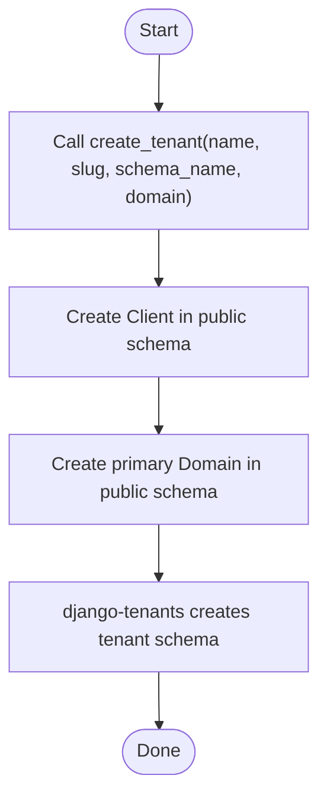

**Diagram sources**
- [services.py:11-35](file://backend/apps/tenants/services.py#L11-L35)
- [models.py:43-45](file://backend/apps/tenants/models.py#L43-L45)

**Section sources**
- [services.py:11-35](file://backend/apps/tenants/services.py#L11-L35)
- [test_tenants.py:19-36](file://backend/tests/test_tenants.py#L19-L36)

### Tenant Lifecycle Management
- Creation: services layer only
- Activation/Deactivation: controlled via is_active flag
- Deletion: automatic schema drop via django-tenants flags

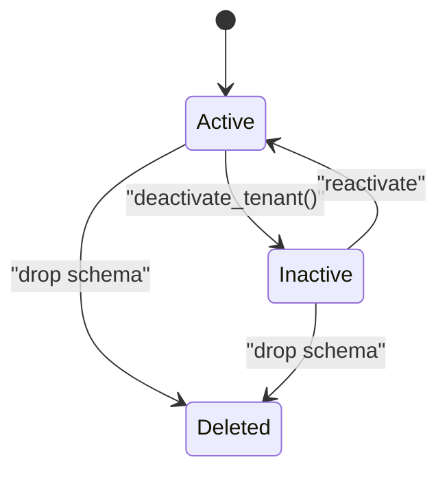

**Diagram sources**
- [services.py:38-41](file://backend/apps/tenants/services.py#L38-L41)
- [models.py:29-33](file://backend/apps/tenants/models.py#L29-L33)
- [models.py:44-45](file://backend/apps/tenants/models.py#L44-L45)

**Section sources**
- [services.py:38-41](file://backend/apps/tenants/services.py#L38-L41)
- [models.py:29-33](file://backend/apps/tenants/models.py#L29-L33)
- [models.py:44-45](file://backend/apps/tenants/models.py#L44-L45)

### Shared Schema vs Tenant Schemas
- Shared apps (public schema):
  - django-tenants, Django core, DRF, tenants app
- Tenant apps (replicated into each tenant schema):
  - All bounded contexts (accounts, locations, planters, plants, devices, measurements, alerts, tasks, notifications, billing, audit)

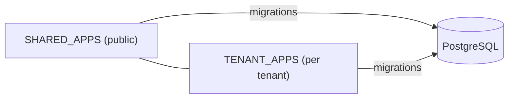

**Diagram sources**
- [base.py:44-94](file://backend/config/settings/base.py#L44-L94)

**Section sources**
- [base.py:44-94](file://backend/config/settings/base.py#L44-L94)
- [MULTI_TENANCY.md:28-40](file://backend/docs/architecture/MULTI_TENANCY.md#L28-L40)

### Tenant Data Access Patterns and API Surface
- Tenant-specific models live in tenant schemas; access is implicit within tenant context
- Public schema holds tenant registry and routing metadata
- API URLs are currently stubbed; tenant-aware endpoints will be mounted under api/v1 namespaces

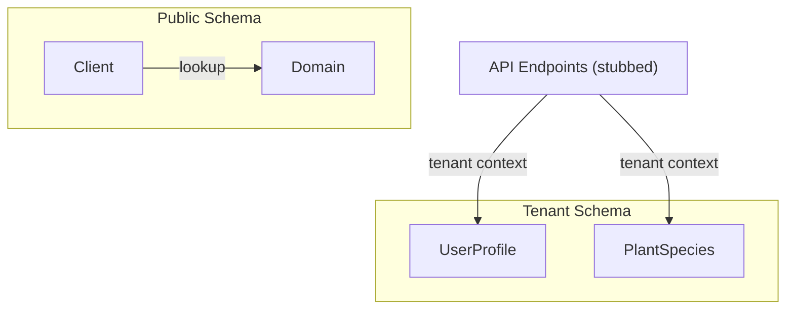

**Diagram sources**
- [accounts/models.py:15-30](file://backend/apps/accounts/models.py#L15-L30)
- [plants/models.py:12-26](file://backend/apps/plants/models.py#L12-L26)
- [urls.py:28-37](file://backend/config/urls.py#L28-L37)

**Section sources**
- [accounts/models.py:15-30](file://backend/apps/accounts/models.py#L15-L30)
- [plants/models.py:12-26](file://backend/apps/plants/models.py#L12-L26)
- [urls.py:28-37](file://backend/config/urls.py#L28-L37)

### Cross-Tenant Communication and Security
- Cross-tenant queries are explicitly prohibited in views
- Background jobs must explicitly enter tenant context using tenant_context
- Fail-closed isolation: requests without a resolved tenant are rejected
- Public schema access is restricted to shared apps and admin

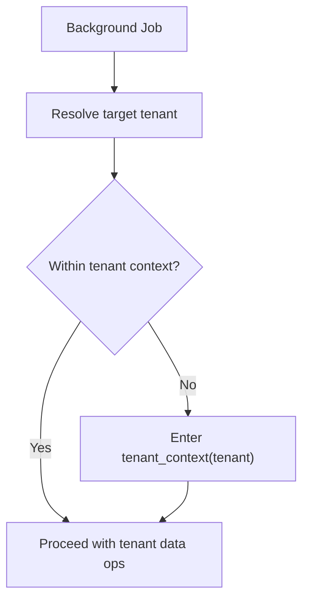

**Diagram sources**
- [MULTI_TENANCY.md:21-27](file://backend/docs/architecture/MULTI_TENANCY.md#L21-L27)
- [MULTI_TENANCY.md:63-75](file://backend/docs/architecture/MULTI_TENANCY.md#L63-L75)

**Section sources**
- [MULTI_TENANCY.md:21-27](file://backend/docs/architecture/MULTI_TENANCY.md#L21-L27)
- [MULTI_TENANCY.md:63-75](file://backend/docs/architecture/MULTI_TENANCY.md#L63-L75)

### Migrations and Schema Evolution
- Run migrations for shared and tenant schemas separately
- Both schema sets evolve together; tenant apps are replicated per tenant

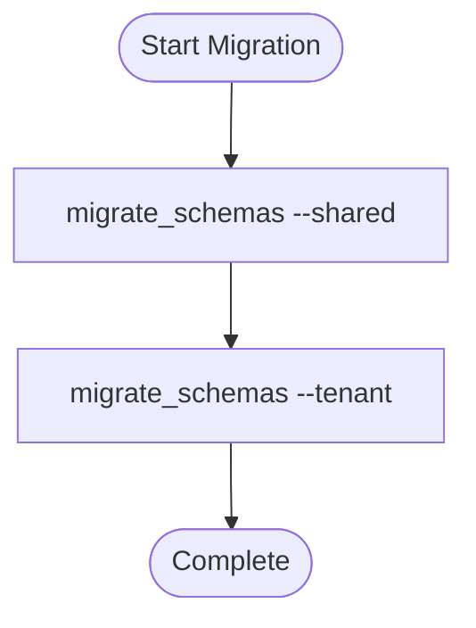

**Diagram sources**
- [MULTI_TENANCY.md:54-61](file://backend/docs/architecture/MULTI_TENANCY.md#L54-L61)

**Section sources**
- [MULTI_TENANCY.md:54-61](file://backend/docs/architecture/MULTI_TENANCY.md#L54-L61)

### Background Jobs and Celery
- Celery tasks that touch tenant data must explicitly enter tenant context
- Broker and backend configured in Celery settings

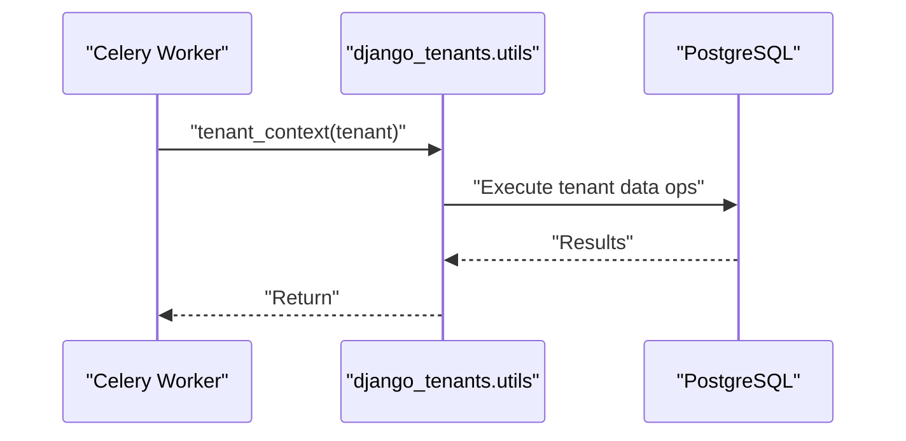

**Diagram sources**
- [MULTI_TENANCY.md:63-75](file://backend/docs/architecture/MULTI_TENANCY.md#L63-L75)
- [celery.py:12-21](file://backend/config/celery.py#L12-L21)

**Section sources**
- [MULTI_TENANCY.md:63-75](file://backend/docs/architecture/MULTI_TENANCY.md#L63-L75)
- [celery.py:12-21](file://backend/config/celery.py#L12-L21)

## Dependency Analysis
- Settings define SHARED_APPS and TENANT_APPS, DATABASES, TENANT_MODEL, TENANT_DOMAIN_MODEL, and middleware stack
- Middleware depends on public schema tables for routing
- Tenant apps depend on tenant schemas for data isolation

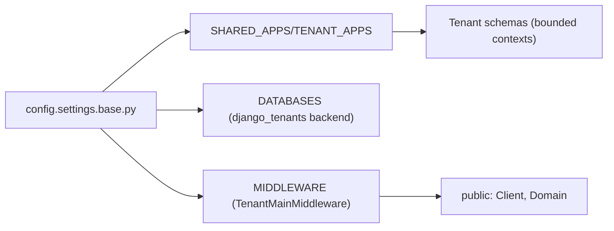

**Diagram sources**
- [base.py:44-102](file://backend/config/settings/base.py#L44-L102)

**Section sources**
- [base.py:44-102](file://backend/config/settings/base.py#L44-L102)

## Performance Considerations
- Schema-per-tenant reduces contention and simplifies per-tenant scaling
- Keep shared schema minimal to reduce cross-tenant overhead
- Use tenant_context in background jobs to avoid repeated routing overhead
- Monitor per-tenant query patterns and consider indexing strategies per bounded context
- Plan migrations during maintenance windows to minimize downtime

## Troubleshooting Guide
- Tenant not found:
  - Verify Domain exists in public schema for the requested Host
  - Confirm TENANT_DOMAIN_MODEL and TENANT_MODEL are set correctly
- Cross-tenant access errors:
  - Ensure views do not bypass tenant context
  - Use tenant_context in background jobs
- Migration failures:
  - Run shared migrations first, then tenant migrations
- Admin access:
  - Use admin interface to inspect Client and Domain records

**Section sources**
- [base.py:99-102](file://backend/config/settings/base.py#L99-L102)
- [models.py:56-76](file://backend/apps/tenants/models.py#L56-L76)
- [MULTI_TENANCY.md:54-61](file://backend/docs/architecture/MULTI_TENANCY.md#L54-L61)
- [admin.py:7-24](file://backend/apps/tenants/admin.py#L7-L24)

## Conclusion
PlantOps employs a robust, fail-closed, schema-based multi-tenancy strategy using django-tenants. Tenant routing is automatic via Host header and public schema metadata, while tenant data remains isolated in dedicated schemas. Centralized services and selectors enforce safe provisioning and querying, and explicit tenant_context usage protects background jobs. Adhering to these patterns ensures secure, scalable, and maintainable multi-tenant operations.

## Appendices

### Practical Examples Index
- Provisioning a tenant: [services.py:11-35](file://backend/apps/tenants/services.py#L11-L35)
- Deactivating a tenant: [services.py:38-41](file://backend/apps/tenants/services.py#L38-L41)
- Resolving tenant by slug: [selectors.py:18-20](file://backend/apps/tenants/selectors.py#L18-L20)
- Tenant context in background jobs: [MULTI_TENANCY.md:63-75](file://backend/docs/architecture/MULTI_TENANCY.md#L63-L75)
- Tenant routing flow: [MULTI_TENANCY.md:12-19](file://backend/docs/architecture/MULTI_TENANCY.md#L12-L19)