# Schema Isolation & Routing

<cite>
**Referenced Files in This Document**
- [MULTI_TENANCY.md](file://backend/docs/architecture/MULTI_TENANCY.md)
- [models.py](file://backend/apps/tenants/models.py)
- [services.py](file://backend/apps/tenants/services.py)
- [selectors.py](file://backend/apps/tenants/selectors.py)
- [events.py](file://backend/apps/tenants/events.py)
- [base.py](file://backend/config/settings/base.py)
- [local.py](file://backend/config/settings/local.py)
- [production.py](file://backend/config/settings/production.py)
- [urls.py](file://backend/config/urls.py)
- [wsgi.py](file://backend/config/wsgi.py)
- [asgi.py](file://backend/config/asgi.py)
- [nginx.conf](file://infra/nginx/nginx.conf)
- [pyproject.toml](file://backend/pyproject.toml)
- [test_tenants.py](file://backend/tests/test_tenants.py)
- [conftest.py](file://backend/tests/conftest.py)
</cite>

## Table of Contents
1. [Introduction](#introduction)
2. [Project Structure](#project-structure)
3. [Core Components](#core-components)
4. [Architecture Overview](#architecture-overview)
5. [Detailed Component Analysis](#detailed-component-analysis)
6. [Dependency Analysis](#dependency-analysis)
7. [Performance Considerations](#performance-considerations)
8. [Troubleshooting Guide](#troubleshooting-guide)
9. [Conclusion](#conclusion)

## Introduction
This document explains how PlantOps achieves tenant isolation using PostgreSQL schemas and how incoming requests are routed to the correct tenant schema. It covers the fail-closed isolation principle, the role of django-tenants in providing physical schema separation, the TenantMainMiddleware implementation and domain-to-schema resolution, and the differences between SHARED_APPS and TENANT_APPS. It also documents the end-to-end routing flow from Nginx through middleware to schema switching, along with database connection behavior, cross-tenant query restrictions, and security best practices.

## Project Structure
The tenant isolation and routing implementation spans several layers:
- Configuration defines SHARED_APPS/TENANT_APPS, middleware stack, and database router.
- The tenants app models define the tenant and domain entities and provides services for provisioning.
- The architecture documentation describes the schema layout, routing steps, and fail-closed policy.
- Nginx proxies requests to the Django backend.
- Tests validate tenant creation and deactivation flows.

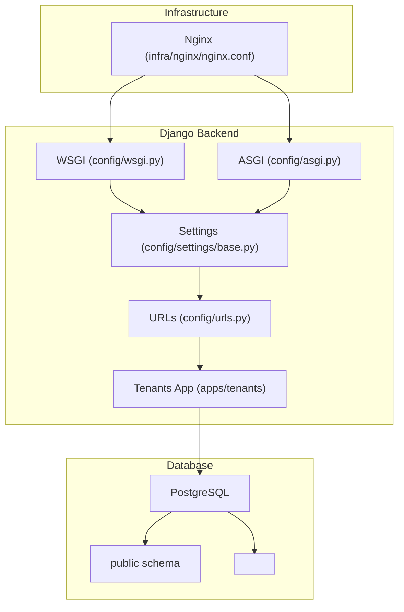

**Diagram sources**
- [nginx.conf:1-54](file://infra/nginx/nginx.conf#L1-L54)
- [wsgi.py:1-14](file://backend/config/wsgi.py#L1-L14)
- [asgi.py:1-14](file://backend/config/asgi.py#L1-L14)
- [base.py:1-336](file://backend/config/settings/base.py#L1-L336)
- [urls.py:1-49](file://backend/config/urls.py#L1-L49)
- [models.py:1-77](file://backend/apps/tenants/models.py#L1-L77)

**Section sources**
- [base.py:41-119](file://backend/config/settings/base.py#L41-L119)
- [urls.py:1-49](file://backend/config/urls.py#L1-L49)
- [nginx.conf:1-54](file://infra/nginx/nginx.conf#L1-L54)

## Core Components
- Tenant model and domain mapping: The tenants app defines the tenant entity and domain mapping. Each tenant corresponds to a PostgreSQL schema, and domains resolve to tenants.
- Services layer: Centralized write operations for tenant provisioning and lifecycle management.
- Settings: Defines SHARED_APPS and TENANT_APPS, middleware stack, database router, and tenant model identifiers.
- Architecture docs: Describe fail-closed isolation, schema layout, and routing steps.
- Nginx: Forwards requests to the backend and preserves protocol and headers.

Key responsibilities:
- Fail-closed isolation: Requests without a matching tenant are rejected.
- Public schema access: Restricted to shared apps and admin.
- Cross-tenant queries: Prohibited in views; background jobs must use tenant context.
- No schema hopping in views: Views must not manually switch schemas.

**Section sources**
- [models.py:6-77](file://backend/apps/tenants/models.py#L6-L77)
- [services.py:1-42](file://backend/apps/tenants/services.py#L1-L42)
- [base.py:41-119](file://backend/config/settings/base.py#L41-L119)
- [MULTI_TENANCY.md:21-27](file://backend/docs/architecture/MULTI_TENANCY.md#L21-L27)
- [nginx.conf:28-35](file://infra/nginx/nginx.conf#L28-L35)

## Architecture Overview
PlantOps uses django-tenants with PostgreSQL schemas for physical isolation. The system follows a fail-closed policy: if no tenant is resolved from the request’s Host header, the request is rejected. Requests flow from Nginx to Django, where TenantMainMiddleware resolves the tenant and switches the database schema accordingly.

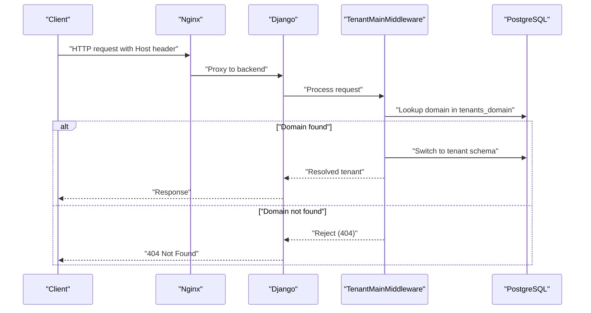

**Diagram sources**
- [MULTI_TENANCY.md:12-19](file://backend/docs/architecture/MULTI_TENANCY.md#L12-L19)
- [base.py:107-119](file://backend/config/settings/base.py#L107-L119)
- [models.py:56-77](file://backend/apps/tenants/models.py#L56-L77)

## Detailed Component Analysis

### Tenant Model and Domain Mapping
The tenant model represents a customer with a dedicated PostgreSQL schema. The domain model maps hostnames to tenants. django-tenants manages schema creation and deletion automatically for tenants.

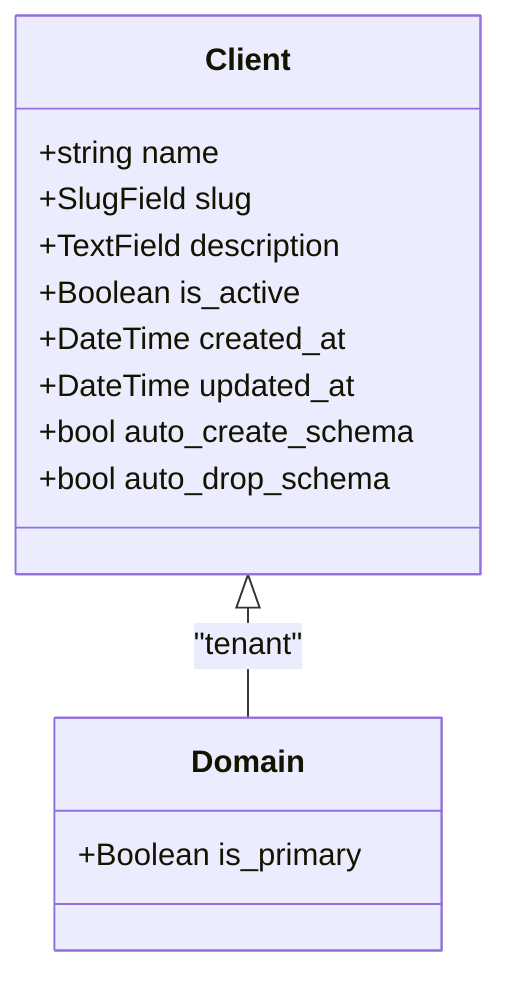

- Schema separation: Each tenant has its own schema; shared tables live in the public schema.
- Active flag: Inactive tenants are excluded from routing and background jobs.
- Auto schema management: Creation and drop are handled automatically.

**Diagram sources**
- [models.py:6-77](file://backend/apps/tenants/models.py#L6-L77)

**Section sources**
- [models.py:6-77](file://backend/apps/tenants/models.py#L6-L77)
- [MULTI_TENANCY.md:5-11](file://backend/docs/architecture/MULTI_TENANCY.md#L5-L11)

### Services Layer: Tenant Provisioning and Lifecycle
The services module centralizes tenant write operations and enforces a single path for provisioning and deactivation.

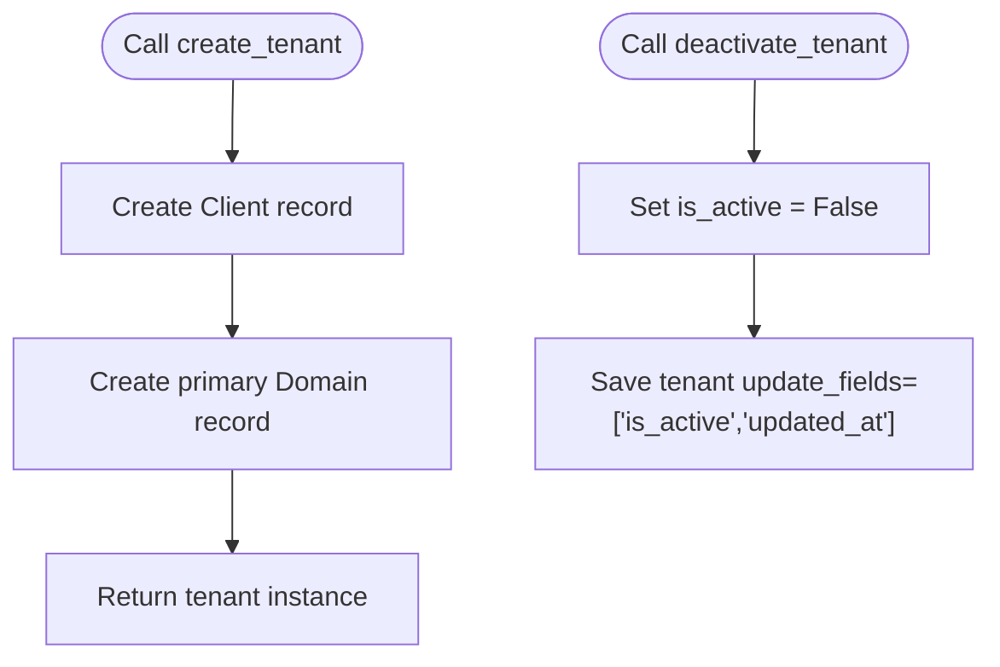

- Single source of truth: All tenant mutations must go through services.
- Deactivation: Soft-deactivate tenants by updating the active flag.

**Diagram sources**
- [services.py:11-41](file://backend/apps/tenants/services.py#L11-L41)

**Section sources**
- [services.py:1-42](file://backend/apps/tenants/services.py#L1-L42)
- [test_tenants.py:18-50](file://backend/tests/test_tenants.py#L18-L50)

### Settings: SHARED_APPS vs TENANT_APPS and Middleware Stack
The settings define which apps live in the public schema (SHARED_APPS) and which are replicated per tenant (TENANT_APPS). The middleware stack includes TenantMainMiddleware, and the database router ensures proper routing.

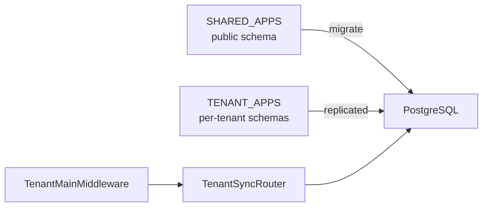

- SHARED_APPS includes django-tenants, core Django apps, DRF, and the tenants app.
- TENANT_APPS includes all bounded contexts.
- Middleware order: TenantMainMiddleware must be first to resolve tenant before other middleware.

**Diagram sources**
- [base.py:44-102](file://backend/config/settings/base.py#L44-L102)

**Section sources**
- [base.py:41-119](file://backend/config/settings/base.py#L41-L119)
- [MULTI_TENANCY.md:28-40](file://backend/docs/architecture/MULTI_TENANCY.md#L28-L40)

### Database Connections and Schema Switching
- Engine: django_tenants.postgresql_backend is configured as the default engine.
- Router: TenantSyncRouter directs reads/writes to the appropriate schema.
- Fail-closed: If no tenant is resolved, the request is rejected.

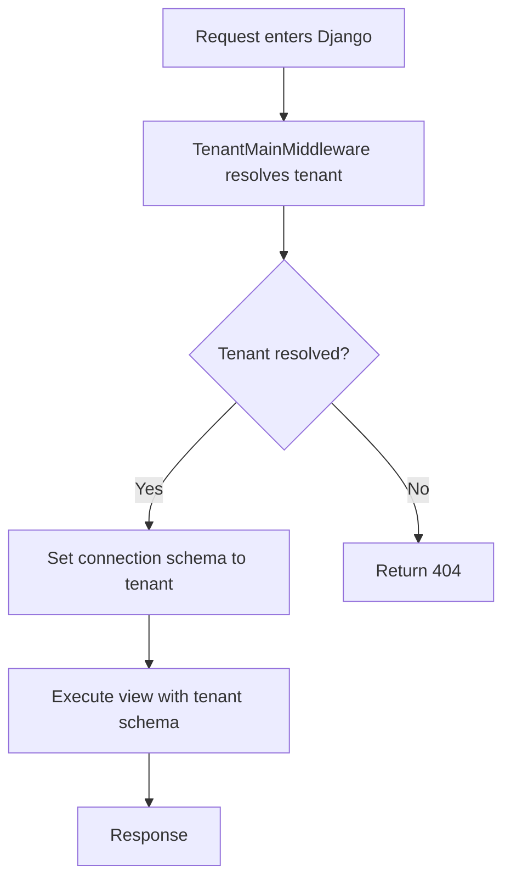

**Diagram sources**
- [base.py:155-164](file://backend/config/settings/base.py#L155-L164)
- [base.py:102-102](file://backend/config/settings/base.py#L102-L102)
- [MULTI_TENANCY.md:21-27](file://backend/docs/architecture/MULTI_TENANCY.md#L21-L27)

**Section sources**
- [base.py:99-102](file://backend/config/settings/base.py#L99-L102)
- [base.py:155-164](file://backend/config/settings/base.py#L155-L164)
- [MULTI_TENANCY.md:21-27](file://backend/docs/architecture/MULTI_TENANCY.md#L21-L27)

### Cross-Tenant Query Restrictions and Background Jobs
- Views must not perform schema switching; all access must be within the resolved tenant context.
- Cross-tenant queries are explicitly prohibited.
- Background jobs must explicitly enter the tenant context using tenant_context.

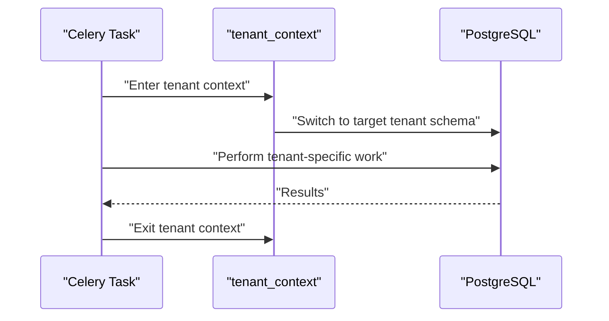

**Diagram sources**
- [MULTI_TENANCY.md:63-75](file://backend/docs/architecture/MULTI_TENANCY.md#L63-L75)

**Section sources**
- [MULTI_TENANCY.md:25-27](file://backend/docs/architecture/MULTI_TENANCY.md#L25-L27)
- [MULTI_TENANCY.md:63-75](file://backend/docs/architecture/MULTI_TENANCY.md#L63-L75)

### Nginx Routing and Request Flow
Nginx receives requests and forwards them to the backend. It preserves headers including protocol for secure redirects and reverse proxy behavior.

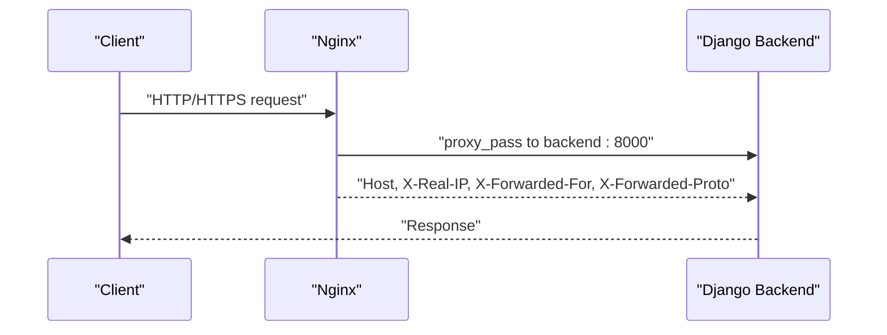

**Diagram sources**
- [nginx.conf:28-35](file://infra/nginx/nginx.conf#L28-L35)

**Section sources**
- [nginx.conf:1-54](file://infra/nginx/nginx.conf#L1-L54)

### Read Operations and Selectors
Read operations are centralized in selectors to keep query logic testable and consistent. They rely on the tenant-resolved schema context.

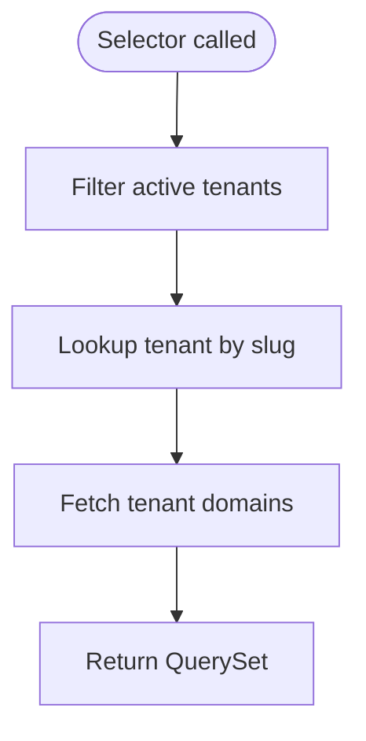

**Diagram sources**
- [selectors.py:13-25](file://backend/apps/tenants/selectors.py#L13-L25)

**Section sources**
- [selectors.py:1-25](file://backend/apps/tenants/selectors.py#L1-L25)

### Events and Outbox Pattern
The tenants app defines domain events suitable for eventual consistency and outbox/publishing patterns.

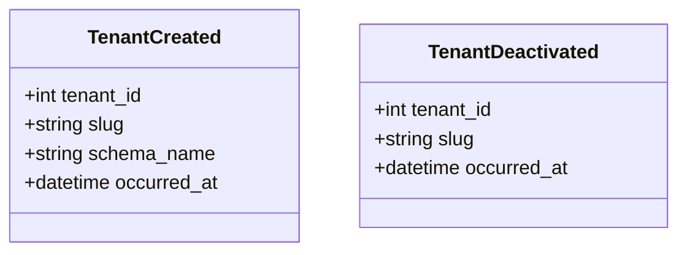

**Diagram sources**
- [events.py:19-35](file://backend/apps/tenants/events.py#L19-L35)

**Section sources**
- [events.py:1-35](file://backend/apps/tenants/events.py#L1-L35)

## Dependency Analysis
The tenant isolation relies on explicit configuration and middleware ordering. The following diagram shows key dependencies among configuration, middleware, and models.

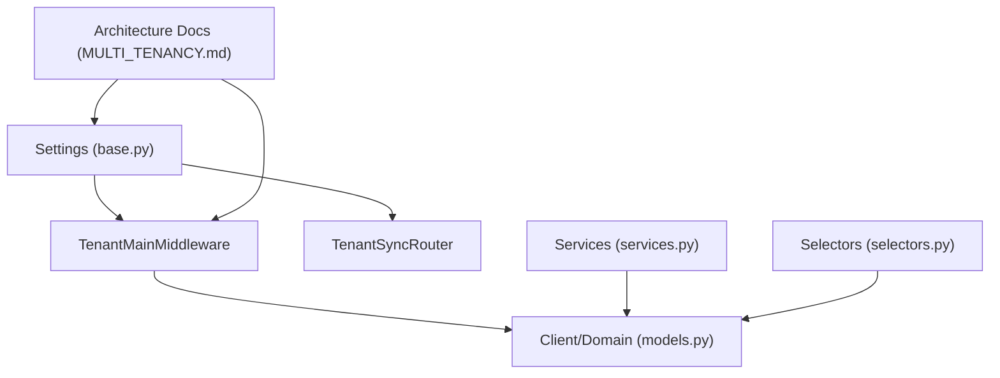

**Diagram sources**
- [base.py:41-119](file://backend/config/settings/base.py#L41-L119)
- [models.py:6-77](file://backend/apps/tenants/models.py#L6-L77)
- [services.py:1-42](file://backend/apps/tenants/services.py#L1-L42)
- [selectors.py:1-25](file://backend/apps/tenants/selectors.py#L1-L25)
- [MULTI_TENANCY.md:1-76](file://backend/docs/architecture/MULTI_TENANCY.md#L1-L76)

**Section sources**
- [base.py:41-119](file://backend/config/settings/base.py#L41-L119)
- [models.py:6-77](file://backend/apps/tenants/models.py#L6-L77)
- [services.py:1-42](file://backend/apps/tenants/services.py#L1-L42)
- [selectors.py:1-25](file://backend/apps/tenants/selectors.py#L1-L25)
- [MULTI_TENANCY.md:1-76](file://backend/docs/architecture/MULTI_TENANCY.md#L1-L76)

## Performance Considerations
- Connection pooling and reuse: Production settings enable persistent connections via CONN_MAX_AGE.
- Middleware order: TenantMainMiddleware first avoids unnecessary work when no tenant is resolved.
- Minimal shared schema footprint: Keep SHARED_APPS lean to reduce migration and schema overhead.

[No sources needed since this section provides general guidance]

## Troubleshooting Guide
Common issues and remedies:
- 404 on unknown domain: Expected under fail-closed policy; verify domain registration and DNS.
- Tenant not resolving: Confirm Host header matches a registered domain and tenant is active.
- Cross-tenant access attempts: Ensure views do not manually switch schemas; use tenant_context in background jobs only.
- Migration errors: Run migrations for both shared and tenant schemas as documented.

Operational checks:
- Verify TENANT_MODEL and TENANT_DOMAIN_MODEL settings.
- Confirm TenantSyncRouter is present in DATABASE_ROUTERS.
- Ensure TenantMainMiddleware is the first middleware item.

**Section sources**
- [base.py:99-102](file://backend/config/settings/base.py#L99-L102)
- [base.py:107-119](file://backend/config/settings/base.py#L107-L119)
- [MULTI_TENANCY.md:21-27](file://backend/docs/architecture/MULTI_TENANCY.md#L21-L27)
- [MULTI_TENANCY.md:54-61](file://backend/docs/architecture/MULTI_TENANCY.md#L54-L61)

## Conclusion
PlantOps employs django-tenants with PostgreSQL schemas to achieve strong, fail-closed tenant isolation. The TenantMainMiddleware resolves tenants from the Host header and switches schemas before other middleware and views execute. SHARED_APPS and TENANT_APPS define clear schema boundaries, while services, selectors, and architecture guidelines enforce safe, testable patterns. Nginx forwards requests with preserved headers, and production settings optimize performance. Adhering to cross-tenant query restrictions and using tenant_context in background jobs maintains robust tenant boundaries.