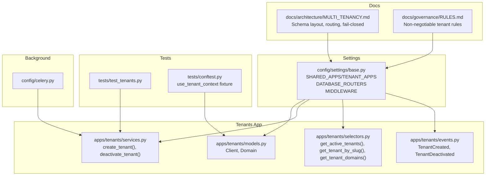
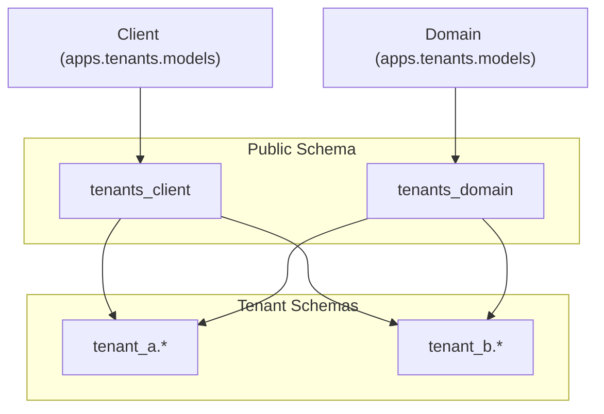
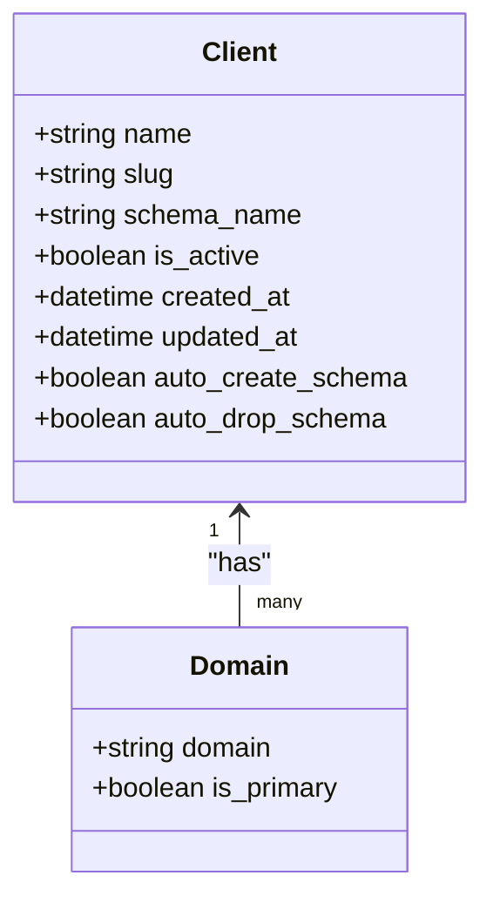
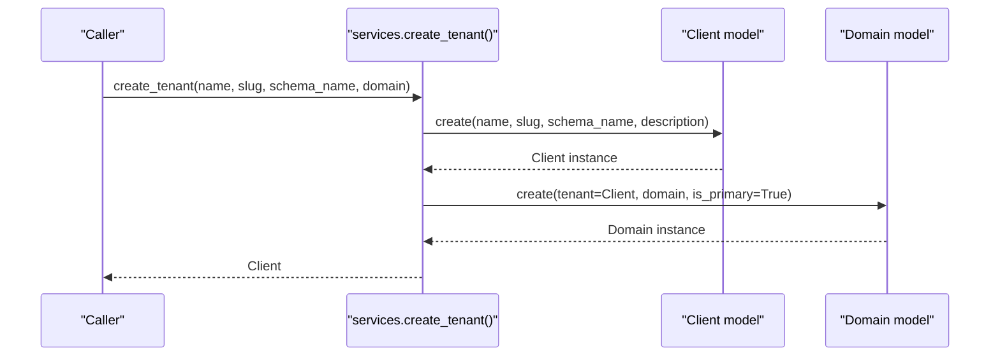
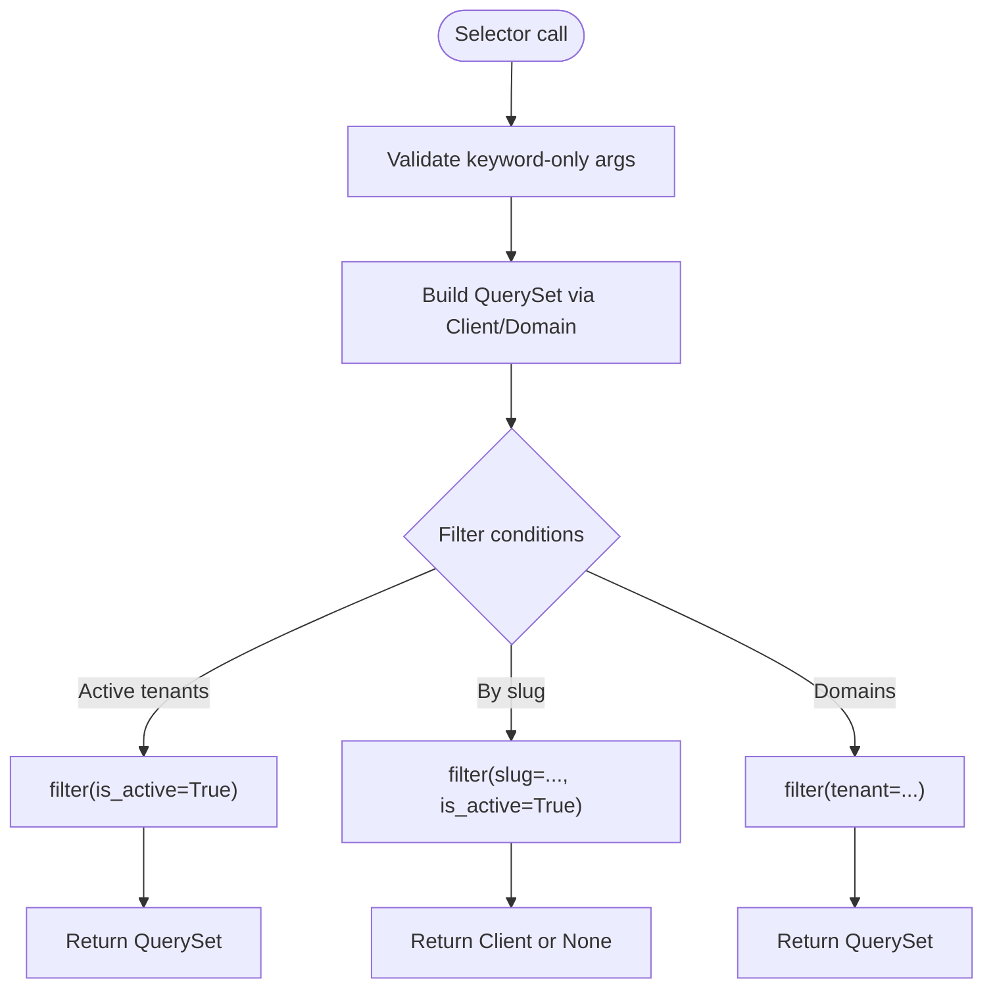
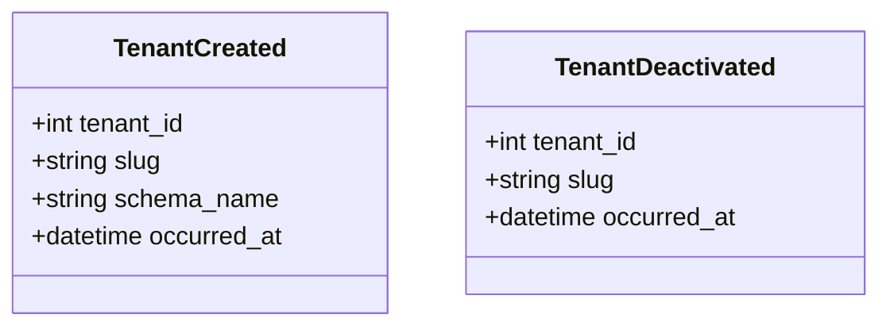
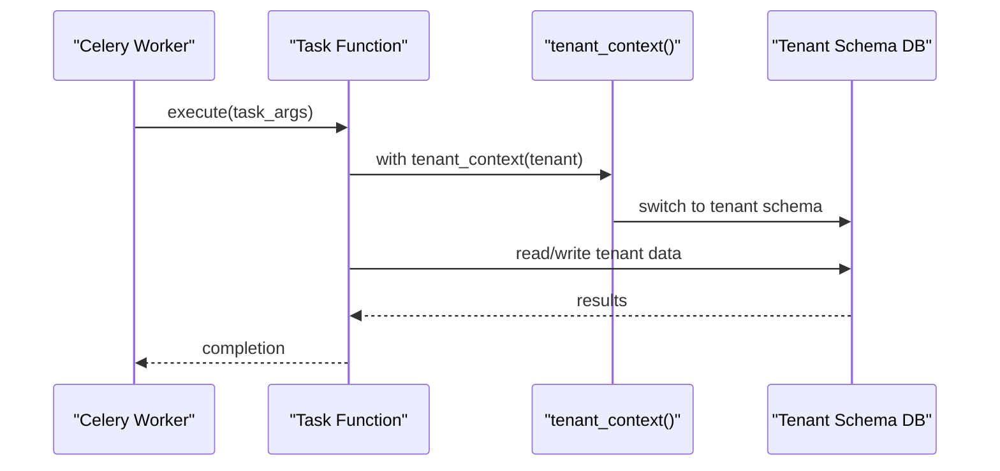
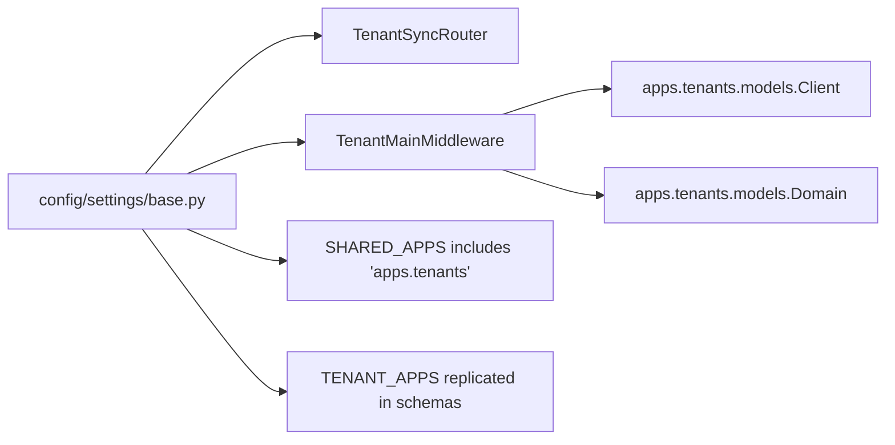

# Tenant Data Security

<cite>
**Referenced Files in This Document**
- [models.py](file://backend/apps/tenants/models.py)
- [services.py](file://backend/apps/tenants/services.py)
- [selectors.py](file://backend/apps/tenants/selectors.py)
- [events.py](file://backend/apps/tenants/events.py)
- [MULTI_TENANCY.md](file://backend/docs/architecture/MULTI_TENANCY.md)
- [base.py](file://backend/config/settings/base.py)
- [RULES.md](file://backend/docs/governance/RULES.md)
- [test_tenants.py](file://backend/tests/test_tenants.py)
- [conftest.py](file://backend/tests/conftest.py)
- [celery.py](file://backend/config/celery.py)
</cite>

## Table of Contents
1. [Introduction](#introduction)
2. [Project Structure](#project-structure)
3. [Core Components](#core-components)
4. [Architecture Overview](#architecture-overview)
5. [Detailed Component Analysis](#detailed-component-analysis)
6. [Dependency Analysis](#dependency-analysis)
7. [Performance Considerations](#performance-considerations)
8. [Troubleshooting Guide](#troubleshooting-guide)
9. [Conclusion](#conclusion)
10. [Appendices](#appendices)

## Introduction
This document explains how PlantOps secures tenant data and enforces strict isolation using schema-based separation. It covers the fail-closed isolation principle, cross-tenant query restrictions, tenant_context() usage patterns for background jobs, and guidance to prevent schema hopping in views. It also documents shared versus tenant schemas, secure data access patterns, and monitoring approaches for tenant data integrity.

## Project Structure
PlantOps organizes tenant-related logic under the tenants bounded context and documents multi-tenancy policy and configuration in the architecture and governance docs. The settings define shared and tenant apps, middleware, and database routing.

**Diagram sources**
- [base.py:44-119](file://backend/config/settings/base.py#L44-L119)
- [models.py:6-76](file://backend/apps/tenants/models.py#L6-L76)
- [services.py:11-41](file://backend/apps/tenants/services.py#L11-L41)
- [selectors.py:13-25](file://backend/apps/tenants/selectors.py#L13-L25)
- [events.py:19-36](file://backend/apps/tenants/events.py#L19-L36)
- [MULTI_TENANCY.md:1-76](file://backend/docs/architecture/MULTI_TENANCY.md#L1-L76)
- [RULES.md:1-70](file://backend/docs/governance/RULES.md#L1-L70)
- [test_tenants.py:11-50](file://backend/tests/test_tenants.py#L11-L50)
- [conftest.py:12-49](file://backend/tests/conftest.py#L12-L49)
- [celery.py:12-21](file://backend/config/celery.py#L12-L21)

**Section sources**
- [base.py:44-119](file://backend/config/settings/base.py#L44-L119)
- [MULTI_TENANCY.md:1-76](file://backend/docs/architecture/MULTI_TENANCY.md#L1-L76)
- [RULES.md:1-70](file://backend/docs/governance/RULES.md#L1-L70)

## Core Components
- Tenant model and domain mapping: The Client model defines tenant metadata and schema lifecycle flags. The Domain model maps hostnames to tenants and marks a primary domain.
- Services: Centralized write operations for tenant provisioning and deactivation.
- Selectors: Centralized read operations for tenant discovery and domain retrieval.
- Events: Lightweight domain events for tenant lifecycle actions suitable for eventual consistency and audit.

Security enforcement pillars:
- Fail-closed isolation: Requests unresolved to a tenant are rejected.
- Cross-tenant queries prohibited except via explicit tenant_context() in background jobs.
- No schema hopping in views; tenant schema switching must be explicit and controlled.

**Section sources**
- [models.py:6-76](file://backend/apps/tenants/models.py#L6-L76)
- [services.py:11-41](file://backend/apps/tenants/services.py#L11-L41)
- [selectors.py:13-25](file://backend/apps/tenants/selectors.py#L13-L25)
- [events.py:19-36](file://backend/apps/tenants/events.py#L19-L36)
- [MULTI_TENANCY.md:21-27](file://backend/docs/architecture/MULTI_TENANCY.md#L21-L27)
- [RULES.md:5-11](file://backend/docs/governance/RULES.md#L5-L11)

## Architecture Overview
PlantOps uses django-tenants with PostgreSQL schemas for physical isolation. The public schema hosts shared tables and tenant metadata. Each tenant has its own schema containing replicated tenant apps.

**Diagram sources**
- [MULTI_TENANCY.md:7-10](file://backend/docs/architecture/MULTI_TENANCY.md#L7-L10)
- [models.py:6-76](file://backend/apps/tenants/models.py#L6-L76)

Tenant routing and middleware:
- Requests are routed by Host header to TenantMainMiddleware, which resolves the tenant and switches the schema. Unresolved requests are rejected.

**Section sources**
- [MULTI_TENANCY.md:12-20](file://backend/docs/architecture/MULTI_TENANCY.md#L12-L20)
- [base.py:107](file://backend/config/settings/base.py#L107)

## Detailed Component Analysis

### Tenant Model and Domain Mapping
- Client (TenantMixin): tenant identity, slug, schema lifecycle flags, timestamps, and ordering.
- Domain (DomainMixin): hostname-to-tenant mapping with primary domain flag.

**Diagram sources**
- [models.py:6-76](file://backend/apps/tenants/models.py#L6-L76)

**Section sources**
- [models.py:6-76](file://backend/apps/tenants/models.py#L6-L76)

### Tenant Services
- create_tenant(): Provisions a tenant and its primary domain; this is the only sanctioned way to create tenants.
- deactivate_tenant(): Soft-deactivates a tenant to exclude it from routing and background jobs.

**Diagram sources**
- [services.py:11-35](file://backend/apps/tenants/services.py#L11-L35)

**Section sources**
- [services.py:11-41](file://backend/apps/tenants/services.py#L11-L41)

### Tenant Selectors
- get_active_tenants(): Returns active tenants for administrative or job use.
- get_tenant_by_slug(): Resolves a tenant by slug and ensures it is active.
- get_tenant_domains(): Lists all domains for a given tenant.

**Diagram sources**
- [selectors.py:13-25](file://backend/apps/tenants/selectors.py#L13-L25)

**Section sources**
- [selectors.py:13-25](file://backend/apps/tenants/selectors.py#L13-L25)

### Tenant Events
- TenantCreated and TenantDeactivated: immutable events for tenant lifecycle actions, suitable for outbox/event bus integration.

**Diagram sources**
- [events.py:19-36](file://backend/apps/tenants/events.py#L19-L36)

**Section sources**
- [events.py:19-36](file://backend/apps/tenants/events.py#L19-L36)

### Background Jobs and tenant_context()
- Celery tasks touching tenant data must explicitly enter the tenant context using tenant_context().
- Tests demonstrate use_tenant_context() to run code within a tenant’s schema during test execution.

**Diagram sources**
- [MULTI_TENANCY.md:63-75](file://backend/docs/architecture/MULTI_TENANCY.md#L63-L75)
- [conftest.py:44-49](file://backend/tests/conftest.py#L44-L49)

**Section sources**
- [MULTI_TENANCY.md:63-75](file://backend/docs/architecture/MULTI_TENANCY.md#L63-L75)
- [conftest.py:44-49](file://backend/tests/conftest.py#L44-L49)

## Dependency Analysis
- Settings define SHARED_APPS and TENANT_APPS, DATABASE_ROUTERS, and middleware stack.
- Tenants app depends on django-tenants models and is included in SHARED_APPS.
- Tenant routing depends on TenantMainMiddleware and the tenants Client/Domain models.

**Diagram sources**
- [base.py:44-119](file://backend/config/settings/base.py#L44-L119)
- [models.py:6-76](file://backend/apps/tenants/models.py#L6-L76)

**Section sources**
- [base.py:44-119](file://backend/config/settings/base.py#L44-L119)

## Performance Considerations
- Schema separation reduces cross-tenant contention and simplifies backup/recovery per tenant.
- Keep cross-tenant queries to a minimum; when necessary, use explicit tenant_context() in background jobs.
- Prefer selectors/services abstractions to centralize query logic and enable testing.

[No sources needed since this section provides general guidance]

## Troubleshooting Guide
Common issues and remedies:
- Request routed to public schema unintentionally: Verify TenantMainMiddleware is configured and Host header resolution is correct.
- Cross-tenant access errors: Ensure tenant_context() is used in background jobs and views avoid schema hopping.
- Tenant not found: Expect rejection due to fail-closed behavior; confirm domain mapping exists in tenants_domain.
- Tests failing due to schema context: Use the use_tenant_context fixture to run within the tenant schema.

**Section sources**
- [MULTI_TENANCY.md:21-27](file://backend/docs/architecture/MULTI_TENANCY.md#L21-L27)
- [conftest.py:44-49](file://backend/tests/conftest.py#L44-L49)
- [test_tenants.py:11-50](file://backend/tests/test_tenants.py#L11-L50)

## Conclusion
PlantOps enforces strong tenant isolation via schema-based separation, fail-closed routing, and explicit tenant_context() usage in background jobs. Centralized services and selectors, along with governance rules, reduce risk of data leakage and support maintainable, auditable multi-tenant operations.

[No sources needed since this section summarizes without analyzing specific files]

## Appendices

### Security Best Practices for Multi-Tenant Applications
- Enforce fail-closed isolation: reject unresolved requests.
- Prohibit cross-tenant queries; use tenant_context() only in background jobs.
- Avoid schema hopping in views; always resolve tenant via middleware.
- Centralize reads/writes through selectors/services.
- Keep shared schema minimal; only tenant metadata and shared apps belong there.
- Monitor tenant routing and background job execution.

**Section sources**
- [MULTI_TENANCY.md:21-27](file://backend/docs/architecture/MULTI_TENANCY.md#L21-L27)
- [RULES.md:5-11](file://backend/docs/governance/RULES.md#L5-L11)

### Monitoring Approaches for Tenant Data Integrity
- Track tenant routing failures and 404s for unknown domains.
- Log background job execution with tenant_context() usage.
- Monitor tenant activation/deactivation events for audit trails.
- Observe selector/service call patterns to detect anomalies.

**Section sources**
- [events.py:19-36](file://backend/apps/tenants/events.py#L19-L36)
- [MULTI_TENANCY.md:63-75](file://backend/docs/architecture/MULTI_TENANCY.md#L63-L75)