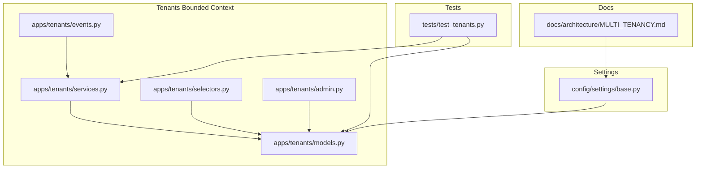
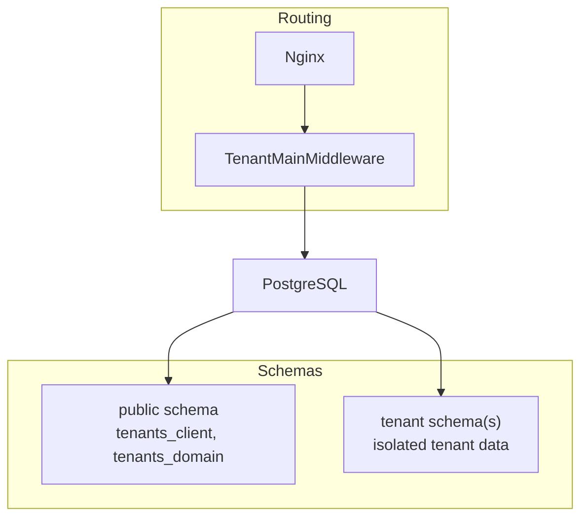
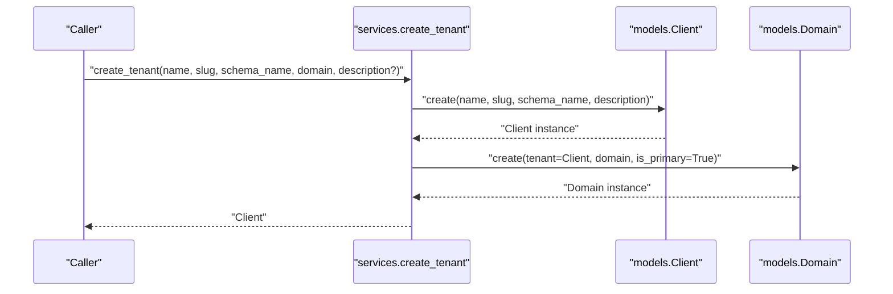
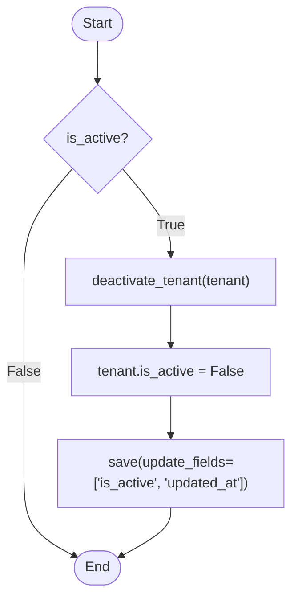
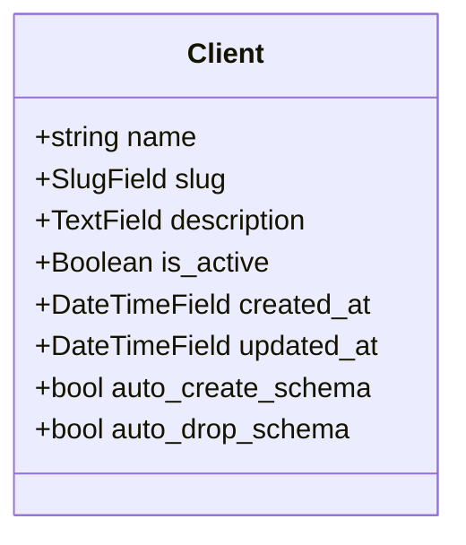
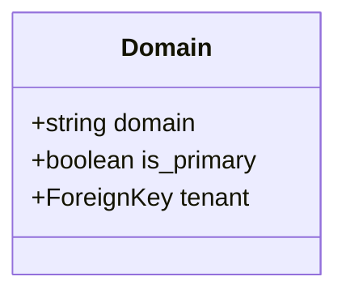
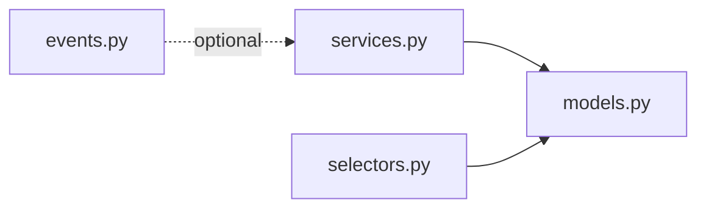
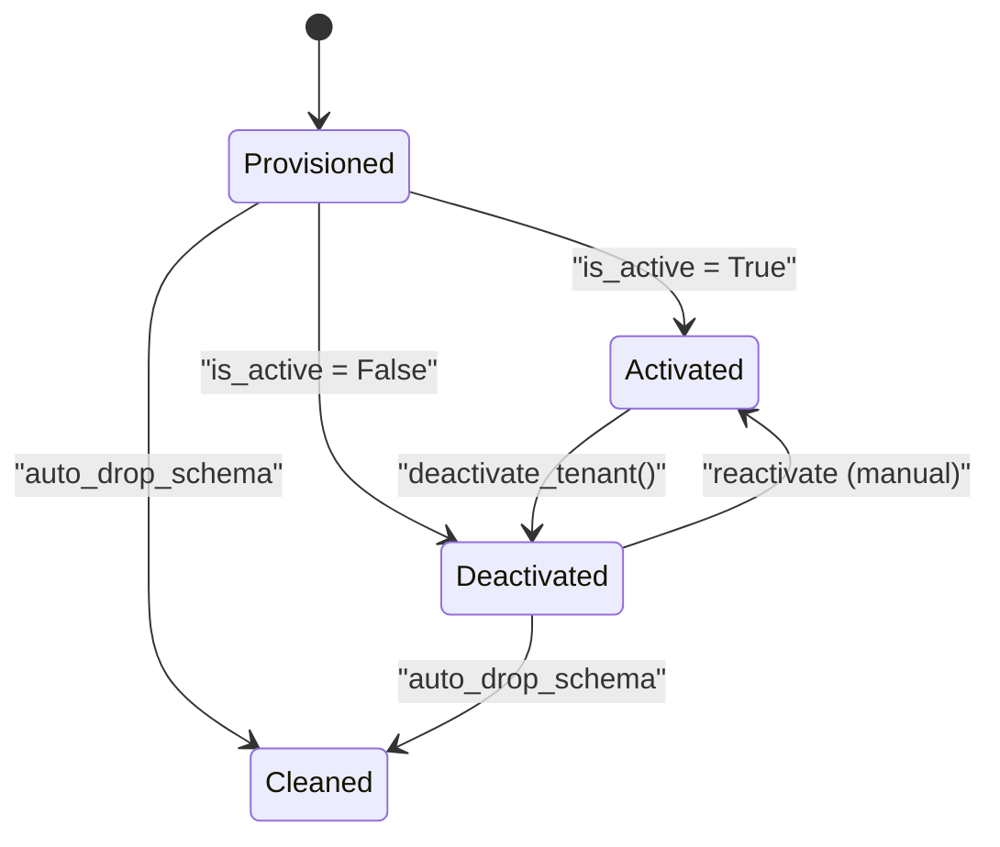
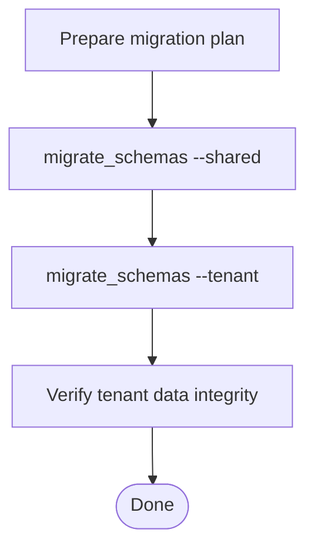
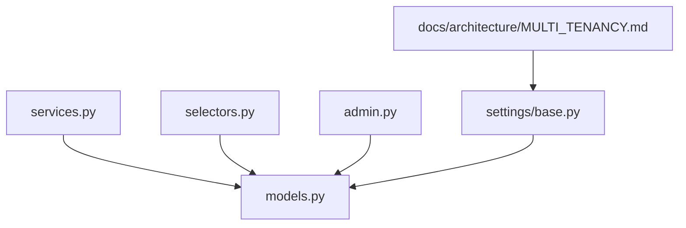

# Tenant Provisioning & Lifecycle

<cite>
**Referenced Files in This Document**
- [models.py](file://backend/apps/tenants/models.py)
- [services.py](file://backend/apps/tenants/services.py)
- [selectors.py](file://backend/apps/tenants/selectors.py)
- [admin.py](file://backend/apps/tenants/admin.py)
- [events.py](file://backend/apps/tenants/events.py)
- [MULTI_TENANCY.md](file://backend/docs/architecture/MULTI_TENANCY.md)
- [base.py](file://backend/config/settings/base.py)
- [test_tenants.py](file://backend/tests/test_tenants.py)
</cite>

## Table of Contents
1. [Introduction](#introduction)
2. [Project Structure](#project-structure)
3. [Core Components](#core-components)
4. [Architecture Overview](#architecture-overview)
5. [Detailed Component Analysis](#detailed-component-analysis)
6. [Dependency Analysis](#dependency-analysis)
7. [Performance Considerations](#performance-considerations)
8. [Troubleshooting Guide](#troubleshooting-guide)
9. [Conclusion](#conclusion)
10. [Appendices](#appendices)

## Introduction
This document explains tenant provisioning and lifecycle management in PlantOps. It focuses on the tenant creation workflow, tenant activation/deactivation, the Client model, and supporting services and selectors. It also covers tenant routing, migration strategies, and best practices for safe tenant setup and evolution across schemas.

## Project Structure
The tenant functionality is encapsulated in the tenants bounded context:
- Models define the Client (tenant) and Domain entities.
- Services provide the canonical write operations for tenant provisioning and status changes.
- Selectors provide centralized read operations for tenant data.
- Events represent domain events for outbox/publishing integrations.
- Admin integrates the models into Django’s admin interface.
- Documentation describes multi-tenancy architecture and migration steps.
- Settings configure django-tenants and middleware order.

**Diagram sources**
- [models.py:1-77](file://backend/apps/tenants/models.py#L1-L77)
- [services.py:1-42](file://backend/apps/tenants/services.py#L1-L42)
- [selectors.py:1-26](file://backend/apps/tenants/selectors.py#L1-L26)
- [events.py:1-36](file://backend/apps/tenants/events.py#L1-L36)
- [admin.py:1-25](file://backend/apps/tenants/admin.py#L1-L25)
- [base.py:99-119](file://backend/config/settings/base.py#L99-L119)
- [MULTI_TENANCY.md:1-76](file://backend/docs/architecture/MULTI_TENANCY.md#L1-L76)
- [test_tenants.py:1-51](file://backend/tests/test_tenants.py#L1-L51)

**Section sources**
- [models.py:1-77](file://backend/apps/tenants/models.py#L1-L77)
- [services.py:1-42](file://backend/apps/tenants/services.py#L1-L42)
- [selectors.py:1-26](file://backend/apps/tenants/selectors.py#L1-L26)
- [events.py:1-36](file://backend/apps/tenants/events.py#L1-L36)
- [admin.py:1-25](file://backend/apps/tenants/admin.py#L1-L25)
- [MULTI_TENANCY.md:1-76](file://backend/docs/architecture/MULTI_TENANCY.md#L1-L76)
- [base.py:99-119](file://backend/config/settings/base.py#L99-L119)
- [test_tenants.py:1-51](file://backend/tests/test_tenants.py#L1-L51)

## Core Components
- Client (Tenant) model: Represents a tenant with name, slug, schema_name, description, and is_active flag. It enables automatic schema creation and drop via django-tenants.
- Domain model: Maps hostnames to tenants and tracks a primary domain per tenant.
- Services layer: Enforces canonical mutation paths for tenant creation and deactivation.
- Selectors layer: Centralizes tenant queries (active tenants, tenant by slug, tenant domains).
- Events: Lightweight domain events for TenantCreated and TenantDeactivated to support eventual consistency.
- Admin: Provides UI for managing tenants and domains.

**Section sources**
- [models.py:6-53](file://backend/apps/tenants/models.py#L6-L53)
- [models.py:56-76](file://backend/apps/tenants/models.py#L56-L76)
- [services.py:11-35](file://backend/apps/tenants/services.py#L11-L35)
- [services.py:38-41](file://backend/apps/tenants/services.py#L38-L41)
- [selectors.py:13-25](file://backend/apps/tenants/selectors.py#L13-L25)
- [events.py:19-35](file://backend/apps/tenants/events.py#L19-L35)
- [admin.py:7-24](file://backend/apps/tenants/admin.py#L7-L24)

## Architecture Overview
PlantOps uses django-tenants with PostgreSQL schemas for tenant isolation. Requests are routed by Host header to the appropriate tenant schema via middleware. Shared metadata (tenants and domains) live in the public schema, while tenant data resides in tenant-specific schemas.

**Diagram sources**
- [MULTI_TENANCY.md:12-19](file://backend/docs/architecture/MULTI_TENANCY.md#L12-L19)
- [base.py:99-102](file://backend/config/settings/base.py#L99-L102)

**Section sources**
- [MULTI_TENANCY.md:1-27](file://backend/docs/architecture/MULTI_TENANCY.md#L1-L27)
- [base.py:99-119](file://backend/config/settings/base.py#L99-L119)

## Detailed Component Analysis

### Tenant Creation Workflow
The create_tenant service is the single, canonical path to provision a new tenant. It creates a Client record and a primary Domain record for the tenant.

Key parameters:
- name: Human-readable tenant name.
- slug: URL-friendly unique identifier.
- schema_name: Target PostgreSQL schema name (managed by django-tenants).
- domain: Fully qualified hostname for routing.
- description: Optional description.

Validation and constraints:
- slug uniqueness is enforced at the database level.
- schema_name is managed by django-tenants; it must match the Client’s schema_name.
- Domain is created as primary during provisioning.

Best practices:
- Always call create_tenant for new tenants.
- Ensure domain uniqueness across tenants.
- Keep schema_name consistent with tenant identity.

**Diagram sources**
- [services.py:11-35](file://backend/apps/tenants/services.py#L11-L35)
- [models.py:6-53](file://backend/apps/tenants/models.py#L6-L53)
- [models.py:56-76](file://backend/apps/tenants/models.py#L56-L76)

**Section sources**
- [services.py:11-35](file://backend/apps/tenants/services.py#L11-L35)
- [models.py:14-45](file://backend/apps/tenants/models.py#L14-L45)
- [models.py:64-68](file://backend/apps/tenants/models.py#L64-L68)
- [MULTI_TENANCY.md:41-52](file://backend/docs/architecture/MULTI_TENANCY.md#L41-L52)

### Tenant Activation and Deactivation
Activation/deactivation is a soft toggle controlled by the is_active flag. Deactivation sets is_active to false and updates timestamps.

Selectors reflect active-only semantics:
- get_active_tenants filters by is_active=True.
- get_tenant_by_slug restricts to active tenants.

**Diagram sources**
- [services.py:38-41](file://backend/apps/tenants/services.py#L38-L41)
- [selectors.py:13-20](file://backend/apps/tenants/selectors.py#L13-L20)

**Section sources**
- [services.py:38-41](file://backend/apps/tenants/services.py#L38-L41)
- [selectors.py:13-20](file://backend/apps/tenants/selectors.py#L13-L20)
- [models.py:29-33](file://backend/apps/tenants/models.py#L29-L33)

### Client Model Structure and Role
The Client model inherits from django-tenants’ TenantMixin and defines:
- name, slug, description, is_active, created_at, updated_at.
- auto_create_schema and auto_drop_schema enabled for lifecycle automation.
- Ordering by name and human-friendly verbose names.

**Diagram sources**
- [models.py:6-53](file://backend/apps/tenants/models.py#L6-L53)

**Section sources**
- [models.py:6-53](file://backend/apps/tenants/models.py#L6-L53)

### Domain Model and Routing
Domains map hostnames to tenants and mark a primary domain used for URL generation. The middleware resolves the tenant by Host header against the Domain table.

**Diagram sources**
- [models.py:56-76](file://backend/apps/tenants/models.py#L56-L76)
- [MULTI_TENANCY.md:12-19](file://backend/docs/architecture/MULTI_TENANCY.md#L12-L19)

**Section sources**
- [models.py:56-76](file://backend/apps/tenants/models.py#L56-L76)
- [MULTI_TENANCY.md:12-19](file://backend/docs/architecture/MULTI_TENANCY.md#L12-L19)

### Services and Selectors Layer
Services centralize all tenant mutations:
- create_tenant: Creates tenant and primary domain.
- deactivate_tenant: Soft-deactivates a tenant.

Selectors centralize tenant queries:
- get_active_tenants: Active-only listing.
- get_tenant_by_slug: Lookup by slug among active tenants.
- get_tenant_domains: Retrieve all domains for a tenant.

**Diagram sources**
- [services.py:1-42](file://backend/apps/tenants/services.py#L1-L42)
- [selectors.py:1-26](file://backend/apps/tenants/selectors.py#L1-L26)
- [models.py:1-77](file://backend/apps/tenants/models.py#L1-L77)
- [events.py:1-36](file://backend/apps/tenants/events.py#L1-L36)

**Section sources**
- [services.py:1-42](file://backend/apps/tenants/services.py#L1-L42)
- [selectors.py:1-26](file://backend/apps/tenants/selectors.py#L1-L26)
- [events.py:1-36](file://backend/apps/tenants/events.py#L1-L36)

### Tenant Lifecycle Stages
- Provisioning: create_tenant provisions schema and primary domain.
- Activation: is_active=True by default; tenant participates in routing and jobs.
- Deactivation: is_active=False; tenant excluded from routing and background jobs.
- Cleanup: auto_drop_schema removes tenant schema when configured.

**Diagram sources**
- [services.py:11-41](file://backend/apps/tenants/services.py#L11-L41)
- [models.py:44-45](file://backend/apps/tenants/models.py#L44-L45)

**Section sources**
- [services.py:11-41](file://backend/apps/tenants/services.py#L11-L41)
- [models.py:29-45](file://backend/apps/tenants/models.py#L29-L45)

### Practical Examples
- Creating a tenant:
  - Use the create_tenant service with name, slug, schema_name, and domain.
  - Verify the Client and primary Domain records are created.
- Managing tenant status:
  - Call deactivate_tenant to set is_active to False.
  - Use selectors to filter active tenants or fetch by slug among active ones.
- Cleanup:
  - Rely on auto_drop_schema to remove tenant schema when appropriate.

**Section sources**
- [services.py:11-35](file://backend/apps/tenants/services.py#L11-L35)
- [services.py:38-41](file://backend/apps/tenants/services.py#L38-L41)
- [selectors.py:13-25](file://backend/apps/tenants/selectors.py#L13-L25)
- [test_tenants.py:18-50](file://backend/tests/test_tenants.py#L18-L50)

### Migration Strategies and Schema Evolution
- Run migrations for both shared and tenant schemas after tenant provisioning or schema changes.
- Keep SHARED_APPS and TENANT_APPS aligned so tenant schemas receive required tenant-side apps.
- For schema evolution, apply migrations within tenant_context when touching tenant data from background jobs.

**Diagram sources**
- [MULTI_TENANCY.md:54-61](file://backend/docs/architecture/MULTI_TENANCY.md#L54-L61)
- [base.py:44-94](file://backend/config/settings/base.py#L44-L94)

**Section sources**
- [MULTI_TENANCY.md:54-76](file://backend/docs/architecture/MULTI_TENANCY.md#L54-L76)
- [base.py:44-94](file://backend/config/settings/base.py#L44-L94)

## Dependency Analysis
- Services depend on models for creation and updates.
- Selectors depend on models for queries.
- Admin depends on models for UI.
- Settings configure django-tenants and middleware order.
- Documentation ties routing and migration steps to settings.

**Diagram sources**
- [services.py:1-42](file://backend/apps/tenants/services.py#L1-L42)
- [selectors.py:1-26](file://backend/apps/tenants/selectors.py#L1-L26)
- [admin.py:1-25](file://backend/apps/tenants/admin.py#L1-L25)
- [models.py:1-77](file://backend/apps/tenants/models.py#L1-L77)
- [base.py:99-119](file://backend/config/settings/base.py#L99-L119)
- [MULTI_TENANCY.md:1-27](file://backend/docs/architecture/MULTI_TENANCY.md#L1-L27)

**Section sources**
- [services.py:1-42](file://backend/apps/tenants/services.py#L1-L42)
- [selectors.py:1-26](file://backend/apps/tenants/selectors.py#L1-L26)
- [admin.py:1-25](file://backend/apps/tenants/admin.py#L1-L25)
- [models.py:1-77](file://backend/apps/tenants/models.py#L1-L77)
- [base.py:99-119](file://backend/config/settings/base.py#L99-L119)
- [MULTI_TENANCY.md:1-27](file://backend/docs/architecture/MULTI_TENANCY.md#L1-L27)

## Performance Considerations
- Use selectors for efficient filtering (e.g., get_active_tenants).
- Avoid N+1 queries by batching domain lookups via get_tenant_domains.
- Keep slug and domain indexing in mind; slug is unique and used for fast active lookup.
- For background jobs touching tenant data, use tenant_context to minimize cross-schema overhead.

## Troubleshooting Guide
Common issues and resolutions:
- Tenant not routing:
  - Verify Domain exists and is_primary is set for the intended hostname.
  - Confirm TenantMainMiddleware is first in MIDDLEWARE.
- Tenant not appearing in UI:
  - Check is_active flag; inactive tenants are excluded from selectors.
- Migration errors:
  - Run migrate_schemas for both shared and tenant schemas.
- Unexpected cross-tenant access:
  - Ensure no direct schema switching in views; use tenant_context in background jobs.

**Section sources**
- [MULTI_TENANCY.md:12-27](file://backend/docs/architecture/MULTI_TENANCY.md#L12-L27)
- [selectors.py:13-20](file://backend/apps/tenants/selectors.py#L13-L20)
- [base.py:107-119](file://backend/config/settings/base.py#L107-L119)
- [MULTI_TENANCY.md:54-61](file://backend/docs/architecture/MULTI_TENANCY.md#L54-L61)

## Conclusion
PlantOps enforces strict tenant isolation via django-tenants and a clean separation of concerns: services for writes, selectors for reads, and events for eventual consistency. The create_tenant service is the single source of truth for provisioning, while deactivation provides a safe, reversible lifecycle stage. Adhering to documented migration and routing practices ensures reliable tenant lifecycle management.

## Appendices

### Tenant Provisioning Best Practices
- Always use create_tenant for new tenants.
- Ensure slug and domain uniqueness across tenants.
- Keep is_active True for active tenants; use deactivate_tenant to pause participation.
- Run shared and tenant migrations after provisioning or schema changes.

**Section sources**
- [services.py:11-35](file://backend/apps/tenants/services.py#L11-L35)
- [MULTI_TENANCY.md:54-61](file://backend/docs/architecture/MULTI_TENANCY.md#L54-L61)

### Validation Rules Summary
- slug: Unique, URL-friendly.
- schema_name: Managed by django-tenants; must align with Client schema.
- domain: Fully qualified hostname; primary domain marked explicitly.
- is_active: Boolean flag controlling participation in routing and jobs.

**Section sources**
- [models.py:14-45](file://backend/apps/tenants/models.py#L14-L45)
- [models.py:56-76](file://backend/apps/tenants/models.py#L56-L76)