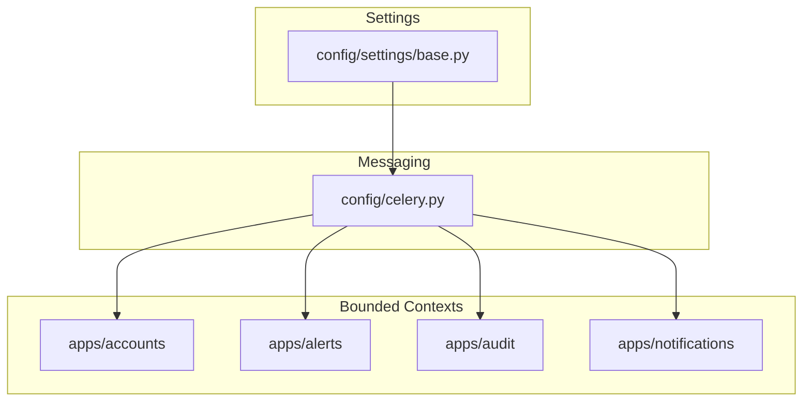
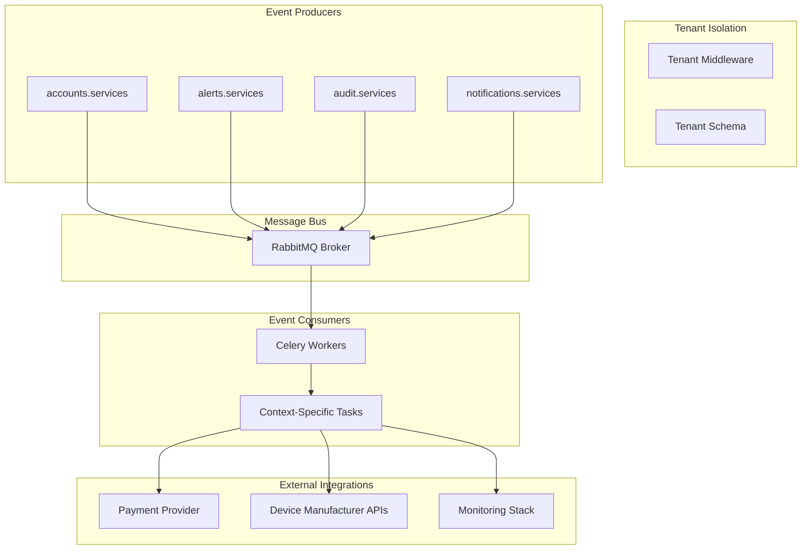
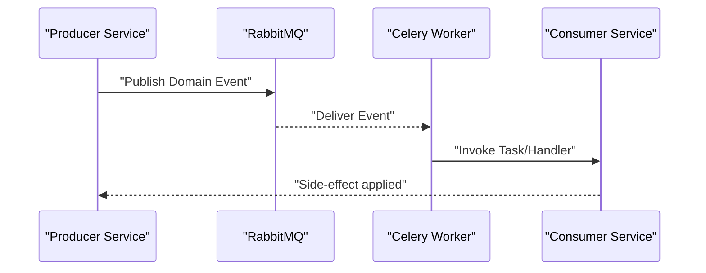
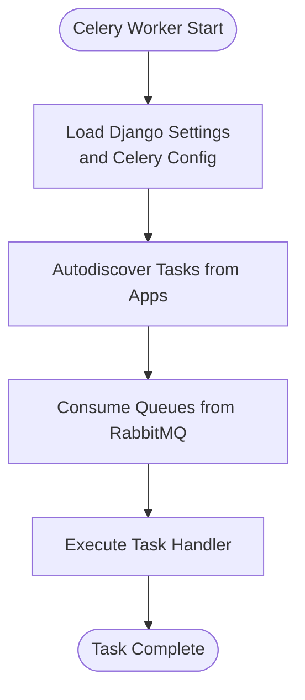
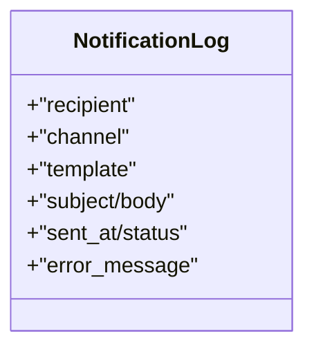
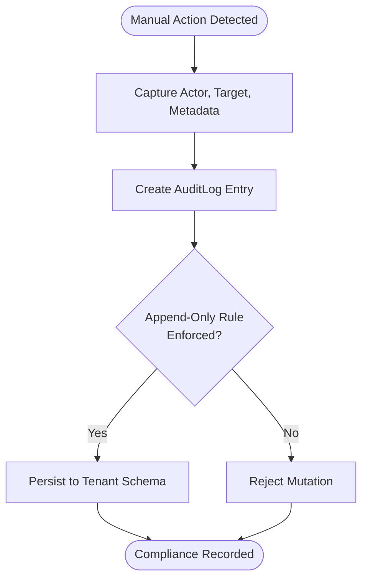
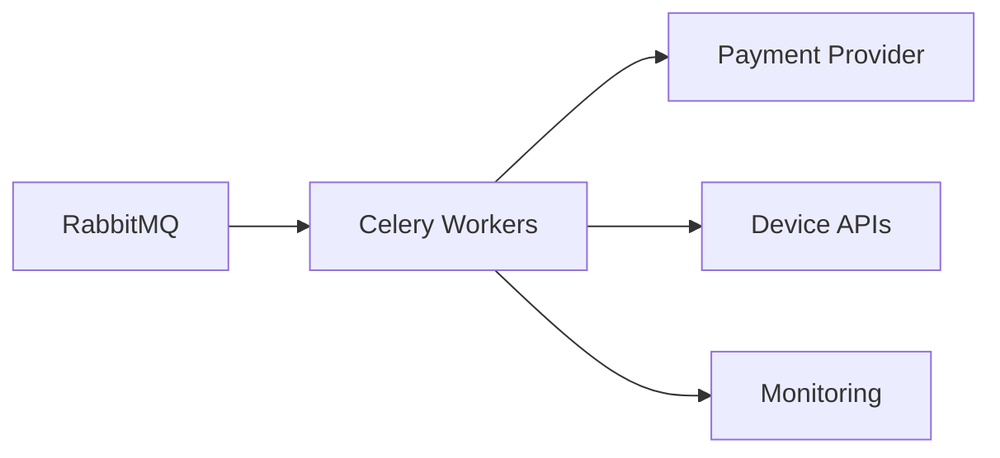
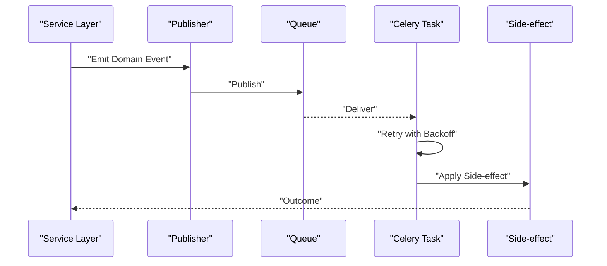
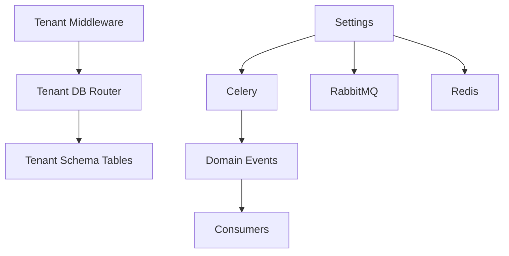

# System Integration & Communication

<cite>
**Referenced Files in This Document**
- [base.py](file://backend/config/settings/base.py)
- [celery.py](file://backend/config/celery.py)
- [DDD_OVERVIEW.md](file://backend/docs/architecture/DDD_OVERVIEW.md)
- [accounts/events.py](file://backend/apps/accounts/events.py)
- [alerts/events.py](file://backend/apps/alerts/events.py)
- [audit/events.py](file://backend/apps/audit/events.py)
- [notifications/events.py](file://backend/apps/notifications/events.py)
- [accounts/services.py](file://backend/apps/accounts/services.py)
- [alerts/services.py](file://backend/apps/alerts/services.py)
- [audit/services.py](file://backend/apps/audit/services.py)
- [notifications/services.py](file://backend/apps/notifications/services.py)
- [accounts/models.py](file://backend/apps/accounts/models.py)
- [alerts/models.py](file://backend/apps/alerts/models.py)
- [audit/models.py](file://backend/apps/audit/models.py)
- [notifications/models.py](file://backend/apps/notifications/models.py)
</cite>

## Table of Contents
1. [Introduction](#introduction)
2. [Project Structure](#project-structure)
3. [Core Components](#core-components)
4. [Architecture Overview](#architecture-overview)
5. [Detailed Component Analysis](#detailed-component-analysis)
6. [Dependency Analysis](#dependency-analysis)
7. [Performance Considerations](#performance-considerations)
8. [Troubleshooting Guide](#troubleshooting-guide)
9. [Conclusion](#conclusion)
10. [Appendices](#appendices)

## Introduction
This document explains the system integration patterns and inter-component communication in the PlantOps platform. It focuses on:
- Event-driven architecture using domain events for cross-context communication
- Message queue integration with RabbitMQ/Celery for asynchronous processing
- Notification system supporting multiple channels (email, SMS, push, in-app)
- Audit trail and compliance logging mechanisms
- External system integrations (payment processors, device manufacturers, monitoring)
- Practical examples of event publication/subscription patterns, error handling, and retry mechanisms
- Monitoring, health checks, and distributed tracing in a multi-tenant environment

## Project Structure
The system follows a multi-tenant Django architecture with bounded contexts (apps) organized per domain. Each context encapsulates models, services, selectors, events, and admin configuration. Cross-context communication is achieved via domain events and explicit service calls, not direct foreign keys.

**Diagram sources**
- [base.py:271-280](file://backend/config/settings/base.py#L271-L280)
- [celery.py:14](file://backend/config/celery.py#L14)
- [DDD_OVERVIEW.md:67-78](file://backend/docs/architecture/DDD_OVERVIEW.md#L67-L78)

**Section sources**
- [DDD_OVERVIEW.md:1-85](file://backend/docs/architecture/DDD_OVERVIEW.md#L1-L85)
- [base.py:44-94](file://backend/config/settings/base.py#L44-L94)

## Core Components
- Domain events: Lightweight data structures representing “something that happened” in a bounded context. Defined per context and intended for outbox-style publishing.
- Services layer: Write operations only; all mutations must go through services to maintain invariants and coordinate cross-context effects.
- Selectors layer: Read/query operations only; separation ensures predictable data access.
- Messaging: Celery configured with RabbitMQ broker and Redis result backend; tasks are auto-discovered from Django apps.
- Notifications: Centralized context for channel-agnostic notification delivery logs and templates.
- Audit: Append-only audit logs for compliance and traceability of manual actions.

**Section sources**
- [accounts/events.py:1-7](file://backend/apps/accounts/events.py#L1-L7)
- [alerts/events.py:1-7](file://backend/apps/alerts/events.py#L1-L7)
- [audit/events.py:1-7](file://backend/apps/audit/events.py#L1-L7)
- [notifications/events.py:1-7](file://backend/apps/notifications/events.py#L1-L7)
- [accounts/services.py:1-7](file://backend/apps/accounts/services.py#L1-L7)
- [alerts/services.py:1-9](file://backend/apps/alerts/services.py#L1-L9)
- [audit/services.py:1-9](file://backend/apps/audit/services.py#L1-L9)
- [notifications/services.py:1-7](file://backend/apps/notifications/services.py#L1-L7)

## Architecture Overview
The system employs a domain-driven design with bounded contexts and an event-driven integration layer. Each context publishes domain events when significant state changes occur. A message bus (RabbitMQ) transports these events asynchronously to consumers that apply side-effects or trigger downstream actions. Celery workers subscribe to queues and execute tasks. Multi-tenancy is enforced via tenant-aware schemas and middleware.

**Diagram sources**
- [base.py:107-119](file://backend/config/settings/base.py#L107-L119)
- [base.py:271-280](file://backend/config/settings/base.py#L271-L280)
- [celery.py:14](file://backend/config/celery.py#L14)

## Detailed Component Analysis

### Event-Driven Integration Pattern
- Domain events are defined per bounded context and represent immutable facts. They are not Django signals but lightweight data structures intended for eventual consistency.
- Producers publish events to the message bus; consumers subscribe and react by invoking services or orchestrating downstream steps.
- Example producers:
  - Accounts context publishes user-related events after profile changes.
  - Alerts context publishes alert creation events.
  - Audit context publishes manual-action events.
  - Notifications context publishes notification dispatch events.

**Diagram sources**
- [base.py:271-280](file://backend/config/settings/base.py#L271-L280)
- [celery.py:14](file://backend/config/celery.py#L14)

**Section sources**
- [accounts/events.py:1-7](file://backend/apps/accounts/events.py#L1-L7)
- [alerts/events.py:1-7](file://backend/apps/alerts/events.py#L1-L7)
- [audit/events.py:1-7](file://backend/apps/audit/events.py#L1-L7)
- [notifications/events.py:1-7](file://backend/apps/notifications/events.py#L1-L7)

### Message Queue Integration (RabbitMQ/Celery)
- Broker and backend configuration are environment-driven and centralized in settings.
- Celery app is initialized with Django settings and auto-discovers tasks from installed apps.
- Tasks can be bound to the worker lifecycle and executed asynchronously.

**Diagram sources**
- [base.py:271-280](file://backend/config/settings/base.py#L271-L280)
- [celery.py:14](file://backend/config/celery.py#L14)

**Section sources**
- [base.py:271-280](file://backend/config/settings/base.py#L271-L280)
- [celery.py:14](file://backend/config/celery.py#L14)

### Notification System (Email, SMS, Push, In-App)
- The notifications context owns channel-agnostic templates and delivery logs.
- Models indicate support for multiple channels and structured logging of delivery attempts and outcomes.
- Integration points:
  - Email: via configured email backend.
  - SMS: via provider SDK or HTTP client.
  - Push: via FCM/APNs or vendor SDK.
  - In-app: via internal messaging or real-time channels.

**Diagram sources**
- [notifications/models.py:12-23](file://backend/apps/notifications/models.py#L12-L23)

**Section sources**
- [notifications/models.py:1-28](file://backend/apps/notifications/models.py#L1-L28)
- [base.py:282-286](file://backend/config/settings/base.py#L282-L286)

### Audit Trail and Compliance Logging
- Audit logs are append-only and capture manual actions with actor, action type, target, and metadata.
- Services enforce write-only access to maintain immutability and integrity.
- Logging configuration centralizes handler and formatter definitions.

**Diagram sources**
- [audit/models.py:14-26](file://backend/apps/audit/models.py#L14-L26)
- [audit/services.py:1-9](file://backend/apps/audit/services.py#L1-L9)
- [base.py:288-325](file://backend/config/settings/base.py#L288-L325)

**Section sources**
- [audit/models.py:1-31](file://backend/apps/audit/models.py#L1-L31)
- [audit/services.py:1-9](file://backend/apps/audit/services.py#L1-L9)
- [base.py:288-325](file://backend/config/settings/base.py#L288-L325)

### External System Integrations
- Payment processors: Integrate via provider SDKs or HTTP clients; orchestrate in Celery tasks.
- Device manufacturer APIs: Poll or receive telemetry via HTTP/webhook; transform and normalize into domain events.
- Monitoring: Configure metrics and traces; wire Celery and Django to reporting systems.

**Diagram sources**
- [base.py:271-280](file://backend/config/settings/base.py#L271-L280)
- [celery.py:14](file://backend/config/celery.py#L14)

**Section sources**
- [base.py:271-280](file://backend/config/settings/base.py#L271-L280)

### Practical Patterns: Publication/Subscription and Retry
- Publication: A service mutation triggers a domain event; the producer serializes and publishes to a named exchange/queue.
- Subscription: A Celery task consumes the event, validates payload, and applies side-effects.
- Retry: Use Celery’s built-in retry/backoff policies for transient failures; ensure idempotency in handlers.

**Diagram sources**
- [base.py:271-280](file://backend/config/settings/base.py#L271-L280)
- [celery.py:14](file://backend/config/celery.py#L14)

**Section sources**
- [base.py:271-280](file://backend/config/settings/base.py#L271-L280)

## Dependency Analysis
- Tenant isolation: Middleware and database routers ensure tenant-aware routing and schema separation.
- Messaging dependencies: Celery depends on RabbitMQ for transport and Redis for results; settings drive configuration.
- Cross-context coupling: Enforced by design—no direct foreign keys; only IDs and events are shared.

**Diagram sources**
- [base.py:107-119](file://backend/config/settings/base.py#L107-L119)
- [base.py:102](file://backend/config/settings/base.py#L102)
- [base.py:271-280](file://backend/config/settings/base.py#L271-L280)

**Section sources**
- [base.py:102](file://backend/config/settings/base.py#L102)
- [base.py:107-119](file://backend/config/settings/base.py#L107-L119)
- [base.py:271-280](file://backend/config/settings/base.py#L271-L280)

## Performance Considerations
- Asynchronous processing: Offload long-running tasks to Celery workers to keep request paths responsive.
- Idempotency: Design event handlers to tolerate duplicates and reprocessing.
- Serialization: Use JSON serialization consistently across broker and backend.
- Monitoring: Track queue lengths, task durations, and failure rates; scale workers horizontally.

## Troubleshooting Guide
- Event delivery failures:
  - Verify broker connectivity and queue bindings.
  - Inspect Celery logs and task routing.
- Retry and dead-letter handling:
  - Configure retry policies and DLQ routing.
- Audit and compliance:
  - Confirm append-only enforcement and immutability.
  - Validate logging configuration and retention.
- Multi-tenancy:
  - Ensure tenant middleware is active and schema routing is correct.

**Section sources**
- [base.py:288-325](file://backend/config/settings/base.py#L288-L325)
- [base.py:271-280](file://backend/config/settings/base.py#L271-L280)

## Conclusion
The PlantOps platform integrates domain-driven bounded contexts with an event-driven architecture and asynchronous messaging. RabbitMQ and Celery enable scalable, decoupled processing, while the notifications and audit contexts provide robust cross-cutting capabilities. Multi-tenancy, compliance logging, and extensibility for external systems form a cohesive foundation for a multi-tenant SaaS environment.

## Appendices
- Event definitions per context:
  - Accounts: [accounts/events.py:1-7](file://backend/apps/accounts/events.py#L1-L7)
  - Alerts: [alerts/events.py:1-7](file://backend/apps/alerts/events.py#L1-L7)
  - Audit: [audit/events.py:1-7](file://backend/apps/audit/events.py#L1-L7)
  - Notifications: [notifications/events.py:1-7](file://backend/apps/notifications/events.py#L1-L7)
- Services enforcing write-only access:
  - Accounts: [accounts/services.py:1-7](file://backend/apps/accounts/services.py#L1-L7)
  - Alerts: [alerts/services.py:1-9](file://backend/apps/alerts/services.py#L1-L9)
  - Audit: [audit/services.py:1-9](file://backend/apps/audit/services.py#L1-L9)
  - Notifications: [notifications/services.py:1-7](file://backend/apps/notifications/services.py#L1-L7)
- Models indicating future fields and append-only semantics:
  - Accounts: [accounts/models.py:1-30](file://backend/apps/accounts/models.py#L1-L30)
  - Alerts: [alerts/models.py:1-29](file://backend/apps/alerts/models.py#L1-L29)
  - Audit: [audit/models.py:1-31](file://backend/apps/audit/models.py#L1-L31)
  - Notifications: [notifications/models.py:1-28](file://backend/apps/notifications/models.py#L1-L28)
- Architecture overview:
  - [DDD_OVERVIEW.md:1-85](file://backend/docs/architecture/DDD_OVERVIEW.md#L1-L85)