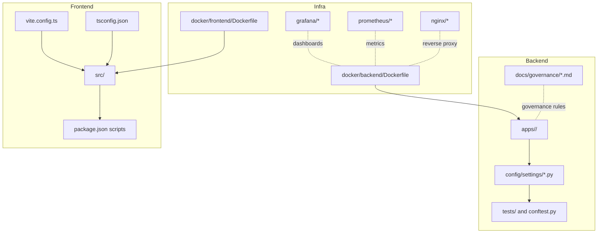
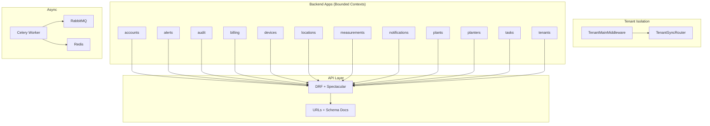
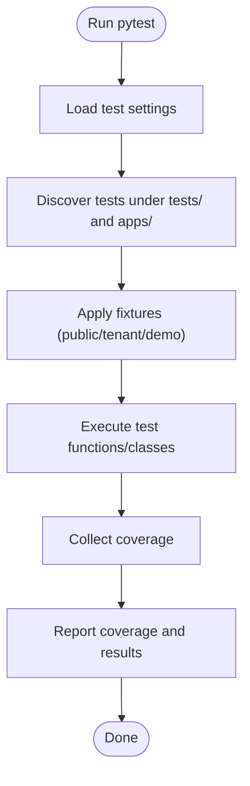
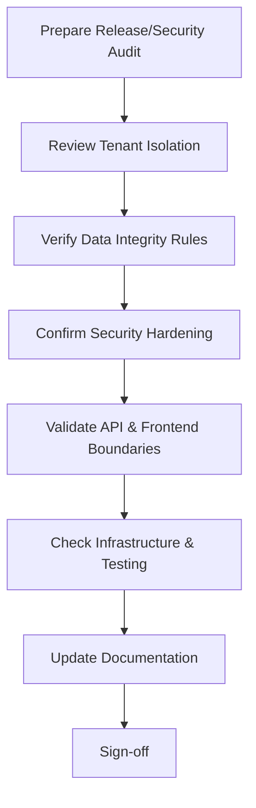
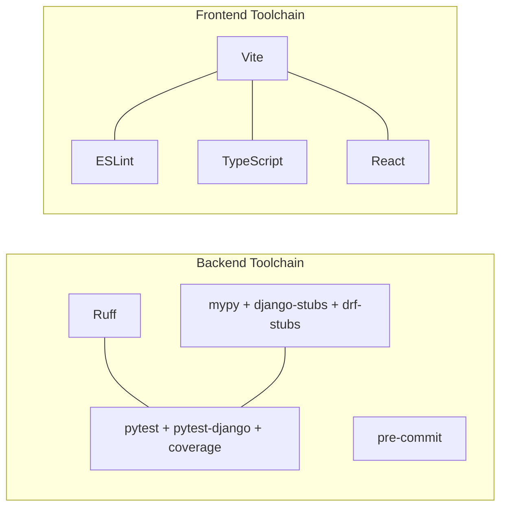

# Contributing & Development

<cite>
**Referenced Files in This Document**
- [README.md](file://README.md)
- [pyproject.toml](file://backend/pyproject.toml)
- [package.json](file://frontend/package.json)
- [tsconfig.json](file://frontend/tsconfig.json)
- [vite.config.ts](file://frontend/vite.config.ts)
- [base.py](file://backend/config/settings/base.py)
- [local.py](file://backend/config/settings/local.py)
- [test.py](file://backend/config/settings/test.py)
- [urls.py](file://backend/config/urls.py)
- [celery.py](file://backend/config/celery.py)
- [conftest.py](file://backend/tests/conftest.py)
- [RULES.md](file://backend/docs/governance/RULES.md)
- [AUDIT_CHECKLIST.md](file://backend/docs/governance/AUDIT_CHECKLIST.md)
</cite>

## Table of Contents
1. [Introduction](#introduction)
2. [Project Structure](#project-structure)
3. [Core Components](#core-components)
4. [Architecture Overview](#architecture-overview)
5. [Detailed Component Analysis](#detailed-component-analysis)
6. [Dependency Analysis](#dependency-analysis)
7. [Performance Considerations](#performance-considerations)
8. [Troubleshooting Guide](#troubleshooting-guide)
9. [Conclusion](#conclusion)
10. [Appendices](#appendices)

## Introduction
This document defines the end-to-end contributing and development workflow for the PlantOps/PlanterOps SaaS project. It covers development environment setup, branch and commit conventions, pull request and code review processes, code standards and formatting, testing strategy, audit and quality gates, release procedures, and onboarding for new contributors. The guidance is grounded in the repository’s existing configuration and governance documents.

## Project Structure
The repository is organized into three primary areas:
- backend: Django-based multi-tenant SaaS with bounded contexts per app, settings per environment, and governance documentation.
- frontend: React + TypeScript + Vite application with strict TypeScript configuration and ESLint-based linting.
- infra: Dockerfiles and orchestration for backend and frontend, plus monitoring and reverse proxy.

**Section sources**
- [README.md:131-194](file://README.md#L131-L194)

## Core Components
- Backend development workflow and toolchain are defined via pyproject configuration:
  - Linting and formatting with Ruff
  - Type checking with mypy and django-stubs
  - Testing with pytest, pytest-django, coverage
  - Pre-commit hooks support
- Frontend toolchain:
  - Build with Vite
  - Linting with ESLint and TypeScript compiler checks
  - Strict TypeScript configuration
- Governance and quality:
  - Non-negotiable rules for tenant isolation, service/selector layers, audit, and security
  - Release and security audit checklist

**Section sources**
- [pyproject.toml:114-215](file://backend/pyproject.toml#L114-L215)
- [package.json:1-33](file://frontend/package.json#L1-L33)
- [tsconfig.json:1-26](file://frontend/tsconfig.json#L1-L26)
- [RULES.md:1-70](file://backend/docs/governance/RULES.md#L1-L70)
- [AUDIT_CHECKLIST.md:1-66](file://backend/docs/governance/AUDIT_CHECKLIST.md#L1-L66)

## Architecture Overview
The system follows a multi-tenant Django architecture with bounded contexts per app. The backend enforces tenant isolation, service-layer writes, selector-layer reads, and audit logging. The frontend is split between HTMX/Django templates for admin and CRUD, and React/Vite for dashboards and analytics. Celery handles async tasks with RabbitMQ and Redis.

**Diagram sources**
- [base.py:107-119](file://backend/config/settings/base.py#L107-L119)
- [base.py:102](file://backend/config/settings/base.py#L102)
- [urls.py:12-38](file://backend/config/urls.py#L12-L38)
- [celery.py:14-21](file://backend/config/celery.py#L14-L21)

**Section sources**
- [base.py:44-94](file://backend/config/settings/base.py#L44-L94)
- [base.py:107-119](file://backend/config/settings/base.py#L107-L119)
- [urls.py:12-38](file://backend/config/urls.py#L12-L38)
- [celery.py:14-21](file://backend/config/celery.py#L14-L21)

## Detailed Component Analysis

### Development Workflow and Branching
- Branching strategy:
  - Use feature branches prefixed with concise, hyphenated names (e.g., feature/user-authentication).
  - Keep branches small and focused; open pull requests early for visibility.
- Commit conventions:
  - Use imperative mood and concise messages; group related changes.
  - Reference issues by number in the footer of the commit message.
- Pull requests:
  - Include a brief description, links to related issues, and testing notes.
  - Ensure CI passes and code review approval before merging.
  - Squash or rebase commits prior to merge to maintain a clean history.

[No sources needed since this section provides general guidance]

### Code Standards and Formatting

#### Python (Backend)
- Linting and formatting:
  - Ruff is configured for lint selection, formatting style, and exclusions.
  - Line length limit and Google-style docstring convention are enforced.
- Type checking:
  - mypy is configured with django-stubs and drf-stubs plugins.
- Pre-commit:
  - Pre-commit hooks are supported via optional-dependency.

**Section sources**
- [pyproject.toml:116-156](file://backend/pyproject.toml#L116-L156)
- [pyproject.toml:204-215](file://backend/pyproject.toml#L204-L215)

#### TypeScript (Frontend)
- Linting:
  - ESLint runs with TypeScript parser and plugins; max warnings disabled.
- Formatting:
  - Use the editor’s formatter or CLI to keep code consistent.
- Strictness:
  - Strict TypeScript compiler options are enabled.

**Section sources**
- [package.json:9](file://frontend/package.json#L9)
- [tsconfig.json:14-17](file://frontend/tsconfig.json#L14-L17)

### Testing Strategy

#### Backend (Python)
- Test runner and configuration:
  - pytest with pytest-django; markers for slow and integration tests.
  - Test discovery under tests/ and apps/.
- Coverage:
  - Coverage runs against apps and config; excludes migrations, admin, and selected files.
- Fixtures:
  - conftest provides tenant fixtures for shared and tenant schemas and tenant context fixture.

**Diagram sources**
- [pyproject.toml:160-175](file://backend/pyproject.toml#L160-L175)
- [pyproject.toml:179-200](file://backend/pyproject.toml#L179-L200)
- [conftest.py:12-49](file://backend/tests/conftest.py#L12-L49)

**Section sources**
- [pyproject.toml:160-175](file://backend/pyproject.toml#L160-L175)
- [pyproject.toml:179-200](file://backend/pyproject.toml#L179-L200)
- [conftest.py:12-49](file://backend/tests/conftest.py#L12-L49)

#### Frontend (TypeScript)
- Linting:
  - Run ESLint with the provided script; fix reported issues.
- Build-time checks:
  - TypeScript compilation is part of the build pipeline.

**Section sources**
- [package.json:9](file://frontend/package.json#L9)
- [tsconfig.json:1-26](file://frontend/tsconfig.json#L1-L26)

### Audit Checklist and Quality Gates
- Pre-release and security audit checklist ensures:
  - Tenant isolation correctness, data integrity, security hardening, API configuration, frontend boundaries, infrastructure hardening, testing coverage, and documentation currency.
- Governance rules define mandatory architectural and operational constraints that must be validated during reviews.

**Diagram sources**
- [AUDIT_CHECKLIST.md:1-66](file://backend/docs/governance/AUDIT_CHECKLIST.md#L1-L66)
- [RULES.md:1-70](file://backend/docs/governance/RULES.md#L1-L70)

**Section sources**
- [AUDIT_CHECKLIST.md:1-66](file://backend/docs/governance/AUDIT_CHECKLIST.md#L1-L66)
- [RULES.md:1-70](file://backend/docs/governance/RULES.md#L1-L70)

### Development Environment Setup

#### Backend (Docker)
- Quick start steps:
  - Copy environment file, build and start services, access endpoints.
- Local development:
  - Install uv, sync dependencies, set environment variables, run migrations for shared and tenant schemas, optionally create a superuser, and run the development server.

**Section sources**
- [README.md:12-80](file://README.md#L12-L80)

#### Backend (Local)
- Environment variables:
  - Secret key, debug, database, broker, and result backend are configured via environment variables.
- Settings:
  - Base settings define multi-tenancy, middleware order, installed apps, and DRF defaults.
  - Local settings enable debug toolbar and development-specific logging.
  - Test settings configure an isolated test database and disable Celery for speed.

**Section sources**
- [base.py:32-36](file://backend/config/settings/base.py#L32-L36)
- [base.py:155-164](file://backend/config/settings/base.py#L155-L164)
- [local.py:5-42](file://backend/config/settings/local.py#L5-L42)
- [test.py:14-59](file://backend/config/settings/test.py#L14-L59)

#### Frontend
- Dependencies and scripts:
  - Install dependencies and run dev server; build pipeline includes TypeScript compilation.
- Proxy and build:
  - Vite proxy routes API calls to the backend; build outputs sourcemaps.

**Section sources**
- [package.json:6-11](file://frontend/package.json#L6-L11)
- [vite.config.ts:15-20](file://frontend/vite.config.ts#L15-L20)
- [vite.config.ts:22-26](file://frontend/vite.config.ts#L22-L26)

### Debugging Procedures and Local Testing Methodologies
- Backend:
  - Use Django Debug Toolbar in local development; adjust logging levels for deeper insight.
  - Run tests with pytest; leverage fixtures for tenant-aware scenarios.
- Frontend:
  - Use Vite dev server; run ESLint to catch issues early; inspect sourcemaps in browser.

**Section sources**
- [local.py:19-41](file://backend/config/settings/local.py#L19-L41)
- [conftest.py:12-49](file://backend/tests/conftest.py#L12-L49)
- [package.json:9](file://frontend/package.json#L9)
- [vite.config.ts:22-26](file://frontend/vite.config.ts#L22-L26)

### Contribution Guidelines, Issues, and Feature Requests
- Contribution guidelines:
  - Follow branch and commit conventions; open pull requests early; ensure tests and linting pass.
- Issue reporting:
  - Provide clear reproduction steps, environment details, and expected vs. actual behavior.
- Feature requests:
  - Describe the problem statement, proposed solution, and acceptance criteria; link to related issues.

[No sources needed since this section provides general guidance]

### Onboarding and Mentorship Resources
- New contributor onboarding:
  - Review the quick start guides, environment setup, and governance rules.
  - Understand the multi-tenant architecture, bounded contexts, and service/selector layers.
- Mentorship:
  - Pair with a senior contributor for code review feedback and architectural guidance.

[No sources needed since this section provides general guidance]

### Release Procedures, Versioning, and Changelog Maintenance
- Versioning:
  - Semantic versioning aligned with project metadata.
- Release checklist:
  - Validate governance rules and audit checklist; confirm tests and coverage; update documentation; tag and publish artifacts.
- Changelog:
  - Maintain a changelog capturing breaking changes, features, fixes, and deprecations.

[No sources needed since this section provides general guidance]

## Dependency Analysis
Backend and frontend toolchains are configured independently but integrate at runtime:
- Backend: Ruff, mypy, pytest, coverage, pre-commit
- Frontend: Vite, ESLint, TypeScript, React

**Diagram sources**
- [pyproject.toml:83](file://backend/pyproject.toml#L83)
- [pyproject.toml:88-90](file://backend/pyproject.toml#L88-L90)
- [pyproject.toml:74-78](file://backend/pyproject.toml#L74-L78)
- [pyproject.toml:94](file://backend/pyproject.toml#L94)
- [package.json:20-31](file://frontend/package.json#L20-L31)

**Section sources**
- [pyproject.toml:70-101](file://backend/pyproject.toml#L70-L101)
- [package.json:20-31](file://frontend/package.json#L20-L31)

## Performance Considerations
- Prefer selector-layer reads and service-layer writes to minimize ORM misuse and improve testability.
- Use integration tests sparingly; rely on unit tests and fixtures for speed.
- Keep frontend strict TypeScript settings to catch performance-related type issues early.

[No sources needed since this section provides general guidance]

## Troubleshooting Guide
- Tenant isolation failures:
  - Verify middleware order and router configuration; ensure tenant context is used in background tasks.
- Test failures:
  - Confirm test settings and in-memory database configuration; ensure fixtures are applied.
- Frontend build issues:
  - Reinstall dependencies; run ESLint; check Vite proxy configuration.

**Section sources**
- [base.py:107-119](file://backend/config/settings/base.py#L107-L119)
- [base.py:102](file://backend/config/settings/base.py#L102)
- [test.py:14-59](file://backend/config/settings/test.py#L14-L59)
- [conftest.py:12-49](file://backend/tests/conftest.py#L12-L49)
- [vite.config.ts:15-20](file://frontend/vite.config.ts#L15-L20)

## Conclusion
This guide consolidates the project’s development practices, governance rules, and quality gates into a single reference. By adhering to the outlined workflows, standards, and review processes, contributors can collaborate effectively while maintaining high code quality and system reliability.

## Appendices

### Backend Settings Reference
- Base settings define multi-tenancy, middleware, installed apps, DRF defaults, CORS, Celery, and logging.
- Local settings enable development tooling and logging adjustments.
- Test settings isolate the test database and optimize test execution.

**Section sources**
- [base.py:44-94](file://backend/config/settings/base.py#L44-L94)
- [base.py:107-119](file://backend/config/settings/base.py#L107-L119)
- [base.py:234-262](file://backend/config/settings/base.py#L234-L262)
- [base.py:267-280](file://backend/config/settings/base.py#L267-L280)
- [base.py:289-325](file://backend/config/settings/base.py#L289-L325)
- [local.py:5-42](file://backend/config/settings/local.py#L5-L42)
- [test.py:14-59](file://backend/config/settings/test.py#L14-L59)

### API Documentation and Schema
- API schema and documentation endpoints are exposed via drf-spectacular; ensure authentication is configured.

**Section sources**
- [urls.py:21-23](file://backend/config/urls.py#L21-L23)
- [base.py:234-262](file://backend/config/settings/base.py#L234-L262)