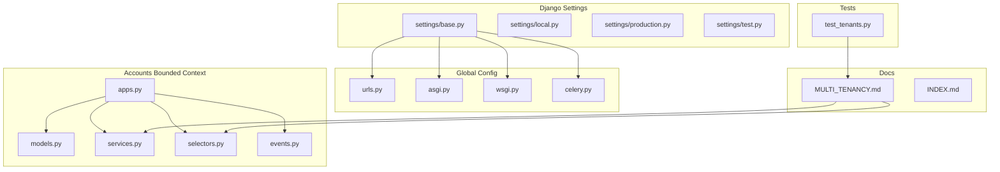
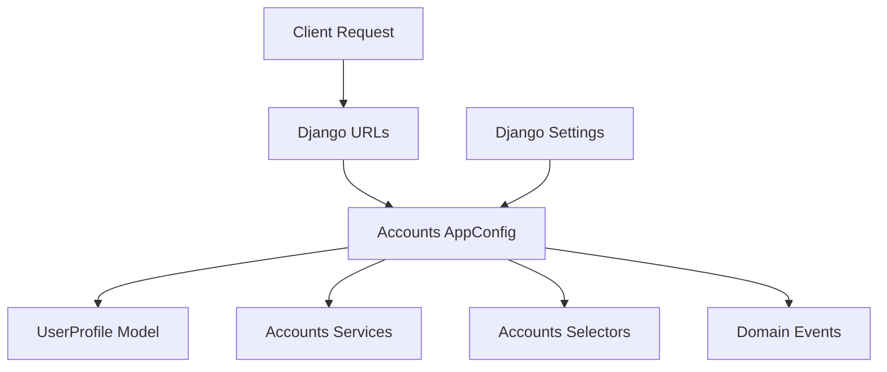
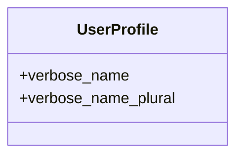
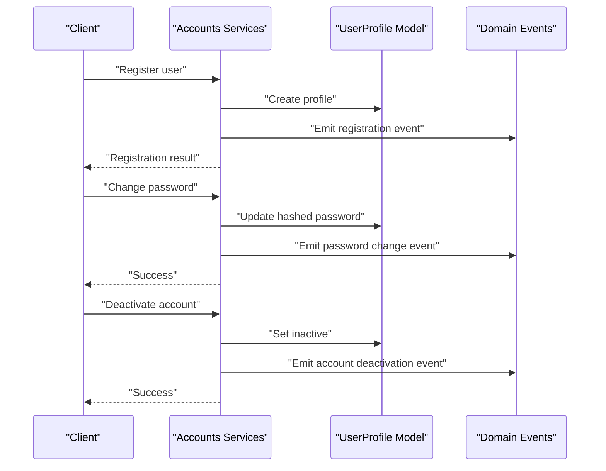
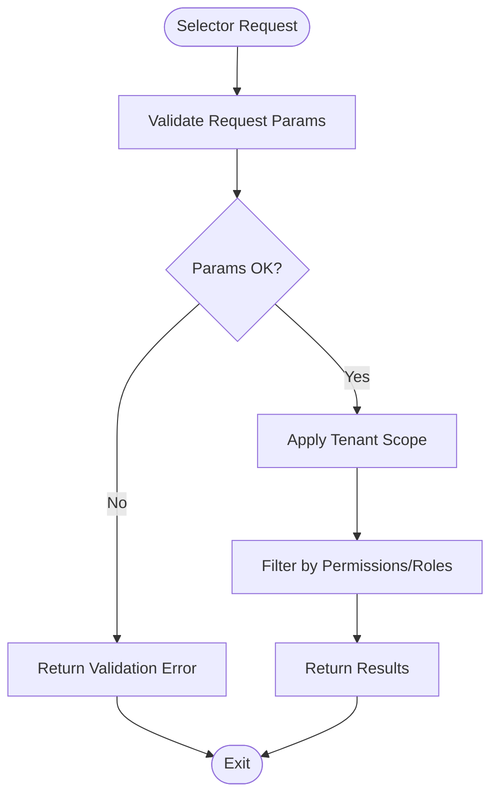
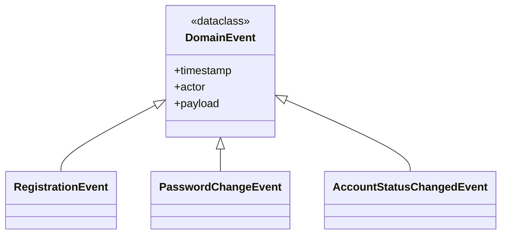
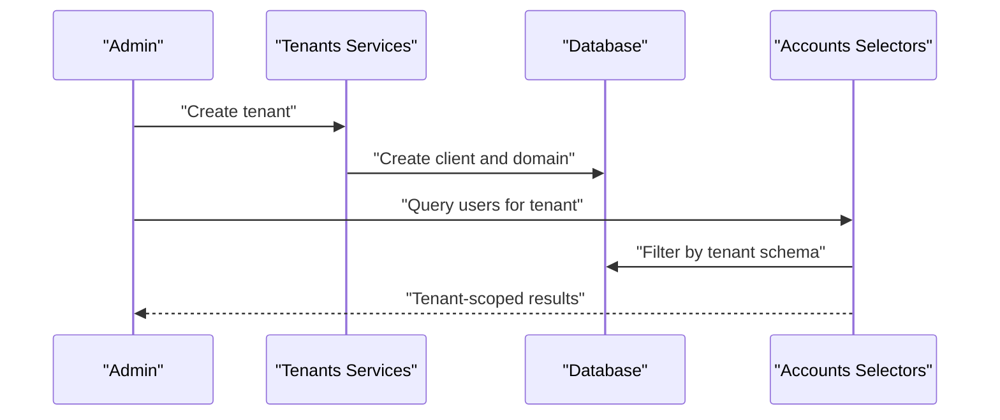
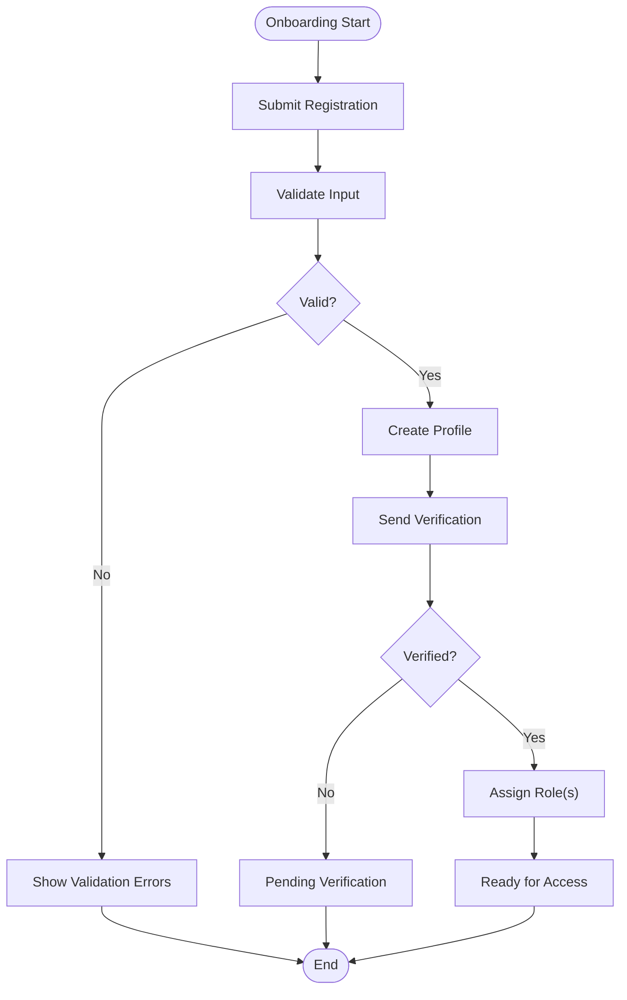
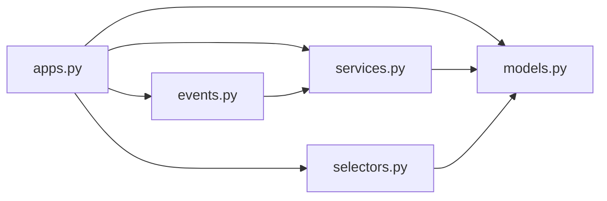

# Account Management

<cite>
**Referenced Files in This Document**
- [models.py](file://backend/apps/accounts/models.py)
- [services.py](file://backend/apps/accounts/services.py)
- [selectors.py](file://backend/apps/accounts/selectors.py)
- [events.py](file://backend/apps/accounts/events.py)
- [apps.py](file://backend/apps/accounts/apps.py)
- [settings/base.py](file://backend/config/settings/base.py)
- [settings/local.py](file://backend/config/settings/local.py)
- [settings/production.py](file://backend/config/settings/production.py)
- [settings/test.py](file://backend/config/settings/test.py)
- [urls.py](file://backend/config/urls.py)
- [asgi.py](file://backend/config/asgi.py)
- [wsgi.py](file://backend/config/wsgi.py)
- [celery.py](file://backend/config/celery.py)
- [MULTI_TENANCY.md](file://backend/docs/architecture/MULTI_TENANCY.md)
- [INDEX.md](file://backend/docs/INDEX.md)
- [test_tenants.py](file://backend/tests/test_tenants.py)
</cite>

## Table of Contents
1. [Introduction](#introduction)
2. [Project Structure](#project-structure)
3. [Core Components](#core-components)
4. [Architecture Overview](#architecture-overview)
5. [Detailed Component Analysis](#detailed-component-analysis)
6. [Dependency Analysis](#dependency-analysis)
7. [Performance Considerations](#performance-considerations)
8. [Troubleshooting Guide](#troubleshooting-guide)
9. [Conclusion](#conclusion)
10. [Appendices](#appendices)

## Introduction
This document describes the Account Management domain responsible for user authentication, authorization, and user profile management within a single tenant. It documents the User entity model, authentication credentials, profile information, and role assignments. It also explains user registration and verification processes via the account service layer, user management operations (profile updates, password changes, account deactivation), selector patterns for queries and role-based access control, domain events for user lifecycle management, and security considerations including password policies and audit trail requirements. Multi-tenant user isolation is addressed through tenant scoping and schema separation.

## Project Structure
The Account Management domain resides in the accounts bounded context under backend/apps/accounts. It follows a clean architecture with separate concerns for models, services (write operations), selectors (read operations), and domain events. The Django application configuration is defined in apps.py, while global settings and configuration are located under backend/config/settings. Multi-tenant isolation is documented in backend/docs/architecture/MULTI_TENANCY.md.

**Diagram sources**
- [apps.py:1-12](file://backend/apps/accounts/apps.py#L1-L12)
- [models.py:1-30](file://backend/apps/accounts/models.py#L1-L30)
- [services.py:1-7](file://backend/apps/accounts/services.py#L1-L7)
- [selectors.py:1-7](file://backend/apps/accounts/selectors.py#L1-L7)
- [events.py:1-7](file://backend/apps/accounts/events.py#L1-L7)
- [settings/base.py](file://backend/config/settings/base.py)
- [settings/local.py](file://backend/config/settings/local.py)
- [settings/production.py](file://backend/config/settings/production.py)
- [settings/test.py](file://backend/config/settings/test.py)
- [urls.py](file://backend/config/urls.py)
- [asgi.py](file://backend/config/asgi.py)
- [wsgi.py](file://backend/config/wsgi.py)
- [celery.py](file://backend/config/celery.py)
- [MULTI_TENANCY.md](file://backend/docs/architecture/MULTI_TENANCY.md)
- [INDEX.md](file://backend/docs/INDEX.md)
- [test_tenants.py:1-50](file://backend/tests/test_tenants.py#L1-L50)

**Section sources**
- [apps.py:1-12](file://backend/apps/accounts/apps.py#L1-L12)
- [models.py:1-30](file://backend/apps/accounts/models.py#L1-L30)
- [services.py:1-7](file://backend/apps/accounts/services.py#L1-L7)
- [selectors.py:1-7](file://backend/apps/accounts/selectors.py#L1-L7)
- [events.py:1-7](file://backend/apps/accounts/events.py#L1-L7)
- [settings/base.py](file://backend/config/settings/base.py)
- [settings/local.py](file://backend/config/settings/local.py)
- [settings/production.py](file://backend/config/settings/production.py)
- [settings/test.py](file://backend/config/settings/test.py)
- [urls.py](file://backend/config/urls.py)
- [asgi.py](file://backend/config/asgi.py)
- [wsgi.py](file://backend/config/wsgi.py)
- [celery.py](file://backend/config/celery.py)
- [MULTI_TENANCY.md](file://backend/docs/architecture/MULTI_TENANCY.md)
- [INDEX.md](file://backend/docs/INDEX.md)
- [test_tenants.py:1-50](file://backend/tests/test_tenants.py#L1-L50)

## Core Components
- User Entity Model: The current UserProfile model serves as a placeholder for tenant-scoped user profile attributes (role, contact info, preferences). It is marked as non-abstract and intended to evolve into a full user profile entity.
- Services Layer: The accounts services module defines the authoritative write operations boundary for user/profile mutations, ensuring all state changes are channeled through this layer.
- Selectors Layer: The accounts selectors module centralizes read logic for user/profile queries, enabling testability and consistent access patterns.
- Domain Events: The accounts events module defines lightweight domain events representing significant user lifecycle actions; these are distinct from Django signals.
- Application Configuration: The accounts Django app configuration is defined in apps.py.

**Section sources**
- [models.py:15-30](file://backend/apps/accounts/models.py#L15-L30)
- [services.py:1-7](file://backend/apps/accounts/services.py#L1-L7)
- [selectors.py:1-7](file://backend/apps/accounts/selectors.py#L1-L7)
- [events.py:1-7](file://backend/apps/accounts/events.py#L1-L7)
- [apps.py:5-12](file://backend/apps/accounts/apps.py#L5-L12)

## Architecture Overview
The Account Management domain adheres to a layered architecture:
- Application Layer: Django URLs and configuration integrate the accounts app into the platform.
- Domain Layer: Models define the user profile entity; services encapsulate write operations; selectors encapsulate read operations; events represent domain actions.
- Infrastructure Layer: Settings and deployment configurations (ASGI, WSGI, Celery) support the domain runtime.

**Diagram sources**
- [apps.py:1-12](file://backend/apps/accounts/apps.py#L1-L12)
- [models.py:15-30](file://backend/apps/accounts/models.py#L15-L30)
- [services.py:1-7](file://backend/apps/accounts/services.py#L1-L7)
- [selectors.py:1-7](file://backend/apps/accounts/selectors.py#L1-L7)
- [events.py:1-7](file://backend/apps/accounts/events.py#L1-L7)
- [urls.py](file://backend/config/urls.py)
- [settings/base.py](file://backend/config/settings/base.py)

## Detailed Component Analysis

### User Entity Model
- Purpose: Tenant-scoped user profile placeholder with room for role, contact, preferences, and localization.
- Current State: Non-abstract model; intended to evolve into a full user profile entity.
- Multi-Tenant Implication: Profiles are scoped to a tenant via schema separation and tenant-aware queries.

**Diagram sources**
- [models.py:15-30](file://backend/apps/accounts/models.py#L15-L30)

**Section sources**
- [models.py:15-30](file://backend/apps/accounts/models.py#L15-L30)

### Services Layer (Write Operations)
- Purpose: Enforce a single canonical path for user/profile mutations.
- Responsibilities: Registration, verification, profile updates, password changes, account deactivation.
- Security Controls: Password hashing, validation, and tenant scoping.
- Audit Trail: Emit domain events for lifecycle actions.

**Diagram sources**
- [services.py:1-7](file://backend/apps/accounts/services.py#L1-L7)
- [models.py:15-30](file://backend/apps/accounts/models.py#L15-L30)
- [events.py:1-7](file://backend/apps/accounts/events.py#L1-L7)

**Section sources**
- [services.py:1-7](file://backend/apps/accounts/services.py#L1-L7)

### Selectors Layer (Read Operations)
- Purpose: Centralize user/profile queries and enforce tenant scoping.
- Responsibilities: Permission checks, role-based access control, and multi-tenant isolation.
- Patterns: Query builders, filters by tenant, and permission inheritance resolution.

**Diagram sources**
- [selectors.py:1-7](file://backend/apps/accounts/selectors.py#L1-L7)

**Section sources**
- [selectors.py:1-7](file://backend/apps/accounts/selectors.py#L1-L7)

### Domain Events
- Purpose: Represent user lifecycle actions without tying to Django signals.
- Examples: Registration, login attempts, password changes, account status changes.
- Usage: Services emit events after successful mutations; downstream systems can react (notifications, audit logs).

**Diagram sources**
- [events.py:1-7](file://backend/apps/accounts/events.py#L1-L7)

**Section sources**
- [events.py:1-7](file://backend/apps/accounts/events.py#L1-L7)

### Multi-Tenant User Isolation
- Schema Separation: Tenant data is isolated via separate database schemas.
- Tenant-Aware Queries: Selectors apply tenant filters to prevent cross-tenant access.
- Tenant Provisioning: Tenant creation and deactivation are handled in the tenants bounded context.

**Diagram sources**
- [test_tenants.py:1-50](file://backend/tests/test_tenants.py#L1-L50)
- [MULTI_TENANCY.md](file://backend/docs/architecture/MULTI_TENANCY.md)

**Section sources**
- [test_tenants.py:1-50](file://backend/tests/test_tenants.py#L1-L50)
- [MULTI_TENANCY.md](file://backend/docs/architecture/MULTI_TENANCY.md)

### User Onboarding Flows
- Registration: Client submits registration; services validate and create a user profile; emit registration event.
- Verification: Optional email verification step; update profile status upon verification.
- Role Assignment: Assign initial roles (e.g., gardener/expert/admin) based on tenant configuration.
- Permission Inheritance: Resolve effective permissions from roles and explicit grants.

**Diagram sources**
- [services.py:1-7](file://backend/apps/accounts/services.py#L1-L7)
- [events.py:1-7](file://backend/apps/accounts/events.py#L1-L7)

**Section sources**
- [services.py:1-7](file://backend/apps/accounts/services.py#L1-L7)
- [events.py:1-7](file://backend/apps/accounts/events.py#L1-L7)

## Dependency Analysis
- Accounts app depends on Django’s ORM and internationalization framework.
- Services and selectors depend on the UserProfile model.
- Domain events are decoupled from Django signals, promoting testability.
- Multi-tenant isolation relies on tenant services and schema separation.

**Diagram sources**
- [apps.py:1-12](file://backend/apps/accounts/apps.py#L1-L12)
- [models.py:15-30](file://backend/apps/accounts/models.py#L15-L30)
- [services.py:1-7](file://backend/apps/accounts/services.py#L1-L7)
- [selectors.py:1-7](file://backend/apps/accounts/selectors.py#L1-L7)
- [events.py:1-7](file://backend/apps/accounts/events.py#L1-L7)

**Section sources**
- [apps.py:1-12](file://backend/apps/accounts/apps.py#L1-L12)
- [models.py:15-30](file://backend/apps/accounts/models.py#L15-L30)
- [services.py:1-7](file://backend/apps/accounts/services.py#L1-L7)
- [selectors.py:1-7](file://backend/apps/accounts/selectors.py#L1-L7)
- [events.py:1-7](file://backend/apps/accounts/events.py#L1-L7)

## Performance Considerations
- Query Efficiency: Use selective field retrieval and pagination in selectors to minimize payload sizes.
- Indexing: Add database indexes on frequently queried fields (e.g., tenant identifiers, usernames).
- Caching: Cache permission sets and role hierarchies per user to reduce repeated computation.
- Event Processing: Offload heavy event handlers to background tasks via Celery.

## Troubleshooting Guide
- Authentication Failures: Verify password hashing and salt usage in services; confirm event emission for failed login attempts.
- Authorization Issues: Ensure selectors apply tenant scope and permission filters; check role-to-permission mapping.
- Multi-Tenant Confusion: Confirm tenant-aware queries and schema boundaries; validate tenant provisioning and deactivation flows.
- Audit Gaps: Ensure domain events capture all lifecycle actions; integrate with audit services for persistent trails.

## Conclusion
The Account Management domain establishes a clear separation of concerns with services, selectors, models, and domain events. While the current UserProfile model is a placeholder, the architecture supports secure, tenant-scoped user management with robust authorization and audit capabilities. Evolving the model to include authentication credentials, profile fields, and role assignments will complete the domain’s capability set.

## Appendices

### Security Considerations
- Password Policies: Enforce strong passwords, hashing with salt, and periodic rotation.
- Session Management: Secure session cookies and logout mechanisms.
- Rate Limiting: Protect registration and login endpoints from abuse.
- Data Protection: Encrypt sensitive fields at rest and in transit.

### Audit Trail Requirements
- Event Logging: Capture all user lifecycle events with timestamps and actor context.
- Compliance: Store events for retention periods per policy; enable searchable logs.

### Configuration References
- Base Settings: [settings/base.py](file://backend/config/settings/base.py)
- Local Settings: [settings/local.py](file://backend/config/settings/local.py)
- Production Settings: [settings/production.py](file://backend/config/settings/production.py)
- Test Settings: [settings/test.py](file://backend/config/settings/test.py)
- Global URLs: [urls.py](file://backend/config/urls.py)
- ASGI: [asgi.py](file://backend/config/asgi.py)
- WSGI: [wsgi.py](file://backend/config/wsgi.py)
- Celery: [celery.py](file://backend/config/celery.py)