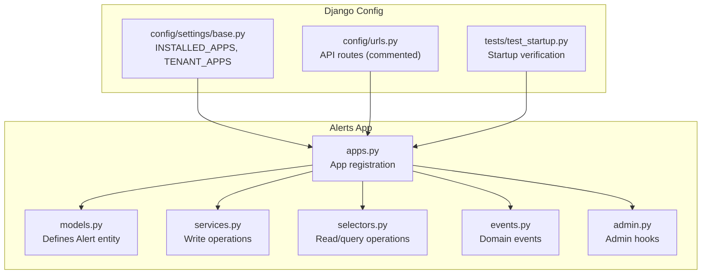
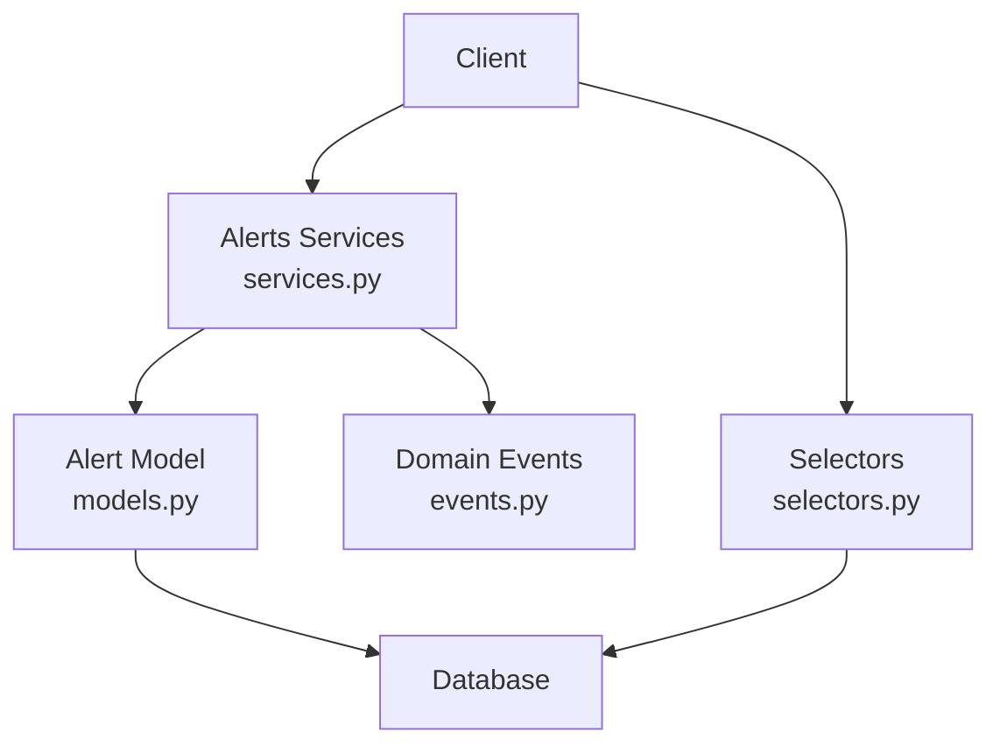
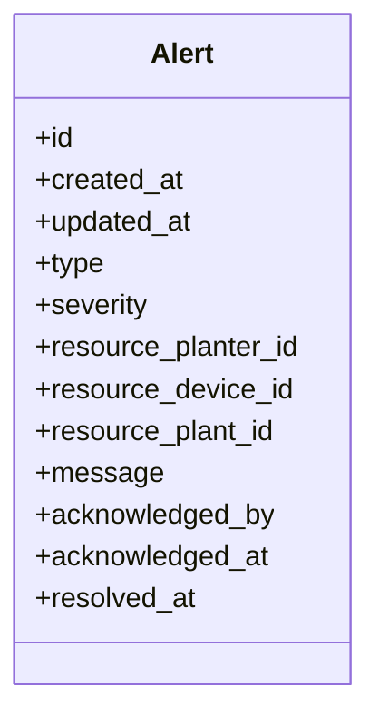
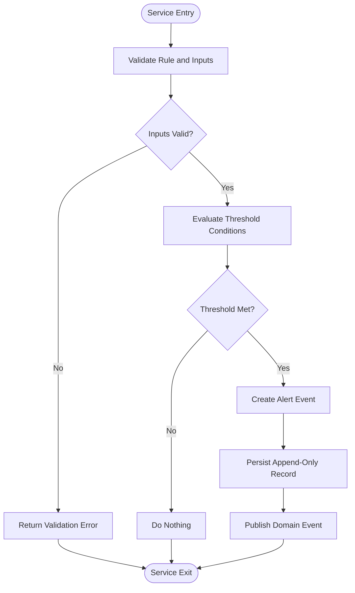
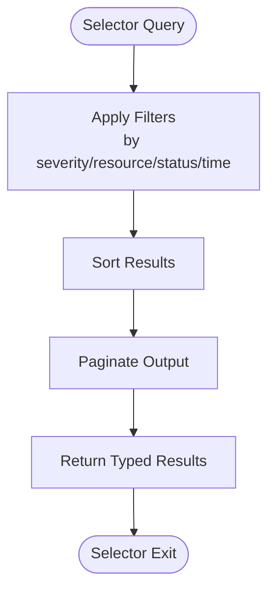
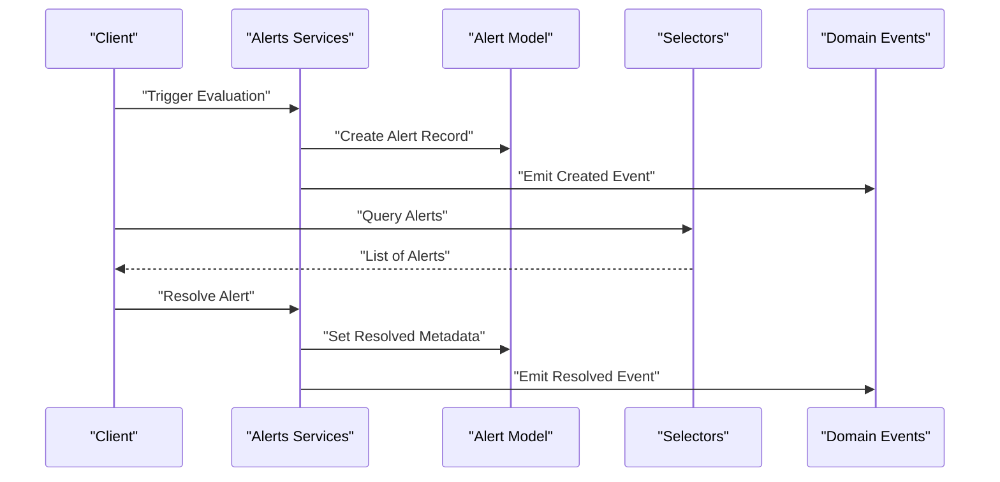
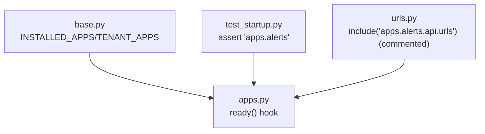
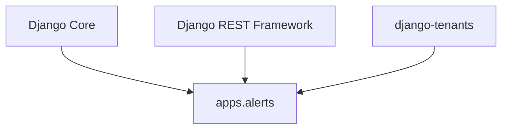

# Alert System

<cite>
**Referenced Files in This Document**
- [models.py](file://backend/apps/alerts/models.py)
- [services.py](file://backend/apps/alerts/services.py)
- [selectors.py](file://backend/apps/alerts/selectors.py)
- [events.py](file://backend/apps/alerts/events.py)
- [apps.py](file://backend/apps/alerts/apps.py)
- [admin.py](file://backend/apps/alerts/admin.py)
- [base.py](file://backend/config/settings/base.py)
- [urls.py](file://backend/config/urls.py)
- [test_startup.py](file://backend/tests/test_startup.py)
</cite>

## Table of Contents
1. [Introduction](#introduction)
2. [Project Structure](#project-structure)
3. [Core Components](#core-components)
4. [Architecture Overview](#architecture-overview)
5. [Detailed Component Analysis](#detailed-component-analysis)
6. [Dependency Analysis](#dependency-analysis)
7. [Performance Considerations](#performance-considerations)
8. [Troubleshooting Guide](#troubleshooting-guide)
9. [Conclusion](#conclusion)

## Introduction
This document describes the Alert System domain within the Flower project. It focuses on alert definition, threshold evaluation, and severity management, and documents the Alert entity model, configuration and evaluation through the alert service layer, queries and status tracking via selectors, and domain events for lifecycle management. It also outlines severity classification, escalation policies, and multi-tier alerting workflows, along with practical examples for rule configuration, threshold tuning, and resolution procedures. Guidance is included for alert filtering, duplicate detection, and integration with task generation systems.

## Project Structure
The Alert System is implemented as a Django app (bounded context) under backend/apps/alerts. It follows a clean separation of concerns:
- models.py defines the Alert entity and its metadata.
- services.py encapsulates write operations and mutation logic.
- selectors.py centralizes read/query logic.
- events.py defines domain events as lightweight data carriers.
- apps.py registers the app and integrates with Django’s startup routine.
- admin.py provides administrative hooks.
- base.py configures the app as part of the tenant-aware Django installation.
- urls.py includes the alerts API routes (commented out in current code).
- test_startup.py verifies the app is installed during startup.

**Diagram sources**
- [apps.py:1-12](file://backend/apps/alerts/apps.py#L1-L12)
- [models.py:1-29](file://backend/apps/alerts/models.py#L1-L29)
- [services.py:1-9](file://backend/apps/alerts/services.py#L1-L9)
- [selectors.py:1-7](file://backend/apps/alerts/selectors.py#L1-L7)
- [events.py:1-7](file://backend/apps/alerts/events.py#L1-L7)
- [base.py:84](file://backend/config/settings/base.py#L84)
- [urls.py:33](file://backend/config/urls.py#L33)
- [test_startup.py:26](file://backend/tests/test_startup.py#L26)

**Section sources**
- [apps.py:1-12](file://backend/apps/alerts/apps.py#L1-L12)
- [base.py:84](file://backend/config/settings/base.py#L84)
- [urls.py:33](file://backend/config/urls.py#L33)
- [test_startup.py:26](file://backend/tests/test_startup.py#L26)

## Core Components
- Alert entity model: Defines the alert record and its metadata. The model comment outlines future fields for alert type, severity, related resources (planter/device/plant), message, acknowledgment, and resolution timestamps.
- Services layer: Enforces that all mutations to alert data occur through this module. It emphasizes append-only event semantics with no updates or deletions.
- Selectors layer: Centralizes read and query logic for alert data, ensuring testability and consistency.
- Domain events: Lightweight data carriers representing domain actions; distinct from Django signals.
- App registration: Integrates the alerts app into the Django installation and tenant-aware configuration.
- Admin hooks: Provides administrative interface support.

**Section sources**
- [models.py:12-29](file://backend/apps/alerts/models.py#L12-L29)
- [services.py:1-9](file://backend/apps/alerts/services.py#L1-L9)
- [selectors.py:1-7](file://backend/apps/alerts/selectors.py#L1-L7)
- [events.py:1-7](file://backend/apps/alerts/events.py#L1-L7)
- [apps.py:1-12](file://backend/apps/alerts/apps.py#L1-L12)
- [admin.py:1-3](file://backend/apps/alerts/admin.py#L1-L3)

## Architecture Overview
The Alert System adheres to a bounded context pattern with clear separation between read and write operations:
- Write path: Clients invoke services to create alert events. The services enforce append-only semantics and encapsulate business rules.
- Read path: Clients query selectors for alert data, enabling centralized filtering, pagination, and status tracking.
- Events: Domain events capture lifecycle transitions such as creation, escalation, and resolution.
- Integration: The app participates in the tenant-aware Django configuration and is included in the startup verification.

**Diagram sources**
- [services.py:1-9](file://backend/apps/alerts/services.py#L1-L9)
- [events.py:1-7](file://backend/apps/alerts/events.py#L1-L7)
- [selectors.py:1-7](file://backend/apps/alerts/selectors.py#L1-L7)
- [models.py:12-29](file://backend/apps/alerts/models.py#L12-L29)

## Detailed Component Analysis

### Alert Entity Model
The Alert model serves as a placeholder for alert records. The model comment outlines planned fields and attributes:
- Alert type identifiers (e.g., low moisture, high temperature, low battery, offline)
- Severity levels (info, warning, critical)
- Foreign keys to related resources (planter, device, plant)
- Message content
- Acknowledgment metadata (acknowledged_by, acknowledged_at)
- Resolution metadata (resolved_at)

These fields represent the canonical alert record and will be used to implement threshold evaluation, severity classification, and status tracking.

**Diagram sources**
- [models.py:12-29](file://backend/apps/alerts/models.py#L12-L29)

**Section sources**
- [models.py:12-29](file://backend/apps/alerts/models.py#L12-L29)

### Services Layer
The services layer enforces write-only operations and append-only event semantics:
- All mutations to alert data must go through services.
- Append-only policy: no updates or deletions are permitted.
- Business logic for rule evaluation and automated triggering can be implemented here.

**Diagram sources**
- [services.py:1-9](file://backend/apps/alerts/services.py#L1-L9)

**Section sources**
- [services.py:1-9](file://backend/apps/alerts/services.py#L1-L9)

### Selectors Layer
The selectors layer centralizes read and query logic:
- All queries for alert data must go through selectors.
- Enables consistent filtering, sorting, pagination, and status tracking.
- Supports alert queries such as unresolved alerts, by severity, by resource, and by time range.

**Diagram sources**
- [selectors.py:1-7](file://backend/apps/alerts/selectors.py#L1-L7)

**Section sources**
- [selectors.py:1-7](file://backend/apps/alerts/selectors.py#L1-L7)

### Domain Events
Domain events represent lifecycle transitions:
- Creation: New alert event created upon threshold breach.
- Escalation: Event escalated to higher severity or additional recipients.
- Resolution: Alert marked resolved with resolution metadata.

Events are lightweight data carriers and distinct from Django signals.

**Diagram sources**
- [services.py:1-9](file://backend/apps/alerts/services.py#L1-L9)
- [models.py:12-29](file://backend/apps/alerts/models.py#L12-L29)
- [selectors.py:1-7](file://backend/apps/alerts/selectors.py#L1-L7)
- [events.py:1-7](file://backend/apps/alerts/events.py#L1-L7)

**Section sources**
- [events.py:1-7](file://backend/apps/alerts/events.py#L1-L7)

### App Registration and Integration
- The alerts app is registered in the Django configuration and included in tenant-aware installations.
- Startup tests verify the app is present during initialization.
- API routes for alerts are declared but commented out in the URL configuration.

**Diagram sources**
- [apps.py:10-12](file://backend/apps/alerts/apps.py#L10-L12)
- [base.py:84](file://backend/config/settings/base.py#L84)
- [test_startup.py:26](file://backend/tests/test_startup.py#L26)
- [urls.py:33](file://backend/config/urls.py#L33)

**Section sources**
- [apps.py:10-12](file://backend/apps/alerts/apps.py#L10-L12)
- [base.py:84](file://backend/config/settings/base.py#L84)
- [test_startup.py:26](file://backend/tests/test_startup.py#L26)
- [urls.py:33](file://backend/config/urls.py#L33)

## Dependency Analysis
- The alerts app depends on Django and Django REST Framework for ORM and API capabilities.
- It participates in the tenant-aware architecture via django-tenants.
- No cross-app dependencies are evident in the provided files; the app is self-contained.

**Diagram sources**
- [base.py:84](file://backend/config/settings/base.py#L84)
- [apps.py:1-12](file://backend/apps/alerts/apps.py#L1-L12)

**Section sources**
- [base.py:84](file://backend/config/settings/base.py#L84)
- [apps.py:1-12](file://backend/apps/alerts/apps.py#L1-L12)

## Performance Considerations
- Append-only design simplifies auditing and avoids write contention from updates.
- Centralized selectors enable efficient query planning and indexing strategies.
- Consider adding database indexes on frequently queried fields (e.g., severity, resource IDs, timestamps).
- Pagination and filtering in selectors reduce payload sizes and improve responsiveness.
- Asynchronous event handling can decouple alert creation from downstream integrations.

## Troubleshooting Guide
- Startup verification: Confirm the alerts app is installed during startup.
- Read/write separation: Ensure all reads use selectors and all writes use services.
- Event integrity: Verify domain events are emitted for lifecycle transitions.
- Resource associations: Validate foreign keys to planter/device/plant align with related apps.
- Resolution tracking: Confirm resolved_at and acknowledgment metadata are set consistently.

**Section sources**
- [test_startup.py:26](file://backend/tests/test_startup.py#L26)
- [services.py:1-9](file://backend/apps/alerts/services.py#L1-L9)
- [selectors.py:1-7](file://backend/apps/alerts/selectors.py#L1-L7)
- [events.py:1-7](file://backend/apps/alerts/events.py#L1-L7)
- [models.py:12-29](file://backend/apps/alerts/models.py#L12-L29)

## Conclusion
The Alert System establishes a robust foundation for alert definition, threshold evaluation, and severity management within the Flower project. Its bounded context design, with explicit separation of read and write operations, ensures maintainability and testability. The append-only event model, combined with centralized selectors and domain events, supports scalable alert lifecycle management. Future enhancements should focus on implementing the Alert model fields, threshold evaluation logic, escalation policies, and integration with task generation systems.