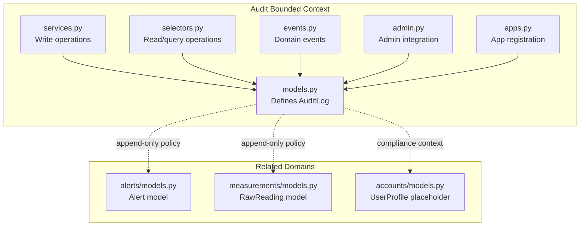
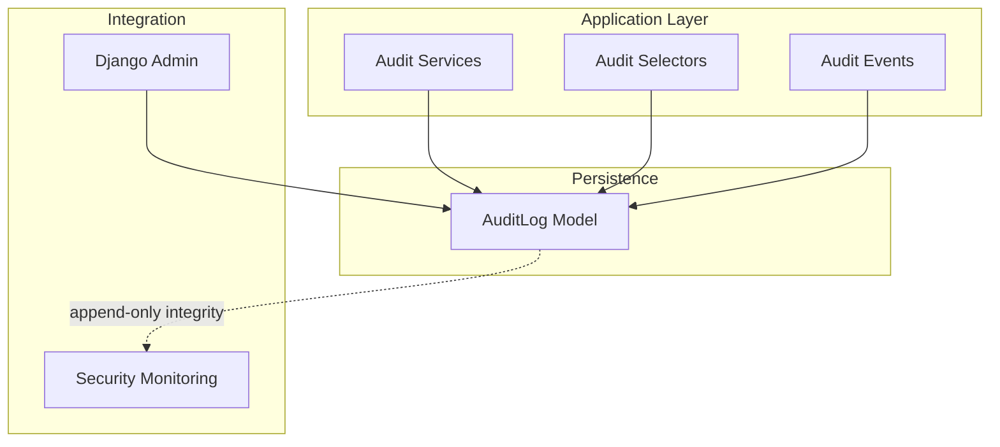
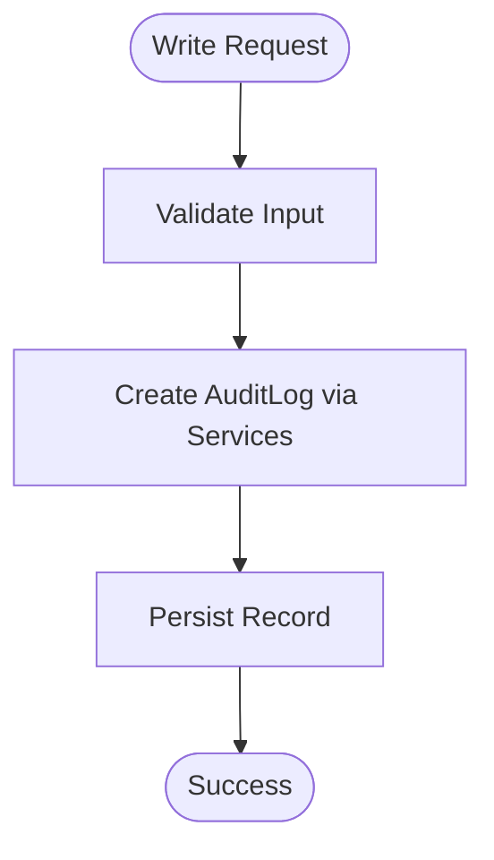
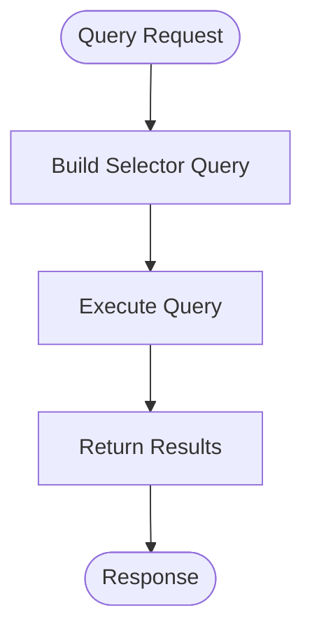
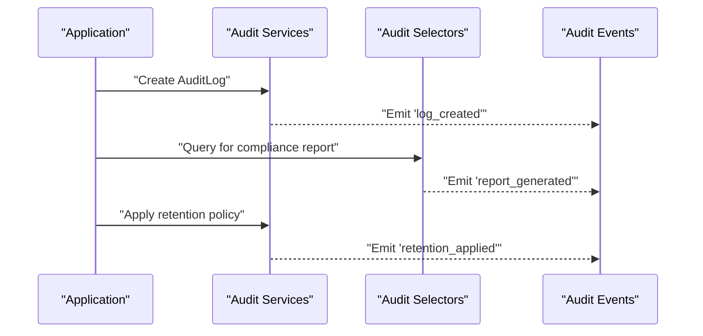
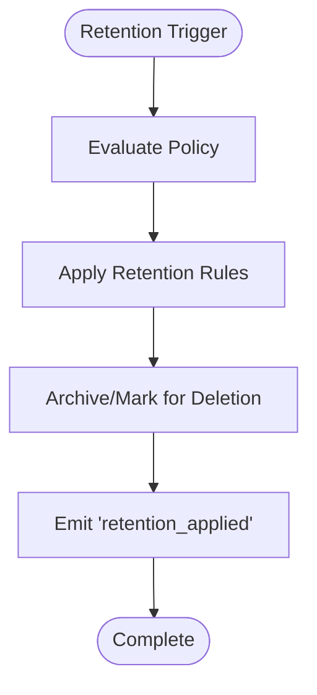
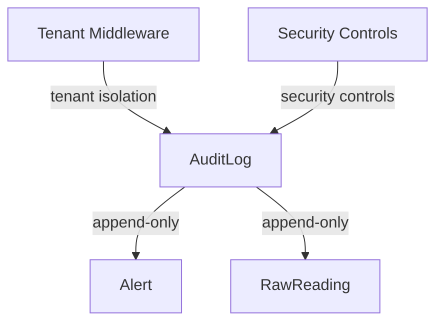

# Audit & Compliance

<cite>
**Referenced Files in This Document**
- [models.py](file://backend/apps/audit/models.py)
- [services.py](file://backend/apps/audit/services.py)
- [selectors.py](file://backend/apps/audit/selectors.py)
- [events.py](file://backend/apps/audit/events.py)
- [admin.py](file://backend/apps/audit/admin.py)
- [apps.py](file://backend/apps/audit/apps.py)
- [AUDIT_CHECKLIST.md](file://backend/docs/governance/AUDIT_CHECKLIST.md)
- [models.py](file://backend/apps/alerts/models.py)
- [models.py](file://backend/apps/measurements/models.py)
- [models.py](file://backend/apps/accounts/models.py)
</cite>

## Table of Contents
1. [Introduction](#introduction)
2. [Project Structure](#project-structure)
3. [Core Components](#core-components)
4. [Architecture Overview](#architecture-overview)
5. [Detailed Component Analysis](#detailed-component-analysis)
6. [Dependency Analysis](#dependency-analysis)
7. [Performance Considerations](#performance-considerations)
8. [Troubleshooting Guide](#troubleshooting-guide)
9. [Conclusion](#conclusion)
10. [Appendices](#appendices)

## Introduction
This document describes the Audit & Compliance domain within the platform, focusing on activity logging, compliance tracking, and data retention management. It documents the AuditLog entity model, the service and selector layers responsible for audit write/read operations, domain events for lifecycle management, and governance rules ensuring audit trail integrity and regulatory alignment. It also outlines compliance frameworks, reporting pathways, and integration points with security monitoring systems.

## Project Structure
The Audit bounded context is organized as a Django app with explicit separation of concerns:
- models.py defines the AuditLog entity and its metadata.
- services.py governs write operations and enforces append-only semantics.
- selectors.py centralizes read/query logic for audit data.
- events.py captures domain events as lightweight data structures.
- admin.py integrates the model into Django’s admin interface.
- apps.py registers the app and provides initialization hooks.
- AUDIT_CHECKLIST.md codifies governance rules for audit integrity and operational controls.



**Diagram sources**
- [models.py:14-31](file://backend/apps/audit/models.py#L14-L31)
- [services.py:1-9](file://backend/apps/audit/services.py#L1-L9)
- [selectors.py:1-7](file://backend/apps/audit/selectors.py#L1-L7)
- [events.py:1-7](file://backend/apps/audit/events.py#L1-L7)
- [admin.py:1-3](file://backend/apps/audit/admin.py#L1-L3)
- [apps.py:5-12](file://backend/apps/audit/apps.py#L5-L12)
- [models.py:13-29](file://backend/apps/alerts/models.py#L13-L29)
- [models.py:14-30](file://backend/apps/measurements/models.py#L14-L30)
- [models.py:15-30](file://backend/apps/accounts/models.py#L15-L30)

**Section sources**
- [models.py:1-31](file://backend/apps/audit/models.py#L1-L31)
- [services.py:1-9](file://backend/apps/audit/services.py#L1-L9)
- [selectors.py:1-7](file://backend/apps/audit/selectors.py#L1-L7)
- [events.py:1-7](file://backend/apps/audit/events.py#L1-L7)
- [admin.py:1-3](file://backend/apps/audit/admin.py#L1-L3)
- [apps.py:1-12](file://backend/apps/audit/apps.py#L1-L12)
- [AUDIT_CHECKLIST.md:1-66](file://backend/docs/governance/AUDIT_CHECKLIST.md#L1-L66)

## Core Components
- AuditLog entity: Defines the audit trail record with placeholders for actor, action, target, description, client context, and timestamp. It is designed to be append-only to preserve integrity.
- Services layer: Enforces write-only operations for audit data, ensuring all mutations traverse this module and preventing direct model writes.
- Selectors layer: Centralizes read/query logic for audit data, enabling testability and consistent access patterns.
- Domain events: Lightweight data structures representing significant audit lifecycle events (e.g., log creation, retention applied, report generated).
- Governance rules: Append-only policies for audit logs, alerts, and raw readings; centralized read/write access; tenant isolation; and operational security controls.

Key governance references:
- Append-only policy for audit logs, alerts, and raw readings.
- Centralized read/write access via services and selectors.
- Tenant isolation and middleware configuration.
- Security hardening and infrastructure controls.

**Section sources**
- [models.py:14-31](file://backend/apps/audit/models.py#L14-L31)
- [services.py:1-9](file://backend/apps/audit/services.py#L1-L9)
- [selectors.py:1-7](file://backend/apps/audit/selectors.py#L1-L7)
- [events.py:1-7](file://backend/apps/audit/events.py#L1-L7)
- [AUDIT_CHECKLIST.md:13-19](file://backend/docs/governance/AUDIT_CHECKLIST.md#L13-L19)
- [AUDIT_CHECKLIST.md:5-11](file://backend/docs/governance/AUDIT_CHECKLIST.md#L5-L11)
- [models.py:13-29](file://backend/apps/alerts/models.py#L13-L29)
- [models.py:14-30](file://backend/apps/measurements/models.py#L14-L30)

## Architecture Overview
The Audit domain follows a clean architecture pattern:
- Write path: Application services create AuditLog entries through the services module, enforcing append-only semantics.
- Read path: Selectors encapsulate query logic for compliance reporting and dashboards.
- Eventing: Domain events signal lifecycle milestones such as log creation, retention policy application, and report generation.
- Admin integration: Django admin provides read-only access to audit records for privileged users.
- Governance: The audit checklist ensures operational and security controls align with compliance requirements.



**Diagram sources**
- [services.py:1-9](file://backend/apps/audit/services.py#L1-L9)
- [selectors.py:1-7](file://backend/apps/audit/selectors.py#L1-L7)
- [events.py:1-7](file://backend/apps/audit/events.py#L1-L7)
- [models.py:14-31](file://backend/apps/audit/models.py#L14-L31)
- [admin.py:1-3](file://backend/apps/audit/admin.py#L1-L3)

## Detailed Component Analysis

### AuditLog Entity Model
The AuditLog model is the core entity for capturing activity. It includes metadata for localization and defines a placeholder structure for:
- Actor identification
- Action type (e.g., create, update, delete, login, export)
- Target type and identifier
- Description and contextual details (IP address, user agent)
- Timestamps for event occurrence and server receipt

Append-only policy is enforced to maintain immutable audit trails, ensuring integrity for compliance and forensic investigations.

```mermaid
classDiagram
class AuditLog {
"+Meta.verbose_name"
"+Meta.verbose_name_plural"
}
```

**Diagram sources**
- [models.py:14-31](file://backend/apps/audit/models.py#L14-L31)

**Section sources**
- [models.py:14-31](file://backend/apps/audit/models.py#L14-L31)

### Audit Services Layer
The services module governs write operations for audit data. It enforces:
- All mutations must go through this module
- Append-only constraint (no updates or deletes)
- Centralization of write logic for testability and consistency

This layer is the single point of entry for creating audit records, ensuring policy adherence and simplifying auditing of write operations themselves.



**Diagram sources**
- [services.py:1-9](file://backend/apps/audit/services.py#L1-L9)

**Section sources**
- [services.py:1-9](file://backend/apps/audit/services.py#L1-L9)

### Audit Selectors Layer
The selectors module centralizes read and query logic for audit data. It ensures:
- All queries traverse this module
- Read logic is testable and consistent
- Support for compliance reporting and dashboards

Selectors enable efficient filtering, pagination, and aggregation of audit events for regulatory reporting and internal monitoring.



**Diagram sources**
- [selectors.py:1-7](file://backend/apps/audit/selectors.py#L1-L7)

**Section sources**
- [selectors.py:1-7](file://backend/apps/audit/selectors.py#L1-L7)

### Domain Events for Audit Lifecycle Management
Domain events represent significant lifecycle milestones in the audit process:
- Log creation: Captures the initial audit record creation
- Retention policy application: Signals when retention rules are enforced
- Report generation: Indicates completion of compliance reports

These events are lightweight data structures and distinct from Django signals, enabling decoupled processing and extensibility.



**Diagram sources**
- [events.py:1-7](file://backend/apps/audit/events.py#L1-L7)
- [services.py:1-9](file://backend/apps/audit/services.py#L1-L9)
- [selectors.py:1-7](file://backend/apps/audit/selectors.py#L1-L7)

**Section sources**
- [events.py:1-7](file://backend/apps/audit/events.py#L1-L7)

### Admin Integration
Django admin integrates with the AuditLog model to provide read-only administrative access. This supports:
- Manual inspection of audit records
- Compliance reviews and investigations
- Operational oversight

Administrative access is restricted and logged to maintain integrity.

**Section sources**
- [admin.py:1-3](file://backend/apps/audit/admin.py#L1-L3)

### Audit App Registration
The Audit app is registered with Django, including localization support and initialization hooks. This ensures consistent integration across the platform.

**Section sources**
- [apps.py:5-12](file://backend/apps/audit/apps.py#L5-L12)

### Compliance Reporting and Dashboards
Compliance reporting leverages the selectors layer to:
- Aggregate audit events by actor, action, and time window
- Filter by target type and identifier
- Export data for regulatory submissions

Dashboards can visualize trends, anomalies, and retention status to support ongoing monitoring and governance.

[No sources needed since this section provides general guidance]

### Data Retention Management
Retention management applies policies to automatically archive or purge audit data per regulatory requirements. The services layer coordinates retention application, emitting domain events to track lifecycle changes.



**Diagram sources**
- [services.py:1-9](file://backend/apps/audit/services.py#L1-L9)
- [events.py:1-7](file://backend/apps/audit/events.py#L1-L7)

**Section sources**
- [services.py:1-9](file://backend/apps/audit/services.py#L1-L9)
- [events.py:1-7](file://backend/apps/audit/events.py#L1-L7)

### Activity Monitoring and Security Integration
Activity monitoring integrates audit logs with security monitoring systems:
- Real-time alerting on suspicious activities
- Correlation with device and user actions
- Forensic readiness with immutable logs

Security monitoring systems consume audit events to detect anomalies and trigger incident response.

[No sources needed since this section provides general guidance]

## Dependency Analysis
The Audit bounded context maintains loose coupling with related domains while enforcing strict policies:
- Alerts and raw readings share the append-only principle, reinforcing data integrity across the platform.
- Tenant isolation and middleware configuration ensure audit data remains scoped and secure.
- Centralized read/write access reduces risk and improves auditability of access patterns.



**Diagram sources**
- [models.py:14-31](file://backend/apps/audit/models.py#L14-L31)
- [models.py:13-29](file://backend/apps/alerts/models.py#L13-L29)
- [models.py:14-30](file://backend/apps/measurements/models.py#L14-L30)
- [AUDIT_CHECKLIST.md:5-11](file://backend/docs/governance/AUDIT_CHECKLIST.md#L5-L11)
- [AUDIT_CHECKLIST.md:21-30](file://backend/docs/governance/AUDIT_CHECKLIST.md#L21-L30)

**Section sources**
- [AUDIT_CHECKLIST.md:5-11](file://backend/docs/governance/AUDIT_CHECKLIST.md#L5-L11)
- [AUDIT_CHECKLIST.md:13-19](file://backend/docs/governance/AUDIT_CHECKLIST.md#L13-L19)
- [models.py:13-29](file://backend/apps/alerts/models.py#L13-L29)
- [models.py:14-30](file://backend/apps/measurements/models.py#L14-L30)

## Performance Considerations
- Indexing: Add database indexes on frequently queried fields (actor, action, target, timestamps) to optimize selector performance.
- Pagination: Use cursor-based pagination for large datasets to reduce memory overhead.
- Archival: Separate recent active logs from archived logs to improve query performance.
- Caching: Cache compliance report summaries for repeated access, invalidating on retention changes.

[No sources needed since this section provides general guidance]

## Troubleshooting Guide
Common issues and resolutions:
- Unexpected updates or deletions: Verify that all writes go through the services module and that append-only constraints are enforced.
- Cross-tenant access: Confirm tenant middleware is active and first in the middleware stack; avoid cross-tenant queries.
- Audit integrity violations: Review governance checklist items and ensure centralized read/write access is followed.
- Admin access problems: Confirm admin registration and permissions; ensure read-only access is configured appropriately.

**Section sources**
- [AUDIT_CHECKLIST.md:5-11](file://backend/docs/governance/AUDIT_CHECKLIST.md#L5-L11)
- [AUDIT_CHECKLIST.md:13-19](file://backend/docs/governance/AUDIT_CHECKLIST.md#L13-L19)
- [services.py:1-9](file://backend/apps/audit/services.py#L1-L9)
- [selectors.py:1-7](file://backend/apps/audit/selectors.py#L1-L7)

## Conclusion
The Audit & Compliance domain establishes a robust foundation for activity logging, compliance tracking, and data retention management. Through append-only audit logs, centralized services and selectors, domain events, and governance rules, the platform ensures integrity, transparency, and regulatory alignment. Integrating with security monitoring systems and compliance dashboards enables continuous oversight and rapid response to potential risks.

[No sources needed since this section summarizes without analyzing specific files]

## Appendices
- Regulatory reporting requirements: Align retention periods with applicable regulations; maintain immutable logs; provide audit trails for inspections.
- Data privacy requirements: Minimize personally identifiable information in audit logs; apply anonymization where feasible; restrict access to authorized personnel only.
- Audit trail integrity: Enforce append-only policies; log all access and modifications; maintain chain of custody for evidence.

[No sources needed since this section provides general guidance]