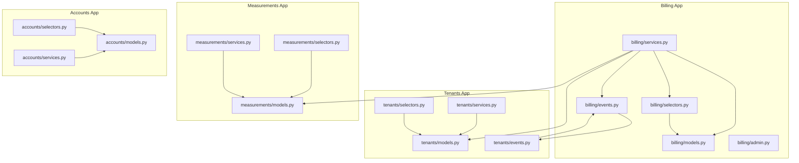
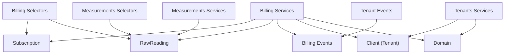
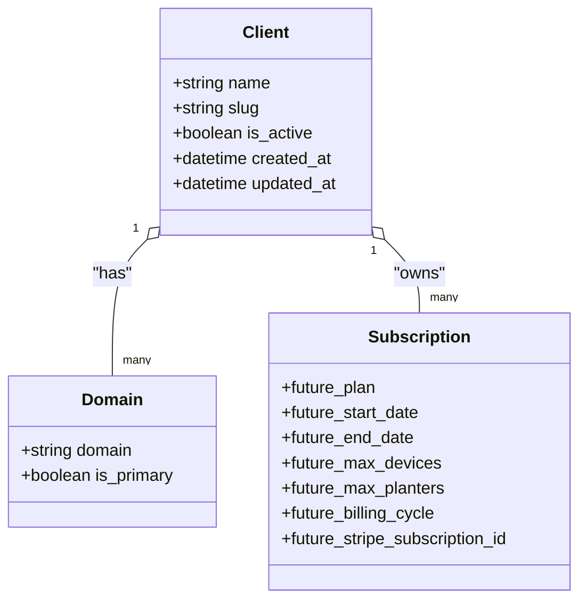
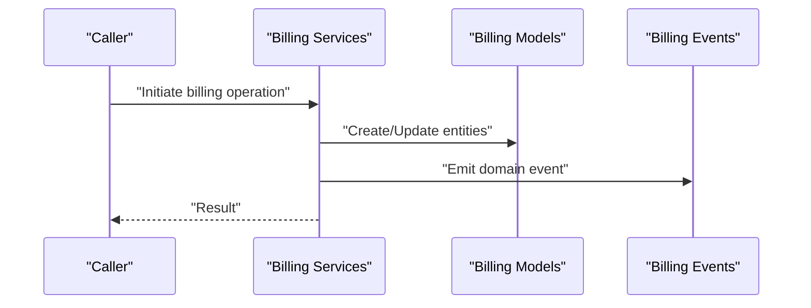
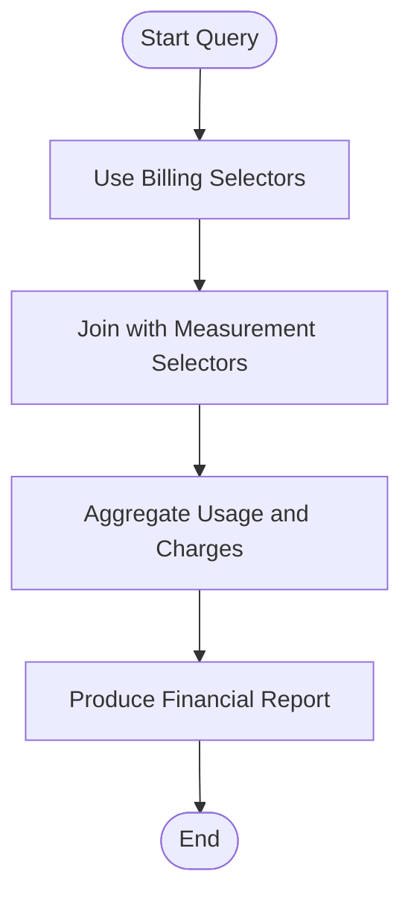
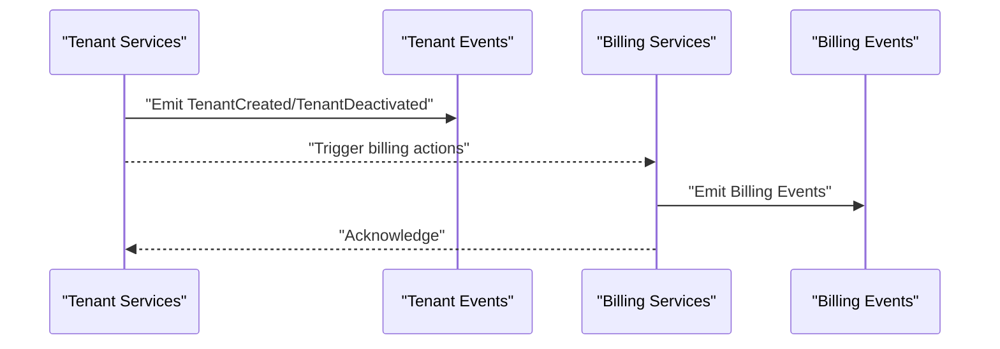
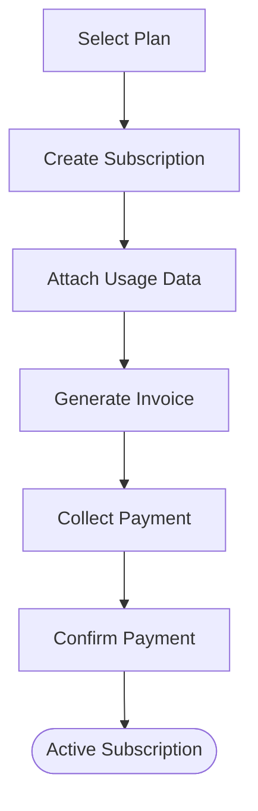
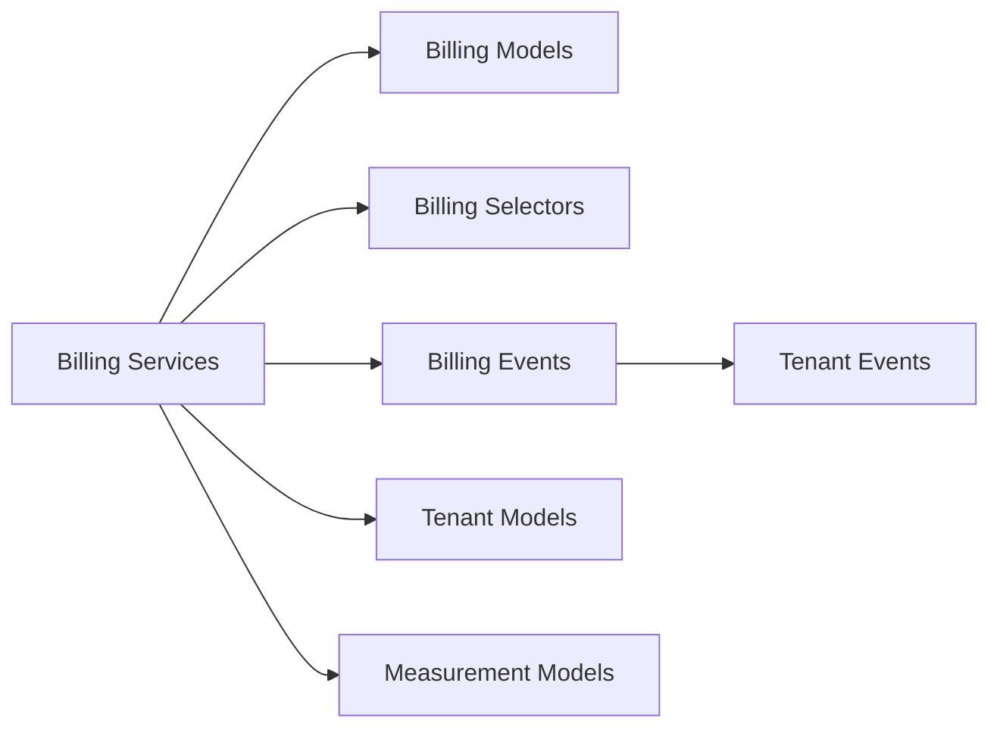

# Billing & Payments

<cite>
**Referenced Files in This Document**
- [models.py](file://backend/apps/billing/models.py)
- [services.py](file://backend/apps/billing/services.py)
- [selectors.py](file://backend/apps/billing/selectors.py)
- [events.py](file://backend/apps/billing/events.py)
- [admin.py](file://backend/apps/billing/admin.py)
- [models.py](file://backend/apps/tenants/models.py)
- [services.py](file://backend/apps/tenants/services.py)
- [selectors.py](file://backend/apps/tenants/selectors.py)
- [events.py](file://backend/apps/tenants/events.py)
- [models.py](file://backend/apps/measurements/models.py)
- [selectors.py](file://backend/apps/measurements/selectors.py)
- [services.py](file://backend/apps/measurements/services.py)
- [models.py](file://backend/apps/accounts/models.py)
- [services.py](file://backend/apps/accounts/services.py)
- [selectors.py](file://backend/apps/accounts/selectors.py)
</cite>

## Table of Contents
1. [Introduction](#introduction)
2. [Project Structure](#project-structure)
3. [Core Components](#core-components)
4. [Architecture Overview](#architecture-overview)
5. [Detailed Component Analysis](#detailed-component-analysis)
6. [Dependency Analysis](#dependency-analysis)
7. [Performance Considerations](#performance-considerations)
8. [Troubleshooting Guide](#troubleshooting-guide)
9. [Conclusion](#conclusion)
10. [Appendices](#appendices)

## Introduction
This document describes the Billing & Payments domain in the Flower project. It covers the entity model for subscriptions, billing cycles, usage tracking, and payment history; the service-layer workflows for billing generation and payment processing; the selector-based querying and reporting; and the domain events that capture lifecycle changes such as subscription creation, billing cycles, and payment processing. It also outlines integration points with tenant management and usage metering, and provides practical examples of billing workflows, subscription upgrades/downgrades, and payment collection procedures.

## Project Structure
The Billing domain is organized as a Django app with clear separation of concerns:
- Models define the persistent entities (e.g., Subscription placeholder).
- Services encapsulate write operations and orchestrate billing workflows.
- Selectors encapsulate read/query logic for reporting and UI.
- Events represent domain occurrences suitable for eventual consistency and outbox publishing.
- Admin provides administrative exposure for models.

The Billing app interacts with:
- Tenants app for multi-tenant isolation and tenant lifecycle events.
- Measurements app for usage metering (usage-based billing).
- Accounts app for user and profile metadata within a tenant.

**Diagram sources**
- [models.py:1-26](file://backend/apps/billing/models.py#L1-L26)
- [services.py:1-7](file://backend/apps/billing/services.py#L1-L7)
- [selectors.py:1-7](file://backend/apps/billing/selectors.py#L1-L7)
- [events.py:1-7](file://backend/apps/billing/events.py#L1-L7)
- [models.py:1-77](file://backend/apps/tenants/models.py#L1-L77)
- [services.py:1-42](file://backend/apps/tenants/services.py#L1-L42)
- [selectors.py:1-26](file://backend/apps/tenants/selectors.py#L1-L26)
- [events.py:1-36](file://backend/apps/tenants/events.py#L1-L36)
- [models.py:1-30](file://backend/apps/measurements/models.py#L1-L30)
- [selectors.py:1-7](file://backend/apps/measurements/selectors.py#L1-L7)
- [services.py:1-9](file://backend/apps/measurements/services.py#L1-L9)
- [models.py:1-30](file://backend/apps/accounts/models.py#L1-L30)
- [services.py:1-7](file://backend/apps/accounts/services.py#L1-L7)
- [selectors.py:1-7](file://backend/apps/accounts/selectors.py#L1-L7)

**Section sources**
- [models.py:1-26](file://backend/apps/billing/models.py#L1-L26)
- [services.py:1-7](file://backend/apps/billing/services.py#L1-L7)
- [selectors.py:1-7](file://backend/apps/billing/selectors.py#L1-L7)
- [events.py:1-7](file://backend/apps/billing/events.py#L1-L7)
- [models.py:1-77](file://backend/apps/tenants/models.py#L1-L77)
- [services.py:1-42](file://backend/apps/tenants/services.py#L1-L42)
- [selectors.py:1-26](file://backend/apps/tenants/selectors.py#L1-L26)
- [events.py:1-36](file://backend/apps/tenants/events.py#L1-L36)
- [models.py:1-30](file://backend/apps/measurements/models.py#L1-L30)
- [selectors.py:1-7](file://backend/apps/measurements/selectors.py#L1-L7)
- [services.py:1-9](file://backend/apps/measurements/services.py#L1-L9)
- [models.py:1-30](file://backend/apps/accounts/models.py#L1-L30)
- [services.py:1-7](file://backend/apps/accounts/services.py#L1-L7)
- [selectors.py:1-7](file://backend/apps/accounts/selectors.py#L1-L7)

## Core Components
- Billing Subscription: A tenant-facing subscription entity placeholder indicating future fields such as plan, dates, limits, billing cycle, and external identifiers. See [models.py:11-26](file://backend/apps/billing/models.py#L11-L26).
- Billing Services: Centralized write operations for billing mutations. See [services.py:1-7](file://backend/apps/billing/services.py#L1-L7).
- Billing Selectors: Centralized read/query logic for billing analytics and UI. See [selectors.py:1-7](file://backend/apps/billing/selectors.py#L1-L7).
- Billing Events: Lightweight domain events representing significant occurrences (not Django signals). See [events.py:1-7](file://backend/apps/billing/events.py#L1-L7).
- Tenant Integration: Multi-tenant isolation via django-tenants with Client and Domain models. See [models.py:6-77](file://backend/apps/tenants/models.py#L6-L77).
- Measurement Integration: Usage metering via RawReading placeholders and append-only ingestion. See [models.py:14-30](file://backend/apps/measurements/models.py#L14-L30).
- Account Integration: User profile scaffolding within a tenant. See [models.py:15-30](file://backend/apps/accounts/models.py#L15-L30).

**Section sources**
- [models.py:11-26](file://backend/apps/billing/models.py#L11-L26)
- [services.py:1-7](file://backend/apps/billing/services.py#L1-L7)
- [selectors.py:1-7](file://backend/apps/billing/selectors.py#L1-L7)
- [events.py:1-7](file://backend/apps/billing/events.py#L1-L7)
- [models.py:6-77](file://backend/apps/tenants/models.py#L6-L77)
- [models.py:14-30](file://backend/apps/measurements/models.py#L14-L30)
- [models.py:15-30](file://backend/apps/accounts/models.py#L15-L30)

## Architecture Overview
The Billing domain follows a bounded context with explicit separation between reads (selectors), writes (services), and persistence (models). Domain events enable eventual consistency and decoupled integrations. Billing services coordinate with tenants for multi-tenant isolation and with measurements for usage-based billing.

**Diagram sources**
- [models.py:11-26](file://backend/apps/billing/models.py#L11-L26)
- [services.py:1-7](file://backend/apps/billing/services.py#L1-L7)
- [selectors.py:1-7](file://backend/apps/billing/selectors.py#L1-L7)
- [events.py:1-7](file://backend/apps/billing/events.py#L1-L7)
- [models.py:6-77](file://backend/apps/tenants/models.py#L6-L77)
- [services.py:1-42](file://backend/apps/tenants/services.py#L1-L42)
- [events.py:1-36](file://backend/apps/tenants/events.py#L1-L36)
- [models.py:14-30](file://backend/apps/measurements/models.py#L14-L30)
- [selectors.py:1-7](file://backend/apps/measurements/selectors.py#L1-L7)
- [services.py:1-9](file://backend/apps/measurements/services.py#L1-L9)

## Detailed Component Analysis

### Billing Entity Model
- Subscription: Placeholder for tenant subscription with future fields for plan, dates, limits, billing cycle, and external identifiers. See [models.py:11-26](file://backend/apps/billing/models.py#L11-L26).
- Multi-tenant context: Billing operates per tenant via the Client and Domain models. See [models.py:6-77](file://backend/apps/tenants/models.py#L6-L77).

**Diagram sources**
- [models.py:6-77](file://backend/apps/tenants/models.py#L6-L77)
- [models.py:11-26](file://backend/apps/billing/models.py#L11-L26)

**Section sources**
- [models.py:11-26](file://backend/apps/billing/models.py#L11-L26)
- [models.py:6-77](file://backend/apps/tenants/models.py#L6-L77)

### Billing Workflows and Payment Processing
- Service boundary: All billing mutations must go through the Billing services module. See [services.py:1-7](file://backend/apps/billing/services.py#L1-L7).
- Selector boundary: All billing queries must go through the Billing selectors module. See [selectors.py:1-7](file://backend/apps/billing/selectors.py#L1-L7).
- Event boundary: Domain events capture lifecycle changes for eventual consistency. See [events.py:1-7](file://backend/apps/billing/events.py#L1-L7).

**Diagram sources**
- [services.py:1-7](file://backend/apps/billing/services.py#L1-L7)
- [models.py:11-26](file://backend/apps/billing/models.py#L11-L26)
- [events.py:1-7](file://backend/apps/billing/events.py#L1-L7)

**Section sources**
- [services.py:1-7](file://backend/apps/billing/services.py#L1-L7)
- [selectors.py:1-7](file://backend/apps/billing/selectors.py#L1-L7)
- [events.py:1-7](file://backend/apps/billing/events.py#L1-L7)

### Billing Queries and Financial Reporting
- Centralized reads: Billing selectors encapsulate all read logic for reporting and UI consumption. See [selectors.py:1-7](file://backend/apps/billing/selectors.py#L1-L7).
- Usage-based reporting: Measurement selectors provide access to usage data for aggregation and billing. See [selectors.py:1-7](file://backend/apps/measurements/selectors.py#L1-L7).

**Diagram sources**
- [selectors.py:1-7](file://backend/apps/billing/selectors.py#L1-L7)
- [selectors.py:1-7](file://backend/apps/measurements/selectors.py#L1-L7)

**Section sources**
- [selectors.py:1-7](file://backend/apps/billing/selectors.py#L1-L7)
- [selectors.py:1-7](file://backend/apps/measurements/selectors.py#L1-L7)

### Domain Events for Billing Lifecycle Management
- Event definition: Billing events are lightweight dataclasses representing domain occurrences. See [events.py:1-7](file://backend/apps/billing/events.py#L1-L7).
- Tenant event correlation: Tenant events (e.g., TenantCreated, TenantDeactivated) can trigger downstream billing actions. See [events.py:19-36](file://backend/apps/tenants/events.py#L19-L36).

**Diagram sources**
- [events.py:19-36](file://backend/apps/tenants/events.py#L19-L36)
- [events.py:1-7](file://backend/apps/billing/events.py#L1-L7)

**Section sources**
- [events.py:1-7](file://backend/apps/billing/events.py#L1-L7)
- [events.py:19-36](file://backend/apps/tenants/events.py#L19-L36)

### Subscription Management, Usage Metering, and Payment Gateway Integration
- Subscription management: The Subscription model is a placeholder for future fields such as plan, dates, limits, billing cycle, and external identifiers. See [models.py:11-26](file://backend/apps/billing/models.py#L11-L26).
- Usage metering: RawReading placeholders indicate append-only ingestion of sensor data for usage aggregation. See [models.py:14-30](file://backend/apps/measurements/models.py#L14-L30).
- Payment gateway integration: Billing services coordinate with external payment providers via identifiers stored on the Subscription (e.g., external subscription ID). See [models.py:15-21](file://backend/apps/billing/models.py#L15-L21).

**Diagram sources**
- [models.py:15-21](file://backend/apps/billing/models.py#L15-L21)
- [models.py:14-30](file://backend/apps/measurements/models.py#L14-L30)

**Section sources**
- [models.py:11-26](file://backend/apps/billing/models.py#L11-L26)
- [models.py:14-30](file://backend/apps/measurements/models.py#L14-L30)

### Examples of Billing Workflows
- Subscription upgrades/downgrades: Initiated via Billing services, emitting domain events for audit and downstream processing. See [services.py:1-7](file://backend/apps/billing/services.py#L1-L7), [events.py:1-7](file://backend/apps/billing/events.py#L1-L7).
- Payment collection procedures: Triggered by Billing services after invoice generation; payment outcomes emit Billing events for reconciliation. See [services.py:1-7](file://backend/apps/billing/services.py#L1-L7), [events.py:1-7](file://backend/apps/billing/events.py#L1-L7).

**Section sources**
- [services.py:1-7](file://backend/apps/billing/services.py#L1-L7)
- [events.py:1-7](file://backend/apps/billing/events.py#L1-L7)

## Dependency Analysis
- Cohesion: Billing services depend on Billing models, Billing selectors, Billing events, and tenant/measurement contexts.
- Coupling: Billing services coordinate with Tenants and Measurements apps; events propagate to downstream consumers.
- External dependencies: django-tenants for multi-tenant isolation; Stripe identifiers on Subscription for payment provider integration.

**Diagram sources**
- [services.py:1-7](file://backend/apps/billing/services.py#L1-L7)
- [models.py:11-26](file://backend/apps/billing/models.py#L11-L26)
- [selectors.py:1-7](file://backend/apps/billing/selectors.py#L1-L7)
- [events.py:1-7](file://backend/apps/billing/events.py#L1-L7)
- [models.py:6-77](file://backend/apps/tenants/models.py#L6-L77)
- [models.py:14-30](file://backend/apps/measurements/models.py#L14-L30)
- [events.py:19-36](file://backend/apps/tenants/events.py#L19-L36)

**Section sources**
- [services.py:1-7](file://backend/apps/billing/services.py#L1-L7)
- [models.py:11-26](file://backend/apps/billing/models.py#L11-L26)
- [selectors.py:1-7](file://backend/apps/billing/selectors.py#L1-L7)
- [events.py:1-7](file://backend/apps/billing/events.py#L1-L7)
- [models.py:6-77](file://backend/apps/tenants/models.py#L6-L77)
- [models.py:14-30](file://backend/apps/measurements/models.py#L14-L30)
- [events.py:19-36](file://backend/apps/tenants/events.py#L19-L36)

## Performance Considerations
- Centralized reads: Prefer Billing selectors for all queries to optimize caching and testing.
- Append-only usage: Measurements services enforce append-only ingestion to simplify usage aggregation and reduce write contention.
- Event-driven reconciliation: Emit Billing events to offload heavy reconciliation work to background processors.

## Troubleshooting Guide
- Mutation violations: Ensure all Billing mutations pass through Billing services to maintain data integrity. See [services.py:1-7](file://backend/apps/billing/services.py#L1-L7).
- Query correctness: Use Billing selectors for all Billing queries to keep logic centralized and testable. See [selectors.py:1-7](file://backend/apps/billing/selectors.py#L1-L7).
- Event delivery: Verify domain events are persisted and published via an outbox mechanism to guarantee eventual consistency. See [events.py:1-7](file://backend/apps/billing/events.py#L1-L7).

**Section sources**
- [services.py:1-7](file://backend/apps/billing/services.py#L1-L7)
- [selectors.py:1-7](file://backend/apps/billing/selectors.py#L1-L7)
- [events.py:1-7](file://backend/apps/billing/events.py#L1-L7)

## Conclusion
The Billing & Payments domain is structured around a clean separation of reads/writes/events with strong integration points to Tenants and Measurements. The current models provide placeholders for subscription and usage entities, while services and selectors define the operational boundaries for billing workflows. Domain events enable eventual consistency and decoupled integrations. Extending the models with subscription plans, billing cycles, and usage aggregation will complete the domain’s capabilities for subscription management, usage-based billing, and payment processing.

## Appendices
- Administrative exposure: Billing admin provides administrative interface hooks for models. See [admin.py:1-3](file://backend/apps/billing/admin.py#L1-L3).
- User profiles: Accounts models support tenant-scoped user profiles. See [models.py:15-30](file://backend/apps/accounts/models.py#L15-L30).

**Section sources**
- [admin.py:1-3](file://backend/apps/billing/admin.py#L1-L3)
- [models.py:15-30](file://backend/apps/accounts/models.py#L15-L30)