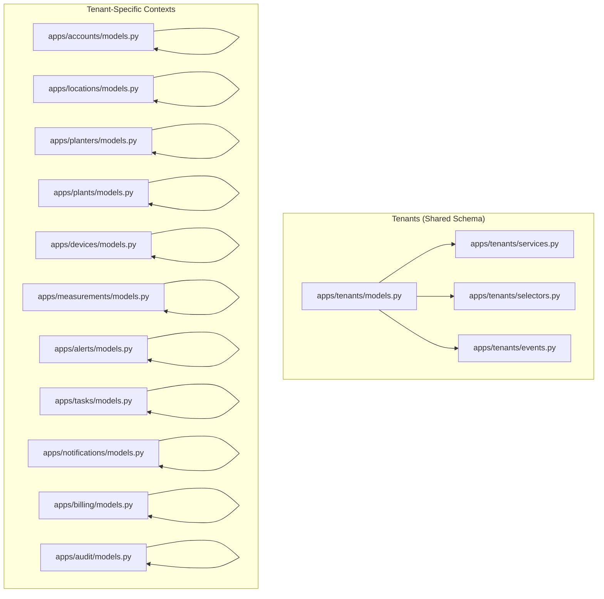
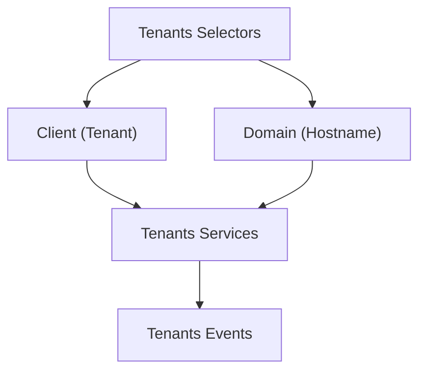
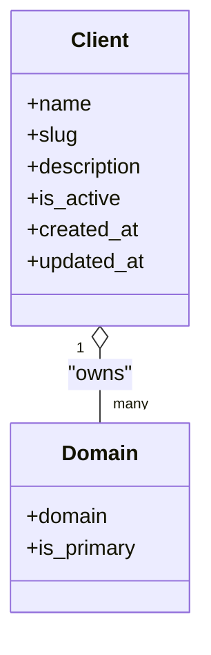
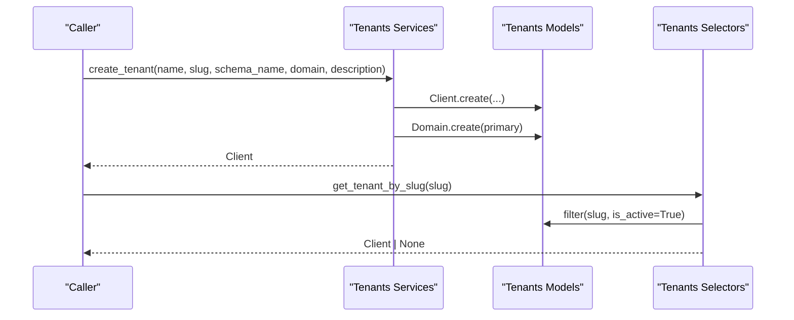
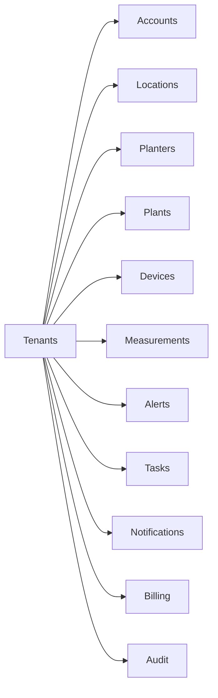

# Core Business Domains

<cite>
**Referenced Files in This Document**
- [DDD_OVERVIEW.md](file://backend/docs/architecture/DDD_OVERVIEW.md)
- [tenants/models.py](file://backend/apps/tenants/models.py)
- [tenants/services.py](file://backend/apps/tenants/services.py)
- [tenants/selectors.py](file://backend/apps/tenants/selectors.py)
- [tenants/events.py](file://backend/apps/tenants/events.py)
- [accounts/models.py](file://backend/apps/accounts/models.py)
- [accounts/services.py](file://backend/apps/accounts/services.py)
- [accounts/selectors.py](file://backend/apps/accounts/selectors.py)
- [accounts/events.py](file://backend/apps/accounts/events.py)
- [locations/models.py](file://backend/apps/locations/models.py)
- [locations/services.py](file://backend/apps/locations/services.py)
- [locations/selectors.py](file://backend/apps/locations/selectors.py)
- [locations/events.py](file://backend/apps/locations/events.py)
- [planters/models.py](file://backend/apps/planters/models.py)
- [planters/services.py](file://backend/apps/planters/services.py)
- [planters/selectors.py](file://backend/apps/planters/selectors.py)
- [planters/events.py](file://backend/apps/planters/events.py)
- [plants/models.py](file://backend/apps/plants/models.py)
- [plants/services.py](file://backend/apps/plants/services.py)
- [plants/selectors.py](file://backend/apps/plants/selectors.py)
- [plants/events.py](file://backend/apps/plants/events.py)
- [devices/models.py](file://backend/apps/devices/models.py)
- [devices/services.py](file://backend/apps/devices/services.py)
- [devices/selectors.py](file://backend/apps/devices/selectors.py)
- [devices/events.py](file://backend/apps/devices/events.py)
- [measurements/models.py](file://backend/apps/measurements/models.py)
- [measurements/services.py](file://backend/apps/measurements/services.py)
- [measurements/selectors.py](file://backend/apps/measurements/selectors.py)
- [measurements/events.py](file://backend/apps/measurements/events.py)
- [alerts/models.py](file://backend/apps/alerts/models.py)
- [alerts/services.py](file://backend/apps/alerts/services.py)
- [alerts/selectors.py](file://backend/apps/alerts/selectors.py)
- [alerts/events.py](file://backend/apps/alerts/events.py)
- [tasks/models.py](file://backend/apps/tasks/models.py)
- [tasks/services.py](file://backend/apps/tasks/services.py)
- [tasks/selectors.py](file://backend/apps/tasks/selectors.py)
- [tasks/events.py](file://backend/apps/tasks/events.py)
- [notifications/models.py](file://backend/apps/notifications/models.py)
- [notifications/services.py](file://backend/apps/notifications/services.py)
- [notifications/selectors.py](file://backend/apps/notifications/selectors.py)
- [notifications/events.py](file://backend/apps/notifications/events.py)
- [billing/models.py](file://backend/apps/billing/models.py)
- [billing/services.py](file://backend/apps/billing/services.py)
- [billing/selectors.py](file://backend/apps/billing/selectors.py)
- [billing/events.py](file://backend/apps/billing/events.py)
- [audit/models.py](file://backend/apps/audit/models.py)
- [audit/services.py](file://backend/apps/audit/services.py)
- [audit/selectors.py](file://backend/apps/audit/selectors.py)
- [audit/events.py](file://backend/apps/audit/events.py)
</cite>

## Table of Contents
1. [Introduction](#introduction)
2. [Project Structure](#project-structure)
3. [Core Components](#core-components)
4. [Architecture Overview](#architecture-overview)
5. [Detailed Component Analysis](#detailed-component-analysis)
6. [Dependency Analysis](#dependency-analysis)
7. [Performance Considerations](#performance-considerations)
8. [Troubleshooting Guide](#troubleshooting-guide)
9. [Conclusion](#conclusion)

## Introduction
This document describes the platform’s 12 core business domains organized as bounded contexts following Domain-Driven Design. Each context encapsulates its own data, rules, and invariants, and communicates across boundaries via domain events or explicit service calls. The DDD structure per app is standardized:
- models.py: Entities and value objects
- services.py: Write operations only
- selectors.py: Read/query operations only
- events.py: Domain events (outbox pattern)
- admin.py, apps.py, tests/: Django admin, app configuration, and unit tests

The overview of bounded contexts and rules is documented in the project’s DDD overview.

**Section sources**
- [DDD_OVERVIEW.md:1-85](file://backend/docs/architecture/DDD_OVERVIEW.md#L1-L85)

## Project Structure
Each domain resides under backend/apps/<context> with the same file structure. The tenants context is special in that it manages multi-tenant schemas and domains, while all other contexts live within tenant schemas.

**Diagram sources**
- [tenants/models.py:1-77](file://backend/apps/tenants/models.py#L1-L77)
- [tenants/services.py:1-42](file://backend/apps/tenants/services.py#L1-L42)
- [tenants/selectors.py:1-26](file://backend/apps/tenants/selectors.py#L1-L26)
- [tenants/events.py:1-36](file://backend/apps/tenants/events.py#L1-L36)
- [accounts/models.py:1-30](file://backend/apps/accounts/models.py#L1-L30)
- [locations/models.py](file://backend/apps/locations/models.py)
- [planters/models.py:1-27](file://backend/apps/planters/models.py#L1-L27)
- [plants/models.py:1-26](file://backend/apps/plants/models.py#L1-L26)
- [devices/models.py:1-29](file://backend/apps/devices/models.py#L1-L29)
- [measurements/models.py:1-30](file://backend/apps/measurements/models.py#L1-L30)
- [alerts/models.py:1-29](file://backend/apps/alerts/models.py#L1-L29)
- [tasks/models.py](file://backend/apps/tasks/models.py)
- [notifications/models.py](file://backend/apps/notifications/models.py)
- [billing/models.py](file://backend/apps/billing/models.py)
- [audit/models.py](file://backend/apps/audit/models.py)

**Section sources**
- [DDD_OVERVIEW.md:67-78](file://backend/docs/architecture/DDD_OVERVIEW.md#L67-L78)

## Core Components
This section outlines each of the 12 bounded contexts, their responsibilities, and how DDD is implemented in models.py, services.py, selectors.py, and events.py. Where applicable, we also describe relationships and cross-context integration points.

- Tenants (Shared Schema)
  - Purpose: Provision tenants, manage domains, and maintain tenant lifecycle.
  - Entities: Client (tenant), Domain (hostname-to-tenant mapping).
  - Services: create_tenant, deactivate_tenant.
  - Selectors: get_active_tenants, get_tenant_by_slug, get_tenant_domains.
  - Events: TenantCreated, TenantDeactivated.
  - Notes: Lives in the public schema; other tenant data lives in isolated schemas.

- Accounts (Tenant Schema)
  - Purpose: Users, roles, permissions, authentication within a tenant.
  - Entities: UserProfile (placeholder).
  - Services/Selectors/Events: Placeholders for future implementation.

- Locations (Tenant Schema)
  - Purpose: Physical locations (sites, greenhouses, indoor areas).
  - Entities: Location (placeholder).
  - Services/Selectors/Events: Placeholders for future implementation.

- Planters (Tenant Schema)
  - Purpose: Planter definitions and inventory; each planter holds one plant and one device.
  - Entities: Planter (placeholder).
  - Services/Selectors/Events: Placeholders for future implementation.

- Plants (Tenant Schema)
  - Purpose: Plant species, varieties, care profiles.
  - Entities: PlantSpecies (placeholder).
  - Services/Selectors/Events: Placeholders for future implementation.

- Devices (Tenant Schema)
  - Purpose: IoT device registry, firmware, connectivity.
  - Entities: Device (placeholder).
  - Services/Selectors/Events: Placeholders for future implementation.

- Measurements (Tenant Schema)
  - Purpose: Raw sensor readings and processed snapshots; append-only.
  - Entities: RawReading (placeholder).
  - Services/Selectors/Events: Placeholders for future implementation.

- Alerts (Tenant Schema)
  - Purpose: Alert definitions, alert instances, thresholds; append-only.
  - Entities: Alert (placeholder).
  - Services/Selectors/Events: Placeholders for future implementation.

- Tasks (Tenant Schema)
  - Purpose: Tasks for gardeners/workers; system-generated or manual.
  - Entities: Task (placeholder).
  - Services/Selectors/Events: Placeholders for future implementation.

- Notifications (Tenant Schema)
  - Purpose: Notification channels, templates, delivery logs (email, SMS, push, in-app).
  - Entities: NotificationLog (placeholder).
  - Services/Selectors/Events: Placeholders for future implementation.

- Billing (Tenant Schema)
  - Purpose: Subscriptions, invoices, usage metering.
  - Entities: Subscription (placeholder).
  - Services/Selectors/Events: Placeholders for future implementation.

- Audit (Tenant Schema)
  - Purpose: Audit trails of manual actions; append-only.
  - Entities: AuditLog (placeholder).
  - Services/Selectors/Events: Placeholders for future implementation.

Rules enforced across contexts:
- No direct writes outside services.py.
- No direct reads outside selectors.py.
- No cross-context foreign keys; use IDs and events.
- Models are placeholders until domain is confirmed.

**Section sources**
- [DDD_OVERVIEW.md:7-85](file://backend/docs/architecture/DDD_OVERVIEW.md#L7-L85)
- [tenants/models.py:6-77](file://backend/apps/tenants/models.py#L6-L77)
- [tenants/services.py:11-42](file://backend/apps/tenants/services.py#L11-L42)
- [tenants/selectors.py:13-26](file://backend/apps/tenants/selectors.py#L13-L26)
- [tenants/events.py:19-36](file://backend/apps/tenants/events.py#L19-L36)
- [accounts/models.py:15-30](file://backend/apps/accounts/models.py#L15-L30)
- [planters/models.py:12-27](file://backend/apps/planters/models.py#L12-L27)
- [plants/models.py:12-26](file://backend/apps/plants/models.py#L12-L26)
- [devices/models.py:12-29](file://backend/apps/devices/models.py#L12-L29)
- [measurements/models.py:14-30](file://backend/apps/measurements/models.py#L14-L30)
- [alerts/models.py:13-29](file://backend/apps/alerts/models.py#L13-L29)
- [locations/models.py](file://backend/apps/locations/models.py)
- [tasks/models.py](file://backend/apps/tasks/models.py)
- [notifications/models.py](file://backend/apps/notifications/models.py)
- [billing/models.py](file://backend/apps/billing/models.py)
- [audit/models.py](file://backend/apps/audit/models.py)

## Architecture Overview
The system follows a multi-tenant architecture with a shared tenants context managing schemas and domains, and tenant-specific contexts operating within isolated tenant schemas. Cross-context operations are coordinated via domain events and explicit service calls.

**Diagram sources**
- [tenants/models.py:6-77](file://backend/apps/tenants/models.py#L6-L77)
- [tenants/services.py:11-42](file://backend/apps/tenants/services.py#L11-L42)
- [tenants/selectors.py:13-26](file://backend/apps/tenants/selectors.py#L13-L26)
- [tenants/events.py:19-36](file://backend/apps/tenants/events.py#L19-L36)

## Detailed Component Analysis

### Tenants Context
- Business purpose: Provision tenants, manage domains, and control tenant lifecycle.
- Key entities: Client (tenant), Domain (hostname mapping).
- Domain logic:
  - Creation of a tenant provisions a schema and a primary domain.
  - Soft deactivation toggles activity flag.
- DDD implementation:
  - models.py defines Client and Domain.
  - services.py centralizes create_tenant and deactivate_tenant.
  - selectors.py exposes get_active_tenants, get_tenant_by_slug, get_tenant_domains.
  - events.py defines TenantCreated and TenantDeactivated for eventual consistency.
- Integration points:
  - Other contexts depend on tenant existence and activity via selectors.
  - Outbox pattern enables publishing events after tenant operations.

**Diagram sources**
- [tenants/models.py:6-77](file://backend/apps/tenants/models.py#L6-L77)

**Diagram sources**
- [tenants/services.py:11-35](file://backend/apps/tenants/services.py#L11-L35)
- [tenants/selectors.py:18-20](file://backend/apps/tenants/selectors.py#L18-L20)
- [tenants/models.py:6-77](file://backend/apps/tenants/models.py#L6-L77)

**Section sources**
- [tenants/models.py:6-77](file://backend/apps/tenants/models.py#L6-L77)
- [tenants/services.py:11-42](file://backend/apps/tenants/services.py#L11-L42)
- [tenants/selectors.py:13-26](file://backend/apps/tenants/selectors.py#L13-L26)
- [tenants/events.py:19-36](file://backend/apps/tenants/events.py#L19-L36)

### Accounts Context
- Business purpose: Manage users, roles, permissions, and authentication within a tenant.
- Entities: UserProfile (placeholder).
- Implementation: services.py, selectors.py, events.py are placeholders pending domain modeling.

**Section sources**
- [accounts/models.py:15-30](file://backend/apps/accounts/models.py#L15-L30)
- [accounts/services.py:1-7](file://backend/apps/accounts/services.py#L1-L7)
- [accounts/selectors.py:1-7](file://backend/apps/accounts/selectors.py#L1-L7)
- [accounts/events.py:1-7](file://backend/apps/accounts/events.py#L1-L7)

### Locations Context
- Business purpose: Represent physical locations (sites, greenhouses, indoor areas).
- Entities: Location (placeholder).
- Implementation: services.py, selectors.py, events.py are placeholders pending domain modeling.

**Section sources**
- [locations/models.py](file://backend/apps/locations/models.py)
- [locations/services.py](file://backend/apps/locations/services.py)
- [locations/selectors.py](file://backend/apps/locations/selectors.py)
- [locations/events.py](file://backend/apps/locations/events.py)

### Planters Context
- Business purpose: Define planters and inventory; each planter holds one plant and one device.
- Entities: Planter (placeholder).
- Implementation: services.py, selectors.py, events.py are placeholders pending domain modeling.

**Section sources**
- [planters/models.py:12-27](file://backend/apps/planters/models.py#L12-L27)
- [planters/services.py:1-7](file://backend/apps/planters/services.py#L1-L7)
- [planters/selectors.py:1-7](file://backend/apps/planters/selectors.py#L1-L7)
- [planters/events.py](file://backend/apps/planters/events.py)

### Plants Context
- Business purpose: Manage plant species, varieties, and care profiles.
- Entities: PlantSpecies (placeholder).
- Implementation: services.py, selectors.py, events.py are placeholders pending domain modeling.

**Section sources**
- [plants/models.py:12-26](file://backend/apps/plants/models.py#L12-L26)
- [plants/services.py](file://backend/apps/plants/services.py)
- [plants/selectors.py](file://backend/apps/plants/selectors.py)
- [plants/events.py](file://backend/apps/plants/events.py)

### Devices Context
- Business purpose: Registry and management of IoT devices (firmware, connectivity).
- Entities: Device (placeholder).
- Implementation: services.py, selectors.py, events.py are placeholders pending domain modeling.

**Section sources**
- [devices/models.py:12-29](file://backend/apps/devices/models.py#L12-L29)
- [devices/services.py](file://backend/apps/devices/services.py)
- [devices/selectors.py](file://backend/apps/devices/selectors.py)
- [devices/events.py](file://backend/apps/devices/events.py)

### Measurements Context
- Business purpose: Store raw sensor readings and processed snapshots; append-only.
- Entities: RawReading (placeholder).
- Implementation: services.py, selectors.py, events.py are placeholders pending domain modeling.

**Section sources**
- [measurements/models.py:14-30](file://backend/apps/measurements/models.py#L14-L30)
- [measurements/services.py](file://backend/apps/measurements/services.py)
- [measurements/selectors.py](file://backend/apps/measurements/selectors.py)
- [measurements/events.py](file://backend/apps/measurements/events.py)

### Alerts Context
- Business purpose: Define and track alert instances and thresholds; append-only.
- Entities: Alert (placeholder).
- Implementation: services.py, selectors.py, events.py are placeholders pending domain modeling.

**Section sources**
- [alerts/models.py:13-29](file://backend/apps/alerts/models.py#L13-L29)
- [alerts/services.py](file://backend/apps/alerts/services.py)
- [alerts/selectors.py](file://backend/apps/alerts/selectors.py)
- [alerts/events.py](file://backend/apps/alerts/events.py)

### Tasks Context
- Business purpose: Manage tasks for workers; system-generated or manual.
- Entities: Task (placeholder).
- Implementation: services.py, selectors.py, events.py are placeholders pending domain modeling.

**Section sources**
- [tasks/models.py](file://backend/apps/tasks/models.py)
- [tasks/services.py](file://backend/apps/tasks/services.py)
- [tasks/selectors.py](file://backend/apps/tasks/selectors.py)
- [tasks/events.py](file://backend/apps/tasks/events.py)

### Notifications Context
- Business purpose: Manage notification channels, templates, and delivery logs.
- Entities: NotificationLog (placeholder).
- Implementation: services.py, selectors.py, events.py are placeholders pending domain modeling.

**Section sources**
- [notifications/models.py](file://backend/apps/notifications/models.py)
- [notifications/services.py](file://backend/apps/notifications/services.py)
- [notifications/selectors.py](file://backend/apps/notifications/selectors.py)
- [notifications/events.py](file://backend/apps/notifications/events.py)

### Billing Context
- Business purpose: Handle subscriptions, invoices, and usage metering.
- Entities: Subscription (placeholder).
- Implementation: services.py, selectors.py, events.py are placeholders pending domain modeling.

**Section sources**
- [billing/models.py](file://backend/apps/billing/models.py)
- [billing/services.py](file://backend/apps/billing/services.py)
- [billing/selectors.py](file://backend/apps/billing/selectors.py)
- [billing/events.py](file://backend/apps/billing/events.py)

### Audit Context
- Business purpose: Maintain append-only audit trails of manual actions.
- Entities: AuditLog (placeholder).
- Implementation: services.py, selectors.py, events.py are placeholders pending domain modeling.

**Section sources**
- [audit/models.py](file://backend/apps/audit/models.py)
- [audit/services.py](file://backend/apps/audit/services.py)
- [audit/selectors.py](file://backend/apps/audit/selectors.py)
- [audit/events.py](file://backend/apps/audit/events.py)

## Dependency Analysis
- Cohesion: Each context encapsulates its own models, services, selectors, and events.
- Coupling: Cross-context dependencies are mediated by IDs and domain events; no direct foreign keys across contexts.
- Transaction boundaries: Services orchestrate domain changes; events enable eventual consistency via outbox pattern.
- Integration points:
  - Tenants context provides tenant existence and activity checks for other contexts.
  - Domain events propagate state changes across contexts.

**Diagram sources**
- [DDD_OVERVIEW.md:3-4](file://backend/docs/architecture/DDD_OVERVIEW.md#L3-L4)
- [tenants/models.py:6-77](file://backend/apps/tenants/models.py#L6-L77)

**Section sources**
- [DDD_OVERVIEW.md:3-4](file://backend/docs/architecture/DDD_OVERVIEW.md#L3-L4)
- [tenants/services.py:11-42](file://backend/apps/tenants/services.py#L11-L42)
- [tenants/selectors.py:13-26](file://backend/apps/tenants/selectors.py#L13-L26)
- [tenants/events.py:19-36](file://backend/apps/tenants/events.py#L19-L36)

## Performance Considerations
- Append-only contexts (Measurements, Alerts, Audit): Favor efficient bulk ingestion and immutable writes to reduce contention.
- Event-driven decoupling: Use outbox pattern to batch and publish domain events asynchronously.
- Queries: Centralize reads via selectors to enable caching and consistent filtering.
- Multi-tenancy: Keep tenant isolation via schemas; avoid cross-schema joins.

## Troubleshooting Guide
- Tenant provisioning failures:
  - Verify create_tenant parameters and that the schema is created.
  - Confirm Domain creation with is_primary set appropriately.
- Tenant deactivation:
  - Ensure deactivate_tenant updates is_active and updated_at atomically.
- Cross-context operations:
  - Use selectors to resolve tenant IDs and enforce activity checks.
  - Emit and process domain events to propagate changes reliably.

**Section sources**
- [tenants/services.py:11-42](file://backend/apps/tenants/services.py#L11-L42)
- [tenants/selectors.py:13-26](file://backend/apps/tenants/selectors.py#L13-L26)
- [tenants/events.py:19-36](file://backend/apps/tenants/events.py#L19-L36)

## Conclusion
The platform organizes its core business into 12 bounded contexts following DDD principles. Each context maintains strict separation of concerns with services for writes, selectors for reads, models for entities, and events for cross-context coordination. The tenants context orchestrates multi-tenancy, while tenant-specific contexts evolve around plant operations, devices, measurements, alerts, tasks, notifications, billing, and audit. Adhering to the outlined rules ensures data consistency, predictable transaction boundaries, and scalable cross-domain operations.