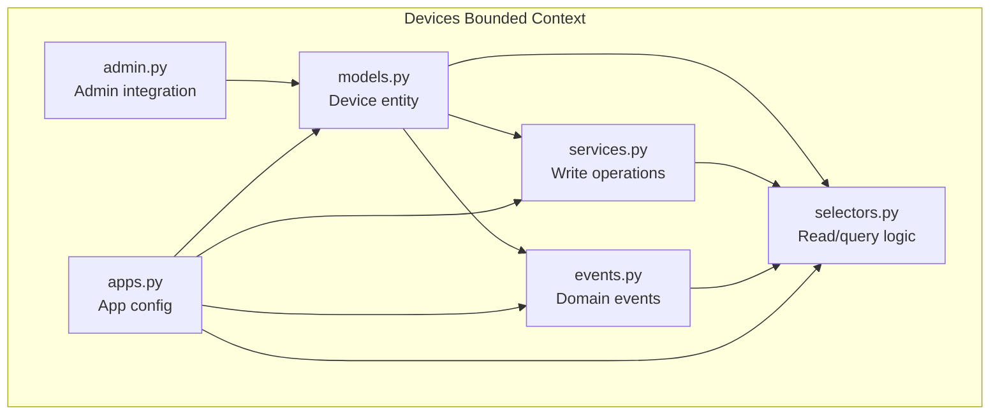
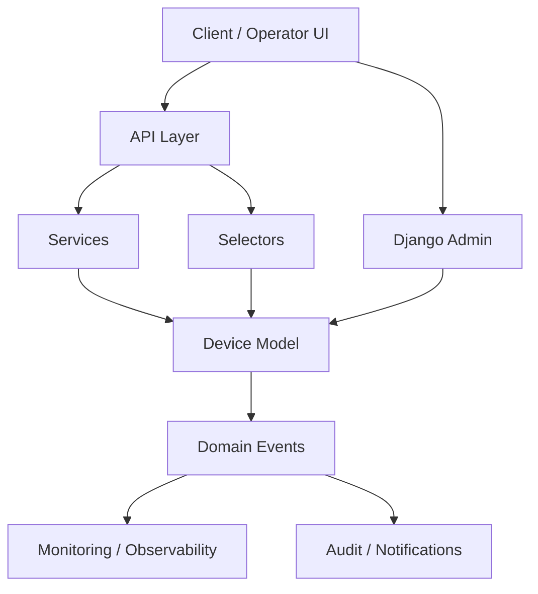
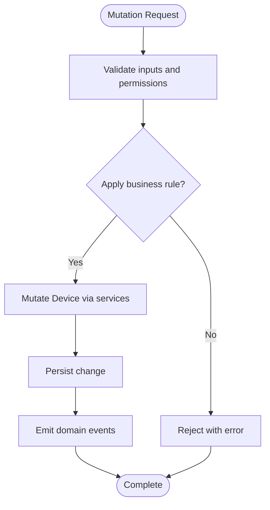
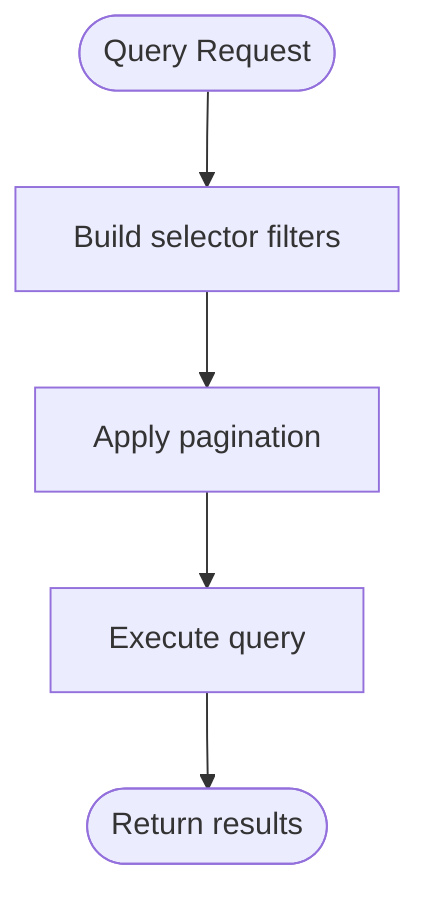
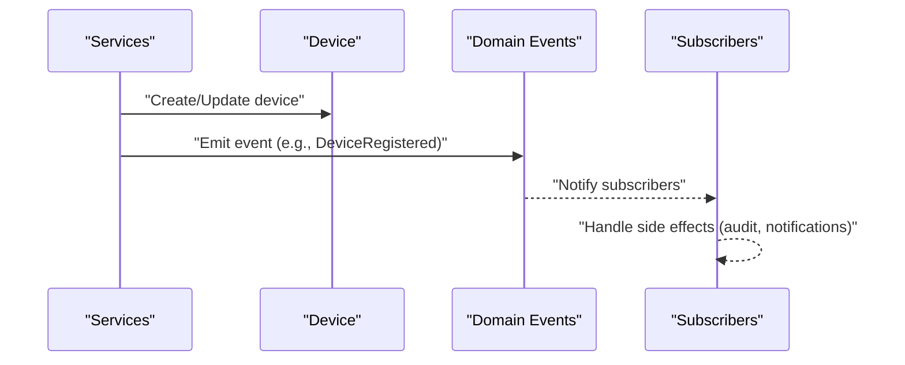
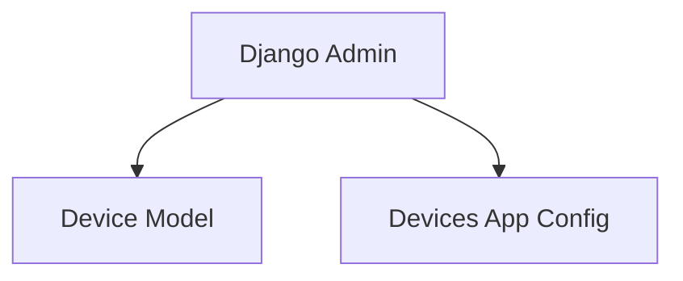
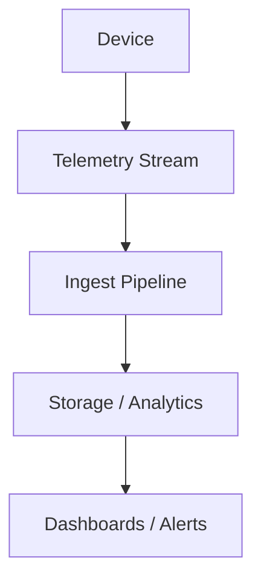
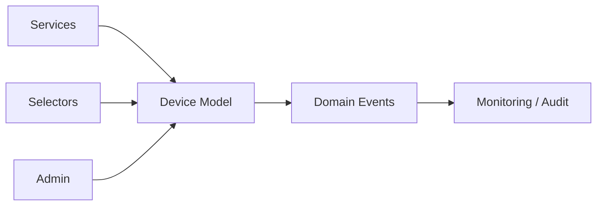

# Device Management

<cite>
**Referenced Files in This Document**
- [models.py](file://backend/apps/devices/models.py)
- [services.py](file://backend/apps/devices/services.py)
- [selectors.py](file://backend/apps/devices/selectors.py)
- [events.py](file://backend/apps/devices/events.py)
- [admin.py](file://backend/apps/devices/admin.py)
- [apps.py](file://backend/apps/devices/apps.py)
- [IOT_INGEST.md](file://backend/docs/architecture/IOT_INGEST.md)
</cite>

## Table of Contents
1. [Introduction](#introduction)
2. [Project Structure](#project-structure)
3. [Core Components](#core-components)
4. [Architecture Overview](#architecture-overview)
5. [Detailed Component Analysis](#detailed-component-analysis)
6. [Dependency Analysis](#dependency-analysis)
7. [Performance Considerations](#performance-considerations)
8. [Troubleshooting Guide](#troubleshooting-guide)
9. [Conclusion](#conclusion)

## Introduction
This document describes the Device Management domain within the Flower IoT platform. It focuses on how IoT devices are represented, registered, provisioned, queried, monitored, and integrated with sensor data ingestion. The domain follows a bounded context approach with explicit separation of concerns:
- Entities and models define the device data structures and relationships.
- Services encapsulate write operations and business logic.
- Selectors centralize read/query logic.
- Events represent domain events for lifecycle management.
- Integration documentation outlines how device telemetry feeds into the broader system.

## Project Structure
The Device Management domain resides under backend/apps/devices and includes:
- models.py: Device entity definition and metadata.
- services.py: Write operations and mutation logic for devices.
- selectors.py: Read/query logic for devices.
- events.py: Domain event definitions for device lifecycle.
- admin.py: Django admin integration.
- apps.py: Application configuration.



**Diagram sources**
- [models.py:12-29](file://backend/apps/devices/models.py#L12-L29)
- [services.py:1-7](file://backend/apps/devices/services.py#L1-L7)
- [selectors.py:1-7](file://backend/apps/devices/selectors.py#L1-L7)
- [events.py:1-7](file://backend/apps/devices/events.py#L1-L7)
- [admin.py:1-3](file://backend/apps/devices/admin.py#L1-L3)
- [apps.py](file://backend/apps/devices/apps.py)

**Section sources**
- [models.py:1-29](file://backend/apps/devices/models.py#L1-L29)
- [services.py:1-7](file://backend/apps/devices/services.py#L1-L7)
- [selectors.py:1-7](file://backend/apps/devices/selectors.py#L1-L7)
- [events.py:1-7](file://backend/apps/devices/events.py#L1-L7)
- [admin.py:1-3](file://backend/apps/devices/admin.py#L1-L3)
- [apps.py](file://backend/apps/devices/apps.py)

## Core Components
- Device entity: Central model representing IoT devices with placeholders for hardware identifiers, firmware versioning, assignment to planters, connectivity status, and telemetry-related fields.
- Services: Encapsulate all write operations and mutations to device data, enforcing a single entry point for changes.
- Selectors: Provide centralized, testable query logic for device data retrieval.
- Events: Lightweight data structures capturing domain events such as device registration, firmware updates, and connectivity status changes.
- Admin: Exposes device records in the Django admin interface for operational tasks.
- App configuration: Registers the devices app within the Django project.

Key responsibilities:
- Registration and provisioning: Enforce controlled creation and credential generation via services.
- Queries and monitoring: Use selectors for filtering, sorting, and paginating device data.
- Lifecycle events: Emit and handle domain events for auditing and downstream integrations.
- Integration: Align with sensor data ingestion pipeline for real-time monitoring.

**Section sources**
- [models.py:12-29](file://backend/apps/devices/models.py#L12-L29)
- [services.py:1-7](file://backend/apps/devices/services.py#L1-L7)
- [selectors.py:1-7](file://backend/apps/devices/selectors.py#L1-L7)
- [events.py:1-7](file://backend/apps/devices/events.py#L1-L7)
- [admin.py:1-3](file://backend/apps/devices/admin.py#L1-L3)
- [apps.py](file://backend/apps/devices/apps.py)

## Architecture Overview
The Device Management domain adheres to a clean, bounded-context architecture:
- Model-driven entity definition with future field additions for hardware identifiers, firmware, assignments, and connectivity.
- Services as the exclusive mutation boundary.
- Selectors as the exclusive query boundary.
- Events decoupling domain actions from side effects.
- Admin integration for operational visibility.



[No sources needed since this diagram shows conceptual workflow, not actual code structure]

## Detailed Component Analysis

### Device Entity Model
The Device entity serves as the central model for IoT device representation. It currently defines placeholder fields indicating planned attributes such as hardware identifiers, device type, firmware version, assignment to a planter, last seen timestamp, battery level, and connectivity status. These placeholders signal the intended schema evolution and capabilities.

```mermaid
classDiagram
class Device {
"+Meta.verbose_name"
"+Meta.verbose_name_plural"
}
```

**Diagram sources**
- [models.py:12-29](file://backend/apps/devices/models.py#L12-L29)

**Section sources**
- [models.py:12-29](file://backend/apps/devices/models.py#L12-L29)

### Services Layer (Device Write Operations)
The services module documents the authoritative boundary for device mutations. It enforces that all changes to device data must traverse this layer, preventing direct model writes elsewhere and ensuring business rules and validations are consistently applied.



**Diagram sources**
- [services.py:1-7](file://backend/apps/devices/services.py#L1-L7)

**Section sources**
- [services.py:1-7](file://backend/apps/devices/services.py#L1-L7)

### Selectors Layer (Device Queries)
The selectors module establishes a centralized, testable boundary for device queries. It ensures consistent filtering, sorting, and pagination of device data, enabling reuse across views, APIs, and background tasks.



**Diagram sources**
- [selectors.py:1-7](file://backend/apps/devices/selectors.py#L1-L7)

**Section sources**
- [selectors.py:1-7](file://backend/apps/devices/selectors.py#L1-L7)

### Domain Events
Domain events capture significant occurrences in the device lifecycle, such as registration, firmware updates, and connectivity status changes. These events are lightweight data structures distinct from Django signals, designed for eventual consistency and decoupled processing.



**Diagram sources**
- [events.py:1-7](file://backend/apps/devices/events.py#L1-L7)

**Section sources**
- [events.py:1-7](file://backend/apps/devices/events.py#L1-L7)

### Admin Integration
The Django admin integration exposes device records for operational tasks such as viewing, filtering, and manual edits. It leverages the underlying model and app configuration to present a user-friendly interface.



**Diagram sources**
- [admin.py:1-3](file://backend/apps/devices/admin.py#L1-L3)
- [apps.py](file://backend/apps/devices/apps.py)

**Section sources**
- [admin.py:1-3](file://backend/apps/devices/admin.py#L1-L3)
- [apps.py](file://backend/apps/devices/apps.py)

### Sensor Data Ingestion Integration
Device telemetry and sensor data are integrated into the broader platform through documented ingestion pathways. This enables real-time monitoring, alerting, and analytics aligned with device status and connectivity.



**Diagram sources**
- [IOT_INGEST.md](file://backend/docs/architecture/IOT_INGEST.md)

**Section sources**
- [IOT_INGEST.md](file://backend/docs/architecture/IOT_INGEST.md)

## Dependency Analysis
The devices bounded context maintains clear boundaries:
- Services depend on the Device model and emit domain events.
- Selectors depend on the Device model for querying.
- Admin depends on the Device model and app configuration.
- Domain events are consumed by downstream systems for monitoring and auditing.



[No sources needed since this diagram shows conceptual relationships, not specific code structure]

## Performance Considerations
- Use selectors for efficient querying with appropriate filters and pagination to avoid N+1 queries.
- Batch operations for device provisioning and firmware updates to reduce overhead.
- Index frequently queried fields (e.g., device identifiers, connectivity status) to improve lookup performance.
- Emit domain events asynchronously to prevent blocking write operations.

## Troubleshooting Guide
Common scenarios and resolutions:
- Device not appearing in queries: Verify selectors are used and filters match expected criteria.
- Unauthorized mutations: Ensure all changes pass through services to enforce business rules.
- Event delivery issues: Confirm domain events are emitted and subscribed consumers are healthy.
- Admin discrepancies: Re-index or refresh admin views if stale data appears.

## Conclusion
The Device Management domain provides a robust, bounded context for IoT device lifecycle management. By enforcing strict separation between reads (selectors), writes (services), and events, it supports scalable, maintainable operations. Integration with sensor data ingestion enables comprehensive monitoring and alerting. As the Device model evolves, continue to expand services and selectors to reflect new capabilities while preserving the established architectural patterns.