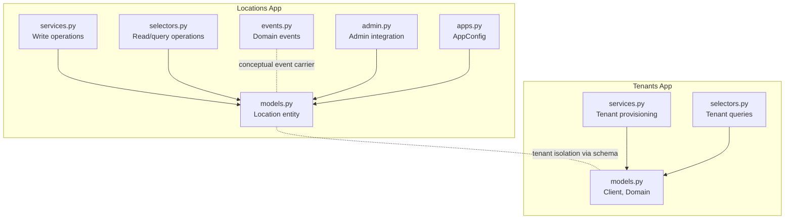
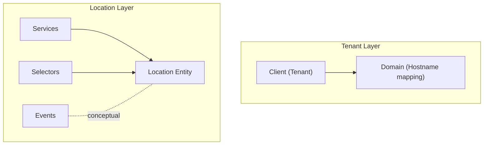
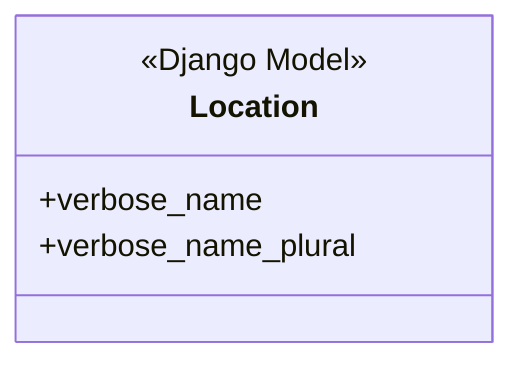
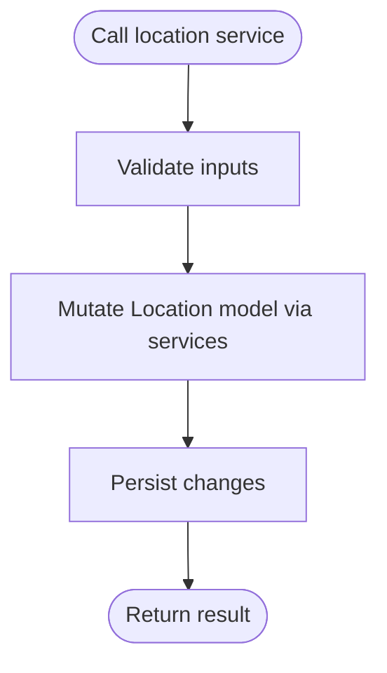
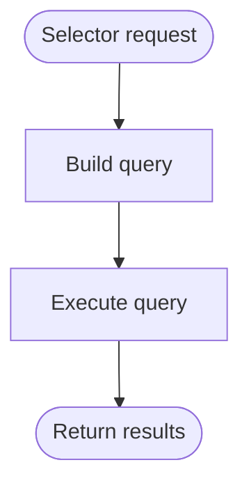
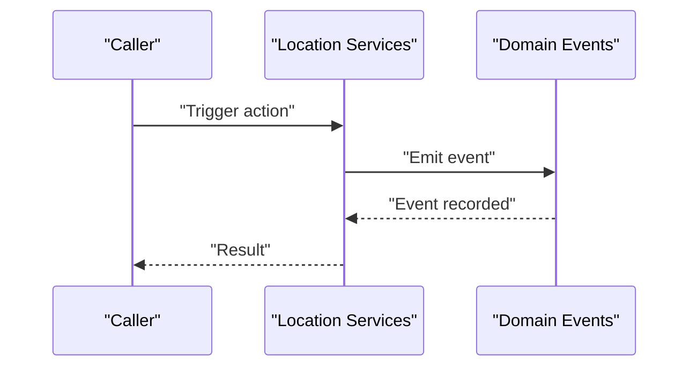
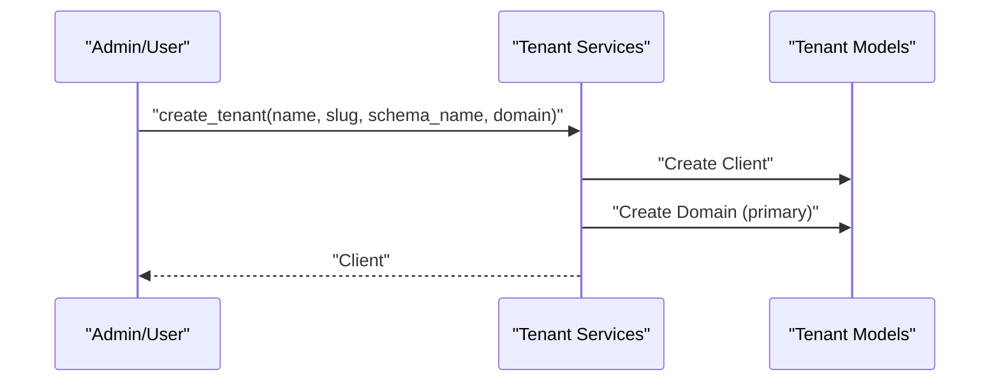
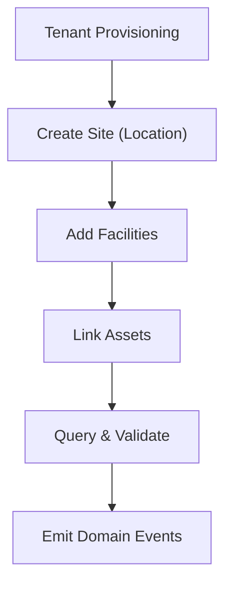
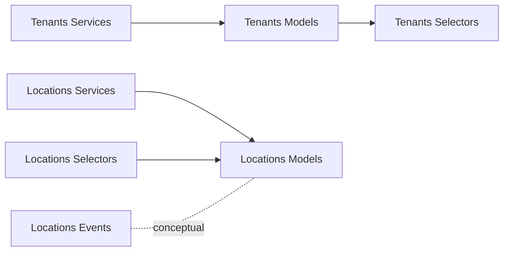

# Location Management

<cite>
**Referenced Files in This Document**
- [models.py](file://backend/apps/locations/models.py)
- [services.py](file://backend/apps/locations/services.py)
- [selectors.py](file://backend/apps/locations/selectors.py)
- [events.py](file://backend/apps/locations/events.py)
- [apps.py](file://backend/apps/locations/apps.py)
- [admin.py](file://backend/apps/locations/admin.py)
- [models.py](file://backend/apps/tenants/models.py)
- [services.py](file://backend/apps/tenants/services.py)
- [selectors.py](file://backend/apps/tenants/selectors.py)
- [test_tenants.py](file://backend/tests/test_tenants.py)
</cite>

## Table of Contents
1. [Introduction](#introduction)
2. [Project Structure](#project-structure)
3. [Core Components](#core-components)
4. [Architecture Overview](#architecture-overview)
5. [Detailed Component Analysis](#detailed-component-analysis)
6. [Dependency Analysis](#dependency-analysis)
7. [Performance Considerations](#performance-considerations)
8. [Troubleshooting Guide](#troubleshooting-guide)
9. [Conclusion](#conclusion)
10. [Appendices](#appendices)

## Introduction
This document describes the Location Management domain responsible for modeling geographic sites and facilities within a multi-tenant PlantOps environment. It covers the Location entity model, service-layer write operations, selector-based read operations, and domain events. It also explains how locations relate to tenants via separate bounded contexts, outlines conceptual workflows for site onboarding and facility mapping, and highlights geographic data handling considerations and validation rules.

## Project Structure
The Location Management domain is implemented as a Django app with a clear separation of concerns:
- Model layer: defines the Location entity placeholder and future geographic attributes.
- Services layer: encapsulates write operations and enforces mutation policies.
- Selectors layer: centralizes read/query logic for testability and reuse.
- Events: captures domain events as lightweight data carriers.
- Admin and AppConfig: integrate the app into the Django admin and application registry.

**Diagram sources**
- [models.py:1-26](file://backend/apps/locations/models.py#L1-L26)
- [services.py:1-7](file://backend/apps/locations/services.py#L1-L7)
- [selectors.py:1-7](file://backend/apps/locations/selectors.py#L1-L7)
- [events.py:1-7](file://backend/apps/locations/events.py#L1-L7)
- [admin.py:1-3](file://backend/apps/locations/admin.py#L1-L3)
- [apps.py:1-12](file://backend/apps/locations/apps.py#L1-L12)
- [models.py:1-77](file://backend/apps/tenants/models.py#L1-L77)
- [services.py:1-42](file://backend/apps/tenants/services.py#L1-L42)
- [selectors.py:1-26](file://backend/apps/tenants/selectors.py#L1-L26)

**Section sources**
- [models.py:1-26](file://backend/apps/locations/models.py#L1-L26)
- [services.py:1-7](file://backend/apps/locations/services.py#L1-L7)
- [selectors.py:1-7](file://backend/apps/locations/selectors.py#L1-L7)
- [events.py:1-7](file://backend/apps/locations/events.py#L1-L7)
- [apps.py:1-12](file://backend/apps/locations/apps.py#L1-L12)
- [admin.py:1-3](file://backend/apps/locations/admin.py#L1-L3)
- [models.py:1-77](file://backend/apps/tenants/models.py#L1-L77)
- [services.py:1-42](file://backend/apps/tenants/services.py#L1-L42)
- [selectors.py:1-26](file://backend/apps/tenants/selectors.py#L1-L26)

## Core Components
- Location entity: A placeholder model indicating future fields for name, description, address, coordinates, timezone, and photos. It establishes the domain’s naming conventions and meta options.
- Services: Enforce that all mutations to location data must occur through the services module, preventing direct model writes elsewhere.
- Selectors: Centralize read and query logic for location data, ensuring testability and consistency.
- Events: Define domain events as lightweight data carriers (not Django signals), enabling decoupled lifecycle notifications.
- Tenants integration: Tenant models and services demonstrate multi-tenancy via isolated schemas, which applies to location data isolation.

Key responsibilities:
- Location model: Define the entity shape and metadata.
- Services: Provide controlled creation/update/deactivation flows.
- Selectors: Provide reusable query interfaces.
- Events: Capture significant domain actions for downstream processing.
- Tenants: Establish tenant boundaries and schema isolation.

**Section sources**
- [models.py:12-26](file://backend/apps/locations/models.py#L12-L26)
- [services.py:1-7](file://backend/apps/locations/services.py#L1-L7)
- [selectors.py:1-7](file://backend/apps/locations/selectors.py#L1-L7)
- [events.py:1-7](file://backend/apps/locations/events.py#L1-L7)
- [models.py:6-53](file://backend/apps/tenants/models.py#L6-L53)
- [services.py:11-35](file://backend/apps/tenants/services.py#L11-L35)

## Architecture Overview
The Location Management domain follows a clean, bounded-context architecture:
- Write operations are channeled through services.
- Read operations are channeled through selectors.
- Domain events capture lifecycle changes.
- Multi-tenancy is enforced via tenant models and services, with schema isolation.

**Diagram sources**
- [models.py:6-76](file://backend/apps/tenants/models.py#L6-L76)
- [services.py:11-35](file://backend/apps/tenants/services.py#L11-L35)
- [models.py:12-26](file://backend/apps/locations/models.py#L12-L26)
- [services.py:1-7](file://backend/apps/locations/services.py#L1-L7)
- [selectors.py:1-7](file://backend/apps/locations/selectors.py#L1-L7)
- [events.py:1-7](file://backend/apps/locations/events.py#L1-L7)

## Detailed Component Analysis

### Location Entity Model
The Location model currently serves as a placeholder with documented future fields for name, description, address, coordinates, timezone, and photos. It sets the verbose naming for admin and pluralization.

**Diagram sources**
- [models.py:12-26](file://backend/apps/locations/models.py#L12-L26)

**Section sources**
- [models.py:12-26](file://backend/apps/locations/models.py#L12-L26)

### Services Layer (Write Operations)
The services module documents that all mutations to location data must go through this module, enforcing a single mutation boundary. While the current implementation is minimal, it establishes the policy for future write operations.

**Diagram sources**
- [services.py:1-7](file://backend/apps/locations/services.py#L1-L7)

**Section sources**
- [services.py:1-7](file://backend/apps/locations/services.py#L1-L7)

### Selectors Layer (Read Operations)
The selectors module documents that all queries for location data must go through this module, keeping read logic centralized and testable. The current implementation is minimal, but it establishes the pattern for future read APIs.

**Diagram sources**
- [selectors.py:1-7](file://backend/apps/locations/selectors.py#L1-L7)

**Section sources**
- [selectors.py:1-7](file://backend/apps/locations/selectors.py#L1-L7)

### Domain Events
The events module documents that domain events are lightweight data carriers representing something that happened in the domain. These are intentionally not Django signals, enabling explicit, testable event handling.

**Diagram sources**
- [events.py:1-7](file://backend/apps/locations/events.py#L1-L7)

**Section sources**
- [events.py:1-7](file://backend/apps/locations/events.py#L1-L7)

### Multi-Tenant Support and Schema Isolation
Tenants are modeled with a tenant mixin and a domain mapping. The tenant services demonstrate creating a tenant with a schema and primary domain, and deactivating a tenant. Tests confirm the tenant provisioning and deactivation flows.

**Diagram sources**
- [services.py:11-35](file://backend/apps/tenants/services.py#L11-L35)
- [models.py:6-76](file://backend/apps/tenants/models.py#L6-L76)
- [test_tenants.py:18-36](file://backend/tests/test_tenants.py#L18-L36)

**Section sources**
- [models.py:6-76](file://backend/apps/tenants/models.py#L6-L76)
- [services.py:11-35](file://backend/apps/tenants/services.py#L11-L35)
- [selectors.py:13-25](file://backend/apps/tenants/selectors.py#L13-L25)
- [test_tenants.py:18-50](file://backend/tests/test_tenants.py#L18-L50)

### Conceptual Workflows
Site Onboarding Workflow
- Provision tenant (schema and primary domain) via tenant services.
- Create location(s) under the tenant’s schema via location services.
- Configure facilities within locations via services.
- Use selectors to query and validate site/facility data.

Facility Mapping
- Use selectors to enumerate facilities per site.
- Apply validation rules for facility identifiers and capacity.
- Emit domain events for facility creation/update.

Location-Based Asset Tracking
- Track assets linked to facilities within locations.
- Use selectors to filter assets by location hierarchy.
- Enforce timezone-awareness and coordinate-based proximity checks conceptually.

[No sources needed since this diagram shows conceptual workflow, not actual code structure]

## Dependency Analysis
- The Locations app depends on Django models and maintains separation between services, selectors, and events.
- The Tenants app provides the multi-tenant foundation with schema isolation and domain mapping.
- Tests validate tenant provisioning and deactivation, indirectly supporting the tenant-isolation model for locations.

**Diagram sources**
- [services.py:11-35](file://backend/apps/tenants/services.py#L11-L35)
- [models.py:6-76](file://backend/apps/tenants/models.py#L6-L76)
- [selectors.py:13-25](file://backend/apps/tenants/selectors.py#L13-L25)
- [services.py:1-7](file://backend/apps/locations/services.py#L1-L7)
- [models.py:12-26](file://backend/apps/locations/models.py#L12-L26)
- [selectors.py:1-7](file://backend/apps/locations/selectors.py#L1-L7)
- [events.py:1-7](file://backend/apps/locations/events.py#L1-L7)

**Section sources**
- [services.py:11-35](file://backend/apps/tenants/services.py#L11-L35)
- [models.py:6-76](file://backend/apps/tenants/models.py#L6-L76)
- [selectors.py:13-25](file://backend/apps/tenants/selectors.py#L13-L25)
- [services.py:1-7](file://backend/apps/locations/services.py#L1-L7)
- [models.py:12-26](file://backend/apps/locations/models.py#L12-L26)
- [selectors.py:1-7](file://backend/apps/locations/selectors.py#L1-L7)
- [events.py:1-7](file://backend/apps/locations/events.py#L1-L7)

## Performance Considerations
- Keep selectors efficient by using database indexing on frequently queried fields (e.g., tenant identifiers, location slugs).
- Batch writes in services to minimize round-trips during site onboarding or facility bulk updates.
- Use select_related and prefetch_related in selectors to reduce N+1 query risks.
- Consider caching for read-heavy workflows (e.g., facility lists) while ensuring cache invalidation aligns with domain events.

## Troubleshooting Guide
- If direct model writes fail, verify that all mutations are routed through the services module.
- If queries are slow, review selector implementations and add appropriate database indexes.
- For tenant isolation issues, confirm that the tenant schema exists and is active, and that requests are routed to the correct schema.
- Validate domain event emission by checking that services emit events after successful mutations.

## Conclusion
The Location Management domain is structured around a clear separation of services, selectors, and events, with multi-tenancy enforced via tenant models and schema isolation. While the Location model currently acts as a placeholder, the established patterns enable robust extension for geographic data, hierarchy, and lifecycle events. Tenant services and selectors provide a reliable foundation for multi-tenant deployments, and the documented workflows support site onboarding, facility mapping, and location-based asset tracking.

## Appendices
- Administrative integration: The Locations app integrates with Django admin and AppConfig, enabling admin UI and app initialization hooks.
- Testing: Tenant tests validate provisioning and deactivation flows, demonstrating the reliability of the multi-tenant model that applies to location data isolation.

**Section sources**
- [admin.py:1-3](file://backend/apps/locations/admin.py#L1-L3)
- [apps.py:5-12](file://backend/apps/locations/apps.py#L5-L12)
- [test_tenants.py:18-50](file://backend/tests/test_tenants.py#L18-L50)