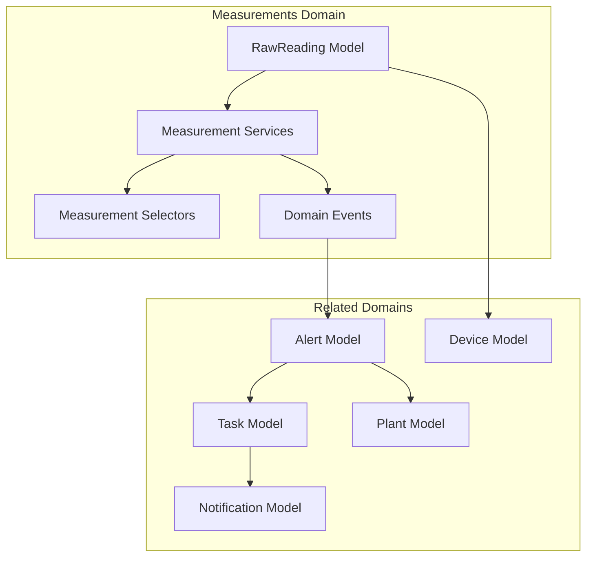
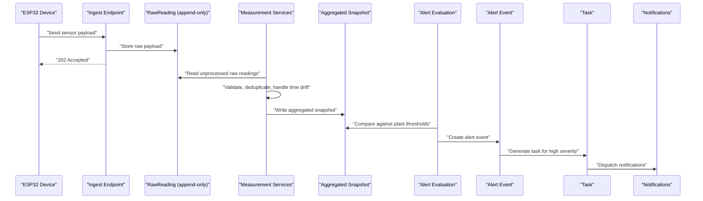
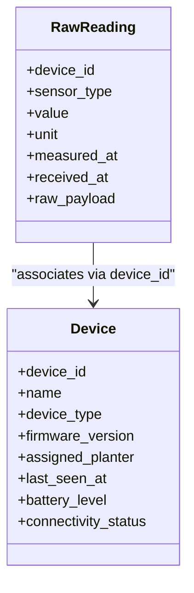
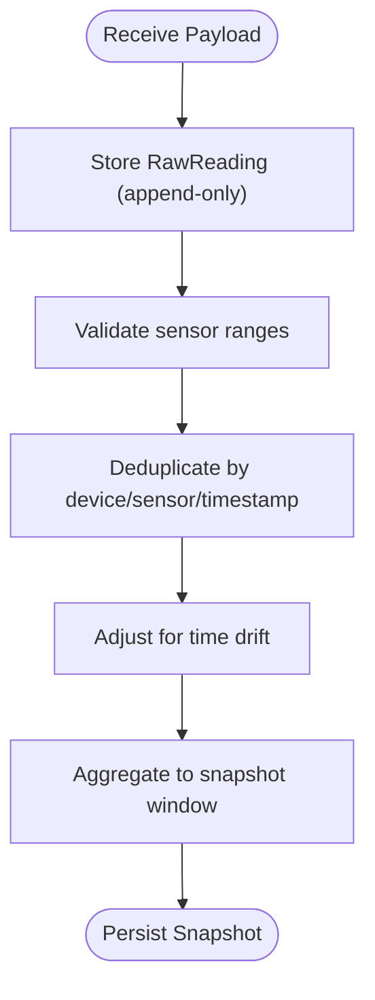
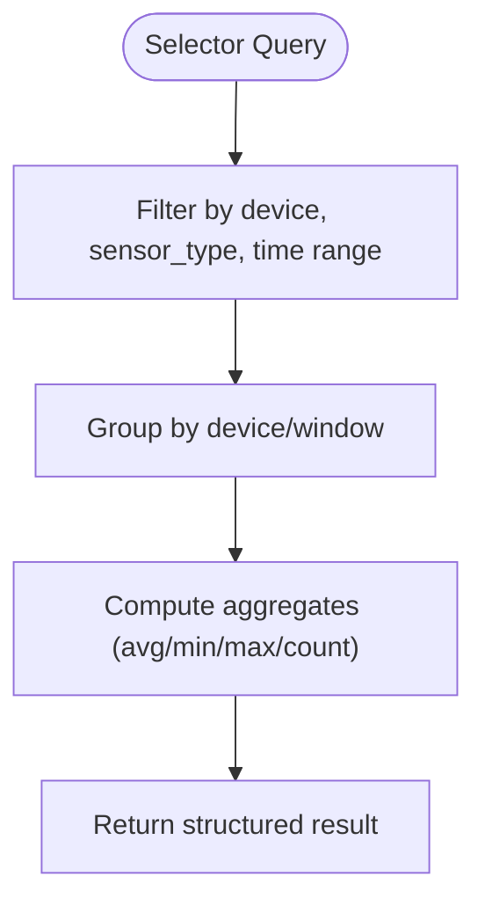
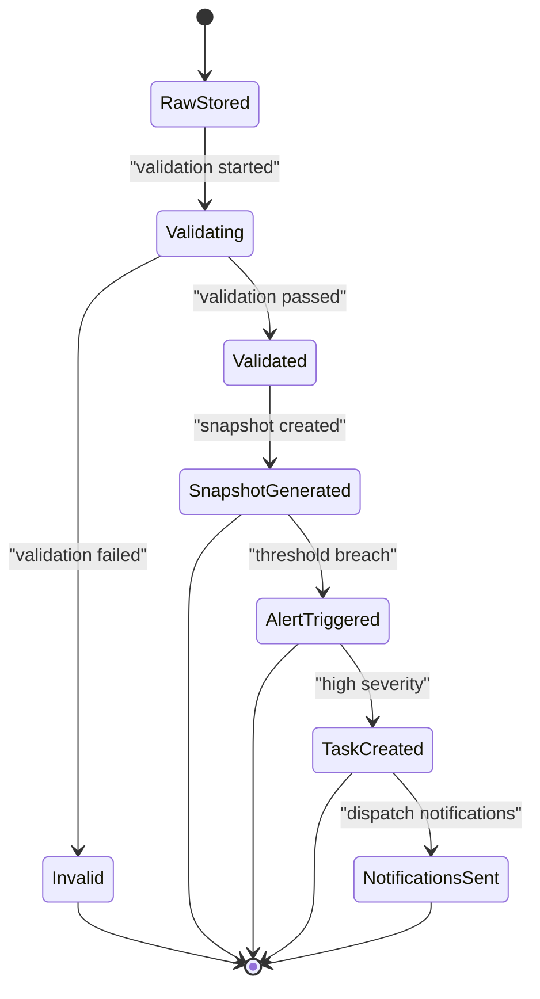
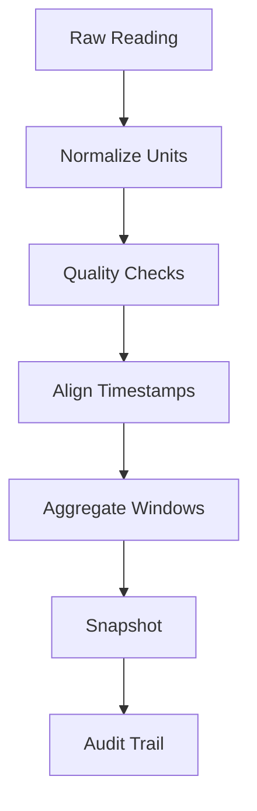
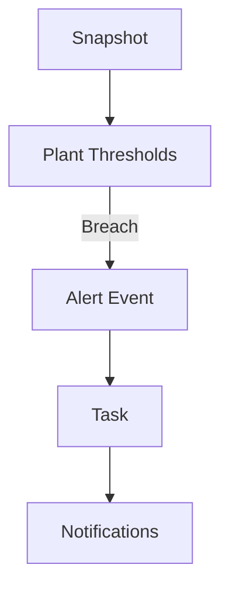
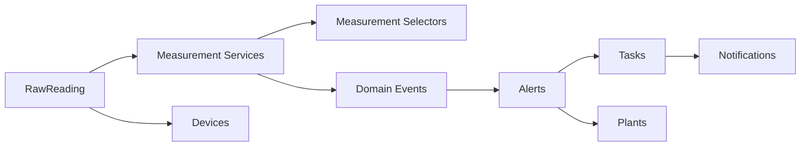

# Measurement Processing

<cite>
**Referenced Files in This Document**
- [IOT_INGEST.md](file://backend/docs/architecture/IOT_INGEST.md)
- [models.py](file://backend/apps/measurements/models.py)
- [services.py](file://backend/apps/measurements/services.py)
- [selectors.py](file://backend/apps/measurements/selectors.py)
- [events.py](file://backend/apps/measurements/events.py)
- [apps.py](file://backend/apps/measurements/apps.py)
- [models.py](file://backend/apps/devices/models.py)
- [models.py](file://backend/apps/alerts/models.py)
- [models.py](file://backend/apps/plants/models.py)
- [models.py](file://backend/apps/tasks/models.py)
- [models.py](file://backend/apps/notifications/models.py)
</cite>

## Table of Contents
1. [Introduction](#introduction)
2. [Project Structure](#project-structure)
3. [Core Components](#core-components)
4. [Architecture Overview](#architecture-overview)
5. [Detailed Component Analysis](#detailed-component-analysis)
6. [Dependency Analysis](#dependency-analysis)
7. [Performance Considerations](#performance-considerations)
8. [Troubleshooting Guide](#troubleshooting-guide)
9. [Conclusion](#conclusion)

## Introduction
This document explains the Measurement Processing domain that handles raw sensor data ingestion, validation, transformation, and aggregation. It covers the RawReading entity model, ingestion and validation through the measurement service layer, query and aggregation via selectors, domain events for lifecycle management, data transformation workflows, quality assurance processes, historical data management, and integration with alert generation systems. The pipeline follows strict append-only principles for raw readings and snapshots, ensuring data integrity and idempotent processing.

## Project Structure
The Measurement Processing domain spans several Django apps and shared architectural documents:
- measurements: raw sensor readings and processing orchestration
- devices: device metadata and associations
- alerts: alert events and thresholds
- plants: plant care thresholds and context
- tasks: work tasks generated from alerts
- notifications: alert/task notification dispatch
- docs/architecture: IoT ingest pipeline and operational principles

**Diagram sources**
- [models.py:14-29](file://backend/apps/measurements/models.py#L14-L29)
- [services.py:1-8](file://backend/apps/measurements/services.py#L1-L8)
- [selectors.py:1-6](file://backend/apps/measurements/selectors.py#L1-L6)
- [events.py:1-7](file://backend/apps/measurements/events.py#L1-L7)
- [models.py:12-28](file://backend/apps/devices/models.py#L12-L28)
- [models.py](file://backend/apps/alerts/models.py)
- [models.py](file://backend/apps/plants/models.py)
- [models.py](file://backend/apps/tasks/models.py)
- [models.py](file://backend/apps/notifications/models.py)

**Section sources**
- [apps.py:5-11](file://backend/apps/measurements/apps.py#L5-L11)
- [IOT_INGEST.md:1-87](file://backend/docs/architecture/IOT_INGEST.md#L1-L87)

## Core Components
- RawReading: Append-only record of raw sensor data with device association, sensor type, value, units, device timestamp, server reception timestamp, and raw payload storage. See [RawReading model:14-29](file://backend/apps/measurements/models.py#L14-L29).
- Measurement Services: Write operations module enforcing mutation through services only; raw readings are append-only. See [Measurement services:1-8](file://backend/apps/measurements/services.py#L1-L8).
- Measurement Selectors: Centralized read operations module for queries and aggregation. See [Measurement selectors:1-6](file://backend/apps/measurements/selectors.py#L1-L6).
- Domain Events: Lightweight dataclasses representing domain facts; not Django signals. See [Measurement events:1-7](file://backend/apps/measurements/events.py#L1-L7).
- Device Model: Device metadata and associations used by measurements. See [Device model:12-28](file://backend/apps/devices/models.py#L12-L28).

**Section sources**
- [models.py:14-29](file://backend/apps/measurements/models.py#L14-L29)
- [services.py:1-8](file://backend/apps/measurements/services.py#L1-L8)
- [selectors.py:1-6](file://backend/apps/measurements/selectors.py#L1-L6)
- [events.py:1-7](file://backend/apps/measurements/events.py#L1-L7)
- [models.py:12-28](file://backend/apps/devices/models.py#L12-L28)

## Architecture Overview
The IoT ingest pipeline transforms raw sensor payloads into validated, aggregated snapshots and triggers alerts and tasks.

**Diagram sources**
- [IOT_INGEST.md:5-71](file://backend/docs/architecture/IOT_INGEST.md#L5-L71)
- [models.py:14-29](file://backend/apps/measurements/models.py#L14-L29)
- [services.py:1-8](file://backend/apps/measurements/services.py#L1-L8)
- [models.py](file://backend/apps/alerts/models.py)
- [models.py](file://backend/apps/tasks/models.py)
- [models.py](file://backend/apps/notifications/models.py)

## Detailed Component Analysis

### RawReading Entity Model
- Purpose: Persist raw sensor readings as immutable records.
- Timestamped values: measured_at (device time), received_at (server time).
- Device associations: device foreign key planned for future alignment with device registry.
- Quality indicators: raw_payload stored for audit and reprocessing; validation flags can be introduced later.
- Append-only constraint: enforced by policy; no updates or deletions allowed.

**Diagram sources**
- [models.py:14-29](file://backend/apps/measurements/models.py#L14-L29)
- [models.py:12-28](file://backend/apps/devices/models.py#L12-L28)

**Section sources**
- [models.py:14-29](file://backend/apps/measurements/models.py#L14-L29)
- [IOT_INGEST.md:45-57](file://backend/docs/architecture/IOT_INGEST.md#L45-L57)

### Measurement Ingestion and Validation (Services Layer)
- Ingestion: Ingest endpoint accepts device payloads, validates API key/device token, stores RawReading immediately, returns asynchronous acknowledgment.
- Validation: Range checks, deduplication, and time drift handling performed during processing.
- Idempotency: Processing is designed to avoid duplicates when re-run on the same raw reading.
- Append-only enforcement: Mutation occurs only through services; no direct model writes outside services.

**Diagram sources**
- [IOT_INGEST.md:39-57](file://backend/docs/architecture/IOT_INGEST.md#L39-L57)
- [services.py:1-8](file://backend/apps/measurements/services.py#L1-L8)

**Section sources**
- [IOT_INGEST.md:39-57](file://backend/docs/architecture/IOT_INGEST.md#L39-L57)
- [services.py:1-8](file://backend/apps/measurements/services.py#L1-L8)

### Measurement Queries and Aggregation (Selectors)
- Centralized reads: All measurement queries must go through selectors to keep logic testable and consistent.
- Aggregation patterns: Selectors compute per-device, per-sensor-type, and per-window aggregations (e.g., hourly) for dashboards and analytics.
- Historical views: Selectors expose time-series and summary views for reporting and debugging.

**Diagram sources**
- [selectors.py:1-6](file://backend/apps/measurements/selectors.py#L1-L6)

**Section sources**
- [selectors.py:1-6](file://backend/apps/measurements/selectors.py#L1-L6)

### Domain Events for Measurement Lifecycle Management
- Definition: Lightweight dataclasses representing domain facts; not Django signals.
- Examples: Data ingestion acknowledged, validation completed, snapshot generated, alert triggered, task assigned, notification dispatched.
- Immutable history: Events are append-only; resolution is modeled as a new event rather than updating existing ones.

**Diagram sources**
- [events.py:1-7](file://backend/apps/measurements/events.py#L1-L7)
- [IOT_INGEST.md:59-71](file://backend/docs/architecture/IOT_INGEST.md#L59-L71)

**Section sources**
- [events.py:1-7](file://backend/apps/measurements/events.py#L1-L7)
- [IOT_INGEST.md:59-71](file://backend/docs/architecture/IOT_INGEST.md#L59-L71)

### Data Transformation Workflows and Quality Assurance
- Transformation: Convert raw sensor values into standardized units, align timestamps, and derive derived metrics if needed.
- Quality assurance: Range validation, duplicate detection, and time synchronization mitigate data anomalies.
- Historical management: Append-only snapshots enable time-travel queries and audit trails without altering past records.

**Diagram sources**
- [IOT_INGEST.md:50-57](file://backend/docs/architecture/IOT_INGEST.md#L50-L57)
- [models.py:14-29](file://backend/apps/measurements/models.py#L14-L29)

**Section sources**
- [IOT_INGEST.md:50-57](file://backend/docs/architecture/IOT_INGEST.md#L50-L57)

### Integration with Alert Generation Systems
- Thresholds: Plant models define care thresholds; snapshot values are compared against them.
- Alerts: Breach conditions create alert events; high-severity alerts spawn tasks.
- Notifications: Tasks and alerts trigger multi-channel notifications.

**Diagram sources**
- [IOT_INGEST.md:59-71](file://backend/docs/architecture/IOT_INGEST.md#L59-L71)
- [models.py](file://backend/apps/alerts/models.py)
- [models.py](file://backend/apps/plants/models.py)
- [models.py](file://backend/apps/tasks/models.py)
- [models.py](file://backend/apps/notifications/models.py)

**Section sources**
- [IOT_INGEST.md:59-71](file://backend/docs/architecture/IOT_INGEST.md#L59-L71)

## Dependency Analysis
- Measurement services depend on RawReading for ingestion and produce snapshots and events.
- Selectors depend on snapshots and RawReading for queries.
- Alerts depend on snapshots and plant thresholds; tasks depend on alerts; notifications depend on tasks/alerts.
- Devices provide device metadata used by measurements.

**Diagram sources**
- [models.py:14-29](file://backend/apps/measurements/models.py#L14-L29)
- [services.py:1-8](file://backend/apps/measurements/services.py#L1-L8)
- [selectors.py:1-6](file://backend/apps/measurements/selectors.py#L1-L6)
- [events.py:1-7](file://backend/apps/measurements/events.py#L1-L7)
- [models.py:12-28](file://backend/apps/devices/models.py#L12-L28)
- [models.py](file://backend/apps/alerts/models.py)
- [models.py](file://backend/apps/plants/models.py)
- [models.py](file://backend/apps/tasks/models.py)
- [models.py](file://backend/apps/notifications/models.py)

**Section sources**
- [models.py:14-29](file://backend/apps/measurements/models.py#L14-L29)
- [models.py:12-28](file://backend/apps/devices/models.py#L12-L28)
- [models.py](file://backend/apps/alerts/models.py)
- [models.py](file://backend/apps/plants/models.py)
- [models.py](file://backend/apps/tasks/models.py)
- [models.py](file://backend/apps/notifications/models.py)

## Performance Considerations
- Append-only design minimizes write contention and supports idempotent processing.
- Aggregation windows (e.g., hourly) reduce query complexity and storage footprint.
- Centralized selectors enable caching and optimized query plans.
- Asynchronous processing decouples ingestion from heavy validation/aggregation.

## Troubleshooting Guide
- Raw reading not appearing: Verify ingestion endpoint accepted the payload and RawReading was stored; confirm append-only policy prevents deletion.
- Duplicate entries: Check deduplication logic and ensure processing is idempotent.
- Incorrect aggregates: Review aggregation windows and quality checks; validate timestamp alignment.
- Alerts not firing: Confirm plant thresholds and snapshot evaluation logic; verify alert event creation and task generation.
- Notifications not sent: Validate notification channels and task/alert linkage.

**Section sources**
- [IOT_INGEST.md:72-87](file://backend/docs/architecture/IOT_INGEST.md#L72-L87)
- [services.py:1-8](file://backend/apps/measurements/services.py#L1-L8)
- [selectors.py:1-6](file://backend/apps/measurements/selectors.py#L1-L6)

## Conclusion
The Measurement Processing domain enforces strict append-only policies, centralized services and selectors, and domain events to ensure data integrity, idempotent processing, and reliable alerting. The documented pipeline from raw sensor ingestion to snapshot generation and alert/task/notification dispatch provides a robust foundation for scalable, auditable, and maintainable sensor data workflows.