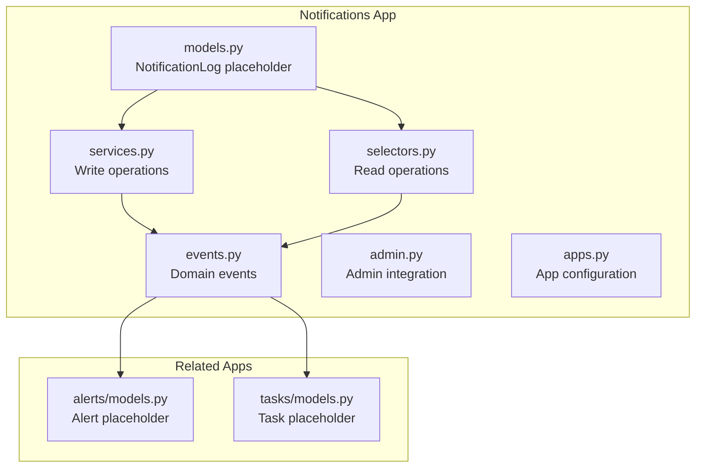
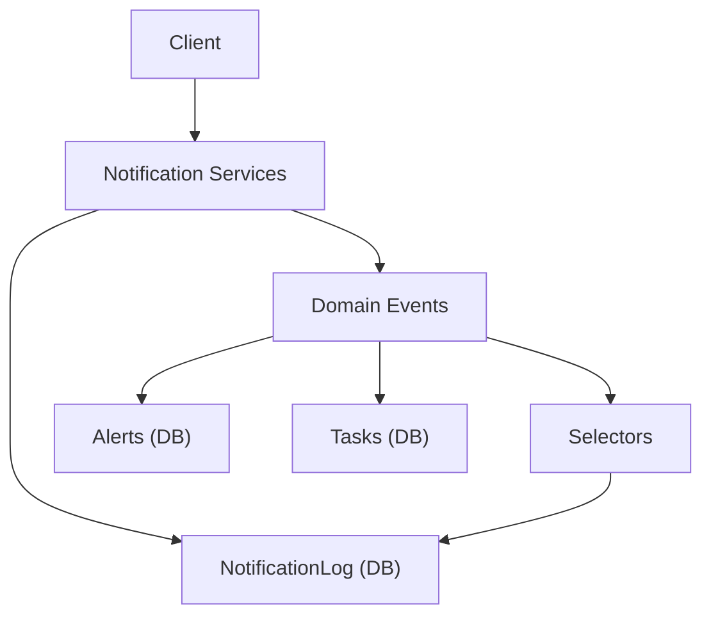
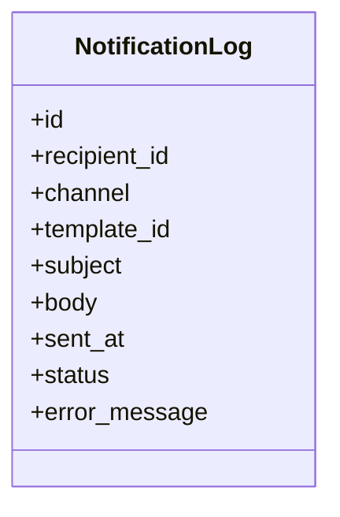
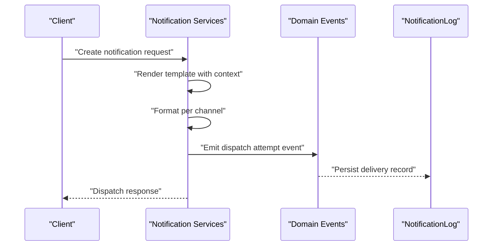
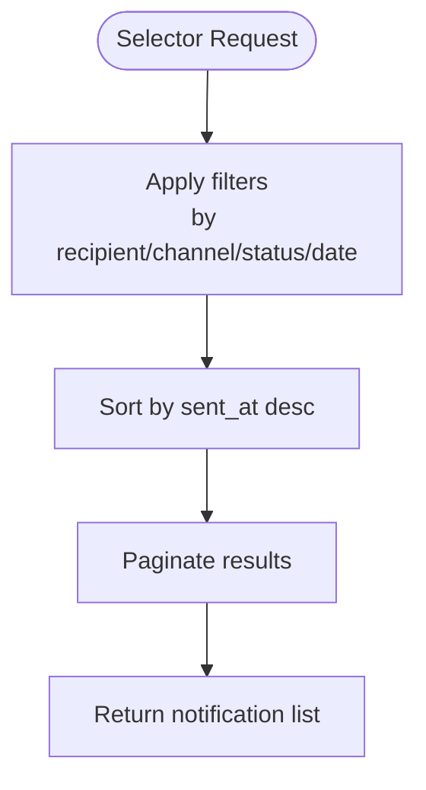
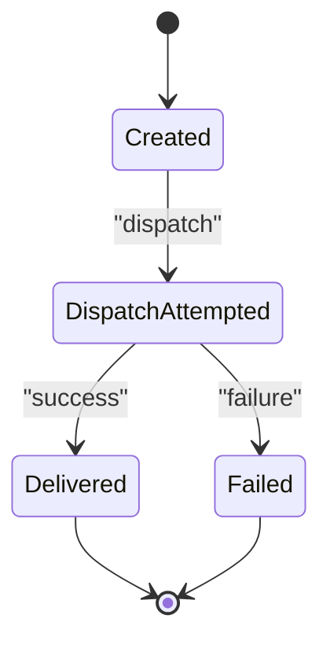
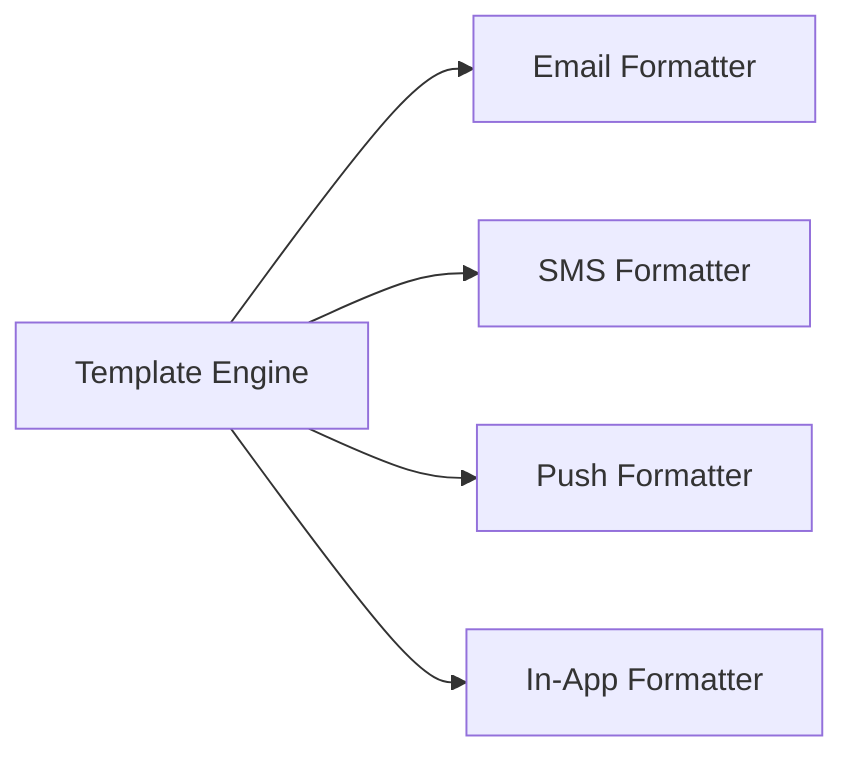
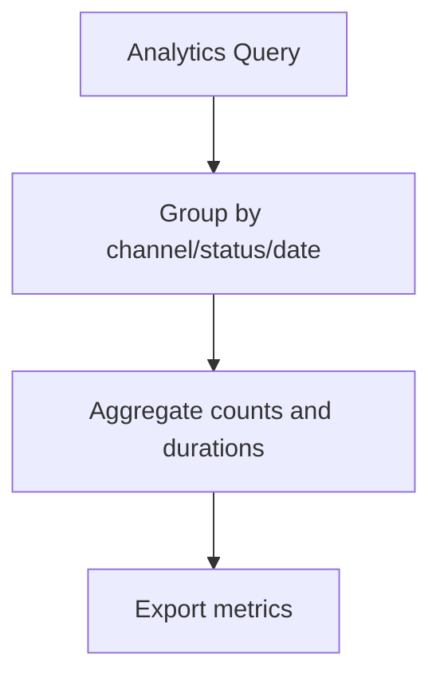
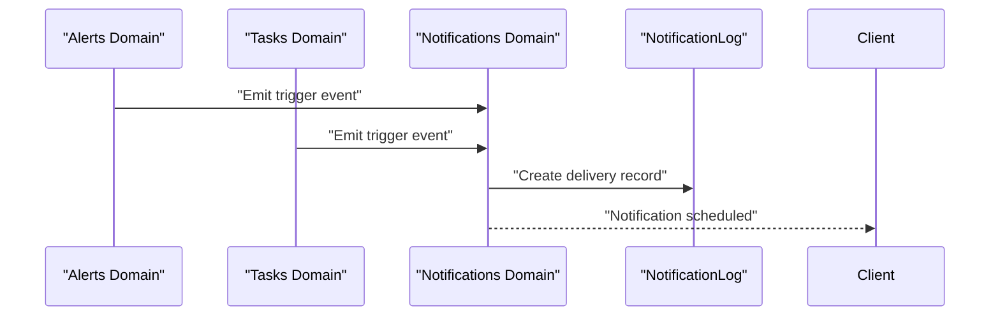
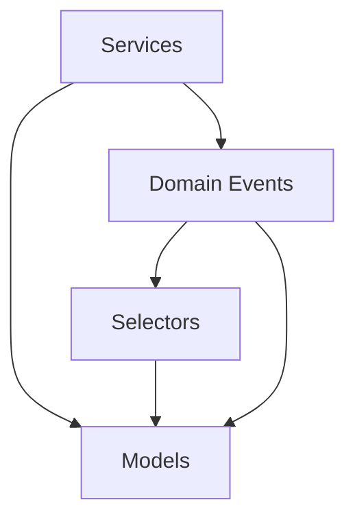

# Notification System

<cite>
**Referenced Files in This Document**
- [models.py](file://backend/apps/notifications/models.py)
- [services.py](file://backend/apps/notifications/services.py)
- [selectors.py](file://backend/apps/notifications/selectors.py)
- [events.py](file://backend/apps/notifications/events.py)
- [apps.py](file://backend/apps/notifications/apps.py)
- [admin.py](file://backend/apps/notifications/admin.py)
- [models.py](file://backend/apps/alerts/models.py)
- [services.py](file://backend/apps/alerts/services.py)
- [selectors.py](file://backend/apps/alerts/selectors.py)
- [models.py](file://backend/apps/tasks/models.py)
- [services.py](file://backend/apps/tasks/services.py)
- [selectors.py](file://backend/apps/tasks/selectors.py)
</cite>

## Table of Contents
1. [Introduction](#introduction)
2. [Project Structure](#project-structure)
3. [Core Components](#core-components)
4. [Architecture Overview](#architecture-overview)
5. [Detailed Component Analysis](#detailed-component-analysis)
6. [Dependency Analysis](#dependency-analysis)
7. [Performance Considerations](#performance-considerations)
8. [Troubleshooting Guide](#troubleshooting-guide)
9. [Conclusion](#conclusion)

## Introduction
This document describes the Notification System domain within the Flower project. It focuses on multi-channel notification dispatch, template management, and delivery tracking. The system is designed around a bounded context that supports email, SMS, push, and in-app notifications. The current implementation includes skeleton modules for models, services, selectors, events, admin, and app configuration. The document outlines the intended entity model, service-layer workflows, selector-based queries, domain events, and integration points with Alerts and Tasks.

## Project Structure
The Notification System resides in the notifications app and follows a clean separation of concerns:
- models.py defines the NotificationLog entity placeholder and future fields for recipients, channels, templates, content, timestamps, status, and error messages.
- services.py encapsulates write operations for notifications.
- selectors.py centralizes read operations for notifications.
- events.py defines domain events for notification lifecycle management.
- admin.py integrates with Django admin.
- apps.py configures the app.

**Diagram sources**
- [models.py:1-28](file://backend/apps/notifications/models.py#L1-L28)
- [services.py:1-7](file://backend/apps/notifications/services.py#L1-L7)
- [selectors.py:1-7](file://backend/apps/notifications/selectors.py#L1-L7)
- [events.py:1-7](file://backend/apps/notifications/events.py#L1-L7)
- [admin.py:1-3](file://backend/apps/notifications/admin.py#L1-L3)
- [apps.py:1-12](file://backend/apps/notifications/apps.py#L1-L12)
- [models.py:1-29](file://backend/apps/alerts/models.py#L1-L29)
- [models.py:1-29](file://backend/apps/tasks/models.py#L1-L29)

**Section sources**
- [models.py:1-28](file://backend/apps/notifications/models.py#L1-L28)
- [services.py:1-7](file://backend/apps/notifications/services.py#L1-L7)
- [selectors.py:1-7](file://backend/apps/notifications/selectors.py#L1-L7)
- [events.py:1-7](file://backend/apps/notifications/events.py#L1-L7)
- [admin.py:1-3](file://backend/apps/notifications/admin.py#L1-L3)
- [apps.py:1-12](file://backend/apps/notifications/apps.py#L1-L12)

## Core Components
- NotificationLog: A placeholder for the notification delivery log with planned fields for recipient, channel, template, subject/body, sent timestamp, status, and error message. This entity will serve as the backbone for delivery tracking and analytics.
- Services Layer: Enforces that all mutations to notification data occur through the services module, ensuring centralized control and testability.
- Selectors Layer: Centralizes read logic for notifications, keeping queries testable and maintainable.
- Domain Events: Lightweight data structures representing notification lifecycle events (creation, dispatch attempts, delivery confirmation), distinct from Django signals.
- Admin Integration: Provides administrative capabilities via Django admin with internationalization support.
- App Configuration: Registers the notifications app with Django and sets verbose naming.

**Section sources**
- [models.py:12-27](file://backend/apps/notifications/models.py#L12-L27)
- [services.py:1-7](file://backend/apps/notifications/services.py#L1-L7)
- [selectors.py:1-7](file://backend/apps/notifications/selectors.py#L1-L7)
- [events.py:1-7](file://backend/apps/notifications/events.py#L1-L7)
- [admin.py:1-3](file://backend/apps/notifications/admin.py#L1-L3)
- [apps.py:5-11](file://backend/apps/notifications/apps.py#L5-L11)

## Architecture Overview
The Notification System adheres to a layered architecture:
- Domain Model: NotificationLog captures delivery metadata and status.
- Service Layer: Orchestrates generation, template rendering, channel-specific formatting, and dispatch.
- Selector Layer: Provides query interfaces for delivery tracking and analytics.
- Domain Events: Decouples lifecycle events from service logic.
- Integration: Coordinates with Alerts and Tasks for trigger-based notifications.

[No sources needed since this diagram shows conceptual workflow, not actual code structure]

## Detailed Component Analysis

### NotificationLog Entity Model
The NotificationLog entity is designed to capture:
- Recipient reference (to be linked to a user)
- Channel type (email, SMS, push, in-app)
- Template identifier
- Subject and body content
- Timestamps for sending and status updates
- Delivery status and error messages

**Diagram sources**
- [models.py:12-23](file://backend/apps/notifications/models.py#L12-L23)

**Section sources**
- [models.py:12-27](file://backend/apps/notifications/models.py#L12-L27)

### Service Layer: Generation, Rendering, and Dispatch
The service layer enforces mutation control and orchestrates:
- Notification generation from templates
- Template rendering with context
- Channel-specific formatting
- Dispatch coordination and logging

[No sources needed since this diagram shows conceptual workflow, not actual code structure]

**Section sources**
- [services.py:1-7](file://backend/apps/notifications/services.py#L1-L7)

### Selector Layer: Queries and Delivery Tracking
Selectors centralize read operations for:
- Retrieving notifications by recipient, channel, or status
- Filtering by date ranges for analytics
- Aggregating delivery metrics

[No sources needed since this diagram shows conceptual workflow, not actual code structure]

**Section sources**
- [selectors.py:1-7](file://backend/apps/notifications/selectors.py#L1-L7)

### Domain Events: Lifecycle Management
Domain events represent notification lifecycle transitions:
- Creation: New notification created
- Dispatch Attempt: Dispatch initiated with channel and template
- Delivery Confirmation: Successful delivery or failure with error

[No sources needed since this diagram shows conceptual workflow, not actual code structure]

**Section sources**
- [events.py:1-7](file://backend/apps/notifications/events.py#L1-L7)

### Multi-Channel Support and Template Management
- Channels: Email, SMS, Push, In-App
- Templates: Identified by template_id; rendered with dynamic context
- Formatting: Channel-specific formatting handled in services prior to dispatch

[No sources needed since this diagram shows conceptual workflow, not actual code structure]

**Section sources**
- [models.py:16-18](file://backend/apps/notifications/models.py#L16-L18)

### Delivery Analytics
Selectors enable analytics queries such as:
- Delivery rate per channel
- Failure rate and error distribution
- Time-to-delivery metrics
- Recipient engagement trends

[No sources needed since this diagram shows conceptual workflow, not actual code structure]

**Section sources**
- [selectors.py:1-7](file://backend/apps/notifications/selectors.py#L1-L7)

### Integration with Alerts and Tasks
- Triggers: Alerts and Tasks can emit domain events that prompt notification creation.
- Context: Alert and task metadata enrich notification templates.
- Coordination: Domain events decouple triggers from dispatch logic.

[No sources needed since this diagram shows conceptual workflow, not actual code structure]

**Section sources**
- [models.py:13-24](file://backend/apps/alerts/models.py#L13-L24)
- [models.py:12-24](file://backend/apps/tasks/models.py#L12-L24)

## Dependency Analysis
- Internal Dependencies: Services depend on models for persistence and selectors for queries; domain events coordinate cross-domain actions.
- External Dependencies: Integration with external channels (email/SMS/Push) occurs in services; admin depends on Django admin.
- Cohesion and Coupling: Clear separation between read/write layers and domain events reduces coupling and improves maintainability.

[No sources needed since this diagram shows conceptual relationships, not actual code structure]

**Section sources**
- [services.py:1-7](file://backend/apps/notifications/services.py#L1-L7)
- [selectors.py:1-7](file://backend/apps/notifications/selectors.py#L1-L7)
- [events.py:1-7](file://backend/apps/notifications/events.py#L1-L7)
- [models.py:12-27](file://backend/apps/notifications/models.py#L12-L27)

## Performance Considerations
- Asynchronous Dispatch: Offload heavy formatting and external channel calls to background tasks to avoid blocking requests.
- Batch Operations: Group notifications by channel and template to reduce formatting overhead.
- Indexing: Add database indexes on frequently queried fields (recipient, channel, status, sent_at).
- Pagination: Always paginate selector results to prevent memory pressure.
- Caching: Cache frequently accessed templates and recipient preferences.

[No sources needed since this section provides general guidance]

## Troubleshooting Guide
- Delivery Failures: Inspect NotificationLog.error_message and status to diagnose issues.
- Missing Recipients: Verify recipient_id references and user availability.
- Channel Misconfiguration: Confirm channel values match supported types and external provider credentials.
- Template Rendering Errors: Validate template_id and context payload; check for missing placeholders.
- Event Drift: Ensure domain events are emitted consistently and processed by subscribers.

**Section sources**
- [models.py:20-22](file://backend/apps/notifications/models.py#L20-L22)

## Conclusion
The Notification System establishes a robust foundation for multi-channel notifications, template-driven messaging, and delivery tracking. The current skeleton provides clear boundaries for models, services, selectors, and events. By implementing the planned fields in NotificationLog, extending services for channel-specific formatting, and leveraging domain events for lifecycle management, the system can evolve into a scalable notification platform integrated with Alerts and Tasks.