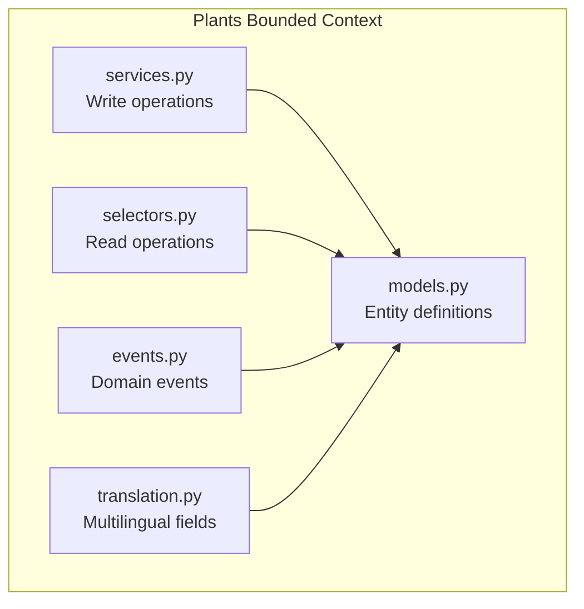
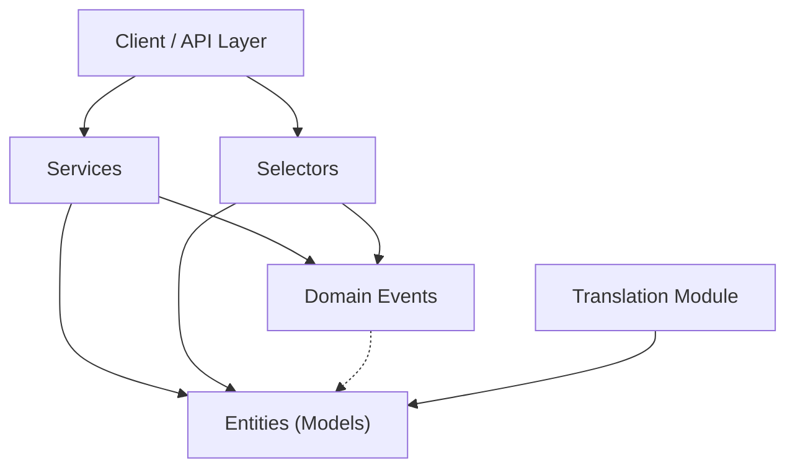
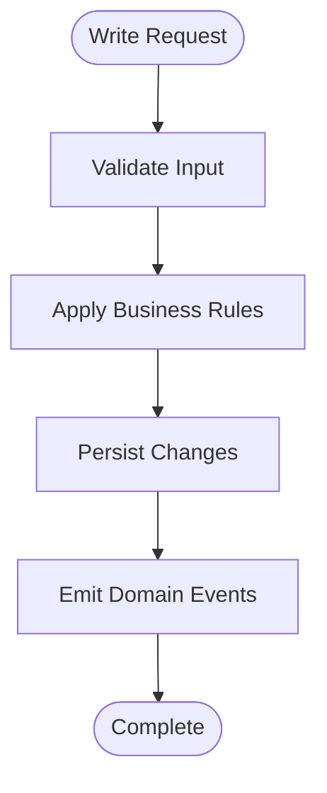
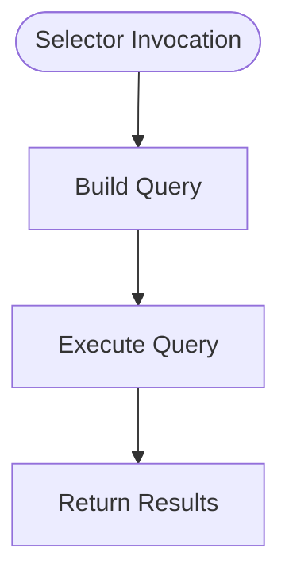
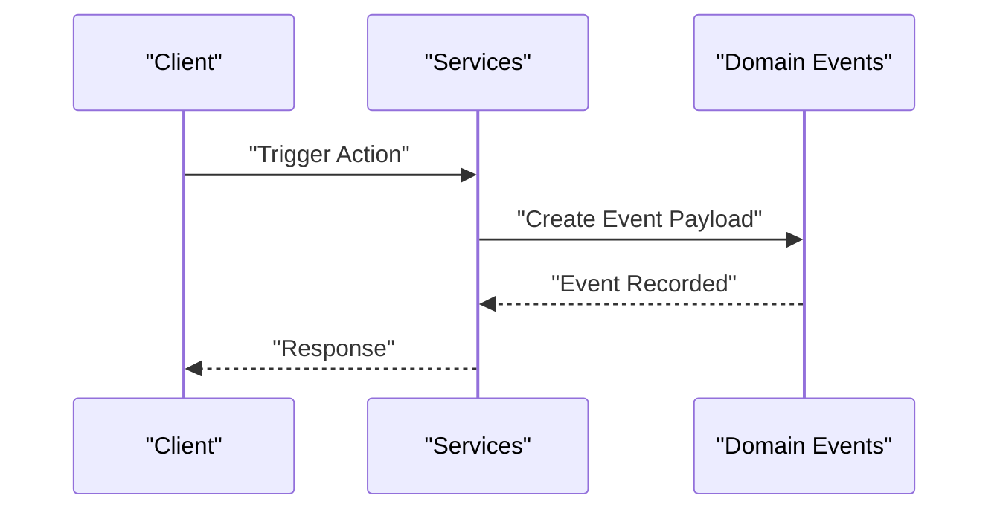
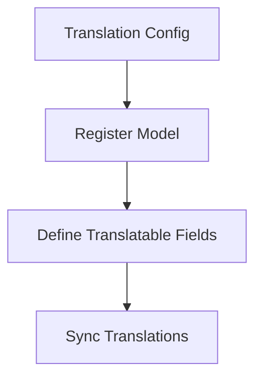
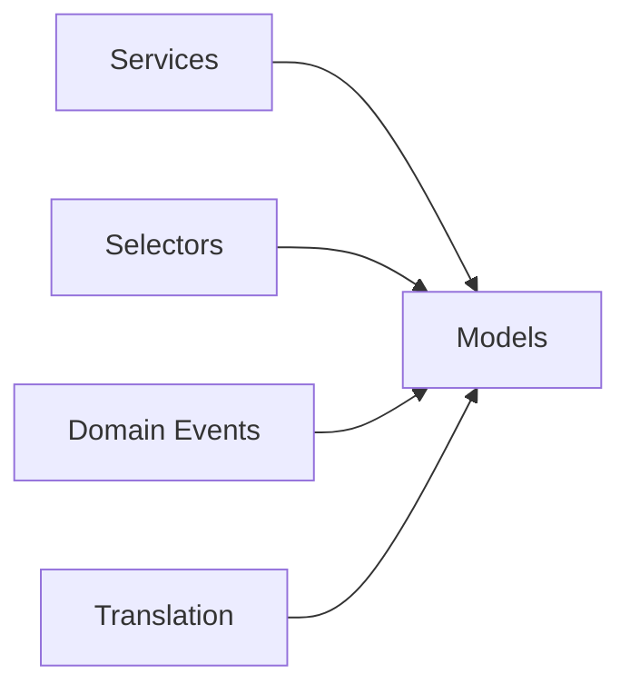

# Plant Species Management

<cite>
**Referenced Files in This Document**
- [models.py](file://backend/apps/plants/models.py)
- [services.py](file://backend/apps/plants/services.py)
- [selectors.py](file://backend/apps/plants/selectors.py)
- [events.py](file://backend/apps/plants/events.py)
- [translation.py](file://backend/apps/plants/translation.py)
</cite>

## Table of Contents
1. [Introduction](#introduction)
2. [Project Structure](#project-structure)
3. [Core Components](#core-components)
4. [Architecture Overview](#architecture-overview)
5. [Detailed Component Analysis](#detailed-component-analysis)
6. [Dependency Analysis](#dependency-analysis)
7. [Performance Considerations](#performance-considerations)
8. [Troubleshooting Guide](#troubleshooting-guide)
9. [Conclusion](#conclusion)

## Introduction
This document describes the Plant Species Management domain within the Flower project. It focuses on the botanical taxonomy, care profiles, and growth stage tracking capabilities scoped to the plants bounded context. The domain is organized around a service-layer-first design with explicit separation of read (selectors) and write (services) operations, and a dedicated translation module for multilingual support. Domain events are defined to capture lifecycle changes such as species registration, profile updates, and taxonomy modifications.

## Project Structure
The Plant domain resides under backend/apps/plants and consists of:
- models.py: Entity definitions for plant-related data
- services.py: Write operations and mutation orchestration
- selectors.py: Read/query operations and data access
- events.py: Domain event definitions
- translation.py: Model translation configuration for internationalization



**Diagram sources**
- [models.py:12-26](file://backend/apps/plants/models.py#L12-L26)
- [services.py:1-7](file://backend/apps/plants/services.py#L1-L7)
- [selectors.py:1-7](file://backend/apps/plants/selectors.py#L1-L7)
- [events.py:1-7](file://backend/apps/plants/events.py#L1-L7)
- [translation.py:1-15](file://backend/apps/plants/translation.py#L1-L15)

**Section sources**
- [models.py:1-26](file://backend/apps/plants/models.py#L1-L26)
- [services.py:1-7](file://backend/apps/plants/services.py#L1-L7)
- [selectors.py:1-7](file://backend/apps/plants/selectors.py#L1-L7)
- [events.py:1-7](file://backend/apps/plants/events.py#L1-L7)
- [translation.py:1-15](file://backend/apps/plants/translation.py#L1-L15)

## Core Components
- PlantSpecies entity: Represents a placeholder for plant species with future fields for name, scientific name, care profile, and media assets. The model metadata exposes localized verbose names for pluralization and labeling.
- Services layer: Enforces that all mutations to plant data must occur via services, preventing direct model writes elsewhere.
- Selectors layer: Centralizes read logic for plant data queries, ensuring consistency and testability.
- Events: Defines lightweight domain events representing significant domain actions (not Django signals).
- Translation: Registers translatable fields for user-facing text using django-modeltranslation.

**Section sources**
- [models.py:12-26](file://backend/apps/plants/models.py#L12-L26)
- [services.py:1-7](file://backend/apps/plants/services.py#L1-L7)
- [selectors.py:1-7](file://backend/apps/plants/selectors.py#L1-L7)
- [events.py:1-7](file://backend/apps/plants/events.py#L1-L7)
- [translation.py:1-15](file://backend/apps/plants/translation.py#L1-L15)

## Architecture Overview
The Plant domain follows a clean architecture pattern:
- Entities (models) encapsulate domain data and behavior
- Services coordinate write operations and enforce business rules
- Selectors encapsulate read/query logic
- Events record domain changes
- Translation integrates internationalization for user-facing fields



[No sources needed since this diagram shows conceptual architecture, not a direct code mapping]

## Detailed Component Analysis

### PlantSpecies Entity
The PlantSpecies entity currently serves as a placeholder with documented future fields. It defines localized verbose names for consistent labeling in admin and forms.

```mermaid
classDiagram
class PlantSpecies {
"+Meta.verbose_name"
"+Meta.verbose_name_plural"
}
```

**Diagram sources**
- [models.py:12-26](file://backend/apps/plants/models.py#L12-L26)

**Section sources**
- [models.py:12-26](file://backend/apps/plants/models.py#L12-L26)

### Services Layer
The services module establishes the authoritative write path for plant data. It enforces that all mutations must go through this layer, maintaining data integrity and centralizing business logic.



**Diagram sources**
- [services.py:1-7](file://backend/apps/plants/services.py#L1-L7)

**Section sources**
- [services.py:1-7](file://backend/apps/plants/services.py#L1-L7)

### Selectors Layer
The selectors module centralizes read operations for plant data, ensuring consistent querying and testability. It provides a single interface for retrieving plant-related information.



**Diagram sources**
- [selectors.py:1-7](file://backend/apps/plants/selectors.py#L1-L7)

**Section sources**
- [selectors.py:1-7](file://backend/apps/plants/selectors.py#L1-L7)

### Domain Events
Domain events capture significant changes in the plant lifecycle. They are lightweight data structures representing what happened in the domain and are not Django signals.



**Diagram sources**
- [events.py:1-7](file://backend/apps/plants/events.py#L1-L7)

**Section sources**
- [events.py:1-7](file://backend/apps/plants/events.py#L1-L7)

### Translation Module
The translation module configures django-modeltranslation for translatable fields. It documents the registration pattern and lists user-facing fields to be translated.



**Diagram sources**
- [translation.py:1-15](file://backend/apps/plants/translation.py#L1-L15)

**Section sources**
- [translation.py:1-15](file://backend/apps/plants/translation.py#L1-L15)

## Dependency Analysis
The Plant domain components depend on each other as follows:
- Services depend on Models and emit Events
- Selectors depend on Models
- Events are emitted by Services and observed by external systems
- Translation depends on Models and django-modeltranslation



[No sources needed since this diagram shows conceptual dependencies, not a direct code mapping]

## Performance Considerations
- Keep selector queries efficient by indexing frequently queried fields
- Batch write operations in services to minimize database round-trips
- Use domain events to decouple heavy post-processing from write paths
- Enable translation caching for frequently accessed localized strings

[No sources needed since this section provides general guidance]

## Troubleshooting Guide
- If translations are missing, verify the translation module registration and ensure the fields are included in the translation options
- If queries are slow, review selector implementations and add appropriate database indexes
- If domain events are not firing, confirm that services emit events after successful mutations
- If direct model writes fail, ensure all mutations are routed through the services layer

[No sources needed since this section provides general guidance]

## Conclusion
The Plant Species Management domain is structured around a clear separation of concerns with explicit read/write boundaries, a dedicated translation module, and domain events for lifecycle tracking. While the PlantSpecies entity is currently a placeholder, the architecture supports future expansion with robust taxonomy, care profiles, and growth stage tracking aligned with botanical standards and multilingual requirements.