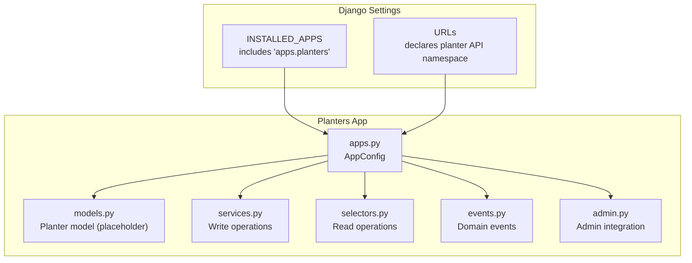
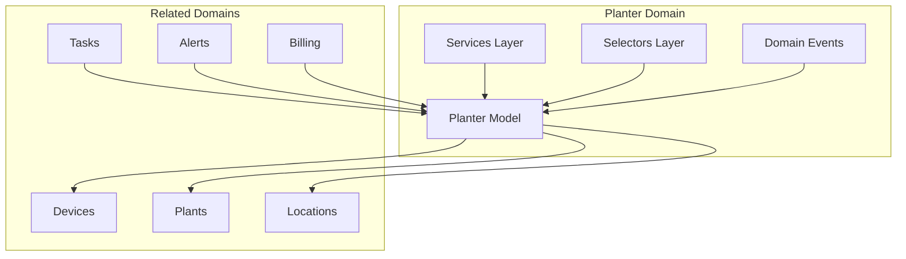
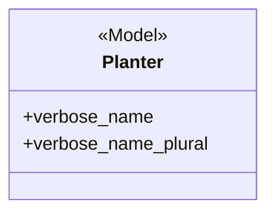
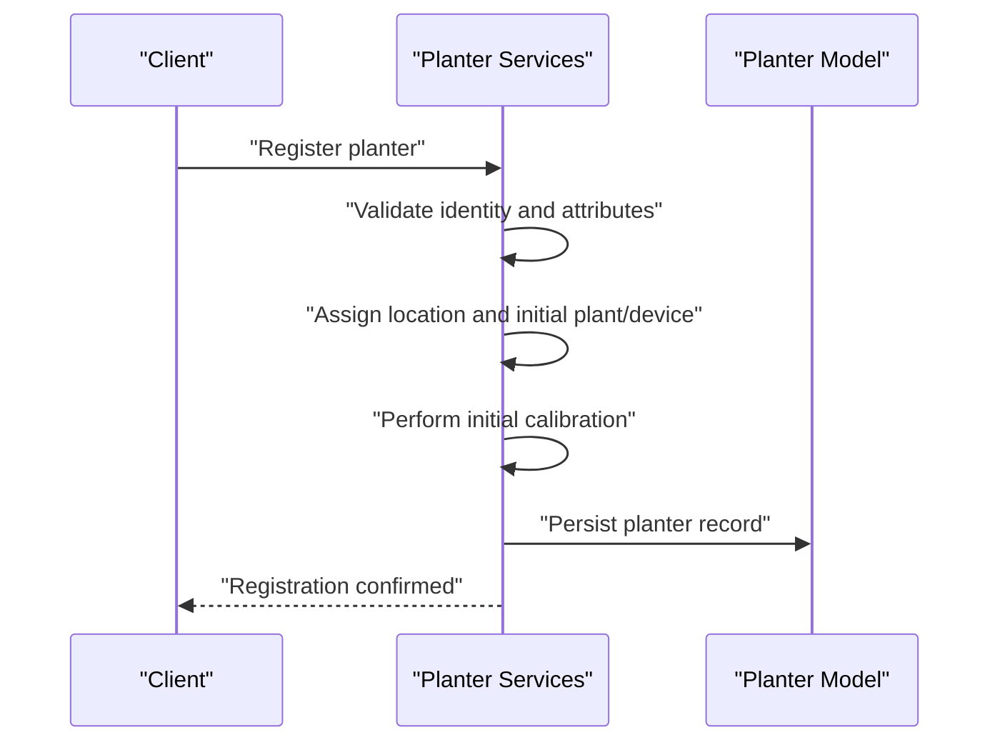
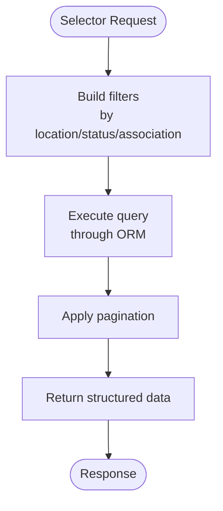
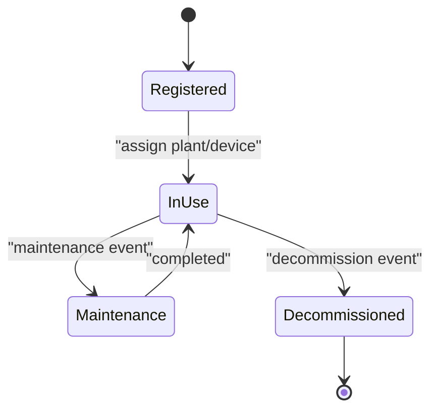
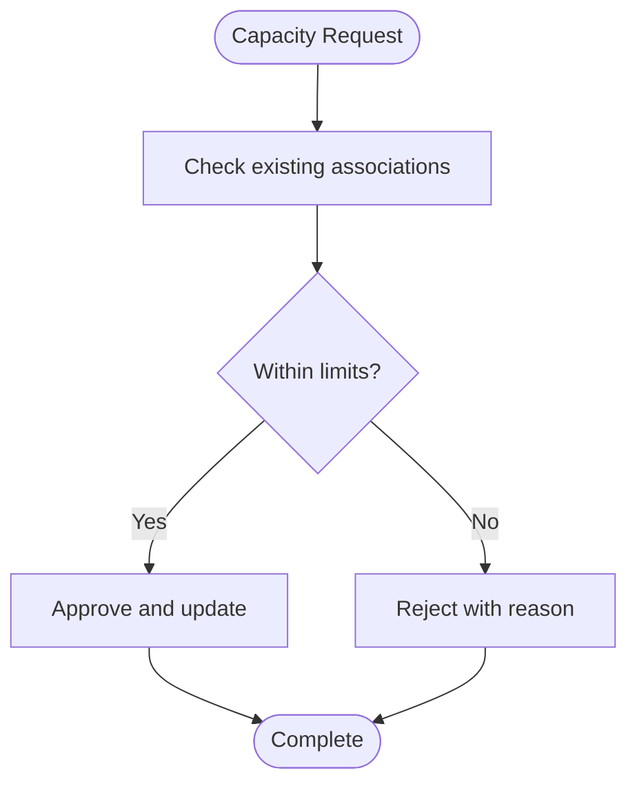
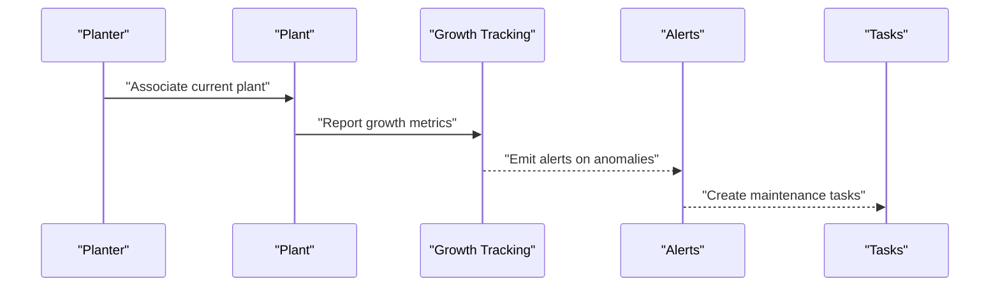
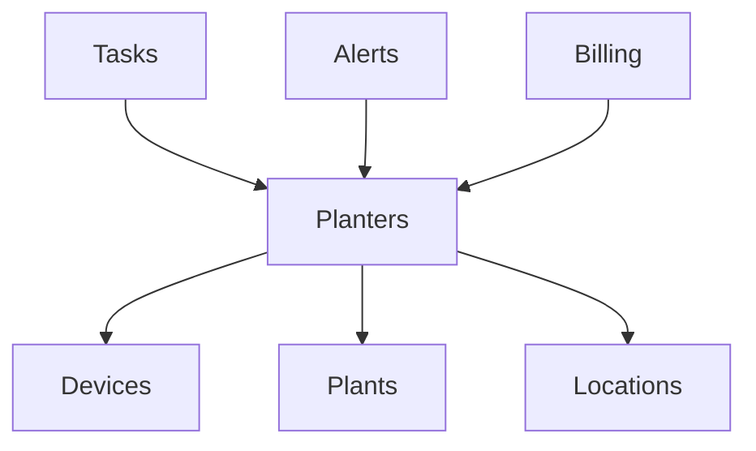

# Planter Management

<cite>
**Referenced Files in This Document**
- [models.py](file://backend/apps/planters/models.py)
- [services.py](file://backend/apps/planters/services.py)
- [selectors.py](file://backend/apps/planters/selectors.py)
- [events.py](file://backend/apps/planters/events.py)
- [apps.py](file://backend/apps/planters/apps.py)
- [admin.py](file://backend/apps/planters/admin.py)
- [base.py](file://backend/config/settings/base.py)
- [urls.py](file://backend/config/urls.py)
- [devices/models.py](file://backend/apps/devices/models.py)
- [plants/models.py](file://backend/apps/plants/models.py)
- [locations/models.py](file://backend/apps/locations/models.py)
- [billing/models.py](file://backend/apps/billing/models.py)
- [tasks/models.py](file://backend/apps/tasks/models.py)
- [alerts/models.py](file://backend/apps/alerts/models.py)
</cite>

## Table of Contents
1. [Introduction](#introduction)
2. [Project Structure](#project-structure)
3. [Core Components](#core-components)
4. [Architecture Overview](#architecture-overview)
5. [Detailed Component Analysis](#detailed-component-analysis)
6. [Dependency Analysis](#dependency-analysis)
7. [Performance Considerations](#performance-considerations)
8. [Troubleshooting Guide](#troubleshooting-guide)
9. [Conclusion](#conclusion)
10. [Appendices](#appendices)

## Introduction
This document describes the Planter Management domain within the Flower project. It focuses on container inventory, planter configuration, and asset tracking across the bounded context. The domain centers around the Planter entity, its physical and capacity-related attributes, location assignment, and relationships with devices, plants, and locations. It also documents the service layer for planter registration and configuration, selector patterns for queries and inventory management, and domain events for lifecycle management (registration, maintenance, decommissioning). Guidance is included for onboarding procedures, inventory reconciliation, maintenance scheduling, and integration with plant growth tracking.

## Project Structure
The Planter Management domain is implemented as a Django application (apps.planters) and participates in a multi-tenant, tenant-aware Django setup. The application is registered in the settings and is intended to expose API endpoints via a dedicated URL namespace. While the current implementation includes stubs for models, services, selectors, and events, the domain is designed to evolve with additional fields and relationships.



**Diagram sources**
- [base.py:75-95](file://backend/config/settings/base.py#L75-L95)
- [urls.py:25-38](file://backend/config/urls.py#L25-L38)
- [apps.py:5-12](file://backend/apps/planters/apps.py#L5-L12)

**Section sources**
- [base.py:75-95](file://backend/config/settings/base.py#L75-L95)
- [urls.py:25-38](file://backend/config/urls.py#L25-L38)
- [apps.py:5-12](file://backend/apps/planters/apps.py#L5-L12)

## Core Components
- Planter model: Defines the core entity for containers, with future fields planned for identification, physical attributes, location assignment, current plant, and installed device.
- Services layer: Enforces mutation control for planter data, ensuring all write operations are performed through this layer.
- Selectors layer: Centralizes read logic for planter queries, enabling testable and maintainable data access.
- Domain events: Lightweight data structures representing significant domain occurrences (not Django signals).
- Admin integration: Provides administrative interface hooks for the planter domain.

**Section sources**
- [models.py:12-27](file://backend/apps/planters/models.py#L12-L27)
- [services.py:1-7](file://backend/apps/planters/services.py#L1-L7)
- [selectors.py:1-7](file://backend/apps/planters/selectors.py#L1-L7)
- [events.py:1-7](file://backend/apps/planters/events.py#L1-L7)
- [admin.py:1-3](file://backend/apps/planters/admin.py#L1-L3)

## Architecture Overview
The Planter Management domain follows a bounded context pattern with clear separation of concerns:
- Model layer defines the entity and its metadata.
- Service layer encapsulates write operations and enforces business rules.
- Selector layer encapsulates read operations and query logic.
- Events layer captures domain occurrences for cross-context reactions.
- Admin layer integrates with Django’s admin interface.



**Diagram sources**
- [models.py:12-27](file://backend/apps/planters/models.py#L12-L27)
- [devices/models.py:20](file://backend/apps/devices/models.py#L20)
- [plants/models.py:4](file://backend/apps/plants/models.py#L4)
- [locations/models.py:4](file://backend/apps/locations/models.py#L4)
- [tasks/models.py:18](file://backend/apps/tasks/models.py#L18)
- [alerts/models.py:19](file://backend/apps/alerts/models.py#L19)
- [billing/models.py:17](file://backend/apps/billing/models.py#L17)

## Detailed Component Analysis

### Planter Entity Model
The Planter model is currently a placeholder with metadata and comments indicating future fields. These include identification attributes, physical characteristics, location assignment, current plant association, and installed device linkage. The model’s verbose names define user-facing labels.



**Diagram sources**
- [models.py:12-27](file://backend/apps/planters/models.py#L12-L27)

**Section sources**
- [models.py:12-27](file://backend/apps/planters/models.py#L12-L27)

### Planter Registration and Configuration (Service Layer)
The services layer enforces that all mutations to planter data must occur through this module. This ensures controlled setup procedures and initial calibration steps are centralized and auditable. Typical registration and configuration workflows include:
- Validating planter identity and physical attributes.
- Assigning a location and optional initial plant/device.
- Performing initial calibration (e.g., sensor baseline, capacity verification).
- Publishing domain events for registration.



**Diagram sources**
- [services.py:1-7](file://backend/apps/planters/services.py#L1-L7)
- [models.py:12-27](file://backend/apps/planters/models.py#L12-L27)

**Section sources**
- [services.py:1-7](file://backend/apps/planters/services.py#L1-L7)

### Queries and Inventory Management (Selector Patterns)
The selectors layer centralizes read operations for planter data, enabling:
- Inventory queries (counts, distribution by location, status).
- Association queries (current plant, installed device).
- Filtering and pagination for large datasets.



**Diagram sources**
- [selectors.py:1-7](file://backend/apps/planters/selectors.py#L1-L7)

**Section sources**
- [selectors.py:1-7](file://backend/apps/planters/selectors.py#L1-L7)

### Domain Events for Lifecycle Management
Domain events capture significant occurrences in the planter lifecycle:
- Registration: emitted after successful creation and calibration.
- Maintenance: emitted when scheduled or ad-hoc maintenance actions occur.
- Decommissioning: emitted when a planter is retired or removed from inventory.

These events are lightweight data structures and distinct from Django signals, enabling loose coupling and cross-domain reactions.



**Diagram sources**
- [events.py:1-7](file://backend/apps/planters/events.py#L1-L7)

**Section sources**
- [events.py:1-7](file://backend/apps/planters/events.py#L1-L7)

### Planter-Plant Associations and Asset Tracking
Planter-to-plant associations enable asset tracking workflows:
- Track current plant per planter.
- Update associations during replanting or removal.
- Integrate with plant growth tracking systems for health and yield insights.

```mermaid
erDiagram
PLANTER {
uuid id
string name
string code
uuid location_id
uuid current_plant_id
uuid installed_device_id
}
PLANT {
uuid id
string species
date planted_at
uuid planter_id
}
DEVICE {
uuid id
string serial_number
uuid planter_id
}
LOCATION {
uuid id
string name
}
PLANTER }o--|| PLANT : "current_plant_id"
PLANTER }o--|| DEVICE : "installed_device_id"
PLANTER }o|--|| LOCATION : "location_id"
```

**Diagram sources**
- [models.py:12-27](file://backend/apps/planters/models.py#L12-L27)
- [plants/models.py:4](file://backend/apps/plants/models.py#L4)
- [devices/models.py:20](file://backend/apps/devices/models.py#L20)
- [locations/models.py:4](file://backend/apps/locations/models.py#L4)

**Section sources**
- [models.py:12-27](file://backend/apps/planters/models.py#L12-L27)
- [plants/models.py:4](file://backend/apps/plants/models.py#L4)
- [devices/models.py:20](file://backend/apps/devices/models.py#L20)
- [locations/models.py:4](file://backend/apps/locations/models.py#L4)

### Capacity Management and Business Rules
Capacity management involves:
- Enforcing planter capacity constraints (e.g., single-plant-per-planter).
- Preventing overcommitment of resources (e.g., device allocation limits).
- Integrating with billing constraints (e.g., maximum planters per tenant).



**Diagram sources**
- [billing/models.py:17](file://backend/apps/billing/models.py#L17)

**Section sources**
- [billing/models.py:17](file://backend/apps/billing/models.py#L17)

### Integration with Plant Growth Tracking
Integration points with plant growth tracking include:
- Using planter-plant associations to fetch growth metrics.
- Emitting domain events to trigger downstream analytics.
- Leveraging tasks and alerts for growth-related maintenance.



**Diagram sources**
- [plants/models.py:4](file://backend/apps/plants/models.py#L4)
- [alerts/models.py:19](file://backend/apps/alerts/models.py#L19)
- [tasks/models.py:18](file://backend/apps/tasks/models.py#L18)

**Section sources**
- [plants/models.py:4](file://backend/apps/plants/models.py#L4)
- [alerts/models.py:19](file://backend/apps/alerts/models.py#L19)
- [tasks/models.py:18](file://backend/apps/tasks/models.py#L18)

## Dependency Analysis
The Planter domain interacts with several related domains:
- Devices: Assigned to a planter for monitoring and control.
- Plants: Associated with a planter for growth tracking.
- Locations: Physical placement of planters.
- Tasks: Maintenance and operational tasks linked to planters.
- Alerts: Notifications triggered by planter/plant conditions.
- Billing: Constraints on resource allocations.



**Diagram sources**
- [devices/models.py:20](file://backend/apps/devices/models.py#L20)
- [plants/models.py:4](file://backend/apps/plants/models.py#L4)
- [locations/models.py:4](file://backend/apps/locations/models.py#L4)
- [tasks/models.py:18](file://backend/apps/tasks/models.py#L18)
- [alerts/models.py:19](file://backend/apps/alerts/models.py#L19)
- [billing/models.py:17](file://backend/apps/billing/models.py#L17)

**Section sources**
- [devices/models.py:20](file://backend/apps/devices/models.py#L20)
- [plants/models.py:4](file://backend/apps/plants/models.py#L4)
- [locations/models.py:4](file://backend/apps/locations/models.py#L4)
- [tasks/models.py:18](file://backend/apps/tasks/models.py#L18)
- [alerts/models.py:19](file://backend/apps/alerts/models.py#L19)
- [billing/models.py:17](file://backend/apps/billing/models.py#L17)

## Performance Considerations
- Use selective field retrieval in selectors to minimize payload size.
- Apply pagination for large inventory queries.
- Denormalize frequently accessed attributes (e.g., location hierarchy) to reduce joins.
- Index foreign keys and commonly filtered fields (e.g., location_id, current_plant_id).
- Batch operations for bulk inventory updates or reassignments.

## Troubleshooting Guide
- Registration failures: Verify identity uniqueness and attribute validation in the services layer.
- Association errors: Confirm planter capacity constraints and existing associations.
- Query performance: Review selector filters and pagination usage.
- Event delivery: Ensure domain events are published and consumed by dependent services.

**Section sources**
- [services.py:1-7](file://backend/apps/planters/services.py#L1-L7)
- [selectors.py:1-7](file://backend/apps/planters/selectors.py#L1-L7)
- [events.py:1-7](file://backend/apps/planters/events.py#L1-L7)

## Conclusion
The Planter Management domain establishes a robust foundation for container inventory, configuration, and asset tracking. With clear separation between models, services, selectors, and events, it supports scalable growth tracking and operational workflows. As the model evolves to include physical attributes, capacity specifications, and location assignment, the domain will integrate tightly with devices, plants, and tasks to deliver a comprehensive solution for planter lifecycle management.

## Appendices

### Example Workflows

- Planter Onboarding Procedure
  - Validate identity and attributes.
  - Assign location and optional initial plant/device.
  - Perform initial calibration.
  - Publish registration event.

- Inventory Reconciliation
  - Query planters by location and status.
  - Compare counts against billing limits.
  - Resolve discrepancies and update records.

- Maintenance Scheduling
  - Emit maintenance event on schedule or alert.
  - Create tasks linked to affected planters.
  - Update planter status and logs.

[No sources needed since this section provides general guidance]