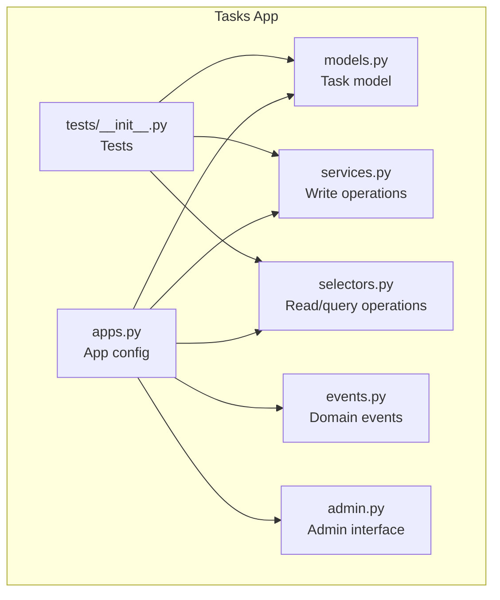
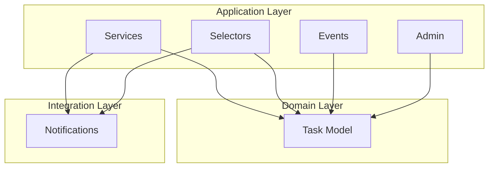
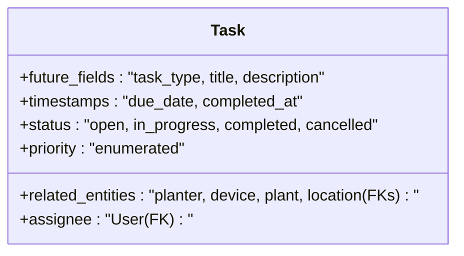
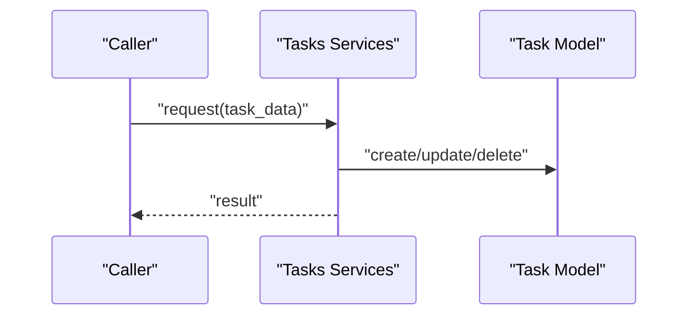
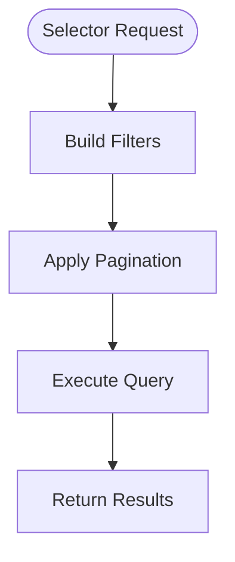
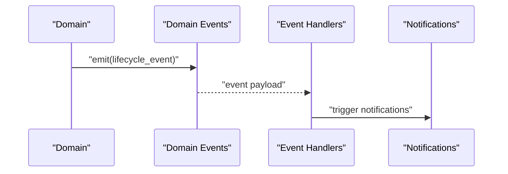
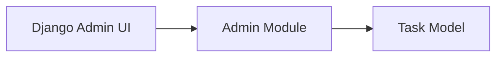
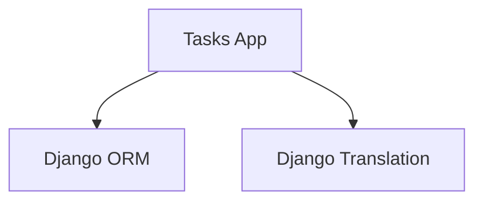

# Task Management

<cite>
**Referenced Files in This Document**
- [models.py](file://backend/apps/tasks/models.py)
- [services.py](file://backend/apps/tasks/services.py)
- [selectors.py](file://backend/apps/tasks/selectors.py)
- [events.py](file://backend/apps/tasks/events.py)
- [apps.py](file://backend/apps/tasks/apps.py)
- [admin.py](file://backend/apps/tasks/admin.py)
- [tests/__init__.py](file://backend/apps/tasks/tests/__init__.py)
</cite>

## Table of Contents
1. [Introduction](#introduction)
2. [Project Structure](#project-structure)
3. [Core Components](#core-components)
4. [Architecture Overview](#architecture-overview)
5. [Detailed Component Analysis](#detailed-component-analysis)
6. [Dependency Analysis](#dependency-analysis)
7. [Performance Considerations](#performance-considerations)
8. [Troubleshooting Guide](#troubleshooting-guide)
9. [Conclusion](#conclusion)

## Introduction
This document describes the Task Management domain responsible for generating, assigning, and automating workflows around tasks such as watering plants, checking devices, and replacing batteries. It covers the Task entity model, service-layer mutation controls, selector-based queries, domain events for lifecycle management, and integration touchpoints with notifications and administrative interfaces. The current implementation provides foundational scaffolding for task types, priorities, assignments, and status tracking, with future model fields documented as placeholders for expanded capabilities.

## Project Structure
The Task Management domain resides under the tasks application and follows a clean separation of concerns:
- Domain model definition for tasks
- Services layer for write operations
- Selectors layer for read/query operations
- Domain events for lifecycle notifications
- Application registration and admin interface
- Tests placeholder

**Diagram sources**
- [models.py](file://backend/apps/tasks/models.py)
- [services.py](file://backend/apps/tasks/services.py)
- [selectors.py](file://backend/apps/tasks/selectors.py)
- [events.py](file://backend/apps/tasks/events.py)
- [apps.py](file://backend/apps/tasks/apps.py)
- [admin.py](file://backend/apps/tasks/admin.py)
- [tests/__init__.py](file://backend/apps/tasks/tests/__init__.py)

**Section sources**
- [models.py](file://backend/apps/tasks/models.py)
- [services.py](file://backend/apps/tasks/services.py)
- [selectors.py](file://backend/apps/tasks/selectors.py)
- [events.py](file://backend/apps/tasks/events.py)
- [apps.py](file://backend/apps/tasks/apps.py)
- [admin.py](file://backend/apps/tasks/admin.py)
- [tests/__init__.py](file://backend/apps/tasks/tests/__init__.py)

## Core Components
- Task model: Defines the task entity with future fields for type, title, description, related entities (planter/device/plant/location), assignee, due/completion timestamps, status, and priority. The model metadata supports internationalized naming.
- Services: Enforces that all mutations to task data must occur via the services module, preventing direct model writes elsewhere.
- Selectors: Centralizes read/query logic so all task data retrieval is testable and consistent.
- Events: Provides a place for domain events representing significant lifecycle actions (creation, assignment, progress updates, completion). These are lightweight data structures distinct from Django signals.
- Admin: Registers the Task model in the Django admin for operational visibility and manual management.
- Tests: Placeholder for unit and integration tests scoped to the tasks domain.

**Section sources**
- [models.py](file://backend/apps/tasks/models.py)
- [services.py](file://backend/apps/tasks/services.py)
- [selectors.py](file://backend/apps/tasks/selectors.py)
- [events.py](file://backend/apps/tasks/events.py)
- [admin.py](file://backend/apps/tasks/admin.py)
- [tests/__init__.py](file://backend/apps/tasks/tests/__init__.py)

## Architecture Overview
The tasks domain adheres to a layered architecture:
- Model layer defines the Task entity and its attributes.
- Services layer encapsulates write operations and enforces business rules.
- Selectors layer encapsulates read operations and query logic.
- Events layer captures domain moments for cross-cutting integrations.
- Admin layer exposes the model for operational tasks.
- Tests validate behavior at each layer.

**Diagram sources**
- [models.py](file://backend/apps/tasks/models.py)
- [services.py](file://backend/apps/tasks/services.py)
- [selectors.py](file://backend/apps/tasks/selectors.py)
- [events.py](file://backend/apps/tasks/events.py)
- [admin.py](file://backend/apps/tasks/admin.py)

## Detailed Component Analysis

### Task Entity Model
The Task model serves as the central domain entity. It documents planned fields for:
- Task type (e.g., water, check device, replace battery)
- Title and description
- Related entities: planter, device, plant, location (foreign keys)
- Assignee (foreign key to User)
- Due date and completion timestamp
- Status (open, in-progress, completed, cancelled)
- Priority

These placeholders indicate the model is intentionally minimal now and will evolve to include the enumerated types and foreign keys described above.

**Diagram sources**
- [models.py](file://backend/apps/tasks/models.py)

**Section sources**
- [models.py](file://backend/apps/tasks/models.py)

### Services Layer (Write Operations)
The services module enforces a strict policy that all mutations to task data must go through this layer. This ensures consistency, testability, and adherence to business rules. While the current file is a placeholder, it establishes the contract that external modules must call into services for any task creation, updates, or deletions.

**Diagram sources**
- [services.py](file://backend/apps/tasks/services.py)
- [models.py](file://backend/apps/tasks/models.py)

**Section sources**
- [services.py](file://backend/apps/tasks/services.py)

### Selectors Layer (Read/Query Operations)
The selectors module centralizes all read logic for tasks. This promotes testability and prevents ad-hoc queries across the application. The current placeholder indicates the intent to consolidate filtering, pagination, and projection logic here.

**Diagram sources**
- [selectors.py](file://backend/apps/tasks/selectors.py)

**Section sources**
- [selectors.py](file://backend/apps/tasks/selectors.py)

### Domain Events
Domain events capture meaningful moments in the task lifecycle. The events module is positioned to define lightweight event structures for creation, assignment, progress updates, and completion. These are distinct from Django signals and represent domain facts to be handled by handlers.

**Diagram sources**
- [events.py](file://backend/apps/tasks/events.py)

**Section sources**
- [events.py](file://backend/apps/tasks/events.py)

### Administrative Interface
The admin module registers the Task model for operational management. This enables administrators to view, filter, and edit tasks through Django’s admin UI.

**Diagram sources**
- [admin.py](file://backend/apps/tasks/admin.py)
- [models.py](file://backend/apps/tasks/models.py)

**Section sources**
- [admin.py](file://backend/apps/tasks/admin.py)

### Application Registration
The tasks app is registered as part of the Django application registry, ensuring models, migrations, and admin configurations are loaded during startup.

**Section sources**
- [apps.py](file://backend/apps/tasks/apps.py)

## Dependency Analysis
Current dependencies are minimal, reflecting a foundational layer. The tasks app depends on Django’s ORM and internationalization framework for model metadata. There are no explicit inter-app dependencies indicated in the provided files.

**Diagram sources**
- [models.py](file://backend/apps/tasks/models.py)
- [apps.py](file://backend/apps/tasks/apps.py)

**Section sources**
- [models.py](file://backend/apps/tasks/models.py)
- [apps.py](file://backend/apps/tasks/apps.py)

## Performance Considerations
- Keep selectors efficient by using database-level filtering and pagination to avoid loading unnecessary data.
- Prefer bulk operations in services when applying the same change across many tasks.
- Use select_related and prefetch_related in selectors to minimize N+1 query risks.
- Cache frequently accessed task aggregates or dashboards at the application layer.
- Monitor event handler throughput if notifications scale significantly.

## Troubleshooting Guide
- If tasks are not appearing in admin, verify the tasks app is included in INSTALLED_APPS and the admin module is properly configured.
- If mutations fail unexpectedly, ensure all writes are routed through the services module and not directly to the model.
- If queries are slow, confirm selectors apply filters and pagination and avoid fetching unnecessary fields.
- If domain event handlers are missing, ensure the events module is imported and handlers are registered appropriately.

## Conclusion
The Task Management domain provides a solid foundation for task lifecycle management with clear separation between write operations (services), read operations (selectors), and domain events. The Task model documents future fields for types, priorities, assignments, and statuses, enabling scalable task workflows. As the model evolves, integrate priority-based scheduling, dependency tracking, escalation policies, and notification triggers to support robust automation and progress tracking.