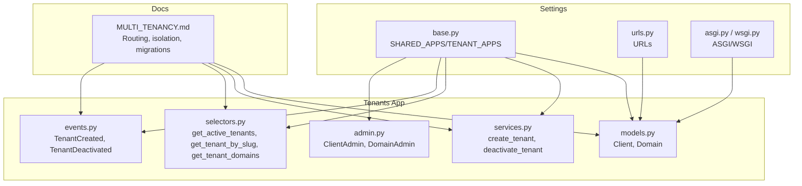
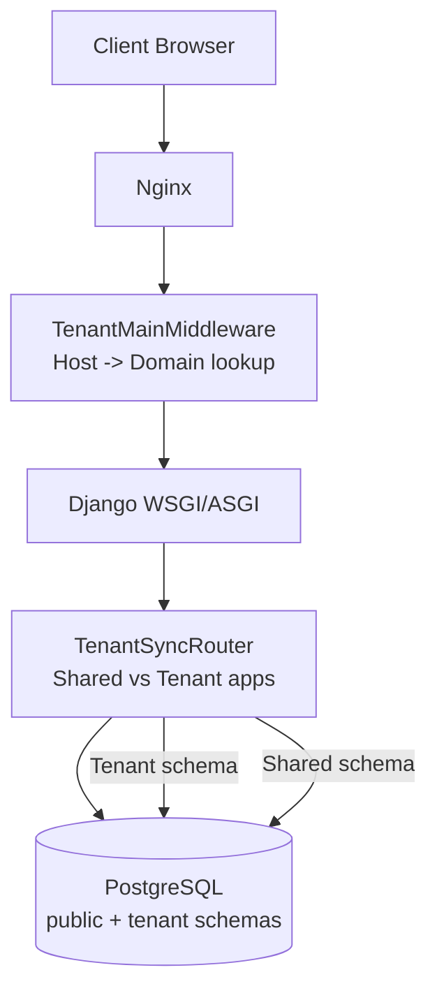
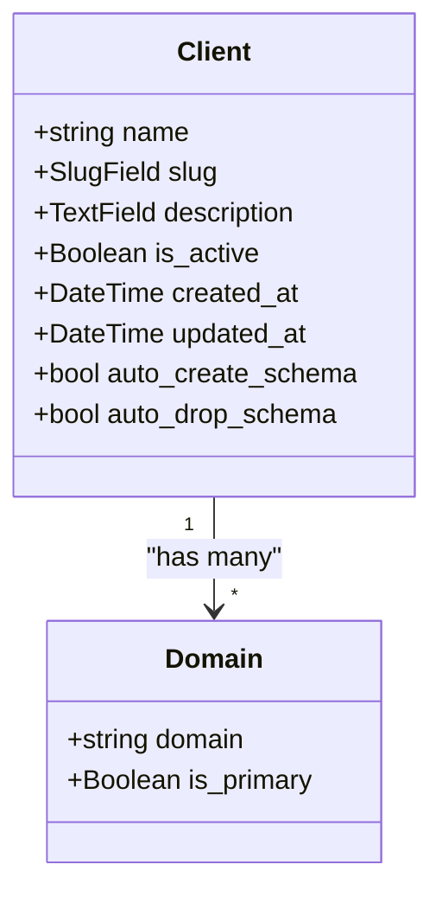
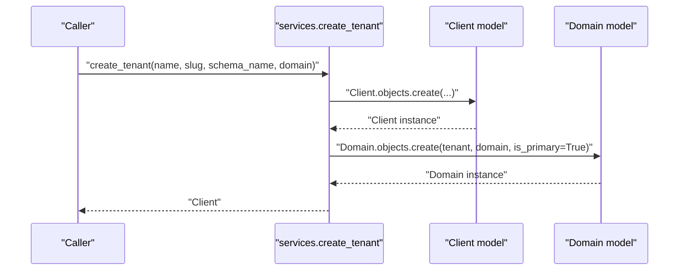
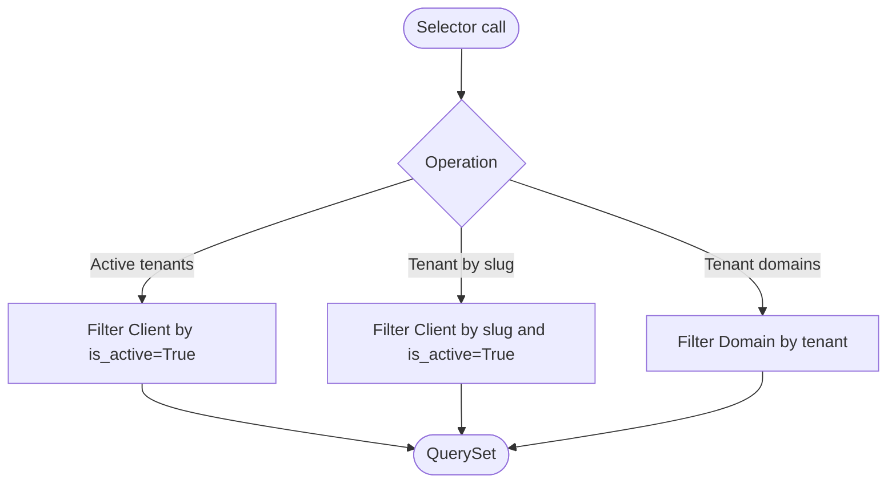
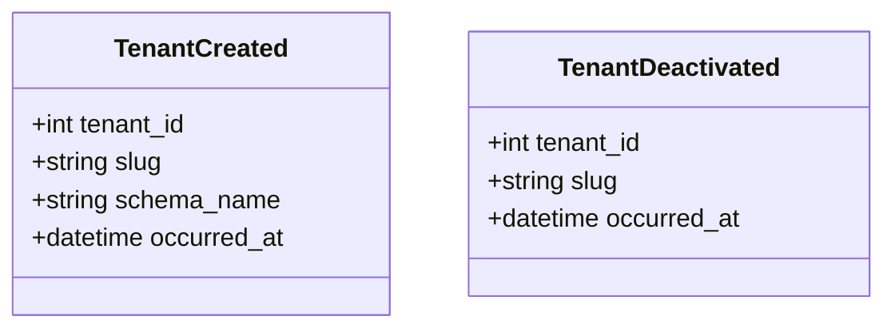
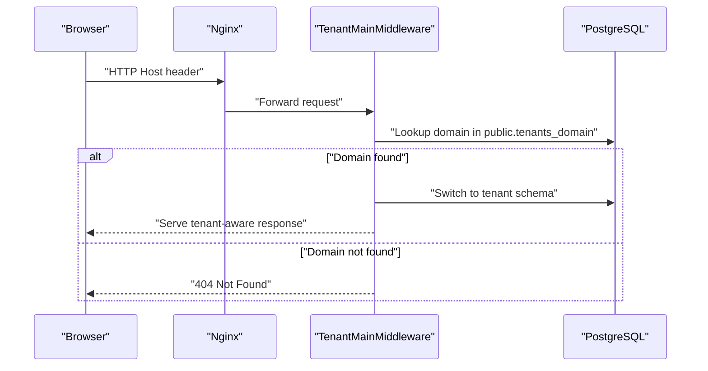
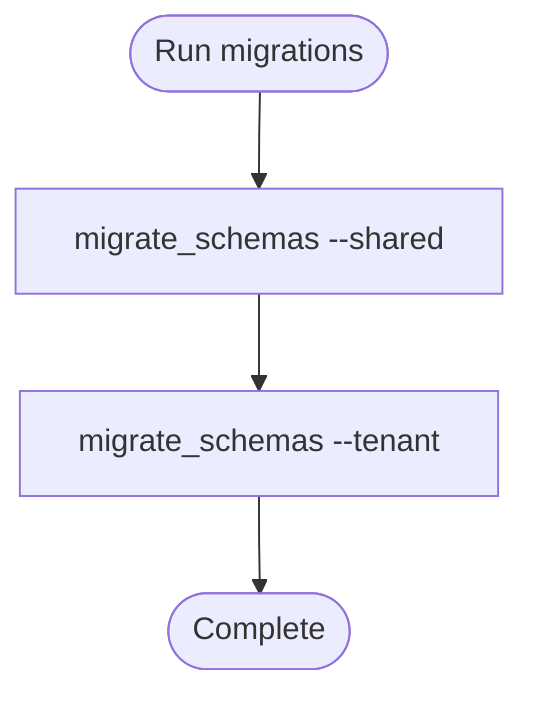
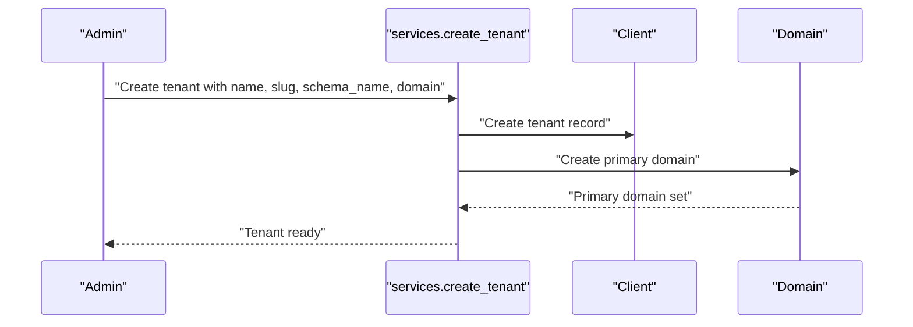
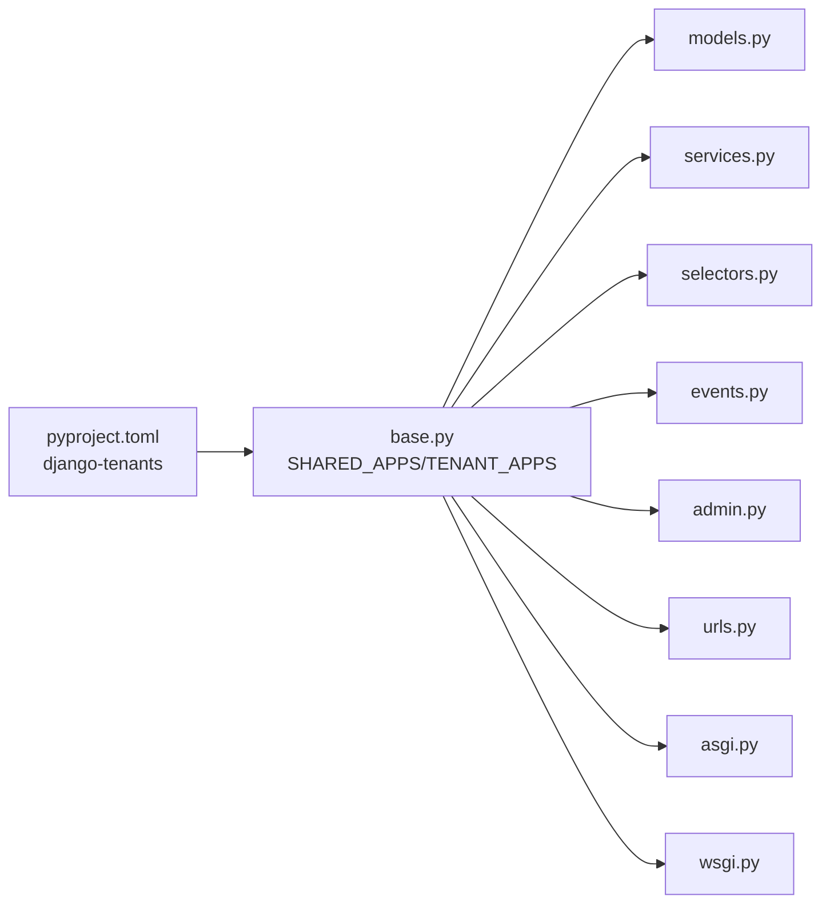

# Tenant Management

<cite>
**Referenced Files in This Document**
- [MULTI_TENANCY.md](file://backend/docs/architecture/MULTI_TENANCY.md)
- [models.py](file://backend/apps/tenants/models.py)
- [services.py](file://backend/apps/tenants/services.py)
- [events.py](file://backend/apps/tenants/events.py)
- [selectors.py](file://backend/apps/tenants/selectors.py)
- [admin.py](file://backend/apps/tenants/admin.py)
- [base.py](file://backend/config/settings/base.py)
- [urls.py](file://backend/config/urls.py)
- [asgi.py](file://backend/config/asgi.py)
- [wsgi.py](file://backend/config/wsgi.py)
- [test_tenants.py](file://backend/tests/test_tenants.py)
- [pyproject.toml](file://backend/pyproject.toml)
</cite>

## Table of Contents
1. [Introduction](#introduction)
2. [Project Structure](#project-structure)
3. [Core Components](#core-components)
4. [Architecture Overview](#architecture-overview)
5. [Detailed Component Analysis](#detailed-component-analysis)
6. [Dependency Analysis](#dependency-analysis)
7. [Performance Considerations](#performance-considerations)
8. [Troubleshooting Guide](#troubleshooting-guide)
9. [Conclusion](#conclusion)
10. [Appendices](#appendices)

## Introduction
This document describes the Tenant Management domain implementing a multi-tenant architecture using django-tenants with PostgreSQL schemas for physical tenant isolation. It covers the Tenant entity model, tenant provisioning service, tenant selection patterns, domain events for lifecycle management, tenant-specific routing, database schema separation, multi-domain support, onboarding workflows, domain mapping, isolation mechanisms, migration strategies, data segregation, and cross-tenant security considerations.

## Project Structure
The Tenant Management domain is implemented as a dedicated Django app with clear separation of concerns:
- Models define the Tenant and Domain entities and their schema behavior.
- Services encapsulate tenant provisioning and lifecycle mutations.
- Selectors centralize tenant data queries.
- Events represent domain events for lifecycle actions.
- Admin provides administrative interfaces for managing tenants and domains.
- Settings configure shared and tenant apps, middleware, and database routers for multi-tenancy.

**Diagram sources**
- [base.py:44-119](file://backend/config/settings/base.py#L44-L119)
- [urls.py:12-38](file://backend/config/urls.py#L12-L38)
- [asgi.py:1-14](file://backend/config/asgi.py#L1-L14)
- [wsgi.py:1-14](file://backend/config/wsgi.py#L1-L14)
- [models.py:6-77](file://backend/apps/tenants/models.py#L6-L77)
- [services.py:11-42](file://backend/apps/tenants/services.py#L11-L42)
- [selectors.py:13-26](file://backend/apps/tenants/selectors.py#L13-L26)
- [events.py:19-36](file://backend/apps/tenants/events.py#L19-L36)
- [admin.py:7-25](file://backend/apps/tenants/admin.py#L7-L25)
- [MULTI_TENANCY.md:12-27](file://backend/docs/architecture/MULTI_TENANCY.md#L12-L27)

**Section sources**
- [base.py:44-119](file://backend/config/settings/base.py#L44-L119)
- [urls.py:12-38](file://backend/config/urls.py#L12-L38)
- [asgi.py:1-14](file://backend/config/asgi.py#L1-L14)
- [wsgi.py:1-14](file://backend/config/wsgi.py#L1-L14)
- [models.py:6-77](file://backend/apps/tenants/models.py#L6-L77)
- [services.py:11-42](file://backend/apps/tenants/services.py#L11-L42)
- [selectors.py:13-26](file://backend/apps/tenants/selectors.py#L13-L26)
- [events.py:19-36](file://backend/apps/tenants/events.py#L19-L36)
- [admin.py:7-25](file://backend/apps/tenants/admin.py#L7-L25)
- [MULTI_TENANCY.md:12-27](file://backend/docs/architecture/MULTI_TENANCY.md#L12-L27)

## Core Components
- Tenant entity model (Client): Represents a tenant organization with metadata, activation flag, and automatic schema creation/drop behavior.
- Domain model (Domain): Maps hostnames to tenants and tracks primary domains.
- Provisioning service: Creates tenants with schema and primary domain, enforcing a single, sanctioned path for tenant creation.
- Selection service: Centralized read operations for active tenants, tenant lookup by slug, and tenant domain enumeration.
- Domain events: Lightweight dataclasses for tenant lifecycle events suitable for outbox/event bus integration.
- Admin interface: Administrative forms for managing tenants and domains.

Key implementation references:
- Tenant model definition and schema behavior: [models.py:6-54](file://backend/apps/tenants/models.py#L6-L54)
- Domain model definition and primary flag: [models.py:56-77](file://backend/apps/tenants/models.py#L56-L77)
- Tenant provisioning service: [services.py:11-35](file://backend/apps/tenants/services.py#L11-L35)
- Tenant deactivation service: [services.py:38-42](file://backend/apps/tenants/services.py#L38-L42)
- Tenant selection patterns: [selectors.py:13-26](file://backend/apps/tenants/selectors.py#L13-L26)
- Domain events: [events.py:19-36](file://backend/apps/tenants/events.py#L19-L36)
- Admin configuration: [admin.py:7-25](file://backend/apps/tenants/admin.py#L7-L25)

**Section sources**
- [models.py:6-77](file://backend/apps/tenants/models.py#L6-L77)
- [services.py:11-42](file://backend/apps/tenants/services.py#L11-L42)
- [selectors.py:13-26](file://backend/apps/tenants/selectors.py#L13-L26)
- [events.py:19-36](file://backend/apps/tenants/events.py#L19-L36)
- [admin.py:7-25](file://backend/apps/tenants/admin.py#L7-L25)

## Architecture Overview
The system uses django-tenants with PostgreSQL schemas for tenant isolation. Requests are routed to tenants based on the Host header, and middleware switches the database schema accordingly. The architecture distinguishes shared apps (public schema) from tenant apps (replicated in each tenant schema). Fail-closed isolation ensures that unresolved tenants are rejected, and cross-tenant queries are prohibited in views.

**Diagram sources**
- [MULTI_TENANCY.md:12-27](file://backend/docs/architecture/MULTI_TENANCY.md#L12-L27)
- [base.py:99-102](file://backend/config/settings/base.py#L99-L102)
- [base.py:107-119](file://backend/config/settings/base.py#L107-L119)

**Section sources**
- [MULTI_TENANCY.md:12-27](file://backend/docs/architecture/MULTI_TENANCY.md#L12-L27)
- [base.py:99-102](file://backend/config/settings/base.py#L99-L102)
- [base.py:107-119](file://backend/config/settings/base.py#L107-L119)

## Detailed Component Analysis

### Tenant Entity Model
The Tenant model (Client) and Domain model define the identity and routing of tenants:
- Client: Stores tenant metadata, activation flag, timestamps, and schema behavior flags for automatic schema creation/drop.
- Domain: Maps hostnames to tenants and tracks the primary domain used for URL generation.

**Diagram sources**
- [models.py:6-54](file://backend/apps/tenants/models.py#L6-L54)
- [models.py:56-77](file://backend/apps/tenants/models.py#L56-L77)

**Section sources**
- [models.py:6-54](file://backend/apps/tenants/models.py#L6-L54)
- [models.py:56-77](file://backend/apps/tenants/models.py#L56-L77)

### Tenant Provisioning Service
The provisioning service creates a tenant and its primary domain atomically, ensuring schema isolation and consistent routing setup. It is the single, sanctioned path for tenant creation.

**Diagram sources**
- [services.py:11-35](file://backend/apps/tenants/services.py#L11-L35)
- [models.py:6-54](file://backend/apps/tenants/models.py#L6-L54)
- [models.py:56-77](file://backend/apps/tenants/models.py#L56-L77)

**Section sources**
- [services.py:11-35](file://backend/apps/tenants/services.py#L11-L35)

### Tenant Selection Patterns
Centralized selectors provide safe, testable read operations:
- Retrieve active tenants.
- Lookup tenant by slug (active only).
- Enumerate domains for a tenant.

**Diagram sources**
- [selectors.py:13-26](file://backend/apps/tenants/selectors.py#L13-L26)
- [models.py:6-54](file://backend/apps/tenants/models.py#L6-L54)
- [models.py:56-77](file://backend/apps/tenants/models.py#L56-L77)

**Section sources**
- [selectors.py:13-26](file://backend/apps/tenants/selectors.py#L13-L26)

### Domain Events for Lifecycle Management
Domain events capture tenant lifecycle actions as immutable dataclasses suitable for outbox/event bus integration:
- TenantCreated: Emitted upon successful tenant provisioning.
- TenantDeactivated: Emitted upon soft-deactivation.

**Diagram sources**
- [events.py:19-36](file://backend/apps/tenants/events.py#L19-L36)

**Section sources**
- [events.py:19-36](file://backend/apps/tenants/events.py#L19-L36)

### Tenant-Specific Routing and Schema Separation
Tenant routing is driven by the Host header and the Domain model:
- Nginx forwards requests to Django.
- Middleware resolves the tenant by Host and switches the schema.
- Fail-closed policy rejects unresolved tenants.
- Shared apps live in the public schema; tenant apps replicate into each tenant schema.

**Diagram sources**
- [MULTI_TENANCY.md:12-27](file://backend/docs/architecture/MULTI_TENANCY.md#L12-L27)
- [models.py:56-77](file://backend/apps/tenants/models.py#L56-L77)
- [base.py:99-102](file://backend/config/settings/base.py#L99-L102)

**Section sources**
- [MULTI_TENANCY.md:12-27](file://backend/docs/architecture/MULTI_TENANCY.md#L12-L27)
- [models.py:56-77](file://backend/apps/tenants/models.py#L56-L77)
- [base.py:99-102](file://backend/config/settings/base.py#L99-L102)

### Tenant Migration Strategies and Data Segregation
- Migrations run for both shared and tenant schemas to keep the public schema and tenant schemas synchronized.
- Tenant apps are replicated into each tenant schema, ensuring consistent data models across tenants.
- Cross-tenant queries are prohibited in views; explicit tenant context is required in background jobs.

**Diagram sources**
- [MULTI_TENANCY.md:54-61](file://backend/docs/architecture/MULTI_TENANCY.md#L54-L61)
- [base.py:65-90](file://backend/config/settings/base.py#L65-L90)

**Section sources**
- [MULTI_TENANCY.md:54-61](file://backend/docs/architecture/MULTI_TENANCY.md#L54-L61)
- [base.py:65-90](file://backend/config/settings/base.py#L65-L90)

### Tenant Onboarding Workflows and Domain Mapping
- Provision a new tenant with a unique slug, schema name, and primary domain.
- The provisioning service creates the tenant and sets the primary domain automatically.
- After provisioning, the tenant is active and routable via the configured domain.

**Diagram sources**
- [services.py:11-35](file://backend/apps/tenants/services.py#L11-L35)
- [models.py:6-54](file://backend/apps/tenants/models.py#L6-L54)
- [models.py:56-77](file://backend/apps/tenants/models.py#L56-L77)

**Section sources**
- [services.py:11-35](file://backend/apps/tenants/services.py#L11-L35)

### Cross-Tenant Security Considerations
- Default behavior is fail-closed: unresolved tenants receive 404.
- Public schema access is restricted to specific apps and admin.
- Cross-tenant queries are prohibited in views; use tenant_context in background jobs only.
- No schema hopping in views; tenant switching must be handled by middleware.

**Section sources**
- [MULTI_TENANCY.md:21-27](file://backend/docs/architecture/MULTI_TENANCY.md#L21-L27)
- [base.py:107-119](file://backend/config/settings/base.py#L107-L119)

## Dependency Analysis
The Tenant app depends on django-tenants and is configured as a shared app. Settings define SHARED_APPS and TENANT_APPS, middleware order, and database router. Tests validate provisioning and deactivation flows.

**Diagram sources**
- [pyproject.toml:23](file://backend/pyproject.toml#L23)
- [base.py:44-119](file://backend/config/settings/base.py#L44-L119)
- [models.py:6-77](file://backend/apps/tenants/models.py#L6-L77)
- [services.py:11-42](file://backend/apps/tenants/services.py#L11-L42)
- [selectors.py:13-26](file://backend/apps/tenants/selectors.py#L13-L26)
- [events.py:19-36](file://backend/apps/tenants/events.py#L19-L36)
- [admin.py:7-25](file://backend/apps/tenants/admin.py#L7-L25)
- [urls.py:12-38](file://backend/config/urls.py#L12-L38)
- [asgi.py:1-14](file://backend/config/asgi.py#L1-L14)
- [wsgi.py:1-14](file://backend/config/wsgi.py#L1-L14)

**Section sources**
- [pyproject.toml:23](file://backend/pyproject.toml#L23)
- [base.py:44-119](file://backend/config/settings/base.py#L44-L119)
- [models.py:6-77](file://backend/apps/tenants/models.py#L6-L77)
- [services.py:11-42](file://backend/apps/tenants/services.py#L11-L42)
- [selectors.py:13-26](file://backend/apps/tenants/selectors.py#L13-L26)
- [events.py:19-36](file://backend/apps/tenants/events.py#L19-L36)
- [admin.py:7-25](file://backend/apps/tenants/admin.py#L7-L25)
- [urls.py:12-38](file://backend/config/urls.py#L12-L38)
- [asgi.py:1-14](file://backend/config/asgi.py#L1-L14)
- [wsgi.py:1-14](file://backend/config/wsgi.py#L1-L14)

## Performance Considerations
- Schema creation and drop behavior is automated for tenants; ensure appropriate indexing and constraints in tenant apps to maintain performance.
- Use tenant-specific queries via selectors to minimize cross-schema operations.
- Keep migrations efficient by running shared and tenant migrations in sequence as documented.

## Troubleshooting Guide
Common issues and resolutions:
- Tenant not found during routing: Verify the domain exists in the public schema and is marked as primary if needed.
- Cross-tenant access attempts: Ensure middleware is active and tenant context is not bypassed in views.
- Migration failures: Run shared and tenant migrations as documented.

Validation references:
- Tenant provisioning and domain creation: [test_tenants.py:19-36](file://backend/tests/test_tenants.py#L19-L36)
- Tenant deactivation: [test_tenants.py:38-51](file://backend/tests/test_tenants.py#L38-L51)

**Section sources**
- [test_tenants.py:19-36](file://backend/tests/test_tenants.py#L19-L36)
- [test_tenants.py:38-51](file://backend/tests/test_tenants.py#L38-L51)

## Conclusion
The Tenant Management domain implements robust multi-tenancy using django-tenants and PostgreSQL schemas. It enforces strict isolation, provides a single provisioning path, centralizes reads via selectors, and documents routing and migration procedures. Domain events enable decoupled lifecycle management suitable for asynchronous processing.

## Appendices
- Tenant provisioning example: [services.py:11-35](file://backend/apps/tenants/services.py#L11-L35)
- Tenant selection patterns: [selectors.py:13-26](file://backend/apps/tenants/selectors.py#L13-L26)
- Domain events: [events.py:19-36](file://backend/apps/tenants/events.py#L19-L36)
- Settings configuration: [base.py:44-119](file://backend/config/settings/base.py#L44-L119)
- Documentation reference: [MULTI_TENANCY.md:12-27](file://backend/docs/architecture/MULTI_TENANCY.md#L12-L27)