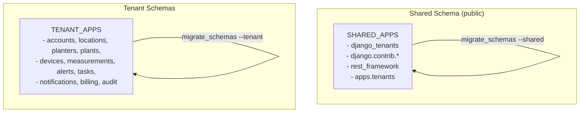
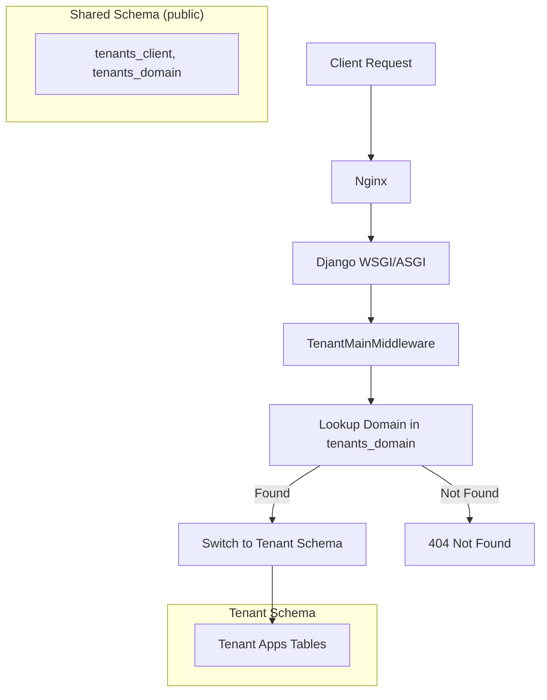
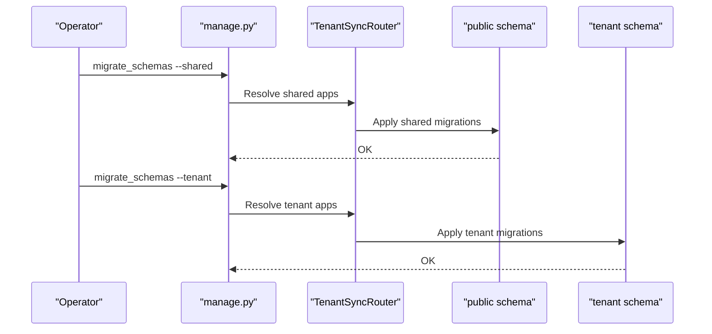
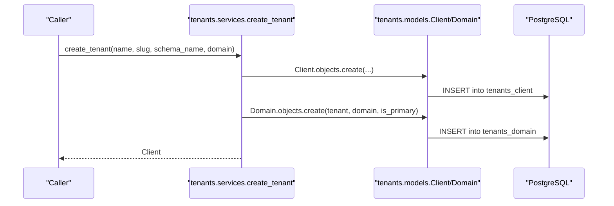
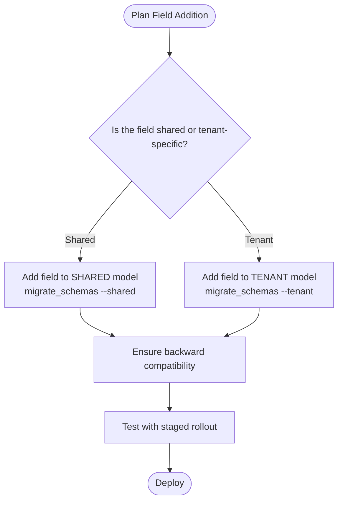
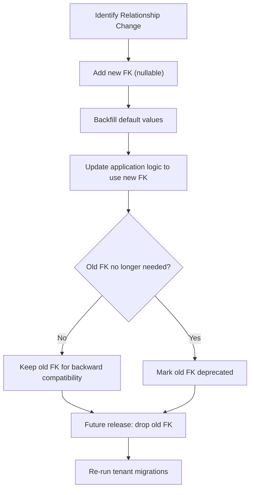
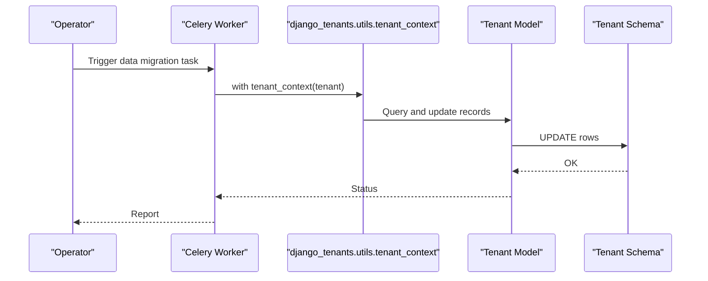
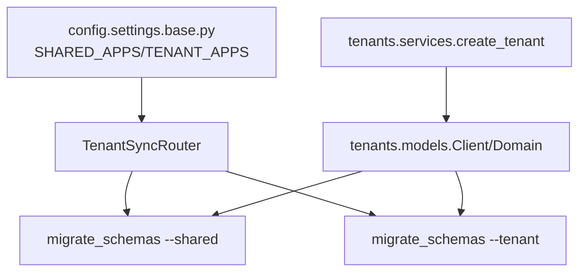

# Data Migration Strategies

<cite>
**Referenced Files in This Document**
- [MULTI_TENANCY.md](file://backend/docs/architecture/MULTI_TENANCY.md)
- [base.py](file://backend/config/settings/base.py)
- [production.py](file://backend/config/settings/production.py)
- [test.py](file://backend/config/settings/test.py)
- [models.py](file://backend/apps/tenants/models.py)
- [services.py](file://backend/apps/tenants/services.py)
- [selectors.py](file://backend/apps/tenants/selectors.py)
- [events.py](file://backend/apps/tenants/events.py)
- [admin.py](file://backend/apps/tenants/admin.py)
- [manage.py](file://backend/manage.py)
</cite>

## Table of Contents
1. [Introduction](#introduction)
2. [Project Structure](#project-structure)
3. [Core Components](#core-components)
4. [Architecture Overview](#architecture-overview)
5. [Detailed Component Analysis](#detailed-component-analysis)
6. [Dependency Analysis](#dependency-analysis)
7. [Performance Considerations](#performance-considerations)
8. [Troubleshooting Guide](#troubleshooting-guide)
9. [Conclusion](#conclusion)
10. [Appendices](#appendices)

## Introduction
This document provides comprehensive guidance for database migration strategies in a multi-tenant environment powered by django-tenants and PostgreSQL schemas. It focuses on:
- How migrations are organized between shared apps (public schema) and tenant apps (per-tenant schemas)
- Practical patterns for schema creation, data seeding, and tenant-specific migrations
- Strategies for evolving business logic safely, including adding fields, changing relationships, and transforming data
- Rollback approaches, preserving data during schema changes, and maintaining backward compatibility
- Timing, downtime minimization, and testing strategies for safe deployments

## Project Structure
The project uses django-tenants to isolate tenants into separate PostgreSQL schemas. The configuration defines which apps live in the shared public schema and which are replicated per tenant. The migration lifecycle is explicitly split between shared and tenant schemas.

**Diagram sources**
- [base.py:41-94](file://backend/config/settings/base.py#L41-L94)
- [MULTI_TENANCY.md:54-61](file://backend/docs/architecture/MULTI_TENANCY.md#L54-L61)

**Section sources**
- [base.py:41-94](file://backend/config/settings/base.py#L41-L94)
- [MULTI_TENANCY.md:54-61](file://backend/docs/architecture/MULTI_TENANCY.md#L54-L61)

## Core Components
- Shared schema (public): Contains shared tables such as tenants and domains, plus Django core and third-party apps configured in SHARED_APPS. Migrations for these apps are applied with the --shared flag.
- Tenant schemas: Contain per-tenant copies of TENANT_APPS. Migrations for these apps are applied with the --tenant flag.
- Tenant provisioning service: Centralized creation of tenants and their primary domains, ensuring schema creation and domain registration are consistent.

Key responsibilities:
- SHARED_APPS: Tenant registry and routing metadata
- TENANT_APPS: Business domain data and logic per tenant
- Services layer: Enforces safe, auditable tenant creation and updates

**Section sources**
- [base.py:41-94](file://backend/config/settings/base.py#L41-L94)
- [models.py:6-77](file://backend/apps/tenants/models.py#L6-L77)
- [services.py:11-35](file://backend/apps/tenants/services.py#L11-L35)

## Architecture Overview
The multi-tenancy architecture relies on PostgreSQL schemas and django-tenants. Requests route to a tenant’s schema via middleware and domain lookup. Migrations are applied separately to shared and tenant schemas.

**Diagram sources**
- [MULTI_TENANCY.md:12-26](file://backend/docs/architecture/MULTI_TENANCY.md#L12-L26)
- [models.py:56-77](file://backend/apps/tenants/models.py#L56-L77)

**Section sources**
- [MULTI_TENANCY.md:12-26](file://backend/docs/architecture/MULTI_TENANCY.md#L12-L26)
- [models.py:56-77](file://backend/apps/tenants/models.py#L56-L77)

## Detailed Component Analysis

### Migration Lifecycle: Shared vs Tenant Apps
- Apply shared migrations first to the public schema using the --shared flag.
- Apply tenant migrations second to all tenant schemas using the --tenant flag.
- This order ensures shared metadata (tenants and domains) exists before tenant schemas are created and seeded.

**Diagram sources**
- [MULTI_TENANCY.md:58-61](file://backend/docs/architecture/MULTI_TENANCY.md#L58-L61)
- [base.py:92-102](file://backend/config/settings/base.py#L92-L102)

**Section sources**
- [MULTI_TENANCY.md:54-61](file://backend/docs/architecture/MULTI_TENANCY.md#L54-L61)
- [base.py:92-102](file://backend/config/settings/base.py#L92-L102)

### Tenant Provisioning and Initial Seeding
Tenant creation is centralized in the services layer. It creates the tenant record and its primary domain, enabling immediate routing and schema initialization.

**Diagram sources**
- [services.py:11-35](file://backend/apps/tenants/services.py#L11-L35)
- [models.py:6-45](file://backend/apps/tenants/models.py#L6-L45)

**Section sources**
- [services.py:11-35](file://backend/apps/tenants/services.py#L11-L35)
- [models.py:6-45](file://backend/apps/tenants/models.py#L6-L45)

### Adding New Fields: Shared vs Tenant
- Shared fields: Add to models in SHARED_APPS (e.g., tenants). Run migrate_schemas --shared after deployment.
- Tenant fields: Add to models in TENANT_APPS. Run migrate_schemas --tenant after deployment.
- Backward compatibility: Keep old fields during transitions; introduce new nullable fields initially; populate defaults via data migrations; finally drop old fields in a subsequent release.

**Diagram sources**
- [base.py:41-94](file://backend/config/settings/base.py#L41-L94)
- [MULTI_TENANCY.md:54-61](file://backend/docs/architecture/MULTI_TENANCY.md#L54-L61)

**Section sources**
- [base.py:41-94](file://backend/config/settings/base.py#L41-L94)
- [MULTI_TENANCY.md:54-61](file://backend/docs/architecture/MULTI_TENANCY.md#L54-L61)

### Changing Relationships: Safe Refactors
- Introduce new FKs as nullable; seed defaults; switch logic to use new relationship; mark old FKs as deprecated; remove old fields in a later release.
- For cross-schema references, avoid in views; use tenant_context in background jobs only.

**Diagram sources**
- [MULTI_TENANCY.md:63-75](file://backend/docs/architecture/MULTI_TENANCY.md#L63-L75)

**Section sources**
- [MULTI_TENANCY.md:63-75](file://backend/docs/architecture/MULTI_TENANCY.md#L63-L75)

### Evolving Business Logic: Data Transformations
- Use data migrations to transform existing data safely. For tenant-wide changes, iterate over tenants using tenant_context in background tasks.
- Example patterns:
  - Normalize codes or names across tenant schemas
  - Recalculate derived metrics
  - Rebuild denormalized fields

**Diagram sources**
- [MULTI_TENANCY.md:63-75](file://backend/docs/architecture/MULTI_TENANCY.md#L63-L75)

**Section sources**
- [MULTI_TENANCY.md:63-75](file://backend/docs/architecture/MULTI_TENANCY.md#L63-L75)

### Rollback Strategies and Data Preservation
- Prefer reversible migrations for schema changes; keep old indexes and columns during transition windows.
- For tenant data, maintain backward-compatible reads while phasing out old fields in a controlled timeframe.
- Use tenant_context to reprocess affected tenant data if needed after a rollback.
- Keep frequent backups and test rollbacks in staging environments mirroring production.

[No sources needed since this section provides general guidance]

### Backward Compatibility Maintenance
- Keep old fields and routes for a deprecation window; surface warnings in logs or UI.
- Version APIs and document breaking changes; gate new logic behind feature flags when feasible.
- Ensure tenant isolation remains intact during migrations; avoid cross-schema queries in views.

[No sources needed since this section provides general guidance]

### Migration Timing and Downtime Minimization
- Perform migrations during scheduled maintenance windows.
- Use blue/green deployments or rolling restarts to minimize downtime.
- For tenant migrations, consider running them per-tenant batch to reduce lock contention.
- Monitor migration progress and health checks before switching traffic.

[No sources needed since this section provides general guidance]

### Testing Strategies for Migration Safety
- Use the test settings to run migrations against a dedicated test database.
- Write unit tests around tenant creation and domain resolution.
- Validate that shared and tenant migrations succeed independently and in combination.
- Simulate data migrations with fixtures and tenant_context in background tasks.

**Section sources**
- [test.py:14-23](file://backend/config/settings/test.py#L14-L23)
- [services.py:11-35](file://backend/apps/tenants/services.py#L11-L35)
- [selectors.py:13-25](file://backend/apps/tenants/selectors.py#L13-L25)

## Dependency Analysis
The migration strategy depends on explicit separation of SHARED_APPS and TENANT_APPS, the TenantSyncRouter, and tenant provisioning services.

**Diagram sources**
- [base.py:41-102](file://backend/config/settings/base.py#L41-L102)
- [services.py:11-35](file://backend/apps/tenants/services.py#L11-L35)
- [models.py:6-45](file://backend/apps/tenants/models.py#L6-L45)

**Section sources**
- [base.py:41-102](file://backend/config/settings/base.py#L41-L102)
- [services.py:11-35](file://backend/apps/tenants/services.py#L11-L35)
- [models.py:6-45](file://backend/apps/tenants/models.py#L6-L45)

## Performance Considerations
- Batch tenant migrations to reduce contention.
- Use appropriate PostgreSQL maintenance settings in production.
- Monitor long-running migrations and consider partitioning or background jobs for large datasets.

[No sources needed since this section provides general guidance]

## Troubleshooting Guide
Common issues and remedies:
- Incorrect app lists: Verify SHARED_APPS and TENANT_APPS align with intended schemas.
- Migration order errors: Always apply --shared before --tenant.
- Tenant routing failures: Confirm domain entries exist and are primary where required.
- Test environment mismatches: Ensure test database suffix and credentials are set correctly.

**Section sources**
- [base.py:41-94](file://backend/config/settings/base.py#L41-L94)
- [MULTI_TENANCY.md:54-61](file://backend/docs/architecture/MULTI_TENANCY.md#L54-L61)
- [test.py:14-23](file://backend/config/settings/test.py#L14-L23)

## Conclusion
By strictly separating shared and tenant migrations, centralizing tenant provisioning, and applying phased, reversible changes, the system can evolve reliably under multi-tenancy. Emphasize backward compatibility, thorough testing, and conservative rollouts to minimize risk and downtime.

[No sources needed since this section summarizes without analyzing specific files]

## Appendices

### Appendix A: Migration Commands Reference
- Apply shared migrations: migrate_schemas --shared
- Apply tenant migrations: migrate_schemas --tenant

**Section sources**
- [MULTI_TENANCY.md:58-61](file://backend/docs/architecture/MULTI_TENANCY.md#L58-L61)

### Appendix B: Tenant Provisioning Checklist
- Define tenant name, slug, schema_name, and primary domain
- Create tenant and domain via services layer
- Seed initial tenant data if required
- Verify routing and access

**Section sources**
- [services.py:11-35](file://backend/apps/tenants/services.py#L11-L35)
- [models.py:6-45](file://backend/apps/tenants/models.py#L6-L45)