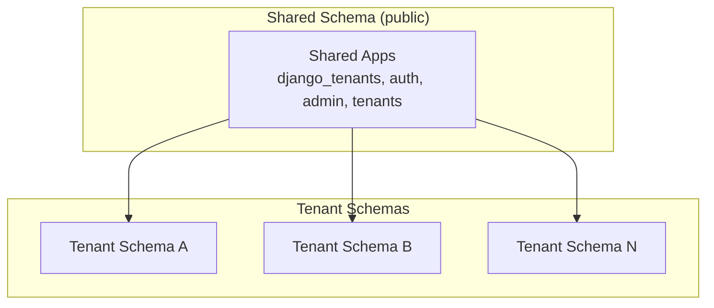
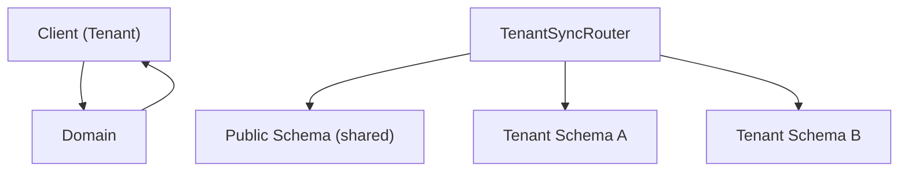
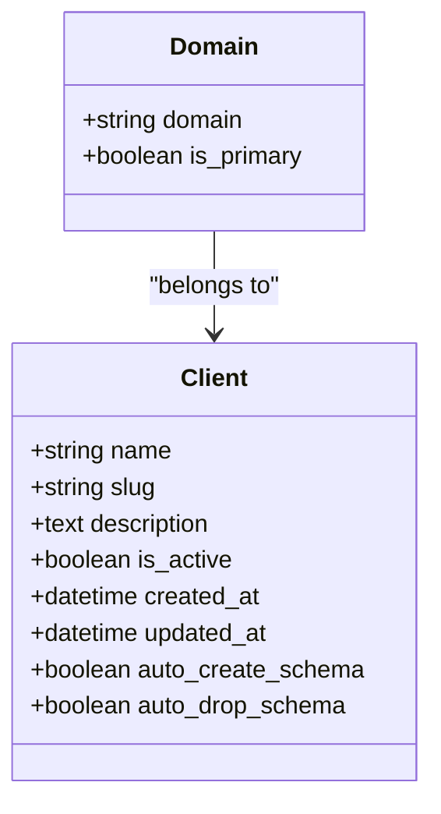
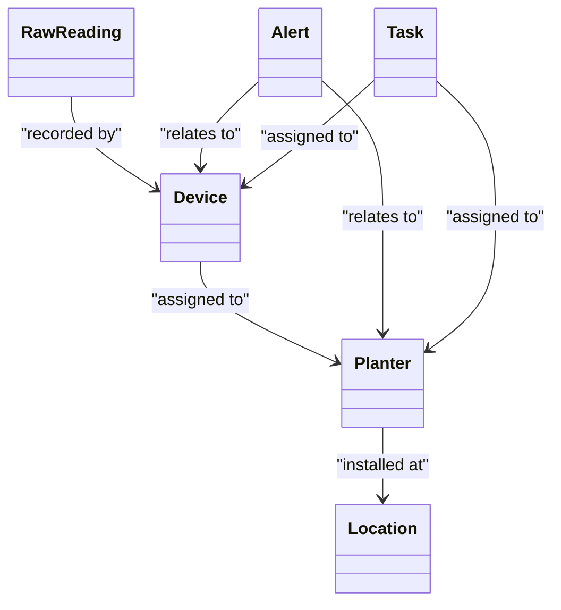
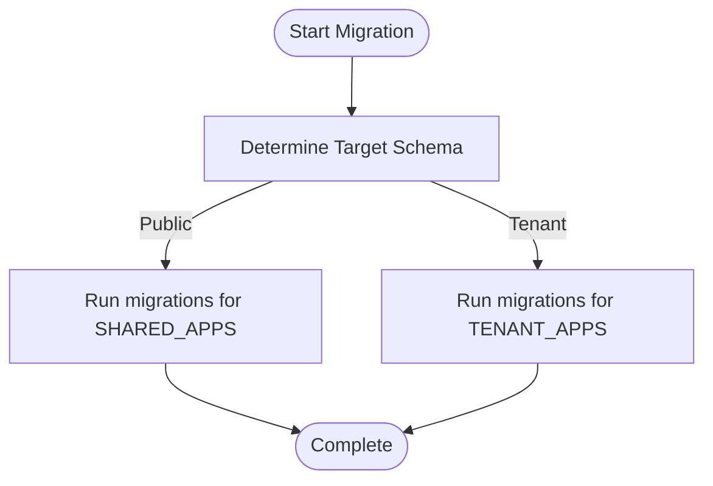
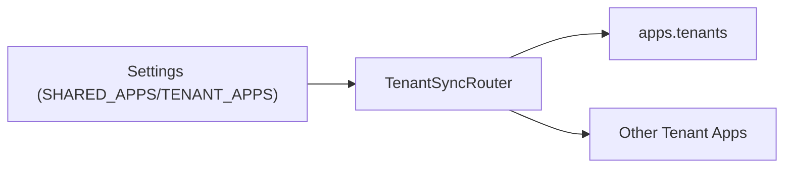
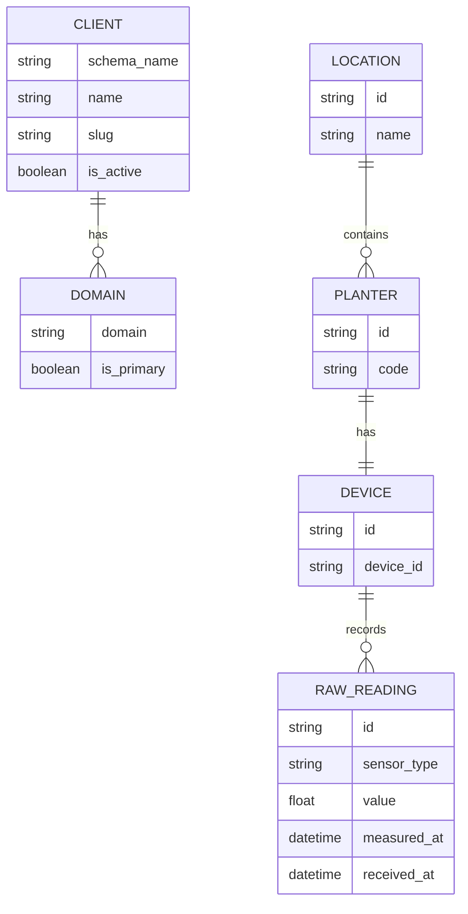

# Database Design

<cite>
**Referenced Files in This Document**
- [base.py](file://backend/config/settings/base.py)
- [models.py](file://backend/apps/tenants/models.py)
- [services.py](file://backend/apps/tenants/services.py)
- [models.py](file://backend/apps/accounts/models.py)
- [models.py](file://backend/apps/planters/models.py)
- [models.py](file://backend/apps/devices/models.py)
- [models.py](file://backend/apps/measurements/models.py)
- [models.py](file://backend/apps/locations/models.py)
- [models.py](file://backend/apps/plants/models.py)
- [models.py](file://backend/apps/alerts/models.py)
- [models.py](file://backend/apps/tasks/models.py)
</cite>

## Table of Contents
1. [Introduction](#introduction)
2. [Project Structure](#project-structure)
3. [Core Components](#core-components)
4. [Architecture Overview](#architecture-overview)
5. [Detailed Component Analysis](#detailed-component-analysis)
6. [Dependency Analysis](#dependency-analysis)
7. [Performance Considerations](#performance-considerations)
8. [Troubleshooting Guide](#troubleshooting-guide)
9. [Conclusion](#conclusion)
10. [Appendices](#appendices)

## Introduction
This document describes the multi-tenant database design for the PlantOps SaaS platform. It focuses on the schema-based tenant isolation strategy using django-tenants with PostgreSQL schemas, the shared schema for cross-tenant resources, and the tenant-specific schemas for isolated per-tenant data. It documents the intended entity relationships among tenants, users, locations, planters, devices, and measurements, along with field definitions, data types, constraints, and indexes. It also covers data validation rules, business constraints, referential integrity, migration strategies, schema evolution, caching strategies, query optimization patterns, performance considerations, data retention, backup, and disaster recovery planning.

## Project Structure
The database configuration and tenant setup are defined centrally in the Django settings. The multi-tenancy is implemented via django-tenants with two app groups:
- Shared apps installed in the public schema (e.g., authentication, admin, tenants app).
- Tenant apps installed in each tenant’s private schema (bounded contexts such as accounts, locations, planters, devices, measurements, etc.).

**Diagram sources**
- [base.py:44-94](file://backend/config/settings/base.py#L44-L94)

**Section sources**
- [base.py:44-102](file://backend/config/settings/base.py#L44-L102)

## Core Components
- Tenant model (Client): Represents a tenant with schema isolation and domain mapping.
- Domain model: Maps hostnames to tenants and marks a primary domain.
- Services: Controlled creation and deactivation of tenants to enforce isolation and governance.

Key tenant fields and constraints:
- Client: name, slug (unique), description, is_active flag, timestamps; auto-create/drop schema enabled.
- Domain: domain (fully qualified), is_primary flag, foreign key to Client.

Operational controls:
- Tenant provisioning is centralized in the services layer to ensure schema creation and domain registration.
- Soft deactivation prevents routing and background jobs while preserving data.

**Section sources**
- [models.py:6-53](file://backend/apps/tenants/models.py#L6-L53)
- [models.py:56-76](file://backend/apps/tenants/models.py#L56-L76)
- [services.py:11-42](file://backend/apps/tenants/services.py#L11-L42)

## Architecture Overview
The system uses django-tenants with a router that synchronizes reads/writes across schemas. Requests are routed to the appropriate tenant schema based on the incoming hostname via the Domain model. Shared apps operate in the public schema, while tenant apps operate inside each tenant’s schema.

**Diagram sources**
- [base.py:99-102](file://backend/config/settings/base.py#L99-L102)
- [models.py:6-53](file://backend/apps/tenants/models.py#L6-L53)
- [models.py:56-76](file://backend/apps/tenants/models.py#L56-L76)

**Section sources**
- [base.py:99-119](file://backend/config/settings/base.py#L99-L119)

## Detailed Component Analysis

### Tenant Isolation Models
- Client (TenantMixin): Tenant identity, slug, activity flag, timestamps; auto schema creation enabled.
- Domain (DomainMixin): Hostname-to-tenant mapping with primary domain flag.

**Diagram sources**
- [models.py:6-53](file://backend/apps/tenants/models.py#L6-L53)
- [models.py:56-76](file://backend/apps/tenants/models.py#L56-L76)

**Section sources**
- [models.py:6-53](file://backend/apps/tenants/models.py#L6-L53)
- [models.py:56-76](file://backend/apps/tenants/models.py#L56-L76)

### Shared Schema Entities
- Accounts: Placeholder for user profiles scoped to a tenant.
- Plants: Placeholder for plant species definitions.

These models are currently placeholders and will define fields and relationships in future iterations.

**Section sources**
- [models.py:15-30](file://backend/apps/accounts/models.py#L15-L30)
- [models.py:12-26](file://backend/apps/plants/models.py#L12-L26)

### Tenant-Specific Entities
- Locations: Physical locations (sites, greenhouses, indoor areas) where planters and devices are installed.
- Planters: Containers/pots; inventory and status.
- Devices: IoT devices (e.g., ESP32); firmware, connectivity, and assignment to planters.
- Measurements: Raw sensor readings; append-only policy; timestamps and payload storage.
- Alerts: Threshold-triggered events; append-only policy.
- Tasks: Work items assigned to users; status, priority, due dates.

**Diagram sources**
- [models.py:12-27](file://backend/apps/planters/models.py#L12-L27)
- [models.py:12-29](file://backend/apps/devices/models.py#L12-L29)
- [models.py:14-30](file://backend/apps/measurements/models.py#L14-L30)
- [models.py:13-29](file://backend/apps/alerts/models.py#L13-L29)
- [models.py:12-29](file://backend/apps/tasks/models.py#L12-L29)
- [models.py:12-26](file://backend/apps/locations/models.py#L12-L26)

**Section sources**
- [models.py:12-27](file://backend/apps/planters/models.py#L12-L27)
- [models.py:12-29](file://backend/apps/devices/models.py#L12-L29)
- [models.py:14-30](file://backend/apps/measurements/models.py#L14-L30)
- [models.py:13-29](file://backend/apps/alerts/models.py#L13-L29)
- [models.py:12-29](file://backend/apps/tasks/models.py#L12-L29)
- [models.py:12-26](file://backend/apps/locations/models.py#L12-L26)

### Data Validation Rules and Business Constraints
- Append-only policy for raw sensor readings and alert events to preserve audit trails and enable reproducible analytics.
- Unique slug for tenants to support deterministic routing and URL-friendly identifiers.
- Primary domain flag ensures canonical hostname resolution for tenant-aware URLs.
- Activity flag on tenants enables soft deactivation without data loss.
- Placeholders indicate future foreign keys and constraints (e.g., planter-device-location relationships).

**Section sources**
- [models.py:6-53](file://backend/apps/tenants/models.py#L6-L53)
- [models.py:56-76](file://backend/apps/tenants/models.py#L56-L76)
- [models.py:14-30](file://backend/apps/measurements/models.py#L14-L30)
- [models.py:13-29](file://backend/apps/alerts/models.py#L13-L29)

### Referential Integrity and Indexes
- Intended foreign keys will be added in future model definitions to maintain referential integrity across tenant schemas.
- Indexes should be considered for frequently filtered fields (e.g., device_id, planter_id, measured_at, received_at) to optimize queries.
- Unique constraints on tenant slug and domain will prevent conflicts.

Note: Current model files are placeholders. Final constraints and indexes will be defined when full field sets are implemented.

**Section sources**
- [models.py:12-27](file://backend/apps/planters/models.py#L12-L27)
- [models.py:12-29](file://backend/apps/devices/models.py#L12-L29)
- [models.py:14-30](file://backend/apps/measurements/models.py#L14-L30)
- [models.py:13-29](file://backend/apps/alerts/models.py#L13-L29)
- [models.py:12-29](file://backend/apps/tasks/models.py#L12-L29)
- [models.py:12-26](file://backend/apps/locations/models.py#L12-L26)

### Migration Strategies and Schema Evolution
- django-tenants manages schema creation and deletion automatically for tenants.
- SHARED_APPS and TENANT_APPS define which apps are migrated into the public and tenant schemas respectively.
- New tenant apps should be added to TENANT_APPS to ensure they are included in tenant migrations.
- Changes to tenant models require migrations per tenant schema; use tenant-aware commands to apply changes consistently.

**Diagram sources**
- [base.py:44-94](file://backend/config/settings/base.py#L44-L94)
- [base.py:99-102](file://backend/config/settings/base.py#L99-L102)

**Section sources**
- [base.py:44-102](file://backend/config/settings/base.py#L44-L102)

### Data Lifecycle Management
- Append-only ingestion for measurements and alerts preserves immutable event logs.
- Soft deactivation of tenants disables routing and background jobs without deleting data.
- Backups should capture both the public schema and all tenant schemas; restore procedures should recreate tenant schemas and reapply migrations.

[No sources needed since this section provides general guidance]

### Caching Strategies and Query Optimization
- Cache frequently accessed tenant metadata (e.g., tenant-by-domain lookup) to reduce database load.
- Use database indexes on high-cardinality foreign keys and time-series fields (e.g., measured_at).
- Paginate measurement queries and avoid N+1 selects by prefetching related entities.
- Consider partitioning strategies for time-series data (e.g., monthly partitions) to improve maintenance and query performance.

[No sources needed since this section provides general guidance]

## Dependency Analysis
The system depends on django-tenants for multi-tenant routing and schema management. The settings define which apps belong to shared vs tenant schemas, ensuring proper separation of concerns.

**Diagram sources**
- [base.py:44-102](file://backend/config/settings/base.py#L44-L102)

**Section sources**
- [base.py:44-102](file://backend/config/settings/base.py#L44-L102)

## Performance Considerations
- Normalize shared data in the public schema (e.g., master lists) and keep tenant-specific data in tenant schemas.
- Use efficient indexing on time-series fields and foreign keys.
- Batch ingestion for measurements to reduce transaction overhead.
- Monitor slow queries and add composite indexes where needed.

[No sources needed since this section provides general guidance]

## Troubleshooting Guide
- Tenant not found: Verify domain mapping and primary domain flag; ensure TENANT_MODEL and TENANT_DOMAIN_MODEL are set correctly.
- Schema creation failures: Confirm auto_create_schema is enabled and database credentials have sufficient privileges.
- Tenant deactivation: Use the provided service to toggle is_active; confirm middleware routing excludes inactive tenants.

**Section sources**
- [base.py:99-102](file://backend/config/settings/base.py#L99-L102)
- [services.py:38-42](file://backend/apps/tenants/services.py#L38-L42)

## Conclusion
The PlantOps database design leverages django-tenants to achieve robust schema-based tenant isolation. The shared schema hosts cross-tenant infrastructure, while tenant schemas encapsulate per-tenant data. The placeholder models outline the intended relationships and constraints; future implementations should add precise field definitions, foreign keys, indexes, and constraints. Adhering to append-only policies for sensitive event logs, using controlled tenant provisioning services, and implementing sound migration and caching strategies will ensure scalability, reliability, and compliance.

## Appendices

### Entity Relationship Diagram (ERD)
This ERD reflects the intended relationships among tenant, user, location, planter, device, and measurement entities.

**Diagram sources**
- [models.py:6-53](file://backend/apps/tenants/models.py#L6-L53)
- [models.py:56-76](file://backend/apps/tenants/models.py#L56-L76)
- [models.py:12-26](file://backend/apps/locations/models.py#L12-L26)
- [models.py:12-27](file://backend/apps/planters/models.py#L12-L27)
- [models.py:12-29](file://backend/apps/devices/models.py#L12-L29)
- [models.py:14-30](file://backend/apps/measurements/models.py#L14-L30)