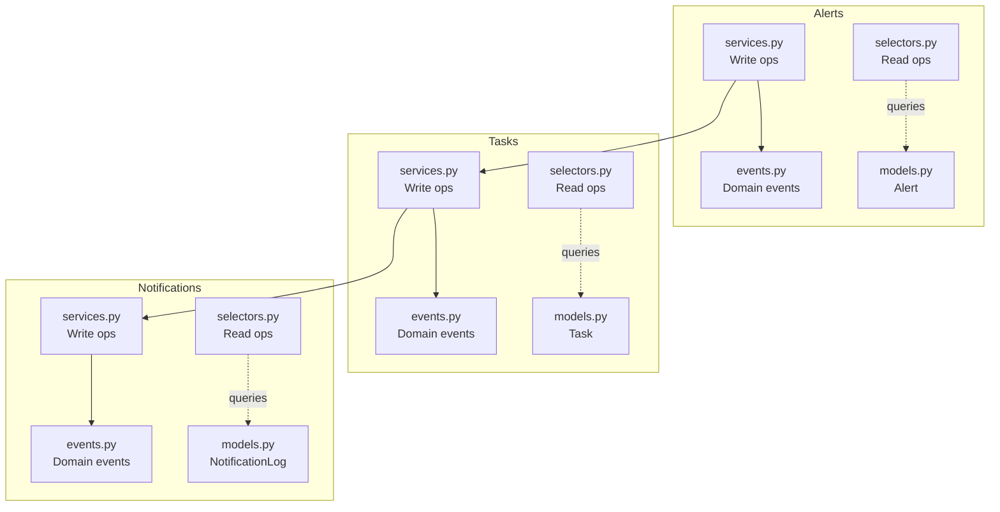
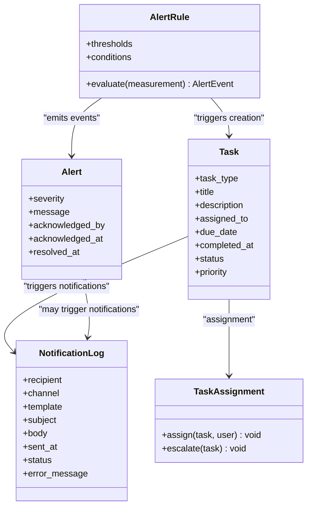
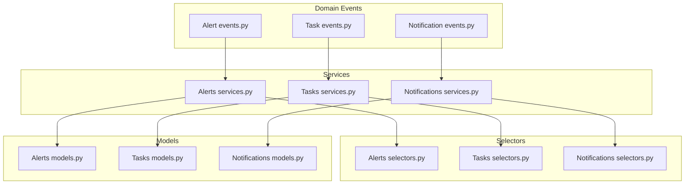
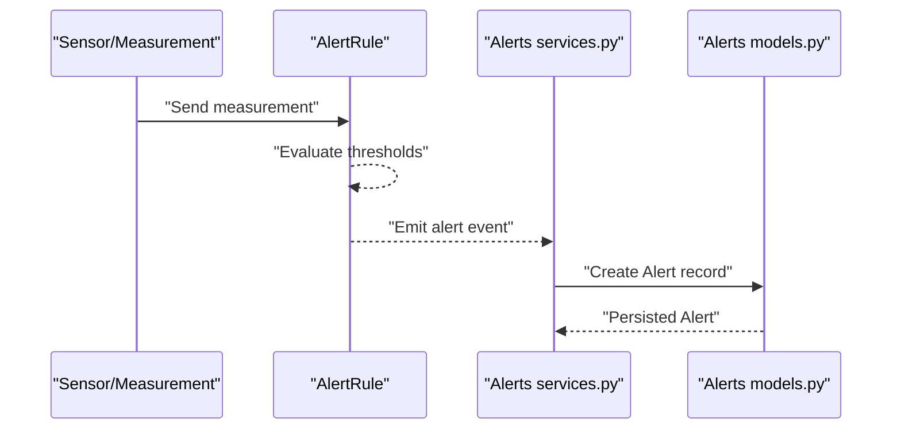
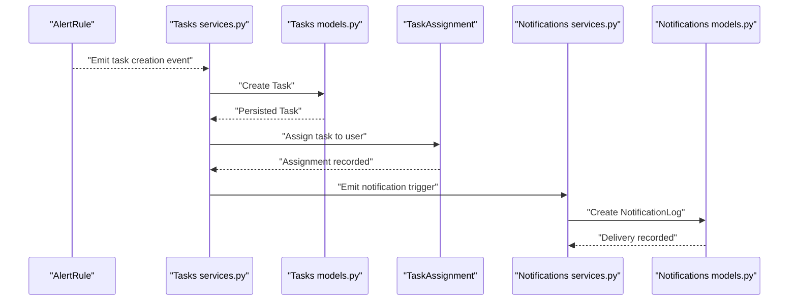
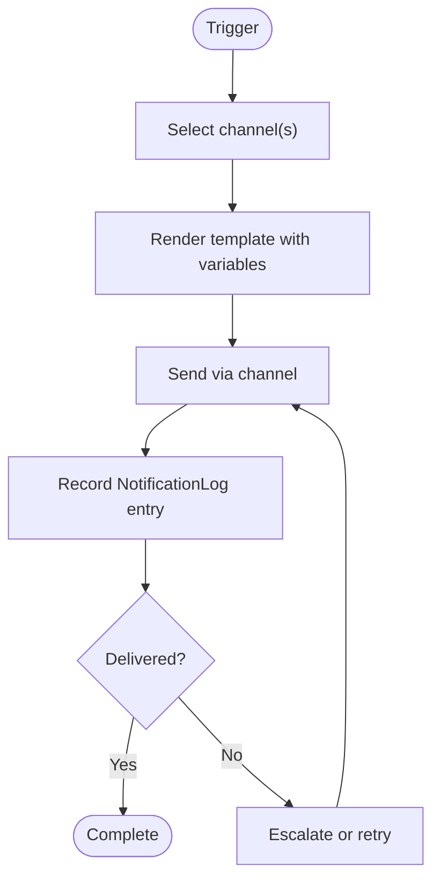
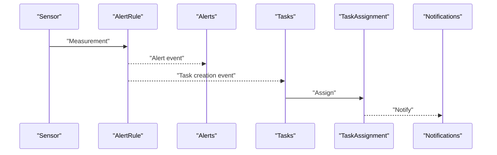
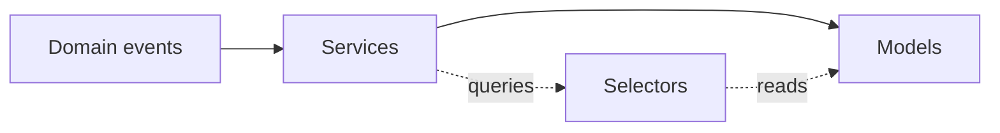

# Alert, Task, and Notification Models

<cite>
**Referenced Files in This Document**
- [alerts/models.py](file://backend/apps/alerts/models.py)
- [tasks/models.py](file://backend/apps/tasks/models.py)
- [notifications/models.py](file://backend/apps/notifications/models.py)
- [alerts/services.py](file://backend/apps/alerts/services.py)
- [tasks/services.py](file://backend/apps/tasks/services.py)
- [notifications/services.py](file://backend/apps/notifications/services.py)
- [alerts/events.py](file://backend/apps/alerts/events.py)
- [tasks/events.py](file://backend/apps/tasks/events.py)
- [notifications/events.py](file://backend/apps/notifications/events.py)
- [alerts/selectors.py](file://backend/apps/alerts/selectors.py)
- [tasks/selectors.py](file://backend/apps/tasks/selectors.py)
- [notifications/selectors.py](file://backend/apps/notifications/selectors.py)
</cite>

## Table of Contents
1. [Introduction](#introduction)
2. [Project Structure](#project-structure)
3. [Core Components](#core-components)
4. [Architecture Overview](#architecture-overview)
5. [Detailed Component Analysis](#detailed-component-analysis)
6. [Dependency Analysis](#dependency-analysis)
7. [Performance Considerations](#performance-considerations)
8. [Troubleshooting Guide](#troubleshooting-guide)
9. [Conclusion](#conclusion)

## Introduction
This document describes the alert, task, and notification models and their workflows. It focuses on:
- Entity relationships among Alert, AlertRule, Task, TaskAssignment, and NotificationLog
- Alert evaluation chains, task generation triggers, and notification dispatch mechanisms
- Escalation patterns and delivery status tracking
- Severity levels, task priority systems, and notification template relationships
- How sensor alerts relate to work order creation

Note: The current models are placeholders indicating future field definitions. This document therefore documents intended relationships and workflows based on the placeholder comments and the layered architecture pattern (services/selectors/events).

## Project Structure
The relevant domain areas are organized into bounded contexts:
- Alerts: alert definitions, instances, thresholds, and append-only event storage
- Tasks: tasks generated by the system or created manually, including assignments and status/priority
- Notifications: channels, templates, and delivery logs

**Diagram sources**
- [alerts/models.py:13-28](file://backend/apps/alerts/models.py#L13-L28)
- [tasks/models.py:12-28](file://backend/apps/tasks/models.py#L12-L28)
- [notifications/models.py:12-27](file://backend/apps/notifications/models.py#L12-L27)
- [alerts/services.py:1-8](file://backend/apps/alerts/services.py#L1-L8)
- [tasks/services.py:1-6](file://backend/apps/tasks/services.py#L1-L6)
- [notifications/services.py:1-6](file://backend/apps/notifications/services.py#L1-L6)
- [alerts/events.py:1-7](file://backend/apps/alerts/events.py#L1-L7)
- [tasks/events.py:1-7](file://backend/apps/tasks/events.py#L1-L7)
- [notifications/events.py:1-7](file://backend/apps/notifications/events.py#L1-L7)
- [alerts/selectors.py:1-6](file://backend/apps/alerts/selectors.py#L1-L6)
- [tasks/selectors.py:1-6](file://backend/apps/tasks/selectors.py#L1-L6)
- [notifications/selectors.py:1-6](file://backend/apps/notifications/selectors.py#L1-L6)

**Section sources**
- [alerts/models.py:1-28](file://backend/apps/alerts/models.py#L1-L28)
- [tasks/models.py:1-28](file://backend/apps/tasks/models.py#L1-L28)
- [notifications/models.py:1-27](file://backend/apps/notifications/models.py#L1-L27)
- [alerts/services.py:1-8](file://backend/apps/alerts/services.py#L1-L8)
- [tasks/services.py:1-6](file://backend/apps/tasks/services.py#L1-L6)
- [notifications/services.py:1-6](file://backend/apps/notifications/services.py#L1-L6)
- [alerts/events.py:1-7](file://backend/apps/alerts/events.py#L1-L7)
- [tasks/events.py:1-7](file://backend/apps/tasks/events.py#L1-L7)
- [notifications/events.py:1-7](file://backend/apps/notifications/events.py#L1-L7)
- [alerts/selectors.py:1-6](file://backend/apps/alerts/selectors.py#L1-L6)
- [tasks/selectors.py:1-6](file://backend/apps/tasks/selectors.py#L1-L6)
- [notifications/selectors.py:1-6](file://backend/apps/notifications/selectors.py#L1-L6)

## Core Components
This section outlines the intended roles and relationships of the core entities.

- Alert
  - Purpose: Represents an alert instance with severity and target context (planter/device/plant)
  - Append-only constraint: Events are never updated or deleted
  - Intended fields: alert_type, severity, FKs to planter/device/plant, message, acknowledgment/resolution timestamps
  - Relationship: Triggers task generation via AlertRule and subsequent notification dispatch

- AlertRule
  - Purpose: Defines thresholds and conditions for alert evaluation
  - Relationship: Evaluates incoming sensor/measurement events and emits domain events when thresholds are crossed
  - Triggers: Emits domain events that lead to Task creation and NotificationLog entries

- Task
  - Purpose: Represents a work item (e.g., water plant, check device, replace battery)
  - Intended fields: task_type, title/description, FKs to planter/device/plant/location, assigned_to, due/completion dates, status, priority
  - Relationship: Created from AlertRule domain events; may be assigned automatically or manually

- TaskAssignment
  - Purpose: Encapsulates assignment logic and history for tasks
  - Relationship: Links Task to a User and manages assignment lifecycle

- NotificationLog
  - Purpose: Records delivery attempts per channel (email, SMS, push, in-app) with status and error messages
  - Intended fields: recipient, channel, template, subject/body, sent_at, status, error_message
  - Relationship: Driven by Task and Alert workflows; tracks delivery outcomes

**Diagram sources**
- [alerts/models.py:13-28](file://backend/apps/alerts/models.py#L13-L28)
- [tasks/models.py:12-28](file://backend/apps/tasks/models.py#L12-L28)
- [notifications/models.py:12-27](file://backend/apps/notifications/models.py#L12-L27)

**Section sources**
- [alerts/models.py:13-28](file://backend/apps/alerts/models.py#L13-L28)
- [tasks/models.py:12-28](file://backend/apps/tasks/models.py#L12-L28)
- [notifications/models.py:12-27](file://backend/apps/notifications/models.py#L12-L27)

## Architecture Overview
The system follows a layered architecture:
- Domain events represent “what happened” without side effects
- Services encapsulate write operations and orchestrate workflows
- Selectors encapsulate read queries
- Models define persistence and future field sets

**Diagram sources**
- [alerts/events.py:1-7](file://backend/apps/alerts/events.py#L1-L7)
- [tasks/events.py:1-7](file://backend/apps/tasks/events.py#L1-L7)
- [notifications/events.py:1-7](file://backend/apps/notifications/events.py#L1-L7)
- [alerts/services.py:1-8](file://backend/apps/alerts/services.py#L1-L8)
- [tasks/services.py:1-6](file://backend/apps/tasks/services.py#L1-L6)
- [notifications/services.py:1-6](file://backend/apps/notifications/services.py#L1-L6)
- [alerts/selectors.py:1-6](file://backend/apps/alerts/selectors.py#L1-L6)
- [tasks/selectors.py:1-6](file://backend/apps/tasks/selectors.py#L1-L6)
- [notifications/selectors.py:1-6](file://backend/apps/notifications/selectors.py#L1-L6)
- [alerts/models.py:13-28](file://backend/apps/alerts/models.py#L13-L28)
- [tasks/models.py:12-28](file://backend/apps/tasks/models.py#L12-L28)
- [notifications/models.py:12-27](file://backend/apps/notifications/models.py#L12-L27)

## Detailed Component Analysis

### Alert Model and Evaluation Chain
- Role: Stores alert instances with severity and target context
- Workflow:
  - Sensor/measurement events are evaluated by AlertRule
  - Threshold crossings emit domain events
  - Services handle event ingestion and persist Alert records
  - Optional: Acknowledge/resolved transitions recorded in Alert fields

**Diagram sources**
- [alerts/events.py:1-7](file://backend/apps/alerts/events.py#L1-L7)
- [alerts/services.py:1-8](file://backend/apps/alerts/services.py#L1-L8)
- [alerts/models.py:13-28](file://backend/apps/alerts/models.py#L13-L28)

**Section sources**
- [alerts/models.py:13-28](file://backend/apps/alerts/models.py#L13-L28)
- [alerts/services.py:1-8](file://backend/apps/alerts/services.py#L1-L8)
- [alerts/events.py:1-7](file://backend/apps/alerts/events.py#L1-L7)

### Task Generation and Assignment
- Trigger: AlertRule domain events
- Creation: Tasks services create Task records with appropriate metadata
- Assignment: TaskAssignment logic assigns tasks to users and escalates if needed
- Status/Priority: Tasks track status and priority; these inform notification urgency

**Diagram sources**
- [tasks/services.py:1-6](file://backend/apps/tasks/services.py#L1-L6)
- [tasks/models.py:12-28](file://backend/apps/tasks/models.py#L12-L28)
- [notifications/services.py:1-6](file://backend/apps/notifications/services.py#L1-L6)
- [notifications/models.py:12-27](file://backend/apps/notifications/models.py#L12-L27)
- [tasks/events.py:1-7](file://backend/apps/tasks/events.py#L1-L7)

**Section sources**
- [tasks/models.py:12-28](file://backend/apps/tasks/models.py#L12-L28)
- [tasks/services.py:1-6](file://backend/apps/tasks/services.py#L1-L6)
- [tasks/events.py:1-7](file://backend/apps/tasks/events.py#L1-L7)

### Notification Dispatch and Delivery Tracking
- Channels: Email, SMS, Push, In-App
- Templates: Associated with NotificationLog entries
- Delivery: NotificationLog captures sent_at, status, and error_message
- Escalation: Higher-priority tasks or unresolved alerts may trigger additional notifications

**Diagram sources**
- [notifications/models.py:12-27](file://backend/apps/notifications/models.py#L12-L27)
- [notifications/services.py:1-6](file://backend/apps/notifications/services.py#L1-L6)
- [notifications/events.py:1-7](file://backend/apps/notifications/events.py#L1-L7)

**Section sources**
- [notifications/models.py:12-27](file://backend/apps/notifications/models.py#L12-L27)
- [notifications/services.py:1-6](file://backend/apps/notifications/services.py#L1-L6)
- [notifications/events.py:1-7](file://backend/apps/notifications/events.py#L1-L7)

### Sensor Alerts to Work Order Creation
- Sensor data enters the system and is evaluated by AlertRule
- Threshold breaches produce Alert events and Task creation events
- Tasks become work orders (manual or automatic), with assignments and notifications
- Resolution of underlying conditions may mark Alerts as resolved and close Tasks

**Diagram sources**
- [alerts/models.py:13-28](file://backend/apps/alerts/models.py#L13-L28)
- [tasks/models.py:12-28](file://backend/apps/tasks/models.py#L12-L28)
- [tasks/events.py:1-7](file://backend/apps/tasks/events.py#L1-L7)
- [tasks/services.py:1-6](file://backend/apps/tasks/services.py#L1-L6)
- [tasks/selectors.py:1-6](file://backend/apps/tasks/selectors.py#L1-L6)
- [notifications/services.py:1-6](file://backend/apps/notifications/services.py#L1-L6)

**Section sources**
- [alerts/models.py:13-28](file://backend/apps/alerts/models.py#L13-L28)
- [tasks/models.py:12-28](file://backend/apps/tasks/models.py#L12-L28)
- [tasks/events.py:1-7](file://backend/apps/tasks/events.py#L1-L7)
- [tasks/services.py:1-6](file://backend/apps/tasks/services.py#L1-L6)
- [tasks/selectors.py:1-6](file://backend/apps/tasks/selectors.py#L1-L6)
- [notifications/services.py:1-6](file://backend/apps/notifications/services.py#L1-L6)

## Dependency Analysis
- Layered architecture enforces separation of concerns:
  - Events are immutable domain facts
  - Services orchestrate workflows and enforce invariants
  - Selectors centralize read logic
  - Models define persistence and future schema
- No cross-context model imports are evident; workflows are driven by events emitted within each bounded context

**Diagram sources**
- [alerts/events.py:1-7](file://backend/apps/alerts/events.py#L1-L7)
- [tasks/events.py:1-7](file://backend/apps/tasks/events.py#L1-L7)
- [notifications/events.py:1-7](file://backend/apps/notifications/events.py#L1-L7)
- [alerts/services.py:1-8](file://backend/apps/alerts/services.py#L1-L8)
- [tasks/services.py:1-6](file://backend/apps/tasks/services.py#L1-L6)
- [notifications/services.py:1-6](file://backend/apps/notifications/services.py#L1-L6)
- [alerts/selectors.py:1-6](file://backend/apps/alerts/selectors.py#L1-L6)
- [tasks/selectors.py:1-6](file://backend/apps/tasks/selectors.py#L1-L6)
- [notifications/selectors.py:1-6](file://backend/apps/notifications/selectors.py#L1-L6)
- [alerts/models.py:13-28](file://backend/apps/alerts/models.py#L13-L28)
- [tasks/models.py:12-28](file://backend/apps/tasks/models.py#L12-L28)
- [notifications/models.py:12-27](file://backend/apps/notifications/models.py#L12-L27)

**Section sources**
- [alerts/services.py:1-8](file://backend/apps/alerts/services.py#L1-L8)
- [tasks/services.py:1-6](file://backend/apps/tasks/services.py#L1-L6)
- [notifications/services.py:1-6](file://backend/apps/notifications/services.py#L1-L6)
- [alerts/selectors.py:1-6](file://backend/apps/alerts/selectors.py#L1-L6)
- [tasks/selectors.py:1-6](file://backend/apps/tasks/selectors.py#L1-L6)
- [notifications/selectors.py:1-6](file://backend/apps/notifications/selectors.py#L1-L6)

## Performance Considerations
- Event-driven decoupling: Emitting domain events enables asynchronous processing and horizontal scaling
- Append-only alerts: Immutable alert events simplify auditing and reduce write contention
- Centralized reads: Selectors keep query logic consistent and testable
- Batch processing: Consider batching task creation and notification sends during peak loads
- Idempotency: Ensure services handle duplicate events safely to avoid duplicate tasks or notifications

## Troubleshooting Guide
- Alert not appearing:
  - Verify AlertRule thresholds and evaluation logic
  - Confirm domain events are emitted and handled by Alerts services
- Task not created:
  - Check AlertRule emits task creation events
  - Validate Tasks services write path and TaskAssignment logic
- Notification not delivered:
  - Inspect NotificationLog entries for status and error_message
  - Confirm channel configuration and template rendering
- Escalation not triggered:
  - Review TaskAssignment escalation rules and timing
  - Ensure higher-priority tasks or unresolved alerts emit escalation events

**Section sources**
- [alerts/services.py:1-8](file://backend/apps/alerts/services.py#L1-L8)
- [tasks/services.py:1-6](file://backend/apps/tasks/services.py#L1-L6)
- [notifications/services.py:1-6](file://backend/apps/notifications/services.py#L1-L6)
- [notifications/models.py:12-27](file://backend/apps/notifications/models.py#L12-L27)

## Conclusion
The alert, task, and notification domains are structured around immutable domain events and service-layer orchestration. Alerts drive task creation and notifications, while TaskAssignment and NotificationLog provide assignment and delivery tracking. Severity levels and task priorities inform escalation and urgency. The layered design supports scalability, maintainability, and clear separation of read/write concerns.