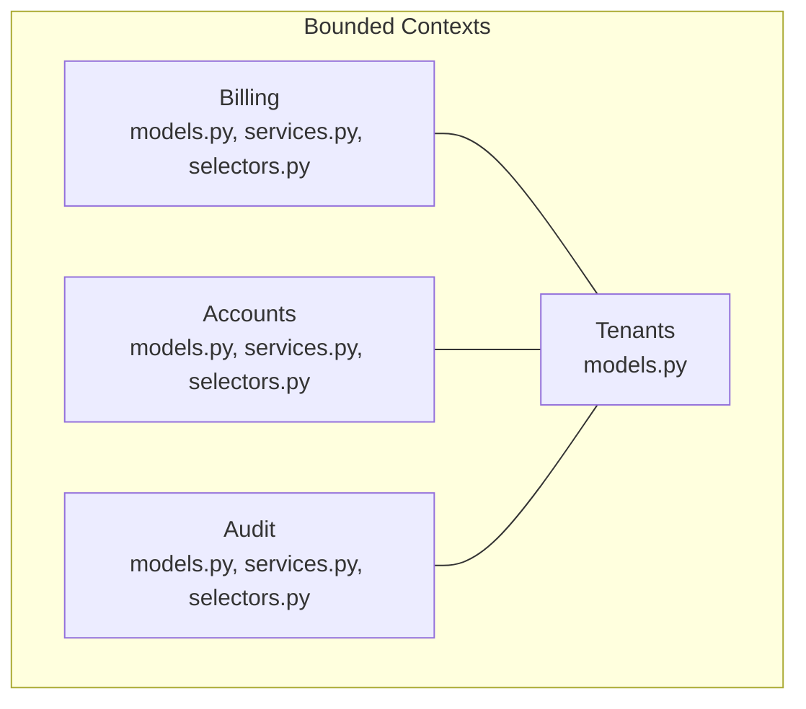
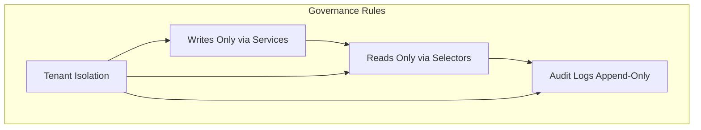
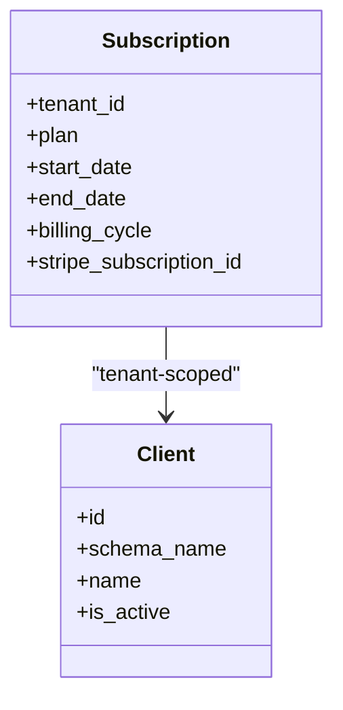
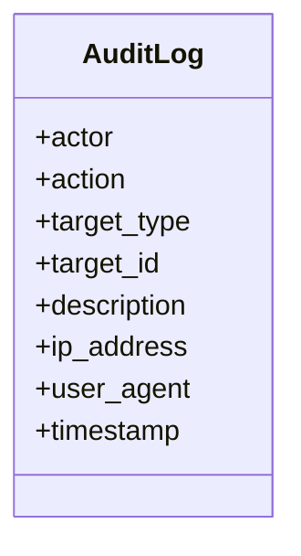
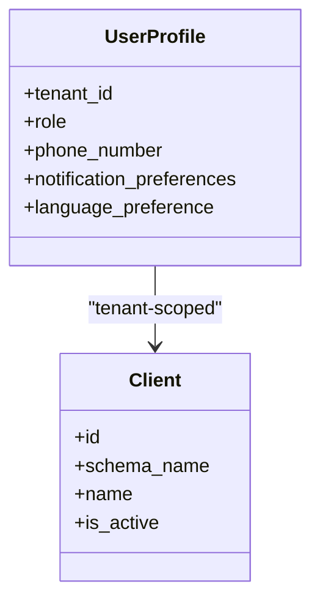
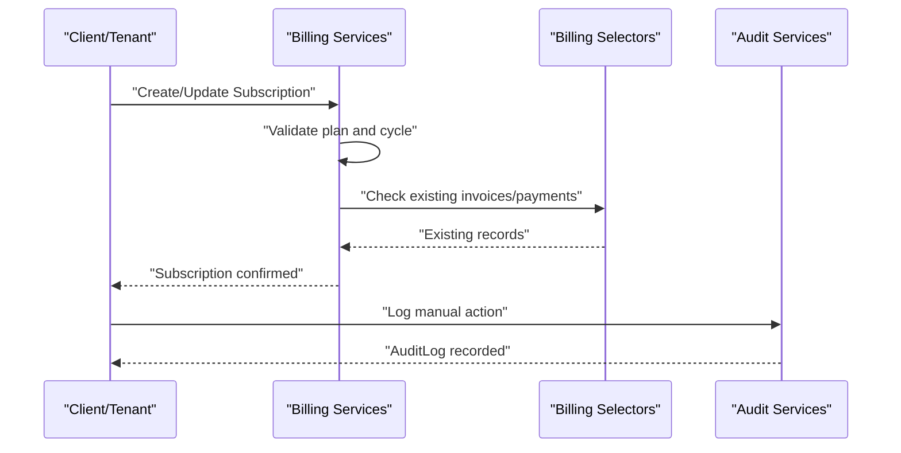
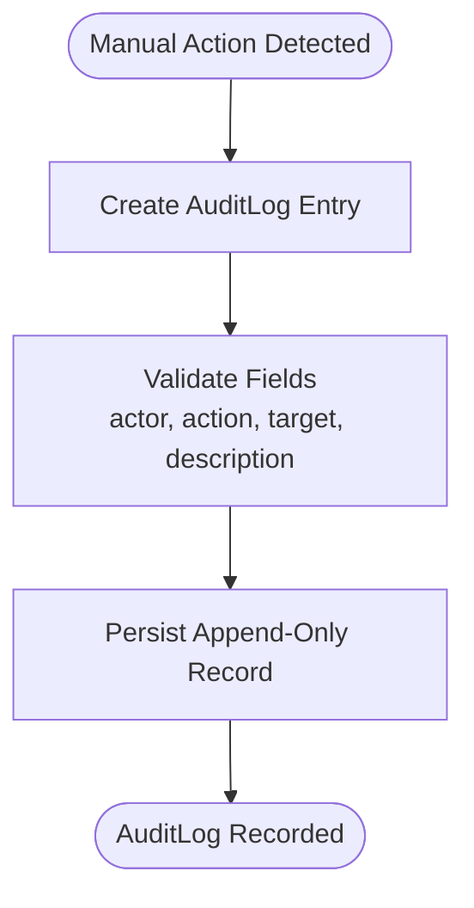
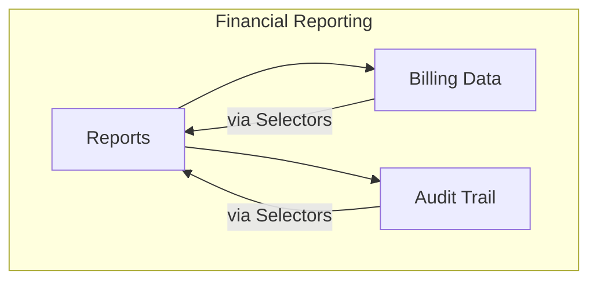
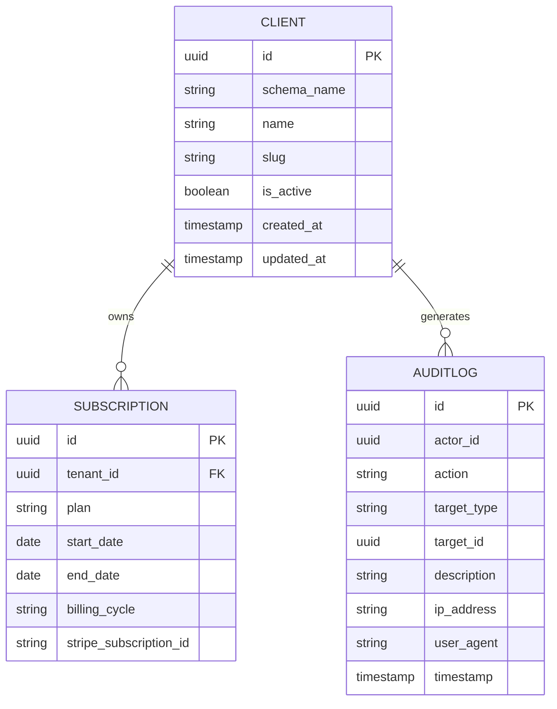
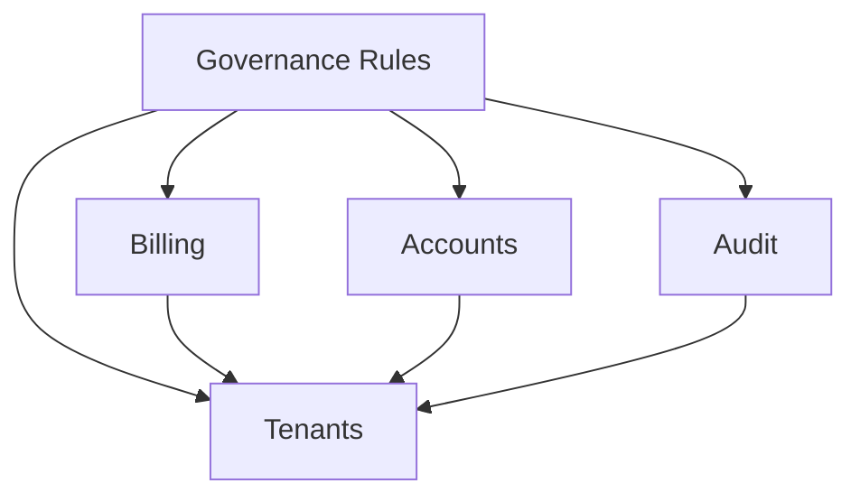

# Business Operations Models

<cite>
**Referenced Files in This Document**
- [billing/models.py](file://backend/apps/billing/models.py)
- [billing/services.py](file://backend/apps/billing/services.py)
- [billing/selectors.py](file://backend/apps/billing/selectors.py)
- [accounts/models.py](file://backend/apps/accounts/models.py)
- [accounts/services.py](file://backend/apps/accounts/services.py)
- [accounts/selectors.py](file://backend/apps/accounts/selectors.py)
- [audit/models.py](file://backend/apps/audit/models.py)
- [audit/services.py](file://backend/apps/audit/services.py)
- [audit/selectors.py](file://backend/apps/audit/selectors.py)
- [tenants/models.py](file://backend/apps/tenants/models.py)
- [AUDIT_CHECKLIST.md](file://backend/docs/governance/AUDIT_CHECKLIST.md)
- [RULES.md](file://backend/docs/governance/RULES.md)
</cite>

## Table of Contents
1. [Introduction](#introduction)
2. [Project Structure](#project-structure)
3. [Core Components](#core-components)
4. [Architecture Overview](#architecture-overview)
5. [Detailed Component Analysis](#detailed-component-analysis)
6. [Dependency Analysis](#dependency-analysis)
7. [Performance Considerations](#performance-considerations)
8. [Troubleshooting Guide](#troubleshooting-guide)
9. [Conclusion](#conclusion)
10. [Appendices](#appendices)

## Introduction
This document describes the business operations models and workflows for Subscription, Invoice, Payment, and AuditLog entities within the Flower platform. It explains billing cycle relationships, payment processing workflows, subscription management models, audit trail generation, compliance logging, and activity tracking. It also documents invoice generation, payment reconciliation, financial reporting connections, entity relationships, subscription tiers, usage-based billing, compliance reporting, financial data integrity, audit log retention, and regulatory compliance model relationships.

## Project Structure
The business operations are organized into bounded contexts:
- Billing: subscriptions, invoices, payments, and usage metering
- Accounts: users, roles, permissions, and authentication within a tenant
- Audit: append-only audit logs for manual actions
- Tenants: multi-tenant isolation via separate schemas

**Diagram sources**
- [billing/models.py:1-26](file://backend/apps/billing/models.py#L1-L26)
- [accounts/models.py:1-30](file://backend/apps/accounts/models.py#L1-L30)
- [audit/models.py:1-31](file://backend/apps/audit/models.py#L1-L31)
- [tenants/models.py:1-77](file://backend/apps/tenants/models.py#L1-L77)

**Section sources**
- [billing/models.py:1-26](file://backend/apps/billing/models.py#L1-L26)
- [accounts/models.py:1-30](file://backend/apps/accounts/models.py#L1-L30)
- [audit/models.py:1-31](file://backend/apps/audit/models.py#L1-L31)
- [tenants/models.py:1-77](file://backend/apps/tenants/models.py#L1-L77)

## Core Components
This section outlines the core entities and their responsibilities, focusing on placeholders and planned fields that define billing and audit workflows.

- Subscription
  - Purpose: Represents a tenant’s subscription plan and lifecycle.
  - Planned fields: plan type, start/end dates, limits (devices/planters), billing cycle, external identifiers.
  - Ownership: Tenant-scoped via multi-tenancy.

- AuditLog
  - Purpose: Append-only record of manual user actions for compliance and auditing.
  - Planned fields: actor, action type, target model and ID, description, IP address, user agent, timestamp.
  - Immutable policy: No updates or deletions.

- UserProfile (Accounts)
  - Purpose: Tenant-scoped user profile placeholder for roles, contact info, and preferences.
  - Ownership: Tenant-scoped via multi-tenancy.

- Client/Tenant (Tenants)
  - Purpose: Multi-tenant isolation using separate schemas per client.
  - Includes primary domain mapping and activation controls.

**Section sources**
- [billing/models.py:11-26](file://backend/apps/billing/models.py#L11-L26)
- [audit/models.py:14-31](file://backend/apps/audit/models.py#L14-L31)
- [accounts/models.py:15-30](file://backend/apps/accounts/models.py#L15-L30)
- [tenants/models.py:6-53](file://backend/apps/tenants/models.py#L6-L53)

## Architecture Overview
The system enforces strict governance for data integrity and compliance:
- All writes must go through services.py
- All reads must go through selectors.py
- Audit logs are append-only
- Tenant isolation is enforced via middleware and schema routing

**Diagram sources**
- [RULES.md:12-24](file://backend/docs/governance/RULES.md#L12-L24)
- [AUDIT_CHECKLIST.md:15-19](file://backend/docs/governance/AUDIT_CHECKLIST.md#L15-L19)

**Section sources**
- [RULES.md:1-70](file://backend/docs/governance/RULES.md#L1-L70)
- [AUDIT_CHECKLIST.md:1-66](file://backend/docs/governance/AUDIT_CHECKLIST.md#L1-L66)

## Detailed Component Analysis

### Subscription Entity and Billing Cycle Relationships
Subscription lifecycle and billing cycles are central to tenant operations. The Subscription model is designed as a tenant-scoped entity with future fields supporting plan definitions, billing periods, and external identifiers.

**Diagram sources**
- [billing/models.py:11-26](file://backend/apps/billing/models.py#L11-L26)
- [tenants/models.py:6-53](file://backend/apps/tenants/models.py#L6-L53)

**Section sources**
- [billing/models.py:11-26](file://backend/apps/billing/models.py#L11-L26)
- [tenants/models.py:6-53](file://backend/apps/tenants/models.py#L6-L53)

### AuditLog Entity and Compliance Logging
AuditLog captures manual actions for compliance and forensic readiness. The append-only policy ensures immutability and long-term auditability.

**Diagram sources**
- [audit/models.py:14-31](file://backend/apps/audit/models.py#L14-L31)

**Section sources**
- [audit/models.py:14-31](file://backend/apps/audit/models.py#L14-L31)
- [AUDIT_CHECKLIST.md](file://backend/docs/governance/AUDIT_CHECKLIST.md#L19)

### Accounts and User Profiles
UserProfile is a tenant-scoped model placeholder for roles, preferences, and metadata. It supports tenant isolation and future integration with Subscription and AuditLog.

**Diagram sources**
- [accounts/models.py:15-30](file://backend/apps/accounts/models.py#L15-L30)
- [tenants/models.py:6-53](file://backend/apps/tenants/models.py#L6-L53)

**Section sources**
- [accounts/models.py:15-30](file://backend/apps/accounts/models.py#L15-L30)
- [tenants/models.py:6-53](file://backend/apps/tenants/models.py#L6-L53)

### Billing Workflow: Subscription, Invoices, Payments
This workflow shows how subscriptions relate to invoices and payments, and how services and selectors enforce data integrity.

**Diagram sources**
- [billing/services.py:1-7](file://backend/apps/billing/services.py#L1-L7)
- [billing/selectors.py:1-7](file://backend/apps/billing/selectors.py#L1-L7)
- [audit/services.py:1-7](file://backend/apps/audit/services.py#L1-L7)

**Section sources**
- [billing/services.py:1-7](file://backend/apps/billing/services.py#L1-L7)
- [billing/selectors.py:1-7](file://backend/apps/billing/selectors.py#L1-L7)
- [audit/services.py:1-7](file://backend/apps/audit/services.py#L1-L7)

### Audit Trail Generation and Compliance Logging
Manual actions must be logged into AuditLog. The append-only policy ensures compliance and auditability.

**Diagram sources**
- [audit/models.py:14-31](file://backend/apps/audit/models.py#L14-L31)
- [AUDIT_CHECKLIST.md](file://backend/docs/governance/AUDIT_CHECKLIST.md#L19)

**Section sources**
- [audit/models.py:14-31](file://backend/apps/audit/models.py#L14-L31)
- [AUDIT_CHECKLIST.md](file://backend/docs/governance/AUDIT_CHECKLIST.md#L19)

### Financial Reporting and Reconciliation Connections
Financial reporting relies on immutable audit trails and controlled access to billing data. Services and selectors centralize mutation and query logic to support accurate reporting.

**Diagram sources**
- [billing/selectors.py:1-7](file://backend/apps/billing/selectors.py#L1-L7)
- [audit/selectors.py:1-7](file://backend/apps/audit/selectors.py#L1-L7)

**Section sources**
- [billing/selectors.py:1-7](file://backend/apps/billing/selectors.py#L1-L7)
- [audit/selectors.py:1-7](file://backend/apps/audit/selectors.py#L1-L7)

### Entity Relationship Diagrams
This ER view consolidates key entities and their relationships across contexts.

**Diagram sources**
- [tenants/models.py:6-53](file://backend/apps/tenants/models.py#L6-L53)
- [billing/models.py:11-26](file://backend/apps/billing/models.py#L11-L26)
- [audit/models.py:14-31](file://backend/apps/audit/models.py#L14-L31)

**Section sources**
- [tenants/models.py:6-53](file://backend/apps/tenants/models.py#L6-L53)
- [billing/models.py:11-26](file://backend/apps/billing/models.py#L11-L26)
- [audit/models.py:14-31](file://backend/apps/audit/models.py#L14-L31)

## Dependency Analysis
The bounded contexts depend on governance rules to maintain data integrity and compliance.

**Diagram sources**
- [RULES.md:1-70](file://backend/docs/governance/RULES.md#L1-L70)
- [AUDIT_CHECKLIST.md:1-66](file://backend/docs/governance/AUDIT_CHECKLIST.md#L1-L66)

**Section sources**
- [RULES.md:1-70](file://backend/docs/governance/RULES.md#L1-L70)
- [AUDIT_CHECKLIST.md:1-66](file://backend/docs/governance/AUDIT_CHECKLIST.md#L1-L66)

## Performance Considerations
- Centralized reads/writes: Services and selectors reduce duplication and improve testability.
- Append-only logs: Minimizes write contention and simplifies backup/recovery.
- Tenant isolation: Schema-per-tenant reduces cross-tenant joins and improves query locality.

## Troubleshooting Guide
Common issues and resolutions grounded in governance rules:
- Unexpected cross-tenant data: Verify tenant middleware and schema routing are active and enforced.
- Unauthorized mutations: Ensure all writes occur via services.py and are reviewed in code.
- Missing audit entries: Confirm manual actions trigger AuditLog creation and that logs are append-only.
- Compliance gaps: Use the audit checklist to validate tenant isolation, data integrity, and security configurations.

**Section sources**
- [AUDIT_CHECKLIST.md:1-66](file://backend/docs/governance/AUDIT_CHECKLIST.md#L1-L66)
- [RULES.md:1-70](file://backend/docs/governance/RULES.md#L1-L70)

## Conclusion
The business operations models establish a robust foundation for subscriptions, invoices, payments, and audit trails. Governance rules ensure data integrity, compliance, and tenant isolation. As models evolve, maintain the append-only policy for audit logs, enforce service/selector boundaries, and preserve tenant scoping to support reliable financial reporting and regulatory compliance.

## Appendices
- Regulatory compliance model relationships: Align Subscription and AuditLog fields with compliance requirements (e.g., immutable records, actor identification, timestamps).
- Audit log retention policies: Define retention periods and archival procedures aligned with legal and compliance needs.
- Subscription tiers and usage-based billing: Plan fields for plan types, limits, and usage metrics to enable tiered billing and reporting.