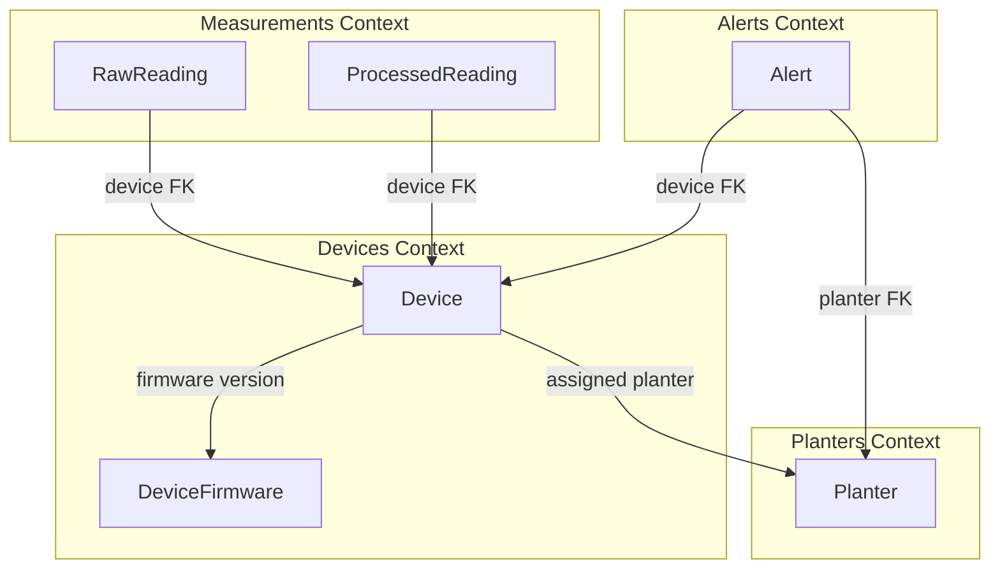
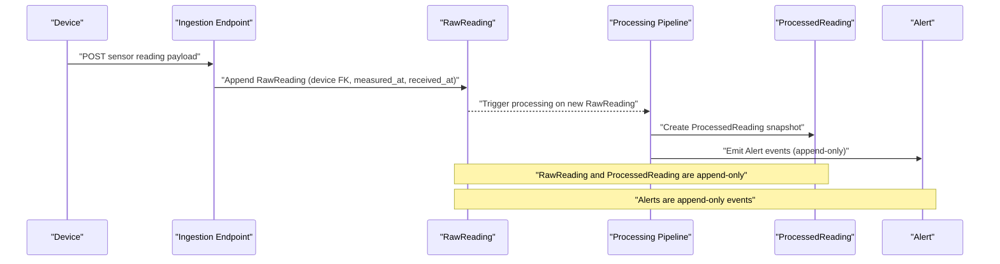
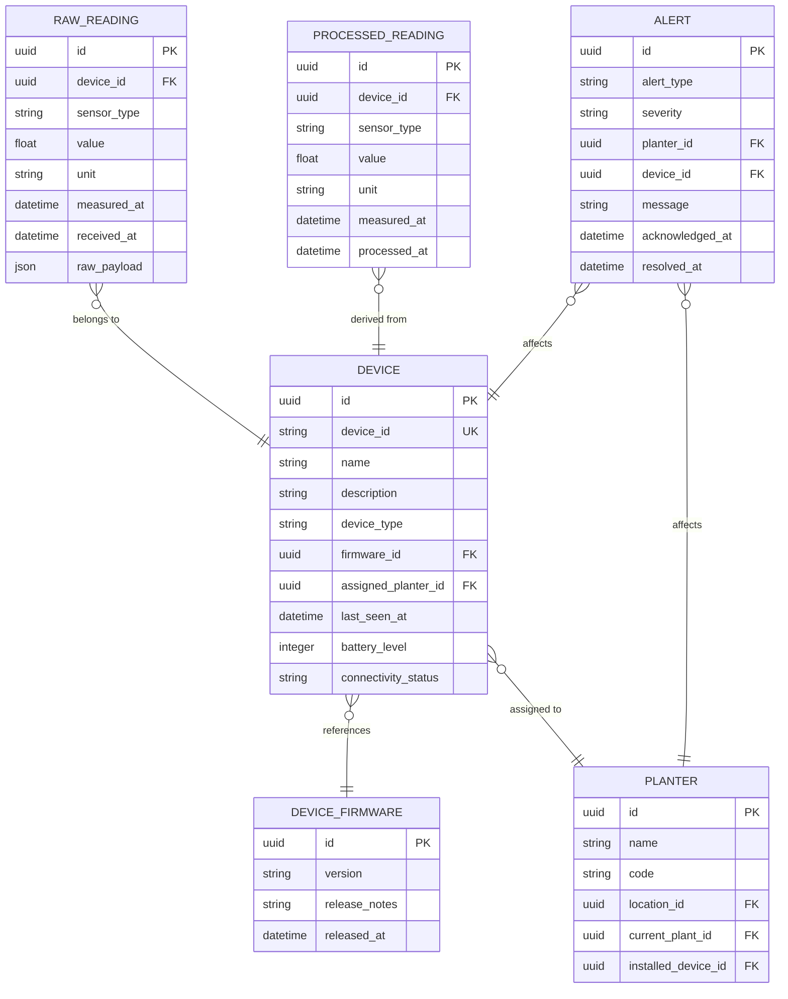
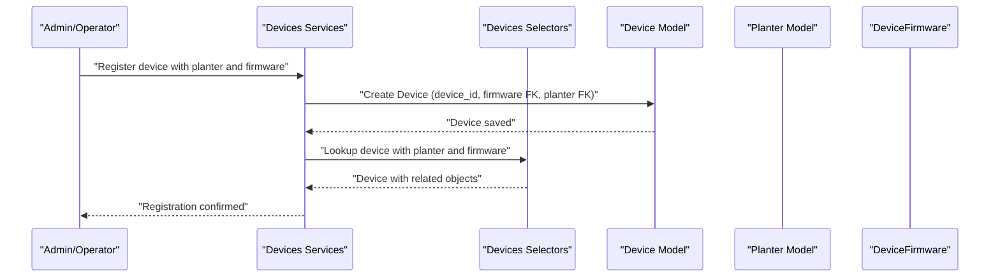
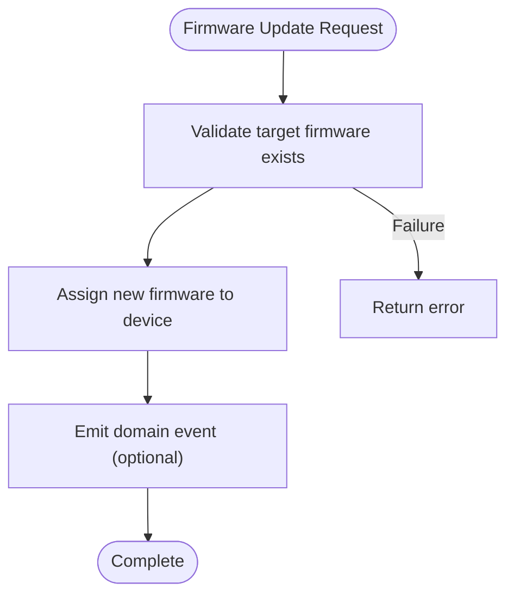
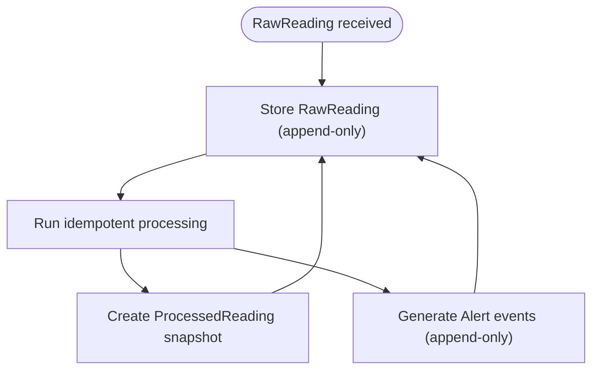
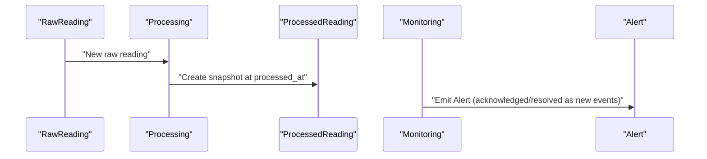
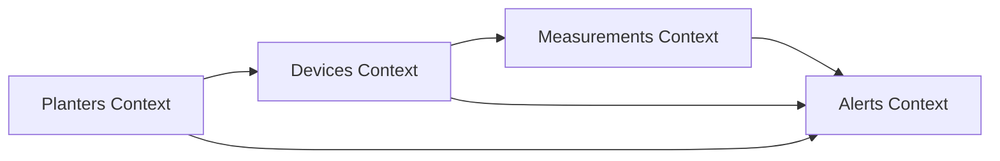

# Device and Sensor Models

<cite>
**Referenced Files in This Document**
- [devices/models.py](file://backend/apps/devices/models.py)
- [measurements/models.py](file://backend/apps/measurements/models.py)
- [alerts/models.py](file://backend/apps/alerts/models.py)
- [planters/models.py](file://backend/apps/planters/models.py)
- [devices/services.py](file://backend/apps/devices/services.py)
- [devices/selectors.py](file://backend/apps/devices/selectors.py)
- [measurements/services.py](file://backend/apps/measurements/services.py)
- [measurements/selectors.py](file://backend/apps/measurements/selectors.py)
- [alerts/services.py](file://backend/apps/alerts/services.py)
- [alerts/selectors.py](file://backend/apps/alerts/selectors.py)
- [devices/events.py](file://backend/apps/devices/events.py)
- [measurements/events.py](file://backend/apps/measurements/events.py)
- [IOT_INGEST.md](file://backend/docs/architecture/IOT_INGEST.md)
</cite>

## Table of Contents
1. [Introduction](#introduction)
2. [Project Structure](#project-structure)
3. [Core Components](#core-components)
4. [Architecture Overview](#architecture-overview)
5. [Detailed Component Analysis](#detailed-component-analysis)
6. [Dependency Analysis](#dependency-analysis)
7. [Performance Considerations](#performance-considerations)
8. [Troubleshooting Guide](#troubleshooting-guide)
9. [Conclusion](#conclusion)
10. [Appendices](#appendices)

## Introduction
This document describes the entity relationship model for device registry and sensor data, focusing on Device, DeviceFirmware, and sensor reading entities and their relationships to measurement processing. It explains device registration workflows, firmware versioning, and connectivity status tracking. It also documents RawReading, ProcessedReading, and Alert entities with their temporal relationships, and outlines sensor calibration models, data validation rules, and quality assurance relationships. Finally, it covers device lifecycle management, firmware update mechanisms, and sensor data integrity validation.

## Project Structure
The relevant models and supporting layers are organized by bounded contexts:
- Devices: device registry, firmware, and connectivity
- Measurements: raw and processed sensor readings
- Alerts: alert definitions and alert instances
- Planters: planting containers and device assignment

**Diagram sources**
- [devices/models.py:12-28](file://backend/apps/devices/models.py#L12-L28)
- [planters/models.py:12-26](file://backend/apps/planters/models.py#L12-L26)
- [measurements/models.py:14-29](file://backend/apps/measurements/models.py#L14-L29)
- [alerts/models.py:13-28](file://backend/apps/alerts/models.py#L13-L28)

**Section sources**
- [devices/models.py:1-29](file://backend/apps/devices/models.py#L1-L29)
- [measurements/models.py:1-30](file://backend/apps/measurements/models.py#L1-L30)
- [alerts/models.py:1-29](file://backend/apps/alerts/models.py#L1-L29)
- [planters/models.py:1-27](file://backend/apps/planters/models.py#L1-L27)

## Core Components
This section defines the primary entities and their intended relationships, based on placeholder comments and architectural guidance.

- Device
  - Purpose: Registry for IoT devices (e.g., ESP32) and associated metadata
  - Intended relationships:
    - Assigned planter (FK to Planter)
    - Firmware version (FK to DeviceFirmware)
    - Connectivity status tracking
  - Registration workflow: Device registration ties a device to a planter and assigns firmware; connectivity status is updated via ingestion events

- DeviceFirmware
  - Purpose: Firmware catalog/versioning for devices
  - Intended relationships:
    - Many devices can reference a firmware version
    - Firmware updates change the device’s firmware FK

- RawReading
  - Purpose: Append-only capture of raw sensor data from devices
  - Intended relationships:
    - FK to Device
    - Temporal markers: measured_at (device time), received_at (server time)
    - JSON payload for raw data

- ProcessedReading
  - Purpose: Snapshot of processed sensor data derived from RawReading
  - Intended relationships:
    - FK to Device
    - Derived from RawReading via deterministic processing pipeline
    - Used for analytics and alerting

- Alert
  - Purpose: Append-only record of alert events
  - Intended relationships:
    - FK to Device and Planter
    - Alert type and severity
    - Acknowledgement and resolution timestamps

- Planter
  - Purpose: Container/planter definition and device assignment
  - Intended relationships:
    - Installed device (FK to Device)
    - Location and inventory metadata

**Section sources**
- [devices/models.py:12-28](file://backend/apps/devices/models.py#L12-L28)
- [measurements/models.py:14-29](file://backend/apps/measurements/models.py#L14-L29)
- [alerts/models.py:13-28](file://backend/apps/alerts/models.py#L13-L28)
- [planters/models.py:12-26](file://backend/apps/planters/models.py#L12-L26)
- [IOT_INGEST.md:72-88](file://backend/docs/architecture/IOT_INGEST.md#L72-L88)

## Architecture Overview
The system follows a strict append-only principle for raw and alert data, with deterministic processing and idempotent reprocessing. Devices submit RawReading entries; background processing produces ProcessedReading snapshots; alerts are generated as append-only events.

**Diagram sources**
- [IOT_INGEST.md:72-88](file://backend/docs/architecture/IOT_INGEST.md#L72-L88)
- [devices/models.py:12-28](file://backend/apps/devices/models.py#L12-L28)
- [measurements/models.py:14-29](file://backend/apps/measurements/models.py#L14-L29)
- [alerts/models.py:13-28](file://backend/apps/alerts/models.py#L13-L28)

## Detailed Component Analysis

### Entity Relationship Model
The following ER diagram captures the core relationships among Device, DeviceFirmware, RawReading, ProcessedReading, Alert, and Planter.

**Diagram sources**
- [devices/models.py:12-28](file://backend/apps/devices/models.py#L12-L28)
- [planters/models.py:12-26](file://backend/apps/planters/models.py#L12-L26)
- [measurements/models.py:14-29](file://backend/apps/measurements/models.py#L14-L29)
- [alerts/models.py:13-28](file://backend/apps/alerts/models.py#L13-L28)

### Device Registration Workflow
- Registration ties a Device to a Planter and assigns a DeviceFirmware version
- Connectivity status is updated via ingestion events
- Services and selectors enforce read/write boundaries

**Diagram sources**
- [devices/services.py:1-7](file://backend/apps/devices/services.py#L1-L7)
- [devices/selectors.py:1-7](file://backend/apps/devices/selectors.py#L1-L7)
- [devices/models.py:12-28](file://backend/apps/devices/models.py#L12-L28)
- [planters/models.py:12-26](file://backend/apps/planters/models.py#L12-L26)

**Section sources**
- [devices/services.py:1-7](file://backend/apps/devices/services.py#L1-L7)
- [devices/selectors.py:1-7](file://backend/apps/devices/selectors.py#L1-L7)
- [devices/models.py:12-28](file://backend/apps/devices/models.py#L12-L28)
- [planters/models.py:12-26](file://backend/apps/planters/models.py#L12-L26)

### Firmware Versioning and Updates
- Device references DeviceFirmware via a foreign key
- Firmware updates change the Device.firmware FK
- Events can signal firmware-related changes

**Diagram sources**
- [devices/models.py:12-28](file://backend/apps/devices/models.py#L12-L28)
- [devices/events.py:1-7](file://backend/apps/devices/events.py#L1-L7)

**Section sources**
- [devices/models.py:12-28](file://backend/apps/devices/models.py#L12-L28)
- [devices/events.py:1-7](file://backend/apps/devices/events.py#L1-L7)

### Sensor Data Integrity and Validation
- Raw readings are append-only; no updates or deletions
- Processing must be idempotent; reprocessing does not create duplicates
- Alerts are append-only events; resolution is a new event

**Diagram sources**
- [IOT_INGEST.md:72-88](file://backend/docs/architecture/IOT_INGEST.md#L72-L88)
- [measurements/models.py:14-29](file://backend/apps/measurements/models.py#L14-L29)
- [alerts/models.py:13-28](file://backend/apps/alerts/models.py#L13-L28)

**Section sources**
- [IOT_INGEST.md:72-88](file://backend/docs/architecture/IOT_INGEST.md#L72-L88)
- [measurements/models.py:14-29](file://backend/apps/measurements/models.py#L14-L29)
- [alerts/models.py:13-28](file://backend/apps/alerts/models.py#L13-L28)

### Temporal Relationships and Alert Generation
- RawReading: measured_at (device time), received_at (server time)
- ProcessedReading: measured_at aligned with RawReading, processed_at (server time)
- Alert: triggered by threshold checks; acknowledgment and resolution recorded as new events

**Diagram sources**
- [measurements/models.py:14-29](file://backend/apps/measurements/models.py#L14-L29)
- [alerts/models.py:13-28](file://backend/apps/alerts/models.py#L13-L28)

**Section sources**
- [measurements/models.py:14-29](file://backend/apps/measurements/models.py#L14-L29)
- [alerts/models.py:13-28](file://backend/apps/alerts/models.py#L13-L28)

### Sensor Calibration and Quality Assurance
- Calibration models are not present in the current codebase; placeholders indicate future fields for sensor_type and units
- Quality assurance relies on:
  - Append-only ingestion and processing
  - Idempotent processing
  - Deterministic alert generation
  - Timestamp alignment between measured_at and processed_at

[No sources needed since this section provides general guidance]

## Dependency Analysis
The bounded contexts maintain clear separation of concerns:
- Devices: Device and DeviceFirmware
- Measurements: RawReading and ProcessedReading
- Alerts: Alert
- Planters: Planter

**Diagram sources**
- [devices/models.py:12-28](file://backend/apps/devices/models.py#L12-L28)
- [planters/models.py:12-26](file://backend/apps/planters/models.py#L12-L26)
- [measurements/models.py:14-29](file://backend/apps/measurements/models.py#L14-L29)
- [alerts/models.py:13-28](file://backend/apps/alerts/models.py#L13-L28)

**Section sources**
- [devices/models.py:12-28](file://backend/apps/devices/models.py#L12-L28)
- [planters/models.py:12-26](file://backend/apps/planters/models.py#L12-L26)
- [measurements/models.py:14-29](file://backend/apps/measurements/models.py#L14-L29)
- [alerts/models.py:13-28](file://backend/apps/alerts/models.py#L13-L28)

## Performance Considerations
- Append-only design simplifies concurrency and reduces write contention
- Idempotent processing avoids duplicate work and supports safe retries
- Timestamp alignment enables efficient time-series queries and windowed aggregations
- Event-driven alerting decouples generation from downstream consumers

[No sources needed since this section provides general guidance]

## Troubleshooting Guide
- If a device appears offline, check last_seen_at and connectivity_status in Device
- If sensor values seem incorrect, inspect RawReading.raw_payload and ProcessedReading for anomalies
- If alerts are missing, verify alert generation logic and confirm append-only event creation
- If firmware mismatches occur, ensure Device.firmware FK references a valid DeviceFirmware record

**Section sources**
- [devices/models.py:12-28](file://backend/apps/devices/models.py#L12-L28)
- [measurements/models.py:14-29](file://backend/apps/measurements/models.py#L14-L29)
- [alerts/models.py:13-28](file://backend/apps/alerts/models.py#L13-L28)

## Conclusion
The device and sensor model enforces integrity through append-only ingestion, idempotent processing, and deterministic alerting. Device registration, firmware versioning, and connectivity tracking are cleanly separated into the Devices context, while sensor data and alerts are managed by Measurements and Alerts contexts respectively. This design supports reliable device lifecycle management, robust firmware updates, and strong data integrity guarantees.

## Appendices
- Layered architecture pattern:
  - Services: enforce write boundaries
  - Selectors: centralize read logic
  - Events: represent domain facts without side effects

**Section sources**
- [devices/services.py:1-7](file://backend/apps/devices/services.py#L1-L7)
- [devices/selectors.py:1-7](file://backend/apps/devices/selectors.py#L1-L7)
- [devices/events.py:1-7](file://backend/apps/devices/events.py#L1-L7)
- [measurements/services.py:1-9](file://backend/apps/measurements/services.py#L1-L9)
- [measurements/selectors.py:1-7](file://backend/apps/measurements/selectors.py#L1-L7)
- [measurements/events.py:1-7](file://backend/apps/measurements/events.py#L1-L7)
- [alerts/services.py:1-9](file://backend/apps/alerts/services.py#L1-L9)
- [alerts/selectors.py:1-7](file://backend/apps/alerts/selectors.py#L1-L7)