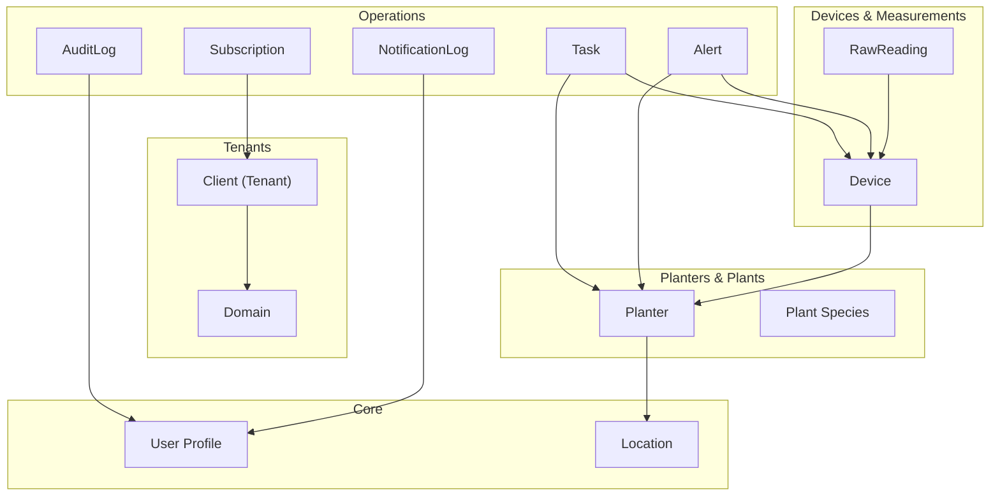
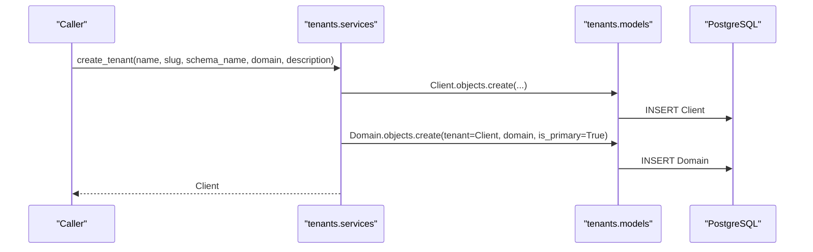
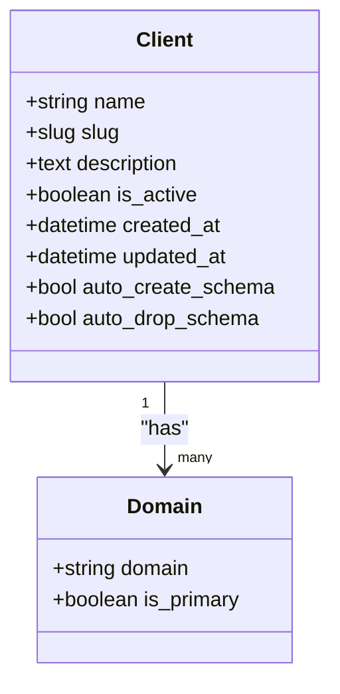
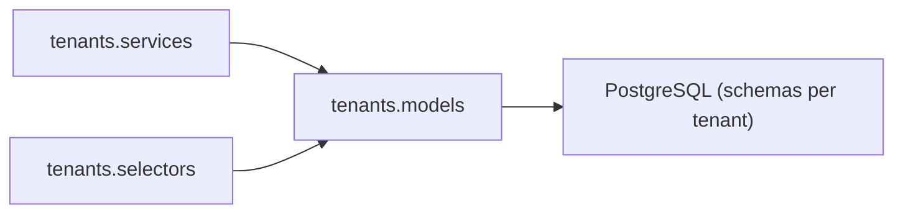
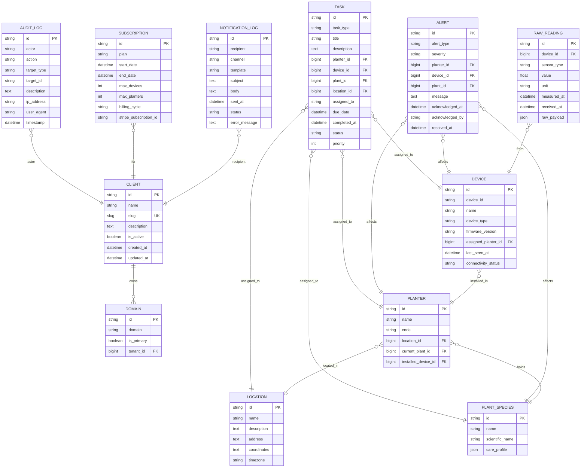

# Entity Relationship Models

<cite>
**Referenced Files in This Document**
- [models.py](file://backend/apps/tenants/models.py)
- [models.py](file://backend/apps/accounts/models.py)
- [models.py](file://backend/apps/planters/models.py)
- [models.py](file://backend/apps/plants/models.py)
- [models.py](file://backend/apps/devices/models.py)
- [models.py](file://backend/apps/measurements/models.py)
- [models.py](file://backend/apps/alerts/models.py)
- [models.py](file://backend/apps/tasks/models.py)
- [models.py](file://backend/apps/notifications/models.py)
- [models.py](file://backend/apps/billing/models.py)
- [models.py](file://backend/apps/locations/models.py)
- [models.py](file://backend/apps/audit/models.py)
- [selectors.py](file://backend/apps/tenants/selectors.py)
- [services.py](file://backend/apps/tenants/services.py)
</cite>

## Table of Contents
1. [Introduction](#introduction)
2. [Project Structure](#project-structure)
3. [Core Components](#core-components)
4. [Architecture Overview](#architecture-overview)
5. [Detailed Component Analysis](#detailed-component-analysis)
6. [Dependency Analysis](#dependency-analysis)
7. [Performance Considerations](#performance-considerations)
8. [Troubleshooting Guide](#troubleshooting-guide)
9. [Conclusion](#conclusion)
10. [Appendices](#appendices)

## Introduction
This document defines the entity relationship models across the 12 bounded contexts of the Flower project. It focuses on the major domain entities Tenant, User, Location, Planter, Plant, Device, RawReading, Alert, Task, Notification, Subscription, and AuditLog. For each entity, we describe fields, data types, constraints, and validation rules as indicated by the model comments and metadata. We also explain foreign key relationships, many-to-many associations, inheritance patterns, business rules embedded in model relationships, cascading behaviors, referential integrity enforcement, and considerations for model versioning and migrations.

## Project Structure
The project follows a bounded-context architecture with per-context Django apps. Each app encapsulates models, selectors (read), services (write), events, admin, and tests. The tenants app defines multi-tenancy with a dedicated Client and Domain model. Other apps define placeholders for domain entities with explicit future field lists indicating relationships and constraints.

**Diagram sources**
- [models.py:6-77](file://backend/apps/tenants/models.py#L6-L77)
- [models.py:15-30](file://backend/apps/accounts/models.py#L15-L30)
- [models.py:12-27](file://backend/apps/planters/models.py#L12-L27)
- [models.py:12-26](file://backend/apps/plants/models.py#L12-L26)
- [models.py:12-29](file://backend/apps/devices/models.py#L12-L29)
- [models.py:14-30](file://backend/apps/measurements/models.py#L14-L30)
- [models.py:13-29](file://backend/apps/alerts/models.py#L13-L29)
- [models.py:12-29](file://backend/apps/tasks/models.py#L12-L29)
- [models.py:12-28](file://backend/apps/notifications/models.py#L12-L28)
- [models.py:11-26](file://backend/apps/billing/models.py#L11-L26)
- [models.py:12-26](file://backend/apps/locations/models.py#L12-L26)
- [models.py:14-31](file://backend/apps/audit/models.py#L14-L31)

**Section sources**
- [models.py:6-77](file://backend/apps/tenants/models.py#L6-L77)
- [models.py:12-27](file://backend/apps/planters/models.py#L12-L27)
- [models.py:12-29](file://backend/apps/devices/models.py#L12-L29)
- [models.py:14-30](file://backend/apps/measurements/models.py#L14-L30)
- [models.py:13-29](file://backend/apps/alerts/models.py#L13-L29)
- [models.py:12-29](file://backend/apps/tasks/models.py#L12-L29)
- [models.py:12-28](file://backend/apps/notifications/models.py#L12-L28)
- [models.py:11-26](file://backend/apps/billing/models.py#L11-L26)
- [models.py:12-26](file://backend/apps/locations/models.py#L12-L26)
- [models.py:14-31](file://backend/apps/audit/models.py#L14-L31)
- [models.py:15-30](file://backend/apps/accounts/models.py#L15-L30)

## Core Components
This section documents the primary entities and their intended attributes, constraints, and relationships as described in the model comments and metadata.

- Tenant (Client)
  - Purpose: Represents a single customer with an isolated PostgreSQL schema.
  - Fields and constraints:
    - name: char, required
    - slug: slug, unique
    - description: text, optional
    - is_active: boolean, default true
    - created_at, updated_at: datetime, auto-managed
  - Business rules:
    - Schema isolation via django-tenants.
    - Append-only nature for RawReading and AuditLog enforced in other contexts.
  - Relationships:
    - One-to-many with Domain (primary domain per tenant).

- Domain
  - Purpose: Maps hostnames to tenants.
  - Fields and constraints:
    - domain: string, hostname
    - is_primary: boolean, default true
  - Relationships:
    - Many-to-one with Client.

- User Profile
  - Purpose: Placeholder for tenant-scoped user profile with roles and preferences.
  - Notes: Intended to link to the tenant’s user identity.

- Location
  - Purpose: Physical site or area where planters are installed.
  - Fields and constraints (future):
    - name, description
    - address, coordinates
    - timezone
    - photos

- Planter
  - Purpose: Container/pot holding a plant and potentially hosting a device.
  - Fields and constraints (future):
    - location (FK to Location)
    - current plant (FK to Plant)
    - installed device (FK to Device)
    - dimensions, material

- Plant Species
  - Purpose: Taxonomic classification and care profile.
  - Fields and constraints (future):
    - name (translatable)
    - scientific_name
    - care_profile (ranges)
    - photos

- Device
  - Purpose: IoT device (e.g., ESP32) with firmware and connectivity.
  - Fields and constraints (future):
    - device_id, name, description
    - device_type
    - firmware_version
    - assigned_planter (FK to Planter)
    - last_seen_at, battery_level
    - connectivity_status

- RawReading
  - Purpose: Append-only record of raw sensor data.
  - Constraints:
    - Append-only policy; never update or delete.
  - Fields and constraints (future):
    - device (FK to Device)
    - sensor_type (soil_moisture, temperature, light, battery)
    - value, unit
    - measured_at, received_at
    - raw_payload (JSON)

- Alert
  - Purpose: Alert instances with thresholds and resolution.
  - Constraints:
    - Append-only policy.
  - Fields and constraints (future):
    - alert_type, severity
    - planter/device/plant (FKs)
    - message
    - acknowledged_by, acknowledged_at
    - resolved_at

- Task
  - Purpose: Work items generated by system or manually.
  - Fields and constraints (future):
    - task_type
    - title, description
    - planter/device/plant/location (FKs)
    - assigned_to (FK to User)
    - due_date, completed_at
    - status, priority

- NotificationLog
  - Purpose: Delivery logs for email, SMS, push, and in-app.
  - Fields and constraints (future):
    - recipient (FK to User)
    - channel
    - template
    - subject, body
    - sent_at, status
    - error_message

- Subscription
  - Purpose: Tenant subscription plan and limits.
  - Fields and constraints (future):
    - plan
    - start_date, end_date
    - max_devices, max_planters
    - billing_cycle
    - stripe_subscription_id

- AuditLog
  - Purpose: Append-only audit trail of manual user actions.
  - Constraints:
    - Append-only policy.
  - Fields and constraints (future):
    - actor (FK to User)
    - action
    - target_type, target_id
    - description
    - ip_address, user_agent
    - timestamp

**Section sources**
- [models.py:6-77](file://backend/apps/tenants/models.py#L6-L77)
- [models.py:15-30](file://backend/apps/accounts/models.py#L15-L30)
- [models.py:12-27](file://backend/apps/planters/models.py#L12-L27)
- [models.py:12-26](file://backend/apps/plants/models.py#L12-L26)
- [models.py:12-29](file://backend/apps/devices/models.py#L12-L29)
- [models.py:14-30](file://backend/apps/measurements/models.py#L14-L30)
- [models.py:13-29](file://backend/apps/alerts/models.py#L13-L29)
- [models.py:12-29](file://backend/apps/tasks/models.py#L12-L29)
- [models.py:12-28](file://backend/apps/notifications/models.py#L12-L28)
- [models.py:11-26](file://backend/apps/billing/models.py#L11-L26)
- [models.py:12-26](file://backend/apps/locations/models.py#L12-L26)
- [models.py:14-31](file://backend/apps/audit/models.py#L14-L31)

## Architecture Overview
The system enforces multi-tenancy at the database level using separate schemas per tenant. All tenant-related creation and updates are mediated by services to ensure consistent provisioning of schema and primary domain. Read operations for tenant data are centralized in selectors.

**Diagram sources**
- [services.py:11-35](file://backend/apps/tenants/services.py#L11-L35)
- [models.py:6-77](file://backend/apps/tenants/models.py#L6-L77)

**Section sources**
- [services.py:11-35](file://backend/apps/tenants/services.py#L11-L35)
- [selectors.py:13-25](file://backend/apps/tenants/selectors.py#L13-L25)
- [models.py:6-77](file://backend/apps/tenants/models.py#L6-L77)

## Detailed Component Analysis

### Tenant and Domain Entities
- Client (Tenant)
  - Inherits from TenantMixin for schema isolation.
  - Enforced constraints: unique slug, boolean is_active, auto timestamps.
  - Behavior: auto_create_schema and auto_drop_schema enabled.
- Domain
  - Inherits from DomainMixin.
  - Enforced constraints: is_primary flag; ordering by domain.
  - Relationship: Many-to-one to Client.

**Diagram sources**
- [models.py:6-77](file://backend/apps/tenants/models.py#L6-L77)

**Section sources**
- [models.py:6-77](file://backend/apps/tenants/models.py#L6-L77)

### User Profile
- Purpose: Placeholder for tenant-scoped user profile with roles and preferences.
- Notes: Intended to link to the tenant’s user identity; abstract flag commented out pending finalization.

**Section sources**
- [models.py:15-30](file://backend/apps/accounts/models.py#L15-L30)

### Location
- Purpose: Physical location definitions.
- Future fields indicate potential relationships with Planters and Tasks.

**Section sources**
- [models.py:12-26](file://backend/apps/locations/models.py#L12-L26)

### Planter
- Purpose: Container/pot with optional plant and device.
- Future fields indicate FKs to Location, Plant, and Device.

**Section sources**
- [models.py:12-27](file://backend/apps/planters/models.py#L12-L27)

### Plant Species
- Purpose: Taxonomic classification and care profile.
- Future fields indicate translatable names and care ranges.

**Section sources**
- [models.py:12-26](file://backend/apps/plants/models.py#L12-L26)

### Device
- Purpose: IoT device with firmware and connectivity.
- Future fields indicate FK to Planter and telemetry fields.

**Section sources**
- [models.py:12-29](file://backend/apps/devices/models.py#L12-L29)

### RawReading
- Constraint: Append-only policy.
- Purpose: Raw sensor data ingestion.
- Future fields indicate FK to Device and JSON payload storage.

**Section sources**
- [models.py:14-30](file://backend/apps/measurements/models.py#L14-L30)

### Alert
- Constraint: Append-only policy.
- Purpose: Threshold-triggered alerts with resolution tracking.
- Future fields indicate FKs to Planter, Device, and Plant.

**Section sources**
- [models.py:13-29](file://backend/apps/alerts/models.py#L13-L29)

### Task
- Purpose: Work items assigned to users.
- Future fields indicate FKs to Planter, Device, Plant, Location, and User.

**Section sources**
- [models.py:12-29](file://backend/apps/tasks/models.py#L12-L29)

### NotificationLog
- Purpose: Delivery logs for multiple channels.
- Future fields indicate FK to User and channel metadata.

**Section sources**
- [models.py:12-28](file://backend/apps/notifications/models.py#L12-L28)

### Subscription
- Purpose: Tenant subscription plan and limits.
- Future fields indicate plan tiers and Stripe integration.

**Section sources**
- [models.py:11-26](file://backend/apps/billing/models.py#L11-L26)

### AuditLog
- Constraint: Append-only policy.
- Purpose: Audit trail of manual user actions.
- Future fields indicate actor FK and event metadata.

**Section sources**
- [models.py:14-31](file://backend/apps/audit/models.py#L14-L31)

## Dependency Analysis
The models are currently placeholders with forward references indicated by comments. Relationships are not yet implemented in the ORM. The tenants app centralizes multi-tenancy provisioning and discovery via services and selectors.

**Diagram sources**
- [services.py:11-35](file://backend/apps/tenants/services.py#L11-L35)
- [selectors.py:13-25](file://backend/apps/tenants/selectors.py#L13-L25)
- [models.py:6-77](file://backend/apps/tenants/models.py#L6-L77)

**Section sources**
- [services.py:11-35](file://backend/apps/tenants/services.py#L11-L35)
- [selectors.py:13-25](file://backend/apps/tenants/selectors.py#L13-L25)
- [models.py:6-77](file://backend/apps/tenants/models.py#L6-L77)

## Performance Considerations
- Multi-tenancy schema isolation reduces cross-tenant contention but requires careful indexing within each tenant schema.
- Append-only policies for RawReading and AuditLog enable efficient write throughput and simplify backup/recovery strategies.
- Centralized read/write layers (selectors/services) improve testability and maintainability.

## Troubleshooting Guide
- Tenant provisioning failures:
  - Ensure unique slug and valid domain during create_tenant.
  - Verify auto schema creation and primary domain assignment.
- Read consistency:
  - Use selectors for tenant queries to enforce centralized read logic.
- Model evolution:
  - Add fields incrementally with defaults where possible.
  - Preserve append-only guarantees for RawReading and AuditLog.

**Section sources**
- [services.py:11-35](file://backend/apps/tenants/services.py#L11-L35)
- [selectors.py:13-25](file://backend/apps/tenants/selectors.py#L13-L25)

## Conclusion
The 12 bounded contexts define a clear set of domain entities with explicit future relationships and constraints. The tenants app establishes multi-tenancy and governance boundaries, while other contexts outline relationships among Location, Planter, Plant, Device, Measurement, Alert, Task, Notification, Billing, and Audit. Append-only policies and centralized read/write layers support reliability and maintainability. As models evolve, adhere to backward compatibility and incremental schema changes.

## Appendices

### Entity Relationship Diagram (ERD)

**Diagram sources**
- [models.py:6-77](file://backend/apps/tenants/models.py#L6-L77)
- [models.py:12-27](file://backend/apps/planters/models.py#L12-L27)
- [models.py:12-26](file://backend/apps/plants/models.py#L12-L26)
- [models.py:12-29](file://backend/apps/devices/models.py#L12-L29)
- [models.py:14-30](file://backend/apps/measurements/models.py#L14-L30)
- [models.py:13-29](file://backend/apps/alerts/models.py#L13-L29)
- [models.py:12-29](file://backend/apps/tasks/models.py#L12-L29)
- [models.py:12-28](file://backend/apps/notifications/models.py#L12-L28)
- [models.py:11-26](file://backend/apps/billing/models.py#L11-L26)
- [models.py:12-26](file://backend/apps/locations/models.py#L12-L26)
- [models.py:14-31](file://backend/apps/audit/models.py#L14-L31)

### Model Versioning and Migration Strategies
- Incremental schema additions: Add new fields with defaults; avoid altering append-only constraints.
- Soft-deletion patterns: Prefer is_active flags for Tenant and soft-deactivation flows.
- Foreign keys: Introduce FKs in later iterations with appropriate indexes.
- Backward compatibility: Keep existing fields unchanged; deprecate via comments and introduce new fields alongside old ones during transitions.
- Migration safety: Use atomic migrations and validate append-only guarantees in tests.