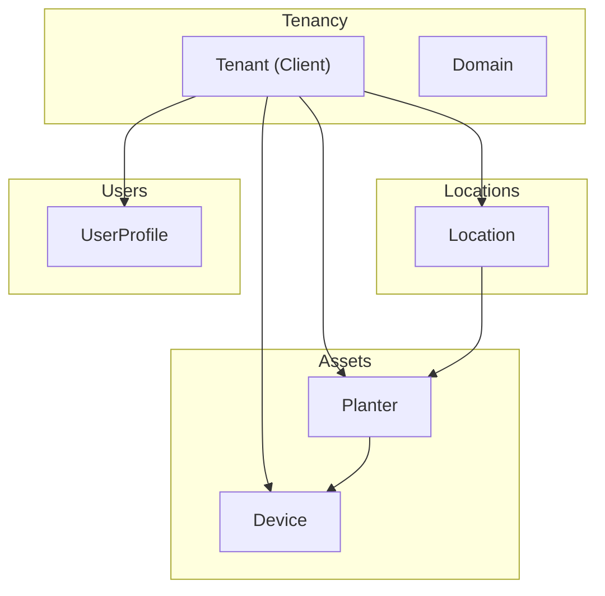
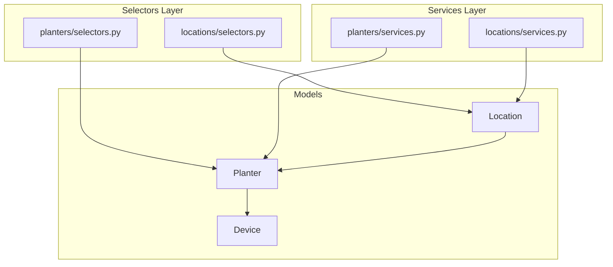
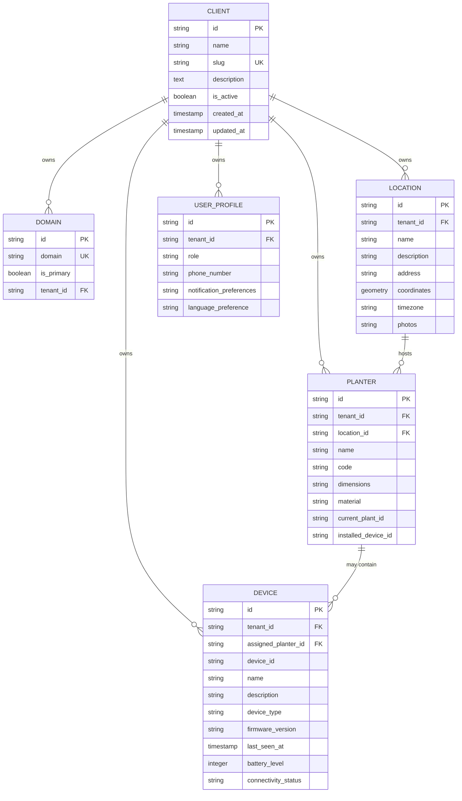
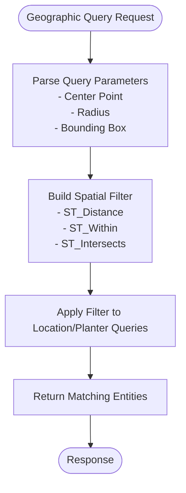
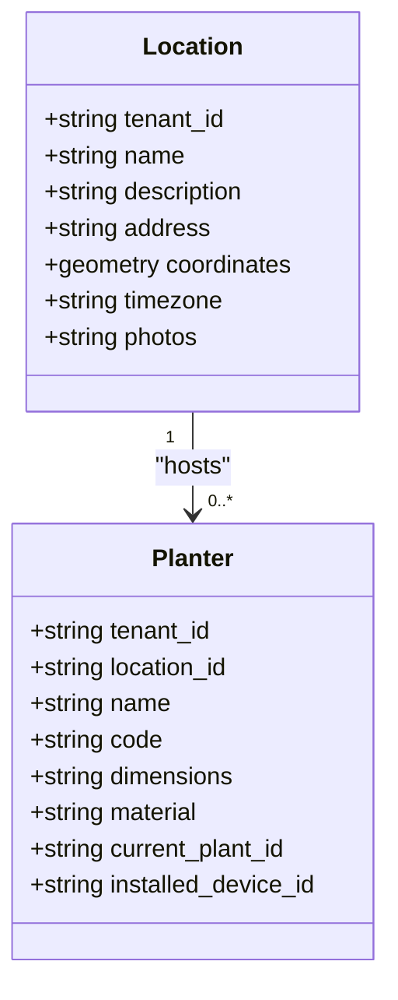
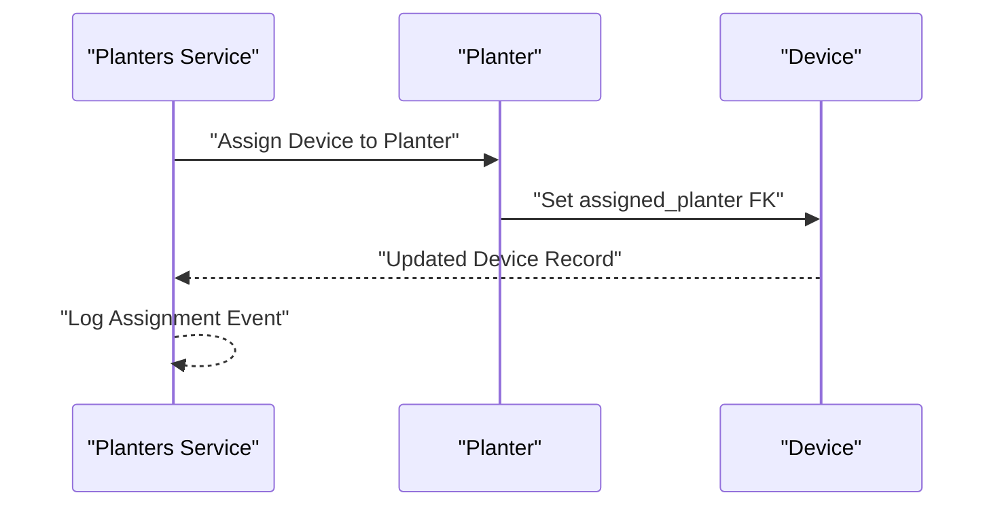
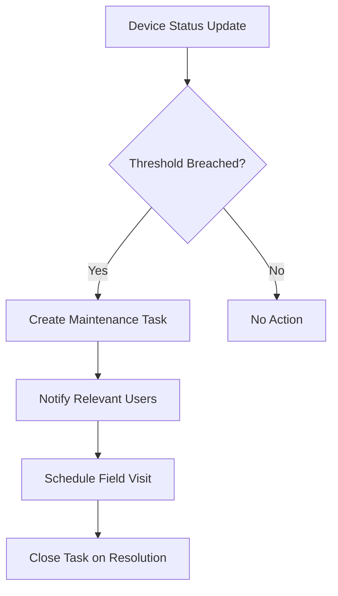
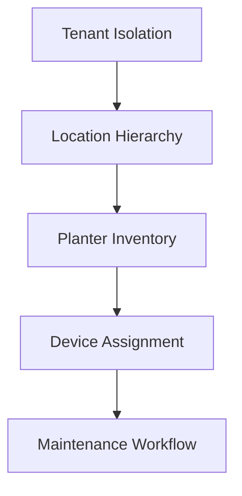
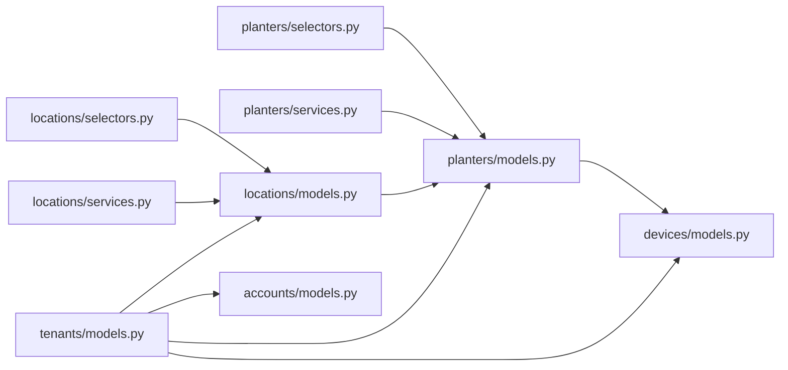

# Location and Asset Models

<cite>
**Referenced Files in This Document**
- [locations/models.py](file://backend/apps/locations/models.py)
- [planters/models.py](file://backend/apps/planters/models.py)
- [devices/models.py](file://backend/apps/devices/models.py)
- [tenants/models.py](file://backend/apps/tenants/models.py)
- [accounts/models.py](file://backend/apps/accounts/models.py)
- [locations/selectors.py](file://backend/apps/locations/selectors.py)
- [locations/services.py](file://backend/apps/locations/services.py)
- [planters/selectors.py](file://backend/apps/planters/selectors.py)
- [planters/services.py](file://backend/apps/planters/services.py)
</cite>

## Table of Contents
1. [Introduction](#introduction)
2. [Project Structure](#project-structure)
3. [Core Components](#core-components)
4. [Architecture Overview](#architecture-overview)
5. [Detailed Component Analysis](#detailed-component-analysis)
6. [Dependency Analysis](#dependency-analysis)
7. [Performance Considerations](#performance-considerations)
8. [Troubleshooting Guide](#troubleshooting-guide)
9. [Conclusion](#conclusion)

## Introduction
This document describes the entity relationship models for location and asset management, focusing on Location, Planter, and Device. It explains how locations host planters, how planters can be assigned devices, and how tenant scoping applies to multi-tenant environments. It also outlines conceptual spatial data handling, geographic filtering patterns, and maintenance workflow integrations grounded in the current model designs.

## Project Structure
The relevant models are organized by bounded contexts:
- Locations: physical spaces where planters are deployed
- Planters: containers/inventory items that may be located and associated with devices
- Devices: IoT assets that may be assigned to planters
- Tenants: multi-tenant isolation via separate schemas
- Accounts: user profiles scoped to tenants

**Diagram sources**
- [tenants/models.py:6-53](file://backend/apps/tenants/models.py#L6-L53)
- [tenants/models.py:56-76](file://backend/apps/tenants/models.py#L56-L76)
- [locations/models.py:12-25](file://backend/apps/locations/models.py#L12-L25)
- [planters/models.py:12-26](file://backend/apps/planters/models.py#L12-L26)
- [devices/models.py:12-28](file://backend/apps/devices/models.py#L12-L28)
- [accounts/models.py:15-29](file://backend/apps/accounts/models.py#L15-L29)

**Section sources**
- [tenants/models.py:1-77](file://backend/apps/tenants/models.py#L1-L77)
- [locations/models.py:1-26](file://backend/apps/locations/models.py#L1-L26)
- [planters/models.py:1-27](file://backend/apps/planters/models.py#L1-L27)
- [devices/models.py:1-29](file://backend/apps/devices/models.py#L1-L29)
- [accounts/models.py:1-30](file://backend/apps/accounts/models.py#L1-L30)

## Core Components
- Location: Represents a physical place (site, greenhouse, indoor area) where planters are installed. Current model is a placeholder; future fields include identifiers, address, coordinates, timezone, and photos.
- Planter: Represents a container/inventory item with placeholders for name/code, location foreign key, dimensions/material, current plant foreign key, and installed device foreign key.
- Device: Represents an IoT asset with placeholders for hardware ID, name/description, type, firmware version, assigned planter foreign key, timestamps, battery level, and connectivity status.
- Tenant (Client): Multi-tenant isolation via schema-per-client. Domain maps hostnames to tenants.
- UserProfile: Tenant-scoped user profile placeholder with role, contact, and preferences.

**Section sources**
- [locations/models.py:12-25](file://backend/apps/locations/models.py#L12-L25)
- [planters/models.py:12-26](file://backend/apps/planters/models.py#L12-L26)
- [devices/models.py:12-28](file://backend/apps/devices/models.py#L12-L28)
- [tenants/models.py:6-53](file://backend/apps/tenants/models.py#L6-L53)
- [tenants/models.py:56-76](file://backend/apps/tenants/models.py#L56-L76)
- [accounts/models.py:15-29](file://backend/apps/accounts/models.py#L15-L29)

## Architecture Overview
The system follows bounded contexts with layered read/write operations:
- Selectors: centralized read operations for each domain
- Services: centralized write operations for each domain
- Models: persistence definitions (placeholders with future field plans)

**Diagram sources**
- [locations/selectors.py:1-7](file://backend/apps/locations/selectors.py#L1-L7)
- [planters/selectors.py:1-7](file://backend/apps/planters/selectors.py#L1-L7)
- [locations/services.py:1-7](file://backend/apps/locations/services.py#L1-L7)
- [planters/services.py:1-7](file://backend/apps/planters/services.py#L1-L7)
- [locations/models.py:12-25](file://backend/apps/locations/models.py#L12-L25)
- [planters/models.py:12-26](file://backend/apps/planters/models.py#L12-L26)
- [devices/models.py:12-28](file://backend/apps/devices/models.py#L12-L28)

## Detailed Component Analysis

### Entity Relationship Model
The conceptual ER model centers on tenant scoping, location-to-planter association, and planter-to-device assignment.

**Diagram sources**
- [tenants/models.py:6-53](file://backend/apps/tenants/models.py#L6-L53)
- [tenants/models.py:56-76](file://backend/apps/tenants/models.py#L56-L76)
- [locations/models.py:12-25](file://backend/apps/locations/models.py#L12-L25)
- [planters/models.py:12-26](file://backend/apps/planters/models.py#L12-L26)
- [devices/models.py:12-28](file://backend/apps/devices/models.py#L12-L28)
- [accounts/models.py:15-29](file://backend/apps/accounts/models.py#L15-L29)

### Spatial Data Handling and Geographic Filtering
- Current models include a placeholder for coordinates as a geometry type. This enables future geographic indexing and spatial queries.
- Geographic filtering patterns can include proximity searches, bounding box queries, and aggregation by timezone or region.
- Coordinate systems: define a standard CRS (e.g., WGS84) for longitude/latitude storage and transformations as needed.

[No sources needed since this diagram shows conceptual workflow, not actual code structure]

### Hierarchical Location Structures
- Locations serve as containers for planters. The current model defines a tenant-scoped Location with future fields for name, description, address, coordinates, timezone, and photos.
- Hierarchies can be modeled by adding parent-child relationships on Location or by using nested sets/path enumeration in future iterations.

**Diagram sources**
- [locations/models.py:12-25](file://backend/apps/locations/models.py#L12-L25)
- [planters/models.py:12-26](file://backend/apps/planters/models.py#L12-L26)

### Planter-Device Mappings and Inventory Relationships
- A Planter may reference an Installed Device via a foreign key. This supports inventory tracking of devices per planter.
- Maintenance workflows can integrate by tracking device firmware updates, battery levels, and last-seen timestamps.

**Diagram sources**
- [planters/services.py:1-7](file://backend/apps/planters/services.py#L1-L7)
- [planters/models.py:12-26](file://backend/apps/planters/models.py#L12-L26)
- [devices/models.py:12-28](file://backend/apps/devices/models.py#L12-L28)

### Asset Tracking and Maintenance Scheduling Connections
- Device records capture last seen timestamps, battery levels, and connectivity status—key signals for maintenance scheduling.
- Maintenance workflows can be triggered by thresholds (e.g., low battery, long time since last seen) and coordinated via tasks or alerts.

[No sources needed since this diagram shows conceptual workflow, not actual code structure]

### Conceptual Overview
- Tenant isolation ensures data separation across clients via dedicated schemas.
- Location hierarchy and planter-device mapping form the backbone of asset visibility and maintenance orchestration.
- Spatial indexing and geographic filters enable efficient location-based analytics and dispatching.

[No sources needed since this diagram shows conceptual workflow, not actual code structure]

## Dependency Analysis
- Bounded contexts are loosely coupled via foreign keys and tenant scoping.
- Selectors and services enforce centralized read/write boundaries, reducing duplication and improving testability.
- No circular dependencies are evident among the examined modules.

**Diagram sources**
- [locations/selectors.py:1-7](file://backend/apps/locations/selectors.py#L1-L7)
- [planters/selectors.py:1-7](file://backend/apps/planters/selectors.py#L1-L7)
- [locations/services.py:1-7](file://backend/apps/locations/services.py#L1-L7)
- [planters/services.py:1-7](file://backend/apps/planters/services.py#L1-L7)
- [locations/models.py:12-25](file://backend/apps/locations/models.py#L12-L25)
- [planters/models.py:12-26](file://backend/apps/planters/models.py#L12-L26)
- [devices/models.py:12-28](file://backend/apps/devices/models.py#L12-L28)
- [tenants/models.py:6-53](file://backend/apps/tenants/models.py#L6-L53)
- [accounts/models.py:15-29](file://backend/apps/accounts/models.py#L15-L29)

**Section sources**
- [locations/selectors.py:1-7](file://backend/apps/locations/selectors.py#L1-L7)
- [planters/selectors.py:1-7](file://backend/apps/planters/selectors.py#L1-L7)
- [locations/services.py:1-7](file://backend/apps/locations/services.py#L1-L7)
- [planters/services.py:1-7](file://backend/apps/planters/services.py#L1-L7)
- [locations/models.py:12-25](file://backend/apps/locations/models.py#L12-L25)
- [planters/models.py:12-26](file://backend/apps/planters/models.py#L12-L26)
- [devices/models.py:12-28](file://backend/apps/devices/models.py#L12-L28)
- [tenants/models.py:6-53](file://backend/apps/tenants/models.py#L6-L53)
- [accounts/models.py:15-29](file://backend/apps/accounts/models.py#L15-L29)

## Performance Considerations
- Index spatial coordinates for efficient proximity and bounding-box queries.
- Add composite indexes on tenant_id plus foreign keys to minimize cross-schema scans.
- Use database-side aggregation for location-based summaries to reduce application overhead.
- Batch reads/writes through selectors/services to leverage connection pooling and transaction efficiency.

[No sources needed since this section provides general guidance]

## Troubleshooting Guide
- If queries bypass selectors/services, ensure centralized access is enforced to maintain consistency and testability.
- Validate tenant scoping by checking tenant_id propagation on inserts/updates.
- For spatial queries, confirm coordinate system alignment and index usage.

[No sources needed since this section provides general guidance]

## Conclusion
The current models establish a clear foundation for location and asset management with tenant isolation, location-hosted planters, and planter-device assignments. By implementing spatial fields, geographic indexing, and centralized read/write layers, the system can evolve to support robust location-based analytics, maintenance workflows, and scalable multi-tenant operations.